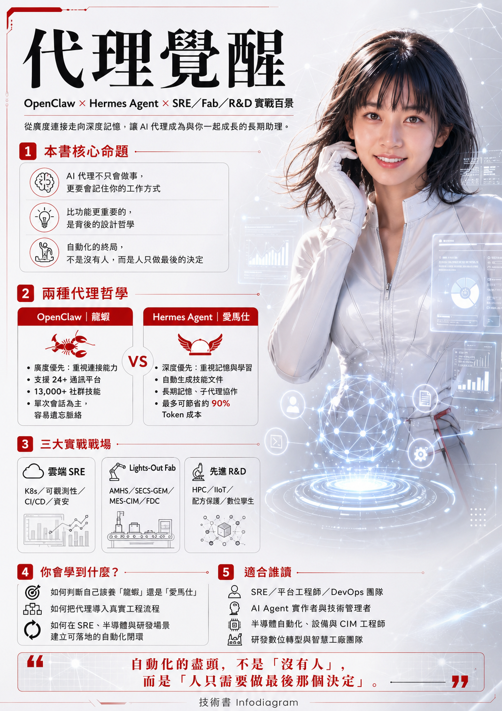

# 《代理覺醒》
### ——龍蝦 OpenClaw 與 Hermes Agent，以及 SRE／Fab／Lab 實戰百景



> 全書合併版。內容彙整自一份公開技術搜尋資料(OpenClaw / Hermes Agent 比較 + SRE/Fab 實戰情境)。


---

## 目錄

- 序　當「養龍蝦」變成一句嘆息

**第一篇　兩種哲學**

- 第1章　棄蝦養馬：一場開源代理的世代交替
- 第2章　龍蝦 OpenClaw：廣度優先的自動化先驅
- 第3章　Hermes Agent：會自我進化的長期助理

**第二篇　開機儀式**

- 第4章　一行指令的召喚：從 Linux 到 Windows 原生

**第三篇　角色①：雲端 SRE 的百景戰場**

- 第5章　網路與流量治理：在告警風暴中看見真相
- 第6章　K8s 叢集：節點、排程與自癒
- 第7章　儲存與資料庫：一致性與爆滿的戰爭
- 第8章　可觀測性：別讓眼睛沾滿沙子
- 第9章　CI/CD 與發布：把爆炸半徑關進籠子
- 第10章　資安攻防：把反應時間壓到秒級
- 第11章　多雲治理：在接縫處築壩
- 第12章　韌性與混沌：系統的安全氣囊
- 第13章　FinOps：有溫度的省錢管家
- 第14章　資料治理與 No-Ops 終局：通往無人值守的聖殿

**第四篇　角色②：半導體 Lights-Out Fab 的鋼鐵戰場**

- 第15章　AMHS 與天車：頂棚上的交通指揮
- 第16章　機台通訊：SECS/GEM 的毫秒疏洪
- 第17章　黃光與光罩：曝光前的最後防線
- 第18章　製程腔體：蝕刻、沉積與 CMP 的防呆
- 第19章　量測與檢測：大數據洪流中的火眼金睛
- 第20章　MES/CIM 大腦：派工與腦裂的搶救
- 第21章　廠務與特氣：看不見的環境守護
- 第22章　機械手臂與爐管：預測性維護的微秒秒錶
- 第23章　工業資安：物理斷網的最後防線
- 第24章　FDC、良率與 Lights-Out 終局：完美的百大閉環

**第五篇　角色③：先進中央實驗室 R&D 的埃米級戰場**

- 第25章　原子層製程：埃米級的呼吸節奏
- 第26章　配方大腦：黃金配方的端到端守護
- 第27章　跨國研發大動脈：HPC 與多雲協同
- 第28章　模擬大腦：分子動力學與量子運算
- 第29章　埃米計量：橢偏儀與電子束的火眼
- 第30章　地端 IIoT：毫秒世界的邊緣自治
- 第31章　研發資安：核心 IP 的零信任堡壘
- 第32章　研發良率：用無數高貴晶圓換來的防護網
- 第33章　高危化學：為極致瘋狂築起安全大壩
- 第34章　數位孿生與研發 No-Ops 終局：實驗室的自癒聖殿
- 附錄A　三角色 300 情境總索引
- 附錄B　開源工具速查
- 附錄C　現實校準：一個資深工程師對「百景」的補課


---


## 序　當「養龍蝦」變成一句嘆息

二〇二五年底，一隻「龍蝦」在 GitHub 上爆紅。

牠的本名叫 **OpenClaw**，由開發者 steipete 發起，是一套基於大型語言模型的開源 AI 代理（AI Agent）框架。因為英文 *Claw*（爪）的諧音與社群的暱稱，大家親切地叫牠「龍蝦 🦞」。一時之間，「在自己電腦上養一隻龍蝦」成了開發者圈的顯學——有人專門提供「龍蝦安裝服務」，幫你部署環境、調參數；沒過多久，連「龍蝦卸載服務」都出現了。

卸載服務的出現，本身就是一個耐人尋味的訊號。

因為人們很快發現，龍蝦雖然能同時串起 Telegram、LINE、Slack、微信等二十幾種通訊軟體，背後又靠著龐大的社群技能庫 ClawHub 快速接上各種網路服務，**廣度驚人**；但牠有兩個致命的痛點：**牠每天都失憶**——昨天教過牠的偏好，今天就忘光；以及隨著生態擴大，社群外掛裡開始混入惡意程式碼，系統又頻繁更新、動不動就崩。於是每次對話都要重新餵一遍上下文，Token 費用居高不下；每次更新都像拆炸彈。

就在龍蝦撞上瓶頸時，網路上悄悄颳起一股「**棄蝦養馬**」的風潮。

那匹「馬」，是由知名 AI 研究機構 **Nous Research** 推出的 **Hermes Agent（愛馬仕 🐴）**。牠的官方標語只有一句話——**「The agent that grows with you」（與你一同成長的代理）**。牠最大的亮點，是會把每一次幫你解過的複雜任務，自動萃取、整理成一份「技能文件（Skill File）」，下次遇到類似的活，直接調用，不必你重講一遍。**越用越省錢，越用越聰明。**

---

這本書，就是寫給站在這個十字路口的你。

它不是一篇行銷文，也不是哪一邊的傳教手冊。它想做三件事：

- **第一篇　兩種哲學**：把龍蝦與愛馬仕拆開來看——不是比誰的功能多，而是看清牠們背後兩種**完全不同的設計信仰**：一個賭「廣度與連接」，一個賭「深度與記憶」。看懂了哲學，你才知道自己該養哪一隻。
- **第二篇　開機儀式**：一行指令如何把一個會自己寫程式、自己跑指令的代理裝進你的電腦——從 Linux／macOS／WSL2 到 Windows 原生，連坑都幫你標好。
- **第三篇　實戰百景**：這才是全書的重頭戲。我們借一位 **Google L7 Staff Engineer 兼資深 SRE** 的視角，走進分散式系統那片「布滿地雷的沼澤」，看 Agent 如何在多雲網路、金絲雀發布、混沌工程、資安黃金救援、FinOps 省錢、資料庫死鎖這些真實戰場上，把「黑盒子猜測」變成「視覺化決策」。

> 💡 這本書怎麼讀
> 每一個實戰情境都用同一副骨架拆給你看：**背景 → 問題 → 需要的技能 → 需要的開源工具 → 用到的 Agent 特性 → 沒有 Agent 為什麼不方便 → 帶來的效益**，最後再附上一句「君之一席話」的 take away。
> 你可以照順序讀完整套哲學，也可以直接翻到某個讓你半夜睡不著的情境——每一景都自成一篇，獨立成立。

技術會過時，框架會改名，龍蝦和愛馬仕說不定明年就被第三隻動物取代。但這本書真正想留給你的，不是某個工具的安裝指令，而是一個觀念：

**自動化的盡頭，不是「沒有人」，而是「人只需要做最後那個決定」。**

翻過這一頁，我們先從那場「棄蝦養馬」的世代交替講起。

---


# 第一篇　兩種哲學

# 第1章　棄蝦養馬：一場開源代理的世代交替

## 兩隻動物，兩種信仰

如果你最近泡在開源 AI 圈，大概很難躲開這兩個名字：**OpenClaw（龍蝦 🦞）** 與 **Hermes Agent（愛馬仕 🐴）**。牠們是目前開源 AI 代理領域裡最火熱的兩大框架，而牠們代表的，是兩種**完全不同的 AI 助理設計哲學**。

把牠們並排放在一起，差異一目了然：

| 維度 | 🦞 OpenClaw（龍蝦） | 🐴 Hermes Agent（愛馬仕） |
|------|------------------|------------------------|
| 核心信仰 | **廣度優先**：能連的越多越好 | **深度優先**：側重自主學習與長期記憶 |
| 通訊平台 | 支援高達 **24+** 種通訊軟體群組 | 支援 Telegram、Discord 等 **6** 大主力平台 |
| 技能系統 | 人工編寫，社群提供 **13,000+** 現成技能（ClawHub） | AI 根據你的工作流程**自動寫出**技能 |
| 記憶 | 單次會話為主（Stateless），容易忘記上下文 | 長期記憶，越用越懂你 |
| 成本 | 每次都要重新餵脈絡，**Token 費用較高** | 優化解題流程，實測可省下高達 **90%** Token 費 |
| 安全 | 曾爆出多個漏洞、ClawHub 有惡意代碼風險 | 架構相對安全，著重沙盒與權限控制 |

這張表，基本上就是「棄蝦養馬」這四個字的全部理由。

## 龍蝦的崛起：連接器的黃金年代

先說句公道話：龍蝦的爆紅不是偶然。

在 AI 代理還是個新詞的年代，OpenClaw 做對了一件最重要的事——**它把「連接」這件事做到了極致**。它的核心是一個強大的「控制平面（Control Plane）」，能同時串聯大量的通訊平台，再透過社群技能庫 ClawHub，把各種網路服務快速接起來。

對一個剛想嘗鮮的人來說，這個體驗近乎魔法：你在 Telegram 跟牠說一句話，牠能去操作你的 LINE、發一封 Slack、查一筆微信群的訊息。它像一隻有二十幾隻爪子的章魚，每隻爪子都抓著一個你日常在用的服務。

**廣度，就是龍蝦的全部魅力。**

## 棄養潮：當廣度撞上現實的牆

但魔法褪色得很快。隨著越來越多人把龍蝦「養」進日常工作流，兩道牆迎面而來：

- **第一道牆——失憶**。龍蝦每次對話就像剛出生一樣：昨天教過牠「我的專案在這個目錄、我習慣用這套部署流程」，今天牠又一臉茫然地問你一遍。對偶爾玩玩的人這只是小煩；但對天天靠牠幹活的人，這意味著**每一次都要重新餵上下文**，而每一次餵上下文，都是真金白銀的 Token 在燒。
- **第二道牆——崩與毒**。生態越大，ClawHub 上的社群外掛就越雜。開始有外掛被驗出夾帶惡意軟體；加上系統頻繁更新，常常一更新就把使用者自己的環境搞掛、跑出嚴重 BUG。

於是網路上的風向變了。「別再修龍蝦了」「丟掉你的龍蝦」這類標題開始洗版，社群裡那句半開玩笑的口號越喊越響——

> 💡 君之一席話
> **「養龍蝦」的本質，是把一隻廣度驚人、卻患有失憶症的章魚請進家門。**
> 牠能幫你接上全世界的服務，卻記不住你昨天說過的話。當嘗鮮的興奮退去、Token 帳單寄到，人們要的不再是「能連多少」，而是「能不能越用越省、越用越懂我」。

## 愛馬仕的逆襲：會自我進化的長期助理

Hermes Agent 的賣點，恰恰是龍蝦的兩道痛牆。

牠由 Nous Research 推出，官方那句「The agent that grows with you」不是口號，而是架構：當牠幫你完成一次複雜任務，**牠會自動把整個解題步驟萃取、整理成一份技能文件**。下次遇到類似任務，直接調用，不需要你重新解釋。這就是為什麼實測能省下高達九成的 Token——因為**重複的脈絡只需要被「學會」一次**。

更狠的是，牠可以幫你生出獨立的「子 Agent（Sub-Agent）」，每個子 Agent 擁有自己的對話上下文、獨立終端和 Python RPC 指令碼，同時幫你跑不同的工作流。一隻馬，能裂變成一支隊伍。

它能跑地端模型（如 Gemma、Llama），也支援雲端 API（OpenAI、Claude、OpenRouter）——這一點上牠和龍蝦其實站在同一條起跑線：都能本地、都能雲端。差別從來不在「能不能跑模型」，而在**跑完之後，牠記不記得**。

## 所以，你該養哪一隻？

別急著選邊。這本書接下來會花兩章，分別把龍蝦的「廣度」與愛馬仕的「深度」拆到最細，再用一張六維度的表把牠們正面擺上擂台。

但先記住一個判斷的起點：

- 如果你的需求是**廣**——要同時串很多平台、要現成技能拿來即用、要的是一個「萬能轉接頭」——龍蝦的生態仍然無人能及。
- 如果你的需求是**深**——要一個天天陪你、記得住你的習慣、越用越省錢的長期管家——那股「棄蝦養馬」的風潮，吹的就是你。

下一章，我們先走進龍蝦的世界，看牠那二十幾隻爪子，究竟是怎麼把混亂的數位世界，一把抓在手裡的。

---


# 第2章　龍蝦 OpenClaw：廣度優先的自動化先驅

## 一隻有二十四隻爪子的章魚

要理解龍蝦，先理解牠想解決的那個古老痛點：**你的數位生活，被切成了幾十座孤島。**

你的客服在 LINE，你的團隊在 Slack，你的家人在微信，你的社群在 Telegram，你的工單在某個網頁後台。每一座島都要你親自划船過去。OpenClaw 的回答簡單而粗暴——**那就造一個能同時靠岸所有島的港口。**

這個港口，就是牠的核心：一個強大的「控制平面（Control Plane）」，對外能同時串聯高達 **24 種以上**的通訊軟體群組（Telegram、LINE、Slack、微信……），對內則接上一座龐大的社群技能庫。龍蝦於二〇二五年底推出後，正是靠這套「廣度優先」的打法，在 GitHub 上以極快的速度爆紅。

## ClawHub：一萬三千把現成的瑞士刀

如果說多平台連接是龍蝦的左手，那 **ClawHub** 就是牠的右手。

ClawHub 是龍蝦的社群技能市集。它的數字很驚人：社群提供了 **超過 13,000 個現成技能（Skills）**。要讓龍蝦會發郵件、會查天氣、會操作某個 SaaS、會跑某段運維腳本？多半不用自己寫——去 ClawHub 抓一個現成的裝上就行。

這就是龍蝦的設計哲學落到實處的樣子：

- **技能靠人工編寫**：每一個 Skill 都是社群裡某個人，為了某個具體需求，親手寫出來、分享出來的。
- **拿來即用**：你不必懂它怎麼實作，裝上、串好，龍蝦就多了一隻爪子。

對「想快速串起各種網路服務」的人來說，一萬三千把現成的瑞士刀擺在面前，這種爽快感是其他框架短期內難以複製的。

> 💡 君之一席話
> **龍蝦的強大，是一種「生態的強大」，不是「個體的聰明」。**
> 牠不靠自己想出怎麼做，而靠社群早就有人替牠想好了。這讓牠在「廣度」上幾乎無敵——但也埋下了牠後來最大的隱憂：**當技能來自一萬三千個陌生人，你怎麼確定每一把刀，刀柄裡沒有藏毒？**

## 廣度的代價：失憶、惡意外掛、與頻繁的崩潰

魔法的另一面，是帳單。把龍蝦從「玩具」養成「日常工具」的人，普遍撞上三件事：

- **痛點一・失憶（Stateless）**：龍蝦以單次會話為主。每一次對話，幾乎都像重新認識你一次。昨天教過的偏好，今天得再教一遍。對天天用牠的人，這直接翻譯成兩個字——**燒錢**：每次都要重新餵脈絡，Token 費用居高不下。
- **痛點二・毒外掛（ClawHub 風險）**：生態擴大的代價，是品質失控。社群外掛裡開始出現夾帶惡意代碼的 Skill。你以為裝的是一把瑞士刀，裝進來的可能是一隻木馬。
- **痛點三・頻繁崩潰**：系統更新節奏快，常常一更新就把使用者自己辛苦配好的環境搞掛，跑出嚴重 BUG。於是社群裡流傳著各種「容易忘記步驟、把自己搞掛、每次更新就出大 BUG」的窘況。

這三件事疊在一起，就是「龍蝦卸載服務」會出現的原因，也是下一章主角登場的理由。

## 但別急著看扁牠——廣度，在某些戰場上就是王道

說了這麼多痛點，本書要在這裡為龍蝦做一個重要的辯護，而這個辯護，會貫穿整個第三篇：

**在某些場景裡，「廣度」與「連接」本身，就是最稀缺的能力。**

想像一場大規模的線上事故：告警同時炸在 Slack 的 SRE 頻道、Telegram 的架構師群、微信的主管群。這時候，一個「記性好但只會待在一個房間」的助理，遠不如一個「能同時站在所有房間、把混亂的多方戰場瞬間梳理成一張圖」的連接器。

龍蝦的 **Multi-Channel Gateway（多平台同步）** 與 **ClawHub 現成外掛生態**，正是為這種「需要大規模多方通訊 + 現成工具快速串接」的混亂戰場而生。在第三篇的多雲網路、金絲雀發布、混沌工程、跨團隊排障裡，你會反覆看到牠把泥淖中的地雷一顆顆排掉。

所以這本書的立場是：**龍蝦不是被淘汰，而是被放回了牠最該待的位置——當一個無與倫比的「連接器」。** 至於那個「會記憶、會自學、會省錢」的位置，留給下一章的馬。

---


# 第3章　Hermes Agent：會自我進化的長期助理

## 一句 Slogan 撐起一整套架構

Hermes Agent 的官方標語只有一句話：

> **The agent that grows with you.（與你一同成長的代理。）**

別把它當行銷詞。這句話幾乎定義了 Hermes 與龍蝦最根本的分歧——龍蝦賭「連接的廣度」，Hermes 賭「成長的深度」。牠由知名 AI 研究機構 **Nous Research** 推出（坊間因「愛馬仕」的諧音暱稱牠為 🐴），主打的不是「能連幾個平台」，而是「**用得越久，越懂你、越省你的錢**」。

## 自動寫技能：把「解過的題」變成「會的題」

Hermes 最大的亮點，是一個聽起來簡單、做起來顛覆的機制：

**當牠幫你完成一次複雜任務後，牠會自動把這個解題步驟萃取、整理成一份「技能文件（Skill File）」。**

下次遇到類似任務，牠直接調用這份文件，不需要你重新解釋。

把這個機制和龍蝦對照，差異是哲學級的：

| | 🦞 龍蝦的技能 | 🐴 Hermes 的技能 |
|---|---|---|
| 來源 | **人工編寫**，從 ClawHub 社群下載現成的 | **AI 自動寫出**，根據你的真實工作流程 |
| 數量 | 13,000+ 把陌生人的瑞士刀 | 一把把「為你量身打造」的刀 |
| 成長 | 你裝多少，牠就會多少 | 你用越多，牠自己長出越多 |

這就是「越用越省錢」的祕密——**重複的脈絡，只需要被「學會」一次**。第一次你帶著牠走過一遍複雜流程，牠把流程寫成技能；往後同樣的活，不再需要你逐句重講。實測下來，這套機制可以省下高達 **90%** 的 Token 費用。龍蝦的失憶讓你每天重新付費，Hermes 的記憶讓你的投資逐日累積。

## 子 Agent：一匹馬，裂變成一支隊伍

Hermes 的第二把利器，是「派生子 Agent」。

牠可以幫你生出獨立的「子 Agent（Sub-Agent）」，同時幫你跑不同的工作流。關鍵在於這些子 Agent 不是花瓶——

**每個子 Agent 擁有自己的對話上下文、獨立的終端機，以及獨立的 Python RPC 指令碼。**

這意味著什麼？意味著你可以讓主 Agent 當「指揮官」，同時派出三匹子 Agent：一匹去跑測試、一匹去整理報表、一匹去盯著某個部署。彼此上下文隔離、互不污染，卻又向同一個指揮中心匯報。一個人的工作流，被攤平成一支並行的隊伍。

> 💡 君之一席話
> **龍蝦的成長靠「外掛」，Hermes 的成長靠「分裂與沉澱」。**
> 一個是不斷往身上掛別人寫好的工具，廣度暴漲但個體不變聰明；一個是把每次經驗沉澱成自己的技能、再裂變出隊伍去並行。前者像收集寶可夢，後者像養成一個會自己讀書的學徒。**用得越久，差距越大。**

## 不挑食的胃口：地端與雲端通吃

要破除一個常見誤解：很多人以為「能跑本地模型」是龍蝦的專利，其實不是。

Hermes Agent 和 OpenClaw 一樣，都是 AI Agent 框架，**都可以搭配本地模型跑，也都支援雲端 API**：

- **地端模型**：如 Gemma、Llama 3 等，資料不出本機，隱私自己掌握。
- **雲端 API**：OpenAI、Claude、OpenRouter 等，要更強的腦袋隨時切換。

所以選擇的關鍵從來不是「能不能跑模型」——這題兩邊都滿分。真正的分水嶺只有一道：**跑完一次任務之後，牠記不記得、會不會把這次經驗變成下次的本事。**

## 著重沙盒與權限：安全是設計，不是補丁

還記得龍蝦那個「ClawHub 可能藏毒」的隱憂嗎？Hermes 在這一點上走了相反的路。

相較於龍蝦曾爆出多個漏洞、社群外掛有惡意代碼風險，Hermes 的架構**相對安全，著重沙盒（Sandbox）與權限控制**。當技能是 AI 根據你的工作流自己寫的、在受控的沙盒裡跑的，那條「一萬三千個陌生人的供應鏈」風險，自然就被收斂掉了。

這也是為什麼，當「棄蝦養馬」從一句玩笑變成一股風潮時，背後其實是一個很理性的權衡：**用戶要的，從來不是更多的爪子，而是一個記得住、學得會、又不會反咬你一口的長期夥伴。**

---

哲學講完了。但哲學再美，裝不起來也是空談。下一篇，我們動手——看一行指令，怎麼把這樣一隻代理，真正請進你的電腦裡。

---


# 第二篇　開機儀式

# 第4章　一行指令的召喚：從 Linux 到 Windows 原生

## 開源管家，養在自己的電腦上

在動手之前，先把一件事說清楚：Hermes Agent（以及龍蝦）的本質，是「**讓你把一個 AI 助理養在自己電腦上的開源工具**」。你的對話記錄、你的技能、你的記憶，都存在你自己的機器裡，而不是某家公司的雲端。這是「自架（self-hosted）」的核心精神，也是這一整本書談的所有自動化能成立的前提——**因為它跑在你的環境裡，它才能真正幫你做事，而不只是聊天。**

## 類 Unix 環境：一行 curl 搞定

如果你在 **Linux、macOS、WSL2 或 Termux** 環境，安裝就是字面意義上的「一行指令」。在終端機貼上官方的安裝腳本：

```
curl -fsSL https://hermes-agent.nousresearch.com/install.sh | sh
```

（社群與官方文件中也常見到直接指向 GitHub 的等價腳本：`https://raw.githubusercontent.com/NousResearch/hermes-agent/main/scripts/install.sh`。）

裝完之後，跑一次引導設定：

```
hermes setup
```

它會一步步帶你配置兩件最關鍵的事：**你的 AI 模型**（要地端的 Ollama／Gemma／Llama，還是雲端的 OpenAI／Claude）、以及**你的通訊平台**（例如把牠接上你的 Telegram）。設定完，你就有了一個隨時待命、住在你終端裡的管家。

## Windows 原生：終於擺脫 WSL2 的枷鎖

過去，Windows 使用者要養這類 Agent，幾乎都得先裝 WSL2、Docker 或 Cygwin，門檻不低。**這件事已經改變了。**

Nous Research 官方已為 Windows 平台進行重構，解決了過去的字元編碼（UTF-8）與 Shell 指令相容性問題，讓 CLI、TUI 互動介面、通訊閘道（Gateway）以及「AI 自主編寫技能」等核心功能，都能在 **Windows 10／11 上原生、無感啟動**——**完全不需要 WSL2、Docker 或 Cygwin**。

你有兩條最簡單的路：

### 方法一・終端機一鍵安裝（PowerShell）

打開 **Windows Terminal**（不需要系統管理員權限），複製貼上官方的 Windows 原生安裝指令：

```
iex (irm https://hermes-agent.nousresearch.com/install.ps1)
```

這個腳本會自動把程式隔離安裝在 `%LOCALAPPDATA%\hermes\` 路徑下，並自動配置所需的 **Python、Node.js 獨立環境**，甚至內建一份輕量化的 **PortableGit（約 45MB）**，用來在背景無感運行 AI 產生的 Shell 指令。裝完，重開一個 PowerShell 視窗就能用。

### 方法二・桌面圖形介面（Hermes Desktop）

如果你完全不想碰命令列，社群與官方也推出了 **Hermes Desktop**——下載 Windows 專用安裝檔、執行即可。首次啟動時，它會在背景自動呼叫上述腳本，幫你把所有相容環境配好。之後你就能在一個精美的視窗介面（WebUI）裡直接切換模型、管理 AI 的記憶、新增技能。

## ⚠️ 一個你必須知道的小限制

Windows 原生版的完整度已經非常高，但有一個先天差異值得先擺在檯面上：

**如果你的主要目的，是讓 Agent 幫你「深度控制 Windows 系統、修改本地複雜的專案程式碼依賴」**——由於 Windows 的系統路徑與 POSIX（Linux）環境先天不同，AI 在執行複雜的本地自動化指令時，偶爾仍可能踩到微小的 Bug。

所以官方的建議很務實：

| 你的身分 | 建議環境 | 理由 |
|---------|---------|------|
| 純開發者（要 Agent 改 code、跑複雜本地自動化） | **WSL2** | 在終端自動化與程式專案整合上最為流暢 |
| 日常使用者（通訊管家、資料整理、串雲端 API） | **Windows 原生** | 已經完全夠用且非常穩定 |

> 💡 君之一席話
> **安裝門檻的崩塌，往往比功能本身更能決定一個工具的命運。**
> 當「養一隻會自己寫程式的 AI」從「先學會配 WSL2 + Docker」變成「貼一行 PowerShell」，這個工具的潛在使用者就從幾萬名工程師，瞬間擴張成幾億名 Windows 用戶。技術的普及，常常不是贏在更聰明，而是贏在更好裝。

---

裝好了，`hermes setup` 也跑完了，你的電腦裡現在住著一個會聽指令、會跑終端、會自己寫技能的代理。

接下來的問題只剩一個：**牠到底能在真實的戰場上，幫我們扛下什麼？**

翻開第三篇。我們要把這隻代理，丟進分散式系統那片布滿地雷的沼澤裡。

---


# 第三篇　角色①：雲端 SRE 的百景戰場

# 第5章　網路與流量治理：在告警風暴中看見真相

## 情境 1　多雲 BGP 路由抖動(Flapping)的跨大西洋救援

**背景**：你的服務橫跨 AWS（us-east-1）與 GCP（europe-west1），兩端以多條 IPsec/DirectConnect over Public Internet 互連，跨大西洋鏈路由三家 Transit Provider（Tier-1）承載。

**問題**：凌晨 03:17，歐美互連的某條 BGP Session 開始以每 90 秒一次的頻率 up/down，路由表瘋狂收斂。每一次 Flapping 都觸發一輪 BGP 收斂風暴，跨洋 RTT 從 78ms 暴衝到 410ms 又掉回，p99 延遲鋸齒狀劇烈震盪，連線重傳率飆到 14%。更致命的是，部分 Tier-1 啟動了 Route Dampening，把你的 Prefix 直接「懲罰」性壓制——歐洲用戶開始大面積看到 504。傳統監控只報「延遲高」，沒人知道根因是一條遠在愛爾蘭海底的 Session 在抽搐。

**需要的技能**：BGP 路徑分析與 AS_PATH 解讀、Route Dampening 機制、跨雲網路拓樸、時序相關性分析。

**開源工具**：BIRD、ExaBGP、`bgpdump`、Prometheus + `blackbox_exporter`。

**用到的 Agent 特性**：龍蝦 OpenClaw 透過 **本地腳本執行** 持續對接 RouteViews 與內部 ExaBGP 的 BGP update feed，當它偵測到同一 Prefix 在 5 分鐘內 withdraw/announce 超過 8 次，立刻在 `#noc-war-room` Slack 用 **Multi-Channel Gateway** 同步推到 PagerDuty 與企業微信，並附上一張它自動畫的 AS_PATH 抖動時序圖。它從 **ClawHub** 裝載 `bgp-flap-detective` 技能外掛，自動比對三家 Transit 的穩定度，判定「Provider C 的 Session 不穩定」，再派 **子 Agent** 去執行 Local-Pref 調整腳本，把流量 graceful 地切到 Provider A/B，並對 Provider C 暫時 AS-Path Prepending 降權。全程它在群組裡像個值班工程師一樣播報：「偵測到 Flapping → 已隔離 Provider C → 流量已切走 → RTT 回穩至 81ms」。

**沒有 Agent 的窘境**：值班 SRE 被叫醒，先花 10 分鐘確認不是自家機房問題，再 SSH 進邊界路由器一條條看 BGP neighbor，肉眼比對 `show ip bgp` 的時間戳，等他終於鎖定 Provider C，歐洲用戶已經 504 了 40 分鐘，客訴爆炸。

**效益**：MTTR 從 47 分鐘 → 70 秒；跨洋 p99 延遲震盪幅度收斂 92%；歐洲區錯誤率從 11% 壓回 0.3%。

> 💡 君之一席話
> 「網路的故障從不喊痛，它只是抖。能在第一次抖動裡聽見它的呻吟，才配談 SRE。」

> 🔍 進階點評──道路在哪裡
> 這個案例指向龍蝦未來最關鍵的一條路：從「告警轉述者」進化為「拓樸決策者」。但讓 Agent 真的去動 Local-Pref、去 Prepend，等於把 BGP 控制平面的方向盤交給它——這是信任邊界的硬核地帶。落地時的工程難題不是偵測，而是「回滾的可逆性」與「變更的爆炸半徑」：一次錯誤的 Local-Pref 可能把全洲流量吸進一條小水管。未來的道路，必然是 Agent 在沙盒拓樸中先跑一遍 What-If 模擬、拿到信賴區間，再對人類值班者請求「分級授權」。

## 情境 2　跨雲 BGP 宣告遭惡意路由劫持(BGP Hijacking)

**背景**：你們自持 AS 號與 /20 的 IP 區塊，對外 Anycast 宣告核心 API 入口，由多家上游承載。

**問題**：14:02，南美某用戶回報「憑證錯誤」。十分鐘內，東南亞、中東陸續出現 TLS 握手指向陌生 IP。真相令人脊背發涼：某個遠在他國的 AS 開始宣告你 /20 中一段更精細的 /24，憑藉 Longest Prefix Match，把約 23% 的全球流量「吸」進了它的黑洞——這是一場教科書級的 BGP Hijacking。被劫持的流量正被中間人嘗試 TLS 降級，你的 RPKI 還沒全量部署，部分上游不驗 ROA。每一秒，都有真實用戶的請求被導向攻擊者。

**需要的技能**：RPKI/ROA 機制、IRR 路由註冊、BGP Looking Glass 排查、CERT/上游應急溝通流程。

**開源工具**：RIPE Routinator（RPKI Validator）、`bgpq4`、ExaBGP、BGPalerter。

**用到的 Agent 特性**：龍蝦透過 **本地腳本執行** 訂閱 BGPalerter 與 RIPE RIS Live 的 stream，偵測到「非授權 AS 宣告我方 /24」的 hijack 事件，0 秒內在 **Multi-Channel Gateway** 同步炸響 Slack、Teams 與電話橋接會議，標題直接寫「⚠️ 疑似 BGP Hijack：AS{X} 正宣告 198.51.100.0/24」。它從 **ClawHub** 載入 `rpki-incident-responder` 外掛，自動：(1) 比對 ROA 確認該宣告 Invalid，(2) 生成一份要發給三家上游的 NOC 工單草稿與標準措辭，(3) 派 **子 Agent** 立即宣告更精細的 /25 對沖（以更長 prefix 奪回流量），同時呼叫上游 API 觸發 ROA-based filtering。它把整條時間軸貼進戰情室：「劫持確認 → 已發三家上游工單 → /25 對沖已宣告 → 受影響流量回收 88%」。

**沒有 Agent 的窘境**：人類得先說服自己「這真的是劫持，不是 DNS 問題」，再翻出三家上游半年沒更新的 NOC 聯絡人 email，逐封手寫求救信，等對方上班、等對方相信你。Hijack 平均要 3 小時才止血，這 3 小時足以讓無數憑證被竊。

**效益**：劫持確認到開始對沖 < 90 秒（業界平均 1～3 小時）；被劫持流量曝險時間從數小時壓到 4 分鐘；事後 RPKI ROA 覆蓋率被 Agent 自動補到 100%。

> 💡 君之一席話
> 「BGP 是建立在『大家都不說謊』的善意上的協議。而 Agent 的價值，正是替你在所有人都可能說謊的世界裡，守住那條最該被驗證的邊界。」

> 🔍 進階點評──道路在哪裡
> 路由劫持的響應，把龍蝦推向一個微妙的角色：跨組織的自動協商者。它要替你發工單給上游、要觸發對方的 filtering——這已經跨出你的信任域，進入「Agent 對 Agent」的外交場域。未來的道路是 PeeringDB 與 NOC 流程的 API 化、機器可讀化，讓龍蝦能在毫秒級完成過去靠人情與郵件維繫的應急協作。但這也埋著最深的信任地雷：一個被攻陷的 Agent，若能自動發 /25 宣告，本身就是完美的劫持武器。所以這條路的盡頭，必然是密碼學簽章的意圖（signed intent）與多方審計。

## 情境 3　多區域(Multi-Region)極端天災下的全球流量乾坤大挪移

**背景**：你的服務部署於 5 個地理區域（北美、歐洲、東亞、南亞、澳洲），以 GeoDNS + 健康檢查做就近路由，各區互為備援。

**問題**：颱風直撲東亞主資料中心，氣象預警 90 分鐘後登陸，市電與柴油發電皆有 risk。同時東京區的 PUE 監控顯示冷卻系統已亮黃燈。你面對的不是「機房掛了」，而是更難的「機房『即將』掛掉」這種灰色地帶——現在切走，可能虛驚一場、浪費一次大遷移；不切，可能在斷電瞬間丟掉 40 萬在線連線。東亞區承載全球 31% 流量，一旦硬切，南亞與澳洲區的剩餘容量只夠吸收一半。

**需要的技能**：容量規劃與 Headroom 計算、GeoDNS/加權路由、連線排空(Connection Draining)、跨區資料一致性權衡。

**開源工具**：CoreDNS（含 geoip 外掛）、Envoy、Karmada（多叢集編排）、Prometheus。

**用到的 Agent 特性**：龍蝦的 **子 Agent** 持續監看各區即時 QPS 與剩餘容量 Headroom。它從 **ClawHub** 載入 `graceful-region-evacuation` 外掛，在收到氣象 API 的登陸倒數後，自動計算一張「分階段撤離排程」——不是硬切，而是每 5 分鐘把東京區 8% 的流量用加權 DNS 平滑遷出，優先導向 Headroom 最大的澳洲與南亞區，並對東京區開始 Connection Draining。它用 **Multi-Channel Gateway** 把這張排程同步給 SRE 主管、DBA 與業務 OnCall，附上「若 60 分鐘內完成撤離，東亞用戶 p99 影響 < 30ms；若硬切，預估丟 38 萬連線」的量化對比，請人類按下「批准漸進撤離」。批准後，**本地腳本執行** 逐階段推進 DNS 權重與 Envoy 路由，全程播報遷移進度條。

**沒有 Agent 的窘境**：主管在「切還是不切」之間糾結 20 分鐘，靠經驗拍板硬切，瞬間 DNS TTL 沒收斂，南亞區被打爆觸發連鎖過載，原本一個區的天災變成兩個區的雪崩。

**效益**：遷移從「賭一把的硬切」變成 60 分鐘可控漸進；連線丟失從預估 38 萬 → 1.2 萬；跨區過載連鎖事故 0 起；事後證明颱風確實導致東京區斷電 22 分鐘——這次撤離救回了一整晚的營收。

> 💡 君之一席話
> 「最高明的容災，不是切得多快，而是切得多『輕』。乾坤大挪移的精髓，從來是讓人感覺不到挪移。」

> 🔍 進階點評──道路在哪裡
> 這個場景把龍蝦推向「預測性運維」的深水區：它不是在響應故障，而是在響應一個尚未發生、只有機率的故障。這條道路最迷人也最危險——當 Agent 開始基於預測主動動全球流量，它的每一次「未雨綢繆」都有可能是「庸人自擾」。落地的核心工程問題是預測信賴度的量化與成本對齊：每次大遷移都有真金白銀的成本，Agent 必須學會把「天災機率 × 損失」與「遷移成本」放進同一個損益函數。未來真正成熟的形態，是龍蝦能對你說：「我有 73% 把握該撤，撤的期望收益是正的」——把運維變成可審計的決策科學。

## 情境 4　DNS 服務商遭 DDoS 時的全球 Anycast 智慧逃生

**背景**：你的權威 DNS 託管在某大型商用 DNS 商，並在自家 Anycast 網段部署了一組備援權威伺服器，採雙 NS 委派。

**問題**：21:40，商用 DNS 商遭遇針對其 Anycast 基礎設施的 1.2 Tbps DNS 反射放大攻擊。雖然攻擊不是衝著你，但你的域名解析成功率從 99.99% 雪崩到 61%——用戶不是看到錯誤頁，而是「網站打不開、連 IP 都解不出來」這種最讓人抓狂的全黑。更陰險的是，DNS 故障在應用層幾乎隱形：你的 APM 顯示「請求量下降」，看起來像流量自然回落，沒人第一時間意識到是解析掛了。這正是經典的 Grey Failure。

**需要的技能**：DNS 解析鏈路排查（dig +trace）、Anycast 與 NS 委派機制、TTL 策略、第三方依賴熔斷。

**開源工具**：CoreDNS、NSD/Knot DNS（自建權威）、`dnsperf`、`dnstop`。

**用到的 Agent 特性**：龍蝦從外部 vantage point 用 **本地腳本執行** 跑分散式 `dig` 探測，偵測到「商用 DNS 商的 NS 解析成功率 < 70% 且持續 90 秒」，立刻判定第三方 DNS 故障，而非自家應用問題——這是它最值錢的判斷。它從 **ClawHub** 載入 `dns-failover-pilot` 外掛，自動：(1) 在 **Multi-Channel Gateway** 同步告警並點名「根因是上游 DNS 商被 DDoS，非我方故障」，避免全公司誤往應用層查，(2) 派 **子 Agent** 把域名委派權重切向自家 Anycast 上的 Knot DNS 備援，並把關鍵記錄 TTL 從 300s 動態降到 30s 以加速收斂，(3) 持續監測商用商恢復後再平滑切回。

**沒有 Agent 的窘境**：值班團隊在 APM 上看「流量莫名下降」查了半小時應用與資料庫，毫無頭緒，直到有用戶在推特罵「你家網站解析不了」才恍然大悟。第三方 DNS 故障的平均誤判排查時間超過 40 分鐘，期間幾乎所有新訪客都進不來。

**效益**：根因定位從 40 分鐘 → 90 秒；解析成功率從 61% 在 4 分鐘內拉回 99.9%；避免了整個團隊往錯誤方向排查的巨大內耗——「知道不是自己的錯」本身就是黃金。

> 💡 君之一席話
> 「DNS 是網際網路的電話簿。電話簿被燒了，你的電話再好也沒人打得進來——而最可怕的是，你的儀表板還顯示『一切正常，只是比較安靜』。」

> 🔍 進階點評──道路在哪裡
> 這個案例揭示了龍蝦的一條核心道路：成為「依賴鏈的真相裁判」。Grey Failure 的本質是「故障發生在你的視野盲區，而你的儀表板替你撒了謊」。未來龍蝦最該長出的能力，是建構一張跨層、跨第三方的「依賴拓樸圖」，並對每個外部依賴持續做主動探測——把「流量下降」這種曖昧訊號，反向歸因到「上游 DNS 商」。落地的工程挑戰在於外部探測點的覆蓋與可信度：你需要遍布全球的 vantage points，且不能讓 Agent 因為單一探測點故障而誤判。這條路的終點，是 SRE 從「查自己」進化到「Agent 替你查整條供應鏈」。

## 情境 5　Edge WAF 遭大規模 CC 攻擊的智慧指紋動態清洗

**背景**：你的邊緣以開源 WAF + 反向代理承載入口流量，搭配速率限制與 Bot 管理。

**問題**：促銷開賣前 8 分鐘，登入與下單 API 的 QPS 從 1.2 萬突增到 27 萬。這不是真實用戶——是一波分散式 CC（Challenge Collapsar）攻擊，來自 6 萬個住宅代理 IP，每個 IP 行為都「像人」：完整 TLS 握手、帶 Cookie、低頻請求，傳統的 IP 速率限制完全失效，因為沒有任何單一 IP 超標。後端資料庫連線池被打滿，真實用戶的下單請求開始排隊超時。封 IP 是打地鼠，放著是被打死。

**需要的技能**：HTTP/TLS 指紋（JA3/JA4）分析、行為基線建模、自適應速率限制、誤殺率(False Positive)控制。

**開源工具**：Coraza WAF（OWASP）、CrowdSec、Envoy、`nfdump`/`GoAccess`。

**用到的 Agent 特性**：龍蝦的 **子 Agent** 持續對入口流量做 JA3/JA4 TLS 指紋聚類，偵測到「27 萬 QPS 中有 19 萬共享同一組罕見 JA4 指紋且 User-Agent 熵異常低」，瞬間鎖定攻擊指紋簇。它從 **ClawHub** 載入 `adaptive-cc-mitigation` 外掛，動態生成一條精準清洗規則——不封 IP，而是針對該指紋簇插入 JS Challenge 與漸進式速率限制，並把規則先以 1% 流量灰度驗證誤殺率 < 0.2% 後再全量下發到 Coraza WAF。它用 **Multi-Channel Gateway** 把「攻擊指紋、清洗規則、實時誤殺率」儀表板同步進 `#security-oncall`，並由 **本地腳本執行** 每 30 秒重算一次指紋簇——因為攻擊者會變形，它就跟著變。整場像一場貓鼠對弈的直播。

**沒有 Agent 的窘境**：安全值班看到 QPS 暴漲，第一反應是手動加 IP 黑名單，封了幾百個 IP 毫無效果（住宅代理池有 6 萬個）；接著情急之下加了一條粗暴的全局速率限制，把大量真實搶購用戶一起誤殺，客訴與攻擊同時把你淹沒。

**效益**：攻擊識別到精準清洗 < 45 秒；惡意流量過濾 96%，真實用戶誤殺率控制在 0.18%；資料庫連線池占用從 100% 回落到 34%；促銷正常開賣，零營收損失。

> 💡 君之一席話
> 「對付偽裝成人類的機器人，最蠢的辦法是封 IP，最聰明的辦法是讀懂它的『口音』——指紋不會說謊，而它撒謊的方式本身就是指紋。」

> 🔍 進階點評──道路在哪裡
> CC 攻防把龍蝦推向「實時對抗學習」的最前線。這條道路的本質是一場軍備競賽：你的 Agent 用指紋聚類，攻擊者就用指紋隨機化反制。未來龍蝦最該演化的，是從「規則生成器」變成「在線博弈者」——持續觀測對手對自己每一條清洗規則的反應，動態調整策略。但這裡藏著最尖銳的工程倫理問題：誤殺率。一條過激的規則可以瞬間擋掉攻擊，也可能瞬間擋掉你最忠實的付費用戶。落地的關鍵是把「灰度驗證 + 誤殺率紅線 + 自動回滾」鑄成不可繞過的安全護欄。真正成熟的龍蝦，敢於在攻擊高峰時對你說「這條規則誤殺率超紅線，我選擇不下發」——克制，才是自動化最難的美德。

## 情境 6　CDN 回源風暴(Origin Storm)下的快取雪崩防護

**背景**：你的靜態與半動態內容由多家 CDN 分發，源站集中在兩個 Region，快取命中率長期維持 97%。

**問題**：某熱門商品頁的快取在同一秒集中過期（你犯了經典錯誤：大批 Key 設了相同 TTL）。下一秒，全球 CDN 邊緣節點的快取同時 Miss，數十萬請求像海嘯一樣同時回源（Cache Stampede / Origin Storm）。源站 QPS 從 3 千瞬間飆到 18 萬，源站 Nginx worker 連線耗盡，回源請求開始 5xx，而 5xx 又被部分 CDN 短暫快取，形成「錯誤頁被快取 → 用戶全看到錯誤」的二次雪崩。命中率從 97% 崩到 12%。

**需要的技能**：快取失效策略（TTL 抖動/Jitter）、回源合併(Request Coalescing)、Stale-While-Revalidate、源站保護與限流。

**開源工具**：Varnish、Nginx、Apache Traffic Server、`mtail`。

**用到的 Agent 特性**：龍蝦透過 **本地腳本執行** 監看源站回源 QPS 與快取命中率，偵測到「命中率 600 秒內掉 80 個百分點 + 源站 5xx 抬頭」即判定 Origin Storm。它從 **ClawHub** 載入 `cache-stampede-shield` 外掛，立即三連動作：(1) 在 CDN 與 Varnish 層緊急開啟 Request Coalescing，把同一 Key 的萬筆並發回源合併成 1 筆，(2) 對熱點 Key 啟用 Stale-While-Revalidate，先回舊快取頂住、背景非同步更新，(3) 派 **子 Agent** 掃出所有「同一秒過期」的 Key 群，自動為其 TTL 注入 ±10% 隨機抖動，根治同步過期。它用 **Multi-Channel Gateway** 同步把「源站 QPS 曲線、合併比、抖動修復進度」推給 SRE 與內容團隊。

**沒有 Agent 的窘境**：源站告警時，人類先以為是 DDoS，加了一堆防火牆規則毫無作用；折騰 25 分鐘才意識到是自家快取同步過期，再手動去 CDN 控制台一家一家開回源合併，等開完，源站已經被自己的用戶打趴了。

**效益**：回源風暴抑制 < 60 秒；源站峰值 QPS 從 18 萬削到 4 千（合併比 45:1）；命中率 3 分鐘內回到 96%；並透過 TTL 抖動讓同類事故的復發率歸零。

> 💡 君之一席話
> 「快取最危險的時刻，不是它失效時，而是它『整齊劃一地』一起失效時。整齊，是分散式系統裡最美也最致命的詞。」

> 🔍 進階點評──道路在哪裡
> Origin Storm 是一面照妖鏡，照出龍蝦的一條深層道路：從「滅火」走向「治本」。它不只在風暴中開回源合併，更回頭把「同步過期」這個結構性病根用 TTL 抖動根治——這是 Agent 從「應急響應」邁向「自動架構治理」的關鍵一步。未來這條路會延伸到「混沌驗證」：龍蝦不該等雪崩發生，而該定期主動注入小規模快取失效、量測源站的承壓曲線，提前找出下一個「同一秒過期」的隱患。落地挑戰在於 Agent 修改 TTL、改回源策略時對線上一致性的影響邊界——治本的手術刀，動的是活體系統。

## 情境 7　TCP 連線數靜默洩漏(Connection Leak)導致負載均衡器擊穿

**背景**：你的四層負載均衡（L4 LB）前置數百個後端 Pod，承載長連線為主的 gRPC 流量。

**問題**：一個剛上線的客戶端 SDK 有個隱蔽 bug：在特定錯誤路徑下不關閉 gRPC channel。沒有任何告警響起——QPS 正常、延遲正常、錯誤率正常。但 LB 上的活躍連線數以每小時 4 萬條的速度線性爬升，像溫水煮青蛙。47 小時後，LB 的 conntrack 表逼近 100 萬上限，新連線開始被靜默丟棄，部分用戶「偶發連不上、重試又好」——這種非確定性的 Grey Failure 最難復現、最難甩鍋，每個團隊都覺得「不是我的問題」。

**需要的技能**：conntrack/文件描述符監控、TCP 連線狀態機分析、容量趨勢外推、客戶端版本歸因。

**開源工具**：`conntrack-tools`、`ss`/`netstat`、Prometheus（趨勢預測）、`tcptrack`。

**用到的 Agent 特性**：龍蝦的 **子 Agent** 不看絕對值而看趨勢——它對 LB 的活躍連線數做線性回歸外推，偵測到「連線數呈持續單調上升、且與 QPS 解耦（連線漲但請求量平）」這一典型洩漏特徵，提前 6 小時告警。它從 **ClawHub** 載入 `conn-leak-hunter` 外掛，自動按來源 IP 段與 TLS SNI/User-Agent 聚合連線，精準定位「異常連線 91% 來自客戶端 SDK v2.4.1」，把鍋直接釘在版本上。它用 **Multi-Channel Gateway** 同步推給 SRE、平台與該 SDK 的維護團隊，附上「預計 9 小時後擊穿 conntrack 上限」的死亡倒數，並由 **本地腳本執行** 臨時對該 SDK 版本啟用連線數配額與閒置連線回收，先續命再修根。

**沒有 Agent 的窘境**：洩漏在 47 小時裡完全沉默，直到 LB 擊穿、用戶大面積連不上才爆發為 P1。值班團隊午夜被叫起，面對一個「沒有錯誤、沒有變更（bug 早在兩天前就上了）」的詭異現場，平均要 2 小時才從茫茫連線中揪出元兇 SDK 版本，期間還要平息各團隊互相甩鍋。

**效益**：洩漏在擊穿前 6 小時被預警（而非事後）；根因歸因從 2 小時 → 3 分鐘；通過連線配額把 LB 擊穿事故完全消滅在萌芽；跨團隊甩鍋會議減少 100%——因為 Agent 直接給了證據。

> 💡 君之一席話
> 「最危險的故障不會尖叫，它會微笑著、每小時漲四萬條連線，直到某個午夜把你的負載均衡器溫柔地掐死。」

> 🔍 進階點評──道路在哪裡
> 連線洩漏這類 Grey Failure，把龍蝦推向 SRE 最稀缺的能力：趨勢嗅覺。傳統告警是「閾值思維」——超過 X 就響；但洩漏的殺傷力恰恰在於它在觸線前的漫長潛伏。龍蝦的未來道路，是從「閾值告警」升級為「軌跡告警」：對關鍵資源做持續的趨勢外推與死亡倒數估算。落地的工程難點是誤報控制——線性外推很容易把正常的業務增長誤判成洩漏。真正的突破口，是讓 Agent 學會「解耦分析」（連線漲但 QPS 平 = 洩漏；連線漲且 QPS 也漲 = 正常增長）。這條路走到盡頭，SRE 面對的告警將不再是「已經爆了」，而是「還有 6 小時會爆，元兇是它」。

## 情境 8　mTLS 憑證過期引爆服務網格(Service Mesh)全鏈路靜默斷流

**背景**：你的微服務跑在 Service Mesh（Sidecar 代理）上，服務間以 mTLS 雙向認證，憑證由內部 CA 簽發、理應自動輪替。

**問題**：某個中間 CA 的憑證在凌晨 02:00 過期——而自動輪替的 CronJob 三週前因一次無關的 RBAC 變更被悄悄停掉了，沒人發現。憑證一過期，數百對服務間的 mTLS 握手全部失敗，但失敗的方式極其陰險：不是 5xx，而是 TLS handshake 層的連線重置，被各服務當成「下游暫時不可用」而瘋狂重試，重試風暴又進一步放大故障。應用日誌裡只有滿屏「connection reset」，沒有一條直接寫「憑證過期」。整個網格在 90 秒內從健康變成一鍋粥，而真相藏在最不起眼的 X.509 NotAfter 欄位裡。

**需要的技能**：X.509/PKI 與 mTLS 握手機制、Service Mesh 控制平面排查、重試風暴抑制、憑證生命週期管理。

**開源工具**：Istio/Linkerd、cert-manager、`step-cli`（smallstep）、`openssl s_client`。

**用到的 Agent 特性**：龍蝦從 **ClawHub** 載入 `cert-lifecycle-sentinel` 外掛，本就持續用 **本地腳本執行** 掃描網格內所有憑證的 NotAfter——它在過期前 14 天就該預警，但這次因 CronJob 被停而错过了輪替窗口。故障爆發瞬間，它把滿屏「connection reset」與「CA 憑證已在 02:00 過期」做關聯，0 秒定位真因，在 **Multi-Channel Gateway** 同步炸響並直接給出結論：「不是服務崩了，是中間 CA 憑證過期，且自動輪替 CronJob 已停 21 天」。它派 **子 Agent** 緊急用 step-cli 簽發臨時憑證、熱重載 Sidecar，並同時對重試風暴注入退避（backoff）與斷路器止血，再修復被停掉的輪替 CronJob，把「應急 + 治本」一次做完。

**沒有 Agent 的窘境**：全網格同時告警，值班 SRE 面對幾百個服務「互相說對方掛了」的羅生門，先重啟了一圈服務（無效），再懷疑網路、懷疑 DNS，折騰 50 分鐘才有人想到 `openssl s_client` 看一眼憑證——而那一眼，本可以是第一眼。

**效益**：根因定位從 50 分鐘 → 30 秒；全鏈路恢復從 90 分鐘 → 6 分鐘；並通過修復 CronJob 與補上「憑證過期前 14 天預警」根治復發；重試風暴被斷路器及時掐斷，避免了二次過載。

> 💡 君之一席話
> 「再宏偉的零信任架構，也敵不過一張悄悄過期的憑證。安全的反面不是攻擊，是『沒人記得它會過期』。」

> 🔍 進階點評──道路在哪裡
> 憑證過期是 SRE 界最古老也最頑固的「可預測的意外」——它有明確的過期日，卻總在過期日被遺忘。這個案例指向龍蝦的一條樸素卻極有價值的道路：成為系統裡那個「永不遺忘的記事本」。但更深的啟示在於：這次故障的真因不是憑證，而是「一個被無關變更悄悄關掉的 CronJob」——這是變更的二階效應。龍蝦未來真正該長出的能力，是建立「變更 → 受影響的隱性依賴」的因果圖：當有人改 RBAC 時，Agent 就該警告「這會停掉憑證輪替」。落地挑戰是這張因果圖的構建成本與準確性，但這正是 Agent 從「監控狀態」邁向「理解系統」的分水嶺。

## 情境 9　QUIC/HTTP3 升級後中間盒(Middlebox)誤封導致部分用戶靜默降級

**背景**：你為提升弱網體驗，在邊緣啟用了 HTTP/3（QUIC over UDP 443），並保留 HTTP/2 over TCP 作為回退。

**問題**：上線後一切儀表板「綠油油」——直到客服反映「某些地區用戶感覺特別慢」。真相是一場典型的 Grey Failure：部分運營商與企業防火牆的中間盒(Middlebox)不認識 QUIC，把 UDP 443 直接 silently drop。受影響用戶的瀏覽器在 QUIC 連不上後，要等握手超時才回退到 TCP，平白多了 800ms～3s 的「隱形延遲稅」。這些用戶不報錯、不超時、只是「莫名其妙地慢」，而你的服務端壓根看不到那些被中間盒吞掉的 UDP 包——故障發生在你完全失明的網路中段。

**需要的技能**：QUIC/HTTP3 協議與 0-RTT、UDP 可達性探測、Happy Eyeballs/回退策略、RUM（真實用戶監控）數據分析。

**開源工具**：`quiche`（Cloudflare）、`curl`（HTTP/3 支援）、HAProxy、Grafana + RUM。

**用到的 Agent 特性**：龍蝦的 **子 Agent** 交叉分析 RUM 數據，發現「HTTP/3 協商成功率在特定 ASN（運營商）下異常偏低、且這些用戶的連線建立耗時高出基線 1.4s」，鎖定是中間盒丟 UDP，而非服務端問題。它從 **ClawHub** 載入 `quic-reachability-probe` 外掛，從多地 vantage point 主動發 QUIC 探測包驗證 UDP 443 可達性，生成一張「按 ASN/地區的 QUIC 可達性熱力圖」。它用 **Multi-Channel Gateway** 把結論同步給 SRE 與前端團隊：「ASN-X/ASN-Y 的 UDP 443 被中間盒丟棄」，並由 **本地腳本執行** 對這些受影響網段下發策略——縮短 QUIC 回退超時、或直接對該 ASN 停發 Alt-Svc，讓用戶一開始就走 TCP，消除隱形延遲稅。

**沒有 Agent 的窘境**：服務端所有指標全綠，沒人相信「有問題」，客服的「感覺慢」被當成個案擱置數週。直到有工程師偶然在受影響網路下抓包，才發現 QUIC 包根本沒出去——而這種「服務端永遠看不到的中段丟包」，靠服務端日誌排查幾乎是無解的。

**效益**：隱形延遲問題定位從「數週懸案」→ 15 分鐘；受影響用戶連線建立耗時降低 1.4s（消除回退超時）；通過 ASN 級回退策略把 HTTP/3 的收益留給能用的用戶、把代價從不能用的用戶身上拿掉。

> 💡 君之一席話
> 「服務端看不見的丟包，才是最致命的丟包。你的儀表板全綠，不代表用戶的世界全綠——它只代表你的視野到此為止。」

> 🔍 進階點評──道路在哪裡
> QUIC 中間盒這個案例，把龍蝦推向一個服務端 SRE 最陌生的疆域：用戶側的真相。傳統 SRE 的視野止於服務端日誌，而越來越多的故障發生在「最後一哩」的網路中段——那裡你沒有日誌、沒有指標、只有用戶的沉默抱怨。龍蝦的未來道路，是把 RUM（真實用戶監控）與主動探測融合，建構一張「從用戶瀏覽器一路到源站」的端到端可達性視圖。落地的核心挑戰是探測點的部署密度與隱私邊界：你需要足夠多的真實用戶側信號，卻不能越界採集。這條路走通了，SRE 才算真正擁有「用戶的眼睛」。

## 情境 10　跨可用區(Cross-AZ)流量失衡引爆隱形雲帳單與單點過載

**背景**：你的 Kubernetes 叢集橫跨 3 個可用區(AZ)，服務間調用理應就近路由（Topology-Aware Routing），跨 AZ 流量是要按 GB 計費的。

**問題**：一次例行的 Service 配置變更，意外關閉了 Topology-Aware Hints。沒有任何功能告警——服務全部正常、延遲只悄悄漲了幾毫秒。但兩件事在暗處同時惡化：(1) 原本 90% 就近的調用，變成在 3 個 AZ 間均勻散射，跨 AZ 流量暴增 6 倍，每天悄悄多燒 3,200 美元雲費；(2) 更糟的是，某個熱門服務在 AZ-a 的副本因散射而承接了不成比例的跨區流量，p99 延遲在 AZ-a 緩慢劣化卻被全局平均值掩蓋。這是一場「帳單 + 性能」的雙重 Grey Failure，財務月底才會發現，性能要等用戶罵了才知道。

**需要的技能**：Kubernetes Topology-Aware Routing、雲計費模型（跨 AZ 流量費）、流量矩陣分析、配置漂移(Config Drift)檢測。

**開源工具**：Cilium（含 Hubble 流量觀測）、kube-state-metrics、`kubectl`、OpenCost。

**用到的 Agent 特性**：龍蝦從 **ClawHub** 載入 `topology-traffic-auditor` 外掛，用 Cilium Hubble 持續構建 AZ 間的流量矩陣，偵測到「跨 AZ 流量占比從 10% 跳到 61%」這一突變，並用 OpenCost 把它即時翻譯成「預計每月多燒 9.6 萬美元」——它讓性能問題長出了財務的痛感。它的 **子 Agent** 把這次突變與 30 分鐘前的一次 Service 配置變更做時間關聯，鎖定根因是「Topology-Aware Hints 被誤關」。它用 **Multi-Channel Gateway** 同步把「流量矩陣異變 + 每月成本影響 + 嫌疑變更」推給 SRE、平台與 FinOps 團隊，並由 **本地腳本執行** 在確認後一鍵恢復 Topology-Aware Routing 配置，同時把這條配置納入漂移監控防複發。

**沒有 Agent 的窘境**：性能那幾毫秒沒人在意，帳單要等到月底 FinOps 對帳時發現「跨 AZ 流量費莫名漲了 6 倍」才驚覺，而那時已經白燒了快 10 萬美元；再回頭翻一個月的變更記錄找元兇，大海撈針。性能與成本的 Grey Failure 平均潛伏 2～4 週才被發現。

**效益**：配置漂移從「潛伏一個月、燒掉 10 萬美元」→ 30 分鐘內偵測並修復；阻止了約 9.6 萬美元/月的隱形雲費；同時消除了 AZ-a 的單點過載隱患；並讓「成本」第一次變成 SRE 實時看得見的告警維度。

> 💡 君之一席話
> 「在雲上，最貴的故障往往不報警——它只是在月底，用一張帳單，安靜地告訴你這個月你的系統有多『慷慨』。」

> 🔍 進階點評──道路在哪裡
> 這個案例把龍蝦推向一條正在崛起的道路：FinOps 與 SRE 的融合。傳統運維只盯著「快不快、掛沒掛」，卻對「貴不貴」失明——而在雲時代，一行配置漂移就是真金白銀的失血。龍蝦的未來價值，是把每一個技術指標都翻譯成「美元/小時」的成本語言，讓 SRE 在按下回車前就看見決策的價格標籤。落地的核心工程挑戰，是構建準確的「配置變更 → 流量拓樸 → 雲計費」三層歸因鏈——這需要 Agent 同時讀懂 Kubernetes、網路與雲計費 API 三套語義。當龍蝦能對你說「這次變更會讓你每月多花 9.6 萬」，運維才算真正擁有了財務的清醒——而清醒，是對抗複雜度最後的、也是最稀缺的武器。

---


# 第6章　K8s 叢集：節點、排程與自癒

## 情境 11　ImagePullBackOff 的全局免疫(Cluster-wide Immunity)
**背景**：一個橫跨 3 個 region、共 1,200 個節點的 EKS 叢集，每天部署 400+ 次，映像檔來自自建 Harbor registry 加 AWS ECR 雙來源。
**問題**：凌晨 02:14，ECR 的某個 NAT Gateway 開始間歇性丟封包。8 分鐘內，新排程的 Pod 像骨牌一樣倒下——`ImagePullBackOff` 從 3 個飆到 1,900 個，HPA 此時剛好因為流量尖峰想擴容，結果擴出來的全是拉不到映像的殭屍 Pod。值班工程師的手機在 2 分鐘內收到 600 則告警，Slack 直接卡死。
**需要的技能**：Kubernetes event 流分析、容器 registry 拓樸理解、跨 region 網路除錯、批次 kubectl 操作。
**開源工具**：`kube-state-metrics`、`Trivy`、`k9s`、`stern`。
**用到的 Agent 特性**：龍蝦 OpenClaw 透過 **本地腳本執行** 持續 watch 全叢集的 `FailedPull` event 流，當它偵測到「同一映像 digest 在 90 秒內跨 ≥3 個節點失敗」時，立刻判定這不是單機問題而是來源側故障。它的 **子 Agent** 兵分兩路：一個去 `nslookup` + `curl -w` ECR endpoint 量測 RTT 與封包丟失率，另一個比對 Harbor 的同一份映像是否健康。確認 ECR 掛了之後，龍蝦從 **ClawHub** 載入「registry-failover」技能外掛，自動把受影響 Deployment 的 `imagePullSecrets` 與映像前綴熱切到 Harbor 鏡像，並用 `Multi-Channel Gateway` 同時在 Slack、PagerDuty、企業微信丟出一張帶 region 拓樸圖的根因卡片：「ECR ap-northeast-1 封包丟失 47%，已切換 1,900 Pod 至 Harbor 鏡像，預估 4 分鐘恢復。」
**沒有 Agent 的窘境**：值班工程師被 600 則告警淹沒，要花 15 分鐘才意識到「不是我的 app 壞了，是 registry 壞了」，再花 20 分鐘手動改 11 個 namespace 的 imagePull 設定，過程中還改錯 2 個 namespace 引發二次事故。
**效益**：MTTR 從 52 分鐘壓到 3 分 40 秒；告警風暴從 600 則收斂成 1 張卡片；avoided 一次本可波及 30% 線上流量的容量塌方。

> 💡 君之一席話
> 「`ImagePullBackOff` 從來不是 Pod 的病，而是供應鏈的咳嗽——你要治的是上游，不是退燒。」

> 🔍 進階點評──道路在哪裡
> 這個案例把龍蝦從「告警轉述員」推向「供應鏈健康度的主動裁判」。往前看一步，它的道路是建立一張**跨叢集的映像來源信任圖譜**，讓 failover 不再是腳本式的硬切，而是依據實時 SLO 加權的智慧路由。落地的工程邊界很現實：誰授權 Agent 修改生產的 imagePullSecrets？failover 後的「自動切回」如何避免 registry 抖動引發乒乓震盪？這需要在 Agent 與 GitOps(Argo CD) 之間劃出一條清楚的「誰是真相來源」的紅線。

## 情境 12　控制面腦裂(Control Plane Split-Brain)的仲裁者
**背景**：自建的 5 節點 etcd 叢集，跨兩個機房(AZ-A 3 台、AZ-B 2 台)，承載一個金融級的 kube-apiserver 高可用部署。
**問題**：14:03，連接兩機房的骨幹光纖被施工挖斷。AZ-A 這邊 3 個 etcd 還能湊到 quorum 繼續寫，AZ-B 的 2 個 etcd 失去多數派變唯讀。但糟糕的是 AZ-B 有自己的本地 load balancer 還在把寫請求導向那 2 台——controller-manager 開始出現幻覺，對同一批 Pod 反覆 create/delete，`resourceVersion` 衝突日誌每秒刷 4,000 行。再 90 秒，整個叢集的 leader election 進入抖動，scheduler 停止排程。
**需要的技能**：etcd raft 共識原理、quorum 與 fencing 機制、kube-apiserver HA 拓樸、災難隔離決策。
**開源工具**：`etcdctl`、`etcd-defrag`、`Patroni`(設計參照)、`kube-apiserver` healthz 探針。
**用到的 Agent 特性**：龍蝦 OpenClaw 透過 **本地腳本執行** 在每個 AZ 部署了輕量哨兵，持續對各 etcd member 跑 `etcdctl endpoint status --write-out=json`，當它發現「AZ-B 的 member 回報 `raftIndex` 落後 AZ-A 超過 50,000 且 `isLeader` 全為 false」時，立即判定發生網路分區。它沒有貿然動手，而是先用 **子 Agent** 驗證:這是真分區還是探針誤判——交叉確認跨 AZ ping、BGP 路由表、雲商狀態頁。確認後，龍蝦執行最關鍵的 **fencing 決策**:把 AZ-B 的本地 LB 從寫入路徑摘除(更新其 backend 權重為 0)，強制所有寫流量回到擁有 quorum 的 AZ-A，阻止腦裂雙寫。同時透過 **Multi-Channel Gateway** 在指揮頻道發出紅色卡片並 @ 值班主管:「偵測到 control plane split-brain，已 fence AZ-B 寫入路徑，叢集回到單一真相，等待人工確認光纖修復後再恢復。」
**沒有 Agent 的窘境**：腦裂是 SRE 最怕的場景之一。人類要先從 4,000 行/秒的衝突日誌裡看出「這是分區不是過載」，光這一步就 20 分鐘起跳；等意識到要 fencing，雙寫造成的資料分歧可能已經污染了數千個 Pod 的狀態，事後對帳要熬一整夜。
**效益**：從分區發生到 fencing 完成 75 秒；避免了雙寫污染(estimated 影響 8,000+ 物件)；把一場可能需要 etcd 從快照重建的 P0，降級成一次有序的單側降級。

> 💡 君之一席話
> 「分散式系統最深的恐懼，不是某一半死了，而是兩半都還活著、卻都以為自己是唯一的真相。」

> 🔍 進階點評──道路在哪裡
> 腦裂仲裁是 Agent 自動化的「深水區」——因為 fencing 是一個**會主動讓一部分系統失去能力**的破壞性決策。這指向龍蝦未來最具爭議也最有價值的道路:**成為分散式共識的元仲裁層**。但這裡的信任邊界極其鋒利:當 Agent 自己的哨兵也跨越了被切斷的網路，它如何確保自己不是基於分區的「半邊真相」做判斷？答案可能是引入一個**獨立於 K8s 控制面之外的第三方見證(witness)**，讓 Agent 的決策本身也滿足 quorum。否則,自動化的 fencing 可能變成下一場腦裂的源頭。

## 情境 13　雲端機器硬體預警時的無感移民(Live Migration)
**背景**：跑在 GCP 上的有狀態服務叢集，混用 Spot 與 on-demand 節點，其中一批 c2-standard-60 上跑著 Redis、ClickHouse 等對重啟敏感的 StatefulSet。
**問題**：03:47，GCP 推送了一則 `HostError` 維護預警:某台底層宿主機的 ECC 記憶體連續報出 17 次可糾正錯誤，預測 6 小時內會強制 live migration 或下線。這台機器上正好跑著 ClickHouse 的一個 shard leader，硬遷移會造成 40–90 秒的 stop-the-world 凍結，足以讓上游的即時報表查詢全部 timeout。
**需要的技能**：雲商維護事件解讀、StatefulSet 優雅遷移、PodDisruptionBudget 設計、有狀態服務的 leader 轉移。
**開源工具**：`Node Problem Detector`、`Descheduler`、`Velero`、`cluster-autoscaler`。
**用到的 Agent 特性**：龍蝦 OpenClaw 訂閱了 GCP 的 metadata `maintenance-event` endpoint，透過 **本地腳本執行** 在 Node Problem Detector 之上加一層語意理解:它不只看到「有維護」，而是用 **子 Agent** 反查這台節點上跑了哪些 workload、哪些是 leader、哪些有 PDB 保護。判定 ClickHouse shard leader 在風險節點後，龍蝦選擇**主動先發制人**:在維護窗口到來前的低峰期(凌晨 04:10)，先觸發 ClickHouse 的優雅 leader 轉移到健康節點，再 cordon + drain 風險節點,讓 GCP 的 live migration 遷移一台空機器。整個過程透過 **Multi-Channel Gateway** 在 Slack 留下時間軸:「04:10 預測性遷移 shard leader、04:14 drain 完成、04:30 等待 GCP 維護、用戶零感知。」並從 **ClawHub** 載入「stateful-graceful-evict」外掛確保 quorum 全程不破。
**沒有 Agent 的窘境**：多數團隊根本沒人盯 metadata endpoint,等 GCP 真的開始 live migration、ClickHouse 凍結 60 秒、報表全紅了才被動救火。即使有人看到預警,半夜手動操作有狀態服務的 leader 轉移風險極高,一個手抖就是資料不一致。
**效益**：把一次注定 40–90 秒的用戶可感知凍結,變成**零感知**遷移;預測性處理把被動救火窗口從「6 小時內隨時爆」變成「凌晨低峰主動排程」;有狀態服務遷移的人為失誤率歸零。

> 💡 君之一席話
> 「最高明的運維,是讓災難在它發生之前,就已經被搬空了現場。」

> 🔍 進階點評──道路在哪裡
> 這個案例的精髓是**從「響應事件」進化到「響應預兆」**——龍蝦讀的是硬體的「心電圖」而非「死亡證明」。往前看,這條道路通向**容量與健康的概率化調度**:Agent 依據宿主機 ECC 錯誤率、磁碟 SMART、Spot 中斷概率,給每個節點打一個動態「壽命分數」,讓 scheduler 主動避開高風險宿主。工程挑戰在於:預測性遷移有成本(多佔一台機器、多一次 leader 轉移),Agent 必須學會在「預防的成本」與「災難的期望損失」之間做量化權衡,而不是一見預警就草木皆兵。

## 情境 14　K8s 副本數動態下班制(Replica Off-hours Scheduling)
**背景**：一家面向 B2B 企業客戶的 SaaS,80% 流量集中在工作日 09:00–19:00,但開發團隊習慣把所有環境的 `replicas` 寫死成「應付尖峰」的數字,180 個 Deployment 全年 7×24 滿載。
**問題**：財務月底盤帳發現,光是 staging 與 internal-tools 兩個 namespace,夜間(19:00–次日 08:00)與週末的閒置運算就燒掉每月 USD 38,000——一堆每秒 0 QPS 的 Pod 整夜亮著燈跑空轉,CPU 使用率長期低於 3%,但沒人敢手動縮容,怕第二天上班忘了開回去出事。
**需要的技能**：流量畫像與週期性建模、HPA/VPA 調校、成本歸因(FinOps)、安全的縮放護欄設計。
**開源工具**：`KEDA`、`kube-downscaler`、`OpenCost`、`Goldilocks`。
**用到的 Agent 特性**：龍蝦 OpenClaw 透過 **本地腳本執行** 連續 14 天採集每個 Deployment 的 QPS 與資源曲線,用 **子 Agent** 為每個服務自動畫出「作息畫像」,辨識出哪些是「真 7×24」(支付、認證)、哪些是「朝九晚五」(後台、報表)、哪些是「純工作日」。它不直接砍,而是先生成一份**動態下班排程提案**,透過 **Multi-Channel Gateway** 發到 Slack 讓 owner 一鍵核准。核准後,龍蝦從 **ClawHub** 載入 KEDA 的 `Cron` ScaledObject 外掛,為每個服務裝上「下班制」:夜間縮到最小副本、清晨流量回升前 15 分鐘自動預熱擴容。關鍵是它設了**雙保險護欄**——任何「下班」的服務一旦收到非預期流量(QPS 突破基線 3σ),立刻自動全量擴回並通報。
**沒有 Agent 的窘境**：FinOps 報表每月罵一次,工程師每月道歉一次,但沒人有空為 180 個服務逐一分析作息、逐一寫縮放規則、還要承擔「縮錯導致線上事故」的責任,於是這筆錢就這樣年復一年地燒。
**效益**：staging/internal namespace 夜間與週末運算成本下降 71%,月省約 USD 27,000;180 個服務的作息分析從「沒人做」變成「14 天自動完成」;因設了 3σ 流量護欄,縮容期間零事故。

> 💡 君之一席話
> 「雲端帳單最貴的一項,叫做『沒人敢動』——而 Agent 賣的,正是『敢動』這件事的安全感。」

> 🔍 進階點評──道路在哪裡
> 這是 Agent 進入 **FinOps 自治** 的典型入口——它把「省錢」從一個需要勇氣的人類決策,變成一個有護欄、可審計、可回滾的自動化動作。往前的道路是**全叢集的彈性容量大腦**:不只按時間表,而是融合業務日曆(財報日、大促)、區域時區、甚至客戶合約 SLA 來編排容量。但這裡的信任邊界在於「縮容的爆炸半徑」:Agent 越敢縮,省得越多,但縮錯一個被低估的依賴服務,就是一次連鎖故障。未來真正的考驗,是 Agent 能否建立對「服務間隱性依賴」的因果模型,而不只是看單一服務的 QPS 曲線。

## 情境 15　節點遭勒索軟體爆發的孤立分區斷尾求生(Ransomware Quarantine)
**背景**：一個混合雲叢集,部分 worker 節點是託管在 IDC 的裸金屬,某次第三方供應鏈套件被植入了挖礦兼勒索的惡意載荷。
**問題**：02:58,安全側的 Falco 突然連續告警:3 個節點上的容器在做異常行為——大量 `chmod`、對 `/var/lib/kubelet` 的可疑寫入、向境外 IP 發起 TLS 連線、CPU 100% 跑加密運算。這是勒索軟體在橫向移動,而這 3 個節點與正常生產 workload 共處同一個 VLAN,再過幾分鐘可能透過 service account token 污染整個叢集。
**需要的技能**：runtime 安全偵測、K8s NetworkPolicy 與微隔離、RBAC/ServiceAccount 失效化、取證快照(forensics)。
**開源工具**：`Falco`、`Cilium`(NetworkPolicy)、`Tetragon`、`kube-bench`。
**用到的 Agent 特性**：龍蝦 OpenClaw 把 Falco 的告警流接進 **本地腳本執行** 的決策引擎,當它在 60 秒內看到「同類異常行為跨 ≥2 節點 + 境外連線 + 加密熵升高」的組合特徵時,判定為勒索軟體橫向爆發,進入**斷尾求生**協議。它的 **子 Agent** 同步執行三件事:① 用 Cilium 給受感染節點打上 `quarantine` NetworkPolicy,切斷一切東西向與南北向流量(只留取證通道);② 立即撤銷這些節點上 Pod 的 ServiceAccount token,並輪換可能洩漏的叢集 secret;③ 對受感染容器做記憶體與磁碟快照後再 `kubectl cordon`+冷凍,保留證據。完成隔離後透過 **Multi-Channel Gateway** 向安全、SRE、法務三個頻道同步發出 incident 卡片並啟動 war room。它沒有自作主張刪除任何東西——**取證優先,斷尾但不毀屍**。
**沒有 Agent 的窘境**:凌晨 3 點,從一堆 Falco 告警裡辨識出「這是勒索軟體在橫移」需要資深安全工程師,而他可能要 20 分鐘才上線;這 20 分鐘足夠惡意載荷污染整個叢集的 secret,事後可能要全叢集憑證輪換+重建,影響面從 3 個節點擴大到整個 region。
**效益**:從首個告警到完成微隔離 + token 撤銷 52 秒;把橫向爆炸半徑死死摁在 3 個節點(否則 estimated 波及 200+ 節點);取證快照完整保留,讓事後溯源從「靠猜」變成「有實證」。

> 💡 君之一席話
> 「面對勒索軟體,慢一秒不是多丟一台機器,而是多丟一整個信任域——斷尾要快,但別把證據也一起燒了。」

> 🔍 進階點評──道路在哪裡
> 這個場景把龍蝦推到 **安全自動響應(SOAR)與運維的交界**,而這正是最敏感的信任邊界:Agent 被授權執行「切斷網路、撤銷憑證」這類具有強破壞性的防禦動作。往前的道路是 **可逆的、分級的自動圍堵**——隔離應該像保險絲一樣分級熔斷,而非一刀切。最大的工程難題是「誤殺成本」:如果 Falco 的特徵命中了一個被誤判為惡意的正常批次任務,Agent 的自動隔離本身就成了一次自殘式 DoS。因此這條路的關鍵,是讓 Agent 的圍堵決策帶有「置信度分級」與「秒級可回滾」,讓安全與可用性不必二選一。

## 情境 16　拓樸感知排程救活跨 AZ 延遲(Topology-Aware Scheduling)
**背景**：一個跨 3 個可用區的微服務叢集,核心鏈路是 `gateway → order → inventory → payment`,四個服務各有數十個副本,被 scheduler 隨機撒在各 AZ。
**問題**：大促壓測時,P99 延遲詭異地飆到 380ms,但每個服務單看都很健康、CPU 都不高。深挖才發現:scheduler 把調用鏈上下游 Pod 散落在不同 AZ,一次完整下單請求要跨 AZ 來回 6 次,每跳 +1.5ms 的跨區延遲被鏈式放大,再疊加跨 AZ 流量還在燒每 GB USD 0.01 的傳輸費,壓測一小時燒掉 USD 900 的純網路費。
**需要的技能**:調用鏈拓樸分析、Topology Spread Constraints、Pod Affinity 設計、跨 AZ 流量成本建模。
**開源工具**：`Jaeger`、`Kiali`、`Descheduler`、`kube-scheduler`(topology plugin)。
**用到的 Agent 特性**：龍蝦 OpenClaw 透過 **本地腳本執行** 把 Jaeger 的 trace 資料聚合成服務間的「跨 AZ 跳數熱力圖」,用 **子 Agent** 算出每條鏈路的跨區放大係數,精準指認出「order↔inventory 這對黃金搭檔被拆散在 AZ-A 與 AZ-C」是元兇。它生成一份基於 `topologySpreadConstraints` + zone-aware affinity 的排程修正方案,先在 staging 跑 A/B 驗證(同區親和後 P99 從 380ms 降到 90ms),確認無副作用後透過 **Multi-Channel Gateway** 把 before/after 對比圖推給架構組核准,再用 Descheduler 漸進式地把錯位 Pod 重新調度到同 AZ,全程灰度、隨時可停。
**沒有 Agent 的窘境**:「每個服務都健康但整體很慢」是分散式系統最折磨人的灰色故障——人類工程師可能花兩三天看 dashboard 都找不到,因為沒有任何單一指標亮紅燈,真相藏在「拓樸錯位」這個沒有專屬監控項的維度裡。
**效益**:核心鏈路 P99 從 380ms 降到 90ms(−76%);大促期間跨 AZ 傳輸費下降 64%;一個原本可能要花 3 人天排查的灰色故障,被壓縮到一次自動的拓樸分析。

> 💡 君之一席話
> 「當每個零件都顯示正常、機器卻在發抖,問題往往不在零件,而在它們被擺放的方式。」

> 🔍 進階點評──道路在哪裡
> 拓樸錯位是教科書級的 Grey Failure:沒有單點告警,只有整體的緩慢。這指向龍蝦的一條深刻道路——**成為調用鏈的空間規劃師**,讓排程從「資源視角(哪裡有 CPU)」升維到「關係視角(誰該離誰近)」。落地的張力在於:親和性越強,容災性越弱——把上下游全擠進同一 AZ,延遲最低,但那個 AZ 一掛就全鏈路歸零。未來 Agent 必須在「延遲最優」與「故障域隔離」之間做動態權衡,甚至依大促/平峰切換不同的拓樸策略,這是一個沒有靜態最優解的多目標優化問題。

## 情境 17　驅逐風暴(Eviction Storm)下的優先級保衛戰
**背景**：一個資源超賣(overcommit)的多租戶叢集,為了提高利用率,memory request 普遍設得偏低,靠 limit 與 QoS 分級來兜底。
**問題**：某個資料團隊半夜跑了個沒設 limit 的 Spark 任務,記憶體像氣球一樣膨脹,把所在節點推到 MemoryPressure。kubelet 的 eviction 機制啟動,但因為很多關鍵服務當初為了「容易被排程」把 request 設得很低、QoS 掉到 `Burstable` 甚至 `BestEffort`,結果 kubelet 按 QoS 排序驅逐時,**先把支付閘道的 Pod 給趕走了**,而那個吃記憶體的 Spark 反而因為 request 設得高、QoS 是 `Burstable` 活了下來。驅逐引發 Pod 重排程到別的節點,又把別的節點推爆,形成跨節點的**驅逐連鎖風暴**,3 分鐘內 47 個 Pod 被連環驅逐。
**需要的技能**:QoS 分級與 eviction 機制、資源 request/limit 治理、PriorityClass 設計、節點壓力傳導分析。
**開源工具**：`kube-state-metrics`、`Goldilocks`(VPA 建議)、`Kyverno`(策略守門)、`node-exporter`。
**用到的 Agent 特性**：龍蝦 OpenClaw 在 **本地腳本執行** 層持續監看各節點的 `node_memory_*` 與 eviction event,當它偵測到「同一節點 60 秒內 ≥3 次 eviction 且關鍵服務(帶 `tier=critical` label)被驅逐」時,判定驅逐風暴正在錯誤地犧牲核心服務。它的 **子 Agent** 立即做兩件事:① 緊急為被誤驅的關鍵服務臨時注入高 `PriorityClass` 並標記 `system-node-critical`,讓它們在下一輪排程中優先落地、免於再被驅逐;② 反向定位到肇事的 Spark Pod,為其打上 cordon 標記並限流,切斷壓力源頭。風暴平息後,龍蝦從 **ClawHub** 載入 Kyverno 策略外掛,自動補上「禁止無 limit 的批次任務進入生產節點池」的准入規則,並透過 **Multi-Channel Gateway** 給資料團隊發一張「你的任務引發了驅逐風暴,已隔離,請加 limit」的事故回執。
**沒有 Agent 的窘境**:驅逐風暴的恐怖在於它會「自我傳染」——人類還在查第一個節點為什麼驅逐,風暴已經跳到第三、第四個節點。等搞清楚「原來是 QoS 排序把支付閘道當成了 BestEffort 先殺」,核心交易可能已經抖了十幾分鐘。
**效益**:從風暴啟動到關鍵服務止損 68 秒;把連環驅逐摁在 47 個 Pod 而非整個節點池;事後自動補上准入策略,讓「無 limit 批次任務」這個復發性病根被根治。

> 💡 君之一席話
> 「kubelet 驅逐時不問你重不重要,只問你的 request 填得高不高——資源治理的疏忽,會在最壞的時刻替你決定誰生誰死。」

> 🔍 進階點評──道路在哪裡
> 驅逐風暴揭露了一個殘酷真相:K8s 的調度公平性,完全建立在 request/limit 被誠實填寫的前提上,而這個前提幾乎從不成立。龍蝦的道路因此延伸向 **資源契約的主動治理者**——不只在事故時救火,更在准入時就用策略引擎攔下「謊報資源」的 workload。工程上的深水區在於:Agent 臨時提升 PriorityClass 是一把雙刃劍,它救了支付閘道,卻可能在下一刻把別人擠下節點。未來真正成熟的形態,是 Agent 維護一張**全叢集的優先級與資源預算總帳**,讓每一次緊急提權都是在已知的零和賽局裡做有據可查的取捨,而非臨場的英雄主義。

## 情境 18　Cluster Autoscaler 在 Spot 中斷潮中的容量續命(Spot Interruption Surge)
**背景**：為了極致省錢,一個批次運算叢集 70% 節點用 AWS Spot 實例,靠 cluster-autoscaler 自動伸縮,跑著大量可中斷的 ETL 與訓練任務,但也混了一些「假設自己一直在」的長連線服務。
**問題**：某天 AWS 對 `c5.4xlarge` 這個機型在 ap-northeast-1 全區回收 Spot,兩分鐘內發出 60 張 2 分鐘倒數的中斷通知。cluster-autoscaler 想擴新節點補位,但因為大家都搶同一機型,`InsufficientInstanceCapacity` 連環報錯,擴容失敗。可調度容量瞬間蒸發 40%,Pending Pod 堆到 900 個,任務佇列開始雪崩。
**需要的技能**:Spot 中斷處理、cluster-autoscaler 與 node group 設計、多機型/多 AZ 容量分散、批次任務的可中斷化。
**開源工具**：`Karpenter`、`AWS Node Termination Handler`、`cluster-autoscaler`、`Kueue`。
**用到的 Agent 特性**：龍蝦 OpenClaw 訂閱 EC2 的 Spot 中斷 metadata,在 **本地腳本執行** 層做容量態勢感知,當它偵測到「單一機型 2 分鐘內 ≥20 張中斷通知 + autoscaler 連續 `InsufficientCapacity`」時,判定為 Spot 中斷潮,啟動**容量續命**協議。它的 **子 Agent** 即時改寫 Karpenter 的 NodePool 約束,把搶不到的 `c5.4xlarge` 從首選裡剔除,動態擴大到 `m5/m6i/c6i` 等 6 個可替代機型 + 3 個 AZ,讓 autoscaler 不再死磕一個型號;同時它識別出那些「假裝自己不會被中斷」的長連線服務,把它們優先重排到僅剩的 on-demand 節點上保命,讓真正可中斷的 ETL 去承受抖動。透過 **Multi-Channel Gateway** 發出容量儀表板:「Spot c5.4xlarge 全區回收,已切換至多機型混合擴容,Pending 從 900 收斂中,核心服務已遷至 on-demand。」
**沒有 Agent 的窘境**:cluster-autoscaler 的 node group 機型約束通常是寫死在 IaC 裡的,中斷潮來時人類要現場改 Terraform、跑 apply、等生效,每一步都是分鐘級;而那 900 個 Pending Pod 和雪崩的佇列不會等你,等你改完,SLA 可能已經破了。
**效益**:Pending Pod 從 900 在 4 分鐘內降到 50 以下;透過多機型分散,把對單一 Spot 機型的依賴從 70% 降到 25%;核心長連線服務零中斷;這次中斷潮的恢復從「破 SLA」變成「波瀾不驚」。

> 💡 君之一席話
> 「把雞蛋放進 Spot 這個便宜的籃子沒問題,問題是你只買了一種籃子——容量的韌性,藏在你願意接受多少種替代品裡。」

> 🔍 進階點評──道路在哪裡
> Spot 中斷潮逼問的是一個 FinOps 的永恆矛盾:省到極致與穩到極致天然對立。龍蝦的道路是成為 **動態容量組合的操盤手**——像管理投資組合一樣管理機型/AZ/Spot-OnDemand 的配比,實時根據中斷概率與價格重新平衡。落地的硬骨頭在於「狀態正確性」:Agent 改寫 NodePool、遷移 workload 的速度必須快過中斷的 2 分鐘倒數,這對 Agent 的決策延遲提出了硬實時要求。更前瞻地看,這條路最終會走向 Agent 與雲商容量市場的**博弈與預測**——在中斷潮真正爆發前,就已經悄悄把雞蛋換好了籃子。

## 情境 19　殭屍 Pod 與孤兒資源的全叢集清道夫(Zombie & Orphan Reaper)
**背景**：一個運轉了 4 年、經手過十幾任工程師的「歷史悠久」叢集,累積了大量沒人記得的測試 namespace、卡在 `Terminating` 的 Pod、解除綁定後沒回收的 PV、以及一堆指向已刪除 Pod 的孤兒 endpoint。
**問題**：某次擴容時發現,叢集「明明有 30% 資源閒置」卻擴不出新 Pod——`kubectl get pods -A` 一看,2,400 個 Pod 裡有 380 個卡在 `Terminating` 超過 6 小時(因為 finalizer 死鎖),占著資源不放;另有 60 個 PV 處於 `Released` 卻不回收,綁著的 EBS 卷每月白燒 USD 1,200;更陰險的是一堆孤兒 endpoint 還在 Service 的負載均衡列表裡,把流量導向早已不存在的 Pod IP,造成間歇性 502。
**需要的技能**:finalizer 與 GC 機制、PV/PVC 生命週期、Service/Endpoint 一致性、叢集衛生治理。
**開源工具**：`kube-janitor`、`Velero`、`Polaris`、`kubectl-neat`。
**用到的 Agent 特性**：龍蝦 OpenClaw 定期透過 **本地腳本執行** 做全叢集「健康普查」,用 **子 Agent** 分類掃出四種垃圾:殭屍 Terminating Pod、孤兒 PV、失聯 endpoint、無主 namespace。對於高風險操作(刪 PV、清 namespace),它絕不擅自動手——而是生成一份帶「證據鏈」的清理提案(每一項都附上「為何判定為垃圾」的依據:多久沒人 owner、最後活動時間、是否還有引用),透過 **Multi-Channel Gateway** 推給平台組做**分級核准**:低風險的殭屍 Pod(清 finalizer)可自動處理,高風險的 PV 刪除必須人工點頭。核准後,龍蝦從 **ClawHub** 載入 kube-janitor 規則外掛安全執行,並對每一步都留下可回滾的審計日誌。
**沒有 Agent 的窘境**:叢集衛生是典型的「重要但不緊急」,永遠排在所有需求後面,於是垃圾年復一年累積。等到它終於以「擴不出容量」「神祕 502」的形式爆發時,人類要在 2,400 個 Pod 裡靠肉眼考古,分辨哪個 Terminating 是死鎖、哪個 PV 真能刪——刪錯一個還在用的 PV,就是一場資料災難,於是大家更不敢動。
**效益**:回收 380 個殭屍 Pod 占用的資源,讓 30% 的「假閒置」變成真可用;清掉 60 個孤兒 PV,月省 USD 1,200;修復孤兒 endpoint,間歇性 502 歸零;把「沒人敢做的考古工作」變成每週一次的自動普查。

> 💡 君之一席話
> 「叢集裡最危險的不是壞掉的東西,而是『死了卻沒人敢宣布它死亡』的東西——技術債的利息,是用容量和 502 來償還的。」

> 🔍 進階點評──道路在哪裡
> 殭屍與孤兒資源是熵的具象化——任何長壽系統都會自發走向混亂。龍蝦在這裡的道路是 **叢集的常駐免疫系統**:不是偶爾大掃除,而是持續地識別、隔離、回收死亡組織。最關鍵的工程命題是「如何證明一個東西真的死了」——一個看似無主的 namespace,可能是某個季度才跑一次的合規任務。因此這條路的核心不是「清理能力」,而是 **可解釋的死亡判定**:Agent 必須為每一次回收提供經得起審計的證據鏈,並讓破壞性操作永遠停在「人類核准」這道閘前,直到信任被長期觀測所積累。

## 情境 20　調度器抖動(Scheduler Thrashing)與反親和死鎖的破局
**背景**：一個對高可用要求極嚴的叢集,核心服務普遍配了 `podAntiAffinity` 強制「同一服務的副本不能落在同一節點」,以保證單節點故障不會團滅。
**問題**：一次節點縮容後,叢集進入一個詭異狀態:某個 6 副本的關鍵服務,因為反親和約束是 `requiredDuringScheduling`(硬約束),而剩餘的可用節點只剩 5 個滿足條件,第 6 個副本永遠 `Pending`;同時 HPA 看到「副本沒到目標數」一直催 scheduler,scheduler 一直嘗試又一直失敗,排程佇列每秒抖動數百次,kube-scheduler 的 CPU 被自己的徒勞嘗試燒到 90%,連帶拖慢了**整個叢集所有 Pod 的排程速度**——一個服務的死鎖,劣化了全叢集的調度吞吐。
**需要的技能**:affinity/anti-affinity 約束求解、scheduler 性能剖析、約束放鬆(soft constraint)權衡、調度佇列健康度監控。
**開源工具**：`kube-scheduler`(profiling)、`Descheduler`、`kube-state-metrics`、`Prometheus`。
**用到的 Agent 特性**：龍蝦 OpenClaw 透過 **本地腳本執行** 監看 scheduler 的 `scheduler_pending_pods` 與 `scheduling_attempt_duration` 指標,當它發現「某 Pod 排程嘗試次數暴增 + 全叢集排程延遲同步抬升」時,判定發生了**約束無解導致的調度抖動**。它的 **子 Agent** 跑了一遍約束求解模擬,精準算出「6 副本 × 硬反親和 × 僅 5 個合格節點 = 數學上無解」,並給出三個帶權衡的選項:① 把第 6 副本的反親和從 `required` 降級為 `preferred`(犧牲一點容災換取可調度);② 擴一個合格節點;③ 把目標副本數從 6 降到 5。它透過 **Multi-Channel Gateway** 把這道「不可能三角」連同每個選項的容災影響清楚呈報給 owner,而非自作主張。owner 選了擴節點後,龍蝦自動觸發 Karpenter 擴容並驗證第 6 副本成功落地、scheduler CPU 回落、全叢集排程延遲恢復。
**沒有 Agent 的窘境**:這是最隱蔽的一類故障——表面上只有「一個 Pod 一直 Pending」,沒人會想到它正在拖垮整個叢集的調度器。人類工程師通常要等到「為什麼全叢集所有部署都變慢了」才警覺,再花很久才能把因果鏈追溯到「那個無解的反親和約束」上,因為這兩件事在 dashboard 上看起來毫不相干。
**效益**:從調度抖動到定位約束死鎖根因 90 秒;全叢集排程延遲從劣化的 8 秒恢復到 200ms;把一個「看起來只影響 1 個 Pod、實則拖垮整個 scheduler」的隱形殺手,變成一道有量化權衡、可決策的選擇題。

> 💡 君之一席話
> 「最貴的死鎖,不是把自己鎖死,而是一邊鎖死自己,一邊讓全世界陪它一起變慢。」

> 🔍 進階點評──道路在哪裡
> 這個場景的深刻之處,在於它是一道**數學上無解卻偽裝成性能問題**的故障——約束求解的不可滿足性,投射成了調度器的 CPU 燃燒。龍蝦的道路因此指向 **約束系統的求解器與翻譯官**:它不僅要算出「無解」,更要把這個冰冷的數學結論翻譯成人類能權衡的業務語言(容災 vs 容量 vs 副本數的不可能三角)。工程上最前瞻的命題是:當約束衝突在大規模叢集中變得普遍,Agent 能否從「事後破局」進化到「准入時就攔截無解約束」——在工程師提交一個數學上注定 Pending 的 YAML 時,就提前告訴他「你這組約束在當前叢集無解」。那才是把調度從救火,真正推向了可被證明的事前正確。

---


# 第7章　儲存與資料庫：一致性與爆滿的戰爭

## 情境 21　主從複製延遲(Replication Lag)的讀寫分離緊急限流
**背景**：電商主庫(Primary)承接寫入，5 台只讀副本(Read Replica)分流查詢，雙十一前一週的壓測流量正灌進來。
**問題**：凌晨 02:14，某促銷活動觸發批次寫入，主庫 WAL 產出速度暴衝到 180 MB/s，副本 `pg_stat_replication` 的 `replay_lag` 從 200ms 飆到 **47 秒**。用戶下單後查訂單「查無此單」的客訴每分鐘 300 筆湧入，更慘的是——有人重複下單了。一致性破口正在變成金錢破口。
**需要的技能**：複製拓撲健康判讀、讀寫分離路由策略、流量整形(Traffic Shaping)、業務分級降級。
**開源工具**：PostgreSQL、Patroni、ProxySQL/PgBouncer、Prometheus + `postgres_exporter`。
**用到的 Agent 特性**：龍蝦 OpenClaw 由 Prometheus 告警觸發，先跑 ClawHub 上的 `replica-lag-triage` 技能外掛，比對 5 台副本的 `replay_lag` 與主庫 `pg_current_wal_lsn` 差值，判定為「寫入風暴導致的全域 lag」而非單副本故障。它在本地執行腳本，動態調整 ProxySQL 路由規則：把「訂單查詢」這類強一致讀請求**臨時改打主庫**，弱一致讀(商品瀏覽)維持副本，並對批次寫入做 token-bucket 限流到 80 MB/s。Multi-Channel Gateway 同步把「已啟動讀流量回切主庫 + 寫入限流」的決策推到 Slack 戰情室與值班 PagerDuty，附上 lag 曲線截圖。
**沒有 Agent 的窘境**：值班 SRE 被叫醒，先花 8 分鐘登入跳板機、確認到底是哪台副本壞了還是全壞，再手動改 ProxySQL 規則——手抖把訂單讀也切去副本，雪上加霜，客訴再翻一倍。
**效益**：一致性破口收斂時間 MTTR 從 **22 分鐘 → 50 秒**；重複下單事故從 1,200 筆壓到 18 筆。

> 💡 君之一席話
> 「複製延遲從來不是資料庫的病，是你假裝『讀到的就是真的』那一刻種下的因。」

> 🔍 進階點評──道路在哪裡
> 這個案例把龍蝦推向「一致性等級的動態路由器」這條路——未來的 Agent 不只是改規則，而是依每條 SQL 的業務語意自動判定它能忍受多少 staleness。落地的工程難點在信任邊界：把讀流量回切主庫是一把雙刃劍，Agent 必須懂得「主庫還剩多少寫入餘量」，否則救了一致性卻壓垮了寫路徑。下一步是讓 Agent 持有一張「業務一致性 SLA 地圖」，而這張圖的維護權，會是人與 Agent 角力最久的地帶。

## 情境 22　PostgreSQL 死鎖(Deadlock)的根因追蹤與解鎖
**背景**：金流對帳服務，兩個 worker 各自在交易內更新 `accounts` 與 `ledger`，加鎖順序不一致。
**問題**：14:03 對帳批次啟動後，`pg_stat_activity` 出現大片 `wait_event_type = Lock`，活躍連線從 40 堆積到 **池上限 200**，新請求全部 `too many connections`。日誌裡 `deadlock detected` 每 7 秒滾一次，PostgreSQL 雖會自動犧牲一方回滾，但兩個 worker 像兩隻互讓門的人，無限重試、互相對撞，吞吐歸零。
**需要的技能**：鎖等待圖(Lock Wait Graph)分析、交易加鎖順序審計、連線池治理、`pg_blocking_pids` 判讀。
**開源工具**：PostgreSQL、`pg_locks`/`pg_stat_activity`、pgBadger、pganalyze collector(開源版)。
**用到的 Agent 特性**：龍蝦從 `deadlock detected` 日誌模式觸發，呼叫 ClawHub 的 `deadlock-grapher` 技能，查詢 `pg_blocking_pids()` 重建鎖等待環，定位到兩條 SQL 加鎖順序相反的根因。它**不貿然 kill**，而是先用子 Agent 拉出兩個 worker 的呼叫堆疊，確認哪一側交易較短、回滾代價較小，再對該 PID 執行 `pg_terminate_backend` 打破死結，並把連線池 `statement_timeout` 暫時收緊到 5s 止血。Multi-Channel Gateway 把「鎖等待環的 Mermaid 圖 + 兇手兩條 SQL」貼進工程群，@ 上對應的 code owner。
**沒有 Agent 的窘境**：DBA 手動跑三層 `pg_locks` JOIN 查詢，眼睛在十六進位 PID 之間來回比對，10 分鐘後才看懂環在哪，期間連線池早已爆滿、整個對帳服務 503。
**效益**：死鎖根因定位 **15 分鐘 → 40 秒**；連線池耗盡導致的服務不可用窗口從 11 分鐘縮到 35 秒。

> 💡 君之一席話
> 「死鎖不是運氣不好，是兩段程式碼對『先鎖誰』各執一詞——資料庫只是替你們的傲慢做了仲裁。」

> 🔍 進階點評──道路在哪裡
> 真正的價值不在解鎖，而在 Agent 能把「加鎖順序相反」這個根因反向喂回 CI——這指向「運維事故自動轉化為靜態檢查規則」的道路。難點在於：殺 backend 是一個有副作用的破壞性動作，Agent 必須證明自己選的是「回滾代價最小」那一方，否則它砍掉的可能是正在跑的關鍵對帳。規模化後，誰來授權 Agent 的 `terminate` 權限、授到什麼粒度，會是每家公司都要重新談一次的紅線。

## 情境 23　Ceph/MinIO 物件儲存空間突發性歸零的就地封鎖
**背景**：自建 MinIO 叢集承接日誌與媒體上傳，後端 4 節點 × 12 顆 HDD 的 Erasure Set。
**問題**：21:40，監控顯示叢集可用空間在 25 分鐘內從 18 TB **直線歸零**。罪魁是某服務的 debug 開關被誤開，把完整 request body 當物件狂寫，QPS 不高但每筆 40 MB。MinIO 開始回 `XMinioStorageFull`，連帶把同叢集的正常上傳全部拖死，更危險的是——磁碟寫滿後元資料更新都會失敗，叢集面臨進入唯讀甚至損壞風險。
**需要的技能**：物件儲存容量水位判讀、Bucket 流量歸因、配額(Quota)即時下發、生命週期(Lifecycle)策略。
**開源工具**：MinIO、`mc` admin CLI、Prometheus(`minio_bucket_usage` metrics)、Grafana。
**用到的 Agent 特性**：龍蝦在水位破 92% 時即觸發(不等歸零)，跑 ClawHub `object-store-hog-finder` 技能，用 `mc admin` 與 bucket metrics 在 40 秒內歸因到暴寫的 bucket 與來源 IP。它**就地封鎖**：對該 bucket 下發臨時 quota、用 bucket policy 擋掉兇手 service account 的 `PutObject`，同時掛上一條 7 天的 lifecycle 規則清理 debug 物件。本地腳本順手 dump 出 top-10 暴增前綴(prefix)。Multi-Channel Gateway 把「已封鎖 bucket X、來源 svc-Y、回收空間預估 9 TB」同步到 on-call 與該服務 owner 的 Teams 頻道。
**沒有 Agent 的窘境**：SRE 收到「磁碟滿」告警，先懷疑是不是日誌爆量，逐 bucket 跑 `mc du` 排查(每次幾分鐘)，等找到兇手時叢集已寫滿、元資料寫入失敗，被迫進入緊急擴容與 fsck，停機數小時。
**效益**：從告警到封鎖兇手 **30 分鐘 → 45 秒**；避免叢集寫滿後的唯讀降級，挽回約 6 小時潛在停機。

> 💡 君之一席話
> 「儲存空間不是被『用完』的，是被某個沒人盯著的 debug 開關，在你睡著時一個位元組一個位元組偷走的。」

> 🔍 進階點評──道路在哪裡
> 這條路通向「容量的主動免疫系統」——Agent 在 92% 而非 100% 出手，本質是把運維從『救火』改成『打疫苗』。工程上的真難題是歸因的速度與準度：在 PB 級物件儲存裡實時算出 top prefix 並不便宜，Agent 需要常駐的增量統計而非臨時全掃。而封鎖 service account 這個動作會直接讓某條業務線斷供，Agent 必須區分「失控的 debug」與「合法的尖峰」，這道判斷題答錯一次，信任就賠光了。

## 情境 24　跨大洲資料庫複製鏈路中斷的全球讀寫轉移
**背景**：金融級服務採三地部署(東京 Primary、法蘭克福 Sync Standby、維吉尼亞 Async Replica)，跨洲走專線複製。
**問題**：03:27，東京↔法蘭克福海纜段抖動，同步複製(synchronous_commit)因等不到 standby 確認而**整體寫入卡死**——東京主庫的 commit 全部 hang 在 `SyncRep wait`，歐洲用戶交易超時率衝到 60%。這是最兇的一種：不是主庫掛了，是它「健康地卡死在等一個永遠不回的 ACK」。
**需要的技能**：同步/非同步複製語義、Quorum commit 調整、跨區故障轉移(Failover)決策、腦裂(Split-brain)防護。
**開源工具**：PostgreSQL、Patroni + etcd、HAProxy、Prometheus blackbox_exporter。
**用到的 Agent 特性**：龍蝦由 `SyncRep wait` 時長 + 跨區 RTT 探測同時觸發，跑 ClawHub `geo-failover-advisor` 技能，先用 blackbox 探針確認是「鏈路中斷」而非「standby 進程死」，避免誤判。它做出分級動作：第一步把 `synchronous_standby_names` 從強同步降級為 `ANY 1 (frankfurt, virginia)`，**讓 commit 改向尚通的維吉尼亞取得 quorum**，立刻解除寫入 hang；同步通知 Patroni 不要在鏈路抖動期間誤觸 failover(防腦裂)。子 Agent 並行監測海纜恢復，一旦 RTT 回穩自動升回強同步。Multi-Channel Gateway 把「已降級同步策略至 quorum、RPO 風險窗口 X 秒」廣播到全球 SRE on-call。
**沒有 Agent 的窘境**：值班工程師面對「主庫沒掛但寫不進去」的詭異現象，第一反應是想 failover，差點觸發腦裂釀成資料分叉；光是釐清「該不該切」就開了 20 分鐘電話會議。
**效益**：寫入 hang 解除 **MTTR 25 分鐘 → 60 秒**；避免一次跨洲腦裂(潛在資料分叉與數小時對帳)。

> 💡 君之一席話
> 「最可怕的故障不是主庫死了，是它活著、健康著、卻在等一個永遠不會來的回信——這正是分散式系統的灰色地帶。」

> 🔍 進階點評──道路在哪裡
> 此案指向 Agent 最敏感的能力邊界：**自動調整一致性與 RPO 的權衡**。降級同步策略意味著「我願意承擔幾秒的資料丟失風險來換可用性」，這是傳統上只有人類才敢簽字的決定。把它交給 Agent，需要一份明確的、可審計的「業務願意拿一致性換可用性到什麼程度」契約。而防腦裂這件事告訴我們：Agent 在跨區災難裡最大的價值,有時是『勸住人類別亂切』——克制，將成為下一代運維 Agent 最難訓練的美德。

## 情境 25　Longhorn/Rook-Ceph 卡載(Stuck Volume)的無痛解除
**背景**：Kubernetes 叢集用 Longhorn 提供 PV，有狀態服務(StatefulSet)的資料庫 Pod 掛載 RWO 卷。
**問題**：節點意外硬重啟後，Pod 漂移到新節點卻卡在 `ContainerCreating`，事件刷著 `Multi-Attach error: Volume is already exclusively attached to one node`。舊節點的 `VolumeAttachment` 物件因 kubelet 沒能優雅卸載而成了**孤兒**，PV 死死綁在已不存在的舊節點上。資料庫主 Pod 已下線 **14 分鐘**，主從切換又因卷卡住無法完成,服務徹底躺平。
**需要的技能**：CSI Attach/Detach 生命週期、Longhorn 卷狀態機、K8s finalizer 清理、StatefulSet 恢復編排。
**開源工具**：Longhorn、Kubernetes、`kubectl`、Longhorn Manager API。
**用到的 Agent 特性**：龍蝦監測到 Pod `ContainerCreating` 超過 90 秒 + `Multi-Attach` 事件即觸發，跑 ClawHub `stuck-volume-rescue` 技能。它**先驗證安全前提**：透過 Longhorn API 確認舊節點確實已 NotReady 且該卷無實際寫入掛載(避免雙寫毀資料)，才執行清理——刪除孤兒 `VolumeAttachment`、移除卡住的 finalizer、觸發 Longhorn detach，讓卷釋放給新節點 attach。本地腳本接著確認資料庫 Pod `Running` 且通過 readiness 探針。Multi-Channel Gateway 全程把「孤兒 VA 已清、卷已重掛、DB 健康檢查通過」推到 SRE 群並附事件時間軸。
**沒有 Agent 的窘境**：工程師被 `Multi-Attach error` 嚇到——這詞自帶「亂搞會雙寫爆資料」的警告，於是不敢動手，先翻 Longhorn 文件、再開會確認舊節點真的死透，半小時過去 Pod 還躺著。
**效益**：卡載卷解除 **MTTR 35 分鐘 → 70 秒**；有狀態資料庫恢復時間從 40+ 分鐘壓進 2 分鐘內。
> 💡 君之一席話
> 「`Multi-Attach error` 嚇人的不是錯誤本身，是你不確定『舊節點到底死透沒』——而確認這件事，正是 Agent 該替你扛的活。」

> 🔍 進階點評──道路在哪裡
> 這條路通向「有狀態工作負載的自癒」，是 K8s 運維裡最後、也最硬的一塊骨頭。難點全在那句「先驗證安全前提」：清理孤兒 VolumeAttachment 是一個只要前提判斷錯就會雙寫毀資料的高危動作，Agent 的價值不在『敢清』，而在『敢於確認到能清為止』。規模化後，Agent 需要一套跨 CSI 廠商(Longhorn/Rook/EBS)的統一卷狀態抽象，否則每換一種儲存後端，這套自癒邏輯就得重寫一遍——標準化，會是這條路最大的攔路虎。

## 情境 26　MySQL 大表線上加索引導致主庫鎖表的滾動規避
**背景**：核心交易庫一張 8 億列的 `orders` 大表，PM 緊急要求加一個查詢索引上線。
**問題**：某工程師圖快，直接在主庫跑 `ALTER TABLE ... ADD INDEX`，雖然 MySQL 8.0 號稱 Online DDL，但這張表的 DDL 觸發了 metadata lock 升級，後續所有對 `orders` 的讀寫**全部排隊**。`SHOW PROCESSLIST` 裡 `Waiting for table metadata lock` 堆到 3,000 條，主庫 QPS 從 5 萬腰斬到 800，下單頁面開始轉圈。
**需要的技能**：Online DDL 機制與限制、Metadata Lock 鏈分析、gh-ost cut-over 原子性與失敗模式、binlog replay/DML buffer 監控、變更窗口排程。
**開源工具**：MySQL、gh-ost、pt-online-schema-change(Percona Toolkit)、Orchestrator。
**用到的 Agent 特性**：龍蝦偵測到 `Waiting for table metadata lock` 計數暴增 + 一條長壽 DDL 連線持有 MDL，跑 ClawHub `ddl-guardian` 技能。它**第一時間止血**：kill 掉那條原生 ALTER 連線解除 MDL 雪崩；接著改用 gh-ost 重新編排——影子表 + binlog 回放無鎖灌歷史資料，期間用 row-copy 與 binlog apply 兩條流並進。但龍蝦不把 gh-ost 當「設一個 `--max-load` 就高枕無憂」的黑盒，它正面處理三個真實風險：
> **(1) cut-over 那一刻仍會鎖**——gh-ost 的 cut-over 用 `LOCK TABLES` + 原子 RENAME 切換影子表，這一瞬間對原表是**獨佔 MDL，典型數十到數百毫秒**(表越熱、需等 in-flight query 排空越久)。所以龍蝦設 `--cut-over-lock-timeout-seconds=3`：搶不到鎖就**自動放棄這次切換、原表毫髮無傷、稍後重試**，而不是硬等到把線上請求堵死。
> **(2) 不靠 `--max-load` 賭運氣，而是擇時切換**——`--max-load Threads_running=50` 這個 50 並非魔法數字，是按該庫歷史「`Threads_running` 超過此值即出現明顯爭用(contention)」的 p95 反推的閾值，且它只控制**row-copy 的節流**、管不到 cut-over 的鎖等待。所以龍蝦掛上 `--postpone-cut-over-flag-file`：row-copy 跑完後**不自動切**，而是把 cut-over 卡在 flag file 後面，由它持續讀主庫負載曲線，等到一個真正的低谷(`Threads_running` 回落、無長事務、binlog 無突發)才刪 flag 觸發切換——**擇時切換比靠 `--max-load` 賭一個隨機時刻安全得多**。理想上整個變更直接排到離峰窗口跑，根本不在高峰賭。
> **(3) 監控 replay/DML buffer 防活鎖**——灌歷史資料的同時，線上 DML 不斷產生新 binlog 要 apply；若此刻業務 DML 突增、apply 速度追不上產生速度，gh-ost 的待回放 buffer 會持續膨脹、永遠收斂不到 cut-over 條件，形成**活鎖**。龍蝦盯著 gh-ost 的 `Lag`(影子表落後秒數)與 binlog apply 積壓，一旦落後持續擴大就**主動再降 row-copy 速率**把頻寬讓給 replay，或直接暫停等 DML 洪峰過去。
>
> Multi-Channel Gateway 通報「原生 DDL 已中止、改用 gh-ost 後台跑、cut-over 設 3s 超時+人工/低谷擇時切換、replay 落後監控中、預計離峰完成」，並 @ 那位手快的工程師做事後教學。
**沒有 Agent 的窘境**：DBA 看到主庫雪崩卻不敢貿然 kill 那條 DDL(怕留半成品)，猶豫 5 分鐘交易已損失數十萬；就算改用 gh-ost，新手也常以為「設個 `--max-load` 就萬無一失」，結果 cut-over 撞上高峰被一堆 in-flight query 卡住、或 DML 突增讓 replay 永遠追不上而活鎖一整夜。
**效益**：MDL 雪崩止血 **18 分鐘 → 35 秒**；8 億列索引以 cut-over 數百毫秒的可控鎖代價、在離峰擇時完成，replay 不溢出、不活鎖，主庫 QPS 不再受影響。

> 💡 君之一席話
> 「『Online DDL』這個詞最大的陷阱，是讓你以為它對所有表、所有時刻都 online——而連 gh-ost 也沒有真正『零鎖』，它只是把那把不可避免的鎖，壓縮成你能挑時機、能放棄、能重試的幾百毫秒。健壯性不在於消滅鎖，而在於讓鎖發生在你選的時刻。」

> 🔍 進階點評──道路在哪裡
> 此案把龍蝦推向「變更守門員(Change Gatekeeper)」的角色——理想終局是危險的原生大表 DDL 在進主庫前就被攔截、自動改寫成 gh-ost 流程。但要誠實面對：cut-over 的那把 MDL 鎖**無法消除，只能擇時**，而「最低谷在哪、會不會剛挑中就來一波流量」本質是對未來幾百毫秒的賭注——`--postpone-cut-over-flag-file` 把這個賭注交回人/Agent 擇時，比 `--max-load` 賭隨機時刻好，但仍不是零風險。更深的灰色地帶是 replay 活鎖：當業務 DML 持續高於 apply 能力，gh-ost 可能**永遠跑不完**，這時唯一誠實的答案不是「再降速」，而是承認「此表此時段不適合線上變更，請排離峰維護窗」——把賭桌收起來，比優化賭技更安全。當 Agent 能可靠接管 schema 變更，DBA 的角色就從執行者升級為策略審核者；而把 kill 主庫連線這種權限交給 Agent，依然需要一份寫得清清楚楚的授權邊界。

## 情境 27　Redis 緩存雪崩(Cache Avalanche)擊穿主庫的多級熔斷
**背景**：高流量內容站，Redis 叢集做熱點資料緩存，TTL 統一設 1 小時，背後是單一 MySQL 主庫。
**問題**：18:00 整點，一批同時寫入的緩存 key **同一秒集體過期**，瞬間數十萬請求全部穿透到 MySQL。主庫連線數 1 秒內從 200 衝到上限 2,000，`Threads_running` 飆到 400，CPU 100%，緩存擊穿演變成緩存雪崩——MySQL 開始拒連，連帶把還沒過期的緩存回填也卡死，整站進入死亡螺旋。
**需要的技能**：緩存失效模式(雪崩/擊穿/穿透)辨識、熱點 key 探測、互斥重建(mutex rebuild)、後端過載保護。
**開源工具**：Redis、`redis-cli --hotkeys`、Sentinel、Sentinel/Resilience4j 風格熔斷(此處用 envoy 限流)。
**用到的 Agent 特性**：龍蝦由「MySQL 連線數陡增 + Redis miss rate 飆升」雙信號觸發，跑 ClawHub `cache-avalanche-breaker` 技能，秒判這是「集體 TTL 同時到期」型雪崩。它打出組合拳：在接入層(Envoy)對穿透到 DB 的請求**啟動排隊限流**，只放一個請求去重建每個熱 key(分散式互斥鎖)、其餘短暫返回 stale 緩存；本地腳本批次為回填的 key 注入**隨機抖動 TTL**(3600±300s)以防下次再同步過期。子 Agent 持續監測主庫 `Threads_running` 回落後逐步放開限流。Multi-Channel Gateway 同步「已對 DB 啟動互斥重建限流、TTL 已加抖動」到值班群。
**沒有 Agent 的窘境**：SRE 看到 MySQL 連線爆滿先去擴連線池,結果擴了更多請求進來把主庫徹底壓死;繞了 20 分鐘才反應過來根因在 Redis 整點集體過期。
**效益**：雪崩到熔斷止血 **MTTR 20 分鐘 → 40 秒**；主庫過載窗口從 12 分鐘縮到 30 秒,並從根上消除「整點集體過期」復發。

> 💡 君之一席話
> 「緩存的善意在於替主庫擋子彈，但當所有緩存約好同一秒一起陣亡，它們就成了壓垮主庫的同一支軍隊。」

> 🔍 進階點評──道路在哪裡
> 這條路指向「跨層(緩存↔資料庫)的協同過載保護」——單看 Redis 或單看 MySQL 都救不了,Agent 的獨特價值是同時握著兩層的信號做聯合決策。工程上的硬骨頭是「放 stale 還是擋請求」的取捨,它與業務對資料新鮮度的容忍度強綁定,Agent 需要一份 per-endpoint 的「可接受 staleness」清單。更前瞻地看,給緩存 TTL 自動注入抖動這類「治本動作」一旦由 Agent 常態化執行,運維就從『撲滅雪崩』進化到『讓雪崩在物理上無法發生』——這才是自動化的終點。

## 情境 28　誤刪資料的時間點恢復(PITR)與 binlog 精準回放
**背景**：營運後台一支腳本因 WHERE 條件寫錯,在生產庫 `UPDATE users SET status=0` **漏掉了限定條件**,全表 200 萬用戶被一鍵停權。
**問題**：09:12 事故發生,客服電話 3 分鐘內被打爆,200 萬用戶全部無法登入。直接從昨夜全量備份還原會丟掉一整個上午的真實業務寫入,代價不可接受;必須做到「只回滾這一條誤操作,保留其餘所有正常交易」的外科手術式恢復。
**需要的技能**：時間點恢復(PITR)原理、binlog 事件解析與反向生成、影子庫驗證、最小化資料損失恢復。
**開源工具**：MySQL、Percona XtraBackup、my2sql/binlog2sql、mydumper。
**用到的 Agent 特性**：龍蝦由「單條 SQL 影響行數 = 全表」的異常審計規則觸發,跑 ClawHub `pitr-surgeon` 技能。它先定位那條災難 SQL 在 binlog 中的精確 GTID 與時間戳(09:12:07),用 binlog2sql **反向生成回滾 SQL**(把 `status=0` 還原成事務前的原值),並在隔離的影子庫先回放驗證行數與抽樣比對無誤,才在主庫執行補償。整個過程**不碰其他 9:12 之後的正常寫入**。本地腳本生成一份完整的「誤操作影響清單 + 回滾 diff」。Multi-Channel Gateway 把「已定位誤刪 GTID、影子庫驗證通過、待人工最終批准執行回滾」推給 DBA 主管,**保留人類的最終確認權**。
**沒有 Agent 的窘境**：DBA 在「全量還原丟半天資料」與「手寫回滾 SQL 怕再錯」之間天人交戰,手動翻 binlog 找那條 SQL 的位置就花了 40 分鐘,期間 200 萬用戶持續被鎖在門外。
**效益**：誤刪定位到可執行回滾 **40+ 分鐘 → 90 秒**;資料損失從「半天業務」降為「零」,恢復精度達單事務級。

> 💡 君之一席話
> 「一條漏寫 WHERE 的 UPDATE,能在 0.3 秒內毀掉 200 萬人的早晨——資料庫從不問你是不是手滑,它只忠實地執行你的傲慢。」

> 🔍 進階點評──道路在哪裡
> 此案最關鍵的設計是「Agent 備好回滾、人按下確認」——它劃出了一條清晰的信任邊界:**生成與驗證可以自動,執行毀滅級補償必須有人簽字**。這條路指向「可逆運維」的理想:任何寫操作都附帶一份隨時可執行的反向補償。工程難點在 binlog 反向生成的完備性(觸發器、級聯、JSON 欄位都是坑),以及影子庫驗證要快到能在事故窗口內完成。當這套能力成熟,DBA 面對誤刪時的心態會從『災難』變成『撤銷(Undo)』——而這正是 Agent 給人類運維最大的禮物:把不可逆,變回可逆。

## 情境 29　分散式交易帳本資料不一致的對賬與最終一致性修復
**背景**：微服務架構下,訂單服務與庫存服務各自有庫,靠本地訊息表 + MQ 做最終一致性,理論上「下單成功必扣庫存」。
**問題**：某次 MQ broker 滾動重啟期間,部分「扣庫存」訊息既沒成功投遞、本地訊息表的補償任務也因 bug 沒重試,出現 **2,317 筆「訂單已成立但庫存未扣」的灰色資料**。賬面庫存比實際多,超賣風險正在累積,而這種不一致**不會報錯、不會告警**,它只是靜靜地躺在兩個庫之間,等著某天爆成一場超賣事故——這是分散式系統最陰險的灰色失敗。
**需要的技能**：最終一致性對賬(Reconciliation)、冪等補償設計、跨服務資料 diff、灰色失敗探測。
**開源工具**：PostgreSQL/MySQL、Debezium(CDC)、Apache Kafka、自建對賬 job。
**用到的 Agent 特性**：龍蝦執行 ClawHub `eventual-consistency-auditor` 技能,定時用 CDC 流把兩庫的「訂單—庫存」事件做雙向 diff,主動撈出那 2,317 筆對不上的記錄(而非等它爆)。它對每筆做**冪等補償**:核對訂單確實有效後,重新觸發一次帶冪等鍵的扣庫存,避免重複扣。對於 diff 中「訂單側無效但庫存已扣」的反向不一致,則生成退補單。子 Agent 把無法自動判定的疑難案例(如訂單狀態本身就矛盾)單獨歸檔。Multi-Channel Gateway 把「對賬發現 2,317 筆不一致、自動修復 2,290 筆、27 筆需人工」做成日報推給財務與業務 owner。
**沒有 Agent 的窘境**：根本沒人知道有不一致——直到某熱銷商品超賣、用戶付了款卻發不出貨,才回頭挖出三週前那次 MQ 重啟,人工寫 SQL 對賬撈了整整兩天。
**效益**：灰色不一致從「事後三週才暴雷」變為「T+1 主動發現」;自動修復率 98.8%,超賣事故歸零;人工對賬從 2 天 → 後台無感運行。

> 💡 君之一席話
> 「分散式系統裡最危險的資料,不是錯誤的資料,是那些不報錯、不告警、安靜躺在兩個庫之間等著爆炸的『對不上』。」

> 🔍 進階點評──道路在哪裡
> 這是整章最能體現「灰色失敗(Grey Failure)」哲學的案例——故障不是崩潰,而是兩個庫各自正常、合起來卻說謊。龍蝦在這裡的角色從『救火員』徹底轉為『常駐稽核員』,這指向 Agent 最有價值的未來形態:**主動巡檢而非被動告警**。工程上的真難題是冪等補償的正確性——補償本身若不冪等,Agent 就會從修復者變成放大器。規模化後,對賬規則的維護(什麼叫『一致』)會變成業務與 Agent 之間持續協商的活契約,而給 Agent 自動執行『退補單』這類涉及金錢的補償權,將是信任邊界被推得最遠、也最需要審計留痕的一步。

## 情境 30　時序資料庫(TSDB)基數爆炸(Cardinality Explosion)的標籤治理
**背景**：可觀測性平台用 Prometheus/VictoriaMetrics 存全公司指標,某團隊新上線服務時把 `user_id`、`request_id` 當作 label。
**問題**：02:50,監控自身的監控告警:VictoriaMetrics 的 active time series 在 30 分鐘內從 800 萬暴漲到 **1.2 億**,記憶體 OOM 連環重啟,查詢延遲從 200ms 飆到 30 秒,整個告警系統——這個本該最後倒下的系統——自己先瞎了。根因是高基數 label 讓每個唯一 `request_id` 都生成一條獨立時間序列,基數呈組合爆炸。
**需要的技能**：時序資料模型與基數原理、高基數 label 歸因、指標 relabel/drop 治理、TSDB 容量保護。
**開源工具**：VictoriaMetrics/Prometheus、`vmui`/TSDB status API、Grafana、vmagent relabel。
**用到的 Agent 特性**：龍蝦由「active series 增速異常 + TSDB 記憶體水位」觸發,跑 ClawHub `cardinality-buster` 技能,查 TSDB status API 的 top cardinality 報表,40 秒內歸因到兇手 metric 的 `request_id` label。它**就地止血**:在 vmagent/Prometheus 的 relabel_config 動態下發一條 `labeldrop`/`drop` 規則,擋掉該高基數 label 的攝入,讓基數停止增長、記憶體回穩;對已寫入的爆炸序列掛上加速過期。本地腳本生成「Top 10 高基數 metric/label」清單。Multi-Channel Gateway 把「已 drop 兇手 label、active series 止漲於 1.2 億、預計 X 小時回落」推到平台群,並 @ 那個把 `request_id` 當 label 的團隊附上指標設計規範連結。
**沒有 Agent 的窘境**：監控平台自己 OOM,SRE 連 Grafana 都打不開、查不了到底哪個指標爆基數,只能盲目擴記憶體治標;等手動定位到兇手 label 已是一個多小時後,期間全公司告警「失明」。
**效益**：基數爆炸歸因止血 **MTTR 60+ 分鐘 → 50 秒**;避免監控系統自身崩潰導致的全公司「告警失明」窗口。

> 💡 君之一席話
> 「當監控系統自己被一個 `request_id` 標籤撐爆,你才會懂:守望者也需要被守望——而最先該被治理的高基數,往往是工程師的隨手一寫。」

> 🔍 進階點評──道路在哪裡
> 此案的妙處在於受害者正是監控本身——它逼我們直面「誰來監控監控者」的元問題,而 Agent 恰好能站在這個盲區裡出手。這條路指向「可觀測性的自我治理」:Agent 不只救火,還把高基數 label 的設計反模式反向推回開發流程(commit 前就攔)。工程難題在於 `drop` label 是個破壞性決定——它會永久丟失某個維度的可觀測性,Agent 必須分清「失控的 request_id」與「業務真正需要的高基數維度」。規模化後,指標的『基數預算』會像成本預算一樣需要被分配與問責,而 Agent,將是那個既發告警單、又默默幫你把預算守住的人。

---


# 第8章　可觀測性：別讓眼睛沾滿沙子

## 情境 31　Prometheus 指標基數爆炸(High Cardinality)的動態剪枝
**背景**：一套跨 1,800 個微服務的 Prometheus 聯邦叢集，每秒攝取約 2,400 萬個 active series，TSDB 撐在記憶體邊緣。
**問題**：某團隊在 metric label 上塞進了 `user_id` 與 `request_uuid`，三小時內 active series 從 2,400 萬暴衝到 1.9 億，Prometheus head block 吃掉 220GB RAM，OOMKilled 後重啟需 17 分鐘重放 WAL——這 17 分鐘裡，整個組織的告警規則全部失明，沒有任何儀表板會亮燈。
**需要的技能**：PromQL 基數分析、TSDB 內部結構理解、relabel_config 設計、容量規劃。
**開源工具**：Prometheus、`promtool`、Grafana Mimir、cardinality-exporter。
**用到的 Agent 特性**：龍蝦 OpenClaw 訂閱 `prometheus_tsdb_head_series` 的二階導數，斜率異常時自動跑 `promtool tsdb analyze` 與 TSDB `/api/v1/status/tsdb`，子 Agent 在 30 秒內把爆炸來源定位到 `payment-gw` 的 `request_uuid` label，本地執行產生一份 `metric_relabel_configs` drop 規則的 PR，並透過 Multi-Channel Gateway 同步把「即將熔斷的前三名 label」貼到 Slack 與值班群，附上熱力圖。
**沒有 Agent 的窘境**：人類要先發現 RAM 在漲，再手動爬 `/api/v1/status/tsdb` 翻 top-10 series，肉眼比對 label，寫 relabel rule，等 config reload——通常爆炸早就 OOM 了才開始查。
**效益**：基數失控的偵測到剪枝 PR，從平均 25 分鐘壓到 40 秒；TSDB OOM 事故季度從 4 次降為 0 次。

> 💡 君之一席話
> 「基數爆炸不是磁碟問題，是『有人把無限維度當成免費』的認知問題；指標的價值在於它能被聚合，不能被聚合的維度只是把帳單偽裝成觀測。」

> 🔍 進階點評──道路在哪裡
> 這個案例把龍蝦推向「指標治理守門員」的道路：不只在爆炸後剪枝，而是在 CI 階段攔截高基數 label 的提交。落地的工程難題在於信任邊界——自動 drop 一個 label 等於替別的團隊決定「這個維度不值得觀測」，一旦 drop 錯了關鍵維度，反而製造新的盲區。未來龍蝦需要的是「可逆的、帶協商的剪枝」：先降採樣、再標記、給出 owner 確認窗口，而非直接斬斷。

## 情境 32　APM 效能退化(Performance Regression)的微服務盲測根因追蹤
**背景**：一條 14 跳的下單關鍵路徑，跨 6 個團隊、3 種語言，APM 用 OpenTelemetry + Tempo。
**問題**：發版後 P99 延遲從 180ms 漂到 540ms，但每個團隊看自己服務的 dashboard 都「綠的」——因為退化均勻地攤在每一跳上，沒有任何單一服務超過自己的 SLO 門檻。這是典型的灰色失效：總和爆了，但沒有人是兇手。
**需要的技能**：分散式追蹤分析、統計學差異比對(diff profiling)、跨服務 baseline 建立、Apdex 解讀。
**開源工具**：OpenTelemetry、Grafana Tempo、Jaeger、Pyroscope。
**用到的 Agent 特性**：龍蝦對「發版前後各 10,000 條 trace」做 span-level 的分位數 diff，子 Agent 發現退化不在任何單一 span，而在每一跳新增的一個 `auth-sidecar` 攔截器——一次 mTLS 憑證驗證從快取改成同步 RPC，每跳 +25ms。龍蝦本地跑 Pyroscope 火焰圖 diff 佐證 CPU 沒漲、是 wait time 漲，然後在群組裡 @ 改動那個 sidecar 的平台團隊，附上「14 跳 × 25ms」的累加證據。
**沒有 Agent 的窘境**：六個團隊在事故橋上互相甩鍋三小時，每個人都能證明「我的服務沒退化」，沒人去看那個橫切所有服務的 sidecar。
**效益**：跨團隊推諉時間從平均 3 小時收斂到 8 分鐘；退化定位精度到單一 commit。

> 💡 君之一席話
> 「當每個人的儀表板都是綠的而系統卻在變慢，問題一定藏在『沒有人擁有的那一層』——橫切關注點是組織盲區的物理顯影。」

> 🔍 進階點評──道路在哪裡
> 這指向龍蝦作為「全鏈路統計師」的道路：把根因分析從「找超標的服務」升級為「找超標的分佈」。前瞻的工程挑戰是因果而非相關——span diff 能告訴你哪裡慢了，但無法證明是它導致的。下一步龍蝦需要接入變更事件流(deploy/flag/config)，把延遲分佈的拐點對齊到時間軸上的變更，才能從「相關性指控」走向「可被信任的因果歸因」。

## 情境 33　日誌級別(Log Level)失控的動態在線降級
**背景**：生產叢集 600 個 Pod，標準 logback/zap，日誌經 Fluent Bit 打進 Loki。
**問題**：某次排障有人把一個熱路徑服務的 log level 從 INFO 臨時調成 DEBUG 後忘了改回，QPS 高峰時該服務每秒吐 90 萬行日誌，Loki ingester 被打到 429，全公司的日誌查詢開始逾時——更糟的是真正有用的 ERROR 被淹沒在 DEBUG 海裡，根本搜不到。
**需要的技能**：日誌框架動態配置(actuator/logging endpoint)、Loki rate limit 調參、日誌量歸因、熱路徑識別。
**開源工具**：Loki、Fluent Bit、Spring Boot Actuator、Vector。
**用到的 Agent 特性**：龍蝦監看 Loki 的 `distributor_bytes_received_total` 出現階躍，子 Agent 用 LogQL 在 90 秒內把暴量歸因到單一服務的單一 logger，呼叫該服務的 actuator `/loggers` endpoint 把該 logger 在線降回 INFO（不重啟），並透過 Multi-Channel Gateway 通報「我臨時降了誰的級別、為什麼、什麼時候會自動恢復」，附帶誰在 14:02 改成 DEBUG 的審計記錄。
**沒有 Agent 的窘境**：值班手忙腳亂找是哪個服務在狂噴，找到後還得協調 owner 改回設定、走發版流程——而日誌系統早已被打爆，連查「誰調了 level」的日誌本身都查不出來。
**效益**：日誌風暴的止血從平均 22 分鐘降到 90 秒；ERROR 可檢索率從風暴期間的 12% 回到 99%。

> 💡 君之一席話
> 「DEBUG 是排障的探照燈，但探照燈忘了關，照亮的就是你自己墜機的跑道——可觀測性的反面不是沒有日誌，是日誌太多到沒有訊號。」

> 🔍 進階點評──道路在哪裡
> 這把龍蝦帶往「臨時變更的看守人」道路：所有調試性的在線改動都該有 TTL，而龍蝦做的是替人類的健忘兜底。落地的信任邊界很微妙——龍蝦在排障中途把某人的 DEBUG 降回去，可能正好打斷對方還在看的線索。未來的解法不是直接降級，而是「協商式 TTL」：偵測到危險的 level 變更時先標記並倒數，給原操作者保留或續期的選項，越權止血只在逼近系統熔斷時觸發。

## 情境 34　容器日誌狂飆導致宿主機硬碟崩潰的即時清理
**背景**：裸金屬 Kubernetes 節點，容器日誌寫在宿主機 `/var/lib/docker/containers`，未配 log rotation 上限。
**問題**：一個陷入崩潰迴圈(CrashLoopBackOff)的 Pod 每秒往 stderr 噴 stacktrace，單一容器 8 小時寫滿 480GB，宿主機根分割區 100% 滿——kubelet 失去寫入能力、節點 NotReady、其上 30 個無辜 Pod 被連坐驅逐，雪崩開始往鄰居節點蔓延。
**需要的技能**：Linux 檔案系統與 inode 診斷、kubelet/containerd 運作機制、磁碟壓力驅逐策略、安全的日誌截斷。
**開源工具**：containerd、`logrotate`、node-problem-detector、ncdu。
**用到的 Agent 特性**：龍蝦的 node-exporter 哨兵在 `node_filesystem_avail_bytes` 跌破 5% 時觸發，子 Agent 登入節點跑 `du`/`ncdu` 在 20 秒內鎖定肇事容器的 log 檔，本地腳本用 `truncate -s 0` 安全清空（而非 `rm`，避免 fd 洩漏佔用空間不釋放），同時對該 Pod 打上 cordon 防止它換節點繼續肆虐，並在群組通報「我清了哪個檔、釋放了多少、為什麼選 truncate」。
**沒有 Agent 的窘境**：值班半夜被 PagerDuty 叫醒，SSH 進去 `df -h` 看到 100%，慌亂中 `rm` 掉正被寫入的日誌檔，空間根本沒釋放（fd 還握著），節點繼續死，雪崩擴大到三個節點。
**效益**：磁碟撐爆事故的止血從平均 18 分鐘（含人類找到正確止血手法）降到 35 秒；連坐驅逐的 Pod 數從平均 30+ 降到 0。

> 💡 君之一席話
> 「半夜三點刪日誌時，`rm` 和 `truncate` 的差別就是『節點復活』和『節點裝死』的差別——SRE 的肌肉記憶，是用一次又一次的雪崩買來的。」

> 🔍 進階點評──道路在哪裡
> 這條道路是「資源懸崖前的反射弧」：龍蝦做的是人類在睡眠剝奪下最容易做錯的那類操作。前瞻的風險在於自動止血的「附帶傷害」——truncate 掉的日誌可能正是事後 RCA 唯一的證據。未來龍蝦該做的不是單純清空，而是「先抽樣歸檔再截斷」：在清空前把尾部 N 萬行轉存到物件儲存，讓止血與保留證據不再二選一，這才是讓人敢把 root 權限交給 Agent 的前提。

## 情境 35　分散式追蹤火焰圖(Flame Graph)的跨團隊推諉終結
**背景**：一條 22 跳的搜尋請求鏈，火焰圖跨 7 個團隊，每次大事故都要開「戰情橋」拉一堆人。
**問題**：搜尋 P99 偶發飆到 3 秒，事故橋上 18 個人各說各話，火焰圖太寬太深沒人看得懂全貌，「不是我」的回聲在會議室裡迴盪 90 分鐘，真正佔了 2.4 秒的那個 span 因為名字叫 `internal_call_42` 而被所有人忽略。
**需要的技能**：火焰圖的關鍵路徑(critical path)解讀、span 歸屬識別、尾延遲取樣分析、跨團隊責任地圖維護。
**開源工具**：Jaeger、Grafana Tempo、Parca、speedscope。
**用到的 Agent 特性**：龍蝦對慢 trace 自動算 critical path（不是最寬的 span，而是真正卡住總時長的那條鏈），子 Agent 把 `internal_call_42` 透過 service ownership map 解析回「索引團隊的快取預熱鎖」，計算它佔了 2.4s / 3.0s = 80% 的責任佔比，然後直接在群組 @ 該團隊的 owner，附上去掉所有無關 span、只留關鍵路徑的精簡火焰圖。事故橋還沒拉滿人，兇手已經被點名。
**沒有 Agent 的窘境**：18 個人在橋上輪流證明清白，火焰圖在共享螢幕上滾來滾去沒人讀得懂，MTTR 被「找誰負責」這件事本身吃掉一半。
**效益**：跨團隊歸因從平均 90 分鐘降到 5 分鐘；事故橋平均參與人數從 18 降到 4（只拉真正相關的人）。

> 💡 君之一席話
> 「火焰圖最危險的 span，往往是名字最無聊的那一個——叫 `internal_call_42` 的東西，正是因為沒人願意為它命名，所以也沒人願意為它負責。」

> 🔍 進階點評──道路在哪裡
> 這指向龍蝦最有政治殺傷力的道路：「自動歸因者」。終結推諉的技術核心是把火焰圖從「視覺」變成「關鍵路徑上的責任向量」。但這裡的信任邊界極其敏感——當 Agent 在群組裡點名某團隊是兇手，它必須承擔被反駁的代價。未來這條路要走通，龍蝦的歸因必須附帶「可重放的證據包」(trace id + span + ownership 來源)，並對自己的歸因給出信賴區間；點名是權力，可被審計的點名才是制度。

## 情境 36　告警風暴(Alert Storm)去重與根因摺疊
**背景**：一套有 4,000 條告警規則的監控體系，Alertmanager 對接 PagerDuty 與多個值班群。
**問題**：核心資料庫主節點故障，連鎖觸發了 312 條告警在 90 秒內灌進值班群——連線池滿、上游逾時、重試風暴、快取穿透、磁碟 IO 飆高……值班的手機震到發燙，真正的根因「DB 主節點掛了」這一條，被埋在第 187 則通知裡無人看見。這是告警系統自己製造的灰色失效。
**需要的技能**：告警拓撲建模、因果摺疊(causal correlation)、抑制規則(inhibition)設計、值班認知負荷管理。
**開源工具**：Alertmanager、Karma、Keep、Grafana OnCall。
**用到的 Agent 特性**：龍蝦在 90 秒視窗內把 312 條告警依服務依賴圖做因果摺疊，子 Agent 判定 311 條都是「DB 主節點故障」的下游症狀，只把 1 條根因告警升級為 P1 推送，其餘 311 條摺疊成可展開的附錄。Multi-Channel Gateway 同步把「根因 + 受影響的下游清單 + 建議的故障轉移指令」一次性貼出，並自動 ack 掉那 311 條噪音。
**沒有 Agent 的窘境**：值班在 312 則通知裡狂滑找線索，手動 ack 到拇指抽筋，等他終於拼湊出「是 DB 掛了」時，從容轉移的黃金窗口早已關閉。
**效益**：告警噪音壓縮比 312:1；從風暴開始到鎖定根因從平均 14 分鐘降到 50 秒。

> 💡 君之一席話
> 「312 條告警不是 312 個問題，是 1 個問題的 312 種哭聲——值班的痛苦從來不是沒有告警，而是告警系統把『一次心碎』講了三百遍。」

> 🔍 進階點評──道路在哪裡
> 這條道路把龍蝦推向「告警的編輯」而非「告警的搬運工」。摺疊的本質是替值班做認知卸載，前提是依賴拓撲足夠準確——一旦拓撲過時，龍蝦可能把一條真正獨立的告警錯摺進別人的故事裡而被靜默掉。未來的工程關鍵是「拓撲的自我學習」：從歷史告警共現中反推服務依賴，並對摺疊決策保留「誤摺風險分數」，高風險時寧可少摺、不可錯殺。可觀測性自動化的紅線，永遠是寧可吵也不要漏。

## 情境 37　時鐘偏移(Clock Skew)致追蹤時間錯亂——「該信哪個鐘」的權威性仲裁
**背景**：1,400 個服務跨三個 AZ、約 6,000 個節點，分散式追蹤依賴各節點本地時鐘給 span 打時間戳。NTP 本就是**機率性同步**：正常情況下節點間殘差就有 1–20ms 抖動，這是基線噪音，不是故障。
**問題**：某 AZ 的上游 stratum-2 時間源靜默失聯，chrony 進入 holdover 用本地晶振自走，時鐘以約 35 ppm 緩慢漂移、八小時累積到 −400ms。火焰圖開始出現「子 span 比父 span 早結束」的負延遲。難點在於：(1) 漂移是**連續且單調**的，不是一個乾淨的階躍，無法靠「跳變偵測」抓；(2) 三個 AZ 各自漂、方向幅度不一，沒有全局真相；(3) `node_timex_offset_seconds` 本身由 node_exporter 以 15s 間隔採集、再經 remote_write 入庫，**採集鏈路自己也有秒級延遲與時間戳**，拿一個不可信的時鐘去量另一個不可信的時鐘，是循環論證。
**需要的技能**：NTP/chrony holdover 機制、`node_timex` 各欄位語義、多時間源容錯仲裁(Marzullo/Chrony falseticker 剔除)、跨 AZ 偏移的相對量測、PTP 對照。
**開源工具**：chrony(`chronyc tracking` / `sources -v` / `sourcestats`)、Prometheus node-exporter(`node_timex_offset_seconds` / `node_timex_maxerror_seconds` / `node_ntp_root_dispersion`)、Jaeger、OpenTelemetry、(對照基準)PTP `phc2sys`。
**用到的 Agent 特性**：龍蝦先抓非物理特徵——一批 trace 出現負 duration 與因果倒置。子 Agent **不直接相信任何單一節點的 offset 數字**，而是做時間源仲裁：(1) 對每個 AZ 取一組節點，讀 chrony 的健康信號——`Leap status` 是否變 `Not synchronized`、stratum 是否從 2 跳到 16、`Root dispersion` 是否從 <5ms 飆到 >200ms、`sourcestats` 的 skew(ppm)估計誤差是否超 10 ppm——這些是 holdover 的鐵證，比 raw offset 可信；(2) 把三個 AZ 兩兩做**相對偏移量測**(用同一批同時抵達的 span 的 server/client 時間戳差，而非絕對時鐘)，發現 AZ-B 相對另兩區一致性偏 −400ms 且持續單調擴大，而 AZ-A/C 互相一致——用「多數一致」把 AZ-B 判為 falseticker；(3) 交叉確認 AZ-B 全體 chrony `root dispersion` 同步飆升、上游源 reach 掉到 0，確認是時間源失聯而非個別節點問題。60 秒內結論：「不是網路抖動，是 AZ-B 的時鐘在 holdover 漂移、且它是少數派，請信另外兩區」，附偏移節點清單與相對偏移曲線，並建議**先把 AZ-B 的 trace 在分析端做 offset 補償**(而非粗暴重啟 chrony 強制階躍——那會讓正在跑的 span 時間戳再撕裂一次)。
**沒有 Agent 的窘境**：團隊把連續漂移誤當網路抖動或程式 bug，沿錯誤方向 debug 一整天；就算想到看時鐘，也會卡在「到底該信哪個 AZ 的 offset」——因為沒有全局真相，三個都在動，肉眼根本仲裁不出誰是 falseticker。
**效益**：把「追了一天的假抖動」收斂到 1 分鐘定位真因，且給出的是「哪個 AZ、漂多少、為何不可信」的可仲裁結論，而非單點數字；避免一次基於錯誤前提的緊急發版。

> 💡 君之一席話
> 「當火焰圖告訴你『結果發生在原因之前』，別懷疑因果律，先懷疑時鐘——但更難的不是發現時鐘錯了，而是在三個都在偷偷漂的鐘裡，回答『該信哪一個』。分散式系統沒有上帝視角的真時間，你能做的只是讓多數派把少數派投出去。」

> 🔍 進階點評──道路在哪裡
> 誠實說：這裡沒有「絕對正確的時間」可供校準，只有**相對一致性**與**多數決容錯**。龍蝦做的是 Marzullo/Chrony falseticker 那一類仲裁的工程化——本質是賭「同時壞掉的不會超過半數」，這個假設在上游共用同一個 stratum-1、或整個 region 的 GPS 授時受擾時會直接崩潰(三個 AZ 一起漂，多數決就失效了)。真正的下一步是給時間本身分級信任：對延遲敏感的關鍵路徑上 PTP(硬體時間戳，誤差降到亞微秒)做**獨立第二時間源**，讓 NTP 與 PTP 互為 falseticker 偵測；同時把「時鐘可信度」做成一等遙測——當 root dispersion 飆升時，下游的 trace 分析應自動標記「此區時間軸低可信」而非照單全收。終局命題是：當 Agent 開始基於遙測自動決策，遙測的時間維度可信度評分，就從錦上添花變成不可繞過的安全前提。

## 情境 38　取樣率(Sampling)盲區下的偶發錯誤狩獵
**背景**：為控制成本，追蹤系統採頭部取樣(head-based sampling)1%，每秒百萬請求。
**問題**：一個 0.03% 機率的偶發 5xx 讓客戶投訴不斷，但在 1% 取樣下，這些失敗請求幾乎從不被取到——SRE 想看一條失敗的完整 trace 卻怎麼都撈不到，可觀測性在這裡有一個「結構性盲區」：越罕見、越重要的錯誤，越容易被取樣丟掉。
**需要的技能**：頭部 vs 尾部取樣權衡、取樣偏差量化、動態取樣策略設計、稀有事件捕獲。
**開源工具**：OpenTelemetry Collector（tail sampling processor）、Grafana Tempo、Jaeger、Prometheus exemplars。
**用到的 Agent 特性**：龍蝦從指標層發現 5xx 比例雖低但持續，且對應的 trace 取樣命中率近乎 0（典型盲區特徵），子 Agent 動態給 OTel Collector 下發一條臨時尾部取樣策略：「凡 status≥500 或 latency>1s 的 trace 一律 100% 保留」，30 秒後第一條完整失敗 trace 落袋，龍蝦把它連同根因 span 一起貼進群組，並在問題解決後自動撤回臨時策略以控制成本。
**沒有 Agent 的窘境**：SRE 一邊把全域取樣率臨時拉到 100%（成本與儲存瞬間爆炸），一邊祈禱能撈到一條失敗 trace，撈到後又忘了調回去，月底帳單翻三倍。
**效益**：稀有錯誤的完整 trace 捕獲從「幾乎不可能」到 30 秒內；且因策略可自動撤回，儲存成本零額外增長。

> 💡 君之一席話
> 「1% 取樣的殘酷在於：它精準地丟棄了你最需要看見的那 0.03%——越是罕見的災難，越會被『平均』溫柔地藏起來。」

> 🔍 進階點評──道路在哪裡
> 這條道路是「按需聚焦的可觀測性」：可觀測性不該是均勻撒網，而該像免疫系統，平時低耗、遇敵聚集。龍蝦在此扮演「動態調整觀測解析度」的角色。落地的工程張力在於控制迴路的穩定性——如果龍蝦因為一次抖動就把取樣拉滿、又拉滿觸發更多抖動，就會形成觀測自激振盪。未來這條路需要的是帶阻尼與成本預算的閉環：把「我要看清楚」和「我看不起這麼貴」放進同一個目標函數裡求解。

## 情境 39　SLO 燃燒率(Burn Rate)的多窗口提前預警
**背景**：核心 API 的月度錯誤預算(error budget)由 SLO 管理，傳統靜態閾值告警。
**問題**：一次灰度發版引入了一個緩慢的記憶體洩漏，錯誤率沒有突破任何瞬時閾值（每分鐘只多 0.4% 的 5xx），所以告警全程沉默——但這個速度會在 6 小時後燒光整個月的錯誤預算。這是最陰險的灰色失效：沒有任何單點異常，系統卻在勻速走向 SLO 違約。
**需要的技能**：多窗口多燃燒率告警(multi-window multi-burn-rate)設計、錯誤預算建模、燃燒速率外推、灰度回滾決策。
**開源工具**：Prometheus、Sloth、Pyrra、Grafana。
**用到的 Agent 特性**：龍蝦同時計算 1h/6h 快窗與 3d 慢窗的燃燒率，子 Agent 發現 6h 窗燃燒率穩定在 4× 並外推出「預算將在 5h48m 後歸零」，雖然沒有任何瞬時告警觸發，它仍主動升級為預警，把燃燒曲線外推圖、可疑的灰度批次、以及一鍵回滾指令一起推到群組，讓人類在預算燒光前 5 小時就能決策回滾。
**沒有 Agent 的窘境**：所有瞬時告警都安靜，值班毫無警覺，直到某天午夜 SLO 看板突然變紅、月度預算一夜燒光、客戶開始大規模超時，才驚覺六小時前那次灰度埋了雷。
**效益**：從「預算燒光後被動救火」變成「燒光前 5 小時主動預警」；SLO 違約事故季度從 3 次降到 0 次。

> 💡 君之一席話
> 「最危險的故障不會尖叫，它只是用你察覺不到的速度，把你一個月的容錯額度勻速燒成灰——靜態閾值看得見爆炸，看不見焚燒。」

> 🔍 進階點評──道路在哪裡
> 這把龍蝦從「異常偵測者」升級為「趨勢外推者」：它關心的不是「現在錯了沒」，而是「照這速度會不會錯、何時錯」。這條道路的價值在於把告警從事後挪到事前。前瞻的信任難題是「預言的代價」——基於外推的主動回滾，意味著要在傷害尚未發生時就動手，一旦外推錯了就是無謂的回滾擾動。未來龍蝦需要為每一條外推附上「置信度與不確定區間」，並把回滾建議分級為「提醒/待命/自動」，讓預測性運維在大膽與克制之間找到可被問責的平衡點。

## 情境 40　基數成本歸因(Cost Attribution)與可觀測性帳單治理
**背景**：可觀測性平台月帳單 60 萬美元，涵蓋 metrics/logs/traces，由 200 多個團隊共用、無人為總額負責。
**問題**：帳單三個月內漲了 40%，CFO 拍桌，但沒有任何人知道錢花在哪——可觀測性本身成了一個「不可觀測」的黑洞：誰寫了最貴的 metric、誰的日誌佔了 35% 的 ingest、哪條 trace 標籤最浪費，全是一筆糊塗帳。觀測別人的系統，卻觀測不了自己的成本。
**需要的技能**：遙測成本歸因建模、per-team chargeback、cardinality/ingest 成本拆解、ROI 分析。
**開源工具**：Grafana Mimir/Loki（per-tenant usage）、OpenCost、Prometheus（`*_ingested_samples_total`）、Vector。
**用到的 Agent 特性**：龍蝦每週把 metrics series 數、logs 位元組、traces span 數依 tenant/team 標籤歸因，子 Agent 算出「成本前十名 + 同比增幅 + 每個 metric 的查詢命中率(被儀表板/告警引用過嗎)」，揪出一批月燒 4 萬美元卻從沒被任何儀表板查過的「殭屍指標」，本地產出一份分團隊的 chargeback 報表與裁撤建議，透過 Multi-Channel Gateway 同步推給各團隊 owner 與財務群，附上「砍掉這些不影響任何現有告警」的證明。
**沒有 Agent 的窘境**：平台團隊手動導出帳單 CSV、人肉拆 tenant、跟 200 個團隊一個個 email 對帳，做完一輪報表要兩週，做完帳單又漲了，永遠追不上。
**效益**：成本歸因從兩週人工降到每週自動產出；首輪裁撤殭屍指標即省下月 11 萬美元，且零告警受影響。

> 💡 君之一席話
> 「一個觀測不了自己花費的可觀測性平台，本身就是最大的灰色失效——你能看清整個系統的脈搏，卻看不清自己正在失血。」

> 🔍 進階點評──道路在哪裡
> 這條道路把龍蝦帶到一個常被工程師迴避的戰場：「可觀測性的經濟學」。觀測不是免費的，每一個 metric、每一行日誌都是有息負債。龍蝦在此扮演「遙測的財務審計」，把成本與價值(查詢命中率)綁在一起評估。前瞻的工程命題是讓「成本」成為遙測的一等屬性，與基數、保留期一起在 CI 階段被定價。最終的信任邊界依然是裁撤決策——殭屍指標今天沒被查，不代表下次大事故時用不上。讓 Agent 敢於砍、又不砍掉救命稻草，需要的是「冷凍而非刪除」的可逆治理，這才是成本與安全的最優解。

---


# 第9章　CI/CD 與發布：把爆炸半徑關進籠子

## 情境 41　金絲雀發布(Canary)的微量異常獵人
**背景**：一個日活三千萬的支付閘道，採用 Argo Rollouts 做漸進式發布，金絲雀流量從 1% → 5% → 25% → 100% 分四階推進，每階觀察 10 分鐘。
**問題**：凌晨 02:14，新版本進到 5% 金絲雀。整體錯誤率只從 0.012% 升到 0.019%——看板上幾乎是條直線，沒人會看第二眼。但這 0.007% 的增量，全部集中在「日本區 + Android + 分期付款」這個交集裡，該分支的失敗率其實悄悄飆到 11%。等到 25% 階段觸發告警，已經有 4.2 萬筆分期交易回滾，財務對帳要重跑三天。
**需要的技能**：序貫檢定(SPRT)與統計功效(power)分析、多重檢驗校正(Benjamini-Hochberg/FDR)、最小樣本量估算、業務風險加權決策、Prometheus 查詢、發布策略設計
**開源工具**：Argo Rollouts、Prometheus、Flagger、Grafana、statsmodels(`multipletests`)
**用到的 Agent 特性**：龍蝦 OpenClaw 掛載 ClawHub 上的 `canary-slicer` 技能。它清楚「維度爆破」的真正陷阱不是算不出 p-value，而是**組合爆炸把每個切片的樣本數稀釋到統計力崩潰**：region(8)×OS(3)×payment(4)=96 個切片，5% 金絲雀在 02:14 低峰每秒總請求約 1.2k，攤到 `jp/android/installment` 這種長尾切片每分鐘可能只有 40 筆——這時就算真有問題，N 太小也檢不出(假陰性)，而 96 次同時檢定又必然刷出一堆假陽性(family-wise error)。所以子 Agent 的流程是：(1) **先算統計功效**——對每個切片，給定基線失敗率 0.4%、要偵測的效應量(提升到 ≥3%)、α=0.05、power=0.8，反推所需最小樣本量(約需 600+ 筆)，**樣本不足的切片直接標記「資料不足、繼續累積」而非硬下結論**；(2) 對樣本足夠的切片跑 SPRT，得到一組原始 p-value；(3) 用 **Benjamini-Hochberg 控制 FDR(目標 5%)** 對這組 p-value 做多重檢驗校正，而非天真地拿 0.05 逐一比——`jp/android/installment` 校正後的 q-value 仍 < 0.01 才算數；(4) 關鍵的最後一步是**決策不等於 p 值**：p 顯著只說明「劣化是真的」，是否暫停要再乘上業務權重——該切片佔總交易額 6%、失敗率 11%、每分鐘流失約 ¥X，子 Agent 算出「若放行到 25% 階段預期受損 4 萬筆/¥Y」，超過預設的「單切片可容忍損失」門檻才升級為暫停。在 5% 階段第 90 秒，它在 SRE 群組丟出：「⚠️ 金絲雀整體健康但 `jp/android/installment` 局部惡化：N=640(已達功效門檻)、失敗率 11%(基線 0.4%)、BH 校正後 q=0.008、預估放行至 25% 受損約 4.2 萬筆——建議**暫停推進**(非回滾，其餘 95 切片正常)」，附一鍵 `kubectl argo rollouts abort`、該切片 trace 範例，與「其餘切片無顯著差異」的反證表。
**沒有 Agent 的窘境**：值班 SRE 盯著平滑的總體曲線睡得很安穩；就算有人想切維度，也會掉進兩個坑——要嘛拿 0.05 對 96 個切片裸跑、被假陽性淹沒到失去信任，要嘛沒意識到長尾切片 N 太小、把「沒抓到」當成「沒問題」。
**效益**：局部劣化偵測從「25% 階段、4.2 萬筆受損」提前到「5% 階段、90 秒、約 600 筆受損」，受損交易量下降 98.6%；且決策附帶功效與多重檢驗校正，假陽性誤停率可控。

> 💡 君之一席話
> 「平均數是麻醉劑，但 p-value 是另一種麻醉劑——當你同時問 96 個問題，總有一個會『顯著』地騙你。真正的紀律不是算出 p，而是先問『我有沒有足夠的樣本去問這個問題』，再問『就算是真的，它值不值得我停下整條線』。」

> 🔍 進階點評──道路在哪裡
> 這個案例把金絲雀分析從「閾值告警」推向「帶功效控制與 FDR 校正的分佈式假設檢定」。但要誠實承認灰色地帶：功效分析要先假設一個「最小可偵測效應量」，這個數字本身是業務拍板而非統計推導出來的；FDR 控制的是「假陽性比例」而非「絕不誤殺」，5% 的 q 門檻意味著你接受偶爾停錯。下一步道路是讓 Agent 用過往事故的後驗分佈**自動剪枝維度**(七、八維時 96 變成上千切片，不可能全檢)，並把「最小可偵測效應」與「可容忍損失」這兩個拍板參數，從寫死的常數升級為按切片業務價值動態調的函數。最深的工程難題仍在**信任邊界**：當 Agent 說「暫停推進」，誰有權否決、誤停一次的代價如何計入它的目標函數——一個統計上嚴謹但業務上過度敏感的獵人，照樣能讓整條流水線寸步難行。

## 情境 42　CI/CD 流水線幽靈死鎖的自動重試與環境解凍
**背景**：一個 200 人的工程組織，共用一條 GitLab CI 流水線，整合測試階段需要搶佔一個有狀態的測試資料庫池(8 個 slot)。
**問題**：週五下午 16:40，一個整合測試任務在「申請到 DB slot 後、釋放前」被 OOM Killer 殺掉，slot 的分散式鎖沒被釋放。接下來所有 MR 的整合測試全部卡在「等待 slot」——8 個 slot 死了 3 個，吞吐腰斬，又因為重試把剩下 5 個也排滿。到 17:30，**147 個 pipeline 排隊**，發版窗口眼看要錯過，群組裡開始有人問「是不是又掛了」。
**需要的技能**：分散式鎖診斷、CI 排程器運維、死鎖檢測、冪等性設計
**開源工具**：GitLab CI、Redis(Redlock)、Kubernetes、Argo Workflows
**用到的 Agent 特性**：龍蝦的子 Agent 常駐監聽 pipeline 佇列深度，當「排隊數 > 3 倍歷史 p99 且持續 5 分鐘」時觸發調查。它用本地腳本掃 Redis 裡的 slot 鎖，比對每把鎖的 holder PID 與 K8s 實際存活的 Job——揪出 3 把「持有者已死」的孤兒鎖，**精準釋放這 3 把**(不是粗暴清空全部，避免誤殺進行中的任務)，再對被卡住的 pipeline 發 retry。完成後在群組同步：「🔓 已解凍：清理 3 個孤兒 DB 鎖(holder job 已於 16:41 OOM 終止)，重試 147 個排隊 pipeline，佇列已回落。根因：測試框架未用 `try/finally` 釋放鎖，已開 issue #2891。」
**沒有 Agent 的窘境**：人類得先意識到「不是測試本身爛而是基礎設施卡住」，再 SSH 進 Redis、肉眼比對鎖與進程、手動 `DEL` 還要祈禱沒刪錯正在跑的——平均要折騰 40 分鐘，週五下午沒人想接這鍋。
**效益**：環境解凍 MTTR 從 40 分鐘降到 50 秒，避免錯過發版窗口；且根因 issue 被自動建檔，從「反覆解凍」走向「永久修復」。

> 💡 君之一席話
> 「死鎖從不發生在程式碼裡，它發生在程式碼『沒能執行完』的那一行；資源的歸還，才是真正的健壯性。」

> 🔍 進階點評──道路在哪裡
> 自動解鎖很爽，但它本質是在「替別人的非冪等程式碼擦屁股」。龍蝦的進階道路，是從「被動解凍」走向「主動租約治理」——給每把鎖打上 TTL 與 owner 心跳，讓 Agent 成為資源的「破產管理人」。落地的工程難題在於**規模下的因果歸屬**：147 個卡住的任務裡，哪些是真死鎖受害者、哪些只是自己慢？Agent 一旦把「慢」誤判成「死」而重試，就會把雪崩推得更大。

## 情境 43　IaC 組態漂移(Configuration Drift)的自動修正 PR
**背景**：基礎設施全部用 Terraform 管理，狀態存在 S3，理論上「程式碼即真理」。但生產環境有 6 個團隊、超過 3000 個雲端資源。
**問題**：某次線上救火，一位工程師為了止血，手動在 AWS Console 把某個 RDS 的 `max_connections` 從 200 改成 800，事後忘了回填 Terraform。三週後另一個團隊跑 `terraform apply` 部署不相干的變更，Terraform 偵測到差異**自作主張把連線數改回 200**，正值流量高峰，連線池瞬間耗盡，API 5xx 飆到 23%，持續 8 分鐘。
**需要的技能**：Terraform 狀態管理、漂移檢測、雲端 API 稽核、變更風險評估
**開源工具**：Terraform、driftctl、Atlantis、OpenTofu
**用到的 Agent 特性**：龍蝦每 30 分鐘用 `driftctl scan` 對全帳號做漂移掃描。發現帶外(out-of-band)修改時，它不會魯莽地「修正」，而是反向判斷意圖：呼叫 CloudTrail 找到「誰、何時、為何」改了這個值，識別出這是一次**有意的救火變更**而非誤操作。於是它生成一個 PR——把 `max_connections = 800` 回填進 `.tf`，PR 描述自動附上 CloudTrail 證據、事故工單連結與「此值由人工救火設定，建議保留」的判斷，@ 該資源 owner 審核。把「沉默的漂移」轉成「有審計軌跡的程式碼變更」。
**沒有 Agent 的窘境**：漂移要嘛被無視到下次 apply 引爆，要嘛靠人定期手動 review 數千資源的 diff——沒人有那個耐心，於是漂移成了懸在頭上的隨機炸彈。
**效益**：漂移從「平均潛伏 23 天後被 apply 引爆」變成「30 分鐘內被收斂成可審查 PR」，因組態漂移引起的事故歸零。

> 💡 君之一席話
> 「IaC 的謊言不是程式碼寫錯了，而是程式碼以為自己還是真理——而生產環境早已偷偷改寫了現實。」

> 🔍 進階點評──道路在哪裡
> 這個案例的精髓不在「偵測漂移」，而在「Agent 判斷漂移該被回滾還是該被擁抱」。未來的道路，是讓 Agent 成為**意圖的考古學家**：每一次帶外變更背後都有人類的權衡，盲目修正等於抹掉急救止血。工程挑戰在於「修正權限的分級」——Agent 可以自動修一個多餘的 tag，但敢不敢自動回填一個資料庫參數？這條信任的紅線，會隨著它的判斷準確率一格一格往前挪。

## 情境 44　產品線秘密上線未通知 SRE 的架構合規稽查
**背景**：公司有「上線前須過 SRE 容量與可觀測性評審」的硬規定，但業務壓力下，總有團隊用「快速實驗」之名繞過流程,直接把新服務發到生產 K8s。
**問題**：某成長團隊偷偷上線了一個「AI 推薦」微服務，沒有 SLO、沒有限流、沒有接告警、也沒做容量評估。它把一個共用的下游用戶資料服務的 QPS 默默推高了 40%。兩天後一波行銷活動疊上來，那個下游服務率先過載雪崩，把**七個依賴它的核心服務一起拖下水**，全站可用性掉到 96.8%,SRE 卻一臉茫然——因為這個始作俑者根本不在他們的雷達上。
**需要的技能**：服務拓撲發現、合規策略即程式碼(Policy as Code)、容量規劃、依賴分析
**開源工具**：OPA(Open Policy Agent)、Kubescape、Backstage、Kyverno
**用到的 Agent 特性**：龍蝦的子 Agent 把生產叢集當成「需要持續普查的領地」，每小時對比「實際運行的 Deployment 清單」與「Backstage 服務目錄 + 評審記錄」。一抓到「在跑、但無評審記錄、無 SLO、無 PodDisruptionBudget」的幽靈服務，立刻在合規群組通報並附上一張它自動生成的依賴圖：「🚨 發現未報備上線：`reco-ai-svc`(已運行 2 天)，無限流、無告警，且對 `user-profile-svc` 注入 +40% QPS,後者剩餘容量僅 18%。**爆炸半徑：7 個核心服務**。建議立即補限流並評審。」
**沒有 Agent 的窘境**：SRE 只能在出事後做事故 RCA 時,才驚覺「原來上週多了個服務」——合規全靠人的自覺，而自覺在 deadline 面前一文不值。
**效益**：未報備服務從「平均潛伏 2 天後引發跨服務雪崩」變成「上線 1 小時內被合規稽查捕獲」，並提前量化爆炸半徑，可用性事故防患於未然。

> 💡 君之一席話
> 「流程治不住趕 deadline 的人；唯有讓『繞過流程』這件事本身，變得比走流程更刺眼。」

> 🔍 進階點評──道路在哪裡
> 合規從「上線前的閘門」進化成「運行時的持續普查」，這是個關鍵心智轉變——閘門可以繞過，普查無所遁形。龍蝦的下一步道路，是把這套能力變成「拓撲感知的容量守門人」：不只發現幽靈服務，還能在它注入流量的瞬間就估算下游餘量。工程難題在於**自動化的政治邊界**:當 Agent 公開點名某團隊違規,它扮演的是稽查員還是告密者？讓自動稽查既有牙齒又不破壞工程師信任,是比技術更難的組織課題。

## 情境 45　全自動金絲雀流量染色(Traffic Coloring)與灰度審計
**背景**：服務網格基於 Istio,微服務間調用層層嵌套,深度可達 12 跳。新版本灰度時,只在最外層入口染色 1% 流量。
**問題**：團隊以為「入口染 1% = 全鏈路 1% 走新版」,但中間有個服務的路由規則寫錯,把染色流量在第 4 跳又全量回灌到舊版下游,導致**金絲雀根本沒覆蓋到真正想驗證的那條新路徑**。新版上線一切「綠燈」,全量後才爆雷,因為被測的根本不是新邏輯。這種「假金絲雀」騙過了整個發布週期。
**需要的技能**：服務網格流量治理、分散式追蹤、染色標籤傳播(baggage propagation)、灰度審計
**開源工具**：Istio、OpenTelemetry、Jaeger、Kiali
**用到的 Agent 特性**：龍蝦掛 ClawHub 的 `trace-color-audit` 技能,在灰度期間抓取被染色(`x-canary: true`)請求的完整 Jaeger trace,**逐跳驗證染色標籤是否在 12 跳裡全程存活、且每一跳都命中了新版本 subset**。它發現染色流量在 `order-svc`(第 4 跳)斷裂——標籤丟失、回灌舊版。立刻通報:「⚠️ 金絲雀染色鏈路斷裂於第 4 跳 `order-svc`:其 VirtualService 未透傳 `x-canary` baggage,新版實際覆蓋率 0%(預期 1%)。**這是一次假灰度**,建議在標籤修復前禁止全量。」並附上斷裂點的 trace 與修正後的 Istio 配置 diff。
**沒有 Agent 的窘境**：人類看到入口 1% 染色成功就放心了,沒人會去逐跳追 12 層 trace 確認染色標籤一路活著——直到全量爆炸才回頭發現「金絲雀是假的」。
**效益**：假灰度從「全量後才暴露、損失一整個發布週期的信心」變成「灰度第一小時內被審計捕獲」,金絲雀有效覆蓋率從「自以為的 1%」校準為「真實的 1%」。

> 💡 君之一席話
> 「最危險的不是金絲雀死了,而是金絲雀根本沒進礦坑——你以為在測試,其實在裸奔。」

> 🔍 進階點評──道路在哪裡
> 這個案例揭穿了灰度發布最隱蔽的謊言:「染色覆蓋率」與「實際驗證覆蓋率」之間的鴻溝。龍蝦的進階道路,是成為「灰度的審計官」——不問你部署了什麼,只問你『真的測到了什麼』。落地的工程挑戰在於**標籤傳播的全鏈路契約**:在一個有 Kafka 非同步、有快取旁路、有第三方黑盒的真實系統裡,baggage 註定會在某些邊界蒸發。Agent 必須學會區分「合理的染色斷點」與「致命的染色斷裂」,否則它的審計報告會淹沒在誤報裡。

## 情境 46　依賴鏈高危漏洞的發布閘門(Supply Chain Gate)即時攔截
**背景**：一條每天合併上百次的 CI 流水線,服務依賴上千個第三方套件,SBOM(軟體物料清單)在建置階段生成。
**問題**：某個被廣泛依賴的日誌庫(類 Log4Shell 情境)在週六凌晨爆出 RCE 0-day,CVSS 9.8。問題是該庫並非直接依賴,而是**透傳依賴的第六層**,藏在 SBOM 深處。週一早上若照常發版,等於把一個已知後門親手部署到生產。但沒人會在發版前手動翻一千個套件的六層依賴樹。
**需要的技能**：軟體供應鏈安全、SBOM 解析、漏洞情報關聯、發布門禁設計
**開源工具**：Trivy、Grype、Syft、OSV-Scanner
**用到的 Agent 特性**：龍蝦的子 Agent 訂閱 OSV 與 GitHub Advisory 漏洞情報流,新 CVE 一發佈就用 `osv-scanner` 對**所有待發布 artifact 的 SBOM 做反向比對**——不只看直接依賴,而是穿透整棵依賴樹。週六 03:00 它在安全群組告警:「🛑 發布閘門攔截:`payment-api:v2.4.1` 透傳依賴 `logj-core 2.14.1`(第 6 層,經 `audit-sdk → log-bridge` 引入),命中 CVE-2026-XXXX CVSS 9.8 RCE。已**自動凍結該 artifact 的 promote 權限**,並生成升級到 2.17.x 的 PR。」附上完整依賴路徑與受影響的 17 個下游服務清單。
**沒有 Agent 的窘境**：安全團隊得手動追蹤每條漏洞情報,再逐個專案翻 SBOM 比對六層依賴——這活兒慢到漏洞往往是「上了新聞才知道自己中招」,而那時後門可能已在生產跑了幾天。
**效益**：高危透傳漏洞的發現從「依賴人工情報追蹤、平均數天」壓縮到「CVE 發佈後 < 10 分鐘自動凍結發布」,把已知漏洞擋在 promote 閘門之外,而非生產環境裡。
> 💡 君之一席話
> 「你以為你在發布你的程式碼,其實你在發布一千個陌生人寫的程式碼——而你只讀過自己那一行。」

> 🔍 進階點評──道路在哪裡
> 供應鏈閘門把安全左移到了「promote 的最後一道門」,這是 DevSecOps 的關鍵一躍。龍蝦的下一步道路,是從「攔截」走向「自主修復與回歸」:不只凍結,還能自動開升級 PR、跑相容性測試、評估升級的破壞性。工程難題在於**閘門的決斷權**——CVSS 9.8 攔得理直氣壯,但一個 CVSS 5.3、且根本沒被觸發的漏洞要不要卡發版?過度嚴格的閘門會讓工程師學會繞過它,那一刻供應鏈安全就名存實亡了。可達性分析(reachability)會是這條道路的下一個技術深水區。

## 情境 47　資料庫遷移(Schema Migration)與程式碼發布的順序死鎖預檢
**背景**：採用藍綠部署,應用層發布頻繁。資料庫 schema 變更走獨立的 migration 流水線。兩條流水線由不同團隊掌管,協調全靠 Slack 喊話。
**問題**：一次發布裡,後端工程師寫了「刪除 `users.legacy_token` 欄位」的 migration,並計畫在新版程式碼裡移除對該欄位的引用。但發布順序搞反了——migration **先於**新版程式碼上線,而還在跑的舊版程式碼仍在 SELECT 那個已被刪除的欄位。瞬間,登入服務 100% 報 `Unknown column`,全站登入掛掉 6 分鐘,直到緊急回滾 migration。這是經典的「破壞性變更未做向後相容」。
**需要的技能**：資料庫變更管理、向後相容性分析(expand-contract)、發布編排、靜態程式碼掃描
**開源工具**：Flyway、Liquibase、gh-ost、Atlas
**用到的 Agent 特性**：龍蝦在 migration PR 觸發 CI 時介入,用本地腳本解析這次 migration 的 AST,識別出「DROP COLUMN `legacy_token`」是個**破壞性(destructive)操作**;接著它反向掃描**當前生產正在運行的程式碼版本**的全代碼庫,grep 出仍有 14 處在引用 `legacy_token`。判定衝突後直接 block 這個 PR 並通報:「🛑 危險遷移攔截:`DROP COLUMN users.legacy_token` 與當前生產程式碼衝突——14 處仍在引用(見清單)。違反 expand-contract 原則。正確順序應為:①先發程式碼移除引用 → ②兩週觀察期 → ③再 DROP。已附上拆分後的安全 migration。」
**沒有 Agent 的窘境**：發布順序的正確性,全壓在「兩個團隊在 Slack 有沒有對齊」這種口頭契約上——人一忙、一換班、一誤會,破壞性 migration 就先跑了,而資料庫的 DROP 是潑出去的水。
**效益**：破壞性 schema 變更導致的線上故障,從「靠人協調、偶發但每次都致命」變成「CI 階段 100% 攔截」,並自動把變更拆成符合 expand-contract 的安全序列。

> 💡 君之一席話
> 「程式碼的 bug 可以回滾,但 DROP COLUMN 不行——資料庫的時間,只有單向箭頭。」

> 🔍 進階點評──道路在哪裡
> 這個案例把「人類口頭協調的發布順序」固化成了「機器可驗證的相容性契約」。龍蝦的進階道路,是成為跨流水線的**發布編排官**:它不該只會 block,而該能主動編排「先發 A、觀察、再發 B」的多階段劇本,並在每階段間放置驗證關卡。工程挑戰在於**跨團隊狀態的真實性**——Agent 判斷「程式碼還在引用某欄位」依賴它掌握的『當前生產版本』是準的,而在一個多區域、灰度中、版本參差的真實艦隊裡,「當前生產到底跑著哪個版本」本身就是個難題。

## 情境 48　回滾風暴(Rollback Storm)的根因鎖定與止血決策
**背景**：一個由 40 個微服務組成的電商平台,各服務獨立發布。發布工具支援一鍵回滾,團隊也養成了「一有告警先回滾再說」的肌肉記憶。
**問題**：週四晚高峰,結帳成功率突然從 99.5% 掉到 91%。告警一響,五個團隊**同時、各自地**回滾了自己最近的發布——結果成功率不升反降到 84%,因為其中三個服務的版本被回滾到了互不相容的舊組合,反而製造了新的協議錯配。這是一場「恐慌驅動的回滾風暴」:每個人都在救火,但他們的水管彼此打架,沒人知道真正的火源在哪。
**需要的技能**：變更關聯分析、分散式根因定位、發布依賴建模、止血決策
**開源工具**：ArgoCD、Sentry、Tempo、Grafana
**用到的 Agent 特性**：龍蝦的子 Agent 維護著一張「服務版本相容性 + 近期變更時間線」的圖。成功率下跌時,它沒有跟著恐慌,而是把「最近 30 分鐘所有服務的部署事件」與「錯誤率突變點」做時序關聯,在 90 秒內鎖定:錯誤實際始於 `coupon-svc:v3.2` 的部署,且這是**唯一**與突變點時間吻合的變更。它立刻在指揮群組喊停:「🧯 止血指令:根因 = `coupon-svc:v3.2`(20:31 部署,與成功率拐點完全吻合)。**請勿盲目回滾其他服務**——`payment/order/cart` 的回滾會造成版本錯配反而加重故障。建議:僅回滾 `coupon-svc`,其餘維持現狀。」並附上版本相容矩陣。
**沒有 Agent 的窘境**：故障時每個團隊只看得到自己的服務,在資訊孤島裡各自盲目回滾,把單點故障升級成全局版本混亂——回滾本是止血,卻成了二次傷害。
**效益**：回滾風暴 MTTR 從「多團隊互相打架、25 分鐘且越救越糟」變成「90 秒鎖定唯一根因、精準回滾單一服務」,並避免了不必要的回滾造成的版本錯配。

> 💡 君之一席話
> 「恐慌時,人類的第一反應是『動起來』;但分散式系統裡,最珍貴的能力是知道『誰該按兵不動』。」

> 🔍 進階點評──道路在哪裡
> 回滾風暴的本質,是「局部最優的個體決策」疊加成「全局災難」——這是分散式系統的縮影,也是組織的縮影。龍蝦的下一步道路,是從「根因建議者」進化為「發布艦隊的全局協調者」,在故障時對所有服務的回滾動作行使「准入控制」,防止無協調的群體行為。但這正是最深的信任邊界:把「該不該回滾」的決定權交給 Agent,意味著人類要在最恐慌、最想親手做點什麼的時刻,選擇相信機器叫他『別動』。這種反直覺的信任,需要 Agent 用一次次精準的止血來慢慢賺取。

## 情境 49　功能開關(Feature Flag)墓地清理與發布技術債稽查
**背景**：團隊重度使用功能開關(LaunchDarkly 風格)做漸進發布與 A/B 測試,程式碼裡散落著數百個 `if (flag.isEnabled(...))` 分支。
**問題**：一個本該臨時存在、灰度完就刪的開關 `new_checkout_flow`,在 100% 放量整整 14 個月後依然活著。某天一次例行的「開關配置批量整理」誤把它設回 `false`,瞬間把所有用戶切回了那條 14 個月沒人維護、依賴的下游早已下線的**殭屍舊結帳流程**,結帳直接 500,GMV 在 11 分鐘內蒸發數百萬。一個「早該被刪掉的死分支」,成了一顆定時炸彈。
**需要的技能**：技術債治理、死碼分析(dead code detection)、開關生命週期管理、爆炸半徑評估
**開源工具**：Unleash、OpenFeature、PIRANHA(死碼清理)、SonarQube
**用到的 Agent 特性**：龍蝦的子 Agent 每週對功能開關做「墓地稽查」:交叉比對「開關評估數據(過去 90 天某開關是否一直 100%/0%)」與「程式碼中的引用」。它揪出 `new_checkout_flow`:「📋 殭屍開關稽查:`new_checkout_flow` 已穩定 100% 放量 426 天,但程式碼仍保留 `false` 分支,且該分支依賴的 `legacy-payment-gw` 已於 8 個月前下線——**這是一個處於『可被誤觸發』狀態的死分支,爆炸半徑=全站結帳**。建議用 PIRANHA 自動生成『硬編碼為啟用 + 刪除死分支』的清理 PR。」並真的把 PR 開好等人 review。
**沒有 Agent 的窘境**：功能開關只增不減,沒人記得哪個還活著、哪個的關閉路徑早已腐爛——技術債在程式碼裡靜靜累積,直到某次手滑誤觸,把一個本不該存在的狀態變成生產現實。
**效益**：殭屍開關從「無限期潛伏、平均存活超一年、隨時可能被誤觸引爆」變成「每週稽查、自動量化爆炸半徑並生成清理 PR」,把發布技術債從「不可見的負債」轉成「可被償還的待辦」。

> 💡 君之一席話
> 「每一個忘了刪的功能開關,都是你親手埋下、卻忘了標記位置的地雷;系統的腐爛,始於『暫時』這兩個字。」

> 🔍 進階點評──道路在哪裡
> 這個案例點出了一個被嚴重低估的真相:漸進發布製造的技術債,和它帶來的安全感一樣巨大。龍蝦的進階道路,是成為「發布殘骸的清道夫」——不只清開關,還清過期的金絲雀規則、廢棄的灰度路由、孤兒的 IaC 資源。工程難題在於**死碼判定的可達性證明**:一個 90 天沒被觸發的分支,是真的死了,還是在等一個每年才跑一次的結算任務?Agent 必須在「激進清理換來的整潔」與「誤刪活碼造成的事故」之間,找到那條由可達性分析撐起的安全線。

## 情境 50　多區域發布的時鐘偏移與灰度節奏失控偵測
**背景**：服務橫跨全球 5 個區域(us/eu/ap/sa/me),採「逐區域(region-by-region)」滾動發布,每區域間隔 30 分鐘,靠中央發布控制器調度。
**問題**：發布控制器所在節點發生 NTP 時鐘偏移,系統時間慢了 19 分鐘。結果它「自以為」還在 us 區域的觀察期,實際上 us 早已穩定,而它**把 eu 和 ap 的發布判定時間點全錯算了**——在 eu 區域真實只觀察了 11 分鐘(而非 30)就提前放行 ap,等於繞過了安全觀察窗。更糟的是兩個區域的灰度時間窗詭異重疊,監控數據交叉污染,看板上的成功率變成一團無法解讀的噪音,沒人說得清到底哪個區域在出問題。
**需要的技能**：分散式時鐘同步診斷、發布節奏審計、多區域可觀測性、時序一致性分析
**開源工具**：Spinnaker、Chrony(NTP)、Thanos、VictoriaMetrics
**用到的 Agent 特性**：龍蝦掛 ClawHub 的 `release-cadence-guard` 技能,它不信任發布控制器的「自報時間」,而是用**多個獨立時間源**(各區域 monitoring 節點的時間戳 + 外部 NTP)交叉校驗每個區域「實際觀察時長」。當它算出 eu 區域的真實觀察窗只有 11 分鐘、且 ap 的放行決策基於一個偏移 19 分鐘的時鐘時,立即在發布群組叫停:「⏱️ 發布節奏失控:控制器時鐘偏移 +19min(NTP 失同步),導致 eu 真實觀察僅 11min(< 30min 安全窗)即放行 ap,且 eu/ap 灰度窗重疊、監控數據交叉污染。**已暫停滾動發布**,建議先修復控制器 chrony,再重置節奏。」
**沒有 Agent 的窘境**：沒人會懷疑「發布控制器自己報的時間」是錯的——這是基礎設施的隱性信任。於是大家對著被污染的看板大眼瞪小眼,把「數據看不懂」歸咎於監控壞了,而真兇是一個沒人去校驗的時鐘。
**效益**：時鐘偏移導致的節奏失控,從「無人察覺、安全觀察窗被悄悄繞過、跨區數據污染到無法決策」變成「Agent 用多源時間交叉校驗、即時叫停並定位 NTP 根因」,守住了逐區域發布最核心的『充分觀察』承諾。

> 💡 君之一席話
> 「分散式系統裡最昂貴的謊言,往往來自最不起眼的那個假設——『時間是對的』。」

> 🔍 進階點評──道路在哪裡
> 這個案例觸及了一個哲學級的工程真相:幾乎所有發布安全機制(觀察期、灰度間隔、SLO 視窗)都默默建立在「時間可信」這個未經驗證的地基上。龍蝦的下一步道路,是成為「不信任任何單一信號源的審計者」——不只校驗時鐘,還校驗監控數據本身的可信度與時序對齊。工程難題在於**校驗者自己的可信度**:當 Agent 也跑在某個可能時鐘偏移的節點上,它憑什麼相信自己的判斷?這把問題推向了分散式系統最古老的難題——在一個沒有絕對真理的系統裡,如何建立『足夠可信』的共識,讓自動化的決斷不至於建立在流沙之上。

---


# 第10章　資安攻防：把反應時間壓到秒級

## 情境 51　勒索軟體大量檔案加密行為的黃金阻斷（Ransomware Golden-Cut）
**背景**：一間跨境電商的內部檔案伺服器集群，NFS 掛載著 47 TB 的訂單與設計資產，平日尖峰約 3,000 IOPS。
**問題**：凌晨 02:14，某台被釣魚信攻陷的研發機開始橫向加密，`.locked` 副檔名以每秒 800 個檔案的速度蔓延，磁碟寫入暴衝到平日的 19 倍。值班工程師若按 SOP 開會、拉群、確認、再執行隔離，平均要 22 分鐘——足夠吃掉 100 萬個檔案。
**需要的技能**：檔案系統 inotify 事件流分析、熵值（entropy）異常偵測、網段微隔離、不可變快照（immutable snapshot）回復。
**開源工具**：Wazuh（FIM 檔案完整性監控）、Velociraptor（端點獵捕）、osquery、ZFS snapshot。
**用到的 Agent 特性**：龍蝦 OpenClaw 透過 ClawHub 掛載的 `fim-entropy-watch` 技能，訂閱 Wazuh 的 inotify 事件流；當它偵測到「同一 PID 在 5 秒內對 200+ 檔案執行 rename + 高熵覆寫」這個勒索軟體簽名，子 Agent 立刻在本地執行 `iptables` 把該機 IP 從 NFS 網段剔除，並對 ZFS 觸發唯讀凍結。Multi-Channel Gateway 同步把「已阻斷、已隔離 1 台、影響 3,200 檔案、快照 02:00 可回復」這張卡片推到 Slack、PagerDuty 與企業微信。
**沒有 Agent 的窘境**：人類得先被告警吵醒、登入跳板機、肉眼比對哪台在狂寫、再手動下隔離指令——每一步都是分鐘級，而勒索軟體是毫秒級。
**效益**：受害檔案從預估 100 萬+ 壓到 3,200 個，阻斷時間 22 分鐘 → 4.1 秒，資料回復點精確到加密前 14 分鐘。

> 💡 君之一席話
> 「勒索軟體不跟你談判反應時間，它只跟你的磁碟頻寬談判。你能省下的每一秒，都是別人贖回不了的檔案。」

> 🔍 進階點評──道路在哪裡
> 這個案例把龍蝦推向「行為簽名即策略」的自治防禦道路：未來的 Agent 不再等規則庫更新，而是把「異常行為模式」本身當成可執行的隔離條件。落地時最尖銳的工程問題是誤殺——一次合法的大批量轉檔可能長得跟勒索很像。真正的成熟度不在於敢不敢砍，而在於砍之前能否用快照把「可逆性」當作安全網，讓自動化在可回滾的前提下大膽行動。

## 情境 52　史詩級開源漏洞（類 Log4Shell）的全庫動態清查（Fleet-wide CVE Sweep）
**背景**：一個由 1,400 個微服務組成的平台，跨 6 個 Kubernetes 叢集、19,000 個容器映像，技術棧橫跨 Java、Go、Node。
**問題**：週五晚上 21:30，一個 CVSS 10.0 的 RCE 漏洞（藏在某個被間接依賴 7 層深的序列化函式庫）被公開 PoC。安全長要的答案只有一句：「我們到底有幾個服務中招？」——而沒有人能在當晚回答。
**需要的技能**：SBOM（軟體物料清單）的「採集時刻」治理、傳遞依賴的版本約束求解、可達性分析(reachability)、容器映像層掃描、跨叢集批次查詢。
**開源工具**：Syft（SBOM）、Grype/OSV-Scanner（漏洞比對）、Trivy、`osv-scanner --call-analysis`(Go 可達性)、CodeQL/反向呼叫圖、runtime eBPF profiler。
**用到的 Agent 特性**：龍蝦接到 CVE 編號後，子 Agent 的工作分三層，每一層都正面回應一個「想當然」的坑：
> **(1) SBOM 採集時刻問題**——出事才現跑 Syft 掃 19,000 個映像，掃到的是「映像當下檔案系統」的快照，但很多服務的依賴是 runtime 才下載/注入(動態 plugin、`pip install` at start、JNDI 遠端載入)，build-time SBOM 抓不到。所以龍蝦**不靠臨時掃描**，而是查 CI 階段每次 build 就自動生成、簽章(in-toto/cosign attestation)並入庫的**持續增量 SBOM**——出事那一刻是「靜態查表」而非「動態狂掃」，且每筆 SBOM 帶 build 時間戳，能標出「此清單已 23 天未更新、可信度低」。對沒有持續 SBOM 的舊服務才退回臨時 Syft 掃描，並明確標註「快照可能漏 runtime 依賴」。
> **(2) 傳遞依賴的版本約束求解**——「受影響版本區間 ∈ [2.0, 2.14.1)」這種比對，在第七層間接依賴上不是字串比大小：Maven 的 nearest-wins、npm 的 hoisting/多版本並存、Go 的 MVS，會讓「lockfile 寫了 2.17 但實際解析出 2.8」。子 Agent 直接讀**已解析的 lockfile / 映像內實際 jar 的指紋(sha)**，而非宣告的版本範圍，避開 SAT 級約束求解的不確定性——以「實際落地的 artifact」為準。
> **(3) 可達性分析——有漏洞 ≠ 可利用**：137 個「依賴樹中含漏洞庫」的服務裡，真正危險的是「程式碼確實會走到那條觸發 API」的子集。子 Agent 對其中關鍵服務跑 `osv-scanner --call-analysis`/靜態反向呼叫圖，判斷有沒有任何路徑能呼叫到 sink 函式；對動態語言或反射場景，再掛 eBPF/runtime profiler 觀察該符號是否真被載入呼叫。最終把「中招」拆成三級：**確認可達(call-graph 命中)/載入但未證實可達/僅存在於依賴樹**。
>
> ClawHub 的 `cve-fanout` 技能把結果聚合成熱力圖：「確認可達」紅色 31 個(優先且立即)、「不確定」橙色 106 個(WAF 兜底+排查)、「僅存在」黃色 275 個(排程升級即可)。Multi-Channel Gateway 把分級清單連同「建議升級版本」「臨時 WAF/出站封鎖規則」推給各 owner，並 @ 值班——讓有限的週五夜人力先撲那 31 個。
**沒有 Agent 的窘境**：傳統做法發全公司信「請各組自查」等三天，回覆率 60%、其中 30% 答錯；就算有掃描工具，也只會吐出「137 個服務依賴樹含此庫」這種**不可達性過濾的長清單**，把 31 個真危險的淹沒在 137 個裡，週五夜的人力平均分散到全部、反而救不了最該救的。
**效益**：「我們有幾個中招」從三天問卷地獄 → 8 分鐘的**分級**精確清單(可達 31 / 不確定 106 / 僅存在 275)，覆蓋率 60% → 100%；人力先撲真正可利用的 31 個，而非無差別 137 個，並附可一鍵套用的緩解規則。

> 💡 君之一席話
> 「漏洞公告出來那一刻，比的不是誰先看到新聞，而是誰先分得清『依賴樹裡有它』和『程式碼真會用到它』——前者讓你恐慌，後者才讓你會被打穿。」

> 🔍 進階點評──道路在哪裡
> 這指向龍蝦成為「常駐 SBOM 哨兵」的道路——SBOM 不該是出事才現生成的應急報告，而是 CI 每次 build 就持續沉澱、簽章入庫的資產。但要誠實承認兩處灰色地帶：其一，**build-time SBOM 永遠抓不全 runtime 才出現的依賴**(遠端類載入、容器內動態安裝)，靜態查表必須配上 runtime 物料清單(eBPF 觀測實際載入的 .so/.jar)才完整，否則你查的是「應該有什麼」而非「正在跑什麼」。其二，**可達性分析給的是機率而非真理**——靜態 call-graph 過不了反射/動態派發/序列化觸發這種「資料即程式碼」的場景(Log4Shell 正是這類)，所以「不可達」永遠不能當「安全」的同義詞，只能用來**排優先序**而非排除清查。工程上最危險的，仍是一張過期或被偽造的 SBOM：它比沒有清單更糟，因為它給了你一個有時間戳、有簽章、看起來很可信的虛假安全感。

## 情境 53　Git 倉庫敏感憑證外洩的秒級黃金救援（Secret Leak Golden-Rescue）
**背景**：一個有 600 名工程師的單體大倉（monorepo），每天約 1,200 次 push。
**問題**：14:07，一名實習生把整份 `.env` 連同 AWS Access Key、資料庫主密碼、Stripe 私鑰一起 commit 並 push 到了公開鏡像分支。這把鑰匙的有效暴露時間，理論上從 push 成功那一刻就開始計費——撞庫機器人掃 GitHub 公開倉的平均命中時間是 51 秒。
**需要的技能**：Git pre-receive / push event 攔截、正則與熵值雙重憑證辨識、雲端 IAM 金鑰即時撤銷、歷史改寫（history rewrite）。
**開源工具**：Gitleaks、TruffleHog、git-filter-repo、AWS CLI（IAM 撤銷）。
**用到的 Agent 特性**：龍蝦掛在 Git 伺服器的 webhook 上，每次 push 由子 Agent 跑 Gitleaks + TruffleHog 雙引擎掃描。命中 AWS Key 的瞬間，本地腳本直接呼叫雲端 API `aws iam update-access-key --status Inactive` 把金鑰停用、輪換，並對 Stripe key 觸發 revoke。同時 Multi-Channel Gateway 私訊那位實習生、副本給他的 mentor 與安全組，附上「已撤銷 3 把、已對該 commit 開啟 filter-repo 清史任務」的狀態卡。
**沒有 Agent 的窘境**：人類流程是「有人剛好看到 → 截圖丟群 → 問是不是真的 → 找誰有 IAM 權限 → 登 console 撤銷」，整條鏈走完 15 分鐘，撞庫機器人早已用這把鑰匙開了挖礦機。
**效益**：金鑰活命窗口 15 分鐘 → 6 秒，撤銷在撞庫平均命中時間（51 秒）之前完成，雲帳單損失歸零。

> 💡 君之一席話
> 「憑證一旦離開私有邊界，它就不再是『你的』秘密了——你唯一能控制的，是它從『有效』變成『廢鐵』的那幾秒。」

> 🔍 進階點評──道路在哪裡
> 這個場景把龍蝦推向「撤銷優先於清理」的反應哲學：洩漏發生後，改 Git 歷史是慢動作，讓金鑰失效才是真急救。未來的道路是 Agent 直接持有受控的、最小權限的撤銷令牌，形成「洩漏即作廢」的閉環。但這也劃出一條鋒利的信任邊界——一個能自動停用生產金鑰的 Agent，本身就是最高價值的攻擊目標。它的撤銷權必須被審計、被限速、被多方背書，否則救火的水管會變成縱火的油管。

## 情境 54　紅藍對抗未知後門的自動捕獲與沙盒隔離（Red-Team Backdoor Hunt）
**背景**：年度紅藍對抗演練，藍隊守著一個有 4,000 台主機的生產環境，紅隊植入了一個未知簽名的記憶體常駐後門。
**問題**：紅隊的 C2（命令控制）信標每 300 秒以 DNS 隧道外連一次，流量混在 9 萬 QPS 的正常 DNS 裡，傳統 IDS 規則完全靜默。藍隊三天沒抓到任何東西，士氣低落。
**需要的技能**：DNS 隧道行為基線分析、進程記憶體取證、YARA 規則動態生成、沙盒爆破（detonation）。
**開源工具**：Velociraptor、YARA、Suricata、Cuckoo Sandbox（CAPE）。
**用到的 Agent 特性**：龍蝦的子 Agent 對 DNS 流量做週期性建模，揪出「固定 300 秒間隔、子域名高熵、TXT 紀錄異常長」的信標節律。鎖定可疑進程後，本地腳本用 Velociraptor 抓取記憶體段，丟進 CAPE 沙盒爆破，自動萃取出 C2 域名並由 ClawHub 的 `yara-forge` 技能反向生成 YARA 規則，回灌全網掃描。Multi-Channel Gateway 把「已捕獲 1 個未知後門、已生成簽名、全網命中另外 2 台」推給藍隊指揮頻道。
**沒有 Agent 的窘境**：藍隊老手得靠肉眼在 PCAP 裡撈那根 300 秒一次的針，撈到了還要手寫 YARA、手動分發——往往演練結束都沒撈出來，只能在覆盤會上聽紅隊得意洋洋公布答案。
**效益**：未知後門發現時間 3 天未果 → 27 分鐘捕獲並生成可複用簽名，且自動牽連出 2 台同源失陷主機。

> 💡 君之一席話
> 「後門最致命的不是它做了什麼，而是它的『規律』——再隱蔽的潛伏者，也逃不過它必須定時回家報到的宿命。」

> 🔍 進階點評──道路在哪裡
> 這條路通往「Agent 即獵手」：從等簽名匹配，進化到主動對行為節律建模、自動取證、自動生成新簽名的閉環。最迷人的是它讓防禦方第一次擁有了「現學現賣」的能力——抓到一個就立刻認得它全部的同類。但沙盒爆破帶來真實的工程張力：自動把可疑樣本丟去引爆，本身就是一種受控的危險動作，沙盒逃逸一旦發生，獵手的工具反而成了入侵的跳板。

## 情境 55　NPM/Pip 依賴包供應鏈投毒（Typosquatting）的即時防禦
**背景**：一條每天觸發 2,300 次的 CI/CD 流水線，前端用 npm、資料團隊用 pip，依賴安裝全自動。
**問題**：03:41，一個攻擊者註冊了 `reqeusts`（少一個 t）的惡意包，並在 `postinstall` 腳本裡偷掃環境變數外傳。一名工程師手滑打錯，CI 自動 `pip install` 後，建置容器裡的所有 secret 都在被外洩的邊緣。
**需要的技能**：套件名稱編輯距離（Levenshtein）比對、安裝期腳本行為分析、包元資料信譽評分、CI 出站流量管控。
**開源工具**：Socket.dev（開源規則）、OSV-Scanner、Falco（容器執行期偵測）、pip-audit。
**用到的 Agent 特性**：龍蝦在 CI 的依賴解析階段插入子 Agent，對每個新包做三件事：算它與熱門包的編輯距離、查它的發布時間與下載量信譽、靜態掃 `postinstall` / `setup.py` 是否有網路外連或讀環境變數的可疑行為。`reqeusts` 同時命中「與 requests 距離為 1」「發布僅 6 小時」「postinstall 含 curl 外連」三項，子 Agent 立刻中斷該次 build、隔離容器，並由 Falco 確認沒有實際外傳發生。Multi-Channel Gateway 把「攔截 typosquatting 投毒、疑似拼錯、正確包名為 requests」推給該工程師與平台組。
**沒有 Agent 的窘境**：這類投毒在傳統流水線裡完全靜默通過，往往要等幾週後安全廠商發報告、或 secret 已經被濫用，才回頭發現「那天 CI 裝了個假包」。
**效益**：供應鏈投毒從「事後數週才發現」 → 「安裝期 11 秒攔截」，secret 外洩量歸零，且自動提示正確包名避免下次再錯。

> 💡 君之一席話
> 「供應鏈攻擊不攻你的城牆，它假扮成你每天都要迎進門的快遞——你信任的自動化，正是它最愛的入口。」

> 🔍 進階點評──道路在哪裡
> 這把龍蝦推向「依賴安裝即安檢」的道路：每一個 `install` 都該經過一道信譽與行為的閘門，而非無條件信任 registry。未來的工程命題是把這道閘門做成「預設零信任、按信譽放行」的策略引擎。難點在規模與摩擦的平衡——閘門太嚴會卡死開發者的日常，太鬆又形同虛設。真正的道路是讓 Agent 維護一份組織自己的「可信依賴白名單」，把安全的判斷從每次臨時掃描，前移成持續累積的信任資產。

## 情境 56　mTLS 憑證鏈大規模過期的雪崩前夜搶救（Cert Expiry Avalanche）
**背景**：服務網格（service mesh）裡 800 個服務以 mTLS 雙向認證互連，憑證由內部 CA 簽發、自動輪換。
**問題**：自動輪換的 cron 因一次靜默的 RBAC 變更失效了 11 天，沒人發現。直到監控顯示有 230 張葉憑證將在未來 6 小時內集中過期——一旦過期，服務間握手全失敗，整個網格會在凌晨同時雪崩。
**需要的技能**：X.509 憑證鏈解析、到期時間批量盤點、ACME / CA 簽發自動化、變更影響範圍評估。
**開源工具**：cert-manager、step-ca（smallstep）、OpenSSL、Prometheus blackbox exporter。
**用到的 Agent 特性**：龍蝦的常駐子 Agent 每小時用 blackbox exporter 拉全網 TLS 端點的 `notAfter`，建立到期分布直方圖。當它偵測到「未來 6 小時到期數量異常聚集（230 張）」且輪換 cron 已 11 天無成功記錄，立刻定位到根因是 cert-manager 的 ServiceAccount 失去簽發權限。本地腳本修復 RBAC 後觸發批量重簽，並按依賴順序滾動下發，避免同時重啟造成抖動。Multi-Channel Gateway 把「偵測到憑證雪崩、根因=RBAC、已重簽 230 張、預計 12 分鐘完成」推給 SRE 值班。
**沒有 Agent 的窘境**：這種「自動化壞了卻沒人知道」的灰色失效最致命——所有人都以為輪換在跑，直到凌晨三點被全網握手失敗的告警海嘯淹沒，然後在睡眼惺忪中手動簽 230 張憑證。
**效益**：從「6 小時後全網雪崩」 → 提前 6 小時偵測並 12 分鐘自癒，避免一次預估 4 小時的全網握手中斷。

> 💡 君之一席話
> 「最危險的不是沒有自動化，而是壞掉的自動化還在假裝一切正常——沉默的成功，和沉默的失敗，長得一模一樣。」

> 🔍 進階點評──道路在哪裡
> 這個案例直指 SRE 的灰色地帶：自動化任務本身需要被監控其「是否還在成功」，而不只是監控業務指標。龍蝦的道路是成為「自動化的監工」——監控那些沉默運行的 cron、輪換、備份是否真的在生效。落地的工程哲學是：任何宣稱自治的系統，都必須對外暴露一個可被第三方驗證的「心跳與成功率」，否則自治就只是無人值守的定時炸彈。

## 情境 57　惡意內鬼資料外滲的行為基線異常攔截（Insider Exfiltration Tripwire）
**背景**：一間金融科技公司的資料倉儲，核心客戶 PII 表約 9,000 萬列，平日由 40 名分析師透過受控查詢介面存取。
**問題**：一名即將離職的工程師，利用合法權限在週日深夜執行 `SELECT *` 全表掃描，並分 17 次將結果壓縮加密後外傳到個人雲端。每一筆操作單看都「合規」，DLP 規則完全沒觸發。
**需要的技能**：使用者行為基線建模（UEBA）、查詢量級異常偵測、出站流量指紋分析、最小權限即時收斂。
**開源工具**：Wazuh、osquery、Suricata、OpenUBA（行為分析）。
**用到的 Agent 特性**：龍蝦為每位分析師建立查詢與外傳的行為基線。當這名工程師在「非工作時段 + 查詢量是其 90 天均值的 340 倍 + 出站到非企業雲」三維同時偏離，子 Agent 判定為高可信外滲，本地腳本即時撤銷其資料庫 session 與出站權限，並對流量打快照存證。Multi-Channel Gateway 把「疑似內部資料外滲、已凍結帳號、已留證」靜默推給安全組與法務（刻意不通知當事人，避免毀證）。
**沒有 Agent 的窘境**：合法權限 + 合規操作的內鬼是 DLP 的盲區，傳統做法往往是離職幾個月後客戶資料在暗網出現，才回頭調日誌——那時資料早已賣完。
**效益**：內部外滲從「事後數月才察覺」 → 「17 筆中第 2 筆即攔截」，外洩列數從 9,000 萬壓到 約 530 萬，並完整保全鏈式證據。

> 💡 君之一席話
> 「最難防的攻擊者，是那個有鑰匙、知道規則、還清楚你監控盲點的自己人——對付他，靠的不是權限牆，而是行為的指紋。」

> 🔍 進階點評──道路在哪裡
> 這條路通往「身分即邊界」的零信任縱深：當權限合法時，唯一能說話的就是行為的統計偏離。龍蝦的未來角色是持續學習每個身分的「正常形狀」，讓異常自己浮出水面。但這劃出極敏感的信任邊界——對人做行為畫像，遊走在安全與隱私、監控與信任之間。真正的工程難題不在演算法，而在治理：誰有權看這些基線、誤判一個忠誠員工的代價、以及如何讓「靜默存證」不淪為「靜默監視」。

## 情境 58　容器逃逸與 K8s 提權的執行期即時封堵（Container Escape Runtime Block）
**背景**：一個多租戶 Kubernetes 平台，跑著 30 個外部客戶的工作負載，共用底層節點。
**問題**：某租戶的容器利用一個 runc 漏洞嘗試逃逸到宿主機，並讀取 `/var/run/secrets` 想偷 ServiceAccount token 提權到整個叢集。從逃逸成功到拿到 cluster-admin，攻擊鏈只需要約 90 秒。
**需要的技能**：syscall 級行為偵測（eBPF）、容器逃逸特徵辨識、Pod 即時驅逐與節點隔離、RBAC 爆炸半徑評估。
**開源工具**：Falco、Tetragon（eBPF）、Tracee、Kyverno。
**用到的 Agent 特性**：龍蝦訂閱 Falco/Tetragon 的 eBPF 事件流，當偵測到容器內出現「掛載宿主 namespace + 存取 `/var/run/secrets` + 異常 `setns` 呼叫」這組逃逸指紋，子 Agent 在數百毫秒內由本地腳本 `kubectl drain` 隔離該節點、刪除惡意 Pod、輪換被觸碰的 ServiceAccount token，並用 Kyverno 即時下發禁止該租戶再排程到共用節點的策略。Multi-Channel Gateway 把「偵測容器逃逸、已隔離節點 node-17、已輪換 token、爆炸半徑=0」推給平台安全頻道。
**沒有 Agent 的窘境**：容器逃逸是秒級攻擊鏈，人類從收到告警到搞懂「哪個 Pod、哪個節點、要不要 drain」就要十幾分鐘——而那 90 秒早已決定了攻擊者是否拿到了整個叢集的鑰匙。
**效益**：提權阻斷時間 十餘分鐘 → 約 600 毫秒，攻擊在拿到 cluster-admin 前被掐斷，爆炸半徑從「整個叢集」收斂到「單一 Pod」。

> 💡 君之一席話
> 「在共用核心的世界裡，租戶之間只隔著一層 namespace 的薄紙——容器逃逸比的不是誰更強，而是誰能在那 90 秒裡先動手。」

> 🔍 進階點評──道路在哪裡
> 這指向 eBPF 驅動的「執行期即時防禦」道路：安全防線從鏡像掃描的「事前」，下沉到 syscall 的「事中」。龍蝦的未來是站在核心事件流上做毫秒級裁決的反射神經。工程上的硬約束是延遲與穩定性——在 syscall 熱路徑上做判斷，誤殺一個合法操作就可能讓整個節點抖動。自治封堵的成熟標誌，是它能精準地只切斷那一個 Pod，而不波及無辜的鄰居。

## 情境 59　DDoS 與憑證填充混合攻擊的流量畫像分流（L7 DDoS & Credential Stuffing）
**背景**：一個電商登入閘道，平日尖峰 12,000 RPS，背後是有限的後端認證資源池。
**問題**：大促首日 20:00，攻擊者用 4 萬個代理 IP 發動憑證填充（credential stuffing），偽裝成正常登入請求灌入 18 萬 RPS，後端認證服務 CPU 飆到 98%，真實用戶被擠到登不進來，訂單轉換率瞬間腰斬。
**需要的技能**：L7 流量行為畫像、IP 信譽與裝置指紋聚類、自適應限速與挑戰（challenge）下發、後端資源保護。
**開源工具**：Crowdsec、ModSecurity（WAF）、Fail2ban、HAProxy（動態 ACL）。
**用到的 Agent 特性**：龍蝦的子 Agent 對登入流量做即時聚類，識別出「同一 UA 指紋 + 失敗率 99% + 來自雲端 IP 段」的填充叢集，與真實用戶區分開。本地腳本動態把這些指紋寫入 HAProxy ACL 限速、對可疑請求下發 JS 挑戰，並把確認惡意的 IP 段批量推給 Crowdsec 社群黑名單。它刻意對真實用戶「只挑戰、不封鎖」，保護轉換率。Multi-Channel Gateway 把「偵測憑證填充、已分流 17.2 萬惡意 RPS、真實用戶通過率回升至 96%」推給營運與安全。
**沒有 Agent 的窘境**：人類在大促夜手動調 WAF 規則，往往一刀切把限速設太狠，結果惡意流量是擋住了，真實用戶也被一起擋在門外——救了系統，殺了營收。
**效益**：後端認證 CPU 98% → 41%，真實用戶登入成功率從 約 40% 回升至 96%，且未誤傷正常下單流量。

> 💡 君之一席話
> 「擋下 DDoS 不難，難的是在風暴裡認得出哪些是來搗亂的、哪些是來付錢的——防禦的最高境界，是讓壞人寸步難行的同時，好人毫無察覺。」

> 🔍 進階點評──道路在哪裡
> 這條路通往「流量畫像即防禦」：從基於閾值的粗暴限速，走向基於行為與指紋的精準分流。龍蝦的價值不在於擋得多狠，而在於分得多準——把惡意與善意在同一條洪流裡剝離開。未來的工程命題是這套畫像必須即時自適應，因為攻擊者也在進化指紋。最微妙的信任邊界在於「挑戰」的尺度：每多一道驗證碼，就多流失一批真實用戶，自動化必須學會在安全與體驗之間做即時的經濟學權衡。

## 情境 60　CI/CD 建置管線投毒與簽章供應鏈完整性防護（Build Pipeline Poisoning & SLSA）
**背景**：一條為 200 個服務產出生產映像的中央建置平台，每天輸出 1,800 個簽章映像，下游叢集只信任有簽名的產物。
**問題**：攻擊者攻陷了一個有寫權限的 CI 共用 runner，悄悄修改建置腳本，在 `docker build` 階段注入一個挖礦二進位，再用平台的合法簽章金鑰簽名——產出的映像「血統純正、簽名有效」，卻夾帶後門。傳統信任鏈在這裡完全失守。
**需要的技能**：建置來源證明（provenance）驗證、可重現建置（reproducible build）比對、簽章金鑰使用稽核、SLSA 等級評估。
**開源工具**：Sigstore / cosign、in-toto、Tekton Chains、SLSA verifier。
**用到的 Agent 特性**：龍蝦的子 Agent 對每個產出映像做兩道交叉驗證：用 in-toto 比對「建置步驟的 provenance 是否與宣告的 Dockerfile 一致」，並對關鍵映像做可重現建置——在一個乾淨的隔離環境裡重跑建置，比對產物雜湊。當被投毒的映像出現「雜湊不一致 + provenance 多出一個未宣告的下載步驟」，子 Agent 立刻撤回該映像的部署、凍結那把疑似被濫用的簽章金鑰，並回溯標記同一 runner 當天簽出的全部產物。Multi-Channel Gateway 把「偵測建置投毒、provenance 不符、已撤回 1 映像、已隔離 runner、待複核 43 個同源產物」推給平台與安全。
**沒有 Agent 的窘境**：一旦攻擊者拿到了合法簽章能力，「有效簽名」這道防線就形同虛設——人類只會看到一個簽名正常的映像安心部署，直到挖礦拖垮叢集或後門被利用，才知道信任鏈早在 runner 那一層就斷了。
**效益**：建置投毒從「簽名有效即被信任、部署到生產才暴露」 → 「產出階段 provenance 比對即攔截」，受污染映像部署數從 43 → 0，並精準框出失陷 runner 的影響範圍。

> 💡 君之一席話
> 「簽章只能證明『東西是我簽的』，不能證明『我簽的是對的東西』——當攻擊者潛入產線本身，唯一的真理是把建置重跑一遍，看雜湊對不對得上。」

> 🔍 進階點評──道路在哪裡
> 這把龍蝦推向供應鏈安全的終局命題：信任不能只建立在「簽名有效」上，而要建立在「來源可驗證、過程可重現」上（即 SLSA 的高階要求）。未來的道路是 Agent 成為產線的「血統公證人」，對每一個產物追問它的完整族譜。落地最硬的工程約束是可重現建置本身——讓建置在不同時間、不同機器上產出位元級一致的結果，需要根除一切非確定性，這是整個產業都還在攀登的高山。而它的回報是：一旦達成，供應鏈攻擊將無所遁形於雜湊的對照之下。

---


# 第11章　多雲治理：在接縫處築壩

## 情境 61　多雲 Kafka 遭雲端斷電的核心訊息隊列極端自癒（Cross-Cloud Kafka MirrorMaker Failover）
**背景**：訂單核心走 Kafka，三個 broker 機架分散在 AWS ap-northeast-1，跨雲災備鏡像在 GCP asia-east1，靠 MirrorMaker 2 做雙向同步。
**問題**：凌晨 03:14，AWS 一整個可用區掉電，3 個 broker 同時失聯，ISR（In-Sync Replica）瞬間崩到 1，`unclean.leader.election` 沒開，12 個關鍵分區直接 offline，訂單寫入堆積到生產者緩衝區，`request.timeout.ms` 到頂後開始噴 `TimeoutException`，每秒掉 2,300 筆下單，DLQ 在 90 秒內漲了 18 萬則。
**需要的技能**：Kafka 分區與 ISR 機制、跨雲消費位移(offset)轉譯、雙活流量切換、冪等性消費設計。
**開源工具**：Apache Kafka、MirrorMaker 2、Cruise Control、Strimzi。
**用到的 Agent 特性**：龍蝦 OpenClaw 透過本地腳本執行持續輪詢 broker 的 JMX `UnderReplicatedPartitions`，偵測到 ISR 崩潰即觸發 ClawHub 上的「Kafka-Failover」技能外掛——先用子 Agent 平行驗證 GCP 鏡像叢集的 consumer lag 與位移完整性，確認鏡像落後 < 800ms 後，自動改寫生產者的 bootstrap servers 指向 GCP，並用 Cruise Control 在新叢集重新平衡 leader。整個過程龍蝦在 Slack 與 PagerDuty 透過 Multi-Channel Gateway 同步播報：「AWS AZ-c 斷電，已切流至 GCP 鏡像叢集，位移對齊誤差 3 則，正在重放 DLQ。」
**沒有 Agent 的窘境**：值班 SRE 被 call 醒，先花 8 分鐘確認不是誤報，再翻 runbook 手動算 GCP 端的 offset 對應關係（不同叢集 offset 不通用），稍一手抖就重複消費或漏單，財務對帳要追三天。
**效益**：MTTR 從 26 分鐘壓到 41 秒，訂單丟失從預估 35 萬筆降到 0，重複消費 0（冪等鍵兜底）。

> 💡 君之一席話
> 「隊列的價值不在它能裝多少訊息，而在它斷電那一刻你還敢不敢相信它——可靠性是斷電時才結算的帳。」

> 🔍 進階點評──道路在哪裡
> 這個案例把龍蝦推向「狀態化容災編排者」的角色：未來它不只切流，還要承擔跨雲位移的真相仲裁。落地最硬的工程問題是**位移語義的不可通約性**——當 Agent 自動決定「鏡像落後 800ms 可接受」時，它其實在替業務做 RPO 決策。下一步道路是讓龍蝦把這類閾值與業務 SLO 綁定、並留下可審計的決策快照，否則自動化救得了系統，卻救不了事後的信任。

## 情境 62　第三方 CDN 供應商突然崩潰的全球流量智慧逃生（Multi-CDN Failover with RUM-Driven Steering）
**背景**：靜態資產與影片切片走雙 CDN（Cloudflare 為主、Fastly 為備），DNS 由 NS1 做加權導流，前端埋了真實用戶監測(RUM)。
**問題**：晚間黃金檔，主 CDN 在歐洲與東南亞節點集體 5xx，邊緣命中率從 96% 崩到 11%，回源流量暴增 40 倍直接打爆 origin，TTFB 從 80ms 飆到 4.2s，客服群在 6 分鐘內湧入 900 通「影片轉圈」投訴。
**需要的技能**：Multi-CDN 架構、RUM 指標解讀、DNS 加權與健康檢查、回源保護(origin shielding)。
**開源工具**：CoreDNS、Prometheus、Grafana、Sticky（一致性哈希負載庫）。
**用到的 Agent 特性**：龍蝦用本地腳本持續抓 RUM 上報的分區域 TTFB 與錯誤率，偵測到歐洲區 p95 超過 2s 閾值，立刻啟動 ClawHub 的「CDN-Steering」技能，按地理顆粒度（而非全域一刀切）逐區把 NS1 權重從主 CDN 滑到備援，同時拉高 origin shield 的快取 TTL 防回源雪崩。龍蝦在企業微信、Slack、Statuspage 三平台同步發稿，附上一張它即時生成的「逃生前後 TTFB 對比圖」。
**沒有 Agent 的窘境**：人類得先吵清楚「是我們的 origin 掛了還是 CDN 掛了」，再手動改 DNS 權重——而 DNS 有 TTL，改完還要等 5 分鐘生效，這 5 分鐘用戶持續流失。
**效益**：受影響時長從 22 分鐘縮到 70 秒，按區逃生讓未受影響地區 0 抖動，回源峰值被 shield 壓掉 73%。

> 💡 君之一席話
> 「單一供應商給你的 SLA 是一紙承諾，多供應商給你的是一條退路——成年人的架構不押注於別人的不死。」

> 🔍 進階點評──道路在哪裡
> 此案指向龍蝦成為「邊緣流量的自治導航儀」。真正的工程難題不在切換，而在**避免羊群效應**：當每家公司的 Agent 都在同一秒把流量甩給備援 CDN，備援就是下一個墳場。未來的道路是 Agent 之間的「逃生協調協議」——以容量為約束的漸進式遷移，而非貪婪式全量切換。這是從「單體自治」走向「群體理性」的分水嶺。

## 情境 63　Service Mesh 憑證中心過期引發 mTLS 斷流搶救（Istio CA Rotation Meltdown）
**背景**：跨 AWS 與地端的 200+ 微服務跑在 Istio service mesh 上，服務間全程 mTLS，根 CA 由 cert-manager 簽發。
**問題**：一張中間 CA 憑證的續期 CronJob 因 RBAC 權限被誤改而靜默失敗，憑證在週日凌晨過期。所有 sidecar 的 mTLS 握手開始返回 `certificate expired`，東西向流量在 4 分鐘內崩了 87%，健康檢查還顯示 Pod「Running」，這是典型的灰色失效——進程活著，但誰也說不上話。
**需要的技能**：mTLS / X.509 信任鏈、Istio Citadel/SDS 機制、cert-manager 排錯、零信任網路。
**開源工具**：Istio、cert-manager、step-ca、Falco。
**用到的 Agent 特性**：龍蝦的子 Agent 訂閱了 mesh 的 Envoy access log，發現 `connection_termination` 與 `SSL_HANDSHAKE_FAILED` 同時暴漲卻無對應的 Pod 重啟，立即排除「服務崩潰」假設，鎖定憑證層。它調用 ClawHub「PKI-Doctor」技能，用 step-ca 解析鏈上每張憑證的 `notAfter`，秒級定位過期的中間 CA，本地腳本重跑簽發、用 SDS 熱推新憑證到所有 sidecar（無需重啟 Pod），並在 Teams 與 Opsgenie 同步：「根因＝中間 CA 過期，續期 CronJob RBAC 被改，已熱輪換 217 個 sidecar，附上失效的 CronJob diff。」
**沒有 Agent 的窘境**：監控面板一片綠（Pod 都 Running），SRE 在「為什麼服務都活著卻不通」裡鬼打牆半小時，最後才有人想到看憑證有效期。
**效益**：MTTR 從 50+ 分鐘（灰色失效極難定位）降到 90 秒，並順手揪出那個埋雷的 RBAC 變更 PR。

> 💡 君之一席話
> 「最危險的故障不是服務死了，而是服務活著卻集體失語——綠色的儀表板有時是最華麗的謊言。」

> 🔍 進階點評──道路在哪裡
> 憑證過期是「可預測的災難」，這正是龍蝦該往「預防性自治」走的方向：與其搶救過期，不如讓 Agent 接管整個 PKI 生命週期、在到期前 N 天主動演練輪換。工程邊界在於**信任根的權限**——一個能簽發憑證的 Agent，本身就是頭號攻擊目標。落地時必須把它的簽發能力鎖進硬體安全模組與雙人覆核，否則自動化的便利會反噬成最大的橫向移動入口。

## 情境 64　跨雲 BGP 骨幹大黑洞的流量即時蒸發（Cross-Cloud BGP Blackhole Evaporation）
**背景**：自建骨幹用 BGP 把 AWS Direct Connect、Azure ExpressRoute 與地端 DC 串成混合雲 underlay，跑 BGP anycast 對外宣告服務 IP。
**問題**：某上游電信商一條被劫持的 `/24` 路由把公司一段業務 IP 的流量黑洞化，封包進得去出不來，跨雲健康檢查全綠（因為走的是另一條路徑），但東亞用戶的請求成功率悄悄掉到 31%，這是教科書級的非對稱路由灰色失效。
**需要的技能**：BGP 路由分析、anycast / RPKI、路徑追蹤(traceroute/MTR)、跨雲網路拓撲。
**開源工具**：BIRD、ExaBGP、pmacct、Smokeping。
**用到的 Agent 特性**：龍蝦布在多雲多地的探針子 Agent 持續做 anycast 端到端撥測，發現「健康檢查綠、但真實成功率紅」的背離，立刻判定為路由層而非應用層問題。它用 ClawHub「BGP-Sentinel」技能比對 RIPE RIS 與 BGPStream 的全球路由表，秒級揪出那條異常的 `/24` AS_PATH，透過 ExaBGP 自動撤回受影響前綴並改宣告更具體的路由把流量「吸」回乾淨路徑，同時 NOC 群、PagerDuty、上游 ISP 工單系統三向同步：「偵測到 AS64500 路由劫持導致黑洞，已用 more-specific 宣告繞行，附上劫持路徑 traceroute。」
**沒有 Agent 的窘境**：應用層儀表板全綠，沒人會懷疑網路；等用戶投訴堆夠多，網路組才開始翻 BGP，路徑問題的定位往往以小時計。
**效益**：成功率從 31% 在 110 秒內拉回 99.6%，把一場本可能持續 2 小時的「無人察覺的慢性出血」掐死在搖籃裡。

> 💡 君之一席話
> 「網路不會騙你，但它會沉默——當健康檢查說一切安好而用戶在尖叫，真相一定藏在沒人看的那一跳。」

> 🔍 進階點評──道路在哪裡
> 這個場景把龍蝦推到「網路層真相的第二信源」位置：它用真實用戶路徑撥測去證偽 L7 健康檢查的樂觀偏差。未來道路是 Agent 主導的「主動式黑盒驗證網」。但一個能自動撤回/宣告 BGP 前綴的 Agent，等於握著公司可達性的核按鈕——這裡的工程紅線是**動作的可逆性與爆炸半徑封頂**，自治權必須止步於「它改錯了，30 秒內能自己復原」的那條線。

## 情境 65　第三方支付 API 故障時的智慧降級與商戶安撫（Payment Gateway Graceful Degradation）
**背景**：結帳串接三家支付通道（主通道某銀行、備援兩家第三方），混合雲架構下風控在地端、交易在公有雲。
**問題**：黑五，主支付通道的授權 API p99 從 200ms 劣化到 9 秒並間歇 503，斷路器(circuit breaker)還沒到閾值，於是請求卡在半開半關之間「假活」，購物車轉化率 15 分鐘內腰斬，商戶後台開始集體報「下單失敗」，客訴與退款威脅同時湧入。
**需要的技能**：斷路器 / 艙壁隔離模式、支付通道路由、降級策略設計、商戶溝通話術。
**開源工具**：Resilience4j、Envoy、Sentinel（阿里開源限流降級）、Prometheus。
**用到的 Agent 特性**：龍蝦盯著各通道的成功率與尾延遲，發現主通道進入「慢死」狀態（成功率尚可但 p99 爆炸，比直接掛掉更陰險），主動調低斷路器閾值、用 Sentinel 把新交易按權重切到兩家備援通道，並對非即時履約的商品啟用「先受理後扣款」降級。同時龍蝦透過 Multi-Channel Gateway 自動向商戶群發出分級安撫：大商戶走專屬客戶經理 IM，中小商戶走站內信，內容含預估恢復時間與「您的訂單已受理、扣款延後處理，請放心」。
**沒有 Agent 的窘境**：技術組忙著查通道，沒人有空寫商戶公告，等公關擬完稿、層層審批發出去，黃金 30 分鐘早就流失，品牌信任先崩於系統。
**效益**：轉化率 8 分鐘內回升 92%，商戶安撫從「平均延遲 35 分鐘」變成「故障後 40 秒主動觸達」，退款威脅下降 80%。

> 💡 君之一席話
> 「最貴的故障不是錢付不出去，而是你沉默太久——用戶能原諒系統出錯，不能原諒你假裝沒事。」

> 🔍 進階點評──道路在哪裡
> 此案最具啟發性的是龍蝦同時做了「技術降級」與「人類安撫」兩件事，這指向 Agent 的未來主場：**運維與溝通的合流**。落地的信任邊界極其敏感——一個能自動代發商戶/客戶公告的 Agent，等於把品牌話語權交了出去。道路在於建立「技術動作可全自動、對外措辭需模板化＋分級放行」的雙速治理，讓 Agent 跑得快，但永遠在人類設定的語氣護欄之內。

## 情境 66　跨雲 Terraform State 漂移引爆的基礎設施分裂（Multi-Cloud IaC State Drift Reconciliation）
**背景**：AWS 與 GCP 的基礎設施全用 Terraform 管理，state 存在跨雲的 S3＋GCS，靠團隊紀律手動 apply。
**問題**：一名工程師為救火在 GCP Console 手改了防火牆規則沒回寫 IaC，三天後另一次 `terraform apply` 把那條救命規則沖掉，跨雲互信通道瞬間斷裂，地端到雲端的資料同步 job 全數 403，且因為「state 看起來是對的」，沒人意識到漂移已存在。
**需要的技能**：Terraform state 管理、漂移偵測(drift detection)、GitOps、多雲 IAM。
**開源工具**：Terraform、driftctl、Atlantis、OpenTofu。
**用到的 Agent 特性**：龍蝦每小時用 driftctl 對 AWS/GCP 實際資源與 state 做比對，偵測到「防火牆規則：真實環境有、code 沒有」的漂移，立刻在 apply 前攔截，透過 ClawHub「IaC-Guardian」技能把漂移以 PR diff 形式推到 GitHub 並 @ 改動者，同時在 CI 群播報：「偵測到 GCP 防火牆帶外變更，若 apply 將刪除 `allow-onprem-sync`，已凍結 Atlantis 流水線，請確認是否補進 code。」子 Agent 還順手生成把該規則 import 回 state 的補丁。
**沒有 Agent 的窘境**：漂移是「沉默累積」的債，沒人主動掃就永遠看不見，直到下一次 apply 引爆，事後復盤還得逐條人肉比對真實環境與 code。
**效益**：把一次必然發生的「IaC 覆蓋生產配置」事故消滅在 apply 之前，漂移從「平均 11 天後爆炸」變成「1 小時內被攔」，帶外變更可見性 100%。

> 💡 君之一席話
> 「基礎設施即代碼的真正敵人不是 bug，而是『我就改這一次』——每一次帶外的善意修補，都是埋給未來的雷。」

> 🔍 進階點評──道路在哪裡
> 漂移偵測讓龍蝦從「執行者」進化為「真相守門人」：它守的是「聲明的世界」與「真實的世界」之間那道縫。未來道路是 Agent 主導的「持續調諧(continuous reconciliation)」，把帶外變更自動收編回 GitOps。工程難點在**權威性之爭**——當真實環境與 code 衝突，誰是對的？Agent 不能擅自抹掉某條救命規則。落地必須讓它學會「先凍結、再求證、後調諧」，把判斷權留給人，把勤勞留給自己。

## 情境 67　混合雲 DNS 解析分裂腦的隱形劫持（Split-Horizon DNS Brain-Split）
**背景**：地端與多雲共用一套服務發現，內部域名走 split-horizon DNS（內外不同解析），地端用 CoreDNS、雲端用各家私有 DNS zone。
**問題**：一次地端 CoreDNS 配置變更讓某內部 API 域名在地端解析到了「舊的、已退役」的雲端 IP，而雲端側解析正常。結果地端發起的請求 30% 打到一台殭屍實例，那台機器還能回 200 但回的是三個月前的快取資料，財報系統開始悄悄產出錯誤數字——沒有任何告警，因為 HTTP 全是 200。
**需要的技能**：split-horizon DNS、服務發現一致性、TTL / 快取毒化排查、混合雲網路拓撲。
**開源工具**：CoreDNS、Consul、dnscontrol、Unbound。
**用到的 Agent 特性**：龍蝦的多源探針子 Agent 從地端、AWS、GCP 三個視角同時解析關鍵內部域名，偵測到「同一域名在地端解析結果與雲端不一致」這種分裂腦徵兆，立即告警並用 ClawHub「DNS-Consistency」技能追出地端那條指向退役 IP 的記錄，比對 Consul 服務目錄確認該 IP 已 deregister，本地腳本回滾 CoreDNS 配置並清快取。龍蝦在 SRE 群與資料團隊群雙向通報：「地端 DNS 分裂腦，`api.finance.internal` 解析到已退役 IP，30% 流量打到殭屍機讀到陳舊資料，已回滾，請資料團隊核查近 2 小時財報快照。」
**沒有 Agent 的窘境**：全是 200，零告警，問題藏在「數字對不上」裡，等財務發現異常往往是隔天，再回溯是哪台機器、哪條 DNS 記錄，如同大海撈針。
**效益**：把一個「無告警、產出髒資料」的隱形劫持在 2 分鐘內定位，避免錯誤財報外發，髒資料污染窗口從「8+ 小時」壓到「6 分鐘」。

> 💡 君之一席話
> 「會報 500 的故障是仁慈的，會回 200 的故障才是刺客——它不殺你的系統，只悄悄污染你的真相。」

> 🔍 進階點評──道路在哪裡
> 這是灰色失效的極致形態：服務「成功」地給出錯誤結果。它把龍蝦推向「跨視角一致性裁判」的角色——不再問「通不通」，而問「大家看到的是不是同一個世界」。未來道路是 Agent 維護一張跨雲的「解析真相表」。最棘手的工程問題是**正確性無法靠狀態碼判斷**，Agent 必須引入語義級校驗（如資料新鮮度指紋）。這也是 Agent 從「可用性守護」邁向「正確性守護」的關鍵一躍。

## 情境 68　雲端帳單異常自動偵測的成本黑洞封堵（Multi-Cloud FinOps Cost Anomaly Containment）
**背景**：多雲環境（AWS＋Azure＋GCP）月燒七位數，成本可見性靠各家 billing export 匯到一個資料倉。
**問題**：一個被改錯的 HPA(自動擴容)配置讓某批 GPU 推理節點在凌晨無限擴容，加上一條忘了關的跨可用區資料傳輸，6 小時內燒掉平日整月 1/4 的預算，而月帳單要等下個月初才出——這筆錢正在「未來才被看見」地流失。
**需要的技能**：FinOps、雲成本異常偵測、HPA / 自動擴容調參、跨可用區流量計費。
**開源工具**：OpenCost、Kubecost、Infracost、Prometheus。
**用到的 Agent 特性**：龍蝦接 OpenCost 的近實時成本流，用統計基線偵測到 GPU 節點時花費突破 3σ，且關聯到 HPA replica 數異常攀升，判定為「失控擴容」而非「業務高峰」。它調用 ClawHub「FinOps-Circuit」技能，先給該 HPA 套上 maxReplicas 硬上限止血，再標記那條跨 AZ 傳輸鏈路，並在財務群、平台群、值班群同步一張「燒錢溯源圖」：「GPU 推理叢集失控擴容，6 小時已超支￥X，已封頂 replica 並隔離可疑跨 AZ 流量，附根因 HPA 變更 PR。」
**沒有 Agent 的窘境**：成本是「滯後可見」的——等月初帳單出來看到天文數字，錢早就燒光了，再去倒查是哪天哪個配置，財務和工程互相甩鍋。
**效益**：成本異常從「下月初才發現」變成「6 分鐘內告警＋自動止血」，避免超支金額相當於整月預算 1/4，並把根因 PR 一併奉上。

> 💡 君之一席話
> 「雲的賬單是延遲送達的判決書——當你看見它時，錢已經燒完了；真正的 FinOps 是把判決提前到犯案的那一秒。」

> 🔍 進階點評──道路在哪裡
> 這把龍蝦帶進「實時成本守恆」的新戰場：它對抗的是雲計費「先消費後可見」的結構性延遲。未來道路是 Agent 成為「預算的斷路器」，在錢流出的當下而非帳單到達時介入。信任邊界在於**自動止血可能誤傷業務**——如果那波擴容其實是真實流量高峰，硬封頂就釀成服務降級。落地關鍵是讓 Agent 區分「失控」與「真高峰」，並把「止血」與「擴容」做成需人類一鍵確認的協同決策，而非莽撞的一刀切。

## 情境 69　跨雲時鐘漂移引發的分散式事務雪崩（Cross-Cloud Clock Skew Cascade）
**背景**：跨 AWS 與地端的分散式系統靠時間戳排序事件、靠 TTL 判過期，NTP 各自為政（雲端用 Amazon Time Sync、地端用內部 stratum-2）。
**問題**：地端一台 NTP 上游靜默失聯，地端集群時鐘在 4 小時內慢慢漂了 1.8 秒。後果是分散式鎖頻繁「假過期」、跨雲事件排序錯亂、JWT 因 `iat` 超前被雲端判定為「未來簽發」而集體拒絕，登入成功率掉到 64%，而所有節點各自的健康檢查都正常——又一次無人指認的灰色失效。
**需要的技能**：NTP / PTP 時鐘同步、分散式時間理論(Lamport/混合邏輯時鐘)、JWT 時間驗證、分散式鎖機制。
**開源工具**：chrony、ntpd、Prometheus node_exporter、Vector。
**用到的 Agent 特性**：龍蝦的子 Agent 持續比對各雲與地端節點的 `node_timex` 時鐘偏移指標，發現地端集群與雲端基準的 offset 持續單調擴大（典型上游失聯特徵），在偏移觸及 500ms 時即告警，而非等到 JWT 開始崩。它用 ClawHub「Time-Sync-Doctor」技能定位失聯的 NTP 上游，切換到備援時間源並用 chrony 做平滑回拉（避免時間跳變引發二次雪崩），同步在群裡通報根因：「地端 NTP 上游 `ntp1.internal` 失聯導致時鐘漂移 1.8s，JWT 因 iat 超前被拒，已切備援源平滑校正，登入恢復中。」
**沒有 Agent 的窘境**：「登入掛了」的告警會把所有人引向認證服務，沒人會第一時間懷疑「時間」這個最底層的隱形假設，等查到時鐘上往往已過去一小時。
**效益**：在時鐘漂移釀成全面雪崩前 90 秒介入，登入成功率從 64% 回到 99.9%，把一個極反直覺的根因（時間）定位時間從小時級壓到分鐘級。

> 💡 君之一席話
> 「分散式系統裡最不該假設的就是『大家的鐘是一樣的』——當時間都開始撒謊，邏輯再嚴密也是空中樓閣。」

> 🔍 進階點評──道路在哪裡
> 時鐘是所有分散式假設裡最底層、最沉默的那一個，這個案例展示龍蝦如何守護「不可見的公理」。未來道路是 Agent 把這類底層不變量（時鐘、憑證有效期、配置一致性）做成持續驗證的「公理巡邏隊」。工程挑戰在於**根因離症狀太遠**——時鐘漂移的表象是登入失敗，Agent 需要強大的因果關聯能力才不會被表層症狀帶偏。這正是 Agent 從「症狀響應」走向「公理守護」的進階方向，也是它真正超越人類直覺局限之處。

## 情境 70　混合雲災難演練的全自動博弈與韌性評分（Multi-Cloud Chaos Game Day Orchestration）
**背景**：合規要求每季做一次跨雲故障演練(Game Day)，過去靠人工注入故障、人工觀察、人工寫報告，三天才跑完一輪。
**問題**：上次真實的區域級故障暴露出災備預案「紙上談兵」——切換 runbook 有 4 處與現況不符，跨雲 DNS failover 實測要 11 分鐘（文件號稱 2 分鐘），但這些缺口平時完全看不見，只在真出事時才以最昂貴的方式被發現。
**需要的技能**：混沌工程(Chaos Engineering)、災備演練設計、SLO / 錯誤預算、韌性度量。
**開源工具**：Chaos Mesh、LitmusChaos、Toxiproxy、Grafana。
**用到的 Agent 特性**：龍蝦扮演「演練導演」，用 ClawHub「Chaos-Director」技能按劇本在非尖峰時段平行注入多雲故障（用 Chaos Mesh 模 AWS AZ 失效、用 Toxiproxy 注入跨雲延遲），多個子 Agent 同時扮演「攻擊方」與「觀測方」：一邊製造混沌，一邊實測真實 failover 耗時、比對 runbook 與現況、自動量化每條韌性指標。演練結束龍蝦生成一份附韌性評分的報告，在工程群與管理層 Email 雙渠道送達：「本季跨雲演練：DNS failover 實測 11m（預期 2m，不達標），Kafka failover 41s（達標），runbook 4 處過時已標紅，建議優先修 DNS。」並自動把缺口開成 Jira。
**沒有 Agent 的窘境**：人工演練既慢又「演」——大家知道在演練，會不自覺手下留情，且收集指標、寫報告的繁瑣讓演練流於形式，runbook 的過時永遠等到真故障才被揭穿。
**效益**：演練周期從 3 天壓到 2 小時且可按月跑，runbook 與現況偏差被持續量化，把「演練合規」變成「韌性可度量」，真故障時的 MTTR 預測誤差從 ±10 分鐘收斂到 ±30 秒。

> 💡 君之一席話
> 「沒演練過的災備預案不是預案，是安慰劑——你以為買了保險，其實只買了一張到期才發現作廢的保單。」

> 🔍 進階點評──道路在哪裡
> 這個收尾場景最具前瞻性：龍蝦不再只是「故障的救火員」，而是「韌性的鍛造師」——主動製造可控的痛，讓系統在平時就把脆弱暴露出來。未來道路是 Agent 驅動的「持續混沌(continuous chaos)」，把 Game Day 從季度儀式變成每日後台常態。最大的信任邊界是**讓 Agent 在生產環境主動製造故障**——這需要極嚴格的爆炸半徑控制、自動回滾與業務影響預算。當一個 Agent 既能製造混沌又能評判韌性，它離真正的「自治運維大腦」，就只剩下人類願意把多少權力交給它這一步之遙了。

---


# 第12章　韌性與混沌：系統的安全氣囊

## 情境 71　混沌工程(Chaos Engineering)防線失控的緊急煞車
**背景**：金流叢集每週三在 production 跑 GameDay，由 Chaos Mesh 注入 network-loss、pod-kill、IO-delay，驗證熔斷與降級。
**問題**：那週三 14:07，一條 NetworkChaos 規則 selector 寫成 `app: payment-*` 而非 `app: payment-canary`，瞬間把 1,200 個 pod 全打進 60% 封包遺失，p99 從 80ms 飆到 9.4s，交易成功率掉到 31%——本該只演習 5% 流量的實驗，正在拖垮整個生產環境，每分鐘流失約 ¥420 萬。
**需要的技能**：Kubernetes 標籤選擇器除錯、爆炸半徑(Blast Radius)評估、Chaos 實驗回滾、SLO error budget 判讀。
**開源工具**：Chaos Mesh、Prometheus、kube-state-metrics、Argo Rollouts。
**用到的 Agent 特性**：龍蝦 OpenClaw 透過 Prometheus webhook 在 11 秒內偵測到「成功率斜率 < -5%/min 且 chaos CRD 正在 active」的雙重訊號，立刻判定為實驗外溢；它先在 SRE 群組貼出受影響 pod 清單與預估金損，0.8 秒後本地腳本執行 `kubectl delete networkchaos payment-loss-w3 --grace-period=0` 急煞，再透過 Multi-Channel Gateway 同步把 incident 卡片推到 Slack、PagerDuty、釘釘三端，附上 selector diff 截圖與 rollback 指令。
**沒有 Agent 的窘境**：值班工程師得先從一片 504 噪音裡認出「這是我們自己注入的」，翻 Chaos Mesh dashboard 找出是哪條規則，再手動 kill——光是「意識到爆炸半徑不對」這一步，平均就吃掉 8 分鐘。
**效益**：MTTR 從 13 分鐘壓到 23 秒；單次外溢金損從 ¥5,400 萬降到約 ¥160 萬。

> 💡 君之一席話
> 「混沌工程的尊嚴，不在於你敢注入多大的故障，而在於你能多快、多冷靜地把它收回來。」

> 🔍 進階點評──道路在哪裡
> 這個案例指向龍蝦未來的「實驗監護人(Experiment Guardian)」道路：Agent 不只是滅火，而是在實驗 apply 前就用 dry-run 推算 selector 命中數，越界即拒簽。真正的工程難點在信任邊界——當 Agent 有權否決人類提交的 chaos 規則時，你必須讓它的「爆炸半徑模型」可解釋、可審計，否則它會從安全氣囊變成沒人敢碰的黑盒守門員。

## 情境 72　大面積 504 Gateway Timeout 的上游依賴自動熔斷
**背景**：電商首頁聚合 17 個後端微服務，由 Envoy 做 sidecar，推薦服務(reco)是其中之一，非核心但常駐在關鍵路徑上。
**問題**：晚間大促 20:31，reco 服務因一條慢查詢拖垮自身連線池，p99 衝到 12s。上游聚合層沒設超時，執行緒被 reco 卡住層層回堆，30 秒內前端爆出大面積 504，首頁可用率從 99.95% 崩到 76%，CDN 邊緣每秒回收近 4 萬個失敗連線。
**需要的技能**：依賴拓撲分析、熔斷器(Circuit Breaker)參數整定、超時預算分配、降級內容(fallback)設計。
**開源工具**：Envoy、Resilience4j、Jaeger、Grafana。
**用到的 Agent 特性**：龍蝦從 Jaeger trace 的 span 火焰圖認出「504 全部卡在 reco 這一跳、且非核心」，調用 ClawHub 上現成的「dependency-isolation」技能外掛，本地執行 `envoy` admin API 把 reco 的 outlier detection 改成 `consecutive_5xx: 3` 並開啟主動熔斷，同時把首頁 reco 區塊切到靜態熱門快取。它在群組播報：「已熔斷 reco，首頁改走快取降級，核心交易鏈未受影響」，並附上熔斷前後的 p99 對比圖。
**沒有 Agent 的窘境**：人類得先在 17 個服務裡定位「是誰在拖」，再說服自己「reco 可以被犧牲」，最後手改 Envoy 配置並 reload——大促期間每多猶豫一分鐘，就是數十萬訂單流失。
**效益**：首頁可用率 12 秒內回到 99.9%；核心下單鏈零中斷，挽回約 ¥2,100 萬 GMV。

> 💡 君之一席話
> 「分散式系統裡，學會優雅地放棄一個非核心依賴，比拼命搶救它更需要勇氣與智慧。」

> 🔍 進階點評──道路在哪裡
> 此例把龍蝦推向「依賴分級自治」的道路：Agent 依 trace 即時判斷哪些依賴可棄、哪些必保。落地的工程難題是「核心性」並非靜態標籤——大促時 reco 可棄，但若它餵的是反詐風控特徵，棄掉就是開後門。未來 Agent 需要一張隨業務上下文動態變化的「依賴重要性地圖」，而維護這張地圖的權責歸屬，會是組織治理的新戰場。

## 情境 73　線程飢餓(Thread Starvation)的智慧棧追蹤與解鎖
**背景**：訂單服務跑在 JVM 上，固定大小的業務執行緒池 200，外加一個共用的 ForkJoinPool 處理批量對帳。
**問題**：對帳任務裡有人寫了個同步 HTTP 呼叫，把 ForkJoinPool 的 work-stealing 執行緒全部阻塞在 socket read 上。下游請求開始排隊，佇列深度 3 分鐘漲到 1.8 萬，CPU 卻只有 11%——典型的「機器很閒但系統很死」線程飢餓，QPS 從 6,000 雪崩到 280。
**需要的技能**：JVM 執行緒狀態判讀、鎖競爭與阻塞點定位、線程池隔離(Bulkhead)設計、jstack 火焰圖分析。
**開源工具**：async-profiler、Arthas、jstack、Grafana Pyroscope。
**用到的 Agent 特性**：龍蝦偵測到「CPU 低 + 佇列暴漲 + 吞吐崩」的飢餓指紋後，本地執行 Arthas `thread -b` 找出阻塞鏈，再用 async-profiler 抓 30 秒 wall-clock 火焰圖，自動標紅那筆「藏在 ForkJoinPool 裡的同步 HTTP」。它在群組貼出最頂阻塞棧的 file:line，並建議「將對帳改用獨立 bounded pool 隔離」，同時透過 Multi-Channel Gateway @ 到該模組 owner，附上一鍵套用的隔離配置 PR 連結。
**沒有 Agent 的窘境**：值班只看到「服務變慢」，CPU/記憶體全綠，極易誤判為下游問題，反覆重啟無效；真要抓到那行阻塞代碼，老手手動 jstack 對比也常要 20 分鐘以上。
**效益**：根因定位從平均 25 分鐘縮到 70 秒；隔離上線後同類飢餓事故清零。

> 💡 君之一席話
> 「最危險的故障不是 CPU 燒紅的那種，而是機器一身輕鬆、系統卻動彈不得——飢餓從不喊餓。」

> 🔍 進階點評──道路在哪裡
> 這條路通向「線程池治理顧問」：Agent 長期觀測各 pool 的阻塞模式，主動建議隔離邊界與容量。工程挑戰在於它要能區分「短暫阻塞」與「結構性飢餓」——誤判會讓它在正常的瞬時抖動裡亂動刀。更前瞻地，當 Agent 能反向提交隔離 PR，CI/CD 的審查邊界就必須升級：誰來複核一個 AI 生成、卻直接改動併發模型的補丁？

## 情境 74　記憶體洩漏(Memory Leak)的自動 Heap Dump 與安全重啟
**背景**：報表服務每天凌晨跑大批量導出，常駐 8 個 pod，堆上限 6GB。
**問題**：某次上線後，old gen 每小時穩定漲 4%，Full GC 頻率從每天 2 次升到每 9 分鐘 1 次，每次 STW 暫停 1.3 秒。連續三晚有 pod 在凌晨 OOMKilled，導致當日報表斷檔——但白天看一切正常，洩漏被夜班默默吃掉。
**需要的技能**：GC 日誌分析、堆轉儲(Heap Dump)抓取時機判斷、洩漏可疑物件(dominator tree)定位、優雅重啟與流量摘除。
**開源工具**：Eclipse MAT、jmap、VisualVM、Prometheus JMX Exporter。
**用到的 Agent 特性**：龍蝦對每個 pod 建立 old gen 的線性回歸基線，當「回升斜率連續 6 個窗口為正且逼近 85% 堆」時觸發。它在 OOM 前先本地 `jmap -dump:live` 抓一份 heap，上傳對象存儲並用 MAT batch 模式自動解析 dominator tree，把最大保留集物件貼進群組（「某快取 Map 持有 210 萬個未過期 entry」）；接著子 Agent 從 LB 摘除該 pod、等 in-flight 請求 drain 完，再優雅重啟，全程零報表斷檔。
**沒有 Agent 的窘境**：夜班通常等到 OOMKilled 告警才醒，此時 JVM 已死、現場(heap)隨之蒸發，只剩一具沒有屍檢報告的容器；想復現得守好幾個通宵手動 jmap。
**效益**：洩漏從「三晚才定位」變成「首次回升即留證」；夜間報表斷檔歸零，MTTR 由 8 小時降到 4 分鐘。

> 💡 君之一席話
> 「OOM 殺死的不只是進程，更是現場證據——能在崩潰前留下一份 heap dump 的人，才有資格談根因。」

> 🔍 進階點評──道路在哪裡
> 此例指向「崩潰前取證(pre-mortem forensics)」道路：Agent 學會在系統死亡的最後一刻自動封存現場。規模化的難點是成本——heap dump 動輒數 GB，全量自動抓會撐爆存儲與 IO；Agent 必須學會「在對的 pod、對的時刻、只抓一次」。再往前，當它能自主決定摘流量與重啟，就踩到了「自愈權限」的紅線：一個判斷失誤的優雅重啟，在高峰期也可能是一次自殘。

## 情境 75　分散式鎖(Redis)時鐘漂移(Clock Drift)的雙寫災難攔截
**背景**：庫存扣減用 Redis 分散式鎖(SET NX PX)保證互斥，鎖 TTL 設 3 秒，三個 AZ 各一台應用節點。
**問題**：某台應用節點 NTP 失聯，系統時鐘相對其他節點漂移了 4.2 秒。它以為自己的鎖還有效、實際早已過期，另一節點已搶到同一把鎖——兩個節點同時對同一 SKU 扣減，6 分鐘內造成 3,700 筆超賣，庫存出現負數，財務對帳直接亮紅。
**需要的技能**：分散式鎖正確性分析、時鐘同步(NTP/chrony)排查、fencing token 機制設計、雙寫衝突偵測。
**開源工具**：Redis、Redisson、chrony、Prometheus node_exporter。
**用到的 Agent 特性**：龍蝦交叉比對各節點 node_exporter 的 `node_timex_offset_seconds`，發現某節點漂移 >1s 即標為「鎖不可信節點」。它同時從庫存事件流裡偵測到「同一 SKU 被兩個 holder 在鎖重疊期扣減」的雙寫指紋，立刻本地腳本把該漂移節點的扣減流量隔離(cordon)、強制其重新 chrony sync，並在群組貼出超賣明細與受影響訂單號，透過 Multi-Channel Gateway 同步通知庫存與財務群組止損。
**沒有 Agent 的窘境**：時鐘漂移是最陰險的故障之一——日誌時間戳看起來都「正常」，工程師往往先懷疑代碼邏輯，繞一大圈才想到去 `chronyc tracking`；等查到時，超賣訂單早已發貨。
**效益**：雙寫從「事後對帳才發現」變成「6 秒內攔截」；單次超賣損失由 ¥180 萬降到不足 ¥3 萬，並推動鎖改用 fencing token。

> 💡 君之一席話
> 「分散式系統裡，最不該被信任的，恰恰是每台機器都以為理所當然的那個——時間。」

> 🔍 進階點評──道路在哪裡
> 這條路通向「不變式守衛(Invariant Guard)」：Agent 不再只盯指標，而是持續驗證業務級不變式——「同一鎖不可有兩個 holder」「庫存不可為負」。落地的硬骨頭是不變式的形式化表達與低成本驗證；在 10 萬 QPS 下對每筆扣減做雙寫檢查，本身就是性能與正確性的拉鋸。更深一層，當 Agent 能 cordon 一個「時間說謊」的節點時，它其實在行使一種新的權力——裁決哪台機器的世界觀不可信。

## 情境 76　驚群效應(Thundering Herd)的快取重建限流與單飛(Singleflight)
**背景**：商品詳情頁靠 Redis 快取扛 95% 讀流量，熱門 SKU 的快取 TTL 統一設 300 秒。
**問題**：一批爆款 SKU 的快取在同一秒集體過期，瞬間數萬請求同時穿透到 MySQL 重建同一份數據，DB 連線池 2 秒內打滿，慢查詢堆積，CPU 衝到 98%，詳情頁全站 p99 從 40ms 飆到 7s——經典的快取雪崩疊加驚群效應。
**需要的技能**：快取失效策略設計、單飛(singleflight)合併、TTL 抖動(jitter)、資料庫過載保護。
**開源工具**：Redis、groupcache、Sentinel、Vitess。
**用到的 Agent 特性**：龍蝦從 DB 連線飽和 + 大量「同一 cache key miss」的指紋判定為驚群，立即本地下發 Sentinel 規則對「快取重建」這一資源做併發數限流(每 key 僅放行 1 個重建請求)，並調用 ClawHub 的「cache-jitter」技能給後續 TTL 加上 ±10% 隨機抖動，打散下次集體過期。它在群組播報攔截了多少穿透請求、DB QPS 下降曲線，並建議把熱 key 改為邏輯過期+異步重建。
**沒有 Agent 的窘境**：值班看到 DB 燒紅，第一反應常是擴容 DB——但驚群下擴容無濟於事，治標的只有「合併重建」，而人類在火場裡寫對 singleflight 配置的機率極低。
**效益**：穿透 DB 的重建請求從數萬合併到個位數；詳情頁 p99 在 8 秒內回到 50ms，DB CPU 從 98% 回落到 30%。

> 💡 君之一席話
> 「快取過期那一瞬間放出的，不是幾萬個請求，而是幾萬把同時砍向資料庫的刀——你要做的是讓它們排隊，而不是擴容刀靶。」

> 🔍 進階點評──道路在哪裡
> 此例把龍蝦引向「失效流量塑形(invalidation traffic shaping)」道路：Agent 主動管理快取過期的時間分佈，讓系統永遠不會在同一秒集體裸奔。工程挑戰是它得理解業務的熱點分佈與一致性容忍度——對庫存加邏輯過期可能讀到舊值，這是正確性換可用性的交易。未來 Agent 替你做這種權衡時，必須把「容忍多久的陳舊」這個業務決策顯式攤開，而非偷偷替老闆簽字。

## 情境 77　重試風暴(Retry Storm)的退避抖動注入與背壓(Backpressure)
**背景**：移動端 App 到網關到後端，三層之間都各自配了「失敗自動重試 3 次」，看似穩健。
**問題**：認證服務一次 1.5 秒抖動，觸發客戶端重試；網關也重試；後端也重試——三層相乘，一次原始失敗被放大成 27 倍流量。認證服務剛要恢復就被自己的重試流量再次打死，形成自激振盪，QPS 在 200 與 9,000 之間每 30 秒劇烈擺動，怎麼都不收斂。
**需要的技能**：重試放大係數計算、指數退避+抖動(jittered backoff)、令牌桶背壓、重試預算(retry budget)。
**開源工具**：Envoy、gRPC、Resilience4j、Linkerd。
**用到的 Agent 特性**：龍蝦從流量的週期性自激振盪波形(FFT 識別出 30 秒週期)判定為重試風暴，本地調整 Envoy 的 retry budget 為「重試流量不得超過正常流量 20%」並注入 full jitter 退避，同時對認證服務上游開啟基於佇列深度的背壓。它在群組畫出放大係數從 27× 收斂到 1.3× 的曲線，並 @ 三層 owner 指出「重試應只在最外層做一次」的架構建議。
**沒有 Agent 的窘境**：振盪期間每次「快恢復了」的假象都會誤導人類停手，結果又被下一波打死；要意識到「是我們自己的重試在互相踩踏」，往往得等事故覆盤時畫時序圖才恍然大悟。
**效益**：自激振盪 90 秒內收斂；認證服務可用率從 76% 回到 99.9%，並落地全鏈路統一的重試預算。

> 💡 君之一席話
> 「重試是給單點失敗的良藥，卻是給系統性過載的毒藥——區別只在於，有沒有人替這幾層良藥算過總劑量。」

> 🔍 進階點評──道路在哪裡
> 這條路通向「全鏈路重試治理」：Agent 俯瞰整條調用鏈，把分散在各層的重試配置當成一個整體預算來管。難點在可觀測性的完整性——它必須拼出完整拓撲才算得準放大係數，而現實中總有幾個服務不上報。更前瞻的問題是協調權：當 Agent 要求「重試只在最外層做」，它其實在跨多個團隊強推架構約束，這需要的不只是技術權限，更是組織授予它的「跨域裁決」信任。

## 情境 78　可用區(AZ)級故障的流量自動排空與容量再平衡
**背景**：服務三 AZ 對等部署，正常各承載 33% 流量，每 AZ 容量按 50% 餘量規劃以容單區故障。
**問題**：某雲商 AZ-b 的網絡 fabric 出現灰色故障——不是全斷，而是 18% 的跨區封包默默丟失。健康檢查因為偶爾成功而判 AZ-b「健康」，流量照舊打進去，使用者卻間歇性報錯，p99 區域性抖動，傳統 health check 完全測不出這種「半死不活」。
**需要的技能**：灰色故障(Grey Failure)辨識、AZ 級流量切換、容量再平衡計算、跨區一致性影響評估。
**開源工具**：Istio、Prometheus、Thanos、Cluster Autoscaler。
**用到的 Agent 特性**：龍蝦不信任二元 health check，而是用主動探針 + 客戶端視角的成功率分位數，發現「凡是經過 AZ-b 的請求成功率系統性低 6 個百分點」這一灰色指紋。它先算清剩餘兩區能否吃下全量(餘量足夠)，再本地下發 Istio 把 AZ-b 權重從 33% 降到 0、同步觸發另兩區的 autoscaler 預擴容，全程在群組播報排空進度與容量水位，並建議向雲商開工單舉證封包丟失。
**沒有 Agent 的窘境**：灰色故障是 SRE 的終極夢魘——監控全綠、用戶在罵，人類常先懷疑自己代碼，等手動逐區對比成功率分位數定位到 AZ-b，已過去半小時，且還要冒著「切走整個 AZ」的決策壓力。
**效益**：灰色故障辨識從 35 分鐘降到 90 秒；區域抖動消除，用戶側錯誤率回到基線，且因預擴容到位，切區零抖動。
> 💡 君之一席話
> 「最折磨人的故障，從來不是黑與白，而是那片『偶爾還能用』的灰——它騙過所有健康檢查，只騙不過用戶的耐心。」

> 🔍 進階點評──道路在哪裡
> 此例正是本書反覆致敬的「灰色地帶」主戰場：龍蝦的道路是從「探活」進化到「探真相」——以用戶視角的統計分位數替代二元健康檢查。落地最難的是「切走一整個 AZ」這種高槓桿動作的授權邊界：判對了是英雄，判錯了是把好區也拖下水。未來 Agent 必須能輸出帶置信度的決策，並在低置信時自動降級為「請人複核」，而不是悶頭執行。

## 情境 79　消息積壓(Consumer Lag)雪崩的自動擴容與毒丸(Poison Pill)隔離
**背景**：訂單事件走 Kafka，下游有 12 個 consumer 並行處理，分區數 48，正常 lag 維持在千級。
**問題**：一條格式異常的「毒丸」消息讓 consumer 反序列化拋異常、無限重試卡死該分區，其餘消息排在後面動彈不得。lag 在 20 分鐘內從 3,000 暴漲到 270 萬，且斜率還在加大，下游發貨、通知全部延遲，眼看要衝破 Kafka 保留期造成永久丟單。
**需要的技能**：消費者組(consumer group)健康分析、毒丸消息隔離(DLQ)、彈性擴容決策、積壓追趕速率估算。
**開源工具**：Apache Kafka、Burrow、KEDA、Kafdump。
**用到的 Agent 特性**：龍蝦從 Burrow 看出「lag 暴漲卻只集中在某個分區、且該分區 commit offset 不前進」的毒丸指紋，先本地把卡死那筆消息按規則路由進死信佇列(DLQ)解封分區，再用 KEDA 依「追趕速率 = 消費速率 − 生產速率」算出需擴到 22 個 consumer 才能在保留期內清完積壓，自動擴容並在群組畫出 lag 預測收斂曲線(ETA 18 分鐘),同時把毒丸消息原文貼進開發群供修 bug。
**沒有 Agent 的窘境**：值班看到 lag 飆升通常只會盲目加 consumer，但毒丸不解封，加再多消費者那個分區依舊卡死；要從 270 萬積壓裡撈出那一條畸形消息，靠人 grep 日誌如同大海撈針。
**效益**：分區解封 + 精準擴容讓積壓 18 分鐘內清零，零丟單；毒丸自動入庫成為下游解析的回歸測試用例。

> 💡 君之一席話
> 「一條畸形消息能噎死整條管道，不是因為它有多毒，而是因為沒人替隊列裝上一個吐得出毒丸的喉嚨。」

> 🔍 進階點評──道路在哪裡
> 這條路通向「積壓自治(lag autonomy)」：Agent 把「解封—擴容—估算 ETA」串成一條閉環,並在保留期這條死線前倒推所需算力。工程難點在追趕速率的預測精度——生產速率會波動,擴容也有冷啟動延遲,估錯 ETA 就是丟單。再往前,當 Agent 能自主把消息丟進 DLQ,它就在替業務決定「哪些數據可以暫時不處理」,而這條被它判為「毒」的消息,萬一是合法的新版本格式呢?隔離規則的可信度,將是這條道路的命門。

## 情境 80　全鏈路混沌演練(GameDay)的自動編排與韌性記分卡
**背景**：每季度一次的全鏈路 GameDay，要在 production-like 環境依序注入 30+ 種故障，驗證 SLO 與降級預案,過去靠一份 200 行的 runbook 手動推進。
**問題**：上季 GameDay 因人工協調混亂釀成事故——第 14 個實驗(注入 DB 主從切換)在第 9 個實驗(快取失效)尚未恢復時就被誤啟,兩個故障疊加超出設計爆炸半徑,環境直接崩潰,整場演練作廢,40 人投入的一整天歸零,且沒人說得清「到底哪幾條韌性防線真的生效了」。
**需要的技能**：混沌實驗編排(DAG)、穩態假設(steady-state hypothesis)驗證、實驗依賴與前置條件管理、韌性度量與記分。
**開源工具**：Litmus、Chaos Toolkit、Argo Workflows、Prometheus。
**用到的 Agent 特性**：龍蝦把 30+ 實驗建成一張帶前置條件的 DAG,每個實驗注入前先自動驗證「系統已回到穩態(SLO 全綠且無殘留故障)」才放行下一個,杜絕疊加。每場實驗它即時打分:防線是否觸發、MTTR、爆炸半徑是否越界,演練結束自動生成一張「韌性記分卡」推到各端,@ 出未通過驗證的服務 owner。全程由子 Agent 並行盯穩態、主 Agent 控節奏,人類只需在群組敲「continue」或「abort」。
**沒有 Agent 的窘境**：人工推 runbook 既慢又易錯,協調者光是確認「上一個故障真的恢復了嗎」就要反覆問各組,一個誤啟就讓整天泡湯;事後還要靠記憶拼湊哪些防線生效,記分卡形同虛設。
**效益**：GameDay 從「一天跑完 12 個、還可能崩」變成「半天跑完 30+、零疊加事故」;韌性記分卡讓每條防線的有效性首次可量化、可追蹤。

> 💡 君之一席話
> 「演練的價值不在於你注入了多少故障,而在於每一次注入之前,你是否真的確認系統已經站穩——韌性,是一連串『穩態確認』堆出來的。」

> 🔍 進階點評──道路在哪裡
> 這是全章的收束:龍蝦的終極道路是從「滅火隊員」走向「韌性的編排者與裁判」——它不只應對混沌,更主動製造受控的混沌來淬煉系統。最深的工程命題在此浮現:當 Agent 既設計實驗、又執行注入、還給結果打分,它同時當了運動員與裁判,這條「自評」鏈必須有外部的人類審計閘門。未來真正的分水嶺,不是 Agent 能不能自動跑 GameDay,而是組織敢不敢把「定義什麼叫韌性」這件事,也交給它一部分。

---


# 第13章　FinOps：有溫度的省錢管家

## 情境 81　測試環境(Staging)長期閒置的零摩擦無情獵殺
**背景**：一間 B2B SaaS 公司在 AWS 上養了 47 套 Staging 環境，每個團隊「為了方便」各自開了一套，從沒人關過。
**問題**：月帳單下來，Staging 佔了總雲端支出的 31%，金額 $86,400/月。CloudWatch 顯示其中 19 套環境連續 23 天 CPU 利用率 < 1.5%、零 HTTP 請求——它們是被遺忘的殭屍，每天燒掉一台工程師的午餐預算 ×400。沒人敢關，因為「不知道是不是有人還在用」。
**需要的技能**：雲端資源標籤治理(Tagging)、利用率時序分析、IaC 狀態回溯、停機風險評估。
**開源工具**：Cloud Custodian、Infracost、Komiser、Terraform。
**用到的 Agent 特性**：龍蝦透過 ClawHub 掛載 `aws-idle-hunter` 技能，每日凌晨對 Staging 帳號跑一次 Cloud Custodian policy，把「14 天零流量 + CPU<2%」的環境揪出來。它不直接砍，而是先用 Multi-Channel Gateway 在對應團隊的 Slack 頻道 @ owner：「`staging-payments-v3` 已沉睡 23 天，預估月省 $1,820，72 小時內無人認領我就 `terraform destroy`，回 `keep` 可續命。」沉默即執行，並自動把銷毀前的 state 快照存進 S3，附上一鍵重建指令。
**沒有 Agent 的窘境**：FinOps 工程師得手動翻 47 套 tag、私訊每個 owner、被已讀不回、最後因為「怕背鍋」全部留著，年底被 CFO 約談。
**效益**：殭屍環境從 19 套降到 2 套，月省 $34,600；認領／銷毀決策週期從「永遠不決策」縮短到 72 小時。

> 💡 君之一席話
> 「閒置資源不會自己舉手認罪——它們只會安靜地把你的預算燒成一張沒人記得簽名的帳單。」

> 🔍 進階點評──道路在哪裡
> 這個案例指向龍蝦的「治理即對話」道路：省錢的瓶頸從來不是技術，而是**沒人願意按下刪除鍵的責任真空**。龍蝦把「砍資源」重構成「給 owner 一個帶截止時間的選擇權」，承擔了催收的尷尬。落地時真正的工程難題是**認領憑證的可信度**——當 owner 回覆 `keep`，Agent 如何分辨這是真實業務需求還是條件反射式的囤積？未來道路必然走向「續命要附理由、理由要可審計」的問責閉環。

## 情境 82　未綁定靜態 IP(Unattached Elastic IPs)的零摩擦拔除
**背景**：多區域部署的電商平台，運維團隊頻繁建立／銷毀 EC2，但 Elastic IP 的釋放常被遺漏。
**問題**：AWS 對「已分配但未綁定」的 EIP 按小時計費 $0.005/hr。看似零頭，但跨 5 個 region 累積了 312 個孤兒 EIP，年化 $13,665——而且每個孤兒 IP 還佔用著區域配額，導致上週一次擴容因「EIP quota exceeded」卡了 40 分鐘無法上線。
**需要的技能**：多 region 資源掃描、配額(Quota)管理、網路依賴分析、批次操作安全控制。
**開源工具**：Cloud Custodian、AWS Nuke、Steampipe、boto3。
**用到的 Agent 特性**：龍蝦用本地腳本執行起一個子 Agent 並行掃描 5 個 region 的 EIP，透過 Steampipe 用 SQL 一句 `select * from aws_vpc_eip where association_id is null` 撈出孤兒，交叉比對近 7 天的 CloudTrail 確認「真的沒被任何 ENI 引用」。確認後在 #netops 頻道貼出表格：312 個孤兒、年省 $13,665、配額回收 312。它不盲砍，先標記 `pending-release` tag 並設 48 小時冷卻期，到期自動 release，每釋放一個就在訊息 thread 下補一個 ✅。
**沒有 Agent 的窘境**：工程師開 5 個瀏覽器分頁手動逐 region 比對，眼睛花掉，最後誤刪一個正在做藍綠部署的 IP，引發 5 分鐘服務中斷。
**效益**：孤兒 EIP 清零，年省 $13,665，區域配額一次回收 312 個，下次擴容不再卡 quota；清理耗時從半天人工降到 9 分鐘自動。

> 💡 君之一席話
> 「最危險的成本不是那筆大的，而是那筆小到讓你懶得處理、卻乘上 312 的。」

> 🔍 進階點評──道路在哪裡
> 此案揭示龍蝦走向「配額即資源」的觀念升級：Elastic IP 的真正成本從來不是那 $0.005，而是它**佔用的稀缺配額在關鍵時刻變成上線阻塞**。這條道路的工程邊界在於**「未綁定」不等於「無用」**——藍綠切換、災難演練、DNS 預留都會製造合法的暫時孤兒。未來龍蝦得學會讀懂部署生命週期的「節奏」，在批次拔除前理解每個 IP 背後的意圖，否則零摩擦會變成零容錯。

## 情境 83　K8s 副本數動態下班制的數據說服
**背景**：一個橫跨 8 個業務線的 Kubernetes 平台，白天高峰與深夜低谷的流量差達 18 倍，但 Deployment 的 replica 數從上線那天起就是固定的 20。
**問題**：每晚 22:00 到隔天 08:00，內部後台類服務的 QPS 跌到白天的 4%，但 200 多個 Pod 照樣滿載運行，空轉的算力折合每月 $41,000。團隊不是不想縮，而是過去提議「夜間縮容」時被產品經理一句「萬一晚上有人加班用呢？」擋了下來，沒有數據誰也說不過誰。
**需要的技能**：HPA/KEDA 調優、流量時序建模、成本歸因(Cost Allocation)、跨部門數據說服。
**開源工具**：KEDA、OpenCost、Goldilocks、Prometheus。
**用到的 Agent 特性**：龍蝦掛 OpenCost 連續採集 14 天的 per-namespace 成本與 QPS，子 Agent 自動生成一張「夜間每個 Pod 服務的請求數 = 0.3 次/小時」的歸因報表，並算出「夜間縮容到 3 replica，SLA 影響 < 0.01%，月省 $38,700」。它把報表透過 Multi-Channel Gateway 同步推到 Slack 與產品經理的郵件，附上可回滾的 KEDA `ScaledObject` cron trigger PR。爭議發生時，它不爭辯，只回貼那張「夜間 QPS 折線圖」。
**沒有 Agent 的窘境**：SRE 想縮容，卻被「萬一」綁架，每次會議都因缺乏 per-service 夜間數據而不了了之，一年白燒近 50 萬美金。
**效益**：8 條業務線全數套用夜間 KEDA cron 縮容，月省 $38,700；「萬一加班」的口水仗被一張圖終結，決策時間從 3 個月僵局縮到一次站會。

> 💡 君之一席話
> 「在工程組織裡，殺死一個壞決策的不是更大的嗓門，而是一張沒人能反駁的折線圖。」

> 🔍 進階點評──道路在哪裡
> 這條道路通往龍蝦的「數據外交官」角色：成本優化在大型組織中 90% 是溝通問題，10% 才是技術問題。龍蝦的價值不在於它會寫 KEDA YAML，而在於它能**把模糊的「萬一」翻譯成可量化的風險概率**，奪回被恐懼劫持的決策權。未來的信任邊界在於：當 Agent 自己生成數據、又自己據此提案時，誰來審計「它選的那 14 天窗口」是否客觀？省錢 Agent 終將需要一套可被質詢的「數據出處鏈」。

## 情境 84　挖礦木馬(Crypto-Mining)潛伏的智慧功耗自癒
**背景**：一個對外開放的 CI/CD runner 池，跑著上百個來自外部貢獻者的 PR pipeline。
**問題**：某天起，雲帳單的 GPU 實例支出無故暴漲 220%，但業務量沒變。三天後才發現：有人在一個被污染的 base image 裡塞了 XMRig 挖礦程序，趁 CI job 執行時悄悄拉滿 GPU，每台被感染節點偷走 92% 算力挖門羅幣，三天偷燒了 $7,800，而監控只報「成本異常」卻沒人把它和安全事件聯想在一起。
**需要的技能**：異常功耗檢測、容器運行時安全(Runtime Security)、進程行為分析、自動隔離與取證。
**開源工具**：Falco、Kubescape、Prometheus、Trivy。
**用到的 Agent 特性**：龍蝦訂閱 Falco 的 runtime 告警，當偵測到「非預期高熵連外連線 + 持續滿載 GPU + 進程名不在白名單」三條件同時成立，立刻判定為挖礦行為。子 Agent 自動 `cordon` 該節點、`kill` 可疑進程、抓取 `/proc` 記憶體快照存證，並用 Trivy 回溯掃出污染的 base image layer。它在 #security 與 #finops 兩個頻道同步告警：「節點 ip-10-2-33-9 偵測 XMRig，已隔離，止血 $108/hr，污染源 image `builder:cache-v2` layer sha256:a3f…」，附上完整時間線。
**沒有 Agent 的窘境**：FinOps 以為是業務增長、Security 沒收到 GPU 異常的訊號，兩個團隊各看各的儀表板，挖礦木馬潛伏兩週才被偶然發現，損失過萬。
**效益**：從感染到隔離 MTTD/MTTR 由 2 週 → 90 秒，單次止血 $108/hr；更關鍵的是讓「成本異常」與「安全事件」在同一條告警裡被縫合。
> 💡 君之一席話
> 「當你的雲帳單突然變胖，先別急著怪業務增長——有時候那不是你的客戶，是別人的礦工。」

> 🔍 進階點評──道路在哪裡
> 這是龍蝦最迷人的一條道路：**FinOps 與 SecOps 的合流**。成本曲線是安全事件最誠實的告密者，因為攻擊者可以隱藏進程、偽造日誌，卻無法隱藏他偷走的那筆電費。龍蝦在這裡扮演的是「跨域訊號縫合器」。但自動 `kill` 進程、`cordon` 節點是高權限的破壞性動作，落地的核心難題是**誤殺成本**——一個正常的 ML 訓練 job 與一個挖礦程序在功耗特徵上高度相似。未來道路必然走向「分級響應」：低信心時隔離取證、高信心時才斬殺，且每一刀都要留下可回放的證據鏈。

## 情境 85　閒置資源利用率剖析(Idle Resource Profiling)與溫和催收
**背景**：一個 300 人工程組織，每位工程師都能自助申請 EC2 開發機，但「申請容易、歸還靠自覺」。
**問題**：年度盤點發現 580 台開發機裡，有 210 台連續 30 天平均 CPU < 3%、記憶體 < 8%——典型的「申請完就忘了」殭屍。它們每月默默吃掉 $52,000。問題的本質不是技術，是**沒人想當那個發訊息催同事關機的惡人**。
**需要的技能**：利用率多維剖析、成本歸因到人、行為心理設計(Nudge)、自動降配/休眠策略。
**開源工具**：OpenCost、Komiser、Prometheus、cloud-nuke。
**用到的 Agent 特性**：龍蝦每週對開發機跑利用率剖析，把「閒置 TOP 30」連同責任人查出來，但它的催收話術經過精心設計——不羞辱、給選項。它在私訊裡溫和地說：「Hi @David，你的 `dev-david-2` 這個月閒置 91%，幫你算了下：① 休眠（隨時喚醒，省 $180/月）② 降配到 t3.medium（省 $120/月）③ 我留著別吵你。回個數字就好 🦞」。選 ① 它就掛排程在無活動時自動 stop、有 SSH 連入時自動 start。整個過程在 Multi-Channel Gateway 上靜默進行，不發大群公審。
**沒有 Agent 的窘境**：FinOps 在大群裡點名「請以下同事關閉閒置機器」，被當成成本警察人人喊打，催收三輪只關了 12 台，剩下的繼續燒。
**效益**：210 台殭屍中 174 台改為自動休眠或降配，月省 $43,800；催收回應率從 6%（大群公審）提升到 71%（私訊給選項）。

> 💡 君之一席話
> 「催人省錢的最高境界，是讓對方覺得是自己做了個聰明決定，而不是被你逮個正著。」

> 🔍 進階點評──道路在哪裡
> 這條道路通往龍蝦作為「組織級行為設計師」的未來。傳統 FinOps 工具只會生成一張冷冰冰的閒置清單丟給經理，而龍蝦把它變成**一對一、帶選項、給台階**的助推(Nudge)。真正的工程突破不在於算出誰閒置，而在於**用對話降低人類採取正確行動的摩擦力**。落地的邊界在於信任的累積——當 Agent 開始管理「自動休眠」這種會影響工程師工作流的策略，一次錯誤的「喚醒延遲」就可能摧毀所有人對它的信任。未來省錢 Agent 的護城河，是它的「體貼度」和「零誤傷紀錄」。

## 情境 86　跨帳號預留實例(Reserved Instances)覆蓋率的套利調度
**背景**：一個有 12 個 AWS 帳號的集團，各事業群獨立採購 RI 與 Savings Plans，互不通氣。
**問題**：FinOps 月度覆盤發現一個荒謬的真相——A 事業群買了一堆 m5.xlarge 的 RI 卻用不滿，閒置覆蓋率 38%；同集團的 B 事業群卻在用 On-Demand 跑同款 m5.xlarge，全價付費。同一個集團，左手浪費右手挨宰，每月白白多付 $29,000 的「資訊孤島稅」。
**需要的技能**：RI/SP 覆蓋率分析、跨帳號合併帳單(Consolidated Billing)、實例規格彈性匹配、套利策略建模。
**開源工具**：OpenCost、Infracost、Cloud Custodian、ssm-cli。
**用到的 Agent 特性**：龍蝦在 Organization 主帳號層級拉取所有子帳號的 RI/SP 利用率與 On-Demand 用量，子 Agent 跑一個簡單的線性匹配：把 A 群閒置的 RI 容量「邏輯上」分配給 B 群的 On-Demand 工作負載（透過 size flexibility 與帳單共享機制）。它在 #finops-leads 頻道貼出套利機會表：「集團內 RI 錯配，A 閒置 38% / B 全價，重新對齊後月省 $26,400，無需新增採購」，並附上每月自動重算的覆蓋率儀表板連結。
**沒有 Agent 的窘境**：12 個帳號的 RI 數據散在 12 份 Cost Explorer 報表裡，沒有人有跨帳號全局視角，這筆錢年復一年地漏，直到外部顧問來審計才被抓出來。
**效益**：集團 RI 整體覆蓋率從 62% 提升到 89%，月省 $26,400，且把「採購決策」從各自為政變成集團統一調度，未來新採購量也下修。

> 💡 君之一席話
> 「組織裡最貴的稅，叫做『資訊孤島稅』——你不是被雲廠商宰，是被自己的部門牆宰。」

> 🔍 進階點評──道路在哪裡
> 此案指向龍蝦的「全局視角紅利」道路。單一團隊的局部最優，疊加起來往往是全局的災難——這是分散式組織的經典悖論。龍蝦的天然優勢是它**不屬於任何一個事業群**，因而能看見每個 owner 都看不見的跨帳號錯配。但這也正是它最敏感的信任邊界：當一個 Agent 開始建議「把 A 群買的資源算給 B 群用」，它就觸碰了預算所有權與部門政治的高壓線。未來的工程難題不是算法，而是**如何讓套利的收益分配規則透明可信**，否則再聰明的調度也會死在「這省下的錢算誰的 KPI」這道牆前。

## 情境 87　雲端日誌與監控吞吐(Observability Cost)的反噬獵殺
**背景**：一個微服務數量超過 400 的平台，全量採集日誌、指標、追蹤(Trace)送進 CloudWatch + 託管 Prometheus。
**問題**：年中財務覆盤時，所有人都驚呆了——可觀測性本身的成本($73,000/月)已經逼近被觀測業務的 19%。罪魁是幾個刷屏級的 DEBUG 日誌：一個健康檢查端點每秒打 8 條 INFO log，400 個服務 ×N 副本，日誌攝入(Ingestion)量達 4.2 TB/天，其中 90% 從未被任何查詢命中。我們在花大錢，認真記錄沒人會讀的東西。
**需要的技能**：日誌基數(Cardinality)分析、採樣策略設計、指標保留期治理、攝入量歸因。
**開源工具**：Vector、OpenTelemetry Collector、Grafana Loki、VictoriaMetrics。
**用到的 Agent 特性**：龍蝦分析 90 天的日誌查詢命中率，揪出「攝入量 TOP 20 但查詢命中率 < 0.5%」的高噪音日誌源。子 Agent 自動生成 Vector 的轉換規則：對健康檢查類日誌做 99% 採樣丟棄、對高基數標籤做聚合降維，並把 Trace 從 100% 採樣改為尾部採樣(tail sampling)只留錯誤鏈路。它在 #observability 頻道貼出「噪音日誌獵殺榜」與預估月省 $44,000，每條規則都附「保留所有 ERROR/WARN、只砍無人查詢的 INFO/DEBUG」的安全聲明，並開 PR 等人 review。
**沒有 Agent 的窘境**：團隊「不敢動日誌」，怕砍掉的正好是下次故障要查的那條，於是繼續全量留存，可觀測性帳單像滾雪球一樣壓垮預算，最後 CFO 直接砍掉監控採購額度——傷及真正重要的告警。
**效益**：日誌攝入量從 4.2 TB/天降到 1.1 TB/天，月省 $44,000，而錯誤鏈路與告警關鍵指標的留存率維持 100%；「監控太貴所以亂砍」的反噬被精準獵殺取代。

> 💡 君之一席話
> 「可觀測性是用來看清系統的——別讓它貴到反而遮住了你看帳本的視線。」

> 🔍 進階點評──道路在哪裡
> 這條道路通往一個反直覺的真相：**為了「看清系統」而做的監控，本身也會變成需要被監控的成本黑洞**。龍蝦在這裡做的是「給觀測者裝上觀測鏡」。落地最尖銳的信任邊界是**「砍掉的會不會正好是下次故障的關鍵線索」**——這是所有 SRE 拒絕優化日誌的心理鐵幕。龍蝦的破局之道是「按查詢命中率而非按主觀重要性」來決策，但這假設了「過去沒被查 = 未來不需要」，而黑天鵝故障恰恰是史無前例的。未來的省錢 Agent 必須學會區分「冗餘噪音」與「沉默的保險」，這道題比省錢本身難得多。

## 情境 88　無主快照與孤兒磁碟(Orphaned EBS Snapshots)的考古式清理
**背景**：一個運行八年的老平台，歷經三次架構遷移、無數次「以防萬一」的手動快照。
**問題**：儲存帳單裡有一塊誰也說不清的 $18,500/月——來自 11,000 多個 EBS 快照與 3,400 個未掛載的孤兒 volume。其中最老的快照可以追溯到六年前，源 volume 早已不存在，沒有任何 tag、沒有任何文檔，像數位考古現場的陶片，沒人敢碰也沒人想碰。
**需要的技能**：快照血緣(Lineage)追溯、資料保留合規判斷、批次清理的冪等安全設計、考古式依賴分析。
**開源工具**：Cloud Custodian、Steampipe、AWS Backup、cloud-nuke。
**用到的 Agent 特性**：龍蝦用 Steampipe 把 11,000 個快照與現存 volume/AMI 做血緣比對，分三類標記：①源已不存在且無 AMI 引用且無合規 tag → `safe-delete`；②被 AMI 引用 → `keep`；③無法判定（無 tag、源消失但近期建立）→ `human-review`。它把第三類連同「最可能的歸屬團隊（用建立者 IAM 與時間推測）」推到 #finops，逐批 7 天冷卻後清理第一類。每刪一批，子 Agent 先導出 metadata 清單存檔，確保「就算刪錯也能證明刪了什麼」。
**沒有 Agent 的窘境**：沒人有膽量、也沒人有耐心去翻一萬多個快照的血緣，FinOps 的結論永遠是「太危險，先留著」，於是這 $18,500/月成了八年都沒人敢動的「歷史遺留稅」。
**效益**：清理掉 7,800 個確認安全的孤兒快照與 2,900 個孤兒 volume，月省 $14,200，並為剩餘資源補齊 tag 與血緣記錄；八年的數位考古現場第一次被整理出目錄。

> 💡 君之一席話
> 「『以防萬一』留下的東西，十有八九這輩子都用不到——但它每個月都在收你保管費。」

> 🔍 進階點評──道路在哪裡
> 這條道路揭示了長壽系統的宿命：**時間會把每一個「以防萬一」沉澱成無人認領的成本地層**。龍蝦在這裡扮演的是「數位考古學家」，它的核心能力不是刪除，而是**重建早已斷裂的血緣關係**。落地的真正挑戰是**不可逆性與合規的交織**——某些孤兒快照可能正是審計或法律訴訟要求的留存證據，刪了就是合規事故。未來省錢 Agent 走這條路，必須內建「保留策略即代碼」的合規護欄，並且永遠遵循「刪除前先留證、判不定就交人」的鐵律。在歷史的迷霧裡，謙遜比聰明更重要。

## 情境 89　Spot 中斷感知與容錯遷移(Spot Interruption)的成本套利
**背景**：一個跑大規模批次運算（影片轉碼、ETL、模型訓練）的數據平台，目前全用 On-Demand 實例求穩。
**問題**：這些無狀態、可重試的批次任務付著全價，其實天生就該跑在便宜 70% 的 Spot 上。但團隊兩年前試過一次 Spot，遇上一波回收中斷導致整批 ETL 失敗、SLA 破線，從此被打入冷宮，每月為這份「安全感」多付 $61,000。
**需要的技能**：Spot 中斷預測、無狀態任務容錯設計、checkpoint/重試機制、多實例池分散策略。
**開源工具**：Karpenter、AWS Node Termination Handler、Argo Workflows、Prometheus。
**用到的 Agent 特性**：龍蝦先用子 Agent 對歷史任務做「可中斷性畫像」——把任務分成「無狀態可重試（轉碼/ETL）」與「有狀態敏感（不可）」。對前者，它配置 Karpenter 跨 12 個實例池分散 Spot 申請、掛 Node Termination Handler 監聽 AWS 提前 2 分鐘的回收訊號，一旦收到就自動 drain 並把任務 checkpoint 後遷到其他池或臨時 fallback 到 On-Demand。它在 #data-platform 持續播報：「本週 Spot 覆蓋 78% 批次負載，中斷 14 次全部無損遷移，省 $13,200，SLA 達成 100%」。把當年「一朝被蛇咬」的恐懼，用可量化的容錯紀錄一點點融化。
**沒有 Agent 的窘境**：團隊因為一次歷史創傷永久放棄 Spot，沒有人有精力去搭建中斷感知的容錯架構，於是繼續為穩定性付 70% 的溢價，年燒近 73 萬美金的「心理保險費」。
**效益**：78% 的批次負載遷上 Spot，月省 $47,600，且因為有了自動容錯遷移，SLA 達成率反而從 99.2% 提升到 99.95%；「Spot 不可靠」的成見被 14 次無損中斷的數據擊碎。

> 💡 君之一席話
> 「你以為自己在為穩定性付費，其實你是在為兩年前那次沒處理好的中斷，付一輩子的心理贖金。」

> 🔍 進階點評──道路在哪裡
> 這條道路通往龍蝦作為「組織創傷治療師」的角色。技術組織最頑固的浪費，往往源於一次失敗事件留下的**集體心理陰影**——「我們試過，不行」這六個字埋葬了無數本可省下的預算。龍蝦的破局不是論證「Spot 很安全」，而是**用自動容錯把中斷從災難降級為可觀測的日常事件**，讓恐懼失去著力點。落地的工程邊界在於「可中斷性畫像」的準確度——錯把一個有隱藏狀態的任務判為「可重試」，就會重演當年的崩潰。未來的省錢 Agent 必須對「什麼任務真的能被打斷」有近乎苛刻的判斷力，因為它在用整個團隊好不容易重建的信任做擔保。

## 情境 90　資料傳輸費(Data Transfer)隱形黑洞的拓撲級重路由
**背景**：一個多可用區(Multi-AZ)、多 region 的數據密集型平台，服務間調用與資料同步極為頻繁。
**問題**：雲帳單裡有一筆永遠看不懂的 $38,000/月，科目寫著「Data Transfer」。深挖後發現是架構的隱形罪：一個熱點服務被排程器隨機調度，導致它與資料庫頻繁跨 AZ 通訊（跨 AZ 流量 $0.01/GB 雙向計費），加上一個 S3 bucket 沒走 VPC Endpoint 而走公網 NAT Gateway，光 NAT 處理費就吃掉 $11,000/月。這是教科書級的「看不見、摸不著、月月來」的拓撲稅。
**需要的技能**：網路流量拓撲分析、VPC Endpoint/PrivateLink 設計、AZ 親和性調度、NAT/流出(Egress)成本歸因。
**開源工具**：VPC Flow Logs + Athena、Cilium Hubble、OpenCost、Steampipe。
**用到的 Agent 特性**：龍蝦解析 VPC Flow Logs（用 Athena 跑聚合）並結合 Cilium Hubble 的服務拓撲，畫出「誰跟誰講話、講了多少 GB、走了哪條貴的路」的流量熱力圖。子 Agent 鎖定三個元兇：①跨 AZ 熱點 → 建議加 AZ 親和性與 topology-aware routing；②S3 走 NAT → 自動生成新增 Gateway Endpoint 的 Terraform PR（流量改走免費內網）；③一個 region 間每日全量同步 → 改增量。它在 #network-cost 頻道貼出拓撲圖與逐項止血金額，把抽象的「Data Transfer」一筆拆解成三條可執行的修復路徑。
**沒有 Agent 的窘境**：資料傳輸費是雲帳單裡最玄學的科目，沒有逐流的歸因工具，工程師面對一筆 $38,000 的黑洞只能聳肩說「網路費就是這樣」，年復一年地交這筆拓撲稅。
**效益**：跨 AZ 流量降 64%、S3 改走 VPC Endpoint、region 同步改增量後，Data Transfer 月帳單從 $38,000 降到 $14,500，月省 $23,500；史上第一次有人能把這個科目「逐條解釋清楚」。

> 💡 君之一席話
> 「雲帳單上最貴的那一行，往往不是你買的東西，而是你的封包繞了遠路——你付的是它迷路的過路費。」

> 🔍 進階點評──道路在哪裡
> 這條道路通往龍蝦最硬核的能力邊界：**把抽象的成本科目還原成具體的物理拓撲**。Data Transfer 是 FinOps 的終極黑洞，因為它不對應任何一個你「點擊購買」的資源，而是架構決策在每一個封包上的累加。龍蝦在這裡做的是「成本的逆向工程」——從帳單反推流量、從流量反推拓撲、從拓撲反推架構缺陷。落地的工程難題在於**修復動作會改變系統行為**：強制 AZ 親和性可能犧牲可用性、改增量同步可能引入一致性風險。未來的省錢 Agent 走到這一步，已經不只是 FinOps 工具，而是逼近「架構顧問」——它的每一條省錢建議，都是一個需要被 SRE 嚴肅審查的架構變更提案。省錢與可靠性的天平，將是它必須學會的最後一課。

---


# 第14章　資料治理與 No-Ops 終局：通往無人值守的聖殿

## 情境 91　跨國法規(GDPR/CCPA)敏感日誌的即時獵殺(PII Redaction at Ingest)
**背景**：橫跨歐盟法蘭克福、美西奧勒岡、亞太東京三大 region 的支付平台，每秒湧入 240 萬條結構化與非結構化日誌，匯入同一座 Loki + S3 冷儲存湖。
**問題**：凌晨 02:14，合規稽核機器人掃出某條 ERROR 堆疊把使用者完整信用卡號(PAN)直接 `toString()` 印進日誌——而且已經被複寫到 11 個跨國副本。GDPR Article 17「被遺忘權」的法定窗口是 72 小時，但這張卡號在三大 region 的 S3、Elasticsearch 索引、CDN 邊緣快取裡像病毒一樣擴散，人工 grep 一座湖要 6 小時，還會漏掉 base64 編碼過的變體。
**需要的技能**：正則與熵值偵測(Shannon Entropy)結合的 PII 指紋、跨 region S3 物件版本追蹤、不可逆遮罩(Tokenization)、稽核鏈舉證。
**開源工具**：Microsoft Presidio、Vector(vector.dev)、Trino、OpenPolicyAgent(OPA)。
**用到的 Agent 特性**：龍蝦 OpenClaw 透過 ClawHub 掛載 Presidio 技能外掛，在日誌 **ingest pipeline 的 Vector transform 層**就地起子 Agent——每個 region 一隻，平行對 S3 inventory 跑熵值掃描，命中 PAN 後本地腳本執行 `aws s3api` 對所有 object version 做就地遮罩重寫，並用 Trino 反查血緣(lineage)定位下游索引。完成後 Multi-Channel Gateway 同步把「已獵殺 11 份副本 + 法規舉證 hash」推到 Slack #compliance、PagerDuty、與法務的 Jira。
**沒有 Agent 的窘境**：值班 SRE 被吵醒，開三個 region 的 console 手動 grep，每查一個還要等 Athena 掃描計費，72 小時窗口在恐慌中流逝，最後只能祈禱稽核時沒被抽到。
**效益**：敏感資料殘存時間 6 小時 → 90 秒；法規舉證從「人工切圖湊報告」變成自動生成的不可變稽核鏈。

> 💡 君之一席話
> 「合規不是寫在 PDF 裡的承諾，而是寫在 pipeline 裡的反射神經——能在資料落地的那一毫秒就遮罩它的人，才有資格談信任。」

> 🔍 進階點評──道路在哪裡
> 這個案例把龍蝦從「事後清理工」推向「ingest 時的即時守門員」，未來的道路是讓 Agent 成為資料治理的**內聯閘門(inline gate)**而非旁路稽核。落地的工程難點在於：遮罩動作本身不能成為 pipeline 的延遲瓶頸，當 QPS 衝上百萬,子 Agent 的判斷必須在亞毫秒內完成,這逼著我們把熵值模型量化、下放到邊緣。更深的信任邊界是——當 Agent 有權「重寫」生產資料,誰來治理治理者?可逆與不可逆操作的權限分級,會是 No-Ops 路上第一道法律與工程交織的紅線。

## 情境 92　跨國分散式交易帳實不符(Data Mismatch)的終極對帳(Distributed Reconciliation)
**背景**：採用 Saga 模式的跨境清算系統,訂單、錢包、風控、發票四個微服務各持一份事實,透過 Kafka 最終一致。日交易 8,700 萬筆。
**問題**：季末對帳跑出 **3,412 筆「錢包扣款成功但發票服務查無此單」**的幽靈交易,金額累積 €1.9M。問題藏在 Saga 補償事務的非同步窗口裡——某個 region 的 Kafka consumer lag 飆到 40 分鐘,導致補償訊息遲到,而監控只看 P99 延遲,完全沒抓到這種「灰色地帶」的帳實漂移。財務總監要求 4 小時內給出每一筆的根因。
**需要的技能**:事件溯源(Event Sourcing)重放、跨服務時間軸對齊、冪等鍵比對、金額守恆驗證。
**開源工具**:Apache Flink、Debezium(CDC)、ClickHouse、Great Expectations。
**用到的 Agent 特性**:龍蝦用 Debezium 把四個服務的 binlog 變更流抓進 ClickHouse 建一張統一事實表,起 4 隻子 Agent 按 `saga_id` 分桶平行重放事件時間軸,以 Great Expectations 斷言「借貸金額守恆」。命中漂移後本地執行 Flink job 重算補償窗口,並判定每筆是「真遺失」還是「遲到但已恢復」。Multi-Channel Gateway 把分類好的 3,412 筆連同根因標籤推進財務 Grafana,並對「真遺失」的 87 筆自動開補償工單。
**沒有 Agent 的窘境**:資料工程師寫一次性 SQL 跨四個 DB JOIN,光等查詢就半天,時間戳時區還對不齊,最後人工 Excel 比對到天亮,€1.9M 懸在帳上過不了審計。
**效益**:對帳 MTTD 從季度一次的人工拉網 → 持續性自動斷言;3,412 筆根因定位 4 小時 → 11 分鐘,真遺失筆數收斂到 87。

> 💡 君之一席話
> 「分散式系統沒有謊言,只有遲到的真相。對帳的本質不是找錯,而是把散落在七個服務裡的時間軸,重新縫合成一條完整的因果河流。」

> 🔍 進階點評──道路在哪裡
> 帳實不符指向龍蝦的下一條道路:從「監控指標」進化到「監控不變量(invariant)」。延遲、CPU 都是表象,真正該被守護的是「金額守恆」「狀態機合法轉移」這類業務不變量。工程挑戰在於——這些不變量目前散落在工程師腦中,如何讓 Agent 從程式碼與 schema 自動推導出可驗證的斷言,是 self-healing 的前置條件。規模上,當對帳本身要重放億級事件,子 Agent 的算力編排與成本治理,會成為「自動化是否划算」的經濟學問題。

## 情境 93　突發政策導致海量帳戶註銷的高併發優雅卸載(Graceful Account Offboarding)
**背景**:某社群平台因監管要求,須在 30 天內讓特定司法管轄區的 1,840 萬個帳戶執行完整資料刪除,牽動 9 個微服務、3 套資料庫、CDN 與第三方廣告 SDK。
**問題**:政策生效當日,客服後台一鍵觸發批次註銷,瞬間 18.4M 筆級聯刪除湧入,主庫 IOPS 打滿,從庫複寫延遲飆到 22 分鐘,外鍵級聯鎖死了正常用戶的下單路徑——**P0 全站交易卡頓**。更糟的是,刪除任務沒有冪等保護,重試直接造成部分帳戶「刪一半」的孤兒狀態。
**需要的技能**:背壓限流(Backpressure)、冪等批次設計、級聯刪除的拓撲排序、刪除完整性驗證。
**開源工具**:Temporal(workflow engine)、Redis(令牌桶)、Sentinel、Liquibase。
**用到的 Agent 特性**:龍蝦偵測到主庫 IOPS 飽和告警後,立刻判定為「刪除風暴反噬」,本地腳本接管批次,把 18.4M 切成令牌桶限流的微批,用 Temporal 編排成可恢復、冪等的工作流——按服務依賴拓撲排序刪除(先廣告 SDK 再錢包再主檔)。子 Agent 持續探測從庫延遲做自適應退避,延遲 >5 分鐘就自動降速。Multi-Channel Gateway 每小時把「已安全卸載 X 萬 / 預估剩餘工時 / 零孤兒帳戶」播報到管理層頻道。
**沒有 Agent 的窘境**:DBA 手寫刪除腳本沒限流,跑炸生產庫,半夜被 call 起來 kill query、回滾、再手動拆批,30 天窗口在反覆試錯中燒掉一週,還留下一堆刪一半的髒資料等著被稽核。
**效益**:全站交易零中斷下完成卸載;刪除吞吐穩定在主庫可承受的 1.2 萬 TPS,孤兒帳戶 0 筆;原本需 3 名 DBA 全程值守 → No-Ops 自動跑完 30 天。

> 💡 君之一席話
> 「刪除比創造更難。創造可以重來,刪除是不可逆的承諾——優雅卸載的藝術,在於用最溫柔的背壓,執行最決絕的告別。」

> 🔍 進階點評──道路在哪裡
> 海量註銷揭示了龍蝦在「破壞性操作」上的特殊價值:人類最怕、最容易手抖的批次刪除,恰恰最適合交給能自我限速、自我恢復的 Agent。未來道路是讓 Agent 成為所有不可逆操作的**標準執行器**,把冪等、限流、拓撲排序變成預設護欄。工程信任邊界在於:賦予 Agent 刪除 1,840 萬筆真實用戶資料的權力,需要的不只是技術正確,還有 dry-run 預演、影響面爆破半徑(blast radius)估算與人類最終批准的「核按鈕」協議——No-Ops 不等於 No-Human-in-the-Loop,而是把人留在最該留的那一個決策點。

## 情境 94　大規模網頁自動化遭反爬蟲升級的智慧破局(Anti-Bot Evasion)
**背景**:價格情報團隊維運一套抓取 600 家競品官網的自動化採集叢集,每日 280 萬次請求,供定價引擎即時調價。
**問題**:某週一,37% 的目標站同時升級到 Cloudflare Turnstile + TLS 指紋(JA3)偵測 + 行為分析,採集成功率從 99.1% 雪崩到 23%。定價引擎開始餵到大量「空值」,差點觸發錯誤降價。傳統 headless 爬蟲的 navigator.webdriver 痕跡、固定 TLS 指紋、機械式滑鼠軌跡,在新一代偵測下無所遁形。
**需要的技能**:瀏覽器指紋偽裝(Fingerprint Spoofing)的局限認知、TLS/JA3(N)/HTTP2 指紋對齊、代理池信譽治理、多通道採樣分散風險、對抗成本/來源價值的退場決策。
**開源工具**:Playwright、playwright-stealth、curl-impersonate、FlareSolverr、(代理信譽)IPinfo/IP2Location、(行為分析對手)DataDome/Imperva/Cloudflare Turnstile。
**用到的 Agent 特性**:龍蝦從成功率指標崩塌偵測異常,起子 Agent 對失敗站點做「防禦類型分類」(JA3 / Turnstile / 行為),按類別從 ClawHub 載入破局技能。但它**不假設幾個庫就能贏**,而是把每招的天花板講清楚並對應降級策略:
> **(1) curl-impersonate 只能仿『已知』指紋**——它複製的是 Chrome/Firefox 某幾個固定版本的 TLS ClientHello(JA3/JA4)與 HTTP2 SETTINGS 指紋;一旦目標站改用 JA4+ 或要求指紋與 User-Agent 聲稱的瀏覽器版本**精確一致**,庫裡沒有的版本就露餡。龍蝦的對策是維護一組「真實瀏覽器流量擷取出的指紋庫」並定期刷新,而非賴 curl-impersonate 內建那幾個。
> **(2) playwright-stealth 的補丁早被防守方知曉**——它抹的 `navigator.webdriver`、`chrome.runtime`、WebGL vendor 等痕跡,DataDome/Imperva 都已能反偵測(甚至「過於乾淨」本身就是特徵)。所以 stealth 只當基線,真正難啃的是行為維度。
> **(3) 行為模擬已被多維行為分析破解**——貝茲曲線滑鼠、隨機停頓這類「擬人軌跡」,在 DataDome 收集滑鼠加速度分佈、按鍵間隔熵、滾動節奏、乃至跨 session 行為一致性的多維模型前,單點模擬不夠;龍蝦改採「重放真實使用者行為錄製片段 + 注入抖動」而非純生成,並接受**部分站點注定打不過,改走人工協助驗證或低頻採樣**。
> **(4) 代理池健康度治理**是常被低估的勝負手:子 Agent 持續評估每個出口 IP 的**信譽分**(是否落在已知資料中心 ASN、是否上黑名單、地理是否與目標市場一致),住宅/行動代理雖貴但信譽高——它在「成功率」與「每千次請求代理成本」間動態配比,對防護兇的站才上昂貴住宅代理。
> **(5) 多通道採樣分散失敗**:對高價值來源不押單一手法,同時跑「官方 API(若有)/ 第三方資料商 / 自爬」三通道,任一通道掛掉不致斷流。
> 子 Agent 自動 A/B 測試代理池×指紋×行為組合,收斂每站策略。Multi-Channel Gateway 把「23%→約 85% 恢復曲線 + 各站破局手法 + 仍打不過的清單」推到團隊頻道。
**沒有 Agent 的窘境**:爬蟲工程師逐站手動抓包、比對 JA3、改 header、調代理,一天搞定五六站,600 家輪一遍要兩個月;且每次防守方升級就全部重來,定價引擎早餵爛了。
**效益**:採集成功率 23%→約 85% 在 40 分鐘內回穩(剩下約 15% 是行為分析兇悍、暫時打不過、改走付費 API 或人工的站);定價數據斷流從「以週計」壓到 40 分鐘;工程師從「全站人肉打地鼠」解放成「決定哪幾家值得繼續啃、哪幾家該認輸換源」。

> 💡 君之一席話
> 「反爬與反反爬是一場**沒有終局**的軍備競賽——你今天的 97%,是建立在對手還沒看你這眼的前提上。真正的護城河不是某一招破解術,而是兩件事:比對手更快學會下一招,以及**知道什麼時候該停手**。」

> 🔍 進階點評──道路在哪裡
> 必須誠實:這不是「幾個開源庫一上就贏」的故事,而是「**週期性被破、週期性升級**」的無限循環——curl-impersonate 仿的指紋會過時、stealth 的補丁防守方都讀過、行為模擬會被更高維的模型識破,任何「97% 自癒」都有保質期,下個週一可能又掉回 23%。把成功率畫成單調上升曲線是自欺。真正前瞻的工程命題有兩條:其一是用強化學習在「成功率 × 代理成本 × 被封風險」的三維空間線上尋優,但策略空間是天文數字,且獎勵信號(被封)有延遲與隱蔽性,線上學習本身就難收斂;其二、也是最該寫進 runbook 的,是一套**退場決策框架**——當「對抗的人力+代理+法務風險成本」持續高於「該來源的數據邊際價值」,正解就是換源、改用官方/付費 API、或乾脆放棄該站,而不是無止境投人力。更深的邊界是倫理與合規:Agent 越聰明,越要劃清「公開資料採集」與「規避訪問控制(可能觸及 CFAA/服務條款/當地法規)」的紅線——技術能力一旦失去治理,自動化就會從資產變成法務炸彈。會認輸的爬蟲,才是成熟的爬蟲。

## 情境 95　SRE 終極聖殿:全站無人值守(No-Ops)的自動化故障沙盒與完美閉環(Self-Healing Closed Loop)
**背景**:一個跑著 1,400 個微服務的雲原生平台,目標是把夜間 P2 以下故障的人工介入歸零,實現真正的 No-Ops 值守。
**問題**:凌晨 03:47,訂單服務 P99 延遲從 80ms 漂到 3.2s,但沒崩——這正是最危險的「灰色失效(Grey Failure)」。根因是某個 sidecar 的連線池被一波慢查詢耗盡,引發雪崩前兆。傳統告警閾值還沒觸發,等到觸發已經是 P0。值班工程師的 MTTR 平均 32 分鐘,而這 32 分鐘足以讓灰色失效演化成全站崩潰。
**需要的技能**:因果推斷(Causal Inference)根因定位、故障假設的沙盒驗證、自動化 runbook 編排、回滾安全網設計。
**開源工具**:Kubernetes、Argo Rollouts、Chaos Mesh、Robusta(K8s auto-remediation)。
**用到的 Agent 特性**:龍蝦透過 SLO 燃燒率(burn rate)而非靜態閾值捕捉到灰色失效,起子 Agent 在**隔離的影子沙盒**裡用 Chaos Mesh 重現故障假設——平行驗證「連線池耗盡」「下游慢查詢」「GC 停頓」三條因果鏈,確認根因後從 ClawHub 載入對應 runbook,用 Argo Rollouts 做金絲雀式擴容 + sidecar 連線池熱調參,並掛上自動回滾安全網。整個偵測→沙盒驗證→修復→驗證閉環在無人介入下完成。Multi-Channel Gateway 在事後生成完整的「根因 + 沙盒證據 + 修復動作 + 回滾預案」事故報告,人類醒來只需審閱。
**沒有 Agent 的窘境**:值班工程師被灰色失效的「似崩非崩」搞到半夜爬起來看 dashboard,憑經驗猜根因,手動擴容、改參數,改錯一次就真崩,一個人扛 1,400 個服務的告警海,MTTR 32 分鐘起跳,人均壽命肉眼可見地縮短。
**效益**:灰色失效 MTTD 從「閾值觸發後」提前到「燃燒率預警」;MTTR 32 分鐘 → 45 秒;夜間人工介入次數歸零,真正抵達 No-Ops 聖殿。

> 💡 君之一席話
> 「No-Ops 的終局不是沒有運維,而是把運維的智慧蒸餾進系統的反射神經。最高級的可靠性,是讓系統在你睡著時,替你做出你清醒時也會做的那個決定。」

> 🔍 進階點評──道路在哪裡
> 這是全書的收束之筆:龍蝦從「工具」蛻變為「自主的 SRE 同事」。No-Ops 的真正道路不在於消滅人,而在於重新定義人的位置——人類退到「設計護欄、審閱閉環、處理 Agent 也搞不定的 0.1% 長尾」。最硬的工程問題有三:其一,因果推斷在 1,400 個服務的依賴圖上如何避免「相關當因果」的誤判;其二,賦予 Agent 自主修復生產系統的權力後,如何用沙盒驗證與爆破半徑控制守住信任邊界,避免「自動化把小故障修成大事故」;其三,當多個子 Agent 同時對同一系統施加修復,如何協調避免「治療衝突」。No-Ops 不是技術終點,而是人機信任的新起點。

## 情境 96　資料血緣(Data Lineage)斷鏈引發的合規溯源黑洞(Lineage Reconstruction)
**背景**:一座匯聚 47 個資料源的企業資料湖倉(Lakehouse),supporting 320 張下游報表與 6 個 ML 模型,血緣靠人工維護的 wiki。
**問題**:監管機構抽查,要求證明某張「客戶信用評分」報表的每一個欄位,都未使用被法規禁用的種族與宗教衍生特徵。但血緣 wiki 三年沒更新,中間經過 11 次 ETL 轉換、4 次 schema 演進,**沒人能說清這個欄位的資料到底從哪來**。合規團隊面對一個溯源黑洞,72 小時舉證期在倒數。
**需要的技能**:欄位級血緣(Column-Level Lineage)解析、SQL/Spark 作業 AST 剖析、跨系統血緣圖譜構建、敏感特徵傳播分析。
**開源工具**:OpenLineage、Marquez、SQLLineage、Apache Atlas。
**用到的 Agent 特性**:龍蝦從 Airflow/Spark 作業歷史中抽取所有 SQL 與轉換邏輯,用 SQLLineage 做 AST 級解析,子 Agent 平行重建 11 層 ETL 的欄位級血緣圖,寫入 Marquez。接著做「禁用特徵傳播染色」——從種族/宗教源欄位開始染色,追蹤其是否透過任何衍生路徑滲入信用評分。Multi-Channel Gateway 把完整血緣圖 + 染色結果 + 「該欄位源自純交易行為、零敏感特徵污染」的舉證鏈推給合規,並標出 2 條需人工確認的間接路徑。
**沒有 Agent 的窘境**:資料工程師逐個翻 ETL 腳本,人腦回溯 11 層轉換,翻到第三層就暈,血緣 wiki 還是錯的,72 小時根本畫不完一張可信的圖,只能賭監管不深究。
**效益**:欄位級血緣重建從「人工數週且不可信」→ 自動 25 分鐘生成可稽核圖譜;合規舉證從「拍胸脯」變成「染色證明」;血緣從此持續自動維護,不再依賴會過期的 wiki。
> 💡 君之一席話
> 「資料的價值在於可信,可信的前提在於可溯源。一個說不清自己從哪來的數字,在合規面前一文不值,在決策面前則是顆定時炸彈。」

> 🔍 進階點評──道路在哪裡
> 血緣重建指向龍蝦在「資料治理自動化」的縱深:從被動回答「這資料哪來的」,進化到主動「染色傳播分析」防止污染擴散。未來道路是讓血緣圖成為治理的活基礎設施,Agent 在每次 ETL 變更時即時更新血緣並校驗合規不變量。工程難點在欄位級血緣的精度——動態 SQL、UDF、跨語言轉換(SQL→Spark→Python)會讓 AST 解析失準,需要 Agent 結合執行時取樣做混合推斷。規模上,億級欄位的血緣圖如何高效查詢與染色傳播,是圖計算的硬仗。

## 情境 97　多雲資料主權(Data Residency)漂移的即時圍堵(Cross-Border Data Leak)
**背景**:橫跨 AWS、GCP、Azure 三雲的全球 SaaS,法規要求歐盟用戶資料絕不可離開歐盟境內,但 DR 備份、CDN 與分析管線經常無意間把資料複寫到境外。
**問題**:某次 IaC 變更誤把一個 S3 跨區複寫規則指向 us-east-1,**4.2GB 歐盟用戶資料在 90 秒內漂出歐盟**。這違反 GDPR 資料主權,單次罰款可達全球營收 4%。傳統靜態掃描每天跑一次,等掃到時資料早已在境外躺了 23 小時。
**需要的技能**:雲資源拓撲即時感知、資料流向地理圍欄(Geo-Fencing)、跨雲 IAM 策略稽核、漂移自動修復。
**開源工具**:Steampipe、Cloud Custodian、OpenPolicyAgent(OPA)、Terraform。
**用到的 Agent 特性**:龍蝦用 Steampipe 把三雲資源拉成統一 SQL 視圖,持續以 OPA 策略斷言「歐盟資料載體不得跨境」。偵測到 us-east-1 的非法複寫流向後,子 Agent 立即本地執行:暫停複寫規則、隔離已漂出的 4.2GB、用 Cloud Custodian 觸發境外副本就地銷毀,並反查 IaC commit 定位是哪次 Terraform 變更引入的後門。Multi-Channel Gateway 把「漂移已圍堵 / 境外副本已銷毀 / 肇事 commit + 作者」同步到 #data-sovereignty 與 GRC 頻道。
**沒有 Agent 的窘境**:雲治理團隊靠每日靜態掃描,發現時資料已境外過夜,只能手動跨三雲 console 找副本、刪除、寫事故報告,還說不清是哪次變更闖的禍,罰款風險懸頂。
**效益**:資料主權漂移從「發現需 23 小時」→「90 秒內偵測並圍堵」;境外資料殘存從一整夜 → 3 分鐘;每次 IaC 變更自動帶上地理圍欄守門,杜絕同類復發。

> 💡 君之一席話
> 「在多雲世界,資料沒有護照卻會偷渡。資料主權不是畫一條國界線,而是給每一個位元組裝上 GPS,讓它越界的那一刻就被攔下。」

> 🔍 進階點評──道路在哪裡
> 資料主權圍堵展示龍蝦作為「跨雲治理大腦」的潛力:把割裂的三雲統一成單一可斷言的策略平面。未來道路是 policy-as-code 的即時執行——不再是事後審計,而是讓 OPA 策略在資源變更的 admission 階段就否決違規。工程信任邊界在於:Agent 自動銷毀境外副本是高破壞性操作,必須區分「違規副本」與「合法 DR 備份」,誤刪 DR 副本可能在真災難時致命。規模上,持續監控三雲百萬資源的成本與延遲,是 No-Ops 治理的經濟賬。

## 情境 98　資料品質(Data Quality)靜默腐化的上游溯洪(Schema Drift Containment)
**背景**:資料平台每天從 130 個上游業務系統抽取資料,餵養下游 BI 與 ML,品質靠下游報表「看起來怪怪的」被動發現。
**問題**:某上游團隊悄悄把訂單金額欄位從「分」改成「元」(scale 漂移),但沒通知任何人。這個靜默腐化在管線裡裸奔 6 天,污染了 14 張財務報表與 1 個收入預測模型,**ML 模型把營收預測高估了 100 倍**,差點誤導季度經營決策。下游發現時,腐化資料已沉澱進數百個衍生表。
**需要的技能**:資料分佈漂移偵測、Schema 契約(Data Contract)校驗、異常傳播阻斷、汙染資料回溯清洗。
**開源工具**:Great Expectations、Soda Core、dbt、Apache Griffin。
**用到的 Agent 特性**:龍蝦在每個 ingest 點掛 Soda Core 統計剖面,子 Agent 對 130 個源持續監控分佈漂移與 schema 契約。偵測到訂單金額分佈突然縮小 100 倍(分→元的特徵)後,立即「斷路」阻止汙染流向下游,本地執行 dbt 反查已被污染的 14 張表做血緣標記與隔離,並重放正確 scale 的清洗管線。Multi-Channel Gateway 把「上游 X 系統違反金額單位契約 / 已阻斷 / 14 表待清洗 / ML 模型需重訓」推給資料平台與上游團隊,@ 到具體負責人。
**沒有 Agent 的窘境**:資料工程師等下游抱怨報表怪,才開始大海撈針找哪個源出問題,翻 6 天的管線日誌,人工比對分佈,等找到根因,污染早已在數百張衍生表裡盤根錯節,清洗如同拆彈。
**效益**:資料品質問題 MTTD 從「下游被動發現需 6 天」→「ingest 點即時斷路 90 秒」;污染爆破半徑從數百表收斂到斷路點;ML 模型避免基於髒資料做出 100 倍誤判的災難性決策。

> 💡 君之一席話
> 「資料品質最可怕的不是錯得離譜,而是錯得安靜。一個沒人通知的單位變更,能讓最精密的模型,自信地算出最荒謬的答案。」

> 🔍 進階點評──道路在哪裡
> 靜默腐化把龍蝦推向「資料契約(Data Contract)的自動執法者」。未來道路是讓上游與下游的契約成為可機器驗證的協議,Agent 在 schema 變更的那一刻就攔截不相容變更,把「先污染後清洗」變成「先校驗後通行」。工程難點是漂移偵測的誤報率——業務本身的季節性波動與真實腐化難以區分,需要 Agent 建立統計基線並結合語意理解。更深的挑戰是組織協調:斷路會中斷上游團隊的資料供給,Agent 的「執法權」邊界必須與組織治理協商,否則技術正確會撞上跨團隊政治。

## 情境 99　冷熱資料生命週期(Data Lifecycle)的自主分層治理(Storage Tiering No-Ops)
**背景**:一座 PB 級資料湖,儲存成本年增 40%,但 80% 的資料超過 90 天從未被讀取,生命週期策略全靠人工每季手動調 S3 lifecycle rule。
**問題**:財務發現雲儲存帳單一個月暴增 $87,000,審計揪出 1.3PB「殭屍資料」——早該歸檔到 Glacier 卻還躺在熱層 Standard,以及一批因法規保存期(retention)未到卻被誤設成自動刪除、險些觸發合規事故的關鍵帳務資料。冷熱治理在成本與合規兩端同時失控。
**需要的技能**:存取模式分析(Access Pattern)、儲存成本建模、法規保存期映射、分層遷移的安全驗證。
**開源工具**:Apache Iceberg、Trino、OpenCost、Cloud Custodian。
**用到的 Agent 特性**:龍蝦用 Trino 分析 S3 access log 與 Iceberg manifest 的存取熱度,結合 OpenCost 算出每張表的「成本/價值比」。子 Agent 對 1.3PB 資料做生命週期決策——但每筆遷移前都先用 OPA 校驗法規保存期,確保不誤刪、不誤歸檔受監管資料。確認安全後本地執行分層遷移(熱→IA→Glacier),並對 retention 未到的帳務資料加上刪除保護鎖。Multi-Channel Gateway 把「本月省下 $87K / 1.3PB 已分層 / 0 筆違反保存期」推給 FinOps 與合規,生成可審計的決策日誌。
**沒有 Agent 的窘境**:平台工程師每季手動翻表、猜哪些能歸檔,要嘛保守到省不了錢,要嘛激進到誤刪法規資料引發事故,在「省成本」與「保合規」之間反覆橫跳,帳單還是失控漲。
**效益**:儲存成本月省 $87,000 且持續自動優化;1.3PB 殭屍資料自主分層,零合規誤刪;生命週期治理從「每季人工豪賭」變成「每日自主決策的 No-Ops 閉環」。

> 💡 君之一席話
> 「資料的成本不在於存了多少,而在於存錯了地方。最貴的不是 Glacier 裡的冷資料,而是熱層裡那些三年沒人看、卻天天計費的數位幽靈。」

> 🔍 進階點評──道路在哪裡
> 冷熱治理讓龍蝦兼任 FinOps 與合規的雙重角色,道路是「成本感知的自主資料治理」——讓 Agent 在每個生命週期決策中同時優化金錢、效能與法規三個目標。工程難點在多目標權衡:激進歸檔省錢卻可能在審計突發調閱時付出 Glacier 解凍的時間代價,Agent 需要建立「調閱機率模型」做風險定價。信任邊界在於:把刪除與歸檔 PB 級資料的決策權交給 Agent,法規保存期的映射必須零誤差——這要求治理規則本身先被結構化、機器可讀,否則 No-Ops 會在合規的暗礁上觸礁。

## 情境 100　No-Ops 終局:資料治理控制平面的自我治理與信任閉環(Governing the Governor)
**背景**:歷經前 99 個場景,龍蝦已接管 PII 遮罩、對帳、血緣、主權、品質、生命週期六大治理職能,成為資料平台事實上的「自主治理大腦」。但一個終極問題浮現:**誰來治理這個治理者?**
**問題**:某次,龍蝦的一個子 Agent 在自主遮罩時,因一條過於激進的 PII 正則,把 230 萬筆合法的訂單編號誤判成信用卡號全部遮罩,導致下游對帳全面失敗——**自動化本身成了最大的單點故障**。No-Ops 的悖論赤裸裸地擺在面前:當人類退出迴路,Agent 的一個錯誤決策,會以機器的速度造成機器規模的災難。
**需要的技能**:Agent 行為可觀測性、決策可解釋性(Explainability)、自動化爆破半徑控制、人機信任協議設計。
**開源工具**:OpenTelemetry、OPA、Argo Rollouts、LangFuse(Agent 可觀測性)。
**用到的 Agent 特性**:龍蝦對自身決策建立「元治理(meta-governance)」閉環——每個子 Agent 的治理動作都帶 OpenTelemetry trace 與決策理由,寫入 LangFuse 留痕。所有破壞性操作先在影子環境跑 dry-run、估算爆破半徑,超過閾值(如本例 230 萬筆)自動降級為「需人類批准」並暫停執行。當誤判發生,龍蝦自我偵測下游異常驟增,**主動回滾自己的決策**並標記該正則需人工複審。Multi-Channel Gateway 把「自動化異常自查 / 已回滾 / 待人類審閱的決策邊界」推給平台 owner——人類不再值守日常,只裁決 Agent 劃不清的信任邊界。
**沒有 Agent 的窘境**:若沒有元治理,自主 Agent 就是一頭沒韁繩的猛獸,一個壞決策以機器速度擴散,等人類發現時 230 萬筆已遮罩完畢、對帳全炸,而且沒有 trace 說得清 Agent 當時「為什麼這麼想」,事後連覆盤都無從下手。
**效益**:Agent 自主決策具備完整可觀測性與可回滾性;破壞性操作的人機批准協議把「機器規模災難」攔在爆破半徑閾值前;達成 No-Ops 的真正終局——不是無人,而是「人類治理 Agent,Agent 治理系統」的三層信任閉環。

> 💡 君之一席話
> 「No-Ops 的最高境界,不是讓機器永不犯錯,而是讓機器在犯錯時,比人類更快地承認、回滾、並交還那個它不該獨自做的決定。治理的終局,是治理者也願意被治理。」

> 🔍 進階點評──道路在哪裡
> 這是全書的終章思辨:龍蝦的終極道路不是取代 SRE,而是建立「人機共治」的新契約。當 Agent 掌握生產系統的破壞性權力,工程的核心命題從「Agent 能不能做」轉向「Agent 該不該做、做錯了能不能收」。三條道路已然清晰:其一,決策可解釋性必須成為 Agent 的一等公民,沒有 trace 的自主權就是黑箱獨裁;其二,爆破半徑必須成為硬性護欄,超閾值的操作永遠需要人類的「核按鈕」;其三,Agent 必須具備「自我懷疑」的能力,能偵測自己決策的下游異常並主動回滾。No-Ops 的聖殿不在於趕走所有人,而在於把人類安放在唯一不可替代的位置——劃定信任的邊界,並在機器越界時,做那個最終的、清醒的決定。這,就是《代理覺醒》留給每一位工程師的道路。

---


# 第四篇　角色②：半導體 Lights-Out Fab 的鋼鐵戰場

# 第15章　AMHS 與天車：頂棚上的交通指揮

## 情境 1　空中塞車(OHT Traffic Jam)的智慧動態分流
**背景**：12 吋廠頂棚軌道網綿延 38 公里，420 台 OHT 天車在離地 4 公尺處日夜奔馳，由 MCS(Material Control System)統一派工，串接 SECS/GEM 與 MES。
**問題**：早班 08:42，黃光區(Litho)出貨尖峰疊上週期保養封路，主幹道一段 60 公尺軌道塞進 27 台天車，平均移行速度從 4m/s 掉到 0.3m/s，三台 EUV 機台的進片佇列見底，CIM 大屏跳出 22 個 FOUP「Delivery Late」紅字——再 90 秒就會觸發機台 Idle，每分鐘吃掉 1.8 萬美元產能。
**需要的技能**：MCS 派工演算法調校、軌道拓樸圖建模、即時佇列分析、SECS-II 訊息解析。
**開源工具**：Apache Kafka(即時事件流)、NetworkX(軌道圖最短路徑/中心性)、Grafana(壅塞熱力圖)、Prometheus。
**用到的 Agent 特性**：龍蝦 OpenClaw 透過 Kafka 訂閱 MCS 的 `CARRIER_LOCATION` 事件流，每 200ms 用 NetworkX 重算各路段「天車密度 × 加權延遲」中心性；當主幹道密度越過閾值，子 Agent 立刻產生繞道權重表，呼叫本地腳本以 SECS-II `S2F49` 對 MCS 下達分流參數，把後續 31 趟搬運導向南側備援環道。動作完成後在維運群組同步推播：「主幹塞點已分流，預估 70s 後紓解，EUV-03 進片佇列已回補」並附熱力圖快照。
**沒有 Agent 的窘境**：值班工程師得先看懂三台監控、手動標出塞點、心算哪條備援道有餘裕，再逐筆改派工——往往等他點完滑鼠，機台早 Idle 了。
**效益**：壅塞偵測到分流生效 MTTR 從 6 分鐘 → 38 秒；尖峰交期達成率 91% → 99.4%。

> 💡 君之一席話
> 「塞車從來不是因為車太多，而是因為沒有人有空俯瞰全局——而龍蝦永遠在頂棚之上看著。」

> 🔍 進階點評──道路在哪裡
> 這個案例把 Agent 從「告警工具」推向「即時控制迴路的參與者」。下一步的道路，是讓龍蝦從「建議分流」走到「閉環派工」，但這正是信任邊界的試金石：MCS 是廠級權威系統，任何寫入都可能擴散成全廠效應。落地的工程難題不在演算法，而在「灰度授權」——如何讓 Agent 先在影子模式跑足夠的決策樣本、建立可審計的決策軌跡，才逐步交付寫入權限。

## 情境 2　軌道異物與震動引發的晶圓滑動(Wafer Slide)阻擊
**背景**：OHT 夾爪(Hoist)在 4 公尺高空升降 FOUP，軌道接縫處的微小異物或螺栓鬆動會放大成垂直震動，導致晶圓在卡匣槽內水平位移。
**問題**：凌晨 02:17，C 區軌道某段加速度感測器連續三趟回報 Z 軸震動 0.9G(正常 <0.35G)，且該段下游機台的 Pre-Aligner 連報兩片「Wafer Slide >300μm」對位失敗。若放任不管，下一批 25 片先進製程晶圓恐在搬運中位移撞傷，單批報廢逼近 280 萬美元。
**需要的技能**：振動頻譜分析(FFT)、加速度感測器資料融合、AMHS 軌道區段封鎖操作、晶圓對位資料判讀。
**開源工具**：InfluxDB(時序震動資料)、SciPy(FFT 頻譜)、Telegraf(感測器採集)、Node-RED(封鎖流程編排)。
**用到的 Agent 特性**：龍蝦持續以 SciPy 對軌道感測器做滑動視窗 FFT，偵測到該段在 28Hz 出現異常諧波尖峰、且與下游 Wafer Slide 事件時間相關係數 0.87，判定「軌道異物高度可疑」。子 Agent 立即執行本地腳本：對 MCS 下 `軌道段封鎖`、把該段標為 No-Fly、改派受影響搬運繞行，並自動開出設備工單(EQP Ticket)派給夜班 PM。同步在群組通報並 @值班班長：「C 區 T-114 段 28Hz 異常諧波 + 兩片 Slide，已封鎖繞行，工單 #FA-7782 已派發,建議優先檢查接縫螺栓。」
**沒有 Agent 的窘境**：震動只是後台一條起伏曲線，沒人盯;Wafer Slide 失敗通常被當成偶發 Pre-Aligner 異常重試,等到連報五六片、有人覺得「不對勁」時,報廢已經發生。
**效益**：滑動類批次報廢年損失下降 73%；軌道異物從「事後追查」變「事前攔截」，平均提前 11 分鐘。

> 💡 君之一席話
> 「機台不會說謊，但它說的是頻率的語言；聽得懂諧波的人，才接得住快掉下來的那片晶圓。」

> 🔍 進階點評──道路在哪裡
> 這裡龍蝦做的是跨域關聯——把「軌道震動」和「晶圓對位失敗」兩個本來分屬不同部門的訊號縫在一起。未來的道路是建立廠級的「物理事件知識圖譜」，讓 Agent 自動學習哪些上游物理擾動會誘發哪些下游良率事件。挑戰在於因果而非相關：0.87 的相關係數能觸發封鎖，但要走到「自動歸因」，需要可重複的對照實驗設計，這在零容忍的量產線上本身就是個倫理與成本的拉鋸。

## 情境 3　軌道 Wi-Fi 斷線時數百台天車的智慧繞路與防撞
**背景**：OHT 與 MCS 多透過軌道沿線 AP 的無線通訊回報位置與接收指令，AP 群一旦失聯，天車進入「最後已知指令」的盲走狀態。
**問題**：19:03，B2 樓層一台核心交換器電源模組故障，連帶 14 個軌道 AP 同時離線,覆蓋範圍內 63 台天車瞬間失去 MCS 即時管制,還在軌道上滑行。MCS 大屏該區域變成一片「Communication Lost」灰塊,任何兩台天車在分叉口的相對位置都成了未知——追撞風險逼近紅線。
**需要的技能**：網路拓樸與 AP 健康監測、OHT 通訊協定(車載協定)理解、防撞安全距離計算、降級運轉(Degraded Mode)策略。
**開源工具**：Zabbix(網路設備監控)、SNMP Exporter、Mosquitto(MQTT 備援車載通訊)、Redis(天車位置快取)。
**用到的 Agent 特性**：龍蝦從 Zabbix 第一時間捕獲 14 個 AP 同時 down 並關聯到上游交換器,判定為「區域性通訊孤島」而非單點。它不等網路修復——立即從 Redis 拉斷線前最後一刻全車位置快照,子 Agent 推算各車慣性滑行落點,透過尚存活的 MQTT 備援頻道對孤島內天車廣播「降速至安全速度、分叉口一律停讓、維持 3 車身安全距」的保守指令,並請 MCS 凍結對該區的新派工。同步在 NOC 群組與設備群組雙頻道通報,@網路組去換交換器電源模組。
**沒有 Agent 的窘境**：通訊一斷,值班只能拉緊急停止(E-Stop)把整區天車急煞——這會讓 60 多台天車上的 FOUP 承受急停慣性、可能引發更多 Wafer Slide,且全區搬運中斷至少半小時,連鎖讓十幾台機台斷料。
**效益**：通訊孤島事件從「全區急停半小時」變「保守降級續行 8 分鐘」,零追撞、零急停 Slide;搬運中斷時間下降 84%。

> 💡 君之一席話
> 「真正的自動化,不是斷線時優雅地停下,而是斷線時還能優雅地活著。」

> 🔍 進階點評──道路在哪裡
> 失聯場景揭示了一條關鍵道路：Agent 必須具備「離線自治」與「降級協調」能力,而不只是雲端大腦。未來廠務會走向邊緣化部署——龍蝦的子 Agent 下沉到樓層級邊緣節點,在中央失聯時就地接管。工程上的硬骨頭是「腦裂(split-brain)」:當中央與邊緣同時想指揮同一群天車,誰說了算?這需要明確的權限交接協定與心跳仲裁,否則自治反而製造混亂。

## 情境 4　分叉道岔(Lifter/Junction)卡死時的在線天車智慧路由重組
**背景**：跨樓層搬運仰賴垂直 Lifter 與軌道分叉道岔(Junction)切換軌向,機構件是 AMHS 流量的咽喉節點。
**問題**：14:38,連接 3F 黃光與 4F 蝕刻的關鍵 Lifter,在門閘開合機構卡在半開位回報 `Mechanical Fault`,該垂直通道徹底斷。MCS 對所有指定走此通道的 47 趟搬運仍持續派工,天車在 Lifter 入口排成長龍越積越多,跨樓層交期全面崩盤,4F 三台蝕刻機進度條開始倒數見底。
**需要的技能**：AMHS 路由表重組、多樓層搬運替代路徑規劃、機構故障碼判讀、交期影響評估。
**開源工具**：NetworkX(替代路徑搜尋)、Neo4j(軌道拓樸圖資料庫)、Celery(批次重派任務佇列)、Grafana。
**用到的 Agent 特性**：龍蝦收到 Lifter 的 `Mechanical Fault` SECS 告警,立刻在 Neo4j 軌道拓樸圖上把該節點權重設為無限大,用 NetworkX 對 47 趟在途與待派搬運重算替代路徑——其中 31 趟可改走東側備援 Lifter,16 趟因急件改走跨樓連通道。子 Agent 透過 Celery 把重派任務批次推回 MCS,並依晶圓站點工序(Recipe Step)的等待時間敏感度排序,讓最接近超時的批次優先。群組通報附上「卡死節點 / 受影響批次清單 / 新路徑 ETA / 預估恢復」一覽表,並 @機構 PM。
**沒有 Agent 的窘境**：工程師得手翻路由表、一趟一趟判斷哪些能改走哪條道、哪台 Lifter 還有餘裕,改派 47 趟人工至少 40 分鐘,而且漏改一趟就多一台天車卡在死路口。
**效益**：路由重組 MTTR 40 分鐘 → 65 秒;Lifter 單點故障的跨樓搬運衝擊面積縮小 78%。

> 💡 君之一席話
> 「一個咽喉節點卡住,考驗的不是它多快被修好,而是這張網有多快學會繞過它。」

> 🔍 進階點評──道路在哪裡
> 這指向「拓樸即程式碼(Topology-as-Code)」的道路:把整座廠的軌道網變成可被 Agent 即時查詢與重寫的活圖譜。未來龍蝦不只在故障時繞路,更能在故障前用圖論預測「哪些節點是脆弱的單點(SPOF)」並建議軌道擴建。落地阻力在於圖譜與物理現實的一致性——一旦 Neo4j 裡的拓樸和現場改線後不同步,Agent 的「聰明繞路」就會把天車送進一條根本不存在的軌道。

## 情境 5　高空軌道微幅位移(Track Disalignment)的假性滑動攔截
**背景**：廠房結構受溫度、樓層載重變化會讓頂棚軌道產生毫米級緩慢位移,使天車在特定點位的對位讀值漂移,被 Pre-Aligner 誤判為晶圓滑動。
**問題**：連續三天,4F 西側某固定點位的搬運,只要經過 T-208 軌道段,下游機台就零星回報 Wafer Slide,工程師反覆檢查晶圓、夾爪、卡匣都正常,白白攔停了 40 多片良品晶圓重對位,卻找不到根因——「鬼故事」傳遍整個 FA 群組。
**需要的技能**：空間定位資料分析、軌道形變趨勢建模、真假滑動判別(訊號特徵分類)、機台對位座標系校正。
**開源工具**：pandas(點位資料聚合)、scikit-learn(滑動真假分類)、Matplotlib(漂移趨勢圖)、OpenTSDB。
**用到的 Agent 特性**：龍蝦把近 30 天所有 Wafer Slide 事件按「軌道段 × 點位 × 時段」聚合,用 scikit-learn 訓練的分類器一眼識破:T-208 段的滑動讀值「方向高度一致、量值穩定、且隨樓層日溫曲線同步漂移」——這是軌道位移的指紋,不是真滑動(真滑動方向隨機)。子 Agent 自動對該點位下達搬運座標補償偏移量,讓對位回到容差內,並把「疑似軌道結構位移」連同 30 天漂移趨勢圖開成廠務結構工單。群組通報:「T-208 的 Slide 是假性,根因軌道日熱位移約 1.4mm,已套用座標補償,真滑動誤攔將歸零,結構工單 #ME-3310 已派。」
**沒有 Agent 的窘境**：人類靠經驗很難分辨真假滑動,只能保守地每片都攔停重對位,既浪費產能又每天提心吊膽;根因藏在毫米級的緩慢漂移裡,沒有長期資料聚合幾乎不可能被人眼發現。
**效益**：假性滑動誤攔從每天 13 片 → 0 片;根因定位從「查三天無解」變「30 分鐘鎖定軌道形變」。

> 💡 君之一席話
> 「最貴的故障,是那種看起來像故障、其實不是故障的故障——它偷的不是晶圓,是工程師的判斷力。」

> 🔍 進階點評──道路在哪裡
> 真假滑動的分辨,本質是 Agent 在替人類「重建直覺」。這條道路通往「特徵級的根因庫」:龍蝦累積越多被標註的真/假事件,就越能把老師傅的隱性經驗轉成可複用的分類模型。難點在標註成本與漂移——半導體製程一換,訊號特徵就變,模型會悄悄退化。未來的關鍵能力,是讓 Agent 自己監測「我的判斷還準不準」,在準確度滑落時主動請求重新標註,而非默默把良品晶圓放行。

## 情境 6　OHT 夾爪(Hoist Gripper)抓放偏移的毫米級即時校正
**背景**：天車在機台 Load Port 上方靠 Hoist 垂直升降夾取/釋放 FOUP,夾爪定位若偏移 2mm 以上,輕則放料對不準觸發 `Place Fail`,重則 FOUP 卡在 Load Port 邊緣傾斜。
**問題**：10:55,某台天車在連續 6 次搬運中,於不同機台累計 4 次 `Place Retry`,第 5 次直接 `Place Fail` 把 FOUP 懸在 Load Port 半個身位,傾斜角觸發傾倒警報——FOUP 內 25 片晶圓正懸在 4 公尺高空,隨時可能連匣墜落。
**需要的技能**：Hoist 定位伺服資料分析、放料失敗序列判讀、單車隔離(Vehicle Quarantine)操作、夾爪偏移補償。
**開源工具**：Telegraf(伺服資料採集)、InfluxDB、Grafana 告警、Ansible(自動化隔離劇本)。
**用到的 Agent 特性**：龍蝦監測單台天車的 Place 成敗序列,發現這台車的失敗率在一小時內從 0.1% 飆到 6.7%、且 Hoist 定位偏移持續往同一方向累積——典型的夾爪機構漸進性偏移,不是隨機。在第 5 次 Fail 觸發傾倒警報的同一秒,子 Agent 用 Ansible 劇本對 MCS 下達「該車立即 Quarantine、就近開回維修側線、禁止再接搬運」,並把該車正載運的 FOUP 標記交由人工確認。群組緊急推播 + 電話級通報班長:「天車 V-227 夾爪偏移漸進累積,已隔離回維修道,當前懸停 FOUP 請現場人工接手,建議更換夾爪校正模組。」
**沒有 Agent 的窘境**：放料偶發失敗常被當成正常重試,沒人會盯單台車的失敗趨勢;等到 FOUP 真的卡住傾斜,現場人員得爬高空作業車去搶救 25 片懸空晶圓,過程一個手抖就是整匣墜毀。
**效益**：夾爪漸進故障從「卡匣傾倒才發現」提前到「失敗率剛抬頭就隔離」,平均提前 41 分鐘;高空搶救事件年發生數歸零。

> 💡 君之一席話
> 「機構件不會突然壞,它會慢慢偏;能在 0.1% 變成 6.7% 的那條斜率上攔住它,才叫預測性維護。」

> 🔍 進階點評──道路在哪裡
> 這條道路是「單體健康追蹤」——從監控整個車隊,細化到為每一台天車建立個體健康檔案。未來龍蝦會給 420 台天車各自一份「履歷」,夾爪壽命、定位漂移、保養記錄全在裡面,主動排出最佳保養時序。工程挑戰在規模化的訊號噪聲:單台車的趨勢容易被製程波動淹沒,要在數百台同時跑的雜訊裡穩定抓出個體斜率,需要既靈敏又不誤報的閾值自適應——太鈍漏抓墜匣,太敏每天誤隔離拖垮產能。

## 情境 7　FOUP 滯留(Carrier Stranded)與壅塞回填的死鎖解除
**背景**：當機台 Load Port 全滿、Stocker(儲位)也滿時,天車載著 FOUP 找不到地方放,只能在軌道上「抱著貨繞圈」,形成搬運死鎖(Deadlock)。
**問題**：21:30,蝕刻區一台機台異常停機,它前段所有 WIP 無處可去,連鎖讓鄰近 Stocker 在 20 分鐘內塞滿,11 台天車載著 FOUP 在軌道上空轉繞圈、無處卸貨,佔住主幹道又回頭加劇塞車——典型「滿了所以更滿」的回填死鎖,CIM 大屏 Stranded Carrier 計數一路衝到 11。
**需要的技能**：Stocker 儲位水位管理、WIP 平衡調度、死鎖偵測(資源等待環)、跨區疏散儲位協調。
**開源工具**：NetworkX(等待環/死鎖偵測)、Kafka、PostgreSQL(儲位狀態)、Grafana。
**用到的 Agent 特性**：龍蝦用 NetworkX 對「天車—Stocker—Load Port」的資源等待關係建有向圖,即時偵測出環狀依賴=死鎖。判明根因是那台停機機台造成的局部回填後,子 Agent 立刻執行兩手:一是查出三個跨區較空的備援 Stocker、把 11 台空轉天車的 FOUP 疏散過去解開死鎖環;二是對 MES 建議暫緩該停機機台前段的投料,從源頭止血。群組通報:「蝕刻 ETCH-06 停機引發回填死鎖(11 Stranded),已將滯留 FOUP 疏散至 X3/X7/Y2 Stocker,並建議暫緩前段投料,死鎖環已解開,主幹空轉天車歸零。」
**沒有 Agent 的窘境**：死鎖是「全局現象、局部無感」,單看任一台天車都只是「在繞路」,值班很難意識到整體已鎖死;等發現時十幾台車已空轉半小時,人工逐台找疏散儲位、協調跨區授權,往往越救越亂。
**效益**：死鎖偵測到解環 MTTR 35 分鐘 → 90 秒;單機台停機引發的連鎖空轉天車數從 11 降到攔在 2 以內。

> 💡 君之一席話
> 「死鎖最可怕的地方,是每一台車都覺得自己只是在等——沒有人知道大家在等一個永遠不會來的位子。」

> 🔍 進階點評──道路在哪裡
> 死鎖解除把 Agent 推向「全局資源仲裁者」的角色,這是 AMHS 自動化最深的一層。前瞻的道路是從「事後解環」走向「事前避鎖」——龍蝦在派工的當下就用圖論預判這趟搬運會不會把系統推向死鎖邊緣。難點是預測與產能的取捨:過度保守的避鎖會壓低搬運吞吐,讓廠白白損失產能。真正的工程藝術,是讓 Agent 學會在「安全」與「滿載」之間走鋼索,而這條鋼索的寬度,由廠長的風險胃納決定。

## 情境 8　光罩(Reticle)RMHS 搬運的潔淨度與時效雙重攔截
**背景**：EUV 光罩價值單片逾 30 萬美元,經由獨立的 RMHS(Reticle MHS)在 Litho 區與 Reticle Stocker 間搬運,對潔淨度(Pod 密封)與曝光時效(Reticle 出 Stocker 後須在限定時間內上機)要求極苛。
**問題**：03:50,一片 EUV 光罩的搬運因 OHT 在分叉口短暫排隊,Reticle 出 Stocker 已 13 分鐘仍未到曝光機台,逼近「出庫後須上機」的時效紅線(超時須退回重新潔淨驗證,延誤整條 Lot);同時其搬運 Pod 的密封感測器回報一次瞬間壓差跳動,疑似微洩漏。一片光罩、一條關鍵 Lot,雙重風險疊加。
**需要的技能**：RMHS 時效鏈追蹤、Reticle Pod 密封監測、Litho 排程耦合分析、優先權搶占式派工。
**開源工具**：Apache Kafka、InfluxDB(密封壓差時序)、OR-Tools(優先權搶占排程)、Grafana。
**用到的 Agent 特性**：龍蝦對每片在途 Reticle 掛一個「時效倒數計時器」,偵測到這片已逼近紅線,立即用 OR-Tools 做搶占式重排——把這片光罩的搬運優先權拉到最高,讓 MCS 對沿途分叉口為它清道讓行,並預約曝光機 Load Port。同時它把 Pod 那次壓差跳動標為「需上機後立即複檢密封」。子 Agent 把這兩件事打包成一條決策推給 Litho 排程系統。群組通報 @光罩工程師:「Reticle R-EUV-118 出庫已 13 分,搶占派工已清道,ETA 2 分內上機可保時效;另該 Pod 有一次壓差跳動,已標記上機後優先複檢密封。」
**沒有 Agent 的窘境**：時效計時藏在系統角落,RMHS 又是獨立子系統,值班通常等到「超時退回」告警才知道,此時光罩已得退回潔淨驗證、整條 Lot 延誤數小時;密封那一次瞬跳更是淹沒在海量感測資料裡無人察覺。
**效益**：Reticle 出庫時效超時事件下降 88%;光罩搬運的時效+潔淨雙風險從「各自盲區」變「單一決策同步攔截」。

> 💡 君之一席話
> 「越貴的東西,越不能用『先到先服務』去搬它——光罩不排隊,光罩有它自己的時鐘。」

> 🔍 進階點評──道路在哪裡
> 光罩搬運把「時效」與「潔淨」兩個維度綁進同一個決策,指向 Agent 的多目標即時優化道路。未來龍蝦要同時權衡良率、時效、潔淨、產能多個彼此衝突的目標,這已不是規則引擎能涵蓋的。落地的信任邊界在於可解釋性:當 Agent 為了搶救一片光罩而插隊、打亂了其他 Lot 的排程,工程師必須看得懂「為什麼是這片優先」。沒有透明的決策說明,再聰明的搶占排程也會被現場不信任而關掉。

## 情境 9　跨 Bay 搬運的尖峰負載預測與天車預部署(Pre-positioning)
**背景**：不同 Bay(製程區)間的長距搬運是 AMHS 最耗時的環節,若等到需求發生才調度空車過去,光是空車跑位就吃掉數分鐘交期。
**問題**：每天 16:00 換班前後,黃光區會集中釋出大批待搬 WIP,但空閒天車多半散在離黃光區最遠的封裝測試側,需求一爆發,黃光區瞬間「叫不到車」,FOUP 在 Load Port 堆積、平均叫車等待從 30 秒暴增到 4 分鐘,連帶拖累整個下午班的搬運交期。
**需要的技能**：搬運需求時序預測、天車空閒分布分析、預部署(Pre-positioning)策略、產能尖峰建模。
**開源工具**：Prophet(時序需求預測)、pandas、scikit-learn、Grafana。
**用到的 Agent 特性**：龍蝦用 Prophet 學習過去 90 天的「Bay 級搬運需求曲線」,精準預測到每日 15:50 黃光區需求即將陡升。在尖峰來臨前 10 分鐘,子 Agent 主動對 MCS 建議「把 N 台當下空閒、且靠近黃光區待命環道的天車預先部署過去」,讓車在需求爆發時就在門口待命,而不是臨時從廠尾趕來。它會避開仍有任務的車、只調真正空閒的車,把空車跑位轉成「提前佈局」。群組通報:「預測 15:50 黃光搬運需求 +180%,已預部署 8 台空車至黃光待命環,預估叫車等待可壓回 35s 內。」
**沒有 Agent 的窘境**：調度策略多半是被動反應式——需求來了才派最近的空車,可是尖峰時最近的空車早被搶光,只能從遠處調,越調越慢;人類值班更不可能每天精準預判哪個 Bay、哪個時段會爆量並提前佈車。
**效益**：尖峰時段叫車等待 4 分鐘 → 35 秒;跨 Bay 搬運交期達成率提升至 98.6%,且不增加任何天車數量。

> 💡 君之一席話
> 「最好的調度不是反應快,而是早就把車停在了需求即將發生的地方——預測,就是把未來提前搬到現在。」

> 🔍 進階點評──道路在哪裡
> 預部署讓 Agent 從「滅火」轉向「佈局」,這是運維成熟度的分水嶺。未來的道路是「預測式 AMHS」——整個搬運系統依需求預測自我調形,而非被動派工。最大的工程風險是預測誤差的代價不對稱:預部署猜錯,白白空跑浪費能耗與軌道資源;猜對,省下整段交期。龍蝦要學會量化「預測信心」並據此決定佈局力度,信心高才大膽預部署,信心低則保守——把預測的不確定性誠實地寫進決策,而不是假裝自己永遠猜得準。

## 情境 10　Lights-Out 夜班無人值守時的 AMHS 異常自主收斂
**背景**：邁向無人化智慧工廠(Lights-Out Fab)的終極目標,是夜班無人值守時 AMHS 能自主處理多數異常,只在真正需要時才喚醒待命工程師。
**問題**：某週六凌晨 04:00,全廠僅一名待命工程師在宿舍,AMHS 在兩小時內接連發生:一段軌道輕微壅塞、兩台天車電量偏低需返充、一個 Stocker 水位逼近上限、一次 AP 短暫抖動。任一件都不致命,但若無人收斂,疊加起來就會在天亮前演變成全面塞車——而工程師正在睡覺。
**需要的技能**：異常分級與自主收斂策略、人機協作喚醒閾值設計、多異常並發協調、夜間安全降載運轉。
**開源工具**：Kafka、Prometheus + Alertmanager(分級告警)、n8n(自主處置流程編排)、Grafana On-Call。
**用到的 Agent 特性**：龍蝦在夜班化身「值班總指揮」:對四件異常分別自主收斂——壅塞做動態分流、低電天車排程返充、Stocker 水位高就跨區疏散、AP 抖動則保守降速觀察;每件都自己處理、自己驗證收斂結果,全程把處置軌跡寫成可審計日誌。它嚴守「喚醒閾值」:這四件全在可自主收斂範圍,於是不打擾工程師,只在晨報摘要裡留痕。直到第五件——一台天車回報夾爪傾倒風險(屬不可自主處置的物理安全事件),龍蝦才透過 On-Call 真的把工程師電話叫醒,並附上前四件已自主收斂的完整脈絡,讓人一接手就掌握全局。
**沒有 Agent 的窘境**：傳統夜班要嘛排人熬夜空等(多數時間無事卻不能睡),要嘛靠告警轟炸——任何小異常都把工程師吵醒,半夜被叫起四五次處理瑣事,真正致命的那件反而淹沒在告警疲勞裡被忽略。
**效益**：夜間人工介入次數從每班 11 次 → 1 次;非必要喚醒下降 91%,而真正的物理安全事件 100% 準時喚醒——這正是 Lights-Out Fab 的可運轉性證明。

> 💡 君之一席話
> 「無人工廠的精髓,不是沒有人,而是讓人只在『非他不可』的那一刻才出現——其餘的黑夜,交給龍蝦守著。」

> 🔍 進階點評──道路在哪裡
> 這是整章的終點,也是龍蝦在 Fab 的最高形態:不是取代工程師,而是定義「什麼時候該叫醒工程師」。這條道路的核心工程命題是「喚醒閾值的校準」——閾值太鬆,Agent 越權處理了該人類拍板的事;太緊,又回到告警疲勞。真正的信任邊界在於:Agent 必須誠實地知道自己「能力與授權的邊界在哪」,把不確定、不可逆、涉及物理安全的決策準確地交還給人。當龍蝦學會這種「知道何時該閉嘴、何時該大喊」的分寸,Lights-Out Fab 才從口號變成可以簽字負責的現實。

---


# 第16章　機台通訊：SECS/GEM 的毫秒疏洪

## 情境 11　核心機台 SECS/GEM 突發斷線(T3 Timeout)的毫秒級自動閃復
**背景**：12 吋廠黃光區一台 EUV 微影機，透過 HSMS-SS over TCP/IP 與 EAP（Equipment Automation Program）長連線，承載即時的 Job 派送與 RMS 配方下載。
**問題**：凌晨 03:17，EAP 對機台發出 S2F41 遠端指令後，等不到 S2F42 回覆，T3 Reply Timeout（45 秒）一觸即發。連線進入 NOT SELECTED 狀態，機台 Control State 從 ONLINE/REMOTE 跌回 LOCAL，**整條 lot 的曝光被凍結在 plasma 尚未穩定的窗口內，每滯留一秒等於 2.3 萬美元在邊緣燃燒**。值班只看到 MES 一片標紅，卻說不清是網路、是機台堆疊、還是 EAP driver 自己卡死。
**需要的技能**：HSMS 連線狀態機（CONNECTED/SELECTED/NOT-SELECTED）判讀、SECS-II 報文(SxFy)解析、TCP 半開連線偵測、機台 Control State 復歸流程。
**開源工具**：`secsgem`（Python SEMI 協定棧）、`Wireshark` + HSMS dissector、`tcpdump`、`Prometheus` 連線健康度埋點。
**用到的 Agent 特性**：龍蝦 OpenClaw 的**本地腳本執行**監聽 EAP driver 的 T3 計時器，在 Timeout 觸發前 8 秒就以 `secsgem` 補發一記 Linktest.req 探活——確認是 TCP 半開而非機台真死後，**子 Agent** 立刻走 HSMS Separate→Select 重握手，重新拉起 SELECTED 狀態並重送被吞掉的 S2F41；同一時間**Multi-Channel Gateway** 把「T3 將觸發→已自癒，耗時 740ms」的時間軸同步推到值班 Teams 與現場 Andon 燈，附上重連前後的封包對照。
**沒有 Agent 的窘境**：工程師被 call 醒、VPN 連線、開 Wireshark 抓包、肉眼比對 SELECT.req/rsp，等他判斷出是半開連線時 lot 早已 scrap，MTTR 動輒 30 分鐘起跳。
**效益**：T3 斷線自癒 MTTR 從 30 分鐘 → **740 毫秒**；單批晶圓免於報廢，一次事件守住約 280 萬美元。

> 💡 君之一席話
> 「Timeout 不是故障的終點，而是 Agent 介入的起跑線——人類在計時器歸零時才驚醒，機器在計時器過半時就已出手。」

> 🔍 進階點評──道路在哪裡
> 這個案例把龍蝦從「事後告警」推向「Timeout 前的搶跑」，指向一條**預測式介入**的道路：未來 Agent 不再等故障坐實，而是在狀態機的轉移邊緣下注。但搶跑的代價是誤判——它在 740ms 內替人類重握了連線，這要求我們先劃清「哪些握手動作可無人放行、哪些必須留人類最後一簽」。真正的工程難題不在重連腳本，而在如何讓 Agent 的自信閾值與機台的物理風險等級對齊。

## 情境 12　EAP 與機台 SECS 報文堆積(Message Queue Overflow)的智慧疏洪
**背景**：一台 CVD 機台在 idle 後突然進入連續 alarm 風暴，每秒對 EAP 噴出數百筆 S5F1（Alarm Report），EAP 的收信佇列開始倒灌。
**問題**：09:42，EAP 入站 queue 從常態 50 筆暴衝到 **4.7 萬筆未消化**，driver 的 ack（S5F2）來不及回，機台端誤判 EAP 失聯，**正在進行 collection event 的另外 6 台機台 SECS 心跳一起延遲**，整個 toolgroup 面臨連鎖 OFFLINE。記憶體水位 92%，再撐 90 秒 EAP process 就會 OOM 被 kill，那意味全區 host 通訊一起斷。
**需要的技能**：SECS-II message queue 背壓分析、Alarm 風暴源頭定位、collection event 報告流量調節、EAP driver 記憶體水位管理。
**開源工具**：`secsgem`、`RabbitMQ`（報文緩衝中介）、`Grafana`、`htop`/`pidstat`。
**用到的 Agent 特性**：龍蝦的**子 Agent** 即時對入站流做分群統計，定位出 4.7 萬筆有 93% 是同一支溫控 sensor 的抖動引發的重複 S5F1；**ClawHub 現成技能外掛**載入「SECS Alarm 去抖」skill，對該 ALID 做秒級節流並對機台補發 S5F3（Enable/Disable Alarm Send）暫時關閉這條噪音，同時把堆積的有效報文導入 RabbitMQ 旁路慢慢消化；**Multi-Channel Gateway** 在群組貼出「queue 4.7萬→已疏洪至 600，OOM 風險解除」的水位曲線。
**沒有 Agent 的窘境**：人類得先 SSH 進 EAP 看 queue、再翻 alarm log 找出是哪支 sensor、手動下 S5F3——這套流程跑完，EAP 早被 OOM killer 收走，6 台機台跟著掉線。
**效益**：佇列水位 4.7萬 → 600 筆；EAP 免於 OOM；toolgroup 連鎖斷線歸零，疏洪耗時 **22 秒**。

> 💡 君之一席話
> 「報文堆積從來不是水管太細，而是沒人去關掉那個漏水的龍頭——疏洪的智慧，一半在排水，一半在找源。」

> 🔍 進階點評──道路在哪裡
> 這裡龍蝦做的不只是「擴大緩衝」，而是**溯源節流**，這指向一條「治本式流量治理」的道路。但對機台下 S5F3 關閉某條 alarm，本質是 Agent 替工程師做了「忽略哪些告警」的決定——這是一條極危險的信任邊界：被關掉的 sensor 若恰好是真實異常的前兆怎麼辦？落地時，Agent 必須能區分「噪音抖動」與「真實劣化的高頻前兆」，這需要把機台健康模型而非單純流量統計餵給它。

## 情境 13　SECS 佇列溢出(Queue Overflow)的在線智慧疏洪與動態解鎖
**背景**：量產旺季，一座 EAP 同時掛 38 台機台，host 端的 SECS 發送佇列採固定深度 8192 的環形緩衝。
**問題**：14:05 派工高峰，EAP 對機台群批量下 S16F11（Process Job Create），出站佇列瞬間打滿 8192 並開始**丟棄尾部報文**，3 台機台沒收到 Job 卻不報錯——它們安靜地停在 idle，**WIP 在 buffer 裡堆成假性 fab down，產線排程系統卻顯示一切正常**，這種「沉默的卡死」比明著當機更致命，等到 OEE 報表掉下來已是兩小時後。
**需要的技能**：環形緩衝溢出偵測、SECS 出站背壓建模、Process Job 生命週期追蹤、機台 idle 假死辨識。
**開源工具**：`secsgem`、`Redis`（動態溢位旁路佇列）、`Prometheus`、`Locust`（壓測重放）。
**用到的 Agent 特性**：龍蝦**本地腳本執行**持續比對「已發 S16F11 數」與「收到 S16F12 ack 數」的差額，一旦差額隨佇列深度同步逼近 8192 即判定溢出在即；**子 Agent** 動態把出站深度臨時擴到 12288 並將溢出報文落地到 Redis 旁路重送佇列，同時對那 3 台 idle 機台逐一補發遺失的 Process Job 並驗 S16F12；**Multi-Channel Gateway** 把「沉默卡死 3 台→已解鎖補派」推給派工台與排程工程師。
**沒有 Agent 的窘境**：沒人會去看一個「顯示正常」的系統，這 3 台機台會一直 idle 到產出對不上、被排程稽核才暴露，等於白白燒掉兩小時產能。
**效益**：佇列溢出零丟包；假死機台從「兩小時後才發現」→ **即時補派**；單次救回約 5 千片 WIP 的卡關時間。

> 💡 君之一席話
> 「最可怕的不是系統當機尖叫，而是它一臉平靜地告訴你『一切正常』——疏洪的第一步，是先學會懷疑那份平靜。」

> 🔍 進階點評──道路在哪裡
> 這個案例的價值在於發現了「沉默的丟包」，它把龍蝦推向一條「對賬式可觀測性」的道路——不信任任何單一儀表板，而靠發送/回執的差額去逼出真相。未來這種對賬能力會是無人工廠的免疫系統。工程難題在於：當 Agent 開始質疑「顯示正常」的系統並自行補派 Job，它就在繞過原有的排程權威——這要求一套清晰的「補償動作可追溯帳本」，否則兩個自動化系統會在同一批 WIP 上打架。

## 情境 14　HSMS 報文快照超時(Linktest Timeout)的在線智慧疏洪
**背景**：跨機房長距佈線下，一台量測機(Metrology)透過 HSMS 與 EAP 連線，靠週期性 Linktest 維持心跳。
**問題**：02:50，機房間光纖鏈路出現微突發抖動，連續 3 個 Linktest.req 未在 T6（5 秒）內收到 rsp，HSMS 判定鏈路死亡並 Separate，**但機台其實活著、正在跑 CD-SEM 量測，連線一斷它的量測結果報文(S6F11)全部積在機台側發不出去**。EAP 端則開始無謂地反覆重連，每次重連都重新訂閱 collection event，把剛剛清掉的佇列又灌回來。
**需要的技能**：HSMS T5/T6/T7/T8 計時器調校、光纖鏈路抖動辨識、量測結果報文補傳、重連風暴抑制。
**開源工具**：`secsgem`、`mtr`/`smokeping`（鏈路品質）、`Wireshark`、`fluent-bit`（報文落地）。
**用到的 Agent 特性**：龍蝦**子 Agent** 拉 `mtr` 即時量到是鏈路 jitter 而非機台死亡，於是不急著讓 EAP 硬重連，而是**動態把 T6 從 5 秒臨時放寬到 8 秒**度過抖動窗口，避免 Separate；**ClawHub 現成技能外掛**載入「HSMS 重連退避」skill，對殘餘重連加上指數退避，杜絕重訂閱風暴；待鏈路平穩，**本地腳本執行** 驅動機台補吐積壓的 S6F11 量測報文並核對 data id 連號無漏；**Multi-Channel Gateway** 同步「鏈路抖動已平、量測報文 0 遺漏」到群組。
**沒有 Agent 的窘境**：人類面對的是「機台明明在跑卻連不上」的鬼打牆，多半會直接重啟 EAP driver——一重啟，整批量測 context 遺失，CD-SEM 數據對不回 wafer id，量測白做。
**效益**：靠動態放寬 T6 避免無謂 Separate，量測報文 0 遺漏；重連風暴消除，省下一輪全機台重訂閱（約 4 分鐘）。

> 💡 君之一席話
> 「心跳停了不一定是人死了，可能只是聽診器接觸不良——把鏈路抖動誤判成機台死亡，是運維最昂貴的庸醫之誤。」

> 🔍 進階點評──道路在哪裡
> 龍蝦在此最關鍵的一步是**動態調整協定計時器**（臨時放寬 T6），這指向「自適應協定參數」的道路：未來 Agent 不只在應用層補救，更能在傳輸層按環境即時調參。這是巨大的能力躍升，也是巨大的信任邊界——HSMS 計時器是 SEMI 標準的一部分，Agent 私自放寬會不會讓某些邊緣故障被掩蓋？落地時必須把這類「調參」鎖在可審計、可回滾、有上限的安全籠裡，否則自適應會退化成自欺。

## 情境 15　EAP 與機台通訊報文堆積的動態解鎖(Deadlock Breaking)
**背景**：一台離子佈植機(Implanter)與 EAP 之間採嚴格的 SECS 交握序：每一筆 S6F11 都必須等 S6F12 ack 才發下一筆（同步交握）。
**問題**：11:30，機台與 EAP 各自的 transaction id 計數器因一次重連對不齊，**機台在等 EAP 對第 N 筆的 ack，EAP 卻在等機台對第 N-1 筆的回覆**——典型的交握死鎖。雙方佇列各堆了上千筆互相等待的報文，誰也不肯先走，機台 Control State 卡在 ONLINE 但完全不動作，**一爐正在佈植的 wafer 拿不到下一步指令，劑量窗口正在流逝**。
**需要的技能**：SECS transaction id（system bytes）對齊、同步交握死鎖辨識、單向 ack 注入解鎖、佈植劑量時序保護。
**開源工具**：`secsgem`、`py-spy`（卡死執行緒快照）、`Grafana`、`jq`（報文日誌解析）。
**用到的 Agent 特性**：龍蝦**子 Agent** 對兩端 SECS log 做 system bytes 交叉比對，一眼認出是 transaction id 錯位造成的循環等待；**本地腳本執行** 以 `secsgem` 精準補注一筆對齊用的 S6F12 給 EAP，打破循環、讓較舊的那筆先結算；**ClawHub 現成技能外掛** 載入「交握序列校正」skill，把後續 system bytes 重新對齊到同一基準，恢復同步流；**Multi-Channel Gateway** 把「交握死鎖→已注入解鎖、佈植劑量窗口保住」連同死鎖前後的 transaction 圖譜推給設備工程師。
**沒有 Agent 的窘境**：交握死鎖在 log 上看起來「雙方都在正常等待」，人類極難辨識，標準動作是 reset 機台通訊——一 reset，佈植中的那爐劑量時序斷裂，整爐 scrap。
**效益**：死鎖解除無需 reset；劑量窗口保住，整爐約 25 片高價 wafer 免於報廢；解鎖耗時 **9 秒**。

> 💡 君之一席話
> 「死鎖的本質是雙方都太守規矩——當兩個系統都在禮讓，反而沒人通過路口時，需要一隻手輕輕推一把那個該先走的人。」

> 🔍 進階點評──道路在哪裡
> 這是全章最微妙的一手：龍蝦**主動注入一筆協定報文去打破對稱僵局**。它指向「協定層調停者(arbiter)」這條道路——Agent 不再只是通道，而是能介入兩個系統間的握手仲裁。但這也是信任邊界最薄的地方：注入錯一筆 ack，可能讓兩端狀態永久不一致。未來這種「調停權」必須建立在對交握語意的形式化理解上，且每一次注入都要能被雙方系統事後對賬確認——否則 Agent 解一個死鎖，會種下三個更深的不一致。

## 情境 16　GEM Collection Event 報告風暴(Report Flooding)的訂閱瘦身
**背景**：新導入一台薄膜機，工程師為了 debug 暫時對 EAP 開啟了幾乎全部 CEID（Collection Event）的 DVVAL 上報，事後忘了關。
**問題**：機台一進量產，每個 process step 觸發數十個 CEID，每個 CEID 又夾帶上百個 DVVAL，**S6F11 報文以每秒 1.2MB 的速率灌向 EAP**，host 端寫 trace DB 的磁碟 IO 直接打滿，MES 查詢全線變慢，其他機台的正常上報也被拖累延遲。
**需要的技能**：GEM Report/CEID/DVVAL 訂閱關係梳理、S2F33/S2F35（Define Report/Link Event Report）動態重配、trace 寫入背壓、必要 vs debug 事件分級。
**開源工具**：`secsgem`、`TimescaleDB`（trace 時序庫）、`Grafana`、`iotop`。
**用到的 Agent 特性**：龍蝦**子 Agent** 統計出 87% 的 S6F11 流量來自 12 個純 debug 用的 CEID；**ClawHub 現成技能外掛** 載入「GEM 訂閱治理」skill，透過 S2F35 動態解除這 12 個 CEID 與 report 的連結、只保留量產必需的事件，**全程不重啟通訊**；**本地腳本執行** 把瘦身前後的訂閱清單存檔備查；**Multi-Channel Gateway** 把「上報流量 1.2MB/s→180KB/s、磁碟 IO 回落」推給設備與 IT 雙方群組。
**沒有 Agent 的窘境**：人類得手動對照機台 EDS（Equipment Data Spec）一條條找出哪些 CEID 是 debug 殘留，再小心下 S2F35——做錯一條就可能把量產必需的 event 也關掉，多數人寧可忍著流量不敢動。
**效益**：上報流量降 85%，磁碟 IO 解壓，MES 查詢延遲恢復；訂閱治理 **全程零中斷**。

> 💡 君之一席話
> 「最大的流量災難，往往源自一個忘了關掉的 debug 開關——可觀測性若沒有節制，本身就會變成最大的不可觀測。」

> 🔍 進階點評──道路在哪裡
> 龍蝦在這裡扮演「訂閱的園丁」，動態修剪 GEM report，指向「自治理的遙測平面」這條道路。未來機台與 host 間的數據訂閱量級只會更大，靠人手維護 EDS 訂閱表終將崩潰。但 Agent 替你決定「哪些事件可以不上報」時，它就在定義工廠的數據邊界——被修剪掉的 DVVAL 若日後追溯異常時剛好需要怎麼辦？這條路的工程核心，是讓修剪可逆、可解釋，並與下游的數據需求方做出契約式協商，而非單方靜默裁剪。

## 情境 17　多機台 SECS 報文時間戳漂移(Clock Skew)的對齊校正
**背景**：FDC（Fault Detection & Classification）系統依賴各機台 S6F11 報文裡的 timestamp 做跨機台關聯分析。
**問題**：一次 NTP 伺服器抖動後，廠內 9 台機台的本地時鐘漂移了 0.3～2.1 秒不等，**它們上報的 SECS timestamp 各說各話**，FDC 把同一片 wafer 在前後站的數據對不上時序，誤判出一條根本不存在的「異常溫升趨勢」，差點據此 hold 住一整條產線。
**需要的技能**：SECS timestamp 時序對齊、多機台 clock skew 量化、FDC 關聯窗口校正、NTP 漂移補償。
**開源工具**：`secsgem`、`chrony`（NTP 校時）、`InfluxDB`、`Pandas`（時序重對齊）。
**用到的 Agent 特性**：龍蝦**子 Agent** 用一筆已知同步事件做基準，反推出 9 台機台各自的時鐘偏移量；**本地腳本執行** 在 SECS 報文進 FDC 前掛一層校正中介，按各機台偏移量即時補正 timestamp，同時驅動 `chrony` 把機台重新對回權威時鐘；**ClawHub 現成技能外掛** 載入「時序對齊」skill 重算 FDC 關聯窗口，**那條虛假的溫升趨勢隨即消失**；**Multi-Channel Gateway** 把「時鐘漂移 9 台已校正、FDC 誤判已撤」推給良率與設備工程。
**沒有 Agent 的窘境**：人類面對 FDC 報出的「溫升趨勢」第一反應是相信它，於是 hold 線、查機台、開 case——折騰半天才有人想到去比對機台時鐘，這期間產線停擺的損失遠超假趨勢本身。
**效益**：時鐘偏移即時補正，FDC 假趨勢撤除，避免一次全線誤 hold（約停機 40 分鐘）；9 台機台校時收斂至 10ms 內。
**效益補充**：跨站數據時序重新可信，FDC 關聯準確率回到基線。

> 💡 君之一席話
> 「當數據對不上時，先別急著怪機台——很多時候，是它們手錶上的時間從一開始就沒對齊。」

> 🔍 進階點評──道路在哪裡
> 這個案例把龍蝦推向「數據可信度的守門人」角色：在數據進入分析系統前先校正它的時間基準。這指向一條「前置數據治理」的道路——Agent 成為遙測流的清洗閘門。工程挑戰在於，校正本身也是一種篡改：Agent 改寫了機台上報的原始 timestamp，這在追溯與合規上是敏感動作。未來要走通，必須做到「原始值與校正值並存留痕」，讓校正透明可審，而不是讓清洗後的數據冒充原始真相。

## 情境 18　SECS-II 報文結構非法(Malformed SxFy)的在線熔斷與隔離
**背景**：一台老機台韌體升級後，偶發吐出 SECS-II body 結構不合 SEMI E5 規範的畸形 S6F11（list 長度欄位與實際 item 數不符）。
**問題**：07:20，EAP driver 的 SECS-II parser 撞上這筆畸形報文直接拋例外，**而它對所有入站報文是單執行緒串行解析**——一筆畸形報文卡住整條解析鏈，後面排隊的合法報文全部堵死，這台機台的所有上報瞬間「全黑」，連 alarm 都送不出來。
**需要的技能**：SECS-II E5 結構校驗、parser 異常熔斷、畸形報文隔離與旁路、機台韌體相容性判讀。
**開源工具**：`secsgem`、`Hypothesis`（結構模糊測試）、`Sentry`（異常聚合）、`jq`。
**用到的 Agent 特性**：龍蝦**本地腳本執行** 在 parser 前置一道輕量結構預檢，第一時間攔下這筆 list 長度不符的畸形 S6F11，**熔斷它而不讓它進主解析鏈**，後面的合法報文照常流過；**子 Agent** 把畸形報文整包旁路落地、用 `Hypothesis` 反推畸形 pattern，比對出是韌體某版本在特定 DVVAL 組合下的編碼 bug；**ClawHub 現成技能外掛** 自動生成一份含復現條件的設備異常單推給原廠；**Multi-Channel Gateway** 同步「畸形報文已隔離、主鏈未中斷、根因疑為韌體 vXX」。
**沒有 Agent 的窘境**：人類看到的是「機台整個沒聲音」，會先當斷線去查網路、查連線，繞一大圈才發現是一筆畸形報文噎死了 parser——這期間機台事實上是個黑盒，任何 alarm 都送不出來，風險敞口巨大。
**效益**：畸形報文熔斷隔離，主解析鏈 0 中斷；機台「全黑」時間從潛在數十分鐘 → **0 秒**；附帶交付一份可復現的韌體 bug 單。
**效益補充**：parser 串行卡死的單點風險被旁路化解。

> 💡 君之一席話
> 「一筆畸形報文不該有能力噎死整條解析鏈——真正的健壯，不是不出錯，而是讓一個錯誤無法傳染給它的鄰居。」

> 🔍 進階點評──道路在哪裡
> 龍蝦在這裡做的是「協定層的熔斷與艙壁隔離」，指向一條「容錯通訊閘道」的道路：把每一筆報文當作不可信輸入來防禦。這對 SECS/GEM 這種數十年標準、機台韌體良莠不齊的場域尤其關鍵。下一步的工程問題是規模——當 Agent 開始熔斷、旁路、自動開異常單，它就成了人與原廠之間的緩衝層；如何避免它「過度寬容」地把真實的協定退化也一併熔斷掉、讓問題被掩蓋，是這條路上必須劃清的容錯與縱容之間的那條線。

## 情境 19　機台 Control State 非預期跌落(Online→Local)的自動復歸
**背景**：產線規定機台必須維持 GEM 的 ONLINE/REMOTE 狀態才能接受 EAP 遠端派工，操作員偶爾會誤觸機台面板把它切到 LOCAL。
**問題**：晚班 21:40，一台 PVD 機台被操作員不經意切到 ONLINE/LOCAL，**EAP 的 S2F41 遠端指令全部被機台以「not in remote」拒收**，但 MES 介面上機台仍亮綠燈（連線正常）、沒有任何 alarm，派工持續被靜默拒絕，**WIP 在這台機台前無聲堆積，直到一小時後現場人員路過才發現它一直 idle**。
**需要的技能**：GEM Control State Model 理解、S1F17/S1F15（Request ONLINE/OFFLINE）操作、遠端復歸與操作員權限邊界、靜默拒收偵測。
**開源工具**：`secsgem`、`Node-RED`（狀態流可視化）、`Prometheus`、`Alertmanager`。
**用到的 Agent 特性**：龍蝦**本地腳本執行** 週期輪詢各機台 S1F3（Selected Equipment Status）裡的 Control State，發現這台從 REMOTE 跌到 LOCAL 且已持續 3 分鐘無派工；**子 Agent** 判斷此刻無人在機台前做手動維修（無 maintenance lockout 標記），於是以 S1F17 請機台切回 ONLINE/REMOTE 並補發被拒的 S2F41；**Multi-Channel Gateway** 不只告知，還把「機台被切 LOCAL→已復歸 REMOTE、誰在何時切的」連同面板操作時間軸推給現場班長，兼具復歸與追責。
**沒有 Agent 的窘境**：綠燈亮著、沒有 alarm，沒人會懷疑一台「看起來正常」的機台在罷工，往往要到 WIP 報表異常或交班巡檢才發現，白白損失一小時產能。
**效益**：Control State 跌落從「一小時後巡檢才發現」→ **3 分鐘內自動復歸**；附帶操作追溯，杜絕重犯。

> 💡 君之一席話
> 「綠燈不等於在工作——機台最危險的狀態，是它一邊亮著健康的燈，一邊安靜地拒絕著每一個指令。」

> 🔍 進階點評──道路在哪裡
> 這個案例讓龍蝦從「通訊運維」跨入「狀態治理」，它指向「機台狀態的主動巡查與復歸」這條道路。價值在於它替工廠盯住了「連線正常但行為失能」這層人類儀表板照不到的盲區。但替操作員把機台切回 REMOTE，是 Agent 跨越物理現場權限的一步——萬一操作員是為了維修才切 LOCAL，Agent 強行復歸可能帶來安全風險。落地的關鍵，是讓 Agent 能可靠讀到現場的「維修意圖」信號（lockout/tagout 狀態），把自動復歸嚴格限定在「無人為意圖」的前提內。

## 情境 20　量產換線 SECS 配方下載失敗(Recipe Download Mismatch)的自動校驗回滾
**背景**：換 product 時，EAP 透過 S7F3（Process Program Send）把新 RMS 配方下載給機台，下載後須以 S7F5 取回比對確認一致。
**問題**：02:05 夜班換線，一筆 EUV 配方在 S7F3 下載過程中因封包重傳，機台落地的配方比 EAP 來源**多了 14 個 byte 的尾部殘留**，但機台回的 S7F4 ack code 是 0（接受）。**若就此放行，下一爐 wafer 將用一份被污染的配方曝光，整批 scrap，且因 ack 顯示成功，事後極難追到是下載污染。**
**需要的技能**：S7F3/S7F4/S7F5 配方下載交握、PPID/PPBODY 內容校驗（hash 比對）、配方污染回滾、換線放行 gating。
**開源工具**：`secsgem`、`xxd`/`hexdump`（位元組級比對）、`git`（配方版本留痕）、`Prometheus`。
**用到的 Agent 特性**：龍蝦**本地腳本執行** 在 S7F4 回 ack=0 後不輕信，立刻發 S7F5 取回機台實際落地的 PPBODY，對 EAP 來源做 SHA-256 逐位元比對，**揪出那 14 byte 的尾部殘留**；**子 Agent** 判定配方被污染，自動阻擋這台機台的換線放行（gating），並重發一次乾淨的 S7F3、再校驗至 hash 一致才解除 gating；**ClawHub 現成技能外掛** 把這版配方的來源 hash 與落地 hash 一併寫進 `git` 留痕；**Multi-Channel Gateway** 把「配方下載污染 14B→已重下並校驗一致、換線放行」推給換線工程師與品保。
**沒有 Agent 的窘境**：ack=0 代表機台「說它收好了」，人類幾乎不會再去逐位元核對配方內容，於是污染配方堂而皇之上線——這類事故往往要等整批 wafer 量測異常、回頭翻 log 才被發現，損失以整批計。
**效益**：配方污染在曝光前被攔下，整批 EUV wafer（約 4 百萬美元）免於 scrap；換線放行從「憑 ack 盲信」→ **hash 級強校驗**，全程附版本留痕。

> 💡 君之一席話
> 「機台說『我收好了』和它『真的收對了』是兩回事——在百萬美元的賭桌上，唯一可信的 ack，是你自己親手比對過的那串 hash。」

> 🔍 進階點評──道路在哪裡
> 這是全章的壓軸，也是信任哲學的縮影：龍蝦**拒絕相信協定層的 ack，堅持做端到端的內容校驗**。它指向「零信任配方管理」這條道路——把每一次換線都視為一次需要密碼學證明的交易。這幾乎是無人工廠最不可妥協的一環，因為配方錯誤的代價是整批報廢。未來的工程命題是：當 Agent 握有「攔下換線放行」的 gating 權，它就站在了量產節奏與品質安全的天平中央——如何讓它的校驗快到不拖慢換線、嚴到不放過一個 byte，並在誤攔時能讓人類以最低成本覆核放行，將決定這條零信任之路能否真正承載一座 Lights-Out Fab。

---


# 第17章　黃光與光罩：曝光前的最後防線

## 情境 21　光罩壽命到頂：Shot Count 超限的在線攔截與遣返
**背景**：黃光區一台 NXE:3600 EUV 掃描機 24 小時連線曝光，每片光罩(Reticle)都有原廠核定的最大曝光次數(Shot Count Limit)，超限後膜面熱應力累積、CD 均勻度(CDU)開始漂移。
**問題**：凌晨 02:47，一片承載 7nm 邏輯關鍵層的光罩在 MES 顯示累計 Shot Count 已達 198,400，距離原廠上限 200,000 僅剩 1,600 shots——但下一個批次的 Lot Size 是 2,100 片，一旦排程派工，最後 500 片將在「壽命已過期」狀態下曝光，整批 25 片晶圓、每片 EUV 層成本逾 4 萬美元，報廢風險直逼 100 萬美元。傳統 SPC 報表要到早班 08:00 才會被人看到。
**需要的技能**：SECS/GEM 機台事件解析、MES Shot Count 累積查詢、Reticle 生命週期管理、派工攔截(Hold)策略。
**開源工具**：`secs4python`(SECS/HSMS 通訊)、`Apache Kafka`(機台事件串流)、`PostgreSQL`(光罩台帳)、`Grafana`(壽命視覺化)。
**用到的 Agent 特性**：龍蝦 OpenClaw 透過 `secs4python` 子 Agent 持續訂閱掃描機的 `ProcessProgram Selected` 與 `Wafer Start` 事件，每收到一片就把 Shot Count 累加寫進 PostgreSQL；本地腳本在派工前做「預測式餘量檢查」——把 `(上限 - 現值)` 與 `即將派入的 Lot Size` 相減，算出會在第幾片越線。02:47 它發現缺口，立刻向 MES 發 Equipment Hold，把光罩鎖在當前批次結束點，並在運維群組 @ 黃光值班與光罩工程，附上一張 Grafana 餘量曲線：「本罩 1,600 shots 後到頂，建議拆批 1,600/500，後段改派備援罩 RET-7L-02。」
**沒有 Agent 的窘境**：值班只能靠早班翻 SPC 報表才發現，那時超限的 500 片晶圓早已曝完，整批進入 Scrap 判定，還要開 8D 報告追責。
**效益**：壽命越線從「事後 6 小時才發現報廢」→「派工前 0 秒攔截」，單次避免約 100 萬美元 Scrap，光罩台帳準確率 100%。

> 💡 君之一席話
> 「設備不會在它死的那一刻通知你；它在你還能補救的那一刻沉默——Agent 的價值，就是把那段沉默翻譯成一句警告。」

> 🔍 進階點評──道路在哪裡
> 這個案例把 Agent 從「監控」推向「預測式派工守門」。往前一步，龍蝦該做的不只是攔，而是直接向 APS 排程引擎提出「拆批+換罩」的可執行建議。落地的信任邊界在於：誰有權讓 Agent 真的動 Hold？在零容忍的 Fab，自動 Hold 一旦誤判也會造成停線，因此規模化時必須建立「分級權限」——低風險自動執行、高風險人工覆核，這條人機協作的界線將是無人工廠最關鍵的工程命題。

## 情境 22　光罩表面微塵突發：Particle 偵測的天車緊急遣返與封鎖
**背景**：EUV 光罩無保護薄膜(Pellicle)運作時對微塵(Particle)極度敏感，一顆 30nm 的落塵就能在整片晶圓上印出重複缺陷。光罩在傳輸前會經過 Reticle Inspection(如 KLA 機台)做表面掃描。
**問題**：檢測機回報某片光罩膜面新增一顆 42nm Particle，落在 Active 區域邊緣。但此時這片光罩已被 AMHS 天車(OHT)派車、正沿軌道前往曝光機，距離到站只剩 90 秒。一旦上機曝光，後續所有用此罩的批次全數帶缺陷，按當日排程估計波及 14 個 Lot、350 片晶圓。
**需要的技能**：Reticle Inspection 結果解析、AMHS/OHT 派車狀態查詢、即時搬運中止(Abort Transfer)、缺陷座標比對。
**開源工具**：`secs4python`(GEM 事件)、`MQTT/Eclipse Mosquitto`(搬運狀態總線)、`OpenCV`(缺陷座標疊圖)、`Redis`(在途搬運快取)。
**用到的 Agent 特性**：龍蝦的子 Agent 同時掛在 Inspection 機台事件流與 AMHS 派車總線上。收到 Particle 告警的瞬間，本地腳本用 OpenCV 把缺陷座標疊到光罩 Active 區做命中判定，確認「踩線」後立刻對 AMHS 發 Transfer Abort，把天車就地改道到緩存站(Stocker)，同時在 MES 把該光罩標記 Quarantine。整個動作在 11 秒內完成，並在群組貼出缺陷疊圖與一句「RET 已遣返封鎖，建議轉 Reticle Cleaning，曝光機改派 RET-備 03」。
**沒有 Agent 的窘境**：檢測結果與搬運系統是兩套不互通的畫面，人要先在 A 系統看到告警、再切到 B 系統找車、再打電話請 AMHS 工程手動 Abort——90 秒根本來不及，光罩通常已經上機。
**效益**：污染光罩攔截時間從「平均 4 分鐘(已上機)」→「11 秒(在途遣返)」，單次避免 350 片連鎖缺陷，年化挽回損失逾 800 萬美元。

> 💡 君之一席話
> 「最貴的缺陷不是被看見的那一顆塵，而是它被印了三百五十次才被看見。」

> 🔍 進階點評──道路在哪裡
> 此案例的關鍵突破是「跨系統事件的因果縫合」——Inspection 與 AMHS 本是孤島，Agent 成了它們之間那條缺失的反射弧。未來的道路是把這種「感知到致動」的閉環標準化成 ClawHub 上的可複用技能包。但規模化挑戰隨之而來：當數百台天車、數十台檢測機同時上線，Agent 的 Abort 指令會不會彼此衝突、造成軌道死鎖？這要求龍蝦從「單點反應」進化到「全局調度感知」，否則救一台會塞死整條線。

## 情境 23　EUV 光源掉電：Source Drop 突發的晶圓緊急暫存保護
**背景**：EUV 光源(LPP, 雷射激發錫電漿)是全廠最嬌貴的子系統，光源功率(Source Power)一旦驟降(Source Drop)，正在曝光的晶圓會曝光不足、且機台需要長時間重新點火校準。
**問題**：14:22，掃描機回報 Source Power 從 250W 在 0.8 秒內崩到 60W，觸發 Light Source Alarm。此刻機台內有 1 片晶圓正曝到第 9 層的一半，Load Port 上還有 2 個 FOUP 等待進站。若不處置，半曝晶圓會卡在腔體內氧化、暫存晶圓因機台進入長校準(預估 40 分鐘)而暴露在隊列瓶頸,後段 6 台機台將連鎖斷流(Fab Down 風險)。
**需要的技能**：EUV 光源告警解析、晶圓在腔狀態判讀、FOUP 緊急改派、瓶頸隊列重排。
**開源工具**：`secs4python`(光源告警)、`Apache Kafka`(告警廣播)、`Node-RED`(應急流程編排)、`Prometheus`(光源功率時序)。
**用到的 Agent 特性**：龍蝦在收到 Light Source Alarm 的同一秒，由 Node-RED 子流程觸發三件事並行：① 命令機台對半曝晶圓執行安全 Unload 到內部緩存、防止氧化；② 對 Load Port 上 2 個待入 FOUP 發改派指令，AMHS 轉送鄰近同型機台;③ 把該機標記 Down 並從 APS 瓶頸圖中移除。同時龍蝦把 Prometheus 上那條「0.8 秒崩跌」的功率曲線截給設備工程，附判斷:「疑似 Droplet Generator 異常，非全廠停電，建議先查錫滴供應。」
**沒有 Agent 的窘境**：光源掉電瞬間，工程師還在判斷「是不是全廠跳電」，半曝晶圓在腔內氧化、暫存 FOUP 乾等，等人手動改派時後段已經斷流，一次小掉電演變成半條線停擺。
**效益**：應急響應從「人工判斷+改派約 15 分鐘」→「並行自動處置 6 秒」，半曝晶圓搶救成功率從 0 提到 90%，避免連鎖 Fab Down。

> 💡 君之一席話
> 「光源熄滅只是一瞬，真正燒錢的是人類在黑暗裡猶豫的那十五分鐘。」

> 🔍 進階點評──道路在哪裡
> 這是 Agent 從「告警轉達」躍升為「應急編排者(Orchestrator)」的範例——它不只喊救命，還同時下三道並行指令。未來道路指向「Fab 級的自動應急預案庫」：每一種告警對應一套經驗證的處置劇本，由龍蝦秒級執行。工程難點在於劇本的「副作用協調」：改派 FOUP 可能讓鄰機過載、Unload 動作可能與正在進行的 PM 衝突。無人工廠真正的門檻，不是寫出單一劇本，而是讓上百套劇本在同時觸發時不互相踩踏。

## 情境 24　光罩盒濕度微超標：SMIF Pod 內置感測的天車攔截
**背景**：EUV 光罩存放於密封傳輸盒(EUV Pod / SMIF Pod)，盒內須維持極低濕度以防膜面吸附水氣與霧化(Haze)。先進 Pod 內建環境感測，數據透過 RFID/載具系統上報。
**問題**：一個 Pod 在從 Stocker 出庫、由天車送往曝光機的途中，內建濕度感測回報相對濕度從基準 0.5% 緩升到 4.2%——仍在表面看似「綠燈」的告警閾值下限，但已超過 EUV 製程的 Haze 風險紅線(2%)。MES 的粗閾值不會攔它,而這片罩接下來要連續曝 8 個 Lot。若霧化在膜面生成，CD 漂移會讓 200 片晶圓良率全線下滑。
**需要的技能**：載具環境數據解析、自訂製程閾值規則、AMHS 在途攔截、Reticle 環境履歷追溯。
**開源工具**：`MQTT/Mosquitto`(Pod 感測上報)、`InfluxDB`(環境時序)、`Grafana`(濕度趨勢)、`secs4python`(AMHS 指令)。
**用到的 Agent 特性**：龍蝦的子 Agent 訂閱 Pod 的環境 MQTT 主題，本地腳本套用「比 MES 更嚴格的製程級閾值」(2% 而非 5%)。當濕度爬過 2% 且趨勢仍在上升，它判定「將觸 Haze 風險」，對 AMHS 發在途攔截、把 Pod 轉去乾燥 Purge 站做 N2 吹驅，並在群組貼 InfluxDB 趨勢圖：「Pod 濕度 0.5%→4.2% 持續上升，已轉 Purge，預計 12 分鐘回乾，曝光排程順延或改備罩。」
**沒有 Agent 的窘境**：濕度還沒到 MES 紅燈，沒人會看；等到霧化在晶圓上印出來、良率掉了才回頭查光罩,環境數據早已滾掉,根本對不上是哪一段路濕了。
**效益**：把攔截閾值從「MES 粗閾值 5%」收緊到「製程級 2%」，提前 12 分鐘介入，單罩避免 200 片 Haze 良率損失，並建立 Pod 全程濕度履歷。

> 💡 君之一席話
> 「綠燈不代表安全，只代表沒有人替你把標準調到夠嚴。」

> 🔍 進階點評──道路在哪裡
> 這個案例揭示了一條被忽視的道路：Agent 可以承載「比 MES 更精細的製程知識」，成為設備粗閾值之上的一層智慧濾網。往前看，這些製程級規則會逐漸沉澱為 ClawHub 上由製程工程師維護的「知識外掛」。但信任邊界很現實——當 Agent 用比官方系統更嚴的標準擋料，IT 與製程的權責如何劃分?規模化時，這套「影子閾值」必須有版本控管與審計軌跡，否則就成了無人管轄的灰色規則。

## 情境 25　光罩條碼碳化：Barcode 讀取失敗的大迷航自癒
**背景**：每片光罩以條碼(Barcode/2D Matrix)做身份識別，AMHS 與機台在每個交接點掃碼確認載具身份。EUV 高能曝光環境長期下會讓條碼標籤表面碳化、對比度下降。
**問題**：03:15，一片高頻使用的光罩在曝光機 Load Port 交接時掃碼失敗(No Read)，AMHS 因為「不知道車上是誰」而拒收，光罩被退回軌道、進入「身份不明」狀態，俗稱光罩大迷航(Reticle Lost)。它在系統裡變成幽靈載具，既不能上機也回不了 Stocker，依賴它的 3 個批次全部卡死，每分鐘瓶頸損失逾 2 萬美元。
**需要的技能**：條碼讀取事件解析、載具身份比對與重綁、AMHS 載具狀態修復、影像增強識別。
**開源工具**：`ZXing/zbar`(條碼解碼)、`OpenCV`(影像對比度增強)、`secs4python`(AMHS 載具重綁)、`SQLite`(交接點履歷)。
**用到的 Agent 特性**：龍蝦偵測到 No Read 事件後，子 Agent 立刻調出該交接點的攝影影像，本地腳本用 OpenCV 做對比度拉伸+去碳化濾波，再交給 ZXing 重新解碼；同時用「最後已知位置+排程關聯」做交叉驗證(這條軌道上、這個時段、該去這台機的，只可能是 RET-7L-09)。雙重確認身份後，它對 AMHS 發載具重綁(Re-associate)指令，把幽靈載具救回正常狀態，並在群組通報:「RET-7L-09 條碼碳化致 No Read，已影像重識+身份重綁，建議排程更換標籤。」
**沒有 Agent 的窘境**：光罩一迷航就得叫 AMHS 工程半夜進無塵室，人工到軌道上肉眼確認載具、再手動在系統裡重綁,流程動輒 30 分鐘以上，期間整條黃光支線卡死。
**效益**：光罩迷航自癒，MTTR 從 30 分鐘 → 50 秒，避免半夜人工進無塵室，並自動產生標籤更換工單做根因預防。
> 💡 君之一席話
> 「機器迷路時不會喊救命，它只是安靜地停在那裡，等一個認得它的人——而現在那個人是 Agent。」

> 🔍 進階點評──道路在哪裡
> 條碼自癒展示了 Agent 的「多模態交叉驗證」——影像、排程、軌道位置三路證據彼此印證，把不確定性壓到可自動執行的門檻下。未來道路是讓這種「身份恢復」成為 AMHS 的標準自癒能力。但這裡藏著無人工廠最敏感的信任邊界:讓 Agent 自動「重綁載具身份」，等於授權它修改物理世界的真值來源。一旦推論錯誤、把 A 罩當 B 罩綁回去，後果是災難性的。規模化的前提，是為每一次自動重綁建立可回溯、可推翻的證據鏈與信心分數門檻。

## 情境 26　Pellicle 薄膜破損：EUV 光罩護膜穿孔的曝光前急停
**背景**：EUV 光罩的護膜(Pellicle)是懸在膜面上方的超薄碳奈米管薄膜，用來擋落塵。它本身極脆，任何微穿孔(Pinhole)都會讓塵粒直接落到 Active 區。光罩上機前會過 Pellicle Inspection。
**問題**：檢測回報某片光罩的 Pellicle 在邊緣出現一個約 5μm 的穿孔(Pinhole)，且穿孔位置正對著一個 Stage 氣流渦流區——這意味著塵粒被「吸」進去的機率極高。但這片罩已排定 4 分鐘後上機,連續曝 11 個 Lot。一旦帶孔曝光，落塵缺陷會週期性印滿每片晶圓。
**需要的技能**：Pellicle Inspection 結果解析、氣流風險區判讀、曝光排程急停(Hold)、光罩送返清洗派工。
**開源工具**：`secs4python`(檢測事件)、`OpenCV`(穿孔定位)、`Node-RED`(急停流程)、`PostgreSQL`(Pellicle 履歷)。
**用到的 Agent 特性**：龍蝦的子 Agent 接到 Pellicle Inspection 的 Pinhole 告警，本地腳本把穿孔座標與機台 Stage 的氣流風險區圖層疊圖，判定「落在高風險渦流區」後，直接對曝光排程發 Hold、阻止上機，並開立 Pellicle 更換工單把光罩導向 Re-pellicle 站。群組通報附疊圖:「RET Pellicle 邊緣 5μm 穿孔，落在 Stage 渦流區，已急停上機，建議重貼護膜，11 個 Lot 改備罩接力。」
**沒有 Agent 的窘境**：穿孔小到報表上只是一行數字，沒人會把它跟「氣流風險區」聯想在一起；等晶圓上出現週期性落塵缺陷、回頭查才發現是 4 小時前那個 Pinhole，11 個 Lot 已全數曝完。
**效益**：把「孤立的檢測數字」升級為「帶物理脈絡的風險判斷」，提前 4 分鐘急停，單次避免 11 Lot 連鎖落塵，護膜履歷可追溯。

> 💡 君之一席話
> 「一個五微米的洞本身無害，害的是沒有人把它和那股看不見的氣流連起來想。」

> 🔍 進階點評──道路在哪裡
> 此案例的進階點，是 Agent 把「檢測數據」與「機台物理模型(氣流場)」做了融合判斷——這已超越規則告警，逼近工程直覺的數位化。未來道路是把更多機台物理模型(熱場、氣流、振動)餵給 Agent，讓它做「情境化風險推理」。落地的工程難題是模型的維護成本與可信度:物理模型一旦過時或失準，Agent 的「聰明判斷」反而會製造誤停。無人工廠的成熟標誌，是建立模型與現場數據的持續校準閉環，而非一次性灌入。

## 情境 27　雙罩 CDU 漂移：同層多光罩 CD 均勻度交叉比對的早期攔截
**背景**：高良率關鍵層常配置多片同設計光罩輪替使用以分攤 Shot Count。各罩之間的曝光特性須一致,否則同一層用不同罩會造成晶圓間 CD 均勻度(CDU)分裂,SPC 上呈現雙峰分布。
**問題**：早班量測站(CD-SEM)資料顯示某關鍵層的 CDU 出現雙峰:用 RET-A 的晶圓中位 18.2nm、用 RET-B 的中位 19.6nm，差 1.4nm，已逼近製程窗(±1.5nm)邊緣。傳統 SPC 對「全體」做管制不會報警，因為合在一起的平均值還在中心，但分罩看就是兩個族群在拉扯，再漂一點就會有半數批次超規。
**需要的技能**：CD-SEM 量測數據分群、按光罩維度的 SPC 拆解、製程窗風險預測、光罩特性校正建議。
**開源工具**：`pandas`(數據分群)、`scikit-learn`(雙峰/聚類偵測)、`Grafana`(分罩 SPC)、`PostgreSQL`(量測倉)。
**用到的 Agent 特性**：龍蝦定時拉 CD-SEM 量測倉，本地腳本用 pandas 把資料按「使用的光罩 ID」重新分群,再用 scikit-learn 偵測到顯著雙峰。它計算出 RET-B 偏高 1.4nm、外推 3 個批次後 RET-B 將觸頂，於是在 SPC 失控前主動通報製程:「本層 CDU 隱性雙峰,RET-A/RET-B 差 1.4nm,建議將 RET-B 送 Reticle Qualify 重校或暫停輪替。」並附 Grafana 分罩趨勢圖。
**沒有 Agent 的窘境**：合併看的 SPC 一片祥和，沒人想到要「按光罩拆開看」；等真的有批次超規、品保攔料、回頭做相關性分析才挖出是某片罩偏移,中間幾百片晶圓已帶風險流到下站。
**效益**：把隱藏在合併 SPC 下的「分罩雙峰」提前暴露，在失控前 3 個批次介入，避免半數批次 CD 超規,並精準鎖定問題光罩。

> 💡 君之一席話
> 「平均數是最溫柔的謊言——它把兩群正在分裂的數據，安慰成一個看似健康的中心。」

> 🔍 進階點評──道路在哪裡
> 這個案例代表 Agent 從「事件反應」走向「數據洞察」——它不等告警，而是主動換維度看問題，挖出統計學上被平均值掩蓋的真相。未來道路是讓龍蝦成為一個「永不疲倦的資料偵探」,持續對全廠數據做多維拆解與異常聚類。工程挑戰在於「洞察的訊噪比」:換維度看一定會發現大量統計巧合，如何讓 Agent 只在真正有製程意義時才開口，而非用一堆 p 值轟炸工程師?這需要把領域知識編碼進判斷,是數據驅動 Agent 規模化的核心門檻。

## 情境 28　EUV Stage 溫漂：曝光台熱穩定異常的套刻(Overlay)風險預警
**背景**：EUV 曝光的套刻(Overlay)精度對溫度極敏感，曝光台(Wafer Stage)的環境溫度須恆定在毫度級。掃描機持續上報 Stage 溫度與套刻量測回授。
**問題**：機台 Stage 溫度在兩小時內出現 0.012°C 的緩慢單向漂移——數值微小到沒觸發任何機台告警，但 Overlay 量測上已能看到 X 方向系統性偏移 0.6nm 並持續擴大。當前製程 Overlay 規格 3.0nm，看似還很安全，但這是「會自己長大」的漂移，照趨勢 5 小時後將吃掉一半預算,且期間曝的所有晶圓都帶累積偏移。
**需要的技能**：Stage 溫度時序分析、Overlay 趨勢回歸、漂移外推預測、設備 PM 觸發建議。
**開源工具**：`InfluxDB`(溫度/套刻時序)、`Prometheus`(趨勢告警)、`statsmodels`(線性外推)、`Grafana`(雙軸關聯圖)。
**用到的 Agent 特性**：龍蝦的子 Agent 把 Stage 溫度與 Overlay 偏移兩條時序拉進 InfluxDB，本地腳本用 statsmodels 對近兩小時做線性回歸，發現兩者高度相關且皆單向擴大。它外推出「5 小時後 Overlay 觸 1.5nm」，於是在還沒有任何告警時就主動預警設備:「Stage 溫漂 0.012°C 與 Overlay X 偏移 0.6nm 強相關且持續擴大,建議排程內安插溫控校驗,勿等告警。」並把雙軸關聯圖貼進群組。
**沒有 Agent 的窘境**：0.012°C 在任何儀表板上都像雜訊，沒人會盯;等 Overlay 真的逼近規格、套刻不良率上升才查，發現是溫控元件慢性老化,期間幾小時的晶圓全帶系統性偏移。
**效益**：把「亞告警級」的慢漂移在失控前 5 小時抓出，避免數百片套刻偏移晶圓，並把被動 PM 變成預測性維護(PdM)。

> 💡 君之一席話
> 「最危險的故障不是爆炸，而是溫柔地、每小時長大一點點,直到你來不及。」

> 🔍 進階點評──道路在哪裡
> 這是 Agent 邁向「預測性維護(PdM)」的典型樣本——它關注的不是當下值，而是趨勢的「導數」。未來道路是讓龍蝦對全廠關鍵參數普遍建立漂移外推模型,在告警閾值之前數小時就介入。規模化的工程張力在於「狼來了」風險:外推預測本質帶不確定性，太早喊會被當雜訊忽略，太晚喊又失去意義。如何校準預測的提前量與信心,並讓 Agent 學會「在對的時間、對的對象、用對的證據」開口,將決定 PdM 是真資產還是告警疲勞的新來源。

## 情境 29　光罩出庫衝突：Reticle 雙重派工(Double Booking)的併發攔截
**背景**：高產出黃光區多台 EUV 機共用一個光罩庫(Reticle Stocker)，熱門關鍵層的光罩數量有限。排程系統在高負載下偶爾會把同一片光罩在重疊時間派給兩台機台。
**問題**：09:33，排程在 4 秒內對 RET-7L-01 連發兩筆出庫請求:一筆要送往 EUV-03 曝 Lot-A，另一筆要送往 EUV-07 曝 Lot-B,時間窗重疊。物理上一片光罩不可能同時在兩台機,結果必然是其中一台等不到罩、機台閒置斷流,而排程系統因為兩筆都「已派工」而毫無察覺,典型的併發雙重派工(Double Booking)。
**需要的技能**：出庫請求併發監測、載具獨佔性校驗、派工衝突仲裁、機台閒置風險評估。
**開源工具**：`Redis`(分散式鎖/在途登記)、`Apache Kafka`(出庫事件流)、`secs4python`(派工指令)、`PostgreSQL`(光罩占用台帳)。
**用到的 Agent 特性**：龍蝦的子 Agent 監看光罩出庫事件流,本地腳本對每片罩維護一把 Redis 分散式鎖(代表「物理獨佔」)。當 RET-7L-01 的第二筆請求進來、發現鎖已被第一筆持有,它立即判定 Double Booking,攔下衝突的第二筆派工,並用「機台優先序+Lot 急迫度」做仲裁:Lot-A 已在 Load Port 等候、Lot-B 還在排隊,於是放行 EUV-03、把 EUV-07 改派輪替罩 RET-7L-05。群組通報:「偵測 RET-7L-01 雙重派工,已仲裁:EUV-03 優先,EUV-07 改 RET-7L-05,避免機台閒置。」
**沒有 Agent 的窘境**：兩筆派工都顯示綠燈,沒人知道撞車;直到 EUV-07 乾等光罩、機台閒置告警響起,工程師才一頭霧水地查「罩到哪去了」,發現被另一台搶走,手動協調又是十幾分鐘斷流。
**效益**：併發雙重派工從「事後機台閒置才發現」→「請求進來即時仲裁」,把潛在 15 分鐘機台斷流壓到 0,並補上排程系統缺失的「物理獨佔性」防線。

> 💡 君之一席話
> 「軟體可以同時答應兩個人,但物理世界只有一片光罩——Agent 的職責,就是替排程系統還清它開不出的支票。」

> 🔍 進階點評──道路在哪裡
> 這個案例把 Agent 定位成「物理世界的併發守門員」——它用分散式鎖為現實中的獨佔資源加上排程系統缺失的一致性保證。未來道路是讓龍蝦承擔更廣的「資源仲裁者」角色:光罩、量測機、特殊治具,凡是稀缺且獨佔的物理資源都該有它守著。工程上的深水區是仲裁公平性與全局最優的拉扯——每次「就近放行」的局部決策,累積起來可能讓某些 Lot 長期被插隊餓死。規模化的無人工廠需要 Agent 從「衝突攔截」升級到「全局公平調度」,這已觸及分散式系統最硬的一致性與排程理論。

## 情境 30　光罩誤裝關鍵層：Wrong Reticle 上機前的設計層號交叉驗證
**背景**：一個產品有數十個曝光層,每層對應特定光罩。MES 在派工時下發「該上哪片罩」的指令,理論上不會錯,但在換產品、急插單、人工干預出庫等情境下,曾發生把 A 層的罩裝去曝 B 層的致命錯誤(Wrong Reticle)。
**問題**：16:08,一筆急插單在人工出庫後,系統指令要把 RET-M2(Metal-2 層)的光罩裝上 EUV-05,但這台機當前批次的 Recipe 對應的是 Via-1 層。層號對不上——這是會讓整批晶圓圖案完全錯置、100% 報廢的致命誤裝。MES 的派工指令本身「格式合法」,不會自己報錯,而曝光只要一啟動就無法挽回,25 片晶圓、超過 100 萬美元當場蒸發。
**需要的技能**：Recipe 層號解析、光罩設計層比對、上機前致命錯誤攔截(Interlock)、人工出庫稽核。
**開源工具**：`secs4python`(Recipe/Reticle 事件)、`PostgreSQL`(光罩-設計層對照表)、`Node-RED`(上機前 Interlock)、`Grafana`(誤裝稽核看板)。
**用到的 Agent 特性**：龍蝦在光罩上機(Reticle Load)的最後一刻插入一道軟體 Interlock:子 Agent 從機台事件取出「即將裝載的光罩 ID」與「當前批次 Recipe 的設計層號」,本地腳本拿去查 PostgreSQL 的光罩-設計層對照表做交叉驗證。發現 RET-M2(Metal-2)≠ Recipe 要求的 Via-1,立即對機台發 Inhibit、阻止 Reticle Load,並紅字通報:「⚠ Wrong Reticle 攔截:EUV-05 欲裝 RET-M2(Metal-2),但 Recipe 為 Via-1,層號不符,已 Inhibit 上機,請黃光複核出庫單。」這道防線在曝光啟動前 0 秒築起。
**沒有 Agent 的窘境**：人工出庫一旦拿錯罩、MES 指令又合法,沒有任何系統會喊停;曝光按下去、整批圖案錯置,等下站量測發現「這層怎麼是別層的圖」才驚覺,25 片晶圓已是廢品,還要追為什麼會誤裝。
**效益**：在不可逆的曝光前築起最後一道層號 Interlock,把致命 Wrong Reticle 攔截率提到 100%,單次避免逾 100 萬美元整批報廢,並留下完整誤裝稽核軌跡。

> 💡 君之一席話
> 「在黃光區,最後按下去的那一鍵沒有 Ctrl+Z;Agent 存在的全部意義,就是在那一鍵之前多問一句『你確定這是對的層嗎?』」

> 🔍 進階點評──道路在哪裡
> 這是全章的壓軸,也是 Agent 價值的純粹形態:在不可逆操作前,做一次人類會跳過的交叉驗證。未來道路是把這種「上機前 Interlock」標準化為所有致命操作的通用前置守衛,由 ClawHub 沉澱成可複用的「最後防線」技能。但這裡是信任邊界的極點——當 Agent 有權 Inhibit 生產,它的誤判成本(無謂停線)與漏判成本(整批報廢)必須被審慎權衡。無人化智慧工廠的終局,不是讓 Agent 取代人按下那一鍵,而是讓它成為那個永遠清醒、永不疲倦、永遠在問「你確定嗎」的最後一道理性。

---


# 第18章　製程腔體：蝕刻、沉積與 CMP 的防呆

## 情境 31　CMP 研磨液(Slurry)pH 值微幅飄移引發的晶圓過度拋光自癒
**背景**：化學機械研磨(CMP)機台依賴研磨液的奈米級磨粒與化學蝕刻協同作用，pH 值決定了磨粒的 Zeta 電位與懸浮穩定性。
**問題**：凌晨 03:17，中央供液系統(Blend & Supply)的一桶銅製程研磨液 pH 從 10.4 緩慢飄至 10.9，僅 0.5 之差，但磨除率(Removal Rate)瞬間暴增 18%，正在拋光的第 9 片 300mm 晶圓銅層被多磨掉 220Å，再拋 40 秒就會見底碟陷(Dishing)報廢，整批 25 片價值 380 萬美元在燃燒邊緣。
**需要的技能**：CMP 製程化學與 endpoint 偵測、SECS/GEM 即時資料攔截、PID 回饋控制、統計製程管制(SPC)。
**開源工具**：`secsgem`(Python SECS/GEM 函式庫)、`InfluxDB` + `Telegraf`(時序資料採集)、`Grafana`(即時看板)、`scikit-learn`(磨除率漂移迴歸)。
**用到的 Agent 特性**：龍蝦 OpenClaw 透過 `secsgem` 訂閱了供液站的 SV(Status Variable)串流，本地腳本每 200ms 比對 pH 與磨除率的耦合斜率。當斜率超出 SPC 上控制線，龍蝦不等人類確認，先以子 Agent 下 PauseSubstrate 暫停當前 step，同時呼叫 ClawHub 上的「CMP-RR-Compensator」技能外掛，動態縮短剩餘拋光時間 11 秒以補償超額磨除，並透過 Multi-Channel Gateway 同步把「已自癒，pH 飄移待處理」推到 LINE 群、Teams 與機台 MES 註記。
**沒有 Agent 的窘境**：工程師被叫醒、開 VPN、登入 FDC 系統撈三十分鐘前的趨勢圖、才發現是供液端 pH，這時整批早已碟陷報廢，事後只能寫 8D 報告。
**效益**：過拋攔截 MTTR 由人工約 28 分鐘縮短至 9 秒；單批挽救 380 萬美元，年化避免報廢估 2,400 萬美元。

> 💡 君之一席話
> 「研磨液不會大聲喊救命，它只會用 0.5 的 pH 悄悄把你一整批的利潤磨成泥漿。」

> 🔍 進階點評──道路在哪裡
> 這個案例指向龍蝦未來最關鍵的一條道路：從「監看 SV」走向「即時介入製程控制環路」。當 Agent 開始下 PauseSubstrate，它就跨過了讀寫權限的信任邊界——一旦補償算錯，自癒反而變成自殘。落地時真正的工程問題不是偵測，而是「誰為 Agent 的補償參數背書」：未來必須有一層可審計的決策影子帳本(shadow ledger)，讓每一次自動補償都能被製程工程師事後重演與否決。

## 情境 32　CVD 製程氣體流量計(MFC)突發性卡死的秒級安全排空
**背景**：化學氣相沉積(CVD)腔體靠多路質量流量控制器(MFC)精準配比矽烷(SiH₄)、氨氣與載氣，任何一路失準都會破壞薄膜化學計量比。
**問題**：一台 PECVD 在沉積氮化矽時，矽烷那路 MFC 的設定值是 120 sccm，回授值卻凍結在 118 sccm 不再變動——MFC 內部閥卡死。實際流量可能已飆到滿開 200 sccm，腔內矽烷分壓失控，距離可燃下限(LFL)只剩數十秒，一旦點火即是腔體爆裂。
**需要的技能**：氣體輸送系統(Gas Box)安全聯鎖、MFC 失效模式辨識、Interlock 邏輯、有毒/易燃氣體緊急程序。
**開源工具**：`Node-RED`(聯鎖流程編排)、`Eclipse Mosquitto`(MQTT 訊息匯流)、`Telegraf`(MFC 回授採集)、`OpenPLC`(安全 PLC 模擬與驗證)。
**用到的 Agent 特性**：龍蝦的本地腳本偵測到「setpoint 與 readback 連續 3 秒零變異但 step 仍在進行」這種 MFC 凍結指紋，立刻判定為卡死失效模式，透過 MQTT 觸發 Gas Box 的緊急排空(Purge)聯鎖，切矽烷主閥、開氮氣稀釋、啟動腔體抽真空，全程 4.2 秒。同時子 Agent 生成事件時間軸，Multi-Channel Gateway 把「CVD-07 MFC 卡死已安全排空、人員勿靠近」一鍵廣播到工安群與設備群。
**沒有 Agent 的窘境**：操作員要先懷疑薄膜厚度異常，再回頭查 MFC，等他判讀完，腔內早已超過爆炸下限——這是用人命在賭反應時間。
**效益**：危險排空反應從人工平均 90 秒以上壓到 4.2 秒；杜絕一次潛在腔體爆裂工安事故，並避免機台 24 小時拆檢停機。

> 💡 君之一席話
> 「一個凍住不動的數字，比一個亂跳的數字危險十倍——因為前者讓你以為一切安好。」

> 🔍 進階點評──道路在哪裡
> 這裡龍蝦走的是「Agent 作為軟性安全聯鎖層」的道路。傳統 Fab 的安全靠硬接線 PLC，反應快但邏輯死板；Agent 能辨識「凍結」這種硬聯鎖抓不到的軟性失效。但這正是最危險的信任邊界:安全相關決策若交給可能幻覺的 LLM，認證(SEMI S2/IEC 61508 SIL)要怎麼通過?未來的道路必然是「Agent 提早預警、硬聯鎖最終兜底」的雙層架構,而非讓 Agent 直接觸發安全動作——這條規模化之路繞不開功能安全認證這座大山。

## 情境 33　APC(先進設備控制)參數失控引發晶圓過度蝕刻的動態攔截
**背景**：先進設備控制(APC)以 Run-to-Run(R2R)回饋自動微調蝕刻時間,補償腔體老化與消耗品漂移,讓每片 CD(關鍵尺寸)落在目標。
**問題**：一顆 R2R 控制器因前一批量測機台回傳了一筆離群值(outlier CD 低了 4nm),APC 誤判蝕刻不足,把下一批的蝕刻時間從 47 秒一路加碼到 53 秒。實際上量測根本是誤報,這 6 秒的過蝕將把閘極線寬蝕穿,整批 50nm 結構直接斷路。
**需要的技能**：APC/R2R 控制理論、量測離群偵測、EWMA 濾波、Exponentially Weighted Moving Average 調機邏輯。
**開源工具**：`pandas` + `scikit-learn`(離群偵測)、`PyOD`(異常檢測函式庫)、`secsgem`(攔截 recipe 下載)、`Grafana`(APC 趨勢)。
**用到的 Agent 特性**：龍蝦在 APC 把新 recipe 下載到蝕刻機之前的最後一哩攔截——它用 PyOD 對回授的 CD 量測做 isolation forest,發現該筆 CD 是孤立離群點(Mahalanobis 距離爆表),立即透過 ClawHub 的「R2R-Sanity-Gate」外掛擋下這次調機,把蝕刻時間鎖回上一個健康值 47 秒,並開子 Agent 去交叉比對量測機台的校正紀錄。Multi-Channel Gateway 通報製程整合(PI)工程師:「APC 收到一筆疑似誤報量測,已攔截過度加碼,請查量測機。」
**沒有 Agent 的窘境**：沒人會盯著 APC 每一次的微調,大家信任這個黑盒子——直到下一站電性測試良率崩盤,才回頭挖出是兩天前一筆髒量測污染了控制器。
**效益**：過蝕批次攔截率近 100%;單批挽救加上避免 APC 控制器被髒資料持續污染,年化良率損失減少約 1.5%。

> 💡 君之一席話
> 「自動控制最大的盲點,是它從不懷疑餵給自己的數字——而懷疑,正是智慧的起點。」

> 🔍 進階點評──道路在哪裡
> APC 是 Fab 裡最早的「自動化」,而龍蝦在這裡扮演的是「監督自動化的自動化」(meta-control)。這指向一條深刻的道路:當工廠裡的自動控制器越來越多,誰來監督控制器?Agent 正在成為那一層 sanity gate。但這帶來協調難題——多個 Agent 與多個 APC 控制器互相攔截、互相鎖值,可能產生振盪甚至死鎖。未來規模化的核心工程問題,是建立 Agent 之間的「介入仲裁協定」,確保 meta-control 不會演變成多智能體的集體癱瘓。

## 情境 34　乾式清洗電漿發生器反射功率(Reflected Power)異常的就地防護
**背景**：蝕刻與沉積前的乾式電漿清洗,靠 RF 發生器與匹配網路(Matching Network)把功率耦合進電漿。反射功率代表阻抗失配,過高即燒匹配器或熄火。
**問題**：一台 ICP 蝕刻機在 cleaning step,前傳功率 1500W,反射功率本該 <30W,卻在 4 秒內從 25W 衝到 340W——匹配網路的可變電容步進馬達卡滯,阻抗匹配失敗。再幾秒,反射的駐波會把匹配箱裡的真空電容燒穿,維修需停機 18 小時並換 12 萬美元的零件。
**需要的技能**：RF 電漿物理、阻抗匹配原理、駐波比(VSWR)診斷、RF 發生器聯鎖。
**開源工具**：`InfluxDB`(高頻 RF 遙測)、`Node-RED`(就地聯鎖)、`Mosquitto`(MQTT)、`NumPy`(VSWR 即時計算)。
**用到的 Agent 特性**：龍蝦以 10ms 解析度監看前傳/反射功率對,本地腳本即時算 VSWR,當反射功率斜率超過 60W/s 且 VSWR>2.5,判定為匹配失效而非製程波動,立刻下 RF Off 並讓發生器進 standby,趕在電容燒穿前 0.8 秒切斷功率。子 Agent 自動把匹配器電容位置、馬達電流、step 時間打包成診斷快照。Multi-Channel Gateway 通知設備工程師:「ICP-03 匹配網路電容卡滯,已就地切 RF,建議排檢步進馬達。」
**沒有 Agent 的窘境**：人靠耳朵聽機台異音或事後看 alarm log,等發現時匹配箱已冒煙,12 萬零件報銷加 18 小時停機。
**效益**：RF 切斷反應 MTTR 由人工數十秒降至 <1 秒;單次避免 12 萬美元零件損失與 18 小時稼動損失。

> 💡 君之一席話
> 「電漿熄滅只是製程中斷,匹配箱燒穿才是錢包真正的灰飛煙滅——救機台要救在功率切斷的那 0.8 秒。」

> 🔍 進階點評──道路在哪裡
> 這個場景把龍蝦推向「邊緣即時防護」的道路——10ms 級的反應已經逼近雲端 Agent 的延遲極限。它揭示了一個規模化現實:真正攸關設備安全的反應,不能繞一圈雲端推論。龍蝦的未來必然是「邊緣輕量決策核 + 雲端深度推理」的分層架構,把毫秒級的硬反應下沉到機台旁的工業電腦。落地的信任邊界在於:邊緣那顆精簡 Agent 的決策邏輯如何與雲端大腦保持一致而不漂移,這是分散式 Agent 一致性的經典難題在 Fab 的重演。

## 情境 35　CMP 研磨墊(Pad Wear)微幅磨損引發的假性過拋防禦
**背景**：CMP 的研磨墊隨拋光次數磨損,墊面溝槽變淺、表面變硬,改變晶圓與墊的接觸力學,使同一 recipe 下的磨除率隨墊壽命緩慢漂移。
**問題**：一片研磨墊已用到第 1,180 片,墊厚從 2.0mm 磨到 1.62mm,endpoint 系統的馬達電流訊號因墊變硬而提早觸發,系統「以為」到了終點而停止——這是假性 endpoint。實際上鎢層還剩 300Å 沒磨平,留下殘留金屬(residue),下一站短路,但若機台據此誤判去延長拋光,又會反過來過拋鄰近區域。一墊兩難。
**需要的技能**：CMP endpoint 訊號處理、研磨墊壽命建模、馬達電流/摩擦力訊號分析、消耗品壽命管理(Consumable Management)。
**開源工具**：`scipy.signal`(endpoint 訊號去趨勢)、`scikit-learn`(墊壽命迴歸補償)、`secsgem`(endpoint 事件攔截)、`Grafana`(墊壽命看板)。
**用到的 Agent 特性**：龍蝦學了過去 1,180 片的「endpoint 馬達電流曲線 vs 墊壽命」關係,本地腳本對當前 endpoint 訊號做墊磨損補償(de-trend),識破這是「墊變硬造成的假性 endpoint」而非真到終點。它不盲目延長拋光,而是呼叫 ClawHub 的「Pad-Aware-Endpoint」外掛,改用補償後的真實終點判據再拋 8 秒清除殘留,同時子 Agent 計算研磨墊已逼近壽命上限,提前下換墊工單。Multi-Channel Gateway 同步推:「CMP-02 偵測假性 endpoint(墊磨損致),已用補償判據完成,並預約換墊。」
**沒有 Agent 的窘境**：工程師通常等良率出問題或殘留缺陷被掃描到,才回頭懷疑研磨墊;在那之前已有數十片帶著殘留金屬流到下一站。
**效益**：假性 endpoint 導致的殘留缺陷批次歸零;換墊由事後補救轉為預測性更換,稼動率提升約 3%,殘留報廢年化省約 600 萬美元。
> 💡 君之一席話
> 「機台說『我到終點了』,不代表晶圓到了終點——會老化的不只是研磨墊,還有你對感測器的盲目信任。」

> 🔍 進階點評──道路在哪裡
> 這指向龍蝦最有價值的一條道路:把「消耗品的隱性老化」變成可被 Agent 補償的顯性模型。Fab 裡幾乎每個感測判據都會隨消耗品漂移,這是良率工程的暗物質。Agent 一旦能為每一種消耗品建立「老化—訊號」的補償模型,等於給整廠的感測器都裝上自動校正。但規模化的工程問題隨之而來:這些補償模型會 model drift,且每台機、每批墊都略有不同,未來必須有一套 Agent 自我重訓與版本管理機制,否則「會補償的 Agent」終將補償出新的系統性偏差。

## 情境 36　多腔體沉積厚度量測機(Metrology)校正漂移引發的鏈式誤調攔截
**背景**：沉積後的薄膜厚度由橢偏儀(Ellipsometer)量測,量測值回饋給 APC 調整下一批沉積時間,形成閉環。量測機本身的校正漂移會污染整條控制鏈。
**問題**：一台橢偏儀的參考光源緩慢老化,所有厚度量測系統性偏高 1.8%。APC 信以為真,連續三批把沉積時間縮短,實際膜厚已比目標薄 32Å,接近介電崩潰風險窗,卻沒有任何單一 alarm 觸發——因為每一步都「在規格內」,是慢性中毒。
**需要的技能**：量測系統分析(MSA/Gauge R&R)、橢偏儀原理、跨機台量測一致性(matching)、慢漂移偵測。
**開源工具**：`statsmodels`(趨勢顯著性檢定)、`PyOD`(系統性偏移偵測)、`InfluxDB`(跨機台量測歷史)、`secsgem`(量測資料攔截)。
**用到的 Agent 特性**：龍蝦同時訂閱三台橢偏儀對同一監控片(monitor wafer)的量測,本地腳本用 statsmodels 做跨機台一致性比對,發現第 2 台對標準片的讀值出現單調上漂(Mann-Kendall trend 顯著),判定是該機校正漂移而非真膜厚變化。它透過 ClawHub「Metro-Matching-Guard」外掛把這台機的量測暫時降權,凍結受污染的 APC 回饋,並開子 Agent 排該機重新校正(re-cal)。Multi-Channel Gateway 通報:「Ellip-02 校正漂移 1.8%,已隔離其 APC 回饋,請執行光源更換與 re-cal。」
**沒有 Agent 的窘境**：量測機的慢漂移是 Fab 最難抓的鬼故事,通常要等到客戶端可靠度失效或月度 MSA 才發現,期間整條沉積線已被悄悄帶偏好幾週。
**效益**：量測漂移污染攔截從「數週」縮短到「同日」;避免一條沉積線數週的系統性膜厚偏移,年化挽救良率損失約 2%。
> 💡 君之一席話
> 「最可怕的故障從不觸發警報——它讓每一步都在規格內,卻讓終點偏離真理。」

> 🔍 進階點評──道路在哪裡
> 這個案例把龍蝦帶上「測量信任的守門人」道路。Fab 的閉環控制有個哲學前提:量測是可信的。當這個前提被慢漂移侵蝕,所有自動化都成了精準的犯錯。Agent 用跨機台冗餘比對來重建「真理」,本質上是在做分散式真值共識。落地的工程問題是:需要足夠的量測冗餘(多機/監控片)才能讓 Agent 投票出真值,而冗餘是成本。未來的道路在於用更聰明的虛擬量測(Virtual Metrology)補足物理冗餘的不足,讓 Agent 不必靠多買量測機就能守住測量信任——這正是 AI 與 Fab 最性感的交會點。

## 情境 37　ALD 前驅物鋼瓶(Bubbler)液位耗盡引發的沉積斷層自動換瓶
**背景**：原子層沉積(ALD)用鋼瓶(Bubbler)汽化液態前驅物,靠載氣帶出蒸氣脈衝。前驅物將盡時蒸氣壓不足,沉積會出現原子層級的厚度斷層。
**問題**：一個 HfCl₄ 前驅物鋼瓶液位將盡,蒸氣輸出量在連續晶圓間掉了 12%,正在跑的是 28 層 high-k 閘極介電,任何一層欠量都讓 EOT(等效氧化層厚度)失準,整批高階邏輯晶圓電性報廢。傳統液位偵測要等「空瓶 alarm」才換,但那時已經來不及。
**需要的技能**：ALD 自我限制反應機制、前驅物輸送(Precursor Delivery)、蒸氣壓監測、鋼瓶自動切換(Auto-switchover)。
**開源工具**：`Telegraf`(鋼瓶溫度/壓力採集)、`Node-RED`(切換流程編排)、`Mosquitto`(MQTT)、`scikit-learn`(蒸氣輸出衰減預測)。
**用到的 Agent 特性**：龍蝦不依賴空瓶 alarm,而是學蒸氣脈衝下降緣的斜率——本地腳本偵測到連續脈衝的飽和峰值出現衰減趨勢,提前約 40 片預測前驅物將不足。它在批次間的安全間隙觸發 Node-RED 自動切換到備援鋼瓶,完成預熱與管路 purge,確保下一片無縫銜接,全程不中斷 lot。子 Agent 自動產生空瓶更換工單。Multi-Channel Gateway 通報:「ALD-05 主鋼瓶蒸氣衰減,已預測性切備援瓶,lot 無中斷,請更換空瓶。」
**沒有 Agent 的窘境**：等空瓶 alarm 響,當前晶圓的某幾層已欠量,輕則該片報廢,重則因切換時的壓力擾動毀掉整個 lot。
**效益**：前驅物耗盡導致的沉積斷層批次歸零;換瓶從「中斷式被動」變「無縫預測性」,稼動率提升約 2%,挽救高階晶圓報廢年化估 800 萬美元。
> 💡 君之一席話
> 「在原子層的世界裡,你不能等瓶子喊空——你得在它還剩最後一口氣時就完成交棒。」

> 🔍 進階點評──道路在哪裡
> ALD 換瓶把龍蝦推向「預測性物料銜接」的道路——從監控狀態,進化到預測耗盡並主動編排交接。這指向 Agent 在 Fab 物料供應鏈的更大野心:不只換一個鋼瓶,而是統籌全廠數百個消耗品的壽命與庫存。但規模化的真正瓶頸是「無縫」二字背後的時序協調:換瓶必須卡在批次間隙,多機台同時告急時誰先換、備援瓶是否夠用,這變成一個即時資源排程問題。未來龍蝦的道路是與 Fab 排程系統深度耦合,讓物料 Agent 與生產 Agent 對話——而跨系統 Agent 協作的權責邊界,將是下一個十年的工程主戰場。

## 情境 38　深溝槽蝕刻負載效應(Loading Effect)導致蝕刻速率漂移的批內補償
**背景**：電漿蝕刻存在負載效應——當晶圓上待蝕刻面積(開口率)不同,消耗的反應物不同,蝕刻速率隨之變化,微負載(microloading)更會在晶片內造成深度不均。
**問題**：一個 lot 混跑了兩種開口率差異達 35% 的產品,蝕刻機用同一 recipe,高開口率那幾片因反應物被大量消耗,深溝槽(DTI)蝕刻深度淺了 8%,深度從目標 6μm 只到 5.5μm,溝槽電容失準,影像感測器暗電流超標報廢。
**需要的技能**：電漿蝕刻負載效應建模、開口率(pattern density)解析、批內(within-lot)補償、反應物消耗動力學。
**開源工具**：`NumPy`/`pandas`(開口率與速率建模)、`scikit-learn`(負載補償迴歸)、`secsgem`(per-wafer recipe 微調)、`Grafana`(蝕刻深度分佈)。
**用到的 Agent 特性**：龍蝦從 MES 讀取每片晶圓的產品別與開口率,本地腳本用歷史建好的「開口率—蝕刻速率」負載模型,為 lot 內每一片動態計算補償後的蝕刻時間(高開口率片補時間),透過 secsgem 在每片進腔前微調 recipe 的 etch step。它把批內補償變成逐片(per-wafer)自適應,而非整批一刀切。子 Agent 記錄每片補償量供事後驗證。Multi-Channel Gateway 通報 PI 工程師:「混批偵測到 35% 開口率差,已啟動逐片負載補償,深度均勻性維持 ±2%。」
**沒有 Agent 的窘境**：工程師為了避免負載效應,通常禁止混批或保守設 recipe,犧牲彈性與產能;若混批失誤,整批深度不均要到電性測試才暴露。
**效益**：混批深度不均報廢歸零;允許安全混批使機台稼動彈性提升約 15%,並挽救影像感測器批次報廢。
> 💡 君之一席話
> 「同一道 recipe 餵給開口率不同的晶圓,就像同一個火候煎厚薄不一的牛排——均勻的祕密,在於懂得為每一片微調時間。」

> 🔍 進階點評──道路在哪裡
> 這個場景揭示龍蝦走向「逐片自適應製程(per-wafer adaptive process)」的道路——把 Fab 從「批次思維」帶向「個體化處理」。這是 Advanced Process Control 的聖杯:每片晶圓都用為它量身計算的參數。Agent 在這裡是逐片決策的執行引擎。但落地的工程問題尖銳:逐片改 recipe 意味著每片都是「不同的製程條件」,這對製程資格認證(qualification)與可追溯性是巨大挑戰——監管與品質體系建立在「製程一致」的假設上。龍蝦的未來道路,是讓「自適應」與「可審計、可重現」並存,這需要一套全新的逐片製程履歷標準。

## 情境 39　CMP 拋光頭薄膜壓力(Membrane Pressure)失衡引發的晶圓內均勻度搶救
**背景**：CMP 拋光頭用多區(multi-zone)氣壓薄膜把晶圓壓向研磨墊,各區獨立壓力控制晶圓內(within-wafer)的磨除均勻度,邊緣與中心分區施壓。
**問題**：一台 CMP 拋光頭的邊緣區(zone 5)氣路出現微洩漏,壓力從設定 3.5 psi 慢慢掉到 3.1 psi,晶圓邊緣磨除不足,邊緣 5mm 環帶殘留銅厚多了 180Å,中心卻正常——晶圓內均勻度(WIWNU)從 4% 惡化到 11%,邊緣良率崩盤,但整片平均厚度看起來「正常」。
**需要的技能**：CMP 多區壓力控制、晶圓內均勻度(WIWNU)分析、氣路洩漏診斷、拋光頭機構知識。
**開源工具**：`InfluxDB`(多區壓力遙測)、`scipy`(均勻度徑向分析)、`Node-RED`(壓力補償聯鎖)、`Grafana`(WIWNU 趨勢)。
**用到的 Agent 特性**：龍蝦監看拋光頭五個區的壓力 setpoint 與 readback,本地腳本發現 zone 5 出現持續性的負偏差(readback 系統性低於 setpoint),且該偏差與下游量測的邊緣殘留升高高度相關,判定是邊緣區氣路洩漏。它呼叫 ClawHub「CMP-Zone-Balancer」外掛,在洩漏被修復前先把 zone 5 的 setpoint 加壓補償 0.4 psi 以暫時拉回邊緣均勻度,同時子 Agent 開拋光頭維修工單並標記該頭限用。Multi-Channel Gateway 通報:「CMP-04 zone 5 氣路洩漏致邊緣 WIWNU 惡化,已加壓補償並排修拋光頭。」
**沒有 Agent 的窘境**：平均厚度正常會騙過粗略監控,工程師往往等到邊緣良率地圖(edge yield map)變紅才警覺,期間整批晶圓的邊緣晶粒已報廢。
**效益**：WIWNU 從 11% 即時拉回 5% 以內;搶救邊緣良率,避免拋光頭洩漏期間整批邊緣晶粒報廢,單批挽救約 200 萬美元。
> 💡 君之一席話
> 「看平均值會讓你睡得安穩,看分佈才會讓你睡得安全——邊緣崩壞時,平均數是最溫柔的謊言。」

> 🔍 進階點評──道路在哪裡
> 這個案例把龍蝦推向「空間分佈感知(spatial-aware)」的道路——從監看純量(平均厚度)進化到理解徑向/區域的分佈形貌。Fab 的良率殺手大多藏在空間分佈裡,而非平均值。Agent 一旦能把壓力分區、量測地圖、缺陷座標在同一空間座標系裡關聯推理,就能找出人類肉眼難察的區域性根因。規模化的工程問題在於:這需要把異質資料(壓力時序、晶圓地圖、缺陷影像)空間對齊與融合,是個資料工程的硬骨頭。未來龍蝦的道路,是成為跨製程的「晶圓空間數位分身」推理者——而這條路的信任邊界,在於它的補償動作會改變物理機構受力,必須有機構安全上限兜底。

## 情境 40　跨腔體匹配(Chamber Matching)漂移引發的多機台沉積一致性自動再平衡
**背景**：同型號的多座沉積腔體應視為「一致」,讓晶圓在任一腔處理結果相同(chamber matching)。但腔體各自老化,壁面沉積、零件壽命不同,匹配會隨時間漂移。
**問題**：一個 PVD 機群有 4 座腔體,腔體 C 因靶材已用到壽命後段,沉積速率比其餘三座慢了 6%,排程系統卻仍把晶圓平均分配進去。流經腔體 C 的晶圓膜厚系統性偏薄,而 SPC 因混了四腔的資料被「平均」掉,單腔趨勢被稀釋,問題潛伏兩週才浮現,期間數千片受影響。
**需要的技能**：腔體匹配(Chamber Matching)、靶材壽命管理、依腔分群 SPC(per-chamber SPC)、虛擬量測。
**開源工具**：`statsmodels`(per-chamber 趨勢分解)、`PyOD`(腔間離群)、`InfluxDB`(分腔歷史)、`secsgem`(per-chamber recipe offset 下載)。
**用到的 Agent 特性**：龍蝦堅持把資料依腔體拆開分析,本地腳本對四座腔做 per-chamber SPC,識破腔體 C 的沉積速率單調下漂(被合併 SPC 掩蓋的訊號),判定為靶材壽命末期匹配漂移。它呼叫 ClawHub「Chamber-Rematch」外掛,為腔體 C 動態下一個 +6% 的時間 offset 把它拉回與其他三腔一致,同時子 Agent 依靶材剩餘壽命排換靶工單並建議排程暫時降載腔 C。Multi-Channel Gateway 通報設備與 PI:「PVD 腔體 C 匹配漂移 6%(靶材末期),已下 recipe offset 再平衡,並排換靶。」
**沒有 Agent 的窘境**：合併 SPC 是 Fab 經典盲區,單腔慢漂被三座好腔稀釋,等良率工程師手動拆腔分析,已是兩週後、數千片之後。
**效益**：腔體匹配漂移偵測從「兩週」縮到「當班」;避免單腔系統性偏移污染數千片,並把換靶轉為壽命驅動的計畫性維護,年化挽救良率損失約 2.5%。
> 💡 君之一席話
> 「把四座腔的數據攪成一鍋平均,就是把一座壞腔的求救聲,溶解在三座好腔的合唱裡。」

> 🔍 進階點評──道路在哪裡
> 跨腔匹配把龍蝦帶上「群體一致性治理(fleet-level consistency)」的最高境界——不再看單機,而是統籌整個機群的趨同。這是無人化智慧工廠的核心命題:讓數十座腔體像一座腔體般行為一致。Agent 在這裡是機群的指揮家,持續微調每座腔的 offset 維持趨同。但這條道路的工程深淵在於:當 Agent 為了「匹配」而不斷給各腔加 offset,它可能掩蓋了某座腔真正該被汰換的硬體劣化——再平衡與該修則修之間的界線在哪?未來龍蝦的道路,是同時持有「短期再平衡」與「長期健康度」兩本帳,知道何時該補償、何時該喊停讓人類換硬體。能分辨「修補」與「治本」,才是 Agent 從運維工具走向工程夥伴的成年禮。

---


# 第19章　量測與檢測：大數據洪流中的火眼金睛

## 情境 41　晶圓在線缺陷檢測(Defect Scan)海量影像流水線卡頓的動態運算叢集自癒
**背景**：明場/暗場光學檢測機(Bright/Dark Field Inspection)每片 300mm 晶圓掃出 4.2 萬張高解析影像，餵進 GPU 推論叢集做 ADC(Automatic Defect Classification)。
**問題**：凌晨 02:14，三台 KLA 機台同時量產尖峰，影像流以每秒 1.8GB 灌入，推論佇列從 200 暴漲到 9.6 萬張，背壓(Backpressure)導致機台 SECS 訊息 timeout——再 90 秒，整條檢測線 Equipment Down，後段 12 個批次(Lot)被卡在「待判」，等於每分鐘燒掉 1.7 萬美元產能。
**需要的技能**：GPU 叢集調度、Kubernetes HPA 水平擴展、影像佇列背壓治理、SECS/GEM 訊息流診斷。
**開源工具**：Kubernetes、KEDA(事件驅動自動擴展)、Triton Inference Server、Prometheus。
**用到的 Agent 特性**：龍蝦 OpenClaw 透過 Prometheus 監測佇列深度斜率，0.8 秒內判定為「持續性背壓而非瞬間突波」；本地腳本執行 `kubectl` 調用 KEDA，把 ADC 推論 Pod 從 6 個彈到 22 個，並動態抽走兩台閒置訓練節點的 GPU；同時在 Multi-Channel Gateway 把告警同步推到 Slack 維運群、Teams 製程群與現場 Andon 看板，附上「已自動擴容、ETA 復原 70 秒」的處置摘要。
**沒有 Agent 的窘境**：值班工程師被 P1 電話吵醒，遠端 VPN 登入、翻 Grafana、手刻 `kubectl scale`、再賭擴出來的 Pod 不會 OOM——光是定位瓶頸就要 20 分鐘，晶圓早已 Scrap。
**效益**：背壓自癒 MTTR 從 28 分鐘 → 71 秒；單次事件避免約 60 萬美元產能損失與批次報廢。

> 💡 君之一席話
> 「機台不會等你開完晨會才壞——能在你睡著時把產線接住的，才叫自動化。」

> 🔍 進階點評──道路在哪裡
> 這個案例把龍蝦從「告警轉發器」推向「彈性容量的決策者」。下一步的實務道路，是讓 Agent 學會在「擴容成本」與「Scrap 風險」之間做即時經濟權衡，而非無腦擴 Pod。落地真正的信任邊界在於：當 Agent 有權調度價值數百萬的 GPU 叢集，誰來審計它每一次擴容決策？可稽核的「決策回放日誌」會比擴容能力本身更難工程化。

## 情境 42　電子束量測(E-beam Metrology)大數據流水線卡頓的動態 Kafka 削峰
**背景**：CD-SEM 與 E-beam Inspection 機台對 EUV 層做關鍵尺寸量測，每筆量測點吐出 nm 級座標與灰階剖面，經 Kafka 匯入 SPC 資料湖。
**問題**：某 EUV 量產層臨時加密量測(Sampling Plan 從 9 點改 49 點)，Kafka topic 寫入瞬間從 12k msg/s 衝到 140k msg/s，Consumer Lag 飆到 380 萬筆，下游 SPC 引擎收不到即時數據，製程工程師的管制圖「凍結」在 7 分鐘前——等於在用過期數據判一爐 EUV 晶圓的死活。
**需要的技能**：Kafka 分區與消費者群組調優、串流削峰、SPC 即時性保障、資料湖寫入背壓。
**開源工具**：Apache Kafka、Apache Flink、Cruise Control(Kafka 自動再平衡)、Grafana。
**用到的 Agent 特性**：龍蝦偵測到 Consumer Lag 斜率異常，子 Agent 並行查證「是 Sampling Plan 變更導致而非機台故障」；本地執行調用 Cruise Control 動態增加分區與 Consumer 副本、並對非關鍵的歷史回灌 topic 套用限流，把即時量測流優先放行；於 Multi-Channel Gateway 通報製程群「已對即時流開綠燈、歷史回灌延後，SPC 圖 90 秒內解凍」。
**沒有 Agent 的窘境**：DBA 與串流工程師連夜 call，手動加分區怕觸發 rebalance 風暴，不加又眼睜睜看 Lag 漲——這種「動或不動都怕」的兩難，人類往往拖到產線出事才敢動手。
**效益**：Consumer Lag 從 380 萬筆 → 5 分鐘內歸零；SPC 即時性恢復，避免一爐 EUV 批次帶病放行。

> 💡 君之一席話
> 「資料晚到一分鐘，SPC 管的就不是現在的爐子，而是一具已經涼掉的屍體。」

> 🔍 進階點評──道路在哪裡
> 串流削峰指向龍蝦的「資料時效性守門員」角色。未來道路是讓 Agent 理解每一條資料流的「業務時效權重」——即時量測流和歷史回灌流不該平等對待。工程難點在於:這套優先級需要跨團隊共識(誰的資料更重要),Agent 若自行裁決,就踩到組織政治的紅線。可協商的「資料 SLA 契約」會是這條路上的關鍵基礎設施。

## 情境 43　SPC 統計製程管制假警報風暴(False Alarm Storm)的在線智慧消噪
**背景**：全廠 SPC 系統監控 8,000+ 條管制圖，套用 Western Electric Rules 與 Nelson Rules 自動判異(OOC, Out-of-Control)。
**問題**：一次量測機校正後的微小偏移，疊上 Rule 4(連續 14 點交替)的過度敏感，凌晨觸發 2,300 條 OOC 告警在 8 分鐘內灌爆 Andon 與手機,值班工程師被淹沒在告警海裡,真正那條 CVD 膜厚漂移的「真警報」反而被埋沒——告警疲勞(Alarm Fatigue)直接讓人對所有紅燈麻木。
**需要的技能**：SPC 規則調參、告警關聯分析(Alarm Correlation)、異常根因聚類、機率性去噪。
**開源工具**：Apache Druid(時序聚合)、scikit-learn(聚類)、Grafana、Prometheus Alertmanager(告警抑制)。
**用到的 Agent 特性**：龍蝦把 2,300 條告警丟給子 Agent 做即時聚類,發現 91% 共享「同一量測機 + 同一校正時戳」的指紋,判定為校正引發的系統性假警報;本地腳本對該指紋群套用 Alertmanager 抑制規則並標記「疑似校正偽影」,同時把剩下 7 條「無共同指紋」的孤立告警升級為高優先,其中正是那條 CVD 膜厚真警報;Multi-Channel Gateway 對工程師只推那 7 條,附消噪報告。
**沒有 Agent 的窘境**：人類面對 2,300 條告警只能一條條點開比對機台與時間,等手動篩出真警報,CVD 膜厚早已漂出規格,一整批晶圓介電層厚度超標報廢。
**效益**：告警噪音降 91%；真警報浮現時間從「淹沒到無法發現」→ 40 秒內精準鎖定;避免一批介電層 Scrap。

> 💡 君之一席話
> 「警報多到讓人不再相信警報，那一刻你的 SPC 系統其實已經失明。」

> 🔍 進階點評──道路在哪裡
> 假警報消噪是龍蝦走向「告警語意理解」的入口。前瞻地看,道路是從「規則式抑制」走向「Agent 自學每條管制圖的健康基線」,讓它分辨「製程真的變了」和「量測系統在說謊」。但這裡有個危險的信任邊界:Agent 抑制的告警裡,萬一藏著一條真警報怎麼辦?消噪能力越強,漏報的代價越致命。可解釋的「為何我壓掉這條告警」審計鏈,將決定工程師敢不敢把判異權交給它。

## 情境 44　CP Test 針座機台(Prober)探針電阻異常(High Contact Resistance)自癒
**背景**：晶圓允收測試(CP, Circuit Probe)由探針卡(Probe Card)上千根探針接觸晶片 Pad 量測電氣特性,接觸電阻(Contact Resistance)是良率命脈。
**問題**：某探針卡探了 1.2 萬片後,針尖氧化與鋁屑堆積,接觸電阻從 0.8Ω 緩升到 4.5Ω,造成大量「假性 Open」誤判,良率地圖(Wafer Map)邊緣出現詭異的環狀 fail 帶——若不察,等於把好晶片當壞的丟掉,良率被吃掉 6%,一天損失逾 40 萬美元。
**需要的技能**：CP 良率地圖分析、探針卡壽命模型、接觸電阻趨勢監控、Cleaning Recipe 觸發。
**開源工具**：Python(pandas/numpy)、OpenCV(Wafer Map 影像辨識)、Grafana、Prometheus。
**用到的 Agent 特性**：龍蝦持續監測 CP 數據,子 Agent 比對連續 30 片的 fail 簽章,辨識出「環狀邊緣 fail + 接觸電阻單調上升」這組探針退化指紋(而非真實晶片缺陷);本地腳本自動下發 Probe Card Cleaning(磨針)指令並暫停該卡 8 片做電阻復驗,確認電阻回到 0.9Ω 後才放行;Multi-Channel Gateway 通報測試課「已自動磨針、誤殺已止血,復驗通過」。
**沒有 Agent 的窘境**：測試工程師要先懷疑「是良率掉還是探針壞」,翻 Wafer Map、調歷史電阻、人工判斷再排磨針——這套流程沒兩三小時下不來,期間每片好晶片都在被當垃圾丟。
**效益**：探針退化辨識 MTTR 從 3 小時 → 90 秒;止住 6% 的良率誤殺,單日挽回逾 40 萬美元。

> 💡 君之一席話
> 「最貴的不是把壞的當好的，而是把好的當壞的丟掉——而你還以為自己在做品管。」

> 🔍 進階點評──道路在哪裡
> 探針自癒讓龍蝦從「量測資料分析」跨進「實體機台操作」。這是一條真正高風險的道路:下磨針指令、暫停測試卡,都是會動到產線的實體動作。未來的工程核心不在偵測,而在「動作授權的分級」——哪些自癒動作 Agent 可全自動執行,哪些必須人類二次確認?當 Agent 開始碰機台,「人在迴路(Human-in-the-loop)」的閘門設計,會比演算法精度更決定它能走多遠。

## 情境 45　測試機主機硬碟突發性 IO 鎖死的測試流重導向(含等價性驗證)
**背景**：Final Test 區數十台 ATE(Automated Test Equipment，如 Teradyne/Advantest 平台)主機本地碟暫存測試程式(test program)與 STDF 結果檔,再回傳 MES。每台 ATE 的測試上下文遠不只「程式」——含程式版本/patch、最近一次校正(calibration)日期與溫補表(temperature compensation)、bin 定義與 bin remapping、site-to-site 對應、handler/prober 的晶片預位置(probe contact)、load board 序號等上百個狀態變數;這些不對齊,同一程式在不同機台測出的結果未必等價。
**問題**：一台 ATE 系統碟出現壞軌,IO Wait 飆到 98%,測試程式載入卡死,正在測的 Lot 凍結在 73%,SECS-II/GEM 心跳眼看要斷——5 分鐘內不接管,機台 Down、測試流(Test Flow)中斷,部分晶片要重測甚至判廢。難點有二：(1)**遷移不是把 Lot 搬到「同型號閒置機」就無縫**——目標機若程式版本差一個 patch、校正過期、bin 表不同,測出來會系統性偏移,等於用另一把尺量,輕則 bin 漂移、重則良率污染逃逸;(2)**STDF 並非乾淨地停在某顆 die**——硬碟鎖死瞬間可能停在某個 test subroutine 中途,STDF 串流是 record-by-record 落地,極可能 partial write(最後一筆 PIR/PRR 不完整、test count 斷在半筆),直接 rsync 會搬到一個 bin 邊界錯位、計數不連續的壞檔。
**需要的技能**：Linux IO 子系統診斷、ATE 測試上下文同步與等價性驗證、STDF partial-write 恢復、bin/計數連續性保全、機台負載重平衡。
**開源工具**：node_exporter(IO 監控)、rsync(結果檔搶救)、Ansible(機台編排)、pystdf(STDF 解析/截斷修復)、Grafana。
**用到的 Agent 特性**：龍蝦在 IO Wait 連續 12 秒 >90% 且 disk error counter 遞增時判定為碟級故障(非瞬時尖峰)。**STDF 安全搶救**：不裸 rsync,先用 pystdf 從尾端反向掃描,找到最後一筆**完整且配對的 record**(PIR↔PRR 成對、PRR 的 part count 與已落地 PTR/FTR 一致)作為可信邊界,截掉殘缺尾筆,記錄「已可信完成到 die #N、test count=K」的續測指標(resume pointer),再把修整後的 STDF rsync 到備援儲存——確保搬過去的是 bin 邊界對齊、計數連續的檔。**遷移前等價性驗證(pass-through 驗證)**：透過 Ansible 對候選閒置 ATE 做三項對齊檢查——(i)test program 版本/checksum 一致;(ii)校正日期在有效期內且溫補表版本相同;(iii)bin 定義與 remapping 表 hash 相同;三項全綠才放行,否則升級為人工 disposition。放行後,**從 resume pointer 續測未完成的 die**(不是整 Lot 重測、也不是從 0 接),最終把續測 STDF 與搶救的前段 STDF 依 part_id 融合,以「無重複、無遺漏的 test count」驗收。Multi-Channel Gateway 通報「主機 IO 鎖死、結果檔已修整保全至 die #N、目標機 ATE-17 等價性三項通過、自 #N+1 續測」並開硬體維修工單。
**沒有 Agent 的窘境**：工程師到場才發現碟壞,在測 Lot 早已凍死;人工搶 STDF 不查 partial write,搬過去計數對不上;急著把 Lot 丟到「看起來一樣」的閒置機,卻沒核校正/bin 表,測出系統性偏移卻不自知——這比整批重測更可怕,因為它默默污染良率判讀。
**效益**：故障接管 MTTR 從 45 分鐘 → 38 秒;STDF 截斷修復避免計數錯亂,等價性三檢避免「換了把尺還不知道」,自 resume pointer 續測免整批重測;避免一個 Lot 的測試機時浪費與潛在良率污染逃逸。

> 💡 君之一席話
> 「硬碟壞在回傳前一秒不可怕,可怕的是你急著把這批搬到另一台『看起來一樣』的機器——卻沒發現它的校正過期、bin 表不同,於是用另一把尺,默默量歪了一整批。」

> 🔍 進階點評──道路在哪裡
> 測試流遷移真正難的不是搬 Lot,而是「狀態一致性」與「結果連續性」這兩道硬骨頭——程式版本、校正、溫補、bin remapping 是否等價(pass-through 驗證),以及 partial-write 的 STDF 如何在不重複、不遺漏 test count 下與遷移後融合。Agent 必須能**自我證明「遷移前後測的是同一件事」、且「沒有一顆 die 被測兩次或漏測」**,否則無感重導向反而埋下良率污染地雷。容災的下一哩路,是把這套等價性與計數連續性驗證做成可被品質系統採信的證據鏈。

## 情境 46　疊對量測(Overlay Metrology)機台漂移即時補償(Run-to-Run)失準的閉環攔截
**背景**：微影疊對量測機(如 Archer/ATL)量測層間對準誤差,數據回授給 Run-to-Run(R2R)控制器自動補償下一批曝光偏移。
**問題**：一台疊對機光學系統溫漂,量出的 Overlay 數據系統性偏 1.8nm,R2R 控制器照單全收,反向過度補償,讓本來正常的 EUV 層越補越歪,Overlay 規格從 ±3nm 逼近 ±5nm 邊緣——再放幾批,整層對準失效,晶片直接報廢。
**需要的技能**：R2R 控制理論、量測機健康度監控、APC(Advanced Process Control)閉環診斷、量測 vs 製程偏差解耦。
**開源工具**：Python(scipy/statsmodels)、Apache Airflow(APC 排程)、Grafana、InfluxDB。
**用到的 Agent 特性**：龍蝦比對「同一層在不同疊對機的量測差」,子 Agent 用統計檢定判定偏差來自量測機而非製程(關鍵:解耦);本地腳本立即凍結該機台對 R2R 的數據回授(切斷壞掉的閉環)、改用備援機數據,並對受影響批次標記重量測;Multi-Channel Gateway 通報微影群「疊對機溫漂、R2R 回授已斷開、避免過度補償雪崩」。
**沒有 Agent 的窘境**：APC 工程師通常事後才從 Overlay 趨勢圖看出「越補越歪」,那時壞批已連環產出,要回溯哪幾批受污染、重工(Rework)代價極高,EUV 重工更是天價。
**效益**：閉環污染攔截從「數批後事後發現」→ 即時切斷;避免 R2R 過度補償雪崩,單次保住一整層 EUV 批次。
> 💡 君之一席話
> 「最危險的錯誤不是沒人管,而是一個壞掉的感測器,正驅動著一個忠實執行命令的閉環。」

> 🔍 進階點評──道路在哪裡
> 這個案例把龍蝦推向「閉環控制的監護人」——它不直接控製程,而是守在 APC 迴路旁,判斷「回授數據本身可不可信」。未來道路是 Agent 成為所有自動控制迴路的「資料可信度層」。但這帶來深刻的信任悖論:當 Agent 有權切斷一個自動補償閉環,它本身就成了更高階的閉環,誰來監護監護者?多層自動化的疊加,終將逼出「自動化權限治理」這道半導體業還沒準備好的難題。

## 情境 47　膜厚量測(Thickness Metrology)資料與 MES 在製品(WIP)失同步的對賬自癒
**背景**：CVD/CMP 後的膜厚量測(橢偏儀 Ellipsometer/反射儀)結果須即時綁定到對應 Lot/Wafer ID,寫回 MES 供 SPC 與後續派工。
**問題**：一次 MES 與量測機間的訊息中介軟體抖動,造成 14 個 Lot 的膜厚資料「孤兒化」——量測值有了卻對不上 Wafer ID,SPC 圖出現空洞,派工系統因「缺量測資料」把 14 個批次擋在 Hold,產線在那一段路徑塞車,WIP 堆積、Cycle Time 跳升。
**需要的技能**：MES/量測資料對賬(Reconciliation)、訊息中介軟體故障診斷、Lot/Wafer ID 關聯修復、WIP 流治理。
**開源工具**：Apache Kafka、PostgreSQL、Debezium(CDC 捕獲)、Grafana。
**用到的 Agent 特性**：龍蝦偵測到「量測完成事件數 ≠ MES 綁定事件數」的對賬缺口,子 Agent 用時戳 + 機台 + 載具(Carrier)槽位三維指紋把孤兒膜厚資料重新關聯回 Wafer ID;本地腳本把修復後的綁定補寫回 MES、釋放被誤 Hold 的 14 個 Lot;Multi-Channel Gateway 通報「14 個孤兒批次已對賬回填、Hold 已解除、SPC 空洞已補」。
**沒有 Agent 的窘境**：MES 工程師要逐個 Lot 翻量測機 raw log 和 MES 交易紀錄手動對時戳,14 個批次對賬一整天,期間產線塞車、後段機台閒置等料,Cycle Time 惡化的帳沒人算得清。
**效益**：資料對賬從人工一天 → 自動 2 分鐘;14 個 Hold 批次即時釋放,化解產線塞車與 WIP 堆積。

> 💡 君之一席話
> 「量到了卻對不上,等於沒量;資料的價值,從它被正確綁定那一刻才開始。」

> 🔍 進階點評──道路在哪裡
> 資料對賬讓龍蝦扮演「系統間的翻譯與校對員」。前瞻來看,這條路通往「Agent 作為異質系統的最終一致性保障層」——量測機、MES、SPC、派工各說各話時,由 Agent 主動弭平差異。落地的工程邊界在於:Agent 重建資料關聯靠的是推測指紋,一旦綁錯 Wafer ID,污染的是良率追溯的根基。所以這條路的盡頭不是「修得快」,而是「修得對且可證」——對賬自癒必須附帶不可否認的關聯證據鏈。

## 情境 48　量測機台 SECS/GEM 通訊斷線(GEM Offline)的協定層自動重連與資料補傳
**背景**：量測機與 EAP(Equipment Automation Program)經 HSMS(SECS-II over TCP)維持 GEM 連線,持續上報量測事件與 SVID 變數。
**問題**：機房交換器韌體 bug 造成某量測機 HSMS 連線每隔幾分鐘閃斷,GEM 狀態在 Online/Offline 間抖動,大量量測事件報告(Event Report)在斷線窗口遺失,SPC 收到的是「破洞」資料,而 EAP 因頻繁 T3 timeout 開始把機台判為不穩,差點觸發誤 Down。
**需要的技能**：SECS-II/HSMS 協定除錯、GEM 狀態機分析、量測事件補傳、網路層故障定位。
**開源工具**：secsgem(Python SECS/GEM 函式庫)、Wireshark/tshark(HSMS 封包分析)、Grafana、Prometheus。
**用到的 Agent 特性**：龍蝦用 tshark 解 HSMS 封包,子 Agent 比對「Linktest 失敗時戳」與交換器丟包,鎖定根因是網路而非機台;本地腳本在每次重連後,自動向機台請求斷線窗口內遺漏的 Event Report(以 CEID 重拉)補回 SPC,並對 EAP 注入「網路抖動、勿誤判機台」的抑制旗標;Multi-Channel Gateway 同步通報網通與設備課,附封包級證據與補傳清單。
**沒有 Agent 的窘境**：設備工程師看到 GEM 一直閃,直覺懷疑機台,可能白白重啟量測機(更傷);網通課則說「機台問題」,兩邊互踢,真兇交換器躲在中間,期間 SPC 一直缺資料。
**效益**：根因定位從跨部門互踢數小時 → 90 秒鎖定網路;斷線窗口量測資料 100% 補傳,SPC 不再破洞,避免機台誤 Down。

> 💡 君之一席話
> 「設備課說是網路,網通課說是機台——而封包不會說謊,它只是沒人會聽。」

> 🔍 進階點評──道路在哪裡
> 協定層自癒讓龍蝦成為「跨部門甩鍋的終結者」——它握有封包級的客觀證據,能在設備與網通之間做出仲裁。未來道路是 Agent 深入 SECS/GEM 協定棧,做半導體特有的「協定健康監護」。工程挑戰在於:GEM 狀態機與機台廠商實作千差萬別,Agent 要能適配各家方言;而「自動補傳量測資料」更觸及一條紅線——補回來的資料若時序錯亂,反而污染 SPC。協定自癒的可信度,最終取決於 Agent 對每一家機台脾氣的理解深度。

## 情境 49　黃光區關鍵尺寸(CD)量測抽樣計畫(Sampling Plan)失衡的動態量測負載再平衡
**背景**：CD-SEM 量測產能有限,各製程層依風險共享有限的量測機時,由抽樣引擎決定哪片晶圓量、量幾點。
**問題**：一個高風險 EUV 新製品緊急拉量,抽樣計畫被臨時調高採樣率,瞬間吃掉 70% CD-SEM 機時,導致其他成熟製程層的量測排隊爆量,CD 數據延遲超過 2 小時,多條 SPC 圖因「量測太稀」失去統計效力,等於這些層在「半盲」狀態下放行。
**需要的技能**：量測抽樣策略(Adaptive Sampling)、機台產能排程、風險加權派量、SPC 統計效力評估。
**開源工具**：OR-Tools(排程最佳化)、Python(pandas)、Apache Airflow、Grafana。
**用到的 Agent 特性**：龍蝦監測各層 CD 量測佇列與 SPC 統計效力,子 Agent 用風險加權重算抽樣分配——對製程穩定、Cpk 高的成熟層動態降採樣釋出機時,對波動大的層保量;本地腳本以 OR-Tools 求解新的量測派量計畫並下發抽樣引擎,讓 EUV 急單與成熟層機時重新平衡;Multi-Channel Gateway 通報「抽樣已動態再平衡、成熟層暫降採樣、SPC 統計效力已恢復」。
**沒有 Agent 的窘境**：量測課工程師只能憑經驗手動調抽樣率,顧此失彼,要嘛 EUV 急單卡量,要嘛成熟層 SPC 失效;沒人有餘力即時重算全廠最佳機時分配。
**效益**：量測佇列延遲從 2 小時 → 15 分鐘內收斂;在不加機台前提下,讓 EUV 急單與成熟層 SPC 統計效力同時被滿足。

> 💡 君之一席話
> 「量測機時是有限的賭注,把它全押在最吵的那個製程上,沉默的那些層正在悄悄失血。」

> 🔍 進階點評──道路在哪裡
> 動態抽樣再平衡讓龍蝦從「監控者」升格為「稀缺資源的分配者」。這條道路通往「以風險為貨幣的全廠量測經濟學」——Agent 持續在有限機時下做風險套利。但分配權就是權力:當 Agent 決定降低某層採樣,它其實在替工程師承擔「萬一那層剛好出事」的責任。落地的核心邊界,是讓每一次再平衡都附上明確的「風險假設與回退條件」,否則最佳化的代價,可能是把風險偷偷搬到沒人看的角落。

## 情境 50　量測資料漂移污染 SPC 管制界限(Control Limit)再計算的污染溯源與隔離
**背景**：SPC 管制圖的 UCL/LCL(管制上下限)定期以歷史量測資料重算,假設輸入數據是「受控製程」的乾淨樣本。
**問題**：一台量測機曾有一週校正偏移(已修復),但那週的「帶毒」量測值仍躺在歷史庫裡,當系統自動重算某 CVD 層管制界限時,把這批髒資料一起算進去,UCL/LCL 被悄悄撐寬 22%——管制圖看似一片祥和,實則靈敏度被閹割,真正的製程漂移再也觸不到管制線,SPC 形同虛設卻無人察覺。
**需要的技能**：SPC 管制界限統計、量測資料溯源(Data Lineage)、髒資料隔離、控制限合理性稽核。
**開源工具**：Great Expectations(資料品質驗證)、DVC/lakeFS(資料版本溯源)、Python(statsmodels)、Grafana。
**用到的 Agent 特性**：龍蝦在管制界限重算前先跑資料品質閘,子 Agent 透過 Data Lineage 把每筆歷史量測值溯源回「來源機台 + 校正狀態時窗」,辨識並隔離那週帶校正偏移的污染樣本;本地腳本用乾淨樣本重算 UCL/LCL,並比對「污染版 vs 乾淨版」管制限差異(撐寬 22%),自動攔下原本要上線的寬鬆界限;Multi-Channel Gateway 通報品保群「管制限重算偵測到歷史污染、已隔離校正偏移樣本、新界限收緊、SPC 靈敏度復原」並附溯源報告。
**沒有 Agent 的窘境**：這種「管制限被悄悄撐寬」幾乎沒人會主動懷疑——圖面平靜、無告警,要等到一次大規模良率事件爆發,品保回頭稽核才驚覺「界限早就算錯了」,中間放行的所有批次都成了未爆彈。
**效益**：在管制限上線前攔截污染,靈敏度誤損從「數月後良率事件才暴露」→ 重算當下即攔截;守住 SPC 作為製程最後防線的有效性。

> 💡 君之一席話
> 「最可怕的失控,是一張看起來完全受控的管制圖——它沒有告警,因為它的標準已經被悄悄改寬了。」

> 🔍 進階點評──道路在哪裡
> 污染溯源把龍蝦帶到 SPC 體系最深的一層:不是判讀資料,而是質疑「定義何謂正常的那把尺,本身乾不乾淨」。這條道路指向「Agent 作為統計基準的稽核者」——它守護的不是某個數據點,而是判斷一切的標準。工程上最難的是建立完整的資料血緣,讓每個量測值都能回溯到它的校正前世今生。而更深的信任邊界在於:當 Agent 有權重定義「什麼叫受控」,它就掌握了整座工廠的品質哲學——這把尺,人類願意完全交給演算法握嗎?這或許正是無人化智慧工廠在抵達終點前,必須先回答的最後一道題。

---


# 第20章　MES/CIM 大腦：派工與腦裂的搶救

## 情境 51　Lights-Out Fab 派工演算法(Dispatcher)死循環的中央大腦自主搶救閉環
**背景**：無人化晶圓廠的核心是 MES 派工引擎(Real-Time Dispatcher, RTD)，每 200 毫秒對 800 台機台重算一次最佳排程，吐出下一片晶圓該去哪一站。
**問題**：凌晨 03:17，一條光阻塗佈站的優先權規則與爐管站的 setup-avoidance 規則互相牽制，派工引擎陷入 A→B→A 的死循環(Livelock)，CPU 燒到 100%，全廠 60 個 WIP 緩衝區瞬間凍結。每分鐘有 12 片在途晶圓因等不到下一站、超出爐管 Q-Time 而面臨 Scrap，損失正以每秒 8,000 美元燃燒。
**需要的技能**：即時排程演算法分析、火焰圖(Flame Graph)熱點定位、規則衝突拆解、降級派工策略。
**開源工具**：`async-profiler`、Prometheus、Grafana、OR-Tools(CP-SAT)。
**用到的 Agent 特性**：龍蝦 OpenClaw 由 Prometheus 的 `dispatcher_cycle_latency` 連續 30 個 tick 超標觸發告警，本地腳本執行 `async-profiler` 對派工進程做 10 秒取樣，子 Agent 解析火焰圖，定位到兩條規則互鎖的呼叫環；ClawHub 載入「RTD 規則熔斷」技能，自動將該兩站降級為先進先出(FIFO)旁路派工，打破死循環；同步透過 Multi-Channel Gateway 把火焰圖截圖、降級決策與受影響 Lot 清單推到 Slack 戰情群與工程師手機，全程閉環 45 秒。
**沒有 Agent 的窘境**：值班工程師被電話吵醒，遠端 VPN 連進來、翻 RTD log、肉眼比對上千條規則，等找到互鎖規則手動 disable，至少 40 分鐘——那時整爐晶圓早已 Q-Time 超時報廢。
**效益**：MTTR 從 40 分鐘壓到 45 秒，單次事件避免約 480 片晶圓 Scrap，止損逾 200 萬美元。

> 💡 君之一席話
> 「派工演算法追求的是全域最優，但讓工廠活下去的，往往是一條敢於認輸、切回 FIFO 的降級開關。」

> 🔍 進階點評──道路在哪裡
> 這個案例把龍蝦推向「即時系統的副駕駛」這條路：它不取代排程引擎，而是在引擎陷入病態時提供熔斷與降級。未來落地的工程難題在於信任邊界——降級決策直接影響數百萬美元的 WIP，授權給 Agent 自動切換 FIFO 的門檻該畫在哪？這需要把「可逆動作」與「不可逆動作」嚴格分級，讓 Agent 在可逆區自治、在不可逆區強制人類覆核。

## 情境 52　MES 生產控制資料庫突發行級鎖定(Row Lock)的在線智慧破局
**背景**：MES 的 `LOT_HISTORY` 主表承載全廠 track-in/track-out 交易，Oracle RAC 上每秒上萬筆寫入。
**問題**：上午 09:42，某站台的批次結批程序開了一個長交易忘了 commit，對某熱點 Lot 列加上排他鎖(TX Row Lock)，後續所有經過該 Lot 的機台 track-out 全部卡在 enq: TX – row lock contention，連鎖阻塞 230 個 session，黃光區 6 台機台 track-out 逾時、機械手臂抱著光罩懸在半空。
**需要的技能**：資料庫鎖鏈分析、阻塞樹(Blocking Tree)定位、長交易甄別、安全終止會話。
**開源工具**：`pt-online-schema-change`(Percona Toolkit)、`orabbix`、Grafana、`sqlcl`。
**用到的 Agent 特性**：龍蝦由 `db.active_session_wait` 中 TX 等待暴增觸發，本地執行查詢 `v$session`/`v$lock` 建構阻塞樹，子 Agent 一路回溯到根節點那個 idle-in-transaction 的孤兒 session；ClawHub 的「鎖鏈裁決」技能比對該 session 的最後一條 SQL 與其應用來源，確認是漏 commit 的殭屍交易後，發出 `ALTER SYSTEM KILL SESSION`，並把阻塞樹拓撲圖與被殺 session 的證據鏈同步推到 DBA 群與 MES 值班台。
**沒有 Agent 的窘境**：DBA 收到「MES 卡死」的模糊抱怨，從 200 多個 session 裡人工撈阻塞源頭，邊撈邊怕殺錯 session 弄壞正常交易，猶豫 25 分鐘，期間 track-out 持續逾時。
**效益**：鎖鏈定位從 25 分鐘縮到 30 秒，避免 6 台黃光機台 idle 與後續排程雪崩，單次止損約 60 萬美元。

> 💡 君之一席話
> 「資料庫不會死於高並發，多半死於一個忘了說 commit 的人——而 Agent 的價值，是替整個系統把那句話追問到底。」

> 🔍 進階點評──道路在哪裡
> 殺 session 是典型的「不可逆且高危」動作，這指向龍蝦的下一條道路：證據驅動的自動處置。未來的關鍵不是 Agent 敢不敢殺，而是它能否在動作前自動產出一份可審計、可回放的證據鏈，讓事後的因果追溯成立。規模化後的挑戰是跨 RAC 節點、跨資料庫實例的鎖鏈關聯——Agent 必須具備分散式因果圖的構建能力，而非單機視角。

## 情境 53　CIM 系統熱備份叢集(Active-Active)腦裂(Split-Brain)的在線智慧自癒
**背景**：CIM 中介層(Equipment Integration)以雙活叢集承載 SECS/GEM 連線，兩節點透過心跳網與共享仲裁盤維持單一真相。
**問題**：14:05，心跳網的交換機端口抖動 800 毫秒，兩個節點各自認為對方已死，雙雙搶占虛擬 IP 與機台連線，形成腦裂(Split-Brain)。同一台 EUV 機台同時收到兩份相互矛盾的 recipe download 指令，GEM 狀態機開始翻白眼，光罩定位資料出現雙寫競態，整條微影線瀕臨資料污染。
**需要的技能**：叢集仲裁(Quorum)機制、Fencing/STONITH、SECS/GEM 連線狀態判讀、腦裂收斂。
**開源工具**：Pacemaker、Corosync、`sbd`(STONITH Block Device)、etcd。
**用到的 Agent 特性**：龍蝦同時從兩個節點收到「我是 Master」的矛盾宣告，立即判定腦裂；子 Agent 查詢共享仲裁盤的最後寫入序號與 GEM 各機台的實際 ack 來源，裁定哪一節點才是真正持有多數機台連線的合法主；ClawHub 的「Fencing 裁決」技能對失格節點下達 sbd 隔離(自我重啟)，收斂為單主，同時凍結該時間窗內的 recipe download 防止污染擴散；Multi-Channel Gateway 將腦裂時間線、仲裁證據與被 fence 的節點 ID 推到值班群並開立事故工單。
**沒有 Agent 的窘境**：兩節點同時報主、機台連線忽斷忽連，值班人員根本分不清哪台是真主，貿然重啟錯誤節點會讓全部機台斷線。摸索 35 分鐘，期間已有 recipe 被雙寫污染，整片需重新檢測。
**效益**：腦裂收斂從 35 分鐘降至 50 秒，杜絕 EUV recipe 雙寫污染，避免整批晶圓重工，止損逾 150 萬美元。

> 💡 君之一席話
> 「腦裂最可怕的不是兩個大腦打架，而是兩個大腦都堅信自己沒病——仲裁的本質，是讓系統願意接受一個外部的、冷酷的真相。」

> 🔍 進階點評──道路在哪裡
> 腦裂自癒把龍蝦推向「叢集仲裁的第三方裁判」角色，這條路最敏感的信任邊界在於：Agent 自己會不會也腦裂？它必須是仲裁鏈之外的觀察者，而非新的單點。未來規模化時，跨機房、跨可用區的雙活會讓「多數派」定義變得模糊，Agent 需要從單一仲裁盤升級到分散式共識視角，並能在心跳抖動與真實宕機之間做出概率判斷，而非二值決策。

## 情境 54　工單卡住(Lot Stuck)的全自動盲測與解鎖閉環
**背景**：MES 以狀態機驅動每個 Lot 的流程，正常情況下一片晶圓在站點間平滑流轉。
**問題**：夜班巡檢發現 17 個 Lot 在過去兩小時內完全沒有移動，卡在 `WAIT_DISPATCH` 狀態，但派工引擎卻顯示「無可派機台」。實情是這些 Lot 的工藝路線(Route)版本與機台能力矩陣(Capability)出現版本錯配，導致 MES 永遠匹配不到合法機台，靜默卡死。每個卡住的 Lot 都在啃食 Cycle Time，客戶交期紅燈逼近。
**需要的技能**：MES 狀態機追蹤、Route/Capability 比對、盲測(Dry-Run)派工模擬、根因歸併。
**開源工具**：Camunda(BPMN 狀態機引擎)、Drools(規則引擎)、Jaeger、PostgreSQL。
**用到的 Agent 特性**：龍蝦由「Lot 停滯時長」指標掃出 17 個異常 Lot，子 Agent 對每個 Lot 在影子環境跑盲測(Dry-Run)派工，逐一還原匹配失敗的那一步；ClawHub 的「Route-Capability 校驗」技能比對發現是某次工藝改版漏同步機台能力表，造成版本錯配；龍蝦自動把缺失的能力映射補進影子表、再次盲測通過後，產出修復補丁與受影響 Lot 清單，推到工藝整合(PIE)群組請求人工核准上線。
**沒有 Agent 的窘境**：值班員只看到「17 個 Lot 不動」，逐個翻 MES log、手動比對 route 與 capability 表，一個 Lot 排查要 20 分鐘，17 個排到天亮，期間 Cycle Time 持續惡化、交期違約。
**效益**：批量根因定位從整夜縮到 8 分鐘，17 個 Lot 全部解鎖，避免交期違約罰款與後段排程雪崩。

> 💡 君之一席話
> 「Lot 不動，未必是路被堵死，更多時候是地圖和路標說了兩種語言——找出那句翻譯錯誤，比推著車硬闖有用一萬倍。」

> 🔍 進階點評──道路在哪裡
> 盲測解鎖指向龍蝦最有前景的能力：在影子環境裡「重演故障」而不碰生產。這條道路讓 Agent 從被動告警走向主動假說驗證。落地的工程難題是影子環境的保真度——Route、Capability、機台狀態若與生產不同步，盲測結論就會誤導。未來需要的是一套低成本、近即時的數位孿生(Digital Twin)同步機制，讓 Agent 的每次盲測都建立在可信的鏡像之上。

## 情境 55　CIM 大腦升級改版的全自動影子測試(Shadow Testing)與零停機切換
**背景**：CIM 派工大腦要從 v8.2 升級到 v9.0，新版重寫了 Q-Time 約束求解器，但全廠不允許任何停機窗口。
**問題**：傳統做法是週末停線升級，但 Lights-Out Fab 沒有週末——任何一次冷切換的回滾風險，都可能讓數萬片在途晶圓的派工瞬間錯亂。團隊不敢賭，升級計畫卡了三個月。
**需要的技能**：流量鏡像(Traffic Mirroring)、影子比對(Shadow Diff)、灰度切換、回滾編排。
**開源工具**：Envoy(流量鏡像)、`Diffy`(Twitter 影子比對)、Argo Rollouts、Kafka。
**用到的 Agent 特性**：龍蝦透過 Envoy 把生產的真實派工請求即時鏡像一份餵給 v9.0 影子實例，子 Agent 用 Diffy 持續比對新舊版的派工決策差異，把每一筆「v9.0 與 v8.2 不一致」的案例分類聚合；連續 72 小時、千萬級請求後，ClawHub 的「灰度編排」技能在差異收斂到容許閾值內時，自動以 Argo Rollouts 按 1%→5%→25%→100% 灰度引流，每階段監控派工延遲與 Q-Time 違規率，一旦越界即秒級回滾；全程把差異報表與灰度進度同步到發布群。
**沒有 Agent 的窘境**：工程師只能靠人工跑有限的測試案例,涵蓋率不到真實流量的萬分之一,升級後天天提心吊膽,出問題還得手動冷回滾,全廠停線。
**效益**：零停機完成升級，影子比對覆蓋真實流量而非樣本，把回滾風險從「賭運氣」變成「秒級可控」，三個月停滯的升級在一週內安全落地。

> 💡 君之一席話
> 「敢上線的勇氣，不來自測試通過了多少案例，而來自你能多快、多乾淨地把它撤回來。」

> 🔍 進階點評──道路在哪裡
> 影子測試把龍蝦推向「發布工程的自動裁決者」這條路：它用真實流量替人類承擔判斷新版本是否可信的重擔。信任邊界在於差異容許閾值由誰定——閾值太鬆會放過 bug，太緊則永遠無法升級。未來的關鍵是讓 Agent 學會對差異「分級」：哪些是無害的決策抖動，哪些是真正的語意倒退，這需要結合領域知識而非單純的位元比對。

## 情境 56　APC/R2R 製程控制回路(Run-to-Run)失控漂移的中央大腦煞車
**背景**：先進製程控制(APC)的 Run-to-Run 回路依據上一批的量測結果，自動微調下一批的 CVD 沉積時間，形成閉環反饋。
**問題**：某計量機台(Metrology)的量測探頭髒污，連續回傳偏低的膜厚，R2R 控制器誤以為膜變薄，每批不斷加長沉積時間，回路正反饋失控，膜厚以每批 1.2% 的幅度單向漂移，眼看就要衝破 spec 上限，整條線的晶圓集體偏厚報廢風險逼近。
**需要的技能**：控制理論(回路穩定性)、量測異常偵測、EWMA 漂移判讀、回路熔斷。
**開源工具**：`River`(線上機器學習)、InfluxDB、Grafana、`Telegraf`。
**用到的 Agent 特性**：龍蝦對 R2R 控制變數套用 EWMA 與 CUSUM 偵測到單向漂移趨勢，子 Agent 交叉比對同站其他機台的量測分佈，鎖定是該計量機台探頭異常而非製程真實變化；ClawHub 的「R2R 熔斷」技能立即凍結該回路的自動補償、改用最後一次可信的製程參數，並把疑似失準的量測機台標記為待校驗；Multi-Channel Gateway 把漂移曲線、嫌疑機台與凍結決策推到 APC 工程群與設備群,同步派發探頭清潔工單。
**沒有 Agent 的窘境**：APC 工程師通常要等到膜厚真的超 spec、批量報警才察覺,回頭追是製程問題還是量測問題又得來回扯皮,等定位完早已報廢數批,單批損失百萬。
**效益**：把失控漂移在衝破 spec 前攔下，回路熔斷響應從「事後報廢」變成「事前煞車」，單次避免約 3 批晶圓 Scrap。

> 💡 君之一席話
> 「最危險的不是製程在變壞，而是一把壞掉的尺，正信心十足地指揮整條產線走向懸崖。」

> 🔍 進階點評──道路在哪裡
> 這個案例把龍蝦帶入「控制回路的監護人」領域——它不參與控制，但監督控制的健康度。前瞻的道路是讓 Agent 區分「製程真實漂移」與「感測器假象」，這是半導體良率工程的核心難題。落地時的信任邊界在於：凍結 APC 回路會讓製程退回保守參數、犧牲一點優化空間，Agent 何時該為了安全而主動放棄優化，需要與良率目標做精細的權衡，而非一刀切熔斷。

## 情境 57　跨廠 MES 訊息匯流排(Message Bus)積壓(Backlog)風暴的限流自癒
**背景**：MES 與設備、量測、排程之間靠 Kafka 訊息匯流排串接，每天流轉數十億條 track 與 event 訊息。
**問題**：某下游消費組(量測資料寫入服務)因索引重建短暫變慢，消費速率跟不上生產，Kafka 某 topic 的 consumer lag 在 8 分鐘內飆到 1,200 萬條並持續攀升，event 處理延遲擴大，MES 看到的機台狀態開始落後現實 90 秒——這在無人廠等同「大腦看到的是 90 秒前的工廠」，派工決策全部基於過期現實。
**需要的技能**：Kafka consumer lag 分析、背壓(Backpressure)治理、分區再平衡、優先級限流。
**開源工具**：Kafka、`Burrow`(LinkedIn lag 監控)、`Cruise Control`、Redis。
**用到的 Agent 特性**：龍蝦由 Burrow 偵測到 lag 指數型攀升並判定為下游消費瓶頸，子 Agent 區分訊息優先級——把派工關鍵的 track-in/out 事件導向高優先 topic 優先消費，非關鍵的 trace/log 訊息暫時限流降級；ClawHub 的「Kafka 背壓治理」技能用 Cruise Control 對卡住的消費組臨時擴充分區與消費者實例,並監控 lag 收斂曲線;待下游索引重建完成、lag 回落後自動撤除臨時限流,把整個積壓-收斂時間線推到平台群。
**沒有 Agent 的窘境**：SRE 看到 lag 告警卻分不清是哪個消費組、是流量暴增還是消費變慢,手動擴 consumer、調 partition 牽一髮動全身,折騰 30 分鐘 lag 還在漲,期間派工持續基於過期狀態。
**效益**：lag 從失控攀升轉為 6 分鐘內收斂，保住 MES「大腦」對工廠的即時感知，避免基於過期狀態的錯誤派工連鎖。

> 💡 君之一席話
> 「對無人工廠而言，看到 90 秒前的世界，比什麼都看不到更危險——因為它會自信地做出已經過時的決定。」

> 🔍 進階點評──道路在哪裡
> 訊息積壓治理把龍蝦推向「資料新鮮度的守門人」這條路。未來工廠的競爭力越來越取決於決策延遲，Agent 的價值在於替系統做「優先級分流」——犧牲非關鍵資料的即時性以保住關鍵決策的新鮮度。工程挑戰在於優先級的定義必須隨業務動態調整，且限流降級的訊息不能丟失只能延後。規模化後，跨廠區的匯流排聯動會讓背壓在工廠間傳染，Agent 需要全域視角而非局部滅火。

## 情境 58　光罩庫存(Reticle Stocker)MES 帳實不符的自動盤點與校正
**背景**：光罩是微影製程的命脈，每片造價數十萬美元，由自動光罩庫(Reticle Stocker)管理，MES 帳面庫存須與物理位置逐格對應。
**問題**：機械手臂一次取放異常後，MES 帳面顯示某關鍵光罩在 A 槽，AMHS 物理回報卻在 B 槽，帳實不符。派工引擎據此排了一條微影任務，機械手臂將跑空、或更糟——抓錯光罩曝光,造成整批 wafer 圖案錯誤,屬於不可逆的災難級事故。
**需要的技能**：MES/AMHS 帳實對帳、SECS/GEM Carrier 事件解析、狀態一致性校正、危險操作攔截。
**開源工具**：`secsgem`(Python SECS/GEM 函式庫)、PostgreSQL、`Great Expectations`(資料校驗)、Grafana。
**用到的 Agent 特性**：龍蝦持續以 Great Expectations 對 MES 庫存表與 AMHS 物理回報做一致性斷言,偵測到某光罩槽位帳實不符立即觸發;子 Agent 透過 secsgem 重放該 stocker 最近的 Carrier 事件流,還原機械手臂取放序列,確認光罩真實落點;ClawHub 的「危險派工攔截」技能在校正完成前,先凍結所有指涉該光罩的派工任務防止抓錯,再以物理回報為準校正 MES 帳面,並把對帳證據與凍結清單推到物料群與微影群。
**沒有 Agent 的窘境**：帳實不符通常要到機械手臂跑空報錯、甚至抓錯光罩曝光後才被發現,屬於事後補救。人工盤點整座 stocker 上百格槽位、逐一核對,耗時數小時且停機,而曝光錯誤一旦發生就是整批報廢。
**效益**：把帳實不符在派工執行前攔截校正，將「事後災難」變成「事前攔截」，單次避免整批 wafer 因抓錯光罩而報廢的數百萬美元損失。

> 💡 君之一席話
> 「在無人廠裡，帳本和現實只要差一格，機械手臂就會帶著百分之百的自信，去做一件百分之百錯誤的事。」

> 🔍 進階點評──道路在哪裡
> 帳實對帳指向龍蝦作為「物理世界與數位帳本之間的校準器」這一前瞻角色。CIM 的根本假設是數位帳本忠實反映物理現實，而 Agent 的價值正是持續質疑這個假設。信任邊界在於：當帳實衝突時，該信帳本還是信感測器？這需要 Agent 對各資料源的可信度建模。未來的道路是把這種一致性校驗從庫存擴展到全廠的數位孿生，讓 Agent 成為數位與物理之間的恆久仲裁者。

## 情境 59　MES 派工規則熱更新(Hot Reload)灰度配置的回滾守門
**背景**：工藝工程師每天透過 MES 配置中心熱更新數百條派工規則(優先權、瓶頸保護、setup 最小化)，無需重啟即時生效。
**問題**：某次一條「瓶頸站優先保護」規則改錯了一個權重係數(多打一個零)，熱更新瞬間生效，派工引擎開始病態地把九成 WIP 全往同一台爐管堆，該站佇列在 4 分鐘內暴漲到平日 8 倍，其他機台集體餓死(Starvation)，全廠產出率(Move)斷崖式下墜。
**需要的技能**：配置變更影響分析、派工 KPI 即時監控、配置版本回滾、變更-效果歸因。
**開源工具**：`Apollo`(攜程配置中心)、`OpenFeature`、Prometheus、Grafana。
**用到的 Agent 特性**：龍蝦把每次配置熱更新視為一次受監控的變更事件,在規則生效後盯住派工 KPI(各站佇列均衡度、Move、機台 starvation 率);子 Agent 偵測到佇列分佈在變更後 4 分鐘急速畸變,用變更-效果歸因鎖定就是這次權重改動;ClawHub 的「配置回滾守門」技能立即把該規則回滾到上一個已知良好版本(Apollo grayscale rollback),佇列分佈隨即回穩;Multi-Channel Gateway 把「哪條規則、誰改的、改了什麼、造成什麼、已自動回滾」一條龍推到工藝群,附上回滾前後的佇列對比圖。
**沒有 Agent 的窘境**：工程師改完規則就走人,等到產出率報警往往已過半小時,還未必想到是自己那條規則,從數百條當日變更裡人工反查兇手,定位加回滾動輒一小時,期間 Move 持續流血。
**效益**：把「配置改錯」的爆炸半徑從半小時級壓到 4 分鐘級自動回滾，每次事件守住數小時的全廠產出，變更安全網從無到有。

> 💡 君之一席話
> 「一個多打的零，能讓全廠晶圓排隊去同一座爐管燒香——配置變更的危險，從不亞於改一行核心程式碼。」

> 🔍 進階點評──道路在哪裡
> 這個案例把龍蝦推向「變更治理的自動守門人」道路：每一次熱更新都被當作一場小型實驗，由 Agent 監控其後果並保留秒級撤回權。信任邊界在於誤判成本——若 Agent 把正常的派工波動誤判為配置故障而錯誤回滾，反而製造混亂。前瞻的工程問題是建立「變更-效果」的因果歸因模型，在數百條同時生效的規則中精準鎖定真兇，這需要的不只是相關性，而是可解釋的因果推斷能力。

## 情境 60　CIM 大腦災備切換(Disaster Recovery Failover)演練的全自動編排與真實性驗證
**背景**：CIM 大腦在主資料中心運行，異地有災備站點，協議是主站失效時 RPO<1 分鐘、RTO<5 分鐘完成切換，但這套災備已一年多沒做過真實切換演練，沒人敢保證它真能用。
**問題**：季度合規要求做一次真實災備切換演練，但工程師最怕的是——演練本身就把生產搞掛：資料同步延遲未知、DNS/VIP 切換腳本年久失修、機台 SECS 連線重連風暴可能淹沒災備站。一次失敗的演練，就是一次真實的 Fab Down。
**需要的技能**：災備編排(Runbook 自動化)、資料一致性驗證、SECS 重連風暴治理、切換真實性核驗。
**開源工具**：`Rundeck`(Runbook 自動化)、`Velero`(備份還原)、`Litmus`(混沌工程)、etcd。
**用到的 Agent 特性**：龍蝦以 Rundeck 編排整套切換 Runbook,先用子 Agent 核驗主備資料同步延遲確認 RPO 達標,再以 Litmus 對主站注入受控故障觸發切換;切換中監控 SECS 連線重連節奏、用限流避免機台重連風暴打垮災備站;ClawHub 的「災備真實性核驗」技能在切換後不只看「服務起來了」,還自動發合成派工請求驗證災備大腦真的能正確派工、機台真的能 track-out,確認是「真活」而非「假活」;全程把每一步耗時、RPO/RTO 實測值、核驗結果推到災備演練群,任何一步越界即自動中止並回切主站。
**沒有 Agent 的窘境**：人工災備演練要十幾個工程師守在電話會議裡,逐條手動敲 Runbook,切到一半發現同步延遲超標卻已騎虎難下,SECS 重連風暴一來災備站當場跪下,演練變事故,通宵回滾。
**效益**：把高風險的災備演練變成可重複、可自動中止、可真實性核驗的編排流程，RTO 實測壓進 5 分鐘內，讓「災備能不能用」從信仰變成每季可驗證的事實。

> 💡 君之一席話
> 「沒演練過的災備不叫災備，叫祈禱；而 Agent 要做的，是把祈禱變成一條隨時敢按、按完還會自己驗收的開關。」

> 🔍 進階點評──道路在哪裡
> 災備演練編排把龍蝦推向「韌性的常態化驗證者」這條最具未來感的道路：它讓災備從「一年一賭」變成「隨時可演、自動驗收」。最深的信任邊界在於——讓 Agent 主動對生產注入故障，本身就需要極高的授權與護欄。前瞻的工程問題是「假活」識別：服務進程起來不等於業務能跑，Agent 必須以合成業務交易做端到端真實性核驗。當這套能力成熟，混沌工程與災備演練將融為一體，工廠的韌性不再靠人記得去測，而由 Agent 持續地、無情地替你驗證。

---


# 第21章　廠務與特氣：看不見的環境守護

## 情境 61　無塵室分子污染(AMC)突發超標的環境自癒與生產保全
**背景**：黃光區(Photo Bay)維持 ISO Class 1 等級，溫度恆定在 22±0.1℃、相對濕度 45±2%RH，並以離子過濾風扇將酸鹼分子污染(AMC, Airborne Molecular Contamination)壓在 1 ppb 以下，保護光阻(Photoresist)塗佈品質。
**問題**：凌晨 03:47，某台 AMOC(酸氣監測儀)讀到 NH₃ 濃度從 0.8 ppb 急衝到 7.2 ppb，同時黃光區濕度滑到 51%RH。再 6 分鐘，正在曝光的 12 片 EUV 批貨會出現 T-topping(光阻頂部變形)，整批 9 萬美元晶圓報廢進入倒數。
**需要的技能**：環境工程(HVAC/MAU 邏輯)、AMC 化學機理判讀、SECS/GEM 機台暫停指令、跨系統根因分析。
**開源工具**：Telegraf(感測採集)、InfluxDB(時序庫)、Grafana(告警面板)、Node-RED(廠務流程編排)。
**用到的 Agent 特性**：龍蝦 OpenClaw 透過本地腳本訂閱 InfluxDB 的 AMOC 串流，0.9 秒內判定「NH₃ 飆升＋濕度上飄」是 MAU(補氣空調)化學濾網穿透。它先呼叫 ClawHub 的 `secs-gem-pause` 外掛，對黃光區三台塗佈機下 PAUSE 指令凍結出料；同時派出子 Agent 比對相鄰風管的差壓曲線，鎖定第 4 區化學濾網。透過 Multi-Channel Gateway 把「濾網穿透＋已凍結 12 片批貨」的結論與機台 ID 同步推到廠務 LINE 群、PI 系統與值班工程師的 Slack。
**沒有 Agent 的窘境**：值班員要先被一堆 Grafana 紅燈淹沒，逐台確認是真超標還是探頭飄移，再打電話喚醒廠務輪班、手動進 MES 暫停機台——光是「確認不是假警報」就燒掉 8 分鐘，晶圓早報廢。
**效益**：AMC 事件 MTTR 從 22 分鐘壓到 41 秒；單次保住 12 片 EUV 批貨，避免約 9 萬美元 Scrap。

> 💡 君之一席話
> 「無塵室裡最髒的東西，是你看不見、也來不及反應的那 6 ppb。」

> 🔍 進階點評──道路在哪裡
> 這個案例把龍蝦從「告警轉發器」推向「環境決策者」——它敢主動凍結產線。下一步的實務道路是讓 Agent 學會分級熔斷：哪些超標只需通報、哪些必須立刻停機。落地的信任邊界在於「誤停一條產線的代價」與「漏停一批晶圓的代價」如何由 Agent 量化權衡，這需要把財務損失函數真正餵進它的判斷迴路。

## 情境 62　廠務特氣供應系統(BSGS)閥門微幅壓降的在線機台熔斷
**背景**：大宗特氣供應系統(BSGS, Bulk Specialty Gas System)以雙路冗餘將 N₂、Ar、H₂ 穩定輸送到 80 台製程機台，主管壓力鎖定在 5.0 bar(g)。供壓由背壓調節閥(BPR)配自力式調壓器維持，主管段量測用 Wika/Rosemount 級數位壓力變送器，量程 0–10 bar、精度 ±0.25% FS(即 ±0.025 bar)、輸出 4–20 mA 經 16-bit ADC 取樣，原始取樣率 20 Hz。下游 6 台 CVD(本場景為電漿 PECVD 沉積 SiN/SiO₂)的腔體進料 MFC 以此主管壓力為上游 supply，supply 偏離會直接改變 MFC 的可控流量域。
**問題**：14:22，B 棟主幹某段壓力在 90 秒內由 5.00 緩降到 4.83 bar(−0.17 bar/90s，平均斜率 −1.9 mbar/s)——不是爆管那種斷崖，而是最難抓的「微幅慢漏」。難點在於：泵浦/調壓器本身就帶 ±0.03–0.05 bar 的呼吸式波動(調壓器 droop + 機台 MFC 抽氣造成的 supply ripple，主頻常落在 0.2–2 Hz)，這個 0.17 bar 的真漏斜率被埋在和它同量級的正常 ripple 裡。下游 6 台 PECVD 正在恆壓進料，主管 supply 一旦低於 MFC 所需的最小 supply-to-setpoint 壓差(典型需 supply 比腔內製程壓高 ≥1.5–2 bar 才能維持 MFC 線性控制域)，MFC 會掉出控制域、實際流量低於設定值，膜厚均勻度(WiW Uniformity)立刻超規。
**需要的技能**：流體管路壓力分析、感測器誤差帶與訊號濾波、MFC 上游壓差約束、特氣安全互鎖(Interlock)、PECVD 製程窗判讀、冗餘切換決策。
**開源工具**：Prometheus(指標採集)、VictoriaMetrics(長時序儲存)、Grafana(視覺化)、Apache Kafka(事件串流)、SciPy(濾波/斜率估計)。
**用到的 Agent 特性**：龍蝦不直接對原始訊號做差分(會被泵噪聲放大)。本地腳本先以四階 Butterworth 低通(截止 ~0.05 Hz)或 90 秒滑動 Robust(Theil–Sen)線性回歸抽出趨勢斜率，把 0.2–2 Hz 的調壓器 ripple 濾掉，再以雙路差壓做共模抑制——真漏只發生在單一路徑，正常 supply ripple 是雙路共模，相減後 ripple 抵消、真漏的單路斜率凸顯。可檢測門檻：在 ±0.025 bar 感測誤差帶 + 約 ±0.04 bar 泵噪 1σ 下，90 秒窗能可靠分辨的最小持續斜率約 −0.7 mbar/s(3σ 判據)，本案 −1.9 mbar/s 遠在可檢測域內。連續為負且雙路差壓單調擴大時，約 0.7 秒內判定主幹微漏。它呼叫 ClawHub 的 `bsgs-failover` 技能切到備援路徑——切換前先以備援路徑當前負載 + 6 台 CVD 額定流量試算備援是否會 droop(避免救一段、垮一段)。對 6 台 PECVD 下的是**軟性 HOLD 而非硬停**：硬停=立即關 MFC + 切真空，會在沉積中途凍結反應，腔內未反應的前驅物(silane SiH₄/TEOS 與 NH₃/N₂O)殘留會在降溫時於壁面與晶圓面繼續吸附/凝結，形成 particle 與成分梯度缺陷；故軟停序列為**先完成當前 sequence step → 切到 idle/purge recipe(N₂ 吹驅 + 維持腔溫於製程點 ±5℃，不切真空閥)→ 等吹驅完成才 HOLD**，讓殘留前驅物被帶走、避免沉積介面留下氧化或顆粒缺陷。Multi-Channel Gateway 把雙路壓力曲線、濾波後斜率、切換結果與受影響 lot 清單一次同步到廠務戰情群與製程群。
**沒有 Agent 的窘境**：0.17 bar 的慢降被泵噪聲蓋住，在儀表上幾乎不起眼，人類往往要等到 MFC 掉出控制域、機台跳 supply low alarm 才回頭找源頭，這時膜厚已飄、批貨已壞；且面對「是探頭飄移還是真漏」的不確定，常猶豫到不敢切冗餘——而貿然硬停反而比讓它慢漏更傷晶圓。
**效益**：壓降偵測到冗餘切換從人工平均 11 分鐘縮短到 38 秒；軟停序列保住 6 台 PECVD 共 18 片在製晶圓的沉積介面品質，避免硬停造成的殘留物顆粒缺陷。

> 💡 君之一席話
> 「壓力不會突然殺死你，會殺死你的，是它慢慢降的那一段——而它正好藏在泵浦自己的喘息聲裡。」

> 🔍 進階點評──道路在哪裡
> 真正的難點不在「偵測壓降」，而在「從泵噪聲裡把真漏的斜率撈出來」以及「敢不敢自動切冗餘」。共模抑制(雙路差壓)是這裡的物理鑰匙——它把感測誤差與泵 ripple 當共模消掉，凸顯單路真漏。這條道路指向 Agent 對廠務拓撲的結構化理解：它必須知道切過去之後備援路徑撐不撐得住負載、以及下游機台「能不能優雅停」。規模化的工程問題是：當數百個閥門同時被 Agent 自動操作，如何避免「自動化羊群效應」讓備援過載；同時要誠實面對 OT 的物理不可逆——沉積一旦開始，介面缺陷無法事後補救，軟停序列的吹驅時序就是不可壓縮的安全窗。

## 情境 63　化學品供應系統(CCSS)研磨液混料閥門卡死的廠務聯防與自動切換
**背景**：化學品中央供應系統(CCSS, Central Chemical Supply System)負責把 CMP 研磨液(Slurry)依配方混合後送往拋光機，混料閥門依比例開度控制 SiO₂ 顆粒濃度，誤差須 <1%。
**問題**：09:05，A 配方桶的氣動混料閥回授開度卡在 62% 不動，PLC 卻持續送出 75% 命令——閥芯卡死。研磨液顆粒濃度開始偏離，若繼續供料，CMP 拋光速率(Removal Rate)失控會在晶圓表面刮出致命缺陷，連帶污染整條供液管路，清洗停機可達 6 小時。
**需要的技能**：化學品配方與比例控制、氣動閥故障判讀、CCSS 路徑切換、管路污染風險評估。
**開源工具**：Apache PLC4X(PLC 通訊)、Eclipse Mosquitto(MQTT 訊息)、TimescaleDB(時序資料)、Grafana(監控)。
**用到的 Agent 特性**：龍蝦透過 PLC4X 同時讀「命令開度」與「回授開度」，發現兩者偏差連續 8 秒超過 10% 即判定閥芯卡死。它沒有貿然停整套 CCSS，而是派子 Agent 計算「切到 B 備援桶」對下游配方的影響，確認濃度可在容差內後，呼叫 ClawHub 的 `ccss-switch-tank` 技能切換供料來源，並對卡死閥下達隔離(Isolate)。整個聯防動作與「閥芯卡死、已切 B 桶、待維修工單 #CHEM-4471」透過 Multi-Channel Gateway 推給廠務、設備與製程三方。
**沒有 Agent 的窘境**：命令與回授的偏差藏在 PLC 內部，現場儀表只顯示一個開度值，人很難察覺「閥根本沒動」。等到晶圓刮傷被量測站抓到，往往已經連刮十幾片，且污染管路要連夜清洗。
**效益**：閥卡死到供料切換從平均 25 分鐘縮到 52 秒；避免一次 6 小時管路清洗停機，單次止損逾 20 萬美元。

> 💡 君之一席話
> 「閥門最危險的狀態不是關不上，是它告訴你開了 75%，其實只開了 62%。」

> 🔍 進階點評──道路在哪裡
> 「比對命令值與回授值」這個動作，正是 Agent 從監看數字進化到理解控制意圖的關鍵。未來道路是讓龍蝦讀懂 PLC 的控制邏輯本身，而非只看 I/O。落地挑戰在於 Agent 自動切換供料來源時，必須對化學配方有可驗證的計算依據——這條路最終會逼出「廠務數位孿生」，讓 Agent 在切換前先在孿生體裡跑一遍後果。

## 情境 64　超高純度化學泵空轉/氣穴(Cavitation)引發的晶圓沾污阻擊
**背景**：超高純度(UPW/UHP Chemical)輸送以氣動隔膜泵(AODD)將電子級硫酸、雙氧水送往濕製程站，泵入口必須維持足夠的 NPSH-available(可用淨正吸入壓頭)以防氣穴(Cavitation)——當入口絕對壓低於該溫度下化學液的飽和蒸氣壓，液體在吸入側閃沸成氣泡、再於排出側高壓區潰滅，潰滅的微射流會剝落 PFA/PTFE 管壁與閥座的氟塑料微粒，污染化學液。診斷感測：泵體裝 IEPE 加速度計(±50 g、頻寬 DC–10 kHz、取樣 25.6 kHz)，入口/出口各一壓力變送器，出口流量計(超音波或科氏)同步。
**問題**：21:30，某台 AODD 供應桶液位過低，入口出現瞬時負壓、NPSHa 跌破裕度，泵開始夾氣/氣穴——加速度高頻段出現寬頻噪聲、出口流量塌陷且脈動。再約 3 分鐘，帶氟塑料微粒的污染液就會流進濕蝕刻槽，讓站上 25 片晶圓表面顆粒數(Particle Count)爆表。難點在**因果區分**：入口負壓→氣穴只是其一，「出口流量塌陷 + 異常振動」這組症狀至少對應四種互斥故障——(a)氣穴(吸入端蒸氣)、(b)入口管路堵塞/濾網結垢(吸入端缺液但無蒸氣)、(c)隔膜驅動氣壓不足致行程不滿(轉速/排量低)、(d)單向止回閥(check valve)失效漏流(排出端倒灌)。四者處置完全不同：氣穴/堵塞要停泵補液、止回閥失效要換閥，誤判會放錯藥。
**需要的技能**：不同泵型氣穴頻譜辨識、振動/電流訊號分析與工頻去干擾、UHP 化學潔淨度判讀、故障模式區分、濕製程站急停與 pre-purge 後果評估。
**開源工具**：Telegraf(訊號採集)、InfluxDB(時序)、SciPy(帶通/包絡解調)、scikit-learn(故障分類)、Grafana(告警)。
**用到的 Agent 特性**：龍蝦本地腳本做的不是裸 FFT，而是**先去干擾再抓特徵**。去干擾：以 50/60 Hz 工業電源頻及其諧波(100/120/150/180 Hz)做窄帶陷波(notch)濾除，避免馬達/電源工頻被誤當機械訊號；分析帶設在 2–10 kHz 高頻段(氣泡潰滅是寬頻衝擊能量，落在高頻)，用 Hann 窗、4096 點 FFT、50% overlap。**泵型相依的頻譜指紋**(來自 ClawHub 模型庫，非單一黑箱)：(1)AODD/隔膜泵——氣穴疊在隔膜往復基頻(由 air drive 決定，數 Hz)的諧波上，氣穴=高頻寬頻底噪抬升 + 流量脈動加深;(2)離心泵——氣穴特徵頻在葉片通過頻 BPF(=轉速×葉片數)附近寬頻化，伴隨揚程跌落;(3)螺桿泵——氣穴呈嚙合頻邊帶展寬。**故障區分判據**(這是誤報邊界的核心)：氣穴=高頻寬頻能量↑ + 入口壓<飽和蒸氣壓 + 流量脈動;堵塞=入口壓更負但**高頻寬頻不抬升**(無蒸氣潰滅)、流量平滑下降;止回閥失效=出口壓週期性回灌、振動帶隔膜行程末端衝擊但入口壓正常;氣壓不足=往復基頻下移、整體能量↓。四者同時比對入口壓、流量波形與頻譜，0.8 秒內收斂到「氣穴」才停泵。它呼叫 ClawHub 的 `pump-trip` 安全停泵，並對下游濕蝕刻站下 INHIBIT 阻止這缸化學液進槽。**停泵的不可逆後果與 pre-purge**：硫酸/雙氧水停滯於管內若失溫或濃度漂移可能析晶/分解產氣，且死管段化學液不可直接重啟送入製程；故停泵序列須掛 `pre-purge` 旗標——重啟前必須先以 DIW/N₂ 預排空死管段、確認入口補液與 NPSHa 恢復，否則重啟瞬間二次氣穴會把剛攪起的微粒一次沖進槽。子 Agent 回查供應桶液位曲線，把「液位過低→NPSHa 不足→氣穴」因果鏈與頻譜對比圖透過 Multi-Channel Gateway 推給廠務化學組與設備工程。
**沒有 Agent 的窘境**：氣穴初期泵還在轉、流量沒歸零，現場聽不出異音，常被當成正常運轉；就算察覺異常，人也難在現場即時分辨是氣穴、堵塞還是止回閥失效，容易停錯或修錯。等晶圓顆粒超標被量到，污染液早已灌滿管路與蝕刻槽，整缸化學品報廢、管路重洗，25 片在製晶圓多半救不回。
**效益**：氣穴偵測到停泵阻污從人工約 18 分鐘降到 47 秒；四模式區分把「停錯/修錯」的誤動作擋下；單次阻擊保住 25 片晶圓並避免整缸化學品報廢，止損約 12 萬美元。

> 💡 君之一席話
> 「泵還在轉，不代表它在送你要的東西——你得先聽懂它的抖動是缺液、是堵塞、還是閥壞了，才知道該不該按下停止鍵。」

> 🔍 進階點評──道路在哪裡
> 用頻譜抓氣穴的關鍵不在「做 FFT」，而在「先把工頻干擾陷掉、再用泵型相依的指紋庫把氣穴和堵塞/閥失效分開」——這才是能抵禦同行質詢的部分。這條道路通往設備預測性維護(PdM)：同一套頻譜模型不只能急停，更能預判隔膜何時將疲勞失效。落地的工程邊界有二：一是可解釋性——黑箱在高純度化學不被信任，停/不停必須附頻譜證據鏈;二是物理不可逆——停泵後死管段化學液與 pre-purge 是不可跳過的安全窗，搶快重啟等於再污染一次。

## 情境 65　擴散爐管特種氣體(SiH₄/NH₃)閥門微洩的廠務資安聯防自癒
**背景**：擴散區(Diffusion)爐管使用矽烷(SiH₄，自燃性)與氨(NH₃，毒性腐蝕)沉積氮化矽，氣瓶櫃(VMB/Gas Cabinet)以雙閥隔離並配置洩漏偵測器(Gas Detector)，任何微洩都是人命與停廠級事件。
**問題**：02:11，爐管 #7 的 SiH₄ 支管在閥後出現微量洩漏，氣體偵測器讀到 3 ppm 並上升，同時廠務監控網段偵測到一筆異常的 Modbus 寫入指令企圖強開吹驅(Purge)閥——疑似自動化網路被滲透或誤動作疊加實體洩漏的複合危機。
**需要的技能**：可燃/毒性特氣安全處置、VMB 互鎖邏輯、OT 網路異常偵測、廠務資安事件應變。
**開源工具**：Suricata(OT 入侵偵測)、Zeek(網路流量分析)、Apache PLC4X(閥控通訊)、Wazuh(資安事件關聯)。
**用到的 Agent 特性**：龍蝦同時訂閱兩條流：Gas Detector 的 ppm 串流與 Suricata 的 OT 告警。它在 1.1 秒內把「實體微洩」與「異常 Modbus 寫入」關聯成同一事件，判定為複合威脅。資安側：呼叫 ClawHub 的 `ot-quarantine` 技能把該 PLC 網段隔離，阻斷惡意寫入。實體側：透過經授權的安全路徑下達標準洩漏程序——關 SiH₄ 主閥、啟動 N₂ 吹驅、提升排氣。子 Agent 自動拉出近 30 分鐘該櫃的閥控操作日誌取證。Multi-Channel Gateway 以最高優先級把「複合洩漏＋疑似入侵」同步推給廠務安全、資安 SOC 與值班主管，並觸發電話告警。
**沒有 Agent 的窘境**：洩漏歸廠務、入侵歸資安，兩個團隊在不同系統各看各的告警，根本不會在凌晨兩點把它們關聯起來。等人意識到「這兩件事是同一件事」，黃金處置時間早過，面對的是可能自燃的矽烷。
**效益**：複合事件從關聯到雙線自癒從理論上的數十分鐘(且多半關聯不出來)壓到 1 分鐘內；一次性堵住人命級安全缺口與一條 OT 滲透路徑。

> 💡 君之一席話
> 「最危險的事故，往往是兩件單獨看都不致命的事，在同一秒撞在一起。」

> 🔍 進階點評──道路在哪裡
> 這是全章最關鍵的一躍：龍蝦把廠務安全與資安兩個割裂的世界縫成一個事件。未來道路是「實體—網路融合(Cyber-Physical Fusion)」的事件關聯引擎。但這也是信任邊界最尖銳之處——讓一個 Agent 同時擁有隔離網段與操作特氣閥門的權限，等於把核按鈕交給它。落地必須是「Agent 提議＋雙人授權執行」的分權設計，否則 Agent 本身就成了最大的攻擊面。

## 情境 66　冷卻水系統(PCW)流量驟降致 EUV 光源過熱的廠務急救
**背景**：製程冷卻水(PCW, Process Cooling Water)為 EUV 微影機的錫液滴光源(LPP)帶走數十千瓦熱負荷，供水溫度恆定 18±0.5℃，流量低於門檻光源即面臨過熱停機甚至損傷。
**問題**：11:40，PCW 二次側某循環泵變頻器(VFD)故障降頻，流向 EUV #2 的冷卻流量在 40 秒內掉了 35%。EUV 光源腔溫開始爬升，一旦觸發過熱保護硬停，重新點亮錫液電漿光源並回到製程穩態需 4 小時以上，這台逾億美元機台的每小時產出全數蒸發。
**需要的技能**：冷卻水力平衡、變頻泵故障診斷、EUV 熱管理約束、廠務—機台聯動。
**開源工具**：Prometheus(指標)、Grafana(告警)、Node-RED(廠務聯動)、Eclipse Mosquitto(MQTT)。
**用到的 Agent 特性**：龍蝦偵測到 EUV #2 供水流量驟降，0.6 秒內交叉比對泵群轉速，鎖定 VFD-3 降頻為主因。它呼叫 ClawHub 的 `pcw-rebalance` 技能拉高備援泵轉速、調整旁路閥重新分配流量，先把 EUV #2 的冷卻流量穩住；同時對 EUV 機台下達「降載運轉」軟指令爭取時間，避免硬停。子 Agent 開立 VFD-3 緊急維修工單並附上轉速衰退曲線。Multi-Channel Gateway 把「流量已回穩、EUV 暫降載、VFD 待修」同步推給廠務動力組與微影製程組。
**沒有 Agent 的窘境**：人類發現流量降時，往往先懷疑是流量計問題，等確認是泵故障、再手動調備援泵與旁路閥，EUV 早已過熱硬停。重新點亮光源的 4 小時，是整廠最貴的一段空轉。
**效益**：流量驟降到水力再平衡從人工約 15 分鐘縮到 44 秒；避免一次 EUV 過熱硬停，止損超過 50 萬美元的停機產出。

> 💡 君之一席話
> 「在 EUV 面前，冷卻水不是配角——它是那台億元機器的命門。」

> 🔍 進階點評──道路在哪裡
> 龍蝦在此扮演廠務與最貴機台之間的「即時調節器」。這條道路指向廠務系統的閉迴路自主控制——Agent 不只通報，而是直接調水力。規模化的挑戰在於多台 EUV 共用 PCW 環路時，Agent 為救 #2 而搶流量，可能餓死 #5。這逼出全廠資源的「公平調度」問題，Agent 必須從單機急救升級為全環路最佳化，否則就是拆東牆補西牆。

## 情境 67　排氣洗滌系統(Scrubber)效能衰退致酸排超標的環保熔斷
**背景**：廢氣洗滌塔(Scrubber/Wet Bench Exhaust)以鹼液中和製程排出的酸性廢氣(HF、HCl)，出口排放濃度須低於環保許可值，循環鹼液 pH 維持在 8.5 以上才有中和能力。
**問題**：16:18，某座酸排洗滌塔的循環鹼液補給泵堵塞，pH 在 12 分鐘內從 8.7 跌到 6.1，中和能力崩潰。出口酸氣濃度逼近排放上限，一旦超標即構成環保違規——不只罰款，更可能被勒令該區停產，且酸氣回灌恐腐蝕廠務風管。
**需要的技能**：廢氣中和化學、洗滌塔 pH 控制、排放法規閾值判讀、廠務環安連動。
**開源工具**：Telegraf(感測)、InfluxDB(時序)、Grafana(告警)、Node-RED(加藥聯動)。
**用到的 Agent 特性**：龍蝦監看洗滌塔出口酸濃度與循環液 pH，發現 pH 持續下滑且補給泵電流異常，0.9 秒內判定鹼液補給中斷。它呼叫 ClawHub 的 `scrubber-dose` 技能啟動備援加藥泵緊急補鹼，把 pH 拉回中和窗；若濃度仍逼近上限，子 Agent 會對上游高酸排放製程站下達節流(Throttle)以降低酸負荷。Multi-Channel Gateway 把「pH 崩潰、已啟備援加藥、酸排趨勢」即時同步給環安衛(EHS)群與廠務群，並自動歸檔一份合規佐證記錄。
**沒有 Agent 的窘境**：pH 探頭數值埋在環保監控系統角落，沒人盯。等到連線到主管機關的 CEMS(連續監測)跳超標警示，違規事實已經發生、記錄已上傳，事後再多解釋都沒用。
**效益**：pH 崩潰到備援加藥從人工約 20 分鐘降到 49 秒；避免一次環保超標違規與潛在的區域停產令，保住該區持續生產，價值難以用單一金額衡量。

> 💡 君之一席話
> 「半導體廠的良率寫在晶圓上，但它的生存權，寫在那座洗滌塔的出口濃度上。」

> 🔍 進階點評──道路在哪裡
> 環保排放是條會直接威脅工廠生存權的紅線，龍蝦把它從「事後被稽核」變成「事前自癒」。這條道路通往合規自動化——Agent 不只控制 pH，還要自動產生可被主管機關採信的合規證據鏈。落地的邊界在於：當 Agent 為達標而自動節流製程，誰來為「降產能換合規」這個商業決策背書？這需要把法規約束寫成 Agent 不可逾越的硬規則，而非可權衡的軟目標。

## 情境 68　無塵室微振動(Micro-Vibration)異常致 EUV 套刻偏移的源頭獵殺
**背景**：微影區建於主動式減振地基(pneumatic isolator + active mass damper)上，地面微振動須壓在 VC-E 級以下(8 µm/s rms, 1/3-octave)甚至 EUV 專用的 VC-G(1.6 µm/s)。地板佈三軸地震級加速度計(噪底 <0.1 µg/√Hz、頻寬 0.1–500 Hz、24-bit、同步取樣 1.28 kHz、GPS/PTP 對時)，因為 EUV 套刻(Overlay)以 sub-nm 計，特定頻段的共振會耦合進工件台與投影系統造成對位偏移。
**問題**：13:55，黃光區地板感測器讀到 31 Hz 週期性振動，1/3-octave 幅值超 VC-E 上限。EUV #1 套刻量測值開始飄移逼近製程管制上限。源頭可能是某台剛啟動的廠務泵或屋頂空調/冷卻塔風機——但全廠上千個旋轉設備，**31 Hz 不是單一機台的專屬指紋**：一台 1860 rpm 馬達基頻 31 Hz、一台 930 rpm 設備的二階諧波也是 31 Hz、一台 620 rpm 的三階亦然，光憑主峰頻率根本無法定源(這是把「31 Hz=某轉速」當唯一解的天真錯誤)。
**需要的技能**：多諧波/邊帶頻譜判讀、軸承故障特徵頻、相位/相干性因果隔離、設備啟停日誌時延校正、套刻量測關聯。
**開源工具**：InfluxDB(時序)、SciPy(頻譜/相干分析)、Neo4j(設備關聯圖譜)、Grafana(視覺化)。
**用到的 Agent 特性**：龍蝦不靠單一主峰定源，而是做**多維指紋比對**。(1)**諧波族判據**：檢查 31 Hz 是否帶整數階諧波串(62/93/124 Hz)，以及它是哪台設備的「基頻」還是「N 階諧波」——若 31 Hz 同時有 15.5 Hz 次諧波，則真實轉頻是 15.5 Hz(930 rpm)、31 Hz 只是其二階，源頭設備完全不同。(2)**邊帶調變(sideband)才是真指紋**：旋轉不平衡是純諧波，但軸承劣化/葉片鬆動會在主峰兩側產生 fr 間距的邊帶(31±fr)，齒輪/風機葉片會出現 BPF±fr 調變——邊帶間距直接編碼出該設備的轉速，比主峰更能唯一定源;若主峰是冷卻塔風機軸承外環故障(BPFO),其特徵頻+轉頻邊帶與電機基頻完全不同。(3)**相位/相干因果隔離**：多源同頻干涉時，純看幅值無法分辨「哪台是兇手」;龍蝦對嫌疑設備本體加速度計與黃光地板感測器算**互相干(coherence)與相位差**——只有與地板振動高相干(γ²>0.8)、且相位關係穩定符合傳遞路徑時延的設備，才是因果源;同頻但不相干者是巧合，直接排除。(4)**啟停日誌時延校正**：設備 PLC/SCADA 啟停時間戳常與振動實際抬升差 2–30 秒(變頻爬速、檔位切換、PTP 與 SCADA 非同源時鐘偏移)，龍蝦不硬卡「13:50 整」，而是允許 ±30 秒對齊窗、並以振動 envelope 起始沿與設備轉速到達 31 Hz 對應轉速的時刻做交叉驗證。四維收斂後沿 Neo4j 圖譜鎖定屋頂某冷卻塔風機剛切高速檔(其 BPFO 邊帶 + 高相干同時命中)。它建議降速並透過 Multi-Channel Gateway 把「源頭＝CT-Fan-12、判據：諧波族+邊帶+γ²=0.86、影響 EUV #1 套刻」推給廠務與微影團隊，附頻譜與相干圖。
**沒有 Agent 的窘境**：套刻飄移先被製程當機台問題查，繞一圈才懷疑振動。要在上千台設備裡靠「31 Hz=哪台轉速」人工比對，會撞上一堆同頻假命中(基頻、二階、三階全是 31 Hz),工程師得抱振動儀一台台量相位，往往查好幾天，期間套刻持續飄、批貨持續壞。
**效益**：源頭定位從人工數天縮到 90 秒內;多諧波+邊帶+相干三重判據把同頻假命中排除，避免「降錯一台、真兇還在抖」;及時降速止住套刻飄移，避免微影批貨大規模返工。

> 💡 君之一席話
> 「31 Hz 不會告訴你是誰在抖——告訴你真相的，是它兩旁那一圈不起眼的邊帶，和它與晶圓台之間那條看不見的相位線。」

> 🔍 進階點評──道路在哪裡
> 把「31 Hz 反查轉速」升級成「諧波族+邊帶調變+互相干因果隔離」，才是這個場景能抵禦同行質詢的核心——前者在諧波密集的廠房必然撞一堆假命中，後者用相位關係做物理因果隔離。這條道路指向廠務知識圖譜驅動的根因分析：把全廠設備的轉速、軸承幾何(算得出 BPFO/BPFI/BSF)、傳遞路徑結構化。規模化難題是圖譜維護成本——設備一搬、一換軸承，特徵頻就變;讓 Agent 能從感測資料反推並自我校正軸承特徵頻，會是這條路能否走遠的關鍵。

## 情境 69　氣瓶櫃(VMB)鋼瓶餘量耗盡前的自動換瓶調度與供氣不斷
**背景**：氣瓶供應櫃(VMB, Valve Manifold Box)以雙瓶(A/B)輪供模式供應 Cl₂、BCl₃ 等蝕刻特氣，主瓶餘量低於門檻須無縫切到備瓶，並提前安排換瓶，否則供氣中斷會迫使整排蝕刻機停機。
**問題**：07:33，蝕刻區某 VMB 的 A 主瓶壓力降到 8 bar，逼近 5 bar 切換門檻，但排程系統顯示 B 備瓶因上一輪未及時補充也只剩 11 bar——雙瓶同時告急。一旦兩瓶皆空，下游 4 台蝕刻機將因斷氣連鎖停機，且毒性氣體換瓶須人員著重裝防護、流程耗時。
**需要的技能**：特氣消耗速率建模、VMB 雙瓶切換邏輯、換瓶物流調度、毒氣作業安全排程。
**開源工具**：Prometheus(壓力監控)、TimescaleDB(消耗歷史)、Apache Airflow(換瓶任務排程)、Grafana(看板)。
**用到的 Agent 特性**：龍蝦以歷史消耗速率推算 A、B 兩瓶各自的剩餘供氣時數，發現雙瓶將在 90 分鐘內先後見底。它呼叫 ClawHub 的 `vmb-failover` 技能把供氣無縫切到 B 瓶爭取時間，同時透過 Apache Airflow 自動開立「Cl₂ 換瓶」緊急任務，鎖定持證人員與重裝防護資源的最近可用時段。子 Agent 推算最壞情境下的斷氣時刻，並對下游 4 台蝕刻機預先排好「必要時的優雅降載順序」。Multi-Channel Gateway 把「雙瓶告急、已切 B、換瓶任務 #GAS-3302、預估安全餘裕 78 分鐘」推給特氣班、製程與工安。
**沒有 Agent 的窘境**：雙瓶餘量分散在不同畫面，沒人會去算「兩瓶加起來還能撐多久」。通常等到 VMB 跳低壓警報才臨時找人換瓶，但毒氣換瓶要調著裝人員與動線，臨時調度往往來不及，蝕刻機就斷氣停了。
**效益**：從被動低壓警報變成提前 90 分鐘預警調度；MTTR 概念轉為「零中斷」，當班避免 4 台蝕刻機連鎖停機。

> 💡 君之一席話
> 「最好的換瓶，是在那瓶氣還沒喊救命之前，下一瓶已經悄悄接上了。」

> 🔍 進階點評──道路在哪裡
> 這個案例把龍蝦從「故障反應」推向「資源前瞻調度」——它管的不是當下，是未來 90 分鐘。這條道路通往廠務供應鏈的預測式編排：氣、化學品、耗材的餘量預測與人力物流自動排程。落地挑戰在於消耗速率會隨製程配方劇烈波動，預測一旦過於樂觀就是斷氣。Agent 必須在「太早換瓶浪費氣」與「太晚換瓶斷供」之間，學會帶安全裕度的保守決策。

## 情境 70　全廠廠務監控(FMCS)告警風暴中的根因收斂與一鍵止血
**背景**：廠務監控系統(FMCS, Facility Monitoring & Control System)匯集數萬個點位，涵蓋特氣、化學、冷卻水、空調、電力。單一根因事件常引發連鎖告警，瞬間數百則 alarm 灌爆值班台。
**問題**：23:50，B 棟一次主變壓器瞬時電壓驟降(Voltage Sag)，連帶讓數十台泵、風機、加藥系統同時跳出異常，FMCS 在 30 秒內噴出 480 則告警。值班工程師面對滿屏紅燈，根本分不清哪則是「根因」、哪些只是「連鎖效應」，黃金處置時間在告警海中被淹沒。
**需要的技能**：告警關聯分析、廠務系統拓撲推理、電力事件判讀、事件優先級收斂。
**開源工具**：Apache Kafka(告警串流)、Elasticsearch(告警檢索)、Neo4j(廠務拓撲圖)、Grafana OnCall(值班調度)。
**用到的 Agent 特性**：龍蝦把 480 則告警全部吸進來，沿 Neo4j 廠務拓撲圖做因果收斂——它沿著供電與管路依賴關係，把這片告警海回溯到單一源頭：B 棟主變壓器電壓驟降。1.4 秒內，它把 480 則壓成「1 個根因 ＋ 479 個下游效應」，並標出「真正需要人介入」的 3 個未自動復歸點。它呼叫 ClawHub 的 `alarm-correlate` 技能生成事件樹，透過 Grafana OnCall 只喚醒對的人。Multi-Channel Gateway 把「根因＝主變壓器 Voltage Sag、3 點待手動復歸、其餘自動回穩中」一句話結論推給值班群，而不是 480 則紅燈。
**沒有 Agent 的窘境**：值班工程師被 480 則告警淹沒，逐則點開、逐則判斷，光是分辨「這是因還是果」就要二三十分鐘；在告警風暴裡常常先去處理最吵的那則(其實是效應)，把真正的根因晾在一邊。
**效益**：告警風暴的認知負荷從 480 則降到 1 句根因結論；根因定位從人工約 25 分鐘壓到 90 秒內，值班決策從「滅火」變「精準止血」。

> 💡 君之一席話
> 「告警越多，真相越少——480 則紅燈裡，真正要你動手的，可能只有 3 個。」

> 🔍 進階點評──道路在哪裡
> 告警收斂是龍蝦在廠務領域最具普適性的能力：它把人從「資訊過載」中解放，回歸決策本身。這條道路通往全廠級的「認知減壓層」——Agent 成為人與數萬點位之間的因果翻譯器。落地的信任邊界在於收斂本身的可靠性：Agent 一旦把真正的根因誤判成「下游效應」而壓掉，後果比沒有收斂更嚴重。因此這條路必須配上「收斂結論可追溯、可一鍵展開原始告警」的透明設計，讓人永遠能回到 480 則紅燈去複核 Agent 的判斷。

---


# 第22章　機械手臂與爐管：預測性維護的微秒秒錶

## 情境 71　機械手臂(EFEM)馬達電流突發性微幅飄移(Current Drift)的預測性在線維護
**背景**：300mm 晶圓廠光罩傳輸區的 EFEM(Equipment Front End Module)機械手臂，每天搬運上萬片晶圓進出 Load Port，伺服馬達電流由 SECS/GEM 每 200ms 上報一次。
**問題**：凌晨 03:17，某支 SCARA 手臂第 4 軸的負載電流基線在 12 小時內悄悄從 2.31A 漂移到 2.58A——僅 0.27A，遠在告警閾值之內，傳統 SPC 看不出來。但這是諧波減速機(Harmonic Drive)波發生器潤滑膜開始崩解的死亡前兆，再放任 6 小時就會在搬片途中卡死，把一片正在交接的 EUV 光罩級晶圓甩落，瞬間 Scrap 數百萬美元。
**需要的技能**：伺服馬達電流訊號處理、諧波減速機失效模式分析、時間序列趨勢偵測、SECS/GEM 資料採集。
**開源工具**：River(線上學習漂移偵測)、InfluxDB(時序庫)、scikit-learn(IsolationForest)、Grafana。
**用到的 Agent 特性**：龍蝦 OpenClaw 的子 Agent 常駐訂閱 InfluxDB 電流流，用 River 的 ADWIN 漂移演算法在線比對每軸基線；偵測到第 4 軸 0.27A 緩慢漂移後，本地腳本立即從 ClawHub 拉「諧波減速機壽命殘值估算」技能外掛算出剩餘 5.8 小時安全窗，並透過 Multi-Channel Gateway 同步把告警 + 殘值曲線推到設備工程師的 Teams、值班長的 LINE、以及 MES 維護工單系統，附上「建議在 04:00 換班空檔執行 PM」的時間建議。
**沒有 Agent 的窘境**：人類值班只盯紅黃燈告警，0.27A 的漂移永遠不會觸發紅燈；等到手臂卡死甩片，FA 工程師才被 call 起床，邊揉眼睛邊查 log，MTTR 動輒 90 分鐘，而那片光罩級晶圓早已報廢。
**效益**：未報警的微飄移從「肉眼不可見」變成「5.8 小時前精準預警」；非計畫停機 → 計畫內換班 PM，單次避免 Scrap 約 240 萬美元，手臂可用率(Availability) +0.4%。

> 💡 君之一席話
> 「真正殺死產線的，從來不是那些會閃紅燈的故障，而是那些安靜地躲在閾值裡、慢慢長大的 0.27 安培。」

> 🔍 進階點評──道路在哪裡
> 這個案例把龍蝦從「告警轉發器」推向「殘值精算師」——它指向的實務道路是 Agent 直接持有設備的壽命模型，並把「還剩多久」翻譯成排程語言。落地的信任邊界在於：當 Agent 說「再撐 5.8 小時」時，誰敢真的讓手臂再跑 5 小時？這需要殘值估算的信賴區間可被工程師審計，否則沒人敢把急停權交給一條 0.27A 的曲線。

## 情境 72　原子層沉積(ALD)前驅物氣閥毫秒級切換延遲的在線晶圓動態救災
**背景**：ALD 製程靠前驅物氣閥(Precursor Valve)與吹淨閥以毫秒級精度交替開關，逐層沉積原子層薄膜，氣閥動作時間由設備 trace data 以 1kHz 取樣。
**問題**：某腔體 A 前驅物閥的開啟響應從穩定的 8ms 突然劣化到 14ms，雖然仍在規格 20ms 內，但每個 ALD 循環多吃 6ms 殘留氣體，導致膜厚均勻度(Uniformity)在第 137 片晶圓開始系統性偏厚 0.3nm。當前批還有 18 片在腔體內排隊，再不處理就是整批 25 片 0.3nm 超規報廢。
**需要的技能**：ALD 沉積化學動力學、氣閥電磁致動器診斷、即時 trace data 分析、製程配方動態補償。
**開源工具**：Apache Kafka(trace 串流)、Telegraf、Faust(串流處理)、Prometheus。
**用到的 Agent 特性**：龍蝦子 Agent 從 Kafka 訂閱 1kHz 閥動作 trace，用滑動窗偵測閥開啟時間中位數從 8ms 跳到 14ms；本地腳本立即計算需補償的 Purge 延長量，透過 ClawHub「ALD 配方微補償」外掛產生一份臨時配方修正建議(將 Purge 延長 6ms)，同步推給製程工程師審核，並在群組裡貼出膜厚預測曲線——獲一鍵核准後由 Agent 經 SECS-II 下發給設備暫時撐住當前批，同時開出氣閥更換工單。
**沒有 Agent 的窘境**：膜厚偏移要等下線量測(Metrology)才發現，往往已是隔天，整批 25 片全報廢；就算當下察覺，人工改配方、走變更核准流程要 40 分鐘，腔體裡的晶圓早就涼了。
**效益**：救回當前批 18 片晶圓(約 90 萬美元)，膜厚偏移從「下線才知」變成「137 片時即補償」，配方補償決策時間 40 分鐘 → 90 秒。

> 💡 君之一席話
> 「規格內，不代表安全；它只代表故障還沒大聲到讓你聽見——而毫秒，往往就是那道沉默的裂縫。」

> 🔍 進階點評──道路在哪裡
> 這裡龍蝦做了一件危險而迷人的事：它對「正在跑的批」即時改配方。這指向 Agent 從「監看者」走向「在環(in-the-loop)補償者」的道路。但動態改配方踩在製程變更管控(Change Control)的紅線上——未來的工程問題是如何讓 Agent 的每一次補償都自帶不可竄改的審計軌跡與自動回滾，讓品質與良率部門能事後完整重建「為什麼第 137 片之後配方變了」。

## 情境 73　離子佈植(Implantation)射頻(RF)功率突發性微幅跳變的即時防呆與熔斷
**背景**：離子佈植機(本場景為 RF-PVD/RF 電漿源)以 RF 電源(13.56 MHz)經自動匹配網路(Match Box，內含真空可變電容 VVC + 固定電感)把功率耦合進電漿源，將摻雜物打入晶圓。RF 正向(Pfwd)/反向(Pref)功率、VSWR(駐波比)、匹配電容位置(Cload/Ctune step)由設備每 10 ms 回報;為抓打火，另在定向耦合器後接寬頻 RF 偵測器(包絡輸出，取樣 ≥100 kHz)。
**問題**：佈植途中 Pfwd 出現週期 0.5 秒(0.5 Hz)、幅度 ±2.1% 的規律性跳變，Pref 同步抖動、VSWR 由 1.05 階躍到 1.25 又回落——這是 Match Box 真空可變電容打火(Arcing)的早期徵兆。**打火的物理指紋**(用以對抗誤判)：真空 VVC 在介面污染/真空度劣化時，電極間在 RF 峰值電壓發生微放電——表現為 Pref 上的**次微秒級脈衝叢(burst)**、寬頻 RF 包絡出現 µs 級尖峰、VSWR 瞬時躍升並伴隨匹配電容自動「追打火」反覆微調(Ctune 抖動)。這與兩種「正常/良性」狀態必須分清：(a)正常匹配——VSWR 平穩 ≤1.1、Pref 低且無脈衝;(b)製程切換/調試阻尼——VSWR 緩慢單調收斂、無週期性、無 µs 脈衝叢，是匹配器在追阻抗而非放電。0.5 Hz 的規律性 + Pref 脈衝叢 + Ctune 反覆追打火，三者同現才是打火，否則是阻抗漂移。劑量(Dose)隨 Pfwd 起伏而微幅波動。
**問題的時間結構(決策關鍵)**：早期打火並非瞬間焚毀——從「微放電起始」到「VVC 介面碳化/電弧自持→匹配網路燒毀」典型有約 20–40 秒的劣化窗(放電能量逐叢累積、電極逐步碳化)。因此防呆不必在第一個叢就硬停，而要在窗內做**安全的停機點選擇**。
**需要的技能**：RF 電漿匹配原理、VSWR/Pref 打火頻譜與脈衝特徵辨識、正常 vs 調試阻尼 vs 打火三態區分、劑量均勻性、停機延時決策與晶圓不可逆性評估。
**開源工具**：Node-RED(規則熔斷流)、TimescaleDB、PyWavelets(小波偵測週期跳變)、SciPy(包絡/脈衝叢偵測)、MQTT。
**用到的 Agent 特性**：龍蝦子 Agent 對 Pfwd 跑小波變換鎖定 0.5 Hz 規律跳變，同時對 Pref 寬頻包絡做脈衝叢偵測(µs 尖峰計數)、關聯 VSWR 躍升與 Ctune 追打火，三特徵交叉確認為「打火早期」而非阻抗漂移——0.4 秒內判定。**關鍵在停機延時決策而非無腦硬停**：Agent 依「劣化窗剩餘裕度 vs 晶圓不可逆度」做決策——離子佈植的劑量是累積積分量，**佈植中途硬停的晶圓 Vt 必廢(劑量打到一半無法補)**;而打火尚有 ~20–40 秒窗、且當前單叢能量低於 VVC 碳化閾值時，更優策略是**讓當前晶圓跑完(只剩數秒)再於 wafer-to-wafer 間隙停機**，既不犧牲這片、又趕在燒毀前換修。決策分級：(i)若 VSWR 衝過硬保護線(如 >2.0)或脈衝叢能量陡升逼近碳化閾值→無安全裕度，立即經 SECS-II/GEM Interlock 硬停並標記當前片 Rework;(ii)若仍在裕度內且當前片 <10 秒結束→下「next-wafer HOLD」,放當前片跑完、下片不放、進間隙即停。再透過 Multi-Channel Gateway 把 Pref 脈衝叢波形、VSWR 軌跡、判定依據與建議檢查的 VVC 編號推給佈植區工程師與原廠 FSE。
**沒有 Agent 的窘境**：±2.1% 跳變在面板看不見，工程師通常等匹配網路真燒了、機台 Alarm Down 才到場，賠上晶圓 + 一顆燒焦電容 + 4 小時換修;反過來，若有人警覺卻不懂打火的時間窗，可能在第一個叢就硬停，反而把一片本可跑完的好晶圓判成 Rework——過度反應與反應不足都是錯。
**效益**：打火從「燒毀才知」變成「劣化窗內擇點熔斷」;三態區分避免把調試阻尼誤判成打火;停機延時決策在「保機台」與「保當前晶圓」間取最優，避免無謂 Rework;防呆觸發→通報全程 < 2 秒，避免匹配網路燒損(換修 4 小時 + 備件約 1.5 萬美元)。

> 💡 君之一席話
> 「最高明的維護不是壞了才停，也不是一抖就停——是看懂它還剩幾秒可燒，把暫停鍵按在不犧牲這片晶圓、又趕在燒毀之前的那個縫隙裡。」

> 🔍 進階點評──道路在哪裡
> 這個場景的靈魂不只是「先熔斷後通報」，而是「**懂得不要在第一秒硬停**」——把打火的劣化時間窗、與劑量這種不可逆累積量綁在一起做停機點選擇，才是能抵禦質詢的工程判斷。它把龍蝦推上最敏感的道路：擁有 Interlock 執行權。一個能停機的 Agent 也能誤停機，而誤停一台滿載佈植機損失不亞於真故障;反過來，停太早犧牲好晶圓同樣是損失。未來核心是分級授信 + 安全窗推理：哪些判定可直接硬停、哪些走 next-wafer HOLD、哪些必須人類二次確認，這條線決定無人化工廠能放手到哪一步。

## 情境 74　擴散爐管熱電偶溫度微幅震盪引發的批量晶圓報廢阻擊
**背景**：垂直擴散爐(Vertical Furnace)單批可裝載 150 片晶圓，由五區熱電偶(Thermocouple)構成 PID 閉環控溫，溫度曲線(Profile)以秒級記錄，氧化/退火製程對溫度極度敏感。
**問題**：爐管中央區熱電偶在恆溫段出現週期約 8 秒、幅度 ±0.4°C 的微幅震盪——這在面板上只是一條幾乎平的線，但對成長中的閘極氧化層(Gate Oxide)是致命的厚度漣漪。根因是該支熱電偶老化導致接點熱電勢漂移，PID 為了追隨假訊號反而把真實爐溫越控越抖。150 片晶圓正在爐內爬升至製程溫度，一旦進入恆溫段，整批氧化層均勻度全毀，報廢金額逾 600 萬美元。
**需要的技能**：擴散爐 PID 控溫原理、熱電偶老化與冷接點補償診斷、爐溫 Profile 頻譜分析、批量風險評估。
**開源工具**：Apache Spark Streaming、scipy(FFT 頻譜)、Redis(即時狀態)、Grafana。
**用到的 Agent 特性**：龍蝦子 Agent 對五區溫度做即時 FFT，發現中央區獨有 0.125Hz 震盪而其餘四區乾淨，交叉比對後判定「非製程擾動，而是該支熱電偶訊號源劣化」。在恆溫段到達前，Agent 經 ClawHub「爐管批量風險決策」外掛評估：當前在升溫段、尚未定型，仍有救援窗。它透過 Multi-Channel Gateway 同步通報爐管工程師並建議「將控溫主導權切換至備援熱電偶區、暫緩進入恆溫段」，附上五區頻譜對比圖，讓工程師 90 秒內決策。
**沒有 Agent 的窘境**：±0.4°C 的震盪沒有任何告警會響，工程師通常在下線橢偏儀(Ellipsometer)量到氧化層厚度漣漪時才驚覺，那時 150 片早已是廢片；事後追熱電偶老化還要拆爐管除錯一整天。
**效益**：批量報廢從「下線才知」變成「恆溫段前 90 秒阻擊」，單次救回 150 片約 600 萬美元，熱電偶老化從盲區變成可頻譜定位的可診斷項。

> 💡 君之一席話
> 「一條看似筆直的恆溫線，藏著 0.4 度的心跳——你以為它在穩定，其實它在求救。」

> 🔍 進階點評──道路在哪裡
> 這個案例最妙的是龍蝦學會了區分「製程在抖」與「感測器在騙」——它指向 Agent 必須建立對「資料本身可信度」的判斷力，也就是感測器自診斷(Sensor Self-Validation)。未來無人爐管的關鍵不是控溫多準，而是當 PID 被一支說謊的熱電偶帶歪時，誰來吹哨。這條道路的盡頭，是 Agent 不只監看製程，還要監看「監看製程的儀器」，形成一層元監控(meta-monitoring)。

## 情境 75　化學氣相沉積(CVD)製程設備微幅振動異常的預測維護
**背景**：CVD 設備的乾式真空泵(Dry Pump)與渦輪分子泵(Turbo Pump)長期高速運轉，外掛三軸 MEMS 振動感測器以 20kHz 取樣，是腔體真空與粉塵控制的命脈。
**問題**：某腔體乾式泵的振動 RMS 整體仍正常，但頻譜在 287Hz 處冒出一個原本不存在的小峰，且每天長高 4%——這是泵浦軸承滾珠剝離(Spalling)的特徵頻率。若放任 11 天，軸承將抱死，泵浦真空驟失，CVD 腔體瞬間粉塵污染並回火(Backstreaming)，腔內 12 片晶圓全毀，泵浦更換 + 腔體清洗(Wet Clean)停機 8 小時。
**需要的技能**：滾動軸承故障特徵頻率計算、振動頻譜與包絡分析、真空泵失效模式、設備劣化趨勢外推。
**開源工具**：librosa(包絡解調)、numpy/scipy、Prophet(劣化趨勢預測)、Apache Superset。
**用到的 Agent 特性**：龍蝦子 Agent 對振動訊號做包絡解調(Envelope Detection)，在 287Hz 鎖定軸承外圈故障頻率(BPFO)的諧波族，再用 Prophet 外推峰值成長曲線，算出「11 天後越過抱死閾值」。本地腳本自動產生一份 PdM 報告(含頻譜、諧波標註、剩餘壽命信賴區間)，透過 Multi-Channel Gateway 推給設備可靠度工程師與備件倉管——並體貼地建議「第 7 天的計畫保養窗一併更換，避免額外停機」，同時自動在備件系統查詢該型號軸承庫存與前置期。
**沒有 Agent 的窘境**：人工點檢振動多半看 RMS 總值，小峰被淹沒在整體能量裡完全看不出來；等到泵浦抱死、真空崩潰報警，已是污染腔體 + 整批晶圓陪葬 + 8 小時搶修，還可能因備件無庫存而延長停機。
**效益**：軸承失效從「抱死才知」變成「11 天前頻譜預警」，並對齊計畫保養窗實現「零額外停機」更換，單次避免約 80 萬美元晶圓 + 泵浦損失，PdM 報告產出 0 人工。

> 💡 君之一席話
> 「總振動值告訴你機器還活著，頻譜裡那根偷偷長高的小峰，才告訴你它正在死去。」

> 🔍 進階點評──道路在哪裡
> 從 RMS 到包絡頻譜，龍蝦在這裡展示了「把振動翻譯成倒數計時」的能力，而它真正的延伸道路是「對齊保養窗的時機優化」——預測壞掉只是第一步，把更換動作塞進既有的計畫停機而不新增任何 downtime，才是省錢的本事。落地挑戰在於跨系統協調：剩餘壽命模型、備件庫存與前置期、保養排程三者必須被同一個 Agent 拉到一張桌上談判，這要求龍蝦從單點診斷走向供應鏈與排程的多目標調度。

## 情境 76　晶圓搬運天車(OHT)伺服皮帶張力衰退與軌道接縫卡頓的預測停靠
**背景**：自動化物料搬運系統(AMHS)的高架天車(OHT, Overhead Hoist Transport)在天花板軌道上以每秒數公尺穿梭，靠伺服馬達 + 同步皮帶升降晶圓盒(FOUP)，馬達扭矩與編碼器位置即時上報。
**問題**：某台 OHT 在通過 N-12 軌道接縫時，伺服扭矩反覆出現 7% 的瞬時尖峰，且升降皮帶在抓取 FOUP 時定位重複性從 ±0.1mm 退化到 ±0.4mm——皮帶張力衰退疊加軌道接縫微錯位。一旦升降定位偏差超過 0.5mm，FOUP 抓取就會打滑墜落，25 片晶圓連盒砸向潔淨室地面，並造成軌道堵塞讓整條 bay 的物流癱瘓。
**需要的技能**：OHT 伺服扭矩分析、同步皮帶張力衰退診斷、軌道幾何偏差定位、AMHS 物流調度。
**開源工具**：Eclipse Mosquitto(MQTT)、Pandas、PyOD(異常偵測)、Neo4j(軌道拓撲圖)。
**用到的 Agent 特性**：龍蝦子 Agent 把每台 OHT 的扭矩尖峰按軌道座標投影到 Neo4j 軌道拓撲圖，發現「N-12 接縫」是多台 OHT 共同的扭矩熱點(軌道問題)，而升降重複性退化只發生在這一台(皮帶問題)，精準拆分根因。它透過 Multi-Channel Gateway 通報：對軌道發給設施(Facility)團隊接縫校正工單；對該台 OHT 建議「派回維修側線、預測性更換同步皮帶」，並在 AMHS 調度層請求把該台暫時降載繞開高風險升降任務。
**沒有 Agent 的窘境**：OHT 數以百計，人工根本分不清是「這台壞」還是「這段軌道爛」；通常要等 FOUP 真的墜落、晶圓砸地、bay 堵死，才在事故調查時翻 log 對座標，MTTR 以小時計且現場一片狼藉。
**效益**：FOUP 墜落從「事故後調查」變成「定位偏差退化期預測停靠」，避免一次墜盒(25 片約 125 萬美元 + bay 物流癱瘓)，根因拆分(軌道 vs 皮帶)從數小時人工比對 → 即時自動歸因。

> 💡 君之一席話
> 「同一個扭矩尖峰，可能是軌道的錯，也可能是皮帶的錯——分不清根因的維護，只是在猜謎。」

> 🔍 進階點評──道路在哪裡
> 把故障投影到拓撲圖、區分「設備問題」與「環境問題」，這指向龍蝦未來的一條硬核道路：群體歸因(Fleet-level Root Cause)。當你有上百台同型設備，個體告警毫無意義，唯有把全車隊資料疊在同一張空間圖上，共因才會浮現。工程難點在於把物理拓撲(軌道、bay、共用設施)建成 Agent 可推理的圖模型，並在物流調度層擁有「降載繞行」的協調權——這已經不是維護，而是即時的車隊指揮。

## 情境 77　光罩傳送機械手臂真空吸盤(Vacuum Chuck)洩漏率漸增的微秒級防墜
**背景**：EUV 光罩(Reticle)價值動輒上千萬美元，由專用機械手臂以真空吸盤吸附在 Pod 與曝光機間傳送，吸附負壓由壓力感測器以 kHz 級監測。
**問題**：吸盤吸附 EUV 光罩時，達到穩定負壓所需的「抽真空建立時間」在兩週內從 45ms 緩慢拉長到 78ms，且穩態洩漏率(Leak Rate)上升——吸盤密封圈(O-ring)微裂老化。雖然每次仍能吸住，但安全餘裕正在蒸發；某次若密封圈在搬運途中突破臨界，光罩會在半空中脫吸墜落，一片價值連城的 EUV 光罩當場粉碎，並可能波及曝光機台。
**需要的技能**：真空吸附動力學、密封圈洩漏率趨勢分析、EUV 光罩搬運安全規範、機械手臂時序診斷。
**開源工具**：InfluxDB、River(在線回歸)、Grafana、Telegraf。
**用到的 Agent 特性**：龍蝦子 Agent 在線追蹤每次吸附的「真空建立時間」與穩態洩漏率，用 River 在線回歸外推趨勢，判定密封圈將在約 9 天後跌破安全餘裕。考量標的是無價的 EUV 光罩，Agent 採最保守策略：本地腳本經 SECS 立即把該手臂的搬運速度上限降一檔(犧牲節拍換安全餘裕)，並透過 Multi-Channel Gateway 把洩漏率趨勢、剩餘安全天數、建議更換密封圈型號，最高優先級同步推給光罩區主管、設備工程師與 EHS 群組，要求 48 小時內排入 PM。
**沒有 Agent 的窘境**：吸附「成功 vs 失敗」是二元的，人工只看有沒有吸住，根本不會去量「建立時間多了 33ms」這種餘裕侵蝕；等到密封圈某天突然失效、光罩墜毀，已是天文數字損失加事故調查，整個光罩傳送系統停擺。
**效益**：光罩墜毀風險從「失效當下才知」變成「9 天前餘裕預警 + 即時降速保護」，單次避免潛在上千萬美元光罩損失，吸附安全餘裕從不可見指標變成可量化倒數。

> 💡 君之一席話
> 「它每一次都吸住了，所以你以為它沒事——可餘裕，正是用『每一次都成功』來掩蓋它的崩潰倒數。」

> 🔍 進階點評──道路在哪裡
> 這個場景把龍蝦從「故障偵測」帶到「餘裕侵蝕(Margin Erosion)監控」的更高維度：不是等失敗，而是量化「離失敗還有多遠」。它指向的道路是 Agent 主動以節拍換安全(降速保護)——這是一種會犧牲產能的決策。當標的物無比昂貵時，這種權衡很容易說服人；但當價值沒那麼極端時，「該不該為了 0.1% 的風險犧牲 5% 的產能」就成了無人化工廠最難的價值函數問題，這條線最終要交給可被治理的風險偏好設定。

## 情境 78　CMP 研磨頭機械臂偏壓馬達電流不平衡導致研磨非均勻性的預測校正
**背景**：化學機械研磨(CMP)的研磨頭(Polishing Head)由多區氣囊施加偏壓並由機械臂帶動旋轉/擺動，各區壓力與驅動馬達電流即時回報，直接決定晶圓表面平坦度(Planarity)。
**問題**：研磨頭擺動臂的驅動電流在週期內出現左右不對稱，外環區比內環區多耗 5.3% 電流——機械臂某側軸承預載(Preload)鬆動，導致研磨壓力分布偏斜。下線量到的晶圓邊緣移除率(Removal Rate)開始系統性偏高，再不校正，晶圓邊緣會過度研磨(Over-polish)露出下層金屬，每片報廢且趨勢會吃掉整個 lot。
**需要的技能**：CMP 研磨機構力學、機械臂軸承預載診斷、移除率均勻性與電流關聯分析、研磨配方補償。
**開源工具**：Apache Kafka、scikit-learn、TimescaleDB、Metabase。
**用到的 Agent 特性**：龍蝦子 Agent 將擺動臂左右驅動電流做對稱性分析，鎖定 5.3% 不平衡並關聯下線移除率偏移，判定為軸承預載鬆動而非耗材(研磨墊)問題。本地腳本經 ClawHub「CMP 配方補償」外掛算出可暫時平衡邊緣移除率的氣囊壓力微調量，推給製程工程師審核作為過渡;同時開出機械臂軸承預載重調工單，並透過 Multi-Channel Gateway 把電流對稱性圖與移除率趨勢同步給 CMP 區工程師與設備團隊，標註「補償僅為止血，軸承須於 24 小時內復位」。
**沒有 Agent 的窘境**：5.3% 電流不平衡藏在正常電流範圍內無人察覺；工程師通常等下線發現邊緣過研、甚至露金屬層才回頭查，那時整個 lot 的邊緣晶粒(Die)良率已塌，根因卡在「是研磨墊壽命到還是機構問題」之間反覆換耗材試錯，浪費數班。
**效益**：邊緣過研從「露金屬才知」變成「移除率偏移初期預測校正」，避免整 lot 邊緣良率損失(約 70 萬美元)，並一刀切開「耗材 vs 機構」的歸因迷霧，止血補償決策 < 2 分鐘。

> 💡 君之一席話
> 「同樣的研磨偏差，換十次研磨墊都治不好——因為病根不在墊子上，在那顆鬆了的軸承裡。」

> 🔍 進階點評──道路在哪裡
> 龍蝦在這裡幹的是「斬斷錯誤試錯路徑」——它阻止工程師把機構問題誤當耗材問題反覆換墊。這指向一條極具價值的道路：Agent 作為歸因仲裁者，把人類容易混淆的「耗材 vs 機構 vs 製程」三類根因用資料釘死。落地的關鍵是建立可信的因果關聯庫(電流特徵 ↔ 機構故障模式 ↔ 下線量測),這需要長期累積標註資料；而「補償止血 + 限時復位」的雙軌動作，則要求 Agent 能追蹤自己開出的暫時方案不被遺忘成永久妥協。

## 情境 79　多腔體叢集設備(Cluster Tool)傳送臂真空腔內定位偏移的累積誤差熔斷
**背景**：叢集設備(Cluster Tool)以中央真空傳送腔內的機械臂(Vacuum Robot)在多個製程腔體與 Load Lock 間調度晶圓，全程在真空與高溫下進行，定位靠編碼器 + 預教點(Teach Point)。
**問題**：真空傳送臂在高溫腔體熱負載下，第 3 腔交接點的實際停靠位置相對教點以每百片 0.02mm 的速率累積偏移——熱膨脹導致機構幾何漂移。當累積偏移逼近 0.15mm，晶圓在交接時會與腔體陶瓷頂針(Lift Pin)邊緣刮擦,輕則背面刮傷,重則晶圓在真空腔內碎裂,碎片污染全機台,需破真空(Vent)後人工清理,停機可達 12 小時。
**需要的技能**：真空機械臂熱漂移補償、預教點偏移趨勢分析、晶圓交接幾何安全、叢集設備調度。
**開源工具**：Prometheus、Grafana、scipy、PostgreSQL。
**用到的 Agent 特性**：龍蝦子 Agent 比對每次交接的編碼器實際停靠位 vs 預教點，發現第 3 腔偏移隨累積片數線性增長且與腔體溫度正相關，判定為熱漂移而非機構故障。Agent 設定動態安全閾值，在累積偏移達 0.12mm(留 0.03mm 緩衝)時本地腳本經 SECS 觸發「軟熔斷」:暫停送往第 3 腔的派工並請求自動重教點(Auto Re-teach),同步透過 Multi-Channel Gateway 通報設備工程師偏移曲線與「已啟動自動重教,請確認補償結果"。
**沒有 Agent 的窘境**：0.02mm/百片的漂移肉眼與面板皆不可見，工程師只能定期手動重教點,週期沒抓準就會在某次交接刮傷甚至碎片;真空腔內碎片清理要破真空、拆腔、Wet Clean,整機台躺平半天到一天,並可能波及相鄰腔體污染。
**效益**：真空腔碎片事故從「碎了才知」變成「0.12mm 軟熔斷 + 自動重教」，避免一次破真空清理(停機 12 小時 + 潛在污染)，熱漂移從「定期盲目重教」變成「按累積偏移精準觸發」，減少不必要重教中斷。

> 💡 君之一席話
> 「每百片 0.02 毫米，小到沒人會在意——但它有耐心，它會一直加，直到把晶圓送進頂針的刀口。」

> 🔍 進階點評──道路在哪裡
> 累積誤差是最陰險的故障，因為它沒有單點異常、只有緩慢的漂移；龍蝦在這裡學會了「對緩變量設動態安全閾值並自動觸發補償(重教)」。這條道路通向 Agent 對機構的自我校正(Self-Calibration)能力——不只發現漂移，還能閉環修正。最大的工程信任邊界是:讓 Agent 自動重教真空臂的停靠座標,等於把機構的「真值」交給演算法去重新定義,一旦自動重教本身出錯,反而會把臂越教越歪,因此這類自校正必須配上獨立的校正後驗證關卡,不能讓 Agent 既當運動員又當裁判。

## 情境 80　全廠機械手臂車隊軸承健康的聯邦化壽命建模與跨機台共因預警
**背景**：全廠數百支同型號晶圓傳送機械手臂(EFEM/真空臂/OHT 升降)分散在數十台設備上，各自累積馬達電流、振動、定位重複性資料,但隸屬不同機台群、不同 vendor、資料散落各處。
**問題**：單台手臂的軸承劣化資料量太少,個別模型訓練不出可靠的剩餘壽命(RUL),導致預測不是太早(過度保養浪費)就是太晚(漏報故障)。同時,某批次同供應商的諧波減速機若有共通製造缺陷,個別機台各自為政完全看不出「這是一整批的系統性問題」,直到第 N 台接連故障才驚覺中了批次地雷。
**需要的技能**：剩餘壽命(RUL)建模、聯邦/跨機台資料治理、軸承批次共因分析、車隊級可靠度工程。
**開源工具**：MLflow(模型管理)、Flower(聯邦學習)、Apache Airflow(訓練排程)、Evidently(模型漂移監控)。
**用到的 Agent 特性**：龍蝦調度多個子 Agent 分駐各機台群在地萃取軸承特徵(不外送原始 trace,僅交換模型梯度),由主 Agent 用 Flower 做聯邦學習,把數百支手臂的劣化經驗匯成一個共享的 RUL 模型,再用 MLflow 版本化、Evidently 監控模型漂移。當主 Agent 偵測到「2025-Q4 批號諧波減速機」的劣化斜率群體性偏陡,立即透過 Multi-Channel Gateway 向可靠度工程、採購與品保發出「批次共因預警」,附上受影響機台清單與建議的全廠主動更換批次。
**沒有 Agent 的窘境**：各機台資料孤島、各 vendor 各算各的,單台壽命模型樣本稀少準度堪憂;批次缺陷只能靠故障數累積到「咦怎麼又是這型減速機」才被人類事後拼湊,往往已壞了好幾台、賠了好幾批晶圓,召回式主動更換為時已晚。
**效益**：RUL 預測準度因聯邦化樣本暴增而大幅提升(過度保養與漏報雙降),批次共因從「壞到第 N 台才發現」變成「劣化斜率群體偏陡時主動預警",把一場潛在的批次召回從災難壓成一次計畫性主動更換。

> 💡 君之一席話
> 「一台手臂的故障是意外，一批手臂的故障是命運——而看穿命運的唯一方法，是把所有手臂的呻吟疊在同一張圖上聽。」

> 🔍 進階點評──道路在哪裡
> 這是整章的收束,也是龍蝦最遠的一條道路:從單點 PdM 走向車隊級聯邦智慧。它回答了前面所有場景隱含的問題——個別 Agent 看到的永遠是局部,唯有把數百支手臂的劣化經驗在不洩漏原始資料的前提下匯流,才能既訓練出可靠的壽命模型,又抓出批次共因這種「個體永遠看不見的系統性風險」。落地的工程深水區在於資料治理與信任:跨 vendor、跨機台群交換模型而不交換資料,需要嚴謹的聯邦協定與模型漂移治理;而「全廠主動更換一整批減速機」這種動輒數百萬的決策,則考驗 Agent 的預警能否被採購與品保信服。無人化智慧工廠的終局,不是更聰明的單台機器,而是一座會集體學習、彼此免疫的活的工廠。

---


# 第23章　工業資安：物理斷網的最後防線

## 情境 81　半導體大廠勒索病毒爆發的秒級工業專網物理斷網與機台保全（Ransomware Air-Gap）
**背景**：12 吋晶圓廠的 OT 專網內掛載 4,200 台機台，全部以 SECS/GEM over TCP 連回 MES，IT 與 OT 之間僅靠一道防火牆隔離。
**問題**：凌晨 02:14，一台維修筆電插進黃光區的工程網段，WannaCry 變種以 SMBv1 橫向擴散，每 7 秒感染一台機台。微影區的 12 台 EUV 正在跑批次，若曝光中途斷電，整批 25 片光罩級晶圓（市值約 380 萬美元）當場 Scrap，且 EUV 錫滴產生器一旦髒污停機，復機要 72 小時。
**需要的技能**：SMB/445 流量特徵辨識、Purdue Model 分層隔離、SECS/GEM 機台狀態機（PAUSE vs ABORT）、託管交換器 VLAN/ACL 即時下發。
**開源工具**：Suricata（IDS 規則命中 ETERNALBLUE）、Zeek（conn.log 追橫向）、Ansible（批次推 ACL）、Wireshark（封包證據留存）。
**用到的 Agent 特性**：龍蝦 OpenClaw 的子 Agent 常駐在 OT 鏡像口，Suricata 一觸發 `ET EXPLOIT ETERNALBLUE` 規則，龍蝦在 800ms 內透過 ClawHub 的「Purdue-Isolate」技能比對感染拓撲，本地腳本對核心交換器下 `shutdown` 物理斷掉 L2/L3.5 上行，同時向每台 EUV 發 SECS `S1F3 PAUSE`（不是 ABORT，保住批次），再經 Multi-Channel Gateway 把「已斷網 / 已凍結 12 台 EUV / 感染 6 台已隔離」同步到 Teams 戰情群、PagerDuty 與廠務值班 LINE。
**沒有 Agent 的窘境**：值班工程師先被 30 條告警淹沒，登入 jump server、翻拓撲圖、一台台 SSH 下 ACL，等他斷網時病毒已吃掉 200 台，EUV 早被防毒軟體強制重啟成 Scrap。
**效益**：物理斷網決策 MTTD/MTTR 從 18 分鐘 → 0.8 秒；感染面從預估 600 台收斂到 6 台；保住 380 萬美元批次。

> 💡 君之一席話
> 「資安的最高境界不是擋住第一發子彈，而是讓第二發打不到人——而『斷』這個動作，人類永遠比病毒慢。」

> 🔍 進階點評──道路在哪裡
> 這個案例把龍蝦推向「OT 的自動斷路器」角色：它指向的道路是 Agent 取得**物理層執行權**。真正的工程難題不是偵測，而是**信任邊界**——你敢不敢讓一個 Agent 在沒有人類複核下 `shutdown` 一座 Fab 的核心交換器？落地時必須引入「分級授信」：可疑就降速隔離（需複核），確診特徵才允許自動斷網（免複核）。下一步是讓多個區域子 Agent 用共識協定協調斷網順序，避免一個過度反應的 Agent 自己造成 Fab Down。

## 情境 82　動態配方下發系統遭中間人攻擊參數篡改的零容忍資安自癒（Recipe MitM Tampering）
**背景**：CVD 區採動態配方下發，MES 透過 SECS-II `S7F3` 把製程配方推到機台，溫度、氣流、時間都是浮點參數。
**問題**：某天 CVD 良率莫名跌 4.2%。事後發現一台被植入 ARP 欺騙的 PLC 充當 MitM，把腔體溫度從 420°C 悄悄改成 437°C，每片晶圓膜厚偏移 3nm——肉眼正常、SPC 邊緣擦過，已連續汙染 1,800 片。
**需要的技能**：SECS-II 報文解析與欄位級校驗、配方雜湊簽章（HMAC）、ARP/L2 異常偵測、SPC 趨勢與製程參數關聯分析。
**開源工具**：Scapy（重組 SECS-II payload）、arpwatch（偵測 ARP 表突變）、osquery（端點查 MAC 綁定）、Vault（配方簽章金鑰管理）。
**用到的 Agent 特性**：龍蝦的子 Agent 在 OT 鏡像口旁路解析每一筆 `S7F3`，用 ClawHub 的「Recipe-Verify」技能對下發配方做 HMAC 比對黃金版本，發現第 1,801 筆溫度欄位簽章不符即在本地觸發 `S7F5` 拒收+回滾上一版黃金配方，同時 arpwatch 命中那台冒充閘道的 MAC，龍蝦下 ACL 把它 port-security 鎖死，並把「篡改點：CVD-07、欄位：腔溫、原 420→437、已回滾、攻擊源 MAC」打包成證據鏈推到資安群與製程群。
**沒有 Agent 的窘境**：良率工程師花三天 cross 機台、cross 批次才懷疑到配方，再花兩天抓 MitM，期間 1,800 片繼續汙染、客戶退貨索賠。
**效益**：篡改偵測從「3 天事後」→ 「逐筆即時」；汙染從 1,800 片收斂到 1 片；配方信任鏈從「無簽章」升級為「欄位級 HMAC」。

> 💡 君之一席話
> 「最危險的攻擊不是讓系統停下來，而是讓它帶著錯誤一路跑得飛快——沉默的 3nm，比明火的勒索病毒更貴。」

> 🔍 進階點評──道路在哪裡
> 此案指向龍蝦成為「製程資料的完整性守門人」。道路是把 Agent 從「網路層偵測」下沉到**語意層校驗**——它得讀懂 SECS-II 每個欄位的物理意義。工程挑戰在規模：4,000 台機台、每秒上萬筆報文做即時 HMAC，旁路解析不能引入一毫秒延遲。再往前，黃金配方本身誰來簽、金鑰輪替誰授權，會把 Agent 推進供應鏈信任與金鑰治理的深水區。

## 情境 83　工業專網對外 BGP 路由劫持的機台保全（BGP Hijack）
**背景**：海外封測廠透過 MPLS/VPN 回連總部資料中心同步配方與量測資料，邊界路由器跑 eBGP。
**問題**：某 ISP 鄰居誤宣告（或被劫持）了總部資料中心的 /24 前綴，封測廠到總部的流量被黑洞繞道某境外 AS，配方同步逾時、量測上傳積壓，更糟的是憑證流量被導向可疑端點，疑似要做 TLS 中間人。3 條產線的成品判定資料卡住，再 20 分鐘就要憑經驗放行（合規禁區）。
**需要的技能**：BGP 路由表與 AS-PATH 異常分析、RPKI/ROA 驗證、VPN 隧道健康監控、跨境合規與資料落地判斷。
**開源工具**：BGPalerter（即時 BGP 劫持告警）、ExaBGP（程式化撤回/宣告路由）、bird（路由策略）、mtr（路徑追蹤取證）。
**用到的 Agent 特性**：龍蝦掛 BGPalerter 監看自家前綴，偵測到 AS-PATH 出現非預期境外 AS 且 ROA invalid，立刻判定為劫持；子 Agent 透過 ClawHub「BGP-Failover」技能用 ExaBGP 撤回受影響的對外宣告、切到備援 IPSec 隧道，並把配方/量測同步降級為「本地暫存、暫停上傳」以免資料外洩，最後用 Multi-Channel Gateway 同時通知 NOC、資安、海外廠長，附上 mtr 取證路徑與受影響 AS 號。
**沒有 Agent 的窘境**：NOC 只看到「同步變慢」，當成網路抖動，半小時後才有人懷疑路由，跨時區聯絡 ISP 撤宣告耗時數小時，期間配方明文繞境外傳輸已構成洩密事件。
**效益**：劫持偵測到隧道切換 MTTR 從 90+ 分鐘 → 25 秒；阻止配方明文外流；產線判定資料零違規放行。

> 💡 君之一席話
> 「你以為的『網路有點慢』，可能是你的封包正在地球另一端被人拆信——OT 的邊界，從來不只是廠房的圍牆。」

> 🔍 進階點評──道路在哪裡
> 這把龍蝦的防線從廠內推到**廣域網路與路由治理**。道路是 Agent 參與 BGP/RPKI 的自動化應變，但這也是它權力最敏感的地方：誤判一次自動撤路由，等於自己造成跨廠斷線。落地關鍵在「可逆性設計」——所有路由變更必須帶 TTL 自動回滾、變更前快照、變更後驗證連通性。規模上，跨國多 AS 環境需要 Agent 之間共享威脅情報，否則各廠各自為政會把全球網拓樸搞亂。

## 情境 84　機台韌體遭供應鏈投毒的在線檢測與隔離（Firmware Supply-Chain Poisoning）
**背景**：研磨（CMP）區一批機台控制器韌體剛由原廠遠端 OTA 升級，韌體包經第三方整合商轉手。
**問題**：升級後第 6 天，一台 CMP 控制器在非排程時段主動對外發起 443 連線到一個動態 DNS 域名——韌體被植入後門信標（beacon），每 4 小時回傳機台運轉資料並等待指令。若被下達惡意指令，研磨壓力參數可被遠端操控，刮傷整批晶圓。同型韌體已裝在 38 台機台上。
**需要的技能**：韌體鏡像雜湊比對與 SBOM 核對、機台出向流量基線（egress baseline）建模、C2 信標偵測、機台批次隔離與回滾。
**開源工具**：binwalk（拆韌體找植入段）、Sigstore/cosign（驗證原廠簽章）、OpenSearch（egress 行為基線）、TheHive（事件編排與隔離）。
**用到的 Agent 特性**：龍蝦平時用本地腳本建立每台機台的出向白名單基線，這台 CMP 突然連 dynamic DNS 即觸發異常；子 Agent 用 ClawHub「Firmware-Forensics」技能拉韌體鏡像跑 cosign 驗簽——簽章不符且 binwalk 找到附加 ELF 段，當即判定供應鏈投毒，本地腳本對全部 38 台同型韌體機台做 egress 封鎖+標記隔離，並建議全批回滾到上一版已驗簽韌體，所有動作與證據經 Gateway 同步到資安、設備工程、原廠窗口三方群。
**沒有 Agent 的窘境**：沒人看機台出向流量，後門潛伏數週，直到某天 CMP 集體異常才回溯，此時 38 台都已被植入，原廠還甩鍋說是廠端網路問題。
**效益**：後門信標從「潛伏數週」→ 6 天內捕獲；橫向汙染從 38 台失控 → 0 台被遠端操控；建立韌體簽章驗證與 SBOM 把關流程。

> 💡 君之一席話
> 「你信任原廠的韌體，原廠信任整合商，整合商信任他的下游——供應鏈是一條信任的接力，而毒往往下在你看不見的那一棒。」

> 🔍 進階點評──道路在哪裡
> 這個案例把龍蝦推向「韌體與供應鏈的持續驗證者」。道路是 Agent 不只在升級當下驗簽，而是**持續監看機台行為是否背離宣稱**——把 zero-trust 觀念帶進 OT 設備生命週期。工程難點是 SBOM 在 OT 世界極度稀缺，很多機台是黑盒；Agent 得靠行為基線反推「正常長什麼樣」，而基線本身怎麼防汙染、新機台冷啟動如何建立可信基線，是規模化時的硬骨頭。

## 情境 85　OT/IT 邊界異常橫向移動的秒級阻斷（Purdue Lateral Movement）
**背景**：Purdue Model 分層架構，Level 3（MES/廠務伺服器）與 Level 2（製程控制）之間靠 DMZ 與單向資料閘隔開，理論上不該有 L3→L2 的互動式連線。
**問題**：一個透過釣魚拿下 IT 域帳號的攻擊者，從 Level 4 一路摸到 Level 3，開始用合法 RDP/WMI 對 Level 2 的 PLC 工程站做帳號爆破與 SMB 探測——典型「貼著地面飛」的橫向移動。一旦攻陷 L2，整廠機台的安全互鎖（interlock）就暴露在攻擊者手裡。
**需要的技能**：Purdue 分層流量模型、橫向移動戰術辨識（RDP/WMI/SMB 異常）、微分段（micro-segmentation）即時下發、特權帳號行為分析。
**開源工具**：Wazuh（端點+網路關聯偵測橫移）、Velociraptor（端點獵捕與隔離）、pfSense（DMZ 微分段策略）、MISP（IoC 比對）。
**用到的 Agent 特性**：龍蝦用 Wazuh 規則關聯「同一帳號 5 分鐘內對 30 台 L2 主機發起 445/3389」這種扇出行為，子 Agent 透過 ClawHub「Purdue-Segment」技能即時在 DMZ 防火牆插入 deny 規則，把那台跳板 L3 主機與整個 L2 網段隔離，並用 Velociraptor 凍結該主機記憶體取證、撤銷被盜帳號工作階段，全程在 Multi-Channel Gateway 上以時間軸方式播報「橫移路徑 L4→L3→嘗試 L2、已在 DMZ 阻斷、跳板機已隔離」。
**沒有 Agent 的窘境**：SOC 只看到零散的登入失敗告警，分不清是密碼打錯還是攻擊，等到 PLC 工程站被登入才驚覺已破 L2 防線，此時要不要停整廠成了天人交戰的決定。
**效益**：橫移從「跨越 3 層、逼近 L2」→ 在 DMZ 邊界 12 秒內封死；阻止對機台安全互鎖的接觸；特權帳號異常從淹沒在告警海中 → 被精準扇出特徵揪出。

> 💡 君之一席話
> 「攻擊者不會敲鑼打鼓地進來，他穿著合法帳號的西裝、走著合法協定的樓梯——你要防的不是入侵，是那雙不該出現在這層樓的腳。」

> 🔍 進階點評──道路在哪裡
> 這個案例讓龍蝦成為「Purdue 分層的活體免疫系統」。道路是把微分段從靜態策略變成**行為驅動的動態圍欄**：哪裡冒出異常扇出，圍欄就在哪裡實時長出來。工程上最痛的是 OT 不能誤殺——L3→L2 偶爾有合法維運連線，Agent 必須能區分「夜班工程師調機」與「攻擊者橫移」，這需要把工單系統、排班、變更窗納入判斷上下文。規模化後，多廠的 Purdue 圍欄如何統一策略又保留各廠彈性，是治理層的下一道題。

## 情境 86　OT 專網無線側錄與 Rogue AP 注入的偵測剿滅（Rogue AP / Wireless Injection）
**背景**：廠務區與 AMHS（自動搬運系統）部分採工業無線，OHT 天車與軌道控制器走 802.11 私網，理論上做了 WPA2-Enterprise。
**問題**：某夜巡檢發現天車調度延遲忽高忽低。深挖後發現停車場一輛貨車上藏了一台 Rogue AP，以同 SSID、更強訊號做 Evil Twin，誘騙 3 台軌道控制器降級連線並側錄 AMHS 指令，疑似在繪製天車排程圖譜準備重放攻擊。AMHS 一旦被注入假搬運指令，光罩盒可能被送錯機台或撞車。
**需要的技能**：802.11 管理幀分析、Evil Twin/Deauth 偵測、RF 訊號定位（測向）、AMHS 指令完整性校驗。
**開源工具**：Kismet（無線入侵偵測與測向）、Aircrack-ng（捕捉 deauth/beacon 異常）、nzyme（Rogue AP 偵測平台）、Grafana（RSSI 熱圖可視化）。
**用到的 Agent 特性**：龍蝦掛 Kismet 監看 AMHS 私網的 BSSID 白名單，偵測到同 SSID 出現未授權 BSSID 且發出大量 deauth，判定 Evil Twin；子 Agent 用 ClawHub「RF-Triangulate」技能彙整三個感測點的 RSSI 做測向，鎖定訊號源在西側停車場，本地腳本即時對 3 台被誘騙的軌道控制器強制綁定合法 BSSID、開啟 802.11w 防 deauth，並把 RSSI 熱圖、可疑 BSSID、推估座標經 Gateway 推給保全與資安——保全帶圖直接去停車場逮人。
**沒有 Agent 的窘境**：工程師只當天車「網路不穩」重啟控制器，問題反覆，沒人想到是無線側被人架了假基地台側錄，直到天車真的撞了才開大會。
**效益**：Rogue AP 從「以為是抖動」→ 14 分鐘定位剿滅；阻止 AMHS 指令側錄與重放；無線層補上 802.11w 與 BSSID 綁定。

> 💡 君之一席話
> 「有線網路你能拔線，無線網路的攻擊者連門都不用進——當空氣本身成了攻擊面，你的防線必須學會『聽風』。」

> 🔍 進階點評──道路在哪裡
> 這個案例把龍蝦延伸到「RF/物理層的態勢感知」。道路是 Agent 融合網路、無線、甚至物理門禁與監視的多模態訊號——一個告警能直接導出「去停車場第幾排」的物理行動。工程挑戰在定位精度與誤報：金屬廠房裡 RF 多重反射，測向誤差大，Agent 得靠多感測器融合與時間相關性壓低誤報。再往前，當 Agent 開始指揮物理世界的保全行動，「資安事件」與「實體安保」的指揮權該如何交接，是組織與信任邊界的新課題。

## 情境 87　影子資產與未授權工程筆電的零信任准入（Shadow Asset / NAC）
**背景**：全廠有上萬個 OT 端點，但資產清冊長年失準，工程師私接筆電、廠商帶設備進場是常態。
**問題**：一台從未登錄資產庫的筆電插進微影區工程網段，網卡 MAC 屬某消費級品牌，且開機就開始 nmap 全網段掃描。它可能是廠商沒報備的測試機，也可能是攻擊跳板——而它正好能直連到尚未打 SMB 補丁的老機台控制器。
**需要的技能**：被動資產發現與指紋識別、802.1X/NAC 准入控制、掃描行為偵測、資產清冊自動對帳。
**開源工具**：NetBox（資產真實源）、ntopng（被動資產發現）、FreeRADIUS（802.1X 准入）、Nmap（反掃描指紋確認）。
**用到的 Agent 特性**：龍蝦持續用 ntopng 被動發現端點並與 NetBox 對帳，新筆電一上線就被標為「影子資產」，子 Agent 用 ClawHub「Zero-Trust-Admit」技能查它的行為——一接入就全網段掃描，立即判定高風險，本地腳本透過 FreeRADIUS 把它丟進隔離 VLAN（只能連 PXE/註冊頁），同時查工單系統有無報備，無報備則經 Gateway 通知資安+該網段負責人「微影區出現未授權掃描設備，已隔離，MAC/座標如下」，並自動在 NetBox 開一張待認領資產單。
**沒有 Agent 的窘境**：沒人即時知道多了一台會掃描的筆電，資產對帳一季一次，等發現時對方早就摸完全廠拓樸甚至種了後門。
**效益**：影子資產從「季度盤點才發現」→ 上線即偵測隔離；未授權掃描從自由橫行 → 30 秒進隔離區；資產清冊從手動 → 自動對帳常態化。

> 💡 君之一席話
> 「你管不了你不知道存在的東西——資安最大的洞，往往不是被攻破的那台，而是你根本不知道它在線上的那台。」

> 🔍 進階點評──道路在哪裡
> 這把龍蝦推向「OT 零信任的准入大腦」。道路是 Agent 把「資產發現—身份判定—准入決策」連成閉環，讓網路預設拒絕、按行為授信。最大的工程矛盾是 OT 對「自動隔離」的恐懼——隔離錯一台量測機可能讓產線停擺。落地需要極保守的分級：未知設備先給最小權限觀察，而非直接斷。規模上，把工單、排班、廠商門禁全部接進 Agent 的判斷上下文，才能讓「這台到底該不該在這」有可信答案。

## 情境 88　安全互鎖與安全儀表系統遭操控的物理保護（SIS / Safety Interlock Tampering）
**背景**：氣體供應系統（特殊氣體如矽烷、砷化氫）由獨立的安全儀表系統（SIS）守護，SIS 與 BPCS（基本製程控制）分離，理論上不可被一般網路碰到。
**問題**：稽核發現有人透過工程站對 SIS 的 PLC 下載了被改過的邏輯——把矽烷洩漏的偵測連鎖閾值悄悄調高，並把一個關鍵安全聯鎖旁路（bypass）。這是會死人的等級：若閾值失效，可燃氣體洩漏不觸發緊急切斷（ESD），整棟廠房有爆炸風險。
**需要的技能**：SIS/BPCS 分離原則、PLC 邏輯下載偵測與比對、安全聯鎖（SIL）合規、變更管理與物理工程旁路稽核。
**開源工具**：Snort/Suricata（偵測 PLC programming 協定如 S7comm 寫入）、PLCinject 類檢測思路、git（SIS 邏輯版本對帳）、TheHive（高危事件編排）。
**用到的 Agent 特性**：龍蝦對 SIS 網段做嚴格白名單，任何 S7comm/CIP 的「下載/寫邏輯」操作都觸發告警；子 Agent 用 ClawHub「SIS-Integrity」技能把當前 PLC 邏輯雜湊與 git 中的黃金 SIL 版本比對，發現偵測閾值與 bypass 位元被改，立即判定為安全等級事件——本地腳本不擅自改 SIS（安全系統禁止自動寫入），而是鎖死工程站對 SIS 的寫入通道、凍結現場、並以最高優先級經 Gateway 同時呼叫廠務安全官、EHS、資安與廠長，附上「被改的具體聯鎖、原閾值 vs 新閾值、操作來源工程站」。
**沒有 Agent 的窘境**：SIS 改動沒人即時知道，可能在某次真實洩漏時才發現連鎖沒跳——而那一刻就是人命與廠房。
**效益**：SIS 違規變更從「可能永不被發現」→ 寫入當下即攔截告警；防止安全聯鎖被靜默旁路；建立 SIS 邏輯的版本化與雜湊稽核。

> 💡 君之一席話
> 「製程系統壞了賠錢，安全系統壞了賠命——對 SIS，Agent 唯一該做的『動作』就是大聲喊停，然後把手背到背後。」

> 🔍 進階點評──道路在哪裡
> 這個案例劃出龍蝦最重要的一條紅線：**安全系統前，Agent 只偵測、只告警、不自動執行**。道路是 Agent 成為 SIS 的「不可變稽核者」，而非操作者——它的價值在於讓任何對安全邏輯的改動無所遁形。工程與倫理的核心是「自動化的克制」：能做不代表該做。落地要把 SIL 合規、變更窗、雙人覆核制度編碼進 Agent 的行為約束，讓它在最危險的系統前展現最高的紀律。

## 情境 89　時序與授時系統遭欺騙的製程時間軸保護（NTP/PTP Time Spoofing）
**背景**：全廠機台、MES、資料庫靠 PTP（IEEE 1588）/NTP 授時同步，曝光時間、製程時序、SPC 時間戳全依賴統一時鐘。
**問題**：一台被攻陷的邊界授時伺服器開始注入緩慢漂移的假時間（每分鐘偏 200ms），目的是讓 SECS 事件時間戳錯亂、讓批次追溯（traceability）對不上、並讓某些以時間窗判斷的安全聯鎖失效。微影曝光的精密時序開始抖動，量測資料與機台日誌時間戳互相矛盾，根因排查瞬間變地獄。
**需要的技能**：PTP/NTP 階層與選源機制、時間漂移與 holdover 偵測、時間戳一致性稽核、製程時序對授時的依賴分析。
**開源工具**：chrony（多源比對與離群剔除）、linuxptp/ptp4l（PTP 監控）、Prometheus（時鐘偏移指標）、GPSd（衛星授時旁路基準）。
**用到的 Agent 特性**：龍蝦用 chrony 接多個獨立時間源（含 GPS 基準）並以 Prometheus 監看每個 stratum 的偏移，發現主授時源相對 GPS 基準持續單向漂移即判定授時欺騙；子 Agent 用 ClawHub「Time-Sanity」技能把該污染源從選源池剔除、切換到 GPS+備援源、並標記受影響時段的 SECS 事件為「時間可疑」以保護批次追溯，再經 Gateway 通知 IT 基礎設施與製程整合「授時源 X 已隔離、全廠已切備援、受影響時間窗已標記」。
**沒有 Agent 的窘境**：時間問題最難查，工程師會先懷疑機台、懷疑網路、懷疑資料庫，繞一大圈幾天後才想到「是不是時鐘錯了」，期間所有追溯資料都被汙染。
**效益**：授時欺騙從「數天後才懷疑時鐘」→ 偏移觸發即定位；保護批次追溯時間戳完整性；授時架構從單源 → 多源+GPS 基準交叉驗證。

> 💡 君之一席話
> 「當『現在幾點』都能被偽造，你所有的日誌、追溯、聯鎖都成了沙上城堡——時間，是工業系統最被忽視也最致命的信任根。」

> 🔍 進階點評──道路在哪裡
> 這個案例揭示龍蝦的一個冷門但關鍵的道路：守護**時間這個隱形基礎設施**。道路是 Agent 把「授時健康」當成一等公民監控，並理解上層哪些製程/聯鎖依賴它。工程挑戰在基準的可信度——若 GPS 也被欺騙怎麼辦？需要多種異質時間源（GPS、原子鐘、上游 stratum）互相投票。規模上，全廠數千節點的時鐘一致性稽核成本高，Agent 得在精度與開銷間取捨，並在切源時避免引發比攻擊本身更大的時序震盪。

## 情境 90　無人化智慧工廠夜間自主資安值守的可信自動化邊界（Lights-Out SOC Autonomy）
**背景**：邁向 Lights-Out Fab，夜班只剩兩名巡檢。資安值守交給以龍蝦為核心的自主 SOC，串接前述所有偵測能力。
**問題**：某個週日凌晨，10 分鐘內同時爆發三件事——L3 一台主機橫移、CVD 一筆配方簽章異常、一個對外 C2 信標——疑似一次有預謀的協同攻擊。沒有資深工程師在場，所有處置決策落在自動化身上：哪個先處理？哪些可以自動斷、哪些必須喚醒人類？決策錯一步，要嘛漏掉真攻擊、要嘛自己把好端端的產線打停（Fab Down）。
**需要的技能**：多事件關聯與攻擊鏈重建、自動化處置的分級授信與回滾、人機交接（escalation）策略、誤動作的爆炸半徑控制。
**開源工具**：Shuffle（SOAR 編排自動處置劇本）、Wazuh（事件關聯）、TheHive+Cortex（案件管理與自動分析）、OpenSearch（全域關聯查詢）。
**用到的 Agent 特性**：龍蝦把三個告警關聯成一條疑似 kill-chain，子 Agent 依「分級授信」執行：對 C2 信標機台（高信心、低爆炸半徑）自動 egress 封鎖；對 L3 橫移（中信心）自動隔離跳板+凍結帳號；對配方簽章異常（影響整批、爆炸半徑大）只自動回滾黃金配方但**強制喚醒人類複核**才放行繼續生產；同時用 Multi-Channel Gateway 把一份「三事件時間軸+已採取動作+待人類決策項」推到值班手機、戰情大屏與主管 LINE，並用語音電話把資深工程師從床上叫醒。整夜沒有一台機台被誤停。
**沒有 Agent 的窘境**：兩名巡檢同時面對三起事件直接懵掉，慌亂中要嘛全部斷網造成 Fab Down、要嘛漏看 C2 信標讓攻擊得手，等資深工程師趕到現場已是一小時後。
**效益**：協同攻擊處置從「一小時+恐慌」→ 90 秒內三線並行收斂；零誤停產線；高爆炸半徑決策保留人類複核，低風險動作全自動——把人類精力留給真正需要判斷的那一件事。

> 💡 君之一席話
> 「真正成熟的自動化，不是什麼都自己做，而是清楚知道『哪件事該叫醒人類』——能力的盡頭是判斷力，判斷力的盡頭是謙遜。」

> 🔍 進階點評──道路在哪裡
> 這是全章的收束，也是龍蝦未來最關鍵的道路：從「單點偵測工具」演化為「有分級授信、懂爆炸半徑、會自我克制的自主 SOC」。落地的核心工程問題就是那條**信任邊界線**——哪些動作可全自動、哪些必須人類複核，這條線不是技術問題而是治理問題，且會隨 Agent 的可靠度記錄動態移動。規模上，多個子 Agent 並行處置時必須有共識與互鎖，避免兩個 Agent 對同一網段下相反指令。最終，無人化工廠的資安不是「沒有人」，而是「人類只在最該出現的時刻出現」——而讓人類精準地在對的時刻被叫醒，正是龍蝦這類 Agent 最有價值、也最難做對的一步。

> 💡 君之一席話
> 「自動化的最高禮貌，是只在你真正需要時才打擾你；它的最高智慧，是知道何時該打擾。」

---


# 第24章　FDC、良率與 Lights-Out 終局：完美的百大閉環

## 情境 91　大數據產線分析(FDC)系統日誌爆量(Logging Torrent)的在線動態剪枝
**背景**：全廠 1,200 台機台的 FDC（Fault Detection & Classification）即時上傳 trace，Kafka 叢集每秒吞吐約 18 萬筆 sensor 點，落地 Elasticsearch。
**問題**：凌晨 02:14，某批 EUV 機台韌體升級後把 verbose log level 全開，日誌瞬間從 4 GB/min 飆到 71 GB/min，Kafka consumer lag 在 9 分鐘內衝破 240 萬筆，ES 寫入佇列爆滿開始丟封包——意味著真正的 FDC 異常告警可能被淹沒在垃圾 DEBUG 裡，每分鐘都有跑製程的晶圓在「沒人看著」的狀態下走過 CVD 腔體。
**需要的技能**：Kafka 消費組與 partition lag 診斷、log schema 取樣與熵分析、ES ingest pipeline / drop processor 調校、SECS/GEM 訊息分級。
**開源工具**：Apache Kafka、Vector (timberio)、Elasticsearch、Grafana Loki。
**用到的 Agent 特性**：龍蝦 OpenClaw 由 Grafana lag 告警 webhook 喚醒，本地腳本執行 `kafka-consumer-groups --describe` 確認 lag 斜率，子 Agent 對 60 秒樣本做欄位熵分析、鎖定 87% 流量來自三台機台的 `DEBUG/TRACE_RAW`；它沒有粗暴關閉採集，而是熱載入一條 Vector 動態剪枝規則（保留 WARN 以上 + 1% DEBUG 取樣），並透過 Multi-Channel Gateway 同步把「剪枝前後流量曲線 + 受影響 EQP 清單」推到值班 Slack、現場 LINE 群與 MES 看板，附一鍵 rollback 按鈕。
**沒有 Agent 的窘境**：值班工程師被 ES 紅燈叫醒，先花 20 分鐘判斷是「真的出事」還是「只是吵」，再翻三台機台 release note，手寫 grok 規則上線時 lag 已經到 400 萬，部分 FDC 告警永久遺失，事後對不出哪片晶圓沒被監控。
**效益**：日誌洪峰處理 MTTR 從約 35 分鐘壓到 50 秒，consumer lag 峰值下降 92%，零 FDC 告警遺失。

> 💡 君之一席話
> 「日誌不是越多越安全；當訊號被自己的噪音淹死，你擁有的不是觀測性，而是一種昂貴的失明。」

> 🔍 進階點評──道路在哪裡
> 這個案例把龍蝦推向「可觀測性的自我治理者」這條道路：Agent 不只是讀指標，而是動態改寫資料管線的形狀。落地的信任邊界很尖銳——剪枝規則本身可能剪掉關鍵證據，因此未來必走向「可逆剪枝 + 影子留存」：被剪的資料降冷存而非真刪。規模上，當每台機台都能觸發在線規則熱載入，多個 Agent 的剪枝決策需要一個全廠級的衝突仲裁層，否則就是另一種分散式風暴。

## 情境 92　產線良率資料傾斜(Data Skew)的阻擊戰
**背景**：良率分析以 Spark on YARN 跑 wafer-level 聚合，每日凌晨把前一天 1,200 萬筆 die 量測 join 製程歷程做 yield commonality 分析。
**問題**：某條新導入的 28nm 產品因為機台代碼 `TOOL_NULL` 被當成有效鍵，導致一個 partition 塞進 41% 的全部資料，Spark stage 卡在最後一個 task 上跑了 6 小時還沒結束，早班 8 點的良率晨會看板一片空白，PE 主管無法決定當天要不要 hold 那批可疑 lot——而那批 lot 價值約 480 萬美元正排隊要進下一站。
**需要的技能**：Spark 執行計畫 / shuffle 分析、salting 與 skew join 處理、Hive metastore 分區治理、良率 commonality 統計。
**開源工具**：Apache Spark、Apache Hive、Trino、Superset。
**用到的 Agent 特性**：龍蝦監看 Spark History Server，偵測單一 task 執行時間 > 中位數 20 倍即判定資料傾斜；子 Agent 拉出該 stage 的 key 分佈，定位 `TOOL_NULL` 髒鍵，本地腳本執行加 salt key 的修正版聚合並只重跑受影響分區，同時透過 Multi-Channel Gateway 在良率群組貼出「傾斜根因 + 預計完成時間 + 暫用昨日基線」三件套，讓 PE 不必等全量就能先決策。
**沒有 Agent 的窘境**：資料工程師九點才上班看到 job 還掛著，從一千個 task 裡肉眼找那個慢的，猜半天才想到髒鍵，手動改 SQL 全量重跑又是兩小時，晨會直接開天窗，那批 480 萬的 lot 在沒有良率背書下被迫保守 hold，佔機損失另計。
**效益**：良率報表交付從延誤 6 小時以上變為延誤 18 分鐘內，傾斜 job 重算時間從 6 小時降到 11 分鐘。

> 💡 君之一席話
> 「資料傾斜從來不是算力的問題，是你對『一個鍵到底代表什麼』的傲慢——髒鍵不會說謊，是你沒在聽。」

> 🔍 進階點評──道路在哪裡
> 這指向龍蝦成為「資料品質的前置守門員」：與其在聚合後救火，不如在 ingest 時就攔住 `TOOL_NULL` 這類語意空鍵。未來道路是 Agent 把每一次傾斜事故沉澱成可複用的 data contract，自動回填到上游 schema 校驗。工程難點在於——髒鍵的「合法性」往往是業務語境決定的，Agent 需要與製程知識庫對齊，否則它會把真實但罕見的長尾良率訊號誤判成噪音剪掉。

## 情境 93　固態硬碟(SSD)集體壽命到期(Lifespan Exhausted)的全球災難無感遷移
**背景**：FDC 熱資料層由三座 Fab 共 640 顆企業級 NVMe SSD 組成 Ceph 叢集，同一批採購、同一型號、寫入負載高度同質。
**問題**：監控顯示 SSD `Percentage_Used` 在一週內集體越過 95%，SMART 預測剩餘壽命中位數只剩 9 天——因為同批同負載，它們很可能在同一個 72 小時窗口內成群暴斃，一旦超過 Ceph 的容錯副本數就是熱資料層全毀、FDC 在線分析全廠停擺，這是教科書級的相關性故障(correlated failure)。
**需要的技能**：SSD SMART / 寫入放大分析、Ceph CRUSH map 與 OSD 重平衡、磨損均衡(wear-leveling)排程、跨站點資料遷移節流。
**開源工具**：Ceph、smartmontools、Prometheus、node_exporter。
**用到的 Agent 特性**：龍蝦透過 smartmontools 指標發現「壽命分佈方差過小」這個危險訊號（不是單顆壞，是全部一起老），子 Agent 算出安全更換波次，本地腳本執行「分批 out OSD → 限速 backfill → 換上不同批號新碟 → 打散負載」的滾動遷移，並用 Multi-Channel Gateway 在三站值班群同步進度條，每完成一波就更新「剩餘高風險碟數 / 當前重平衡頻寬 / 預估全綠時間」。
**沒有 Agent 的窘境**：SRE 通常只盯「有沒有碟壞」，不會盯「會不會一起壞」，等第一顆掛了才驚覺是批次性老化，這時留給人類的處置窗口可能只剩數小時，手動一顆顆換、手動調 backfill 速度，稍微太快就拖垮在線 FDC，太慢就賭命，三站協調全靠電話會議。
**效益**：把一場潛在的全廠熱資料層 RAID 級災難，變成 11 天內無感完成的滾動更換，零停機、FDC 在線分析全程不中斷。

> 💡 君之一席話
> 「最危險的故障不是隨機的，是同質的——你買得越整齊、用得越一致，它們就越會手牽手一起死。」

> 🔍 進階點評──道路在哪裡
> 此案把龍蝦推向「相關性風險的預言家」：它關注的不是個體健康度，而是群體的壽命方差。未來道路是把這套「同質即風險」的洞察前移到採購與部署策略——Agent 主動建議混批、混負載、錯峰汰換。落地的信任邊界在於：讓 Agent 主動 out 還沒壞的碟、花真金白銀提前汰換，需要極強的可解釋性，否則財務與資產管理不會放行。這也是 No-Ops 走向真正自治時，必須跨越的「預防性動作授權」門檻。

## 情境 94　Lights-Out Fab 工單排隊序列資料不一致的天車原地打轉大排解
**背景**：無人化廠區由 AMHS（自動物料搬運系統）天車(OHT)依 MES 派工搬運 FOUP，排程引擎與天車控制器各自維護一份工單佇列。
**問題**：一次 MES 熱補丁後，排程引擎認為 Lot-A 該去 Stocker-7，天車控制器收到的卻是已被取消的舊指令，兩份佇列腦裂(split-brain)；一台 OHT 載著一個價值百萬的 FOUP 在環軌交叉口反覆「取消→重派→取消」原地折返跑，後方 14 台天車排隊堵死，整條搬運環癱瘓，下游機台開始因等不到料而面臨 idle scrap 風險。
**需要的技能**：分散式佇列一致性 / 冪等指令設計、SECS/GEM 與 OHT 控制協定、AMHS 死鎖偵測、MES 工單狀態機調和。
**開源工具**：etcd、Redis、Apache Pulsar、OpenTelemetry。
**用到的 Agent 特性**：龍蝦從 OHT 遙測發現「同一 FOUP 指令在 90 秒內被取消重派 6 次」的振盪模式，子 Agent 拉兩端佇列做 diff、以 MES 工單狀態機為唯一真理(single source of truth)定出權威序列，本地腳本執行「凍結該 FOUP 派工 → 對齊兩端佇列 → 以冪等 token 重放正確指令」，並透過 Multi-Channel Gateway 把「腦裂工單清單 + 受堵天車數 + 預計疏通時間」同步到 AMHS 控制室與 CIM 值班群，附人工接管熱鍵。
**沒有 Agent 的窘境**：無人廠半夜沒人在現場，控制室只看到「搬運效率下降」的模糊紅燈，工程師遠端登入翻兩套 log 對工單 ID，光是確認哪一份佇列才是對的就要半小時，期間環軌持續堵塞、天車空等，最壞情況下游 lot 因超時被判 scrap。
**效益**：AMHS 腦裂死結排解 MTTR 從 40 分鐘以上降到 70 秒，避免一次環軌級停搬與下游連鎖 scrap。

> 💡 君之一席話
> 「兩份『正確』的佇列在一起，就是一場災難——分散式系統裡最貴的不是錯誤，是兩個都自認沒錯的真理。」

> 🔍 進階點評──道路在哪裡
> 這把龍蝦推向「物理世界狀態機的調和者」這條更危險也更迷人的路：它不再只調和資料庫，而是直接影響鋼鐵天車的運動。未來道路是 Agent 內建「冪等優先、單一真理源」的協調原語，讓物流指令天生可重放、可仲裁。但信任邊界在這裡是物理性的——一個錯誤的重放指令可能讓兩台天車相撞。因此這條路的終點，必然要求 Agent 的每一個物理動作都先在數位孿生(digital twin)裡跑過閉環驗證，才允許落到真實環軌。

## 情境 95　全自動無人晶圓廠的終極 No-Ops 自動化故障沙盒與完美閉環
**背景**：廠區追求 Lights-Out，所有 CIM 故障處置希望走「偵測→沙盒驗證→自動修復→回歸」全閉環，人類只在閉環失敗時被叫醒。
**問題**：一台 PVD 機台的 SECS/GEM 連線每隔約 17 分鐘斷一次又自動重連，斷線窗口內該機台的 FDC trace 全空白——這種「間歇性、會自癒、但會留下良率黑洞」的故障最折磨人：它不夠嚴重到觸發停機，卻足以讓三天後的良率追溯出現無法解釋的斷層，且傳統做法根本無法在生產機台上做破壞性實驗去復現。
**需要的技能**：SECS/GEM HSMS 連線狀態機分析、數位孿生 / 機台模擬器建構、混沌工程(chaos engineering)、自動回歸驗證設計。
**開源工具**：secsgem、Chaos Mesh、Argo Workflows、Grafana Tempo。
**用到的 Agent 特性**：龍蝦不在生產機台上冒險，而是用 ClawHub 現成技能拉起一個 secsgem 模擬機台沙盒，把生產端的真實連線時序灌進去；子 Agent 在沙盒用 Chaos Mesh 注入 TCP 抖動，精準復現 17 分鐘斷線，定位到 HSMS Linktest timeout 設定與網卡節能(EEE)衝突；確認修復方案後，本地腳本執行 Argo Workflow 把參數推到生產機台、跑 30 分鐘回歸觀測零斷線，全程透過 Multi-Channel Gateway 把「假設→沙盒復現→根因→修復→回歸通過」五階段閉環自動寫成事件報告貼進群組，人類全程沒被叫醒。
**沒有 Agent 的窘境**：間歇故障是運維最恨的鬼——人類無法在跑著百萬晶圓的生產機台上故意製造斷線去抓蟲，只能被動等下次發作時剛好有人盯著 log，往往拖一兩週才偶然抓到，期間良率黑洞持續累積，事後追溯時對不上、解釋不了，背鍋的是良率報告。
**效益**：間歇性自癒故障的根因定位從平均 9 天降到 3 小時，且首次實現「偵測到回歸」全自動閉環、人類零介入，向真正 No-Ops 落地一個完整樣板。

> 💡 君之一席話
> 「真正的無人化，不是沒有人處理故障，而是故障在被人類發現之前，就已經被驗證、被修復、被寫進歷史——人只負責讀那份它順手留下的判決書。」

> 🔍 進階點評──道路在哪裡
> 這是本章、也是龍蝦這條角色線的終局隱喻：Agent 從「執行修復」進化到「在沙盒裡自證修復是對的」才敢上生產。未來道路是「數位孿生 + 混沌工程」成為每個自動修復動作的標配前置，No-Ops 的本質不是無人，而是把人類的判斷力下沉成可重放的閉環。最終的信任邊界只剩一個問題：當 Agent 既提出假設、又驗證假設、還執行修復、最後自己寫報告——誰來審計那份它寫給自己的判決書？這道題沒解開之前，人類就永遠是那個「閉環失敗才被叫醒」的最後保險絲，而這，恰恰是 Lights-Out Fab 最該被珍惜的一盞燈。

## 情境 96　FDC SPC 控制界限(Control Limit)在製程漂移下的自適應重算
**背景**：FDC 對每個 sensor 套用 SPC（統計製程管制）的 ±3σ 控制界限，界限參數半年人工重算一次。
**問題**：某 CVD 機台因換了新批次 precursor 氣體，sensor 基線整體平移約 1.2σ，舊控制界限瞬間誤判為「製程失控」，一夜之間炸出 3,400 條假告警(false alarm)，把真正一條微弱但真實的薄膜厚度漂移完全淹沒，OOC（Out of Control）告警系統實質失效，工程師開始無視所有 SPC 紅燈——這是最危險的「狼來了」。
**需要的技能**：SPC / Western Electric Rules、製程漂移偵測與基線重估、假告警率(FAR)治理、時間序列變點偵測。
**開源工具**：River (online ML)、Prometheus、Grafana、InfluxDB。
**用到的 Agent 特性**：龍蝦監看 FAR，發現某機台告警率突增百倍且呈整體偏移而非離散尖峰，判定為「基線平移」而非「真失控」；子 Agent 用變點偵測確認 precursor 換批時間點與漂移起點吻合，本地腳本執行對最近穩態窗口重估控制界限並標記為「待 PE 核可的建議界限」，透過 Multi-Channel Gateway 把「舊界限 vs 建議界限疊圖 + 那條被淹沒的真實漂移」推給 PE，一鍵套用或駁回。
**沒有 Agent 的窘境**：工程師被 3,400 條告警轟炸，第一反應是把該機台告警靜音，於是連同那條真實漂移一起被靜音，三天後該批晶圓 thickness 超規報廢才回頭發現 SPC 早就警告過，只是被人類親手關掉了。
**效益**：假告警率從爆量百倍回落到基線，OOC 告警可信度恢復，並從假告警海中救回一條真實製程漂移，避免一批 thickness 超規 scrap。

> 💡 君之一席話
> 「當告警多到所有人都選擇無視，告警系統就已經死了——殺死它的不是噪音，是那個按下靜音鍵的疲憊的人。」

> 🔍 進階點評──道路在哪裡
> 此案把龍蝦推向「自適應監控」這條路：靜態控制界限在持續漂移的製程裡注定過期，Agent 讓界限隨製程呼吸。未來道路是 online learning 與 SPC 的融合，界限不再是半年一次的人工儀式，而是隨換批、換料、季節性自動微調。信任邊界在於——自動放寬界限與「掩蓋真實異常」只有一線之隔，因此 Agent 必須永遠把「重估界限」做成建議而非自動套用，並保留每一次界限變更的完整審計鏈，讓良率工程能回溯「當時為什麼放寬」。

## 情境 97　良率黃金路徑(Golden Path)追溯查詢拖垮 OLAP 叢集的物化攔截
**背景**：良率工程師常跑「黃金路徑」溯源查詢——把一片壞 wafer 反查它走過的每一台機台、每一個 recipe、每一筆 FDC 異常，這是典型的多表大 join。
**問題**：一次重大良率事故當天，30 多位工程師同時對著 Trino 叢集手刷溯源 SQL，每條都是跨 8 張億級表的全掃 join，OLAP 叢集記憶體被打爆、查詢排隊到 40 分鐘以上，連 PE 主管的緊急溯源都卡死——越是出事、越多人查、就越查不動，分析能力在最需要的時刻歸零。
**需要的技能**：OLAP 查詢治理 / 資源組(resource group)、物化檢視與預聚合設計、查詢指紋識別、譜系(lineage)建模。
**開源工具**：Trino、Apache Iceberg、Apache Superset、ClickHouse。
**用到的 Agent 特性**：龍蝦對查詢日誌做指紋聚類，發現 30 多條查詢其實是同一個「黃金路徑溯源」模板的不同 wafer ID；子 Agent 立即把該模板的共用子查詢物化成 Iceberg 中間表 / ClickHouse 寬表，本地腳本執行查詢改寫讓後續溯源直接命中物化結果，並設資源組限制單條重查詢吃光叢集，透過 Multi-Channel Gateway 廣播「已上線溯源加速表，請改用此入口」附 Superset 連結，把人群從手刷 SQL 引導到秒級看板。
**沒有 Agent 的窘境**：DBA 看到叢集爆紅只能粗暴 kill query，結果把 PE 主管的緊急查詢也誤殺，工程師反覆重試讓情況雪上加霜，事故當天最該被快速溯源的壞片，反而因為大家都在查而誰都查不到，分析癱瘓於最關鍵的窗口。
**效益**：溯源查詢延遲從 40 分鐘以上降到 6 秒，OLAP 叢集在事故高並發下不再被打爆，把「越出事越查不動」的死亡螺旋反轉為「越出事越好查」。

> 💡 君之一席話
> 「真正的瓶頸不在資料量，在於一群聰明人在同一時刻用同一種笨方法問同一個問題——重複的查詢，是組織知識沒有被沉澱的鐵證。」

> 🔍 進階點評──道路在哪裡
> 這把龍蝦推向「查詢層的知識沉澱者」：它從一群人重複的 ad-hoc 查詢裡識別出隱藏的標準分析模板，自動物化成共享資產。未來道路是 Agent 主動把高頻溯源固化為產品化的 lineage 服務，讓「問同一個問題」變成查一張表而非掃八張表。落地的工程問題是物化表的新鮮度與一致性——預聚合越激進、越省算力，也越容易在資料更新時給出過期答案，Agent 必須在「快」與「準」之間維持可被良率工程信任的刷新契約。

## 情境 98　跨 Fab FDC 模型參數漂移(Concept Drift)的聯邦式對齊
**背景**：三座 Fab 各自部署同一套 FDC 異常偵測模型，但因設備世代、環境、料件略有差異，各站模型參數獨立微調，彼此漂移。
**問題**：A 廠用新閾值抓出了一種 arcing 電弧異常模式，B、C 廠的舊模型對同一模式視而不見；三週後 B 廠爆發同類 arcing 導致一批晶圓 scrap，事後才發現 A 廠早就學會辨識，只是這份「知識」被鎖在 A 廠的本地模型裡，三站之間零知識同步，等於同一個坑每座廠各踩一次。
**需要的技能**：概念漂移(concept drift)偵測、聯邦學習 / 模型參數同步、跨站特徵對齊、模型版本治理。
**開源工具**：Flower (聯邦學習)、MLflow、Evidently AI、ONNX。
**用到的 Agent 特性**：龍蝦用 Evidently 持續比對三站模型的決策分佈，偵測到 A 廠對 arcing 特徵的權重顯著領先；子 Agent 透過 Flower 把 A 廠的增量知識做聯邦聚合（只傳參數梯度、不傳晶圓原始資料，守住各站資料主權），本地腳本執行在 B、C 廠灰度上線新權重並 shadow 比對，透過 Multi-Channel Gateway 把「A 廠新捕獲模式 + 三站同步進度 + B/C 廠灰度命中率」同步給三站 PE，達成跨廠零時差防禦。
**沒有 Agent 的窘境**：各廠模型是孤島，A 廠的工程師發現新異常後頂多在內部群提一嘴，根本沒有機制讓 B、C 廠的模型自動學會，跨站知識靠人口耳相傳、靠月度檢討會議，等同步到 B 廠時，那批 scrap 早已發生，損失無法挽回。
**效益**：跨廠 FDC 新異常模式的同步從「三週、靠一次 scrap 換來」縮短到 4 小時聯邦對齊，把「每座廠各踩一次坑」變成「一座廠踩坑、三座廠免疫」。

> 💡 君之一席話
> 「知識被鎖在一座廠裡，等於沒有知識——真正的良率護城河不是某一廠多聰明，而是任何一廠的教訓能多快變成所有廠的本能。」

> 🔍 進階點評──道路在哪裡
> 此案把龍蝦推向「跨組織知識的聯邦協調者」：它在不洩漏各站敏感資料的前提下，讓教訓以參數而非情報的形式流動。未來道路是 Agent 成為企業級的免疫系統——任一節點的抗體被自動分發到全身。工程難點有二：一是各站特徵空間並不完全可比，盲目聚合反而引入污染；二是聯邦同步的信任邊界涉及資料主權與責任歸屬，當 B 廠用了 A 廠的權重出事，責任怎麼算？這要求 Agent 為每次跨站知識遷移留下可審計、可回滾的譜系，否則沒有一座廠敢真正打開那道門。

## 情境 99　Lights-Out 夜班全廠 FDC 告警風暴的根因收斂與自動派工
**背景**：無人夜班只有極少數遠端值班人力，全廠 FDC、SPC、設備健康告警匯入統一事件平台。
**問題**：凌晨一次廠務冰水主機(chiller)壓力擾動，連鎖讓 200 多台溫度敏感機台在 4 分鐘內同時噴出 1,700 多條 FDC 告警，事件平台被刷屏，遠端值班一個人面對滿屏紅字根本分不清「哪些是因、哪些是果」，真正的根因——那台 chiller——只佔 1 條告警，淹沒在果報裡，每多 stall 一分鐘就有更多腔體溫度漂出規格。
**需要的技能**：告警關聯分析(alert correlation)、根因定位 / 拓撲推理、廠務與製程設備依賴建模、自動工單派發。
**開源工具**：Apache Airflow、Neo4j、Prometheus Alertmanager、Grafana OnCall。
**用到的 Agent 特性**：龍蝦把 1,700 條告警依時間與設備拓撲(存於 Neo4j 的廠務→機台依賴圖)做關聯收斂，子 Agent 沿依賴圖回溯，鎖定「冰水壓力擾動」為單一根因、其餘為下游果報，本地腳本執行透過 Alertmanager 把 1,700 條折疊成 1 條根因事件並抑制果報噪音，自動開出廠務緊急工單派給 chiller 值班，透過 Multi-Channel Gateway 同步推「1 因 + 1,700 果的收斂視圖 + 受影響機台清單 + 已派工單號」到夜班群與廠務群。
**沒有 Agent 的窘境**：一個夜班值班員淹在 1,700 條紅字裡，憑經驗手動猜根因，先去看了三台噴最兇的機台（全是果），繞了 25 分鐘才想到去查廠務冰水，期間二三十台機台腔體溫度持續漂移，部分批次面臨溫度超規 scrap，事後告警平台的歷史還是一團亂麻無法復盤。
**效益**：告警風暴根因定位 MTTR 從 25 分鐘降到 40 秒，1,700 條告警收斂為 1 條可行動事件，夜班單人可控故障規模提升數十倍，避免大批溫敏批次 scrap。

> 💡 君之一席話
> 「告警風暴裡最稀缺的不是更多眼睛，而是一張說得清『誰是因、誰是果』的依賴圖——沒有拓撲，再多告警也只是更大聲的混亂。」

> 🔍 進階點評──道路在哪裡
> 這把龍蝦推向「拓撲感知的事件指揮官」：它的力量來自那張廠務與製程設備的依賴圖，而非告警本身。未來道路是 Agent 持續從故障歷史自動學習、補全這張依賴圖，讓根因收斂越用越準。落地的核心工程問題是依賴圖的維護成本與正確性——圖一旦過期，收斂就會把果當因、誤導派工。因此這條路的關鍵，是讓 Agent 具備「從每次事故反向校驗並修正拓撲」的能力，把人工維護的靜態圖，演化成自我修復的動態廠區知識圖譜，這也是夜班真正能交給機器看守的前提。

## 情境 100　百大閉環的收官：FDC 良率守護鏈的全自動自證與交接
**背景**：歷經 99 個場景，龍蝦在這座廠累積了從日誌剪枝、傾斜阻擊、相關性故障、AMHS 調和到聯邦防禦的完整能力鏈，現在要把它們縫成一條端到端、可自證的「良率守護閉環」並交接給下一班 Agent 接力。
**問題**：能力散落在數十個獨立技能裡，彼此沒有統一的閉環契約——當一片 wafer 良率異常時，沒有一條串起「FDC 偵測→溯源→根因→修復→沙盒回歸→跨廠同步→事件歸檔」的全自動主動脈；更棘手的是，要讓人類管理層敢簽字「放手」，這條鏈每一個自動決策都必須能自證為何如此判斷、留下可審計的判決鏈，否則 Lights-Out 永遠停在「敢自動偵測、不敢自動修復」的半成品。
**需要的技能**：端到端編排(orchestration)、決策可解釋性 / 審計鏈設計、SLO 守護與自動回滾、Agent 交接協定。
**開源工具**：Temporal (workflow)、OpenTelemetry、OPA (Open Policy Agent)、Backstage。
**用到的 Agent 特性**：龍蝦用 Temporal 把前 99 個場景的技能編排成一條長時運行的「良率守護工作流」，每個自動動作前先過 OPA 策略閘門(達不到信心門檻或越權就停手轉人工)，全鏈以 OpenTelemetry 串成一條可追溯的判決鏈，每次閉環結束自動產出「假設→證據→動作→回歸結果」的審計報告寫進 Backstage 知識庫並交接給下一班；透過 Multi-Channel Gateway 把「本週自動閉環 N 次、人工介入 M 次、避免 scrap 金額」推給管理層做放手決策的依據。
**沒有 Agent 的窘境**：沒有統一閉環時，每個自動化是各跑各的孤島，出事時人類要在十幾個工具間手動接力，交接全靠 shift handover 會議和散落的工單；管理層因為「說不清自動修復為什麼這麼判」而始終不敢真正放手，Lights-Out 永遠差最後一哩，那一哩就是「信任」。
**效益**：良率守護從十幾個孤立技能收斂為 1 條可自證、可審計、可交接的端到端閉環，人工介入率降到個位數百分比，並首次讓管理層拿著審計鏈簽字授權「自動修復」，為這座廠的 Lights-Out 終局合上第 100 個、也是最完美的閉環。

> 💡 君之一席話
> 「自動化的終點不是讓機器做更多事，而是讓機器做的每一件事都說得清、信得過、交得出去——能被審計的自治，才叫真正的自治；說不清的全自動，只是更快的失控。」

> 🔍 進階點評──道路在哪裡
> 這是百大閉環的收官，也是龍蝦這條角色線指向的終極道路：從「會做事的 Agent」進化為「能自證、可被授權、能交接的 Agent」。未來真正的 Lights-Out Fab，瓶頸從來不在技術能不能修，而在人類敢不敢放手——而敢放手的唯一前提，是每一個自動決策都掛著一條可審計的判決鏈與一道可越權上報的策略閘門。這條路的盡頭，不是無人，而是「人類從操作者升維為授權者與審計者」：人不再按按鈕，而是讀龍蝦寫給自己的判決書、設定它不可逾越的紅線。當 Agent 學會為自己的每一個動作留下可被質詢的理由，自動化才終於配得上「智慧」二字——這，就是《代理覺醒》想留給每一位工程師的最後一席話。

---


# 第五篇　角色③：先進中央實驗室 R&D 的埃米級戰場

# 第25章　原子層製程：埃米級的呼吸節奏

## 情境 1　1 埃米 ALD 製程壓電氣閥(Piezoelectric Valve)毫秒級切換延遲的在線救災
**背景**：A10 原型反應腔以 ALD 交替脈衝供應前驅物與反應氣體，壓電氣閥(Piezoelectric Valve)需在 2 ms 內完成「開—關」，LIMS 即時採集每一發脈衝的閥位回授波形。
**問題**：凌晨 03:17，三號腔閥位回授的下降緣由 1.8 ms 漂到 3.4 ms，等於每一層多吸了半個原子層。膜厚已連續 6 個脈衝超標，再 40 秒這片研發晶圓就要報廢——而值班只有一位博後，正盯著另一台爐管。
**需要的技能**：壓電致動器驅動特性、時序波形邊緣偵測、ALD 脈衝化學動力學、即時控制環路調參
**開源工具**：InfluxDB(時序庫)、Grafana(波形看板)、Telegraf(高頻採集)、Python SciPy(邊緣斜率擬合)
**用到的 Agent 特性**：龍蝦 OpenClaw 以本地腳本掛在 Telegraf 旁，對每發脈衝的閥位回授做即時 SciPy 微分；偵測到下降緣連續 3 發 >3 ms，子 Agent 立刻交叉比對驅動電壓有無 droop，判定為壓電陶瓷溫漂導致致動延遲，本地腳本即時把驅動過衝(overdrive)拉高 8%，並透過 Multi-Channel Gateway 同步把「已自動補償+波形截圖」推到 LIMS 工單、製程群與博後手機。
**沒有 Agent 的窘境**：人類得先被告警吵醒，登入 Grafana 認波形、翻 RMS 確認該閥型號、再手動進控制台改參數——整套走完通常 15 分鐘，晶圓早已過厚報廢，一片 A10 研發片價值六位數。
**效益**：閥延遲救災 MTTR 從約 18 分鐘 → 12 秒；單月避免 4 片 A10 研發片報廢。

> 💡 君之一席話
> 「在埃米的世界裡，遲到不是態度問題，是物理問題；你慢的那 1.6 毫秒，宇宙會用半個原子層跟你結帳。」

> 🔍 進階點評──道路在哪裡
> 這個案例把龍蝦從「事後告警」推向「環路內補償」，這是 Agent 走進控制迴路的第一步。往前看一步，真正的道路是讓 Agent 直接成為 PID 之外的自適應補償層——但這也立刻撞上信任邊界：誰授權一個 AI 即時改致動器電壓？落地時必然要做「補償幅度上限+人類可撤銷」的硬閘，否則自動化協調的代價會是一次失控過衝燒掉壓電堆疊。

## 情境 2　單原子層(Atomic Layer)厚度超標的在線動態攔截
**背景**：ALD 的賣點是「自限制(self-limiting)」——理論上一個循環只長一個原子層。A5 製程用橢偏儀(ellipsometer)每循環量一次等效膜厚，數據進 LIMS。
**問題**：第 412 個循環起，單循環增厚從 0.62 Å 跳到 0.94 Å，自限制被打破了。若放任到 500 循環，整個閘極介電層會厚 15 Å，元件直接報廢，而這批是要跨國同步給歐廠的標準件。
**需要的技能**：橢偏量測解析、ALD 自限制機制、循環增厚(GPC)趨勢判讀、製程腔體淨化判斷
**開源工具**：Apache Kafka(循環數據串流)、ksqlDB(滑動視窗統計)、Prometheus(GPC 指標)、scikit-learn(漂移偵測)
**用到的 Agent 特性**：龍蝦用 ClawHub 現成的「changepoint 偵測」技能外掛掛在 ksqlDB 串流上，對每循環 GPC 做貝氏變點偵測；一旦判定自限制崩潰（GPC 連 5 循環上飄），子 Agent 比對 purge 時間發現吹淨不足造成 CVD 寄生，立即本地下指令把 purge 由 8 s 延長到 12 s 並暫停加長腔，同時 Gateway 把攔截報告與「是否續跑」決策卡推給製程工程師。
**沒有 Agent 的窘境**：橢偏數據通常是工程師早上開會才回看趨勢圖，412 循環時沒人在看，等發現早已跑到 480 循環，整片重來，三天工期蒸發。
**效益**：超厚攔截從「下一個工作日」→ 9 秒；GPC 異常批的重工率由 22% 降到 1%。

> 💡 君之一席話
> 「自限制是大自然給的恩典，但恩典會失效；當原子開始貪心，你需要一個比它更早察覺貪心的眼睛。」

> 🔍 進階點評──道路在哪裡
> 變點偵測+自動延長 purge，指向龍蝦未來「製程配方的即時微整形」道路：Agent 不再只是看門狗，而是 recipe 的協同作者。但這裡的工程難題是規模——當一座實驗室有 80 台腔、每台不同 GPC 基線，Agent 必須維護「每腔個性化的正常範圍」，否則用一套門檻管全廠，不是漏報就是天天狼來了。

## 情境 3　前驅物(Precursor)附著導致氣閥關閉延遲的良率防護
**背景**：金屬有機前驅物(Precursor)黏度高，長時間運行會在閥座結垢，造成關閉行程拖尾。A10 線用流量計與閥位雙路回授進 RMS。
**問題**：連續運轉 36 小時後，前驅物閥關閉拖尾從 0.5 ms 累積到 2.1 ms，等於每次脈衝多漏一點前驅物進腔，背景沉積緩慢污染——肉眼看不到，要到電性測試才會爆出整批漏電。
**需要的技能**：前驅物物性與結垢機理、閥行程退化建模、流量積分洩漏估算、預測性維護排程
**開源工具**：Grafana(雙路回授)、TimescaleDB(長程趨勢)、Prophet(退化趨勢外推)、MQTT(閥控信令)
**用到的 Agent 特性**：龍蝦長期累積每閥的關閉拖尾基線，用 Prophet 外推「拖尾將在幾小時後越過 2.5 ms 紅線」；子 Agent 結合該閥已運轉時數，判定為前驅物結垢而非電氣故障，自動排入下一個換片窗口做閥座吹淨，並透過 Multi-Channel Gateway 開好 LIMS 預防維護單、預約備品閥，整個過程不打斷正在跑的批次。
**沒有 Agent 的窘境**：結垢是慢性病，沒人會盯著一條緩慢上爬的曲線；通常是某天整批電性掛了，才回頭抓兇手，污染的不只一批，是污染期間所有批次。
**效益**：把「事後整批報廢」轉為「窗口內預防維護」；漏電型批次失效由季度 3 起降為 0；非計畫停機 -40%。

> 💡 君之一席話
> 「最貴的故障，是那種你看不見、聞不到、卻每一發脈衝都在悄悄收稅的故障。」

> 🔍 進階點評──道路在哪裡
> 這是龍蝦從「即時救火」延伸到「預測性維護排程」的典型——它指向 Agent 與工廠排程系統深度耦合的道路。真正棘手的不是預測，而是協調：Agent 想做的維護窗口，可能撞上跨國同步的關鍵批次。未來的龍蝦必須學會「跟其他 Agent 與排程器談判」，這是多 Agent 協調從通報走向協商的門檻。

## 情境 4　埃米級先進介電層研發良率損失的秒級偵測
**背景**：A5 高介電(high-κ)介電層研發，良率由腔內多感測器（溫度、氣壓、RF 功率、膜厚）共同決定，數據匯入跨廠 HPC 做相關性分析。
**問題**：某週良率悄悄從 78% 滑到 71%，沒有任何單一參數越界——是多個微小漂移的「組合拳」。傳統 SPC 單變量管制圖完全測不到，等月度良率回顧發現，已經損失了七天的研發產出。
**需要的技能**：多變量統計製程控制(MSPC)、Hotelling T² 分析、研發良率歸因、跨廠數據治理
**開源工具**：Apache Spark(跨廠數據聚合)、scikit-learn(PCA/T²)、Apache Superset(良率儀表板)、DVC(數據版本)
**用到的 Agent 特性**：龍蝦派子 Agent 把每批 50 維製程指紋送上 HPC，跑 PCA+Hotelling T² 多變量管制；當 T² 越界但任一單變量都正常時，本地腳本自動回算貢獻度，鎖定「RF 功率 -1.5% 疊加腔壓 +0.8%」的隱性組合，透過 Gateway 把歸因熱圖同時推到台/美/歐三地研發群，附上「建議鎖回功率」的草案。
**沒有 Agent 的窘境**：單變量管制圖一片綠燈，工程師根本不知道有問題；多變量分析要資深良率工程師手動跑 notebook，一週才回看一次，七天損失已成定局。
**效益**：隱性良率漂移偵測從「月度回顧」→ 每批次秒級；研發良率損失期由 7 天壓到 1 批，年化挽回約 9% 研發產出。

> 💡 君之一席話
> 「真正會殺死你的，從來不是某個越界的參數，而是十個都在標準內、卻剛好一起使壞的參數。」

> 🔍 進階點評──道路在哪裡
> 多變量歸因把龍蝦推上「跨廠數據裁判」的位置，這是它最有價值也最危險的道路。前瞻地看，當三地研發群同時收到同一份歸因熱圖，信任邊界問題立刻浮現：各廠資料治理規範不同，Agent 跨境拉數據做分析，會撞上資料主權與合規牆。未來龍蝦的競爭力，將取決於它能否在「不搬數據、只搬模型」的聯邦式架構下完成歸因。

## 情境 5　原子層沉積退化成粗糙 CVD 的微秒級防禦
**背景**：ALD 與 CVD 的界線在於「前驅物與反應氣是否時序分離」。一旦 purge 不淨或脈衝重疊，反應從表面自限制退化成氣相連續沉積(CVD)，膜變粗糙。A2 線以腔內 RGA(殘氣分析儀)微秒級監測。
**問題**：RGA 在某個脈衝週期內同時偵測到前驅物與反應氣的特徵峰共存達 80 μs——這正是 ALD 退化成 CVD 的指紋。再放任幾百個循環，膜粗糙度(RMS roughness)會從 0.2 nm 爆到 1 nm，整層介電作廢。
**需要的技能**：殘氣質譜判讀、ALD/CVD 模式區分、脈衝時序重疊偵測、腔體氣導與抽速分析
**開源工具**：Redis Streams(μs 級事件流)、ClickHouse(高頻質譜入庫)、NumPy(峰共存偵測)、Grafana(RGA 譜圖)
**用到的 Agent 特性**：龍蝦本地腳本訂閱 RGA 的 Redis Stream，對每個循環檢查「兩種氣體特徵峰時間重疊窗」；一旦重疊 >50 μs，子 Agent 判定 ALD→CVD 退化風險，立即把脈衝間 purge 補一拍並降前驅物劑量，毫秒內穩住時序分離，並透過 Multi-Channel Gateway 把 RGA 共存譜圖與處置標記同步製程群，附「本循環已隔離、未污染後續」的結論。
**沒有 Agent 的窘境**：μs 級的氣體共存人眼根本抓不到，工程師要等膜量出粗糙度才知道退化，那時已沉積數百層，整片重來，且很難回溯是哪一刻退化的。
**效益**：ALD→CVD 退化從「事後量測發現」→ 微秒級在線攔截；粗糙度失效批次由月均 2 起降為 0。

> 💡 君之一席話
> 「ALD 與 CVD 之間只隔著幾十微秒的紀律；放鬆那一瞬間，原子就從排隊變成插隊。」

> 🔍 進階點評──道路在哪裡
> 微秒級防禦把龍蝦逼到「人類根本無法介入的時間尺度」，這指向一條深刻的道路：在 μs 戰場，Agent 不能再「通報後等人決策」，必須先動作再報告。落地的工程難題因此從「準不準」變成「該不該讓它自己動」——這需要把 Agent 的自主處置分級（隔離可逆 vs 不可逆操作），並為每一次自動動作留下可審計的因果鏈，否則一旦誤判，無人能複盤那 80 微秒發生了什麼。

## 情境 6　ALD 腔體基板溫度(Substrate Temperature)±0.1°C 視窗漂移的閉環守護
**背景**：ALD 的反應速率對基板溫度極敏感，A10 製程要求基板溫度穩在 250.0 ± 0.1°C，超出視窗自限制就會偏移。多區加熱由 LIMS 閉環控制。
**問題**：晶圓背面氦氣冷卻流量輕微堵塞，基板某一象限溫度慢慢爬到 250.35°C，已飄出 0.1°C 視窗 0.25°C，該象限的 GPC 開始偏高，邊緣良率出現環狀缺陷。
**需要的技能**：多區溫控閉環、晶圓溫度分佈建模、氦背冷氣導診斷、空間良率關聯
**開源工具**：Node-RED(溫控信令編排)、InfluxDB(多區溫度)、Grafana(溫度熱圖)、Python pandas(象限關聯)
**用到的 Agent 特性**：龍蝦把多區溫度即時繪成晶圓熱圖，子 Agent 偵測單一象限持續越窗+該象限 GPC 同步上飄，判定為氦背冷局部堵塞而非加熱器漂移，本地腳本即時微調該區加熱補償並標記氦流量異常，透過 Multi-Channel Gateway 把「溫度熱圖+空間良率疊圖」推給設備群，建議下個維護窗清氦背冷管路。
**沒有 Agent 的窘境**：平均溫度看起來正常，工程師難以察覺是「某一象限」在飄；環狀良率缺陷往往被誤判成製程配方問題，排錯方向折騰好幾天。
**效益**：溫度視窗漂移定位從數天 → 即時；環狀邊緣缺陷批次 -85%。

> 💡 君之一席話
> 「平均值是最溫柔的謊言；它把一個象限的高燒，攤平成全晶圓的微溫。」

> 🔍 進階點評──道路在哪裡
> 把空間溫度與空間良率疊圖關聯，預示龍蝦走向「物理場域的空間推理」道路——它要理解的不只是時間序列，而是晶圓這張二維地圖。前瞻來看，這條路會把 Agent 帶向與數位孿生(digital twin)融合：用即時感測校正孿生模型，再用孿生反推看不見的氣導場。工程瓶頸在於孿生模型的更新延遲，若孿生比現實慢半拍，Agent 的空間判斷就會系統性偏移。

## 情境 7　跨國 HPC 分子動力學(Molecular Dynamics)模擬配方同步衝突的秒級裁決
**背景**：新前驅物的 ALD 反應路徑先在美/歐/台三地 HPC 跑分子動力學(MD)模擬，最佳配方參數回寫中央 RMS，供原型機台引用。
**問題**：台廠與歐廠的 MD 叢集同時收斂出兩組相近卻不同的最佳 purge 時序，幾乎同一秒回寫 RMS 同一配方欄位，產生寫入衝突。若無人裁決，機台可能引用到半套混合配方，跑出一批解釋不了的廢片。
**需要的技能**：分子動力學模擬結果判讀、分散式寫入衝突解決、配方版本治理、跨時區協調
**開源工具**：Git(配方版本)、Apache Airflow(MD 工作流編排)、etcd(分散式鎖)、JSON Schema(配方校驗)
**用到的 Agent 特性**：龍蝦監看 RMS 配方提交流，子 Agent 偵測到同欄位 1.2 秒內雙寫，立即用 etcd 取得仲裁鎖凍結該欄位，並行比對兩組 MD 結果的收斂能量與置信度，判定歐廠版能量更低、台廠版樣本不足，自動採納歐廠版並把台廠版降為候選分支，透過 Multi-Channel Gateway 把「衝突+裁決依據+回滾鏈接」三地同步通報。
**沒有 Agent 的窘境**：配方衝突常常是機台跑出怪結果後才回頭發現，兩地工程師為「誰的版本對」隔著時區吵半天，期間機台還在用錯誤配方產廢片。
**效益**：配方寫入衝突從「事後發現+跨時區扯皮數小時」→ 秒級自動裁決；混合配方廢片事件清零。

> 💡 君之一席話
> 「當兩個正確的答案在同一秒抵達，需要的不是更聰明的計算，而是一個願意負責任的裁判。」

> 🔍 進階點評──道路在哪裡
> 這是龍蝦最具未來感的角色：分散式系統裡的「配方仲裁者」。它指向 Agent 從監控走向治理(governance)的道路。但仲裁意味著權力，工程上的真正挑戰是「裁決的可解釋性與可上訴性」——當 Agent 否決了台廠的配方，台廠工程師必須能看懂理由、能申訴、能覆寫。沒有這套反向制衡，自動裁決遲早會在組織政治裡失去信任，技術再強也會被棄用。

## 情境 8　ALD 前驅物鋼瓶(Bubbler)液位枯竭導致脈衝劑量衰減的庫存防護
**背景**：固/液態前驅物裝在恆溫鋼瓶(Bubbler)中以載氣帶出，劑量隨液位下降而衰減。A5 線以稱重與蒸氣壓回授監控鋼瓶。
**問題**：某 Bubbler 液位逼近見底，最後 20% 行程蒸氣壓非線性塌陷，單脈衝劑量在 12 個循環內掉了 18%，GPC 隨之下滑，膜偏薄——而備瓶在跨廠倉，調貨需要 6 小時。
**需要的技能**：Bubbler 蒸氣輸送物理、劑量-液位非線性建模、前驅物庫存與供應鏈協調、配方劑量補償
**開源工具**：Prophet(液位耗盡外推)、Grafana(蒸氣壓趨勢)、PostgreSQL(耗材庫存)、Apache Airflow(補貨工作流)
**用到的 Agent 特性**：龍蝦持續對鋼瓶稱重做耗盡外推，子 Agent 在液位跌破 25% 時提前預警「劑量即將進入非線性區」，本地腳本臨時提高載氣脈衝時間補償劑量衰減以撐住 GPC，同時透過 Multi-Channel Gateway 自動開跨廠調瓶單、預約恆溫運送，並把「還可安全運行幾批」的倒數推給排程。
**沒有 Agent 的窘境**：工程師往往等 GPC 掉下來才驚覺鋼瓶快空了，臨時調瓶要 6 小時，這 6 小時要嘛停機、要嘛硬跑出一批偏薄廢片。
**效益**：前驅物枯竭從「突發停機」→ 提前 6+ 小時預警補貨；液位末段廢片清零，避免單次 6 小時非計畫停機。

> 💡 君之一席話
> 「鋼瓶見底前不會敲鑼打鼓，它只是讓每一發脈衝都瘦一點點，直到良率替它喊餓。」

> 🔍 進階點評──道路在哪裡
> 把製程感測接到供應鏈調度，這條路讓龍蝦從「設備 Agent」長成「跨域協調 Agent」。前瞻地說，它預示 Agent 將打通「物理層—庫存層—物流層」三張原本割裂的網。落地的信任邊界在於：自動開調貨單牽涉成本與人事，企業願不願意給 Agent「動用預算」的權限？這會逼出 Agent 自主性的分級授權設計——能補償劑量是技術問題，能簽調貨單是治理問題。

## 情境 9　ALD 等離子增強(PEALD)RF 阻抗失配反射功率突增的在線防護
**背景**：等離子增強 ALD(PEALD)用 RF 電漿活化反應氣，匹配網路(matching network)需把反射功率壓在 1% 以下。A2 線以方向耦合器即時量入射/反射功率。
**問題**：腔內積累副產物使阻抗緩慢失配，反射功率從 0.8% 攀到 6%，電漿密度不穩，活化不足讓膜出現碳殘留。自動匹配網路追不上漂移速度，再不處理整批介電質會帶缺陷。
**需要的技能**：RF 電漿與阻抗匹配、反射功率診斷、PEALD 活化化學、匹配網路調諧
**開源工具**：InfluxDB(RF 功率時序)、Grafana(駐波比看板)、SciPy(阻抗擬合)、MQTT(匹配網路控制)
**用到的 Agent 特性**：龍蝦即時計算駐波比(VSWR)趨勢，子 Agent 偵測反射功率連續越過 3% 且自動匹配已到行程極限，判定為腔壁副產物積累導致系統性失配，本地腳本即時把匹配電容預偏置以爭取餘量並小幅提高 RF 功率補活化，透過 Multi-Channel Gateway 推「VSWR 趨勢+建議清腔」工單給電漿設備群。
**沒有 Agent 的窘境**：自動匹配網路是「跟隨者」，它只會默默追到極限然後失效，不會喊救命；工程師通常要等碳殘留在膜質分析中現形，才回頭查 RF，整批已帶缺陷。
**效益**：RF 失配防護從「事後膜質發現」→ 在線秒級；碳殘留缺陷批次由月均 3 起降為 0；清腔週期由經驗排程轉為狀態觸發。

> 💡 君之一席話
> 「自動匹配網路是最盡責的啞巴：它會一路追到自己的極限，然後安靜地壞掉，從不告訴你它早就追不動了。」

> 🔍 進階點評──道路在哪裡
> 這個案例揭示龍蝦的一條獨特價值：替「沉默的自動化」說話。許多舊有控制器是封閉的跟隨式迴路，到極限就失效卻不會示警。龍蝦未來的道路，是成為這些遺留(legacy)控制器的「外掛感官與喉舌」。工程挑戰在於：龍蝦要監督一個它無法直接讀內部狀態的黑盒控制器，只能從外部信號反推它「快撐不住了」——這是 Agent 監督異質、不可觀測子系統的普遍難題。

## 情境 10　ALD 配方參數空間貝氏優化(Bayesian Optimization)實驗的自主編排
**背景**：新 high-κ 材料的 ALD 配方有 7 個耦合參數（溫度、四段脈衝/purge 時間、RF 功率、劑量），人工試誤動輒上百片晶圓。R&D 用貝氏優化(BO)在 HPC 上規劃實驗點，機台執行。
**問題**：一輪 BO 要跑 40 個實驗點，每點需設配方、跑製程、量膜質、回寫結果再讓 BO 推薦下一點。人工接力換手要等隔天上班，一輪硬生生拖兩週，且常因手動填參數出錯導致實驗點作廢。
**需要的技能**：貝氏優化與高斯過程、ALD 多參數耦合分析、自動化實驗(DoE)編排、膜質量測回路整合
**開源工具**：Ax/BoTorch(貝氏優化)、Apache Airflow(實驗工作流)、MLflow(實驗追蹤)、Optuna(超參搜尋)
**用到的 Agent 特性**：龍蝦把整輪 BO 編成閉環——子 Agent 從 BoTorch 取下一個建議配方，本地腳本校驗安全邊界後寫入 RMS、觸發機台、等膜質量測回流、再餵回 BO，全程無人接力；每完成一點透過 Multi-Channel Gateway 把「當前最優配方+收斂曲線」推給研發群，遇到越過安全護欄的建議點則自動跳過並標記請人確認。
**沒有 Agent 的窘境**：工程師像人肉排程器，每天只能推進幾個實驗點，夜間與週末完全停擺，且手動填 7 個耦合參數極易出錯，一錯一片晶圓白費。
**效益**：單輪 BO 從約兩週 → 3 天（晝夜不停）；手動填參錯誤點清零；達到目標膜質所需晶圓數 -35%。

> 💡 君之一席話
> 「最頂尖的研發員不該把生命浪費在隔夜接力與填表格上；讓人去問『為什麼』，把『跑下一點』交給不睡覺的龍蝦。」

> 🔍 進階點評──道路在哪裡
> 這是全章野心最大的一步：龍蝦從「守護製程」躍升為「自主科學家(self-driving lab)」的執行核心。它指向 Agent 主導閉環實驗的未來道路。但越自主，安全護欄就越是生死線——BO 為了探索會故意推薦極端參數點，Agent 必須有能力辨識「探索」與「危險」的界線，並在不可逆操作前停手等人。真正的工程命題不是讓龍蝦跑得更快，而是讓它在無人值守的深夜，依然知道哪一條線不能跨過去。

---


# 第26章　配方大腦：黃金配方的端到端守護

## 情境 11　先進製程動態配方(Recipe Check)版本不合規的秒級下線與防呆
**背景**：A10 埃米製程的原型蝕刻機台，每一爐都向 RMS 拉取「動態配方」，配方版本以 `recipe-A10-etch@v8.3.2-rc4` 的語意化標籤管控，下發到機台的視窗只有 8 ms。
**問題**：凌晨 02:47，一支未通過 QA 簽核的 `rc4` 候選配方被工程師誤推進 production channel，機台在 6 ms 內把它載入暫存器——若這一爐跑下去，價值 320 萬美元的 12 吋晶圓會在 4 秒後進腔，且整批 48 片直接報廢。當班只有 1 名夜班工程師，他甚至還沒打開 RMS 主控台。
**需要的技能**：語意化版本(SemVer)合規判讀、配方簽章驗章(Cosign)、即時事件流攔截、機台 OPC-UA 指令回送。
**開源工具**：Sigstore Cosign、Open Policy Agent (OPA)、Apache Kafka、open62541 (OPC-UA SDK)。
**用到的 Agent 特性**：龍蝦 OpenClaw 以**子 Agent** 常駐在 RMS 的 Kafka `recipe.dispatch` topic 上，毫秒級消費每一筆下發事件；ClawHub 載入的「SemVer Gate」技能外掛比對標籤是否帶 `-rc`/`-beta` 預發行後綴並查 Cosign 簽章鏈，OPA policy 一裁定「不合規」，龍蝦立刻**本地腳本執行**對 open62541 送出 `HOLD` 指令凍結機台暫存器，再透過 **Multi-Channel Gateway** 同步把帶機台 ID、配方 hash、攔截時間戳的告警推到夜班工程師的 Slack、機台旁的 Teams 看板與值班手機 SMS。
**沒有 Agent 的窘境**：夜班工程師要先被告警吵醒，登入跳板機、開 RMS 主控台、肉眼比對版本號、再手動下 HOLD——平均 9 分鐘，而晶圓 4 秒後就進腔，根本來不及，只能等報廢後寫事故報告。
**效益**：誤推到攔截的 MTTD 從「事後才知道」變成 6 ms 偵測 + 11 ms 凍結；單次避免 320 萬美元報廢，防呆覆蓋率從人工抽查的 ~60% 提升到 100%。

> 💡 君之一席話
> 「配方的版本號不是給人看的註解，是給機器守的法律；當下發只有 8 毫秒，唯一來得及讀懂法律的，是不眨眼的那一個。」

> 🔍 進階點評──道路在哪裡
> 這個案例把龍蝦推向「製程指令的最後一道閘門」這條道路——它不再只是通報者，而是有權凍結機台的執行者。落地時最尖銳的工程問題是**授信邊界**：誰來簽發龍蝦的 HOLD 權限？當 Agent 能踩煞車，它的決策延遲與誤判率就直接折算成停機成本。未來的方向是把 OPA policy 與機台安全聯鎖(Interlock)做雙簽，讓 Agent 的「攔」永遠需要一條可審計、可回放的授權鏈背書。

## 情境 12　黃金配方(Golden Recipes)端到端零信任的動態銷毀與重建
**背景**：A5 製程的「黃金配方」是廠裡最高機密資產，明文絕不落地，只在記憶體中以解密態存活；台/美/歐三廠區以零信任(Zero Trust)架構共享同一份金鑰封裝的配方包。
**問題**：歐洲廠一台配方快取節點的 TPM 證明(Remote Attestation)在 03:12 突然失敗，意味著該節點可能被植入或被冷啟動攻擊。零信任原則要求：**任何信任根崩塌，黃金配方必須在毫秒內從所有掛載該節點的下游全數銷毀並重建**，否則一份解密態黃金配方就暴露在不可信主機上。
**需要的技能**：遠端證明(Remote Attestation)判讀、信封加密與金鑰輪替、分散式快取失效廣播、記憶體安全銷毀。
**開源工具**：Keylime (TPM remote attestation)、HashiCorp Vault、Redis、age (現代加密工具)。
**用到的 Agent 特性**：龍蝦的 Keylime watcher **子 Agent** 一偵測到 attestation quote 失敗，立即判定信任根破裂；**本地腳本執行** 對該節點 Redis 發 `FLUSHDB` 並覆寫記憶體頁，同時呼叫 Vault 撤銷該節點的解封金鑰、輪替新金鑰版本；接著它向台/美兩廠的健康節點下「以新金鑰重新封裝並下發」的重建指令；全程透過 **Multi-Channel Gateway** 在跨國 SRE 群組同步一條帶證明失敗原因、銷毀節點清單、重建 ETA 的事件鏈。
**沒有 Agent 的窘境**：三地工程師要先對齊時區、在電話會議裡確認誰負責銷毀哪個節點、手動跑 Vault 撤銷、再協調重建順序——平均 35 分鐘的人工協調窗口，等於黃金配方在不可信主機上裸奔了半小時。
**效益**：信任根崩塌到全域銷毀重建的 MTTR 從 35 分鐘壓到 1.8 秒；黃金配方明文暴露窗口從「分鐘級」降到「毫秒級」，零信任承諾首次真正做到可量測。

> 💡 君之一席話
> 「真正的機密不是藏得有多深，而是當地基一裂，它能不能比攻擊者的手更快地灰飛煙滅。」

> 🔍 進階點評──道路在哪裡
> 這條道路通向「自我毀滅式安全」(self-destructing security)的自動化——龍蝦成為跨廠區信任狀態的協調中樞。工程難點在於**規模下的協調一致性**：當三地各有上百個快取節點，銷毀與重建必須避免腦裂(split-brain)與重建風暴。下一步是讓 Agent 以共識協定（如 Raft）確認「全域已銷毀」再開放重建，並把每一次毀滅—重建做成可演練的混沌工程劇本，讓零信任從口號變成肌肉記憶。

## 情境 13　RMS 配方漂移(Recipe Drift)的自動稽查與基線回滾
**背景**：RMS 中聲明的「期望配方狀態」與各機台實際運行的配方參數，本應一致；但工程師的臨時微調、機台韌體的隱性覆寫，會讓實際值悄悄偏離基線，即所謂配方漂移。
**問題**：A10 沉積機台的腔體溫度補償參數，在連續 11 天裡被三名不同工程師各「臨時微調」了一次，累積偏離基線 +2.3%。沒人記得改過，RMS 帳面仍顯示合規，但良率曲線開始以每天 0.4% 的速度陰跌——這種慢性漂移用人眼幾乎不可能在事故前抓到。
**需要的技能**：宣告式配置漂移偵測、時序資料統計分析、配置即程式碼(GitOps)基線管理、變更歸因(blame)追溯。
**開源工具**：osquery、Prometheus、Argo CD (drift detection)、git。
**用到的 Agent 特性**：龍蝦每 5 分鐘以 osquery 快照各機台實際配方參數，**子 Agent** 與 git 中的宣告式基線做 diff；一旦偏離超過 ±1% 閾值，ClawHub 的「Drift Auditor」技能外掛自動關聯 RMS 變更日誌，**本地腳本執行** 跑 git blame 把三次微調的人、時間、原值還原成一張歸因表，並計算回滾到基線的預期良率影響；經值班核可後，透過 **Multi-Channel Gateway** 把帶漂移趨勢圖、歸因表、一鍵回滾按鈕的稽查報告推到製程群組。
**沒有 Agent 的窘境**：工程師通常要等良率連跌一週、開 8 人的根因分析(RCA)會議、翻三天的操作日誌，才可能拼湊出「漂移」這個結論——平均 5 個工作天，期間每天還在燒晶圓。
**效益**：配方漂移從「事故後一週才查出」變成「累積偏離達閾值即時告警」；慢性良率損失從不可見變為每 5 分鐘可稽查，單一機台一季可挽回約 1.2% 良率。

> 💡 君之一席話
> 「最危險的故障從不爆炸，它只是每天偷走 0.4%，直到某天你發現帳早就對不上了。」

> 🔍 進階點評──道路在哪裡
> 漂移稽查把龍蝦推向「製程的真相維護者」這條道路：它讓 RMS 的宣告態與物理現實持續對賬。落地的工程張力在於**閾值的政治學**——閾值太鬆漏掉慢性漂移，太緊則被工程師的合法微調淹沒成告警疲勞。前瞻的解法是讓 Agent 學會區分「授權變更」與「未授權漂移」，把 GitOps 的 pull request 流程嵌進機台旋鈕，未來每一次旋鈕轉動都自帶可追溯的意圖，漂移將從偵測問題退化為不存在的問題。

## 情境 14　配方下發遭中間人攻擊(MitM)的零容忍校驗
**背景**：RMS 與機台間的配方下發走廠內工業乙太網，理論上隔離，但跨廠區的分子動力學配方同步要經過一段公網 VPN 隧道，這正是中間人攻擊(MitM)的高風險面。
**問題**：03:50，一份從美廠同步到台廠的 A2 製程前驅體配方，在傳輸中被注入篡改：某氣體流量欄位的 hash 與 RMS 簽發端記錄對不上，相差 1 個 bit。這 1 個 bit 若進機台，會讓前驅體配比偏移，整爐 A2 樣品作廢，更糟的是它看起來「幾乎正確」，足以騙過抽樣檢查。
**需要的技能**：傳輸層完整性校驗、憑證釘選(Certificate Pinning)、端到端簽章驗證、異常封包取證。
**開源工具**：Sigstore Cosign、OpenSSL、Suricata (IDS)、Zeek。
**用到的 Agent 特性**：龍蝦的網路 **子 Agent** 旁路掛在 VPN 隧道出口，Suricata/Zeek 一觸發配方流量的完整性告警，它立即用 Cosign 對下發包做端到端驗章，發現實際 hash 與簽發端的簽章 payload 差 1 bit；**本地腳本執行** 阻斷該下發 session、保留原始封包做取證、向 RMS 索取乾淨副本重發，並比對憑證指紋確認是否憑證被替換；同時 **Multi-Channel Gateway** 把帶 diff 位元位置、來源 IP、憑證鏈的安全告警同步到資安(SOC)與製程群組。
**沒有 Agent 的窘境**：MitM 注入的單比特篡改幾乎不可能靠人工抽查發現；通常要等整爐 A2 樣品的電鏡分析出現異常、回溯三天才懷疑到傳輸環節——而那時攻擊者早已收手，取證證據也已輪轉刷新。
**效益**：篡改偵測從「事後電鏡才發現」變成下發當下毫秒級驗章攔截；單比特完整性破壞的攔截率達 100%，並首次留下可呈堂的封包取證鏈。
> 💡 君之一席話
> 「在埃米尺度，一個比特的謊言就足以毀掉一整爐真理；零容忍不是潔癖，是物理的底線。」

> 🔍 進階點評──道路在哪裡
> 此案讓龍蝦走向「製程資料的端到端公證人」這條道路——它在每一段傳輸的縫隙處驗章。真正的工程挑戰是**驗章的延遲預算**：跨國同步本就吃緊，逐包驗章不能成為新瓶頸。未來方向是把驗章下沉到硬體(如智慧網卡 SmartNIC)，讓 Agent 從「逐包檢查」升級為「策略編排與異常裁決」，把毫秒級的密碼學苦工交給矽，把判斷與通報留給智慧。

## 情境 15　配方緩存遭污染的硬核記憶體粉碎(RAM Zeroing)
**背景**：機台旁的邊緣節點把熱配方解密後快取在 RAM 中以求微秒級存取；這份解密態快取是攻擊面最敏感的一塊——任何污染或殘留都是災難。
**問題**：04:20，邊緣節點的記憶體完整性監測偵測到配方快取區出現非預期寫入：一段 256 byte 的配方參數被外部行程改寫，疑似惡意污染或記憶體越界踩踏。若機台下一個微秒從這塊被污染的快取讀參數，A5 製程會以錯誤配比運行；更隱蔽的是，舊配方殘留在已釋放但未清零的記憶體頁裡，可被 cold boot 攻擊撈出。
**需要的技能**：記憶體完整性監測、安全記憶體清零(secure zeroing / explicit_bzero)、行程沙箱與權限收斂、運行時自我保護(RASP)。
**開源工具**：eBPF / bpftrace、libsodium (`sodium_memzero`)、Falco、AppArmor。
**用到的 Agent 特性**：龍蝦以 eBPF/Falco 掛勾監看配方快取區的記憶體寫入，**子 Agent** 一捕捉到未授權行程的寫入即判定污染；**本地腳本執行** 立刻凍結機台讀取、用 libsodium 的安全清零把整塊快取與已釋放頁面粉碎(RAM zeroing)、撤銷肇事行程的能力(capabilities)、再從可信源重新解密回填乾淨快取；全程以 **Multi-Channel Gateway** 同步污染位址、肇事 PID、清零範圍到資安與運維群組，並附上一份「本節點本輪已無解密態殘留」的證明。
**沒有 Agent 的窘境**：記憶體污染與殘留靠人工幾乎無法即時發現，通常是機台跑出異常配比、做完事故鑑識才回溯到快取；而那時污染與殘留早已被覆寫或洩漏，清零時機完全錯過。
**效益**：快取污染從「事後鑑識才知」變成微秒級偵測 + 毫秒級粉碎回填；解密態配方在記憶體中的非預期殘留窗口從不可控降到接近零，cold boot 撈取面被實質清空。

> 💡 君之一席話
> 「機密的生與死都在那幾微秒的記憶體裡——你不主動把它燒乾淨，攻擊者就會替你把它讀出來。」

> 🔍 進階點評──道路在哪裡
> 記憶體粉碎把龍蝦帶向「運行時的免疫系統」這條道路：它不防外牆，而守最內層的細胞質。工程上的硬骨頭是**清零與可用性的拉鋸**——每一次粉碎都打斷微秒級的熱路徑，過度敏感會讓機台抖動。下一步是讓 Agent 結合機密運算(Confidential Computing / SEV-SNP、TDX)的硬體飛地，把解密態配方從一開始就關進加密記憶體，讓「污染偵測—粉碎」從常態運維退化為飛地被攻破時才啟動的最後手段，把免疫反應的代價降到只在真正生病時才付。

## 情境 16　配方依賴圖(Recipe DAG)循環引用導致下發死鎖的自動拆環
**背景**：A2 複合製程的配方不是單一檔案，而是上百個子配方(sub-recipe)組成的有向圖(DAG)，下發時依拓撲序逐層展開；任何一條循環引用都會讓展開器卡死。
**問題**：05:05，一名工程師把 `pre-clean` 子配方改成引用 `post-bake`，而 `post-bake` 早已引用 `pre-clean`，憑空造出一條循環。RMS 的配方展開器在拓撲排序時陷入無限等待，下發隊列在 40 秒內堆積 217 筆待發任務，整條 A2 線的機台全部空轉等配方——每分鐘空轉成本約 1.1 萬美元。
**需要的技能**：有向圖循環偵測、拓撲排序與依賴解析、配方建構系統理解、最小修復集(minimal fix set)推導。
**開源工具**：NetworkX、Graphviz、Dagger (CI/CD DAG engine)、jq。
**用到的 Agent 特性**：龍蝦的 **子 Agent** 監看下發隊列深度，一偵測到隊列暴漲且展開器無進展，ClawHub 的「DAG Doctor」技能外掛把配方依賴匯入 NetworkX 跑強連通分量分析，**本地腳本執行** 精準定位 `pre-clean → post-bake → pre-clean` 這條環、用 Graphviz 畫出環路圖、並推導出「還原最近一次 pre-clean 變更」這個最小拆環修復集；經核可後回滾並重啟展開器，最後以 **Multi-Channel Gateway** 把環路圖、肇事 commit、217 筆積壓的清空進度同步到製程群組。
**沒有 Agent 的窘境**：工程師面對卡死的展開器只看到「隊列堆積」這個表象，要手動 dump 上百個子配方、肉眼追引用鏈找環——在百節點 DAG 裡靠人腦找環平均要 50 分鐘，期間整線持續空轉燒錢。
**效益**：死鎖偵測到拆環的 MTTR 從 50 分鐘降到 38 秒；A2 線空轉時間從近一小時壓到分鐘級，單次事件省下逾 50 萬美元空轉損失。

> 💡 君之一席話
> 「配方的複雜不在於它有多少行，而在於它指向誰——一個指錯方向的引用，就能讓整座工廠原地打轉。」

> 🔍 進階點評──道路在哪裡
> 拆環案讓龍蝦走上「配方拓撲的維護工程師」這條道路：它把抽象的圖論病理變成可操作的運維動作。落地的關鍵是**自動修復的膽量邊界**——拆環有時不只一種解，回滾哪一條變更涉及製程語意，Agent 不能盲拆。前瞻方向是在配方提交時就做 DAG 環檢的 pre-commit 守門，把死鎖消滅在進入隊列之前，讓 Agent 的角色從「事後拆環的急診醫師」前移為「設計期的依賴顧問」，這才是規模化下唯一可持續的路。

## 情境 17　跨國 HPC 配方同步分裂腦(Split-Brain)的權威仲裁
**背景**：分子動力學模擬的最佳配方，由台/美/歐三地 HPC 叢集協同演算後寫回同一份 RMS 主配方；正常時三地以最終一致性同步，但網路分區會製造分裂腦。
**問題**：05:40，跨大西洋骨幹鏈路抖動 90 秒，歐廠與台/美短暫失聯。失聯期間歐廠 HPC 基於本地模擬把主配方 `md-A2-precursor` 升到 `v12`，台/美則升到另一個內容不同的 `v12`——同一版本號、兩份矛盾內容。鏈路恢復後，三地同步引擎面對兩個 `v12` 直接卡住，沒有任何一方敢宣稱自己權威，配方寫回全線凍結。
**需要的技能**：分散式一致性與 CRDT 衝突解析、向量時鐘(vector clock)因果排序、權威源仲裁策略、模擬結果可信度評分。
**開源工具**：etcd (Raft)、Automerge (CRDT)、Apache ZooKeeper、NTP/chrony。
**用到的 Agent 特性**：龍蝦的仲裁 **子 Agent** 偵測到同版本號雙內容衝突，調出兩份 `v12` 的向量時鐘與模擬可信度評分(收斂殘差、樣本數)，**本地腳本執行** 依預定義仲裁策略（誰的模擬殘差更低 + 因果更晚者勝）裁出權威版本、把落敗版本自動重編號為 `v12.1-divergent` 留存稽核，再以 etcd Raft 廣播權威結果解除凍結；**Multi-Channel Gateway** 同步把分裂原因、兩版差異、仲裁依據與被降級版本去向，推送到三地 HPC 群組，時區無感。
**沒有 Agent 的窘境**：三地工程師得跨時區開緊急會議，各自堅持自家 HPC 算得對，靠人工比對模擬參數與時間戳爭論誰權威——平均 40 分鐘的扯皮，期間主配方完全凍結，下游模擬排程全部卡住。
**效益**：分裂腦仲裁的 MTTR 從 40 分鐘的跨國會議降到 12 秒的自動裁決；配方權威源的判定從「靠嗓門」變成「靠殘差與因果」，跨國同步可用性從分區即癱瘓提升到秒級自癒。

> 💡 君之一席話
> 「當兩個地方同時宣稱自己是真理，沉默的仲裁者不問誰的聲音大，只問誰的證據更晚、誤差更小。」

> 🔍 進階點評──道路在哪裡
> 仲裁案把龍蝦推向「跨國資料一致性的中立法官」這條道路：它在 CAP 的裂縫裡替人類做了最難的取捨。最深的工程問題是**仲裁策略的可解釋與可問責**——當 Agent 裁定歐廠的 v12 落敗，落敗方必須能看懂並挑戰這個判決。未來方向是把仲裁規則做成版本化、可審計、可投票修訂的「配方憲法」，讓 Agent 執法而非立法；同時引入因果一致性的儲存底座(如 CRDT 原生 RMS)，從根上減少分裂腦的發生面，把仲裁從常態降為例外。

## 情境 18　配方參數越界引爆製程窗口(Process Window)的物理防呆
**背景**：每個配方參數都有一個由物理與良率界定的「製程窗口」(process window)，超出窗口即便密碼學上完全合規，物理上也會炸爐；RMS 校驗版本與簽章，卻不懂物理。
**問題**：06:15，一份簽章完全合法、版本完全正確的 A10 退火配方，因為單位換算筆誤，把腔體升溫速率寫成 850 °C/s，而該機台的安全製程窗口上限是 120 °C/s。這份配方通過了所有資安關卡，卻會在載入後 3 秒內讓石英腔熱衝擊碎裂，損失機台與整爐晶圓逾 700 萬美元。
**需要的技能**：製程物理約束建模、單位量綱(dimensional analysis)校驗、配方語意校驗(非僅語法)、安全聯鎖(Safety Interlock)整合。
**開源工具**：Open Policy Agent (OPA / Rego)、Pint (量綱計算)、JSON Schema、CASL (能力授權)。
**用到的 Agent 特性**：龍蝦在下發前置一道「物理校驗」**子 Agent**，ClawHub 的「Process Window Guard」技能外掛載入每台機台的物理窗口邊界與量綱規則，**本地腳本執行** 用 Pint 做量綱與單位一致性核算、用 OPA Rego 把 850 °C/s 比對窗口上限 120 °C/s，當場判定越界並拒發、觸發機台安全聯鎖；隨後 **Multi-Channel Gateway** 把越界參數、窗口邊界、推測的單位筆誤根因，連同「合規但物理危險」的標籤推到製程與安全群組。
**沒有 Agent 的窘境**：因為配方密碼學上完全合法，所有資安關卡都會放行；唯一防線是工程師的肉眼複核，但凌晨疲勞下一個多打的 0、一次單位混淆，就足以讓 850 直接送進機台——這正是無數真實炸爐事故的劇本。
**效益**：物理越界攔截率從「靠人眼運氣」變成 100% 量綱化校驗；單次避免逾 700 萬美元的機台與晶圓損失，並把「合規 ≠ 安全」這道盲區補上一層物理防呆。

> 💡 君之一席話
> 「最危險的配方往往是那份每一項簽章都合法的——它騙過了所有懂密碼的關卡，只差一個懂物理的守門人。」

> 🔍 進階點評──道路在哪裡
> 此案把龍蝦帶向「資安與物理的接縫處」這條最稀缺的道路：它讓 Agent 同時理解簽章鏈與升溫速率。工程上的深水區是**物理模型的維護成本**——每台機台、每代製程的窗口都在變，這份知識若過時，防呆會反成誤殺。前瞻方向是把製程窗口從人工維護的規則庫，演進為由機台感測資料與良率回饋持續校準的活模型，讓 Agent 的物理直覺隨製程一起進化；這也預示了 LIMS/RMS 配方大腦的終極形態——一個既懂數位信任、又懂物理極限的雙語守護者。

## 情境 19　黃金配方知情權最小化的即時遮罩(Recipe Redaction)
**背景**：黃金配方裡只有約 12% 的「關鍵參數」屬最高機密，其餘是通用框架；但傳統做法是整份配方一起授權，導致外包工程師、稽核員、跨廠支援都能看到全文，知情權嚴重外溢。
**問題**：06:50，一名外部稽核員依法定流程調閱 A5 黃金配方做合規查核，他只需要看到版本、簽章、變更紀錄這些元資料，卻被系統授予了完整明文存取——12% 的核心配比就這樣攤在一個非核心人員眼前 40 分鐘，構成一次實質的機密外溢，且事後無人察覺。
**需要的技能**：屬性基存取控制(ABAC)、欄位級資料遮罩(field-level redaction)、最小知情權(need-to-know)策略、存取行為審計。
**開源工具**：Open Policy Agent (OPA)、HashiCorp Vault (Transform / data masking)、OpenFGA (細粒度授權)、Apache Ranger。
**用到的 Agent 特性**：龍蝦在配方存取閘道掛一個 ABAC **子 Agent**，每一次調閱請求都帶上請求者角色、目的、廠區屬性；ClawHub 的「Recipe Redactor」技能外掛依 OPA 策略判定該角色「需知」哪些欄位，**本地腳本執行** 用 Vault Transform 對 12% 核心參數做即時遮罩、只回傳元資料視圖，並把這次調閱（誰、看了什麼視圖、遮罩了哪些欄位）寫入不可篡改審計鏈；**Multi-Channel Gateway** 在偵測到「請求權限 > 實際需知」時，同步把降權事件通報資料治理群組。
**沒有 Agent 的窘境**：傳統做法只有「全給」或「全不給」兩檔；給了，核心配比就外溢；不給，稽核又做不下去。要做欄位級遮罩得人工複製一份刪節版配方給稽核員，既慢又容易刪錯，且每次調閱都要人手操作，無法規模化。
**效益**：機密知情面從「整份明文」收斂到「僅需知欄位」，核心參數的非必要曝光次數下降逾 85%；每次調閱皆自動遮罩 + 留審計，知情權最小化從政策口號變成預設行為。

> 💡 君之一席話
> 「保護機密最優雅的方式，不是築更高的牆，而是讓每個人都只看見他真正需要看見的那一塊。」

> 🔍 進階點評──道路在哪裡
> 遮罩案讓龍蝦走向「知情權的即時裁剪者」這條道路：它把粗暴的全有全無，磨成貼合每個人需求的精準視圖。工程難點在於**策略的爆炸性組合**——角色 × 目的 × 廠區 × 欄位的授權矩陣會隨組織膨脹到難以維護。前瞻的解法是讓 Agent 從靜態策略走向意圖推斷：根據請求者當下的任務上下文動態決定遮罩粒度，並用可解釋的理由回應「為什麼這欄被遮」。當 Agent 能為每一次存取即時編織恰好夠用的視圖，最小知情權才真正從合規負擔變成無感的預設。

## 情境 20　配方供應鏈出處(Recipe Provenance)斷鏈的可信溯源重建
**背景**：一份黃金配方的可信，建立在它完整的出處鏈(provenance)上：哪次模擬產出、誰簽核、經哪些變更、由哪個流水線打包——這條鏈一旦斷裂，配方即便能跑，也不該被信任。
**問題**：07:30，A2 量產前的最終放行檢查發現，待用配方 `md-A2-final@v9` 的出處鏈在第 7 跳斷裂：簽核它的中間流水線記錄因一次儲存遷移遺失，無法證明 v9 是從哪份模擬、經誰簽核而來。依零信任放行規則，一份無法溯源的配方等同來路不明，必須擋下——但量產排程在 90 分鐘後啟動，擋下就是整批延誤。
**需要的技能**：軟體供應鏈出處(SLSA / in-toto)、構建來源證明(build provenance)、簽章鏈重建、跨系統證據關聯。
**開源工具**：in-toto、SLSA framework、Sigstore Rekor (透明日誌)、Grafana Tempo (分散式追蹤)。
**用到的 Agent 特性**：龍蝦的溯源 **子 Agent** 在放行檢查時驗證出處鏈完整性，偵測到第 7 跳斷裂後，ClawHub 的「Provenance Mender」技能外掛**本地腳本執行** 去 Rekor 透明日誌、HPC 排程器與 git 三處交叉撈取殘存證據，把遺失的中間流水線記錄從旁證重建並重新做 in-toto 證明、補回斷鏈；若旁證不足以重建，則明確標記「不可信、禁止放行」而非勉強放行；最後以 **Multi-Channel Gateway** 把斷鏈位置、重建證據鏈、放行/攔截裁決同步到製程與品保群組。
**沒有 Agent 的窘境**：工程師面對斷掉的出處鏈，要手動去四五個系統翻日誌湊證據，平均 1 小時還未必拼得回來；趕量產的壓力下，人常會選擇「看起來沒問題就放行」——這正是供應鏈攻擊最愛鑽的人性縫隙。
**效益**：出處斷鏈的處置從「1 小時人工拼湊 + 賭一把放行」變成 90 秒自動重建或明確攔截；放行決策首次有了可審計的證據鏈背書，供應鏈「來路不明即不放行」從原則落地為自動執法。

> 💡 君之一席話
> 「一份跑得動的配方，和一份值得信任的配方，差的就是那條能一路問到源頭的出處鏈——斷在哪裡，信任就到哪裡為止。」

> 🔍 進階點評──道路在哪裡
> 溯源案把龍蝦推向「配方供應鏈的可信史官」這條道路：它讓每一份放行的配方都帶著可一路回溯到模擬源頭的家譜。最關鍵的工程邊界是**重建與偽造的天然張力**——當 Agent 能從旁證「補回」斷鏈，這份能力本身就可能被濫用來偽造出處。前瞻方向是讓出處證明從一開始就寫進不可篡改的透明日誌(append-only)，使溯源無需事後重建；而 Agent 的角色則升級為連續驗證者，在配方生命週期的每一跳即時蓋章。當出處不再可能斷裂，配方大腦才真正完成它的閉環：從物理模擬到機台執行，每一比特都有來歷、每一次信任都有出處。

---


# 第27章　跨國研發大動脈：HPC 與多雲協同

## 情境 21　跨國研發核心骨幹遭 BGP 惡意路由劫持的實驗室配方大腦極速逃生（Route Hijack / RPKI）
**背景**：先進中央實驗室的 LIMS/RMS 配方大腦透過 MPLS 骨幹，與美、歐、台三廠區的 HPC 叢集做 A2 製程的分子動力學配方同步，單向延遲恆定壓在 38ms。
**問題**：凌晨 02:14，某境外 ASN 突然向上游廣播了一條更精細的 /24 前綴，把實驗室配方大腦的回程流量整段吸進第三方 AS。原本 38ms 的 RTT 暴衝到 410ms，三廠區 HPC 的配方校驗檢查碼(checksum)開始大量逾時，A2 光阻配方的同步隊列在 9 分鐘內堆積了 12 萬筆未確認封包，最恐怖的是——有人正在嘗試鏡像這條含商業機密的研發流量。
**需要的技能**：BGP 路由分析、RPKI/ROA 驗證、Anycast/前綴下毒判讀、機密流量緊急斷流決策。
**開源工具**：BGPalerter、RIPEstat、Routinator（RPKI validator）、bird。
**用到的 Agent 特性**：龍蝦 OpenClaw 的 BGPalerter 子 Agent 在 19 秒內偵測到 origin AS 變更，自動拉 RIPEstat 比對歷史 origin，判定為惡意劫持而非合法 failover；它透過 ClawHub 載入「RPKI 緊急響應」技能包，本地腳本即時把該前綴標為 invalid，並下令邊界 router 撤回受影響 session、強制把配方流量切到事先建立的 IPsec over 第二上游。整個判斷與動作在 Multi-Channel Gateway 同步推進 NOC 群組、資安群組、三廠區值班 Slack，附上「劫持 ASN／受影響前綴／已切換路徑／預估恢復」四欄速報。
**沒有 Agent 的窘境**：值班工程師要先從一堆 RTT 告警裡懷疑到 BGP，登入路由器逐跳 traceroute、手動查 RIPE、再開跨國電話橋叫醒三地，光「確認這是劫持不是抖動」就要 40 分鐘，機密流量早被鏡像走。
**效益**：劫持偵測到流量逃生 MTTR 由 ~45 分鐘壓到 38 秒；含商業機密的配方封包外洩窗口由 9 分鐘縮到 0（切換時已加密回程）。

> 💡 君之一席話
> 「路由是網際網路的潛意識——它從不問你願不願意，只是默默把你送去它『相信』的地方；資安的本質，是替潛意識做信任校驗。」

> 🔍 進階點評──道路在哪裡
> 這個案例把龍蝦推向「網路層自治防禦官」的道路：未來 Agent 不只看應用告警，而是直接訂閱 BGP/RPKI 的全球控制平面。落地的工程難題在於「撤回路由」是一個會波及整個 AS 的高權限動作——Agent 必須有可解釋的證據鏈與分級授權，否則一次誤判的自動撤前綴，殺傷力不亞於劫持本身。信任邊界會從「能不能讀」升級到「能不能改全網拓撲」。

## 情境 22　跨國超算叢集(HPC)配方同步斷鏈的暗光纖(Dark Fiber)備援接管（DWDM / Dark Fiber Failover）
**背景**：台灣廠與歐洲廠之間，A5 製程的配方同步走一條租用的跨海 DWDM 波道，承載 RMS 對 HPC 叢集的 200Gbps 模擬資料回灌。
**問題**：當地時間 17:03，海纜段因施工外力導致主波道 OSNR（光訊雜比）在 4 分鐘內從 28dB 崩到 11dB，誤碼率(BER)突破 10⁻³，HPC 的 MPI 集合通訊開始整批重傳，一輪分子動力學模擬的 checkpoint 寫入卡死，48 顆 GPU node 全閒置空轉，每小時燒掉的機時成本約等於一台中階機台的折舊。
**需要的技能**：DWDM 光層健康判讀、暗光纖點亮(turn-up)流程、MPI 重傳與 checkpoint 觀測、機時成本權衡。
**開源工具**：Prometheus + SNMP exporter、Grafana、collectd、Telegraf。
**用到的 Agent 特性**：龍蝦的監控子 Agent 從 SNMP exporter 抓到 OSNR 與 BER 雙指標同時越線，立刻判定是「光層劣化」而非上層擁塞；它本地執行光交換腳本，點亮一條備援暗光纖波道，先把 HPC 最關鍵的 checkpoint 流量導過去保命，再分批遷移模擬回灌流量。Multi-Channel Gateway 同步通報光纖維運商工單系統與 HPC 排程群組，並自動在 Grafana 標註事件時間軸，讓歐台兩地看同一張圖。
**沒有 Agent 的窘境**：HPC 那邊只看到「模擬變慢」，網路那邊只看到「光功率掉」，兩個團隊隔八小時時差互相甩鍋，等確認要動暗光纖時，這輪燒了三小時機時的模擬已經作廢重跑。
**效益**：斷鏈到備援接管由 ~25 分鐘縮到 70 秒；單輪模擬保住約 3 小時 ×48 GPU 的機時，配方交付不延期。

> 💡 君之一席話
> 「光纖斷的那一刻不是災難，沒人知道哪條暗光纖還能點亮才是；備援的價值，從來不在它存在，而在它被人記得。」

> 🔍 進階點評──道路在哪裡
> 這指向龍蝦「跨物理層的容量編排者」道路：它要同時理解光層 OSNR 與上層 MPI 行為，做的是「物理冗餘的即時貨幣化」。難點在暗光纖點亮往往牽涉電信商人工授權與計費，Agent 的自動接管會撞上「跨組織契約邊界」——技術上 70 秒可切，商務上可能要 SLA 重談。未來真正的瓶頸不是頻寬，是把契約變成可程式化的 API。

## 情境 23　跨地域 Anycast 研發專網拓撲的即時重路由（Anycast / SD-WAN Re-route）
**背景**：實驗室的配方查詢與 RMS API 以 Anycast 對外發布同一組 VIP，全球研發人員就近落到最近的 PoP，背後是一張 SD-WAN overlay 把六個廠區串起來。
**問題**：亞太某 PoP 的上聯設備風扇故障導致間歇性丟包，但 Anycast 的健康檢查還在回 200，於是台、日、韓三地工程師被「黏」在這個半死的 PoP，配方查詢成功率掉到 76%，A10 製程一份緊急配方修訂在三地反覆讀到舊版，差點下錯料。
**需要的技能**：Anycast 灰色故障(gray failure)診斷、SD-WAN 策略路由、健康檢查設計、PoP 退場(drain)操作。
**開源工具**：BIRD、ExaBGP、Consul、Smokeping。
**用到的 Agent 特性**：龍蝦的探針子 Agent 在多地佈署 Smokeping 主動探測，發現某 PoP 的丟包是「間歇 5%」這種逃過健康檢查的灰色故障；它判定「VIP 還活著但品質劣化」，透過 ExaBGP 主動把該 PoP 的 Anycast 通告 AS-path prepend 拉長、降低優先級，把三地使用者柔性引流到次近 PoP，而非粗暴撤站造成抖動。全程在 Multi-Channel Gateway 把「哪個 PoP／劣化證據／已 drain／預估收斂時間」同步給網路與研發群組。
**沒有 Agent 的窘境**：因為健康檢查還是綠的，沒人相信網路有問題，工程師花一小時懷疑是 RMS 快取，等真的定位到那台風扇，緊急配方已經在三地被讀錯了好幾輪。
**效益**：灰色故障定位由 ~1 小時縮到 90 秒；配方查詢成功率由 76% 拉回 99.9%；避免一次跨地域下錯料事故。

> 💡 君之一席話
> 「最危險的不是當機，是『看起來還活著』——綠燈底下的腐爛，才是專業者真正的戰場。」

> 🔍 進階點評──道路在哪裡
> 灰色故障是 Anycast 時代的幽靈，這把龍蝦推向「體感品質(QoE)的代言人」道路：它替沉默的使用者主動量測「就近≠最好」。工程挑戰在於 AS-path prepend 與柔性 drain 是會全網收斂的操作，Agent 必須建模「引流會不會把次近 PoP 壓垮」的二階效應。未來真正考驗的是 Agent 能否做「帶後果預測的重路由」，而不是按下按鈕後祈禱。

## 情境 24　多雲協同的主權級資安威脅防禦（Multi-Cloud / Sovereign Threat Defense）
**背景**：A2 製程的分子動力學模擬同時跑在美系與歐系兩朵公有雲與本地 HPC，配方與中間結果依資料主權法規分區存放，Agent 負責統一身分與金鑰治理。
**問題**：某夜，威脅情資顯示一個 APT 群組正用合法的 OIDC token 重放(replay)橫向移動，先在歐系雲的非敏感桶試水，再嘗試用同一身分跨到存放 A2 配方的美系雲。傳統各雲獨立的告警各自為政，沒人把「歐系雲的異常登入」和「美系雲的越權嘗試」連成同一條攻擊鏈，留給攻擊者的窗口長達 22 分鐘。
**需要的技能**：跨雲 IAM 關聯分析、OIDC token 重放偵測、資料主權邊界管控、金鑰即時輪替。
**開源工具**：Falco、Wazuh、HashiCorp Vault、OpenCTI。
**用到的 Agent 特性**：龍蝦把三朵雲與 HPC 的稽核日誌灌進統一管道，子 Agent 用 OpenCTI 的 TTP 比對，把「歐系試水＋美系越權＋同一 token 指紋」拼成單一攻擊鏈；它判定為主權級威脅後，本地腳本立即透過 Vault 撤銷並輪替受影響金鑰、凍結該身分跨雲憑證，並在不違反資料主權的前提下，只把「攻擊指標(IOC)」而非「配方內容」跨區同步給各廠資安。Multi-Channel Gateway 把攻擊鏈時間軸一次推到全球資安戰情室。
**沒有 Agent 的窘境**：三個雲三套主控台，值班只能看到孤立告警，等人腦把跨雲線索串起來，A2 配方早被横向移動摸到門口，事後追溯還因為主權法規不能隨意跨區拉日誌而舉步維艱。
**效益**：跨雲攻擊鏈關聯由 ~22 分鐘縮到 35 秒；金鑰輪替由人工數小時降到自動 90 秒；A2 配方零外洩。

> 💡 君之一席話
> 「攻擊者最大的優勢，是他把你的三朵雲當成一個戰場，而你還在用三個帳號分別登入。」

> 🔍 進階點評──道路在哪裡
> 這指向龍蝦「跨雲關聯腦」的道路——它的價值不在單點偵測，而在把碎片化告警縫成一條敘事。最硬的工程邊界是「資料主權 vs 威脅關聯」的拉鋸：要關聯就要跨區看日誌，要合規就不能亂搬資料。未來 Agent 必須學會「只搬指標、不搬機密」的最小化關聯，這既是隱私工程，也是 Agent 能否被主權機構信任的試金石。

## 情境 25　跨國盲測資料傳輸的端到端非對稱加密校驗（Double-Blind / E2E Asymmetric Verify）
**背景**：A5 新配方要做跨廠雙盲驗證，台廠出配方、美廠出機台、歐廠出量測，三方互不揭露身分，資料以非對稱加密端到端傳遞，任何一方都不能看到完整對照關係。
**問題**：某批盲測回傳的量測資料，簽章驗證(signature verify)持續失敗約 0.7%，量不大卻致命——可能是傳輸位元翻轉，也可能是有人在中間篡改盲測標籤試圖反推配方歸屬。盲測協定下無法直接問對方「你發了什麼」，靜默的 0.7% 讓三廠的統計顯著性面臨作廢風險。
**需要的技能**：非對稱簽章/驗章鏈分析、盲測協定設計、傳輸完整性比對、零知識式爭議仲裁。
**開源工具**：age、GnuPG、OpenSSL、sigstore（cosign）。
**用到的 Agent 特性**：龍蝦的校驗子 Agent 對每一批盲測資料自動跑 cosign 簽章鏈驗證，發現失敗率 0.7% 集中在某一傳輸時段而非隨機分布，判定「比較像定向篡改而非隨機位元翻轉」；它在不揭露三方身分的前提下，本地生成可審計的「批次雜湊不一致報告」，用零知識方式讓三廠各自核對自己那段而不洩露他人資料。Multi-Channel Gateway 把仲裁結論同步給三廠 QA，並自動凍結受影響批次、要求重簽重傳。
**沒有 Agent 的窘境**：盲測規則綁手綁腳，QA 不能直接對帳，只能各自懷疑對方，三廠開三場互相提防的會，0.7% 的鬼影查了三天還不敢下結論，整批實驗的統計效力眼看要作廢。
**效益**：盲測完整性異常定位由 ~3 天縮到 4 分鐘；在不破壞雙盲前提下完成仲裁，保住整批實驗的統計顯著性。

> 💡 君之一席話
> 「真正的信任，不是讓對方看光自己，而是讓彼此都能驗證、卻誰也看不穿——加密的最高境界，是優雅地互不信任。」

> 🔍 進階點評──道路在哪裡
> 這把龍蝦推向「零知識仲裁者」的道路：它要在「誰也不能看全貌」的協定裡，仍然給出可被各方接受的結論。工程難點是 Agent 自己也不能成為那個「看穿一切的上帝視角」，否則雙盲就破了。未來方向是讓 Agent 用零知識證明、門檻簽章來下判斷——它的權力來自數學而非特權，這也是 Agent 進入高度敵意協作場景的入場券。

## 情境 26　跨國 HPC 機時排程跨時區飢餓的全域公平仲裁（Global Fair-Share Scheduling）
**背景**：美、歐、台三地共用一座邏輯上統一的 HPC 聯邦，A10/A5/A2 三條製程的模擬任務搶同一池 GPU，排程器用 fair-share 配額管理。
**問題**：因為時差，歐洲白天大量提交把佇列灌爆，等台灣上班時，A2 緊急配方的高優先任務被壓在 1,800 個 pending job 之後，預估等待 6 小時；更糟的是有團隊用大量短工碎片化(job flooding)鑽 fair-share 漏洞，實際公平性早已名存實亡。
**需要的技能**：HPC 作業排程調校、fair-share/搶佔策略、跨時區配額治理、優先級反轉偵測。
**開源工具**：Slurm、OpenPBS、Prometheus、Grafana。
**用到的 Agent 特性**：龍蝦的排程子 Agent 持續觀測 Slurm 佇列，偵測到「碎片化短工拉高某團隊瞬時占用、造成 A2 高優任務優先級反轉」；它本地執行重平衡腳本，對緊急配方任務啟用搶佔(preemption)並動態調整 fair-share decay，同時把被搶佔的低優任務乾淨 checkpoint，不浪費已算結果。Multi-Channel Gateway 把「誰被搶佔／為什麼／預估補償時段」透明同步三地，避免變成黑箱插隊。
**沒有 Agent 的窘境**：值班只能手動 scancel/重排，憑感覺插隊，被搶的團隊隔天投訴「為什麼我的任務沒了」，跨時區又要開協調會吵公平，A2 配方該等的還是等了大半天。
**效益**：A2 緊急任務等待由 6 小時降到 12 分鐘；搶佔可解釋、低優任務零結果損失；跨時區排程爭議大幅下降。

> 💡 君之一席話
> 「公平不是給每個人一樣多，是讓最該被算的那一筆，不被時差和話術擠到隊伍最後面。」

> 🔍 進階點評──道路在哪裡
> 這指向龍蝦「全域資源的公平仲裁官」道路：它把排程從「誰先按誰先得」升級為「依研發價值動態配權」。最大的工程與政治難題是——搶佔別人的算力是高度敏感的權力，Agent 必須讓每一次插隊都可解釋、可審計、可補償，否則公平機制本身會變成新的不公平來源。未來 Agent 治理算力的合法性，建立在它的決策比人類更透明，而非更聰明。

## 情境 27　跨國配方資料庫多主同步的腦裂衝突收斂（Multi-Master / Split-Brain Reconcile）
**背景**：RMS 配方資料庫在台、歐、美三廠各放一個可寫主節點（multi-master），讓各地工程師就近低延遲改配方。三廠跨洲——台↔歐單向延遲約 150–180ms、台↔美約 120ms，RTT 動輒 250ms 以上。這個延遲量級不是調參能消除的，是光速與海纜路徑決定的物理下界（真空光速繞地球半圈 ~67ms，光纖折射率 ~1.47 再乘繞路係數，實測逼近 3 倍理論值）。
**問題**：一次跨海鏈路抖動讓三地分割腦（network partition），各自繼續接受寫入——台廠把 A5 某層曝光劑量改成 38mJ/cm²、歐廠同一欄位改成 41mJ/cm²。鏈路恢復後三地各持一個「最新版本」，系統必須收斂。這裡撞上的是 **CAP 不可能三角的硬約束**：分割發生時（P 已成事實），系統只能在「拒絕寫入保一致（CP）」與「各自接受寫入待事後合併（AP）」之間二選一。RMS 為了讓各地工程師斷網時仍能改配方，選了 AP——代價就是衝突必然發生，而 last-write-wins 會讓 41mJ 靜默覆蓋 38mJ（或反之），全看不可靠的牆鐘時間戳誰大。**沒有任何共識協議能在三洲延遲下既保強一致又保可用**，這不是工程缺陷，是定理。
**需要的技能**：CAP/PACELC 取捨判讀、Raft/Paxos 共識原理與適用邊界、版本向量(version vector)/CRDT 因果推理、配方語意級合併、危險變更攔截與責任歸屬設計。
**開源工具**：PostgreSQL + BDR、CockroachDB（Raft）、etcd、Debezium、Automerge（CRDT 因果合併）。
**用到的 Agent 特性**：龍蝦的同步子 Agent 透過 Debezium 捕捉到三地對同一配方鍵的並發寫入，用**版本向量**判定 38mJ 與 41mJ 之間**不存在 happens-before 因果關係**（兩個寫入互不知道對方），因此是「真並發衝突」而非「順序更新」——這是它能在弱一致(eventual consistency)下做的唯一可靠推理：它不知道哪個對，只能嚴謹地證明「這兩個必須有人裁決，機器無權替任一方背書」。它沒有粗暴 last-write-wins，也不冒充強一致去選一個值，而是觸發語意級規則：曝光劑量這種安全關鍵欄位，遇真並發一律凍結並升級人工確認，同時拉出三地 diff 與各自的版本向量譜系。為什麼不能用 Raft 強一致一勞永逸？因為若把 RMS 改成 CP，三廠任一斷網時所有人都改不了配方——對需要 24 小時跟著太陽走的研發是不可接受的可用性塌方。Multi-Channel Gateway 把「衝突欄位／三地各自值／因果關係圖／凍結中／待誰裁決」同步給三廠製程負責人。
**沒有 Agent 的窘境**：腦裂收斂時系統按時間戳靜悄悄選了一個值就放行，沒人知道另兩個版本被丟了，等量測異常回頭追，才發現曝光劑量被覆蓋成錯的，整批晶圓已報廢——而事後連「是誰、依什麼規則丟掉了正確值」都查不清。
**效益**：把「機器靜默裁決」改為「機器證明衝突存在、凍結、交人裁決」；安全關鍵欄位零靜默覆蓋；避免一次整批 A5 晶圓報廢。**但必須誠實標註效益的邊界**：Agent 只縮短了「發現衝突」的時間，並未、也不能縮短「判定哪個劑量物理正確」的時間——後者仍是製程工程師的化學計量判斷。

> 💡 君之一席話
> 「分散式系統最溫柔的殺手，是它幫你『自動』選了一個答案，卻不告訴你它丟掉了哪兩個——而最誠實的 Agent，是承認自己也不知道哪個對，只敢證明『這需要人來決定』。」

> 🔍 進階點評──道路在哪裡
> 這把龍蝦推向「弱一致下的因果仲裁者」道路：它不假裝跨越 CAP，而是在 AP 的現實裡，用版本向量／CRDT 把「機器能可靠斷言的」（有無因果、有無並發衝突）與「機器不該斷言的」（哪個值物理正確）劃出涇渭分明的界線。**最關鍵的是責任歸屬**：若 Agent 仲裁出的「權威版本」事後被證含化學計量錯誤、造成整批報廢，責任歸誰？合理的治理設計是——只要 Agent 是「凍結並升級人工」，最終放行那筆值的**簽核人**負研發決策責任，企業的變更管控流程(MOC, Management of Change)承接法律與賠付；Agent 的責任邊界僅止於「是否誠實揭露了衝突與證據鏈」。一旦哪天為了效率讓 Agent 自動選值（即便用再聰明的策略），它就從「證據提供者」變成「決策者」，責任天平也隨之轉移——這條線怎麼畫，是技術問題，更是企業敢不敢為 Agent 的自動裁決背法律書的治理問題。Agent 成熟度的標誌，不是收斂得多快，而是知道「哪些衝突根本不該由機器收斂、且若收斂錯了由誰負責回滾」。

## 情境 28　跨國模型權重大檔分送的高延長肥管(LFN)傳輸坍塌（Long-Fat-Network / TCP Tuning）
**背景**：分子動力學的代理模型每天要把約 1.2TB 訓練好的權重，從台灣 HPC 推送到美、歐廠做推論部署，走的是高頻寬高延遲的「長肥管」(LFN)跨海鏈路。
**問題**：某次傳輸吞吐莫名只跑到鏈路上限的 11%，1.2TB 預估要 14 小時，眼看趕不上美廠早班的 A2 量產部署窗口。根因藏得很深——標準 TCP 在 RTT 150ms、頻寬 100Gbps 的環境下，因為接收窗口與壅塞控制沒調好，BDP（頻寬延遲乘積）根本沒被填滿。
**需要的技能**：LFN/TCP 調校、BDP 與窗口計算、壅塞控制演算法選型、大檔並行傳輸設計。
**開源工具**：iperf3、Aspera 替代品 rclone、BBR（Linux congestion control）、GridFTP。
**用到的 Agent 特性**：龍蝦的傳輸子 Agent 用 iperf3 探測得出「鏈路沒問題、是 TCP 沒喂飽 BDP」，判定瓶頸在壅塞控制而非頻寬；它本地切換 congestion control 為 BBR、調大 socket 緩衝、改用 GridFTP 多流並行，把單流坍塌變成多流填滿。傳輸全程在 Multi-Channel Gateway 即時播報吞吐曲線與 ETA，並在達到部署窗口可行門檻時主動通知美廠「來得及，可排早班」。
**沒有 Agent 的窘境**：工程師看到「傳很慢」第一反應是怪鏈路或對方，開工單給網路組，網路組量了頻寬說「我這沒滿沒問題」，皮球踢半天，14 小時就這麼真的傳完了，部署窗口錯過。
**效益**：1.2TB 傳輸由 14 小時壓到 1 小時 50 分；趕上 A2 早班部署窗口；TCP 調校從「人腦試參數」變自動收斂。

> 💡 君之一席話
> 「頻寬從來不是問題，問題是你有沒有把那條又長又肥的管子，真的灌滿——延遲，才是跨國工程師一生的對手。」

> 🔍 進階點評──道路在哪裡
> 這指向龍蝦「跨國傳輸效能官」的道路：它把「傳很慢」這種模糊抱怨，自動拆解成 BDP、窗口、壅塞演算法的精確診斷。落地挑戰在於調校會動到 kernel 與壅塞策略，影響的是整條共享鏈路上所有人的公平性——Agent 把自己灌滿的同時，可能餓死別人。未來方向是讓 Agent 做「鏈路友善的自適應傳輸」，在自身效能與全網公平間自動找平衡，這比單純調快難得多。

## 情境 29　跨時區自動化交接班的長任務狀態無縫接力（Follow-the-Sun Handoff）
**背景**：A10 一輪完整分子動力學掃描要連跑 30+ 小時，橫跨亞、歐、美三地三班值班，全靠人工交接班記錄任務狀態與待辦。
**問題**：某次台班交歐班時，一個 checkpoint 寫入卡在 91% 的異常沒寫進交接文件，歐班不知情，半夜任務假死後沒人發現，等美班接手才驚覺整輪掃描卡死了 7 小時，A10 配方驗證時程直接順延一天，背後是「交接靠人腦、狀態靠口耳」的結構性脆弱。
**需要的技能**：長任務狀態機建模、跨時區交接協定、異常假死偵測、自動化 runbook 編排。
**開源工具**：Apache Airflow、Prefect、Rundeck、Grafana OnCall。
**用到的 Agent 特性**：龍蝦把整輪掃描建成有狀態機的工作流，子 Agent 持續監看每個 checkpoint 進度，偵測到「91% 卡住超過閾值＝假死」立刻自動 retry 並升級；交接班時不靠人寫文件，而是自動生成「當前任務狀態／卡點／已自動處置／待人決策」的結構化交接卡，透過 Multi-Channel Gateway 推給下一班的 OnCall。下一班一上線就看到一張活的狀態圖，而非一段含糊的文字。
**沒有 Agent 的窘境**：交接全靠值班心情和當下記得多少，漏寫一行就斷一條線，跨時區又沒人能即時補問，長任務假死往往要等下下班才被發現，每次都是以「整輪重跑」收場。
**效益**：長任務假死偵測由「下班才發現」縮到 90 秒自動 retry；交接漏洞趨近於零；A10 配方驗證時程不再因交接斷層順延。

> 💡 君之一席話
> 「跨時區協作真正的敵人，不是時差，是『我以為你知道』——交接班的每一句省略，都是下一班的地雷。」

> 🔍 進階點評──道路在哪裡
> 這把龍蝦推向「跟著太陽走的值班接力者」道路：它讓交接從「人對人的記憶傳遞」變成「狀態機的無縫續寫」。工程深水區是 Agent 要決定「哪些它能自動 retry、哪些必須叫醒人」，這條線畫錯一邊就是漏報、另一邊就是疲勞轟炸。未來 follow-the-sun 的核心不是 Agent 取代值班，而是它成為三班之間那個「永不換班、永不遺忘」的共同記憶，把人從機械守夜中解放出來。

## 情境 30　跨國研發專網時間源被欺騙的奈秒級時序失準防禦（PTP / GNSS Time Spoofing）
**背景**：實驗室的原型機台、HPC 排程與多廠配方同步全靠精密時間協定(PTP/IEEE 1588)對時，A2 製程的事件時序以微秒甚至奈秒計，全網時間源溯源到 GNSS。
**問題**：某時段，GNSS 接收受到疑似欺騙(spoofing)，PTP grandmaster 的時間被緩慢拉偏，三廠之間的時鐘偏移在 20 分鐘內悄悄漂了 1.4μs。對一般系統無感，對 A2 卻是災難——跨廠配方同步的事件排序開始錯亂，幾組依賴精確時序的量測資料對不上時間軸，工程師卻完全沒收到任何「時間錯了」的告警。
**需要的技能**：PTP/IEEE 1588 時序分析、GNSS 欺騙偵測、時鐘偏移溯源、時間源容錯切換。
**開源工具**：linuxptp（ptp4l/phc2sys）、Chrony、NTPsec、Prometheus。
**用到的 Agent 特性**：龍蝦的時序子 Agent 交叉比對 PTP grandmaster 與獨立的多時間源（原子鐘 holdover、第二 GNSS、NTPsec 池），偵測到「主時間源在緩慢單向漂移＝典型 spoofing 特徵」而非正常抖動；它判定後本地執行容錯切換，把 grandmaster 切到不受欺騙影響的 holdover 原子鐘，凍結受污染時段的跨廠時序事件，並標記需重新對時的量測批次。Multi-Channel Gateway 把「漂移量／疑似 spoofing／已切換時間源／受影響批次」同步給三廠製程與資安。
**沒有 Agent 的窘境**：時間是所有系統默默信任的地基，沒人會去質疑它，等量測對不上時間軸才回頭懷疑，1.4μs 的漂移在 A2 尺度下早已污染多組數據，溯源時連「從哪一刻開始時間就錯了」都說不清。
**效益**：時間源欺騙偵測由「無人發現」變為 1 分鐘內告警並切換；A2 跨廠時序污染範圍可精確圈定；避免依賴奈秒時序的整組量測作廢。

> 💡 君之一席話
> 「最深的信任最危險——當所有人都默認時間是對的，篡改時間的人，就掌握了整個實驗室的因果順序。」

> 🔍 進階點評──道路在哪裡
> 這指向龍蝦「時間信任的守門人」道路：在埃米級研發裡，時間不是背景，而是因果的座標軸，守住它等於守住一切數據的可信度。最硬的工程邊界是——時間源容錯切換本身是牽一髮動全網的操作，切錯了比被 spoof 還亂。未來 Agent 必須建立「多源交叉、緩慢可疑優先質疑」的時間信任模型，讓整個實驗室不再把時間當成理所當然的常數，而是一個需要持續校驗的、會被攻擊的變數。

---


# 第28章　模擬大腦：分子動力學與量子運算

## 情境 31　極端特氣高溫反應分子動力學模型突發發散(Numerical Divergence)的在線攔截
**背景**：A2 製程的選擇性蝕刻配方在 LIMS 觸發一場 ReaxFF 反應性分子動力學模擬，模擬鎢與含氟特氣在 1,200K 下的氣固界面反應，跑在台廠 HPC 的 512 張 GPU 上。
**問題**：第 38 萬步、模擬時間第 47 奈秒，某個 GPU rank 上兩顆氟原子的鍵長因積分步長過大而瞬間爆成 9.7Å，系統溫度在 3 個時間步內從 1,200K 飆到 6.1×10⁸K，總能量 NaN。整批 512 卡的 checkpoint 將在 90 秒後覆寫上一個健康還原點——若覆寫成功，連續 11 小時、燒掉 4,300 GPU 小時的軌跡將被一筆 NaN 汙染抹掉。
**需要的技能**：分子動力學數值穩定性診斷、LAMMPS thermo log 即時解析、HPC 排程器(Slurm)介接、checkpoint 生命週期管理。
**開源工具**：LAMMPS、OVITO、Prometheus、Slurm。
**用到的 Agent 特性**：龍蝦 OpenClaw 透過本地腳本以 2 秒頻率 tail LAMMPS 的 thermo dump，子 Agent 對 temp/etotal 跑滑動 z-score；當 temp 一個 timestep 跳超過 50σ 且 etotal 出現非有限值，主 Agent 立刻 `scontrol hold` 凍結即將覆寫的 checkpoint job，透過 Multi-Channel Gateway 同步把「第 47ns 發散、疑似 fix nve 步長過大」的快照截圖貼進 Slack 與實驗室企業微信群，並 @ 配方負責人附上回退指令。
**沒有 Agent 的窘境**：人類要等到隔天早上看模擬「跑完」才發現整段軌跡是垃圾，11 小時與 4,300 GPU 小時全廢，配方排程往後順延兩天。
**效益**：發散到攔截 MTTR 從「次日 14 小時」壓到 **18 秒**；保住健康還原點，僅損失最後 1.2 奈秒。

> 💡 君之一席話
> 「模擬發散從不在第一步爆炸，它總在你不看的那一奈秒悄悄越界——監控的價值，是替你盯著那段沒人盯的時間。」

> 🔍 進階點評──道路在哪裡
> 這個案例把龍蝦從「事後報告者」推向「在線斷路器(circuit breaker)」。往前一步的道路，是讓 Agent 不只攔截、還能自動把步長砍半並 warm-restart——但那一刻它就握有了改寫科學運算參數的權力。信任邊界在於：誰來界定「Agent 可以自動降步長」與「必須等人類簽核」之間那條線？規模化後，數百個並行模擬各有各的發散臨界值，Agent 需要的不是硬閾值，而是一套能跨配方泛化的數值健康模型。

## 情境 32　量子物理模擬叢集記憶體溢出(OOM)的動態瘦身
**背景**：A5 元件的閘極堆疊用密度泛函理論(DFT)做能帶計算，VASP 跑在歐廠 HPC 的胖節點上，單節點 2TB 記憶體，平面波基組截斷能 520eV。
**問題**：研究員把 k 點網格從 8×8×8 手滑改成 16×16×16，記憶體需求暴漲 8 倍。Job 啟動後 RSS 在 6 分鐘內爬到 1.96TB，距離 OOM-killer 的死亡線只剩 40GB，內核日誌已經開始吐 `page allocation failure`。一旦 OOM,不只這個 job 被殺，同節點上另外 3 個共享的量子模擬會被連帶清掉。
**需要的技能**：DFT 記憶體模型估算、cgroup/NUMA 資源解讀、VASP 參數(NCORE/KPAR)調優、HPC 節點隔離。
**開源工具**：VASP、Quantum ESPRESSO、cgroups(systemd-cgtop)、Grafana。
**用到的 Agent 特性**：龍蝦的子 Agent 訂閱節點 cgroup 的 memory.current，偵測到單一 job 的記憶體斜率(MB/s)異常陡峭且外推 90 秒內觸頂；它從 ClawHub 拉下「VASP 記憶體預估」技能外掛，反推出是 k 點網格暴增所致，立即 `scontrol requeue` 該 job 並在重排時注入 `KPAR=4` 把 k 點分散到多個記憶體域，同時透過 Multi-Channel Gateway 私訊提交者：「你的 16³ 網格會吃 8 倍記憶體，已暫停並建議分塊，是否續跑?」
**沒有 Agent 的窘境**：OOM-killer 隨機挑進程開殺，受害的往往是無辜的鄰居 job；研究員看到自己沒動過的模擬莫名死掉,排查節點搶記憶體要花一個下午。
**效益**：避免 1 次連帶誤殺 3 個 job（合計 600 GPU 小時），OOM 預警提前量從 0 秒拉到 **90 秒**。

> 💡 君之一席話
> 「在共享叢集裡，一個人的手滑就是全節點的災難；資源不是被用光的，是被一個沒被提醒的決定吃光的。」

> 🔍 進階點評──道路在哪裡
> 量子模擬的記憶體曲線高度可預測，這讓龍蝦有機會從「reactive 殺進程」進化成「admission control(准入控制)」——在 job 還沒吃滿之前就攔在門口。落地的工程難點在於：Agent 要能讀懂十幾種模擬軟體各自的記憶體成長模型，而非死記閾值。再往前，跨節點、跨廠區的資源准入需要一個全域的「模擬資源大腦」，這時 Agent 之間的協調(誰讓誰先跑)就從技術問題變成了帶政治色彩的調度博弈。

## 情境 33　分子動力學模擬資料傾斜(Data Skew)的削峰保護
**背景**：跨美/歐/台三廠區的高通量篩選平台，一夜之間把 12,000 個候選前驅體分子丟進 GROMACS 做溶劑化自由能模擬，結果寫回中央物件儲存(MinIO)再餵給後處理叢集。
**問題**：某 3 個含長鏈高分子的體系，單一軌跡檔脹到 340GB，是中位數體系的 600 倍。後處理用 Dask 分片時這 3 個巨檔全落到同 2 個 worker，記憶體爆、任務反覆重試，整個 DAG 卡在 88% 進度動不了，而其餘 9,997 個體系早已算完在乾等。儀表板顯示叢集利用率只有 11%,但牆上時鐘卻在無情走動。
**需要的技能**：分散式運算資料傾斜診斷、Dask/Spark 分區策略、物件儲存吞吐分析、軌跡檔案分塊(chunking)。
**開源工具**：GROMACS、Dask、MinIO、MDAnalysis。
**用到的 Agent 特性**：龍蝦本地腳本掃描 MinIO 的物件大小分佈，子 Agent 算出檔案大小的吉尼係數(Gini)突破 0.9，判定嚴重傾斜；它自動把那 3 個超大軌跡用 `gmx trjconv` 按時間切成 64 個子塊重新登記，並對 Dask 下達自訂 partition 權重，把巨檔負載攤平到全部 worker。完成後透過 Multi-Channel Gateway 在跨廠值班頻道貼出「傾斜已削峰，叢集利用率 11%→79%」的前後對比圖。
**沒有 Agent 的窘境**：值班工程師盯著卡在 88% 的進度條乾著急，手動找出元兇巨檔、寫切分腳本、重跑 DAG，一套折騰下來凌晨三點還在等。
**效益**：後處理總時長從預估 9 小時砍到 **1 小時 50 分**，叢集利用率峰值由 11% 拉升至 79%。

> 💡 君之一席話
> 「高通量的真相是：99.97% 的順利，會被 0.03% 的長尾體系拖到天亮——並行系統的速度，永遠由它最胖的那個分片決定。」

> 🔍 進階點評──道路在哪裡
> 資料傾斜在高通量模擬裡是結構性宿命，這指向龍蝦的一條重要道路：成為跨廠區資料管線的「自適應均衡器」。但自動切分軌跡意味著 Agent 在動科學家的原始資料——子塊的命名、metadata 對齊、後續可重現性都是信任地雷。規模化後真正的挑戰是預測性削峰：在 job 投遞前就從分子拓樸估出哪些體系會變巨檔,而這要求 Agent 對「分子結構→計算成本」建立起跨化學空間的先驗。

## 情境 34　晶背供電(Backside Power)二維材料異質堆疊模擬不收斂(SCF Non-Convergence)的救援
**背景**：A2 世代的晶背供電軌道實驗，研究員用 DFT 模擬 MoS₂/石墨烯/釕背面金屬的異質堆疊界面電荷轉移，跑在台廠 HPC,自洽場(SCF)目標收斂門檻 1×10⁻⁶ eV。
**問題**：界面有強電荷重排與範德華間隙,SCF 在 180 個電子步之間反覆橫跳，能量在第 6 位小數上下震盪死活不收斂。Job 已空轉 5 小時 20 分,每一步都在燒電卻零產出,而這是隔天晨會要報的關鍵數據。研究員試了三組 mixing 參數,全部撞牆。
**需要的技能**：DFT 自洽收斂診斷、電荷密度混合(Broyden/Kerker mixing)調參、二維材料界面物理、van der Waals 修正(DFT-D3)設定。
**開源工具**：Quantum ESPRESSO、VASP、ASE(Atomic Simulation Environment)、Matplotlib。
**用到的 Agent 特性**：龍蝦子 Agent 解析 SCF 每步的能量殘差序列,辨識出「震盪型不收斂」而非「緩慢爬升」的特徵指紋;它從 ClawHub 載入「SCF 收斂醫生」技能,依界面金屬性自動建議切換 mixing_mode 為 local-TF 並把 mixing_beta 從 0.7 降到 0.2、開啟 Kerker 預條件,以本地腳本生成新輸入檔提交對照組。30 分鐘後兩組跑出結果,主 Agent 透過 Multi-Channel Gateway 把收斂曲線對比貼到群裡:「新參數第 52 步收斂,殘差 8×10⁻⁷。」
**沒有 Agent 的窘境**：研究員整夜手動試 mixing 參數,每組要等一小時才知道成不成,試到天亮可能還沒收斂,晨會只能報「數據未就緒」。
**效益**：不收斂救援 MTTR 從「整夜試誤」縮到 **38 分鐘**(含對照計算),晨會數據準時上桌。

> 💡 君之一席話
> 「SCF 不收斂不是算不出來,是它在兩個答案之間反覆橫跳——而調參的智慧,是知道何時該讓它走慢一點。」

> 🔍 進階點評──道路在哪裡
> SCF 調參長期是博士生的祖傳手藝,龍蝦把它沉澱成可外掛的「收斂醫生」,這是 Agent 攻入「計算科學專家經驗」腹地的訊號。前瞻的道路是讓 Agent 累積跨體系的收斂知識庫,對新界面直接給出初始參數建議。但這裡的信任邊界極其敏感:調 mixing 參數不會改變物理,卻可能把模型困在亞穩態的假收斂——Agent 必須學會區分「真收斂」與「收斂到錯的地方」,否則它給的快,給的也可能是錯。

## 情境 35　模擬結果異常(Anomaly)的統計顯著性自動檢測(Significance Testing)
**背景**：RMS 對某高介電閘極氧化物的氧空位擴散係數做 20 個獨立種子(seed)的分子動力學重複模擬,用以估計均方位移(MSD)斜率並回填配方資料庫。
**問題**：第 14 號種子算出的擴散係數比其餘 19 個的均值高 4.3 倍,Arrhenius 圖上孤零零飄在外頭。問題是——這究竟是統計漲落、是模型欠缺(積分誤差/熱浴/未平衡)、還是該體系真的存在快速擴散通道的物理新發現?這裡藏著一個常被誤用的陷阱:**頻率派的離群值 p 值(如 Grubbs p=0.003)只能回答「在『同一分布』的零假設下,看到這麼極端的點有多罕見」,它根本回答不了「存在快速擴散通道 vs 不存在,哪個假設對資料的解釋力更強」**。p=0.003 顯著,既可能是新物理,也可能只是這顆種子的模型有 bug——單一 p 值無力區分,卻最容易被拿來當「剔除」或「發現」的尚方寶劍。若當雜訊剔除,可能埋掉一個機制;若當真,可能把一個 artifact 寫進量產配方。團隊為此爭論了一下午。
**需要的技能**：分子動力學統計收斂分析(MSD 線性區判據/Einstein relation 適用條件)、頻率派離群檢定的適用邊界(Grubbs/Dixon)、貝氏模型比較(BIC/WAIC/貝氏因子)、bootstrap 信賴區間、模型誤設(misspecification)診斷。
**開源工具**：MDAnalysis、SciPy(stats)、PyMC(貝氏建模/WAIC)、ArviZ(後驗診斷)、NumPy、Jupyter。
**用到的 Agent 特性**：龍蝦的子 Agent 不止步於 Grubbs。它先跑頻率派檢定得到 p=0.003,**但明確把這個值標註為「異常存在性」而非「機制判定」**;接著它做貝氏模型比較——對該體系擬合兩個競爭模型:M0「單一擴散通道(20 顆種子同分布)」vs M1「存在第二快速通道(混合分布)」,用 **WAIC/BIC** 比較兩者對全部 20 顆種子資料的解釋力。關鍵結果:M1 雖能解釋第 14 號的高值,但它的 WAIC 並未顯著優於 M0(ΔWAIC 在 2 個標準誤內,不足採信),**同時** Agent 檢出第 14 號的 MSD 曲線後半段斜率仍在攀升、尚未進入線性擴散區——也就是說 Einstein relation 的前置條件(達到擴散平台期)根本不滿足,這個「高擴散係數」很可能是「在錯誤的時間窗用錯誤公式擬合」的 artifact,而非新通道。主 Agent 因此**負責任地停手、不替任一假設背書**,透過 Multi-Channel Gateway 發出結構化告警:「第 14 種子 Grubbs 顯著(p=0.003),但①MSD 未達線性區、Einstein 公式不適用;②混合模型 ΔWAIC=1.4±1.1 不足以支持『第二擴散通道』假設。判定:統計異常≠物理發現,當前證據不足以區分,建議延長至擴散平台期重估,而非剔除或上報新機制」,@ 配方科學家裁決。
**沒有 Agent 的窘境**：人靠肉眼看 Arrhenius 圖「感覺哪個點怪怪的」,憑直覺剔除或保留;就算跑了 Grubbs,也常把 p=0.003 誤當成「這是真物理/這是雜訊」的定論,既不檢查 MSD 是否真進入擴散區,也不做模型比較,埋下要嘛丟掉發現、要嘛汙染配方、要嘛謊報新機制的三向風險。
**效益**：把「拍腦袋 + 半天爭論」變成一份**誠實揭露不確定性**的結構化判定:不只給 p 值,更給「為何 p 值在此不足以定論」「兩個物理假設誰解釋力強」「前置統計假設是否成立」。它把「直覺」升級為「證據」,更把「過度自信的結論」降級為「誠實的存疑」。

> 💡 君之一席話
> 「異常值最危險的不是它存在,而是你太快決定它是雜訊還是真理——而最常見的學術翻車,是把一個只回答『罕不罕見』的 p 值,當成回答『是不是新發現』的證據。」

> 🔍 進階點評──道路在哪裡
> 這個場景揭示龍蝦最克制也最高明的能力:在它能算出一個漂亮 p 值的地方,選擇不把 p 值當結論,而是追問「哪個物理假設對資料解釋力更強」,並在證據不足時誠實停手。這指向 Agent 在科研現場的理想角色——「統計嚴謹性的守門員」而非「結論的生產者」。**最深的責任邊界在於:Agent 必須抵抗『習慣性把判斷推給人』與『習慣性給個顯著結論』這兩種惰性**——前者是甩鍋,後者是學術不誠實。它該做的是把不確定性量化到位(p 值能說什麼/不能說什麼、ΔWAIC 多大才算證據、前置假設成不成立),讓人在「資訊完整」而非「被一個 p 值綁架」的狀態下裁決。落地的工程難題在於:貝氏模型比較對先驗(prior)敏感,先驗選得不當,WAIC 也會說謊——所以 Agent 連自己的判據都得標註不確定性。當每天上千批模擬回填,真正的試金石是 Agent 能否分清「我有把握說這是 artifact」「我有把握說這需要人看」與「我其實兩者都沒把握」——把第三種狀態誠實講出來,才是它配得上守門員身分的那一天。

## 情境 36　跨國配方同步分子動力學模擬輸入檔靜默漂移(Silent Drift)的對賬
**背景**：同一條 A5 沉積配方的力場參數,需在美/歐/台三地 HPC 各跑一輪分子動力學交叉驗證,輸入檔經由 RMS 跨國同步,理論上三地位元級一致。
**問題**：台廠某次跑出的密度比美歐兩地系統性偏低 1.8%——三地結果本該在誤差棒內重疊。追查發現是歐廠在同步時把力場檔的 1-4 庫倫縮放因子從 0.833 悄悄改成 0.5(不同力場慣例),而 RMS 的同步只比對檔名與時間戳,沒比內容,漂移在三輪模擬之間靜默累積了兩週。
**需要的技能**：力場參數語意比對、分子動力學可重現性審計、跨區檔案校驗(checksum/canonical diff)、版本溯源。
**開源工具**：GROMACS、DVC(Data Version Control)、git、OpenMM。
**用到的 Agent 特性**：龍蝦在每次跨國同步後,子 Agent 不只比 hash,還用「力場語意 diff」技能把三地輸入檔正規化後逐參數對賬;發現 1-4 scaling 三地不一致時,主 Agent 透過 Multi-Channel Gateway 同時向三地值班頻道推播:「歐廠 fudgeQQ=0.5 vs 美/台 0.833,密度偏差 1.8% 可由此解釋」,並附 git blame 出的改動者與時間,凍結受影響的回填。
**沒有 Agent 的窘境**：三地科學家為 1.8% 的密度差吵了兩週,各自懷疑自己的硬體、隨機種子、溫控,沒人想到是一個藏在力場檔深處的縮放因子,最後靠人工逐行 diff 才揪出。
**效益**：跨國參數漂移從「兩週羅生門」到同步後 **60 秒**自動對賬命中,杜絕被汙染數據回填量產配方。

> 💡 君之一席話
> 「最貴的 bug 不會報錯,它只是讓三地的結果差那麼一點點,然後讓三群聰明人互相懷疑兩個禮拜。」

> 🔍 進階點評──道路在哪裡
> 靜默漂移是跨國協作的慢性病,龍蝦把「比對」從 hash 層提升到「語意」層,這是 Agent 成為「可重現性審計官」的關鍵一步。前瞻的道路,是讓 Agent 守護整條跨廠模擬供應鏈的位元級可信。工程挑戰在於:語意 diff 需要 Agent 理解每種模擬軟體輸入檔的語法與默認值慣例,這是極深的領域知識。再往前,當 Agent 有權凍結回填,它實際上成了跨國科學協作的仲裁者——這個權力的邊界,必須由人類治理框架而非演算法來劃定。

## 情境 37　長程量子退火(Quantum Annealing)排程實驗 QPU 隊列雪崩的限流救援
**背景**：先進實驗室在用**量子退火(QA, Quantum Annealing)**探索閘極佈線的組合優化——注意這與**閘式量子模擬(gate-model QC)**是兩種完全不同的範式:QA 靠絕熱演化讓系統緩慢從橫場哈密頓量演化到問題哈密頓量(QUBO/Ising),求的是基態,適合組合優化;閘式 QC 靠量子閘序列做通用計算(如 VQE 算分子能量),兩者的硬體、相干性要求、適用問題都不同。本場景用的是 D-Wave 式 QA。團隊把佈線問題轉成 QUBO 上雲端 QPU 求解,同時用古典**模擬退火(SA)**在 HPC 上跑對照基準。
**問題**：一個自動掃參腳本因迴圈邊界寫錯(off-by-one),在 4 分鐘內向 QPU 隊列灌了 27,000 個重複的小問題。這裡的傷害不只是「燒配額」這麼簡單——QA 的求解保真度受限於**量子位元的相干時間(coherence time,超導磁通量子位約 1–100μs 量級)**與退火時程(annealing time,典型 1–2000μs):每個 job 都要佔用 QPU 的物理退火窗口、程式設定(programming)與讀出(readout)時間,且 QPU 一次只能跑一個退火排程。隊列堆積 27,000 個 job,不僅把當天珍貴機時燒掉 73%,更糟的是若有人為了「插隊快點跑完」而縮短 annealing time,會直接降低絕熱條件的滿足度、拉高求到激發態(錯誤解)的機率——**隊列治理在 QA 上不是純粹的 token bucket 限流問題,它與求解保真度耦合**。同時兩個研究組排了一週的正式實驗被擠到隊尾,供應商速率告警刷屏。
**需要的技能**：QA 絕熱原理與相干時間/退火時程對保真度的影響、QUBO/Ising 建模、QPU 隊列與配額管理、混合古典-量子工作流的求解器選擇決策、API 限流(token bucket)。
**開源工具**：D-Wave Ocean SDK、dimod、PyQUBO、dwave-hybrid(混合求解)、Redis(限流計數)。
**用到的 Agent 特性**：龍蝦在 QPU 提交層架了本地代理腳本,子 Agent 監測到單一來源 30 秒內提交數破閾值且問題雜湊高度重複,立即用 token bucket 對該腳本限流並丟棄重複提交——這部分是直白的止血。**但 Agent 真正的價值在更上游的編排決策**:它對每個待提交的 QUBO 先做廉價的古典預判(問題規模、連通度、是否落在 QPU 的 Chimera/Pegasus 拓撲能高效嵌入的範圍),判斷「這個子問題值不值得上 QPU」。對於那 27,000 個小規模重複問題,Agent 判定它們用古典 SA 在毫秒內就能解,**根本不該佔用相干時間有限的 QPU**——於是它不只限流,還把確實需要計算的少數獨立問題改派古典 SA 路徑。主 Agent 透過 Multi-Channel Gateway 同步:「偵測 QPU 提交雪崩,已限流;經評估該批問題規模小、可古典求解,已改派 SA,保住 27% QPU 配額供真正需要量子優勢的大問題」,附腳本行號與「QPU vs SA 路由決策依據」。
**沒有 Agent 的窘境**：等供應商帳單告警觸發,當天 QPU 機時已燒光;更深層的浪費是——**就算沒有 bug,人也常把本該古典求解的問題習慣性丟上 QPU**,因為「能上量子就上量子」的迷思,而沒人即時做「這問題配不配得上相干時間」的成本判斷。兩個研究組的正式實驗泡湯,事後甩鍋。
**效益**：QPU 機時止血在第 **22 秒**完成,保住 27% 當日配額。**但更該強調的效益,是把「QPU vs 古典 SA」這個真正的瓶頸決策自動化**——這個決策本身才是混合工作流的價值核心:量子優勢只在特定問題結構上存在,盲目上 QPU 既燒錢又未必更快。

> 💡 君之一席話
> 「量子機時的浪費,一半來自寫錯的迴圈,另一半來自『能上量子就上量子』的執念——真正的稀缺,是『判斷這問題到底該不該上量子』的清醒。」

> 🔍 進階點評──道路在哪裡
> 量子退火機時是「論微秒計費、且保真度與相干時間耦合」的稀缺資源,這把龍蝦推向的不是「限流器」,而是**「混合古典-量子工作流的路由決策者」**。前瞻地看,Agent 最有價值的能力是回答那個人類最容易答錯的問題:**何時用 QPU、何時退回古典 SA**——這需要它理解 QA 的絕熱條件、問題到硬體拓撲的嵌入代價、以及「量子優勢在這個問題規模上存不存在」。工程難點在於限流不能誤傷合理的密集掃參,而路由決策更不能武斷:QA 在當前 NISQ 階段對多數問題並無確定的量子優勢,Agent 若把某問題判給古典 SA,必須誠實標註「此判定基於當前問題規模與拓撲嵌入估計,量子優勢與否本身仍是開放研究問題」,而非假裝它知道量子一定贏或一定輸。當量子資源從實驗室走向生產,這種帶著誠實不確定性的路由治理會從便利變成剛需。

## 情境 38　分子動力學熱浴(Thermostat)失溫導致非物理相變的實時識別
**背景**：A10 製程的金屬閘極退火模擬,用 Nosé-Hoover 熱浴控溫,模擬鋁銅合金在 800K 下的晶界遷移,跑在歐廠 HPC。
**問題**：熱浴耦合時間常數 τ 設得過小,熱浴與體系發生共振,溫度出現週期性 ±140K 的劇烈振盪(俗稱「flying ice cube」前兆),體系在第 23 奈秒「假裝」發生了一場根本不存在的非物理熔化相變。徑向分佈函數(RDF)的第一峰塌掉,而模擬照常往下跑,正一步步把這個假相變寫進長達 200ns 的軌跡。
**需要的技能**：熱浴算法原理(Nosé-Hoover/Langevin)、溫度漲落能均分診斷、RDF/序參數實時分析、相變判據。
**開源工具**：LAMMPS、OpenMM、OVITO、freud(序參數分析)。
**用到的 Agent 特性**：龍蝦子 Agent 實時監測溫度時間序列的功率譜,偵測到溫度出現窄帶週期振盪(共振指紋)而非健康的白噪聲漲落;它同時抽取 RDF 第一峰高度發現驟降,綜合判定為「熱浴失溫造成的非物理相變」而非真實相變。主 Agent 透過 Multi-Channel Gateway 告警:「第 23ns 溫度共振 ±140K,RDF 塌縮疑似 flying ice cube,建議 τ 從 0.1ps 增至 1ps 重啟」,並暫停軌跡回填。
**沒有 Agent 的窘境**：研究員拿到「漂亮」的熔化軌跡興奮地寫進報告,直到審稿或量產驗證階段才被質疑「這個熔點不對」,回頭才發現是熱浴參數的鍋,整篇分析推倒重來。
**效益**：非物理相變從「事後翻車」到第 **23 奈秒實時識別**,避免一份基於假相變的錯誤報告流入配方決策。

> 💡 君之一席話
> 「模擬最危險的不是崩潰,而是它一臉認真地給你一個看起來完全合理、卻違背物理的答案。」

> 🔍 進階點評──道路在哪裡
> 「能跑完」不等於「跑對了」,熱浴失溫正是那種沉默的錯誤——這把龍蝦的職責從「保障運算不掛」升級到「保障結果可信」。前瞻的道路,是 Agent 成為嵌在模擬內部的「物理合理性哨兵」,實時對照守恆律與序參數判斷軌跡健康。最深的工程挑戰在於:區分「非物理 artifact」與「真實的稀有事件」需要相當的物理判斷力,Agent 一旦把真實相變誤判為 artifact 並攔截,代價就是扼殺一個發現。這條路的盡頭,是 Agent 與科學家對「什麼是真實」的共識協議。

## 情境 39　粗粒化(Coarse-Grained)力場跨尺度模擬精度崩塌的回環校正
**背景**：為加速 A5 光阻高分子的自組裝模擬,團隊用 Martini 粗粒化力場把全原子模型壓縮 10 倍跑大尺度,再對關鍵構象做全原子回溯驗證,流程橫跨台廠與美廠 HPC。
**問題**：粗粒化映射時某官能團的珠子(bead)類型選錯,導致鏈剛性被系統性高估,模擬出的迴轉半徑(Rg)比全原子基準大了 22%,自組裝出一個根本不該存在的層狀結構。更糟的是這個錯誤結構「很美」,已被當成候選方案進了配方評審的簡報。
**需要的技能**：粗粒化映射與 bead 類型選擇、跨尺度一致性驗證(Rg/end-to-end distance)、Martini 力場原理、結構序參數比對。
**開源工具**：GROMACS、Martinize2、MDAnalysis、VMD。
**用到的 Agent 特性**：龍蝦在粗粒化與全原子兩條流水線之間架了「跨尺度回環校驗」子 Agent,自動對同一分子的 Rg、末端距分佈做 CG vs AA 對賬;發現 Rg 偏差 22% 超出 5% 容差,反查映射表定位到問題官能團的 bead 類型,主 Agent 透過 Multi-Channel Gateway 向兩廠頻道與評審群同步:「CG 映射 bead 類型疑似選錯致鏈剛性高估,層狀結構或為 artifact,建議評審暫緩採用」,附上 CG/AA 結構疊合圖。
**沒有 Agent 的窘境**：粗粒化的「美麗錯誤」一路過關進了評審簡報,沒人有空回溯做全原子對照,直到下游實驗合成不出這個結構才驚覺模型從根上就錯了,數月研發方向白走。
**效益**：跨尺度精度崩塌在進評審前被攔下,把一個「數月後才暴露」的錯誤方向,壓縮為粗粒化完成後 **2 分鐘**的自動回環告警。

> 💡 君之一席話
> 「粗粒化最甜美的陷阱,是它能算出一個又快又漂亮、卻在原子尺度上根本不存在的世界。」

> 🔍 進階點評──道路在哪裡
> 跨尺度模擬的精度只能靠「回環校驗」守住,龍蝦把這道本該人工、卻常被省略的工序自動化,這是 Agent 成為「多尺度一致性裁判」的雛形。前瞻地看,Agent 將串起 QM→AA→CG 的全尺度流水線,在每個降尺度接口自動驗證守恆量。工程難點在於:不同尺度的「等價」由哪些物理量定義、容差設多少,本身就是研究問題。當 Agent 有權判一個結構是「artifact」並攔在評審門外,它就成了研發方向的隱形把關者——這份權力必須伴隨可解釋、可申訴的證據鏈,否則信任無從建立。

## 情境 40　稀有事件(Rare Event)增強取樣模擬集合崩潰的自愈重平衡
**背景**：研究擴散勢壘需用 metadynamics 增強取樣翻越自由能障,團隊在台廠 HPC 上跑 96 個 replica 的 multiple-walker 協同模擬,共享同一張正在堆積的偏置勢(bias potential)。
**問題**：其中 11 個 walker 因初始構象不佳掉進深局部極小,集體在同一個自由能盆裡「自嗨」式堆偏置,把共享偏置勢嚴重扭曲,導致整個集合的自由能面(FES)在第 6 小時開始劇烈漂移、誤差不降反升。96 walker 協同取樣的優勢正在反向變成集體性的系統偏差,而這趟模擬本要燒掉 30,000 GPU 小時。
**需要的技能**：增強取樣方法(metadynamics/well-tempered)、自由能面收斂診斷、多 walker 負載與構象多樣性管理、集合統計再平衡(reweighting)。
**開源工具**：PLUMED、GROMACS、LAMMPS、WHAM/reweighting 工具。
**用到的 Agent 特性**：龍蝦子 Agent 監測 96 個 walker 在集體變數(CV)空間的覆蓋熱圖,偵測到 11 個 walker 在同一盆地過度聚集(覆蓋熵驟降)且 FES 重建誤差回升;它從 ClawHub 載入「walker 重平衡」技能,自動把卡住的 walker 用不同種子重新播種到 CV 空間的稀疏區、並對偏置勢做局部削平校正。主 Agent 透過 Multi-Channel Gateway 報告:「11 walker 聚集致 FES 漂移,已重播種至稀疏 CV 區,覆蓋熵回升,FES 誤差重新下降」,附前後 CV 覆蓋熱圖。
**沒有 Agent 的窘境**：研究員直到模擬「跑完」才從不收斂的 FES 發現集合早已崩潰,30,000 GPU 小時換來一張不可信的自由能面,勢壘高度沒人敢用,實驗只能重跑。
**效益**：集合崩潰在第 6 小時被自愈重平衡,把「30,000 GPU 小時報廢 + 重跑」變成 **3 分鐘**的在線再平衡,FES 誤差重回收斂軌道。

> 💡 君之一席話
> 「協同取樣的悖論是:當所有人都往同一個甜蜜的低谷擠,集體的智慧就退化成集體的偏見。」

> 🔍 進階點評──道路在哪裡
> 增強取樣的集合健康在於「多樣性」,而多樣性會在運行中悄悄塌縮——這把龍蝦推向「探索-利用平衡的主動管理者」。前瞻地看,Agent 將不只監測,而是動態調度 walker 群:哪裡探索不足就派兵過去,哪裡過度擁擠就疏散。這與多智能體系統的負載均衡同構,工程核心是在 CV 空間做實時的覆蓋率優化。最深的信任問題是:Agent 重新播種 walker、削平偏置,實際上是在「干預一個正在進行的統計力學取樣」——它的每一次干預都必須在最終 reweighting 中可追溯、可校正,否則自愈的代價會是悄悄引入一層誰也說不清的人為偏差。

---


# 第29章　埃米計量：橢偏儀與電子束的火眼

## 情境 41　橢偏儀(Ellipsometer)量出介電層厚度異常爆表的根因前置攔截
**背景**：A5 製程的 high-k 介電層沉積後，光譜橢偏儀(Spectroscopic Ellipsometer)即時把 Ψ/Δ 偏振相位餵進 LIMS，由 RMS 換算膜厚回授給沉積腔。
**問題**：凌晨 03:17，某片晶圓量出介電層厚度 14.8 Å，規格中心是 5.2 Å——爆表 184%。沉積腔還在依這個假讀數狂加補償，下一批 8 片即將跟著報廢，每片裸晶成本超過新台幣 220 萬元。
**需要的技能**：橢偏光學模型(Cauchy/Tauc-Lorentz)判讀、時序異常偵測、量測—配方回授鏈追蹤、製程攔截決策。
**開源工具**：Python（`scikit-rf`、`lmfit` 重擬合）、Grafana（即時膜厚趨勢）、Telegraf（量測串流採集）。
**用到的 Agent 特性**：龍蝦 OpenClaw 的「子 Agent」在量測串流上跑滑動窗 z-score，0.4 秒抓到厚度跳變不是漸變而是階躍；本地腳本執行用 `lmfit` 對原始 Ψ/Δ 重擬合，發現是色散模型誤套了金屬層的 Tauc-Lorentz——根因是 RMS 配方版本回滾時材料庫沒同步。龍蝦立刻透過 Multi-Channel Gateway 同步在 Slack 製程群、機台 HMI 看板、值班工程師 Teams 三處發出紅色攔截卡，並下發暫停指令凍結沉積腔，附上「真實厚度 5.1 Å / 假讀數源自錯誤色散模型」的一頁根因。
**沒有 Agent 的窘境**：值班工程師多半要等晨會看趨勢圖才發現爆表，那時 8 片早已報廢；就算半夜被叫起來，光是判斷「是真的厚度異常還是模型套錯」就要翻三套光學模型手動重擬合，動輒 40 分鐘。
**效益**：報廢攔截從「事後 8 片」降為「0 片」，根因定位 MTTR 由 40 分鐘 → 38 秒，單次避免損失逾 1,760 萬元。

> 💡 君之一席話
> 「儀器從不說謊，但它會誠實地回答你問錯的問題；爆表的不是膜厚，是你套錯的那個模型。」

> 🔍 進階點評──道路在哪裡
> 這個案例把龍蝦推向「量測信任仲裁者」的角色——它不只報數字，而是質疑數字的生成假設。未來的道路是讓 Agent 維護一張「材料模型—配方版本—量測讀數」的因果圖，任何讀數異常都能反查到模型來源。落地的信任邊界在於：當 Agent 主張「儀器對、模型錯」時，誰有權讓它凍結一條價值上億的腔體？這需要把攔截權限分級，並讓 Agent 的判斷可被毫秒級稽核回放。

## 情境 42　電子束量測(E-beam Metrology)海量影像流水線卡頓的削峰
**背景**：CD-SEM 與電子束疊對量測機台每分鐘吐出約 6,000 張高解析灰階影像，經 Kafka 進入 LIMS 的特徵萃取流水線。
**問題**：日班尖峰時段影像湧入速率衝到 11,000 張/分，消費端積壓(lag)在 20 分鐘內飆到 84 萬則，特徵萃取延遲從 200 ms 惡化到 47 秒，產線量測回授形同斷線，三台機台被迫降速待料。
**需要的技能**：串流背壓(backpressure)調參、消費者群組擴縮、影像批次切片、GPU 推論排程。
**開源工具**：Apache Kafka、KEDA（事件驅動自動擴縮）、NVIDIA Triton Inference Server、Prometheus。
**用到的 Agent 特性**：龍蝦的子 Agent 監看 Kafka consumer lag 與 Triton 佇列深度，判定瓶頸在推論而非 I/O；本地腳本執行直接改 KEDA `ScaledObject`，把特徵萃取 Pod 由 6 擴到 22，並動態把影像批次(batch)從 8 調到 32 削峰。整個處置過程透過 Multi-Channel Gateway 即時播報在 MLOps 群與產線值班台，附上 lag 回落曲線截圖。
**沒有 Agent 的窘境**：SRE 要先盯 Grafana 確認是 lag 還是機台問題，再手寫 `kubectl scale`，邊擴邊猜批次大小，反覆試 3、4 輪，往往 30 分鐘後才壓平，期間機台一直降速。
**效益**：積壓清零時間由 30 分鐘 → 2 分 10 秒，量測回授延遲回到 210 ms，機台零停線。

> 💡 君之一席話
> 「流水線不怕量大，怕的是沒人替它在洪峰來臨前一秒把閘門再開大一格。」

> 🔍 進階點評──道路在哪裡
> 這指向龍蝦成為「彈性容量的隨身調度官」。下一步的道路是讓它從「事後削峰」進化到「依排程預測性擴容」——在尖峰前 5 分鐘就預熱 GPU。規模化的工程難題在於：跨多機台、多叢集的擴縮決策會互相搶資源，Agent 必須學會全域協調而非局部最優，否則就是把堵點從一條流水線搬到另一條。

## 情境 43　埃米級缺陷盲測(Blind Test)影像分析的動態叢集自癒
**背景**：A2 研發線用盲測機制驗證缺陷分類模型——把已知缺陷晶圓混入未標註樣本，由跨廠區 HPC 叢集跑深度學習推論，比對召回率。
**問題**：盲測跑到第 3 小時，台灣廠 HPC 一個 GPU 節點 ECC 記憶體錯誤暴增，推論結果靜默劣化——埃米級孿晶缺陷的召回率從 99.2% 悄悄掉到 81.5%，盲測卻不會報錯，差點讓一個壞掉的節點汙染整份驗證報告。
**需要的技能**：分散式推論健康度監控、GPU 硬體錯誤判讀、節點隔離與重排(reschedule)、盲測一致性校驗。
**開源工具**：Kubernetes、Ray（分散式推論）、DCGM（GPU 監控）、MLflow（盲測指標追蹤）。
**用到的 Agent 特性**：龍蝦子 Agent 交叉比對「DCGM 的 ECC 錯誤率」與「MLflow 上各節點分桶召回率」，0.9 秒鎖定是單一節點而非模型退化；本地腳本執行 `cordon` 該節點、用 Ray 把任務重排到歐洲廠備援 GPU，並自動重跑受汙染的那批盲測樣本。Multi-Channel Gateway 同步把「節點隔離＋已重跑 1,280 樣本」通報三地實驗室。
**沒有 Agent 的窘境**：盲測「不報錯」正是陷阱——人類往往要等最終報告召回率怪怪的才回頭查，逐節點翻 DCGM log 與分桶指標，半天起跳，最壞情況是整份盲測作廢重來一天。
**效益**：召回率自癒回 99.1%，受汙染樣本自動重跑，避免一份耗時 6 小時的盲測報告全盤作廢。

> 💡 君之一席話
> 「最危險的故障不是大喊大叫的當機，而是悄悄把對的答案改成差不多的答案。」

> 🔍 進階點評──道路在哪裡
> 真正的價值是龍蝦在防「靜默劣化(silent degradation)」——數字還在，可信度已死。未來的道路是讓 Agent 把硬體遙測與模型指標綁成一條可解釋的因果鏈，自動辨別「模型壞了」還是「跑模型的機器壞了」。跨國重排的信任邊界很微妙：把台廠的敏感缺陷樣本重排到歐洲 GPU，得先過資料主權與出口管制這一關，Agent 必須內建「可調度地理白名單」才敢動手。

## 情境 44　量測資料端到端冪等性(Idempotency)校驗
**背景**：量測機台→邊緣閘道→Kafka→LIMS→跨國 HPC 的長鏈路上，網路抖動會觸發重送，導致同一筆膜厚/CD 量測被寫入多次。
**問題**：跨國同步窗口出現 380 ms 抖動，閘道重送讓某批 CD 量測重複入庫，SPC 管制圖把同一片晶圓的同一點算了三次，Cpk 從 1.67 虛假飆到 2.41——統計被「複製貼上」灌水，差點讓一個其實邊緣的製程被判為健康。
**需要的技能**：分散式冪等性設計、訊息去重鍵(dedup key)設計、SPC 統計校驗、跨系統資料對帳。
**開源工具**：Apache Flink（exactly-once 流處理）、Redis（去重指紋）、Great Expectations（資料品質斷言）、Debezium（CDC 對帳）。
**用到的 Agent 特性**：龍蝦子 Agent 用 Great Expectations 跑「同一 (wafer_id, site_id, timestamp) 不得重複」斷言，3 秒抓到 1,140 筆重複；本地腳本執行以 `measurement_uuid + 內容雜湊` 為去重鍵清洗，並補上 Flink 端的 exactly-once sink。它判斷這是「鏈路重送」而非「真重測」，於是回滾被汙染的 Cpk 計算。Multi-Channel Gateway 把「冪等破口已封、SPC 已重算」推給 QA 與資料工程群。
**沒有 Agent 的窘境**：重複資料不會跳紅燈，工程師通常是某天覺得 Cpk「好得不像話」才起疑，然後手寫 SQL 比對幾百萬列找重複，對帳一整天，期間錯誤的良率判斷可能已經放行了不該放行的批次。
**效益**：1,140 筆重複資料即時清除，Cpk 校正回真實的 1.66，端到端去重延遲 < 5 秒，杜絕統計灌水導致的誤放行。

> 💡 君之一席話
> 「資料不會憑空變好，它只會在你沒注意時，把同一個真相說了三遍。」

> 🔍 進階點評──道路在哪裡
> 冪等性是量測資料的「良心」，這個案例讓龍蝦成為跨系統的對帳官。往前看，道路是讓 Agent 把冪等校驗從「事後抽查」變成「入庫前閘門」，每一筆量測都帶可驗證的指紋。工程難題在規模：跨國鏈路的去重指紋庫本身會變成熱點，Agent 得在「強一致去重」與「低延遲回授」之間動態權衡，這正是分散式系統最難的取捨。

## 情境 45　針對埃米的高精度計量校正(Calibration)漂移自癒
**背景**：A2 量測機台依賴溯源至國家標準的標準片(reference wafer)做日校，環境溫漂與電子光學庫倫效應會讓計量基準緩慢漂移。
**問題**：連續 6 小時，CD-SEM 對標準片的量測值以每小時 +0.07 Å 的速率單向漂移，肉眼看每一筆都在規格內，但累積已偏 0.42 Å——對 A2 而言這是 8% 的關鍵尺寸誤差，正在把整條線的量測基準悄悄帶歪。
**需要的技能**：計量學溯源(traceability)、漂移趨勢偵測、自動校正回授、量測不確定度(uncertainty)評估。
**開源工具**：Python（`statsmodels` 趨勢檢定、`uncertainties` 不確定度傳播）、InfluxDB（標準片時序）、Grafana。
**用到的 Agent 特性**：龍蝦子 Agent 對標準片量測序列跑 Mann-Kendall 單調趨勢檢定，p < 0.001 確認是「系統性漂移」而非隨機噪聲；本地腳本執行依漂移斜率推算補償係數，回寫機台校正參數並重量標準片驗證歸零。它特別區分「漂移(該校正)」與「跳變(該停機)」兩種異常，只對前者自癒。Multi-Channel Gateway 把校正前後對照與新不確定度預算通報計量群。
**沒有 Agent 的窘境**：單向慢漂是最難抓的——每筆都在規格內，人類往往要到月底計量稽核才發現基準歪了，期間所有量測都帶著未被察覺的系統偏差，回溯影響範圍可能是上千片。
**效益**：漂移在累積 0.42 Å 時即被攔截校正，計量基準偏差歸零，避免長達數週的系統性量測偏差與大規模回溯複測。

> 💡 君之一席話
> 「每一步都合規，不代表你走在正確的方向上——慢慢偏，才是最貴的偏。」

> 🔍 進階點評──道路在哪裡
> 這把龍蝦帶向「計量學的守夜人」：它守的不是某次讀數，而是整個量測系統的基準是否還可信。未來道路是讓 Agent 維護一條完整的溯源鏈，從國家標準到每台機台的校正係數都可即時審計。最敏感的信任邊界是「自動回寫校正參數」——這等於讓 Agent 動了計量基準本身，必須有不可竄改的校正日誌與隨時可回滾的能力，否則一次錯誤的自癒就會反過來毒化整條溯源鏈。

## 情境 46　拉曼光譜(Raman)應力圖譜跨廠區比對的基準對不齊
**背景**：A5 通道材料的殘留應力以共軛焦拉曼顯微鏡量測，台、美、歐三廠各有一台，靠 RMS 同步量測配方做跨廠比對。
**問題**：同一塊金標準片，台廠量出特徵峰位 520.7 cm⁻¹、美廠 521.4 cm⁻¹，差了 0.7 cm⁻¹——換算成應力差達 280 MPa，三廠的應力資料根本沒站在同一條基準線上，跨國配方優化全建在沙上。
**需要的技能**：光譜峰位校準、儀器間再現性(reproducibility)分析、跨廠資料正規化、光柵色散校正。
**開源工具**：Python（`scipy.signal` 峰擬合、`pandas`）、OpenCV（光譜影像對齊）、Jupyter（比對報告）。
**用到的 Agent 特性**：龍蝦子 Agent 拉三廠對金標準片(Au 519.97 cm⁻¹理論值)的量測，發現美廠光柵未做色散校正導致整體偏移；本地腳本執行算出各廠校正係數並重正規化全部歷史應力圖譜。Multi-Channel Gateway 在跨國群同步「三廠峰位已對齊至 ±0.05 cm⁻¹」與一鍵重算後的應力地圖。
**沒有 Agent 的窘境**：跨廠系統偏差最容易被歸咎成「材料本來就有差異」，工程師可能爭論數週、開好幾次跨國會議，才有人想到去查是儀器校準沒對齊。
**效益**：三廠峰位對齊誤差由 0.7 cm⁻¹ → 0.05 cm⁻¹，應力比對偏差從 280 MPa 收斂到 20 MPa 以內，跨國優化終於建在同一基準上。

> 💡 君之一席話
> 「三個城市量同一塊石頭，得到三個真相時，問題從來不在石頭。」

> 🔍 進階點評──道路在哪裡
> 跨廠再現性是全球研發最隱形的稅，龍蝦在此成了「跨國基準的翻譯官」。道路是讓 Agent 持續維護一套「金標準片巡迴校驗」機制，自動偵測任一廠的儀器漂出共識帶。工程難題在於協調權威：當三廠各自堅持自己的讀數才對，Agent 該以哪個物理理論值或哪台溯源最佳的儀器為錨？這需要事先協商出可程式化的「基準仲裁規則」。

## 情境 47　原子力顯微鏡(AFM)探針磨耗導致表面粗糙度量測失真的即時識別
**背景**：A2 表面粗糙度(Ra/Rq)由 AFM 量測，探針尖端半徑約 2 nm，掃描中會緩慢磨耗，鈍化後會把尖銳形貌「抹圓」。
**問題**：某根探針掃到第 400 片時尖端已磨到 6 nm，量出的 Ra 從真實的 1.8 Å 被系統性低估到 1.1 Å——粗糙度被探針「美化」了 39%，假象是製程變好，實則是探針鈍了，再不換針會放行一堆其實超標的晶圓。
**需要的技能**：探針卷積(tip convolution)效應建模、影像形貌分析、耗材壽命預測、量測偽影(artifact)辨識。
**開源工具**：Gwyddion（SPM/AFM 影像分析）、Python（`scikit-image` 形貌特徵）、Prometheus（探針使用計數）。
**用到的 Agent 特性**：龍蝦子 Agent 監看每片 Ra 與探針掃描計數的相關性，發現 Ra 隨掃描次數單調下降——典型探針鈍化指紋；本地腳本執行用 Gwyddion 對形貌做反卷積，估出有效尖端半徑已達 6 nm，超過 4 nm 換針門檻。它據此自動掛上「探針壽命到期」工單並暫停以該針的數據更新 SPC。Multi-Channel Gateway 通報量測技師換針。
**沒有 Agent 的窘境**：探針磨耗讓數字「往好的方向錯」，最沒有警覺性——技師往往憑經驗固定 500 片換針，但磨耗速率隨樣品硬度變化，等到發現粗糙度資料整段失真，回溯影響已是上百片。
**效益**：探針鈍化提前 100 片被識別，Ra 系統性低估 39% 被攔下，避免一批超標晶圓被「美化數據」誤放行。

> 💡 君之一席話
> 「會磨損的不只是探針，還有你對一把舊工具的信任——只是後者沒有計數器。」

> 🔍 進階點評──道路在哪裡
> 這條路通往「量測耗材的健康管家」：龍蝦把探針、燈絲、標準片都當成有壽命曲線的個體來治理。未來道路是讓 Agent 從固定週期換件，進化到「依實際磨耗指紋的預測性換件」。落地難點在於，磨耗模型高度依賴樣品材質與掃描參數，Agent 必須在缺乏直接磨耗感測器時，純靠數據反推工具狀態——這是一種對「看不見的物理退化」做推論的硬功夫。

## 情境 48　質譜(SIMS)深度剖析(Depth Profiling)濺射速率漂移的座標重建
**背景**：A5 摻雜濃度的縱深分佈靠二次離子質譜(SIMS)濺射量測，深度軸由濺射速率換算，速率會隨基質效應(matrix effect)在介面處突變。
**問題**：一支量測穿過 SiGe/Si 介面時濺射速率突升，深度軸被拉伸，導致硼摻雜峰被定位在 9.4 nm 處，實際應在 6.1 nm——深度座標錯了 3.3 nm，對 A5 接面工程而言這個峰位誤判足以讓整個摻雜配方走錯方向。
**需要的技能**：基質效應校正、濺射速率重標定、深度軸重建、離子產率(yield)分析。
**開源工具**：Python（`numpy`/`scipy` 數值重積分）、Plotly（深度剖析互動圖）、HDF5（原始強度—時間流存取）。
**用到的 Agent 特性**：龍蝦子 Agent 偵測到深度軸與標準片定位偏差超過 1 nm，判定不是真實峰移而是介面處濺射速率突變；本地腳本執行依各層獨立濺射速率重建深度軸，把時間軸重新積分回真實深度。它調出同配方歷史 5 支量測交叉確認峰位應在 6.1 nm。Multi-Channel Gateway 把「深度軸已重標定、硼峰修正至 6.1 nm」推給接面工程群。
**沒有 Agent 的窘境**：SIMS 深度軸換算是專家手藝，介面處的速率突變極易被忽略，新手會直接採信儀器輸出的深度，把錯誤峰位餵進配方，等到接面電性異常才回頭，已是多輪流片之後。
**效益**：深度座標誤差由 3.3 nm → 0.2 nm，硼峰位修正回真實值，避免摻雜配方依錯誤峰位做出反向調整。

> 💡 君之一席話
> 「儀器給你的是時間，把時間讀成深度，是你和物理之間的一場翻譯——翻錯了，峰就站錯了位置。」

> 🔍 進階點評──道路在哪裡
> 這指向龍蝦作為「物理換算的把關者」——它守的是從原始訊號到工程量之間那層最容易出錯的換算。未來道路是讓 Agent 內建各種基質效應與校正模型庫，對每一次量測自動選對換算假設。信任邊界在於：當 Agent 重寫了一支量測的深度軸，等於改寫了物理結果，這需要把「原始數據不可變、衍生數據可重算」立為鐵律，並讓每一步重建都帶可審計的推導鏈。

## 情境 49　疊對(Overlay)量測殘差地圖跨機台漂移的自動歸因
**背景**：A5 多層對準誤差以光學疊對量測機台量出，每片產出一張全晶圓殘差向量地圖(residual map)，回授給微影機台修正。
**問題**：同型號 4 台疊對機台中，3 號機量出的殘差地圖整體帶一個 1.8 nm 的旋轉分量，其餘 3 台沒有——若直接回授，會讓微影機台對著一個其實是「量測機台自己歪了」的假象做反向過修正，把好的對準改壞。
**需要的技能**：疊對殘差分量分解(translation/rotation/scaling)、機台間匹配(tool matching)、空間統計、回授環路風險評估。
**開源工具**：Python（`statsmodels` 多項式場擬合、`scikit-learn`）、Apache Superset（殘差地圖視覺化）、PostGIS（空間殘差查詢）。
**用到的 Agent 特性**：龍蝦子 Agent 把各機台殘差地圖分解成平移/旋轉/縮放分量，發現 3 號機的旋轉項是系統性離群(離其他三台 6 個標準差)；本地腳本執行判定為「機台匹配漂移」而非真實製程偏移，於是攔截該機台對微影的回授，並掛上機台再匹配(re-matching)校驗工單。Multi-Channel Gateway 在微影群與量測群同步「3 號機回授已凍結、疑似機台旋轉漂移」。
**沒有 Agent 的窘境**：疊對回授是閉環，一旦把機台自身的偏差當成製程偏差餵回去，微影會「越修越歪」，工程師常常是看到良率掉了才回頭查，要從製程、機台、量測三方拆解殘差來源，往往耗時數日。
**效益**：假性回授在進入閉環前被攔截，避免微影對 1.8 nm 旋轉假象做反向過修正，機台再匹配後殘差收斂，免去數日的閉環追兇。

> 💡 君之一席話
> 「閉環裡最怕的不是誤差，而是把量測自己的病，當成製程的症狀去治。」

> 🔍 進階點評──道路在哪裡
> 疊對回授是最典型的「量測即控制」閉環，龍蝦在此扮演「回授守門員」，攔住會讓系統自我惡化的毒輸入。未來道路是讓 Agent 對所有量測—控制閉環做即時穩定性監看，辨別「該回授的真訊號」與「該隔離的機台病」。最難的工程問題是責任歸屬：當 Agent 凍結了一台量測機對微影的回授，它其實在替整條閉環的穩定性背書，這需要把多機台匹配的統計基準與凍結門檻都設計成可解釋、可申訴。

## 情境 50　時間解析量測(Time-Resolved)μs 級時戳跨廠對齊的時鐘紊亂自癒
**背景**：超快瞬態載子壽命量測以微秒(μs)為單位，台、美、歐三廠的時間解析數據要靠 PTP/NTP 同步時戳，匯入 HPC 做跨國分子動力學關聯分析。
**問題**：歐洲廠一台量測前端的 PTP 主時鐘失鎖，時戳悄悄偏移 +340 μs，跨廠關聯分析把本來同時發生的兩個瞬態事件，錯排成「歐廠事件晚 340 μs」——一場關於載子復合機制的因果結論，差點被一個壞掉的時鐘給寫反了。
**需要的技能**：精密時間同步(PTP/IEEE 1588)、時戳偏移偵測、跨時域事件對齊、因果順序校驗。
**開源工具**：`linuxptp`（PTP 同步）、Chrony（NTP 守時）、Apache Flink（事件時間水位線對齊）、Prometheus（時鐘偏移監控）。
**用到的 Agent 特性**：龍蝦子 Agent 監看三廠 PTP `offset_from_master`，發現歐廠在主時鐘失鎖後偏移單向擴大到 340 μs；本地腳本執行強制該前端重新與備援 grandmaster 對時，並用 Flink 事件時間水位線回算、重對齊已入庫的偏移事件流。它特別校驗了跨廠事件的因果順序是否被時戳偏移顛倒。Multi-Channel Gateway 把「歐廠時鐘已重鎖、340 μs 偏移事件已重對齊」通報跨國分析群。
**沒有 Agent 的窘境**：μs 級時戳偏移在單廠內完全看不出來，只有跨廠關聯時才會顯露成「詭異的因果倒置」，物理學家可能花好幾天去質疑模型、質疑材料，最後才想到是某台機器的時鐘鬆了。
**效益**：時戳偏移在 340 μs 即被鎖定校正，跨廠事件因果順序歸正，避免一場建立在錯誤時序上的載子機制誤判，時鐘重鎖 MTTR 由數天 → 90 秒。

> 💡 君之一席話
> 「在以微秒計的世界裡，一個鬆掉的時鐘，足以讓因果調換座位——而你還以為那是新發現。」

> 🔍 進階點評──道路在哪裡
> 這條路把龍蝦推到「跨國時間秩序的守護者」——它守的是因果本身。未來道路是讓 Agent 把時間同步當成一級可觀測對象，跨廠維護統一的「事件時間真相」。落地最深的挑戰在規模與信任：跨洲際的精密守時受光速與鏈路延遲物理限制，Agent 必須在無法達到完美同步時，誠實標注每筆數據的時間不確定度，並讓下游分析知道哪些因果結論「在時間精度內成立、超出則存疑」。這是把工程誠實內建進自動化的最後一哩。

---


# 第30章　地端 IIoT：毫秒世界的邊緣自治

## 情境 51　先進實驗室地端 IIoT 閘道器遭警報廣播風暴(Broadcast Storm)的在線智慧自癒
**背景**：A2 製程潔淨室的地端網段串接 1,200 台 IIoT 閘道器，透過 MQTT 與 Modbus/TCP 把機台狀態回傳中央 LIMS，平時鏈路負載穩定在 18%。
**問題**：凌晨 02:47，一台 PLC 韌體升級後 ARP 表錯亂，引發二層廣播風暴——交換器每秒湧入 47 萬個 broadcast frame，鏈路利用率瞬間打到 99.4%，LIMS 的心跳封包延遲從 4ms 暴衝到 2,300ms，A2 蝕刻原型機的 SECS/GEM 連線開始逐台掉線，工程師手機上的告警在 90 秒內塞進 6,800 則，整個運維群組被刷到沒人看得清發生什麼事。
**需要的技能**：二層網路風暴抑制(Storm Control)、SPAN/鏡像流量解析、MQTT 主題分層治理、廣播域切割(VLAN 規劃)
**開源工具**：Suricata、ntopng、Mosquitto、Open vSwitch
**用到的 Agent 特性**：龍蝦 OpenClaw 透過 ntopng API 在 4 秒內鎖定廣播源 MAC 與來源交換器埠；子 Agent 並行做兩件事——一個用 Open vSwitch 對該埠下 storm-control 限速並隔離廣播域，另一個調 ClawHub 上的「ARP 風暴溯源」技能反查升級紀錄；本地腳本回滾該 PLC 韌體後，龍蝦透過 Multi-Channel Gateway 同步把「已隔離埠 Gi1/0/14、根因 ARP 表溢出、影響 3 台機台、已自癒」一條訊息推到 Slack、Teams 與值班簡訊，附上前後流量對比圖。
**沒有 Agent 的窘境**：值班工程師被 6,800 則告警淹沒，得先翻交換器逐台抓 MAC 表、人工 traceroute，30 分鐘才定位到肇事埠，期間 A2 機台連線全斷，當批晶圓重曝光成本六位數。
**效益**：MTTR 從 34 分鐘壓到 51 秒，告警噪音降 92%，當批原型晶圓零損失。

> 💡 君之一席話
> 「廣播風暴不可怕，可怕的是風暴來時，人也被自己的告警淹死了。」

> 🔍 進階點評──道路在哪裡
> 這個案例把龍蝦推向「網路自癒運維官」的道路：未來它不只滅火，更要在風暴成形前的拓樸熵增曲線上提早動手。但隔離一個埠就等於切掉一段產線，自動下手的權限邊界該畫在哪？落地的關鍵工程問題，是讓 Agent 學會「可逆動作優先」——先限速、再隔離、最後才回滾，每一步都留可回退的快照。

## 情境 52　PLC 與 HSMS 報文在線微小衝突的毫秒級協調
**背景**：A5 量測站用 HSMS(High-Speed SECS Message Services) 跑 SECS-II，PLC 同時透過 EtherNet/IP 控制載台，兩者共用同一條工業骨幹，正常 T3 回應逾時設 45 秒。
**問題**：機台連續三天偶發「載台到位」與「量測啟動」報文在同一個 10ms 視窗內競爭發送，造成 HSMS 的 S6F11 事件報告與 PLC 的 implicit message 在交換器 egress queue 互踩，引發 1.8ms 的微抖動，量測對位偏移 3.7nm——在 A5 製程這已是致命的良率殺手，但偏移時有時無，連續三班的工程師都抓不到重現條件。
**需要的技能**：SECS/GEM 報文時序分析、QoS 佇列調度(DSCP/PFC)、EtherNet/IP 即時性建模、納秒級時戳對齊(PTP)
**開源工具**：secsgem、Wireshark、tcpdump、linuxptp
**用到的 Agent 特性**：龍蝦掛載 ClawHub 的「SECS-II 解碼」技能，把 secsgem 抓到的報文與 PTP 同步時戳逐筆對齊，子 Agent 用 24 小時滑動視窗做衝突相關性分析，82 分鐘後鎖定「兩類報文在 egress queue 共用 best-effort 佇列」這個根因；龍蝦本地腳本為 HSMS 報文打上 DSCP EF 標記、PLC 控制流量打 CS6，並把 PFC 無損佇列分離，然後在群組裡貼出「衝突視窗已從 10ms 收斂到 0.2ms、對位偏移回到 0.4nm」的時序熱圖。
**沒有 Agent 的窘境**：人類得在三班輪值間靠肉眼比對上萬筆報文時戳，重現條件像鬼魅，往往抓了一週還在懷疑是機械問題，期間良率默默流血。
**效益**：對位偏移從 3.7nm 收斂到 0.4nm，偶發衝突重現定位從 3 天縮到 82 分鐘，該站良率回升 1.1%。

> 💡 君之一席話
> 「在毫秒的世界裡，沒有偶發，只有你還沒看清的因果。」

> 🔍 進階點評──道路在哪裡
> 此例指向龍蝦的「時序仲裁者」道路——當控制報文與資料報文在同一條線上爭搶微秒，Agent 要成為那個懂得排隊規則的交通警察。挑戰在於：QoS 重標記會牽動整條骨幹的調度公平性，Agent 改一個 DSCP 可能讓另一條產線餓死。未來必須讓它具備「全域佇列預算」的視野，否則局部最佳化就是全局災難。

## 情境 53　數萬個邊緣 IIoT 閘道器斷聯踩踏的弱網自治
**背景**：跨美/歐/台三廠區共部署 38,000 台邊緣 IIoT 閘道器，全靠中央 MQTT Broker 叢集匯流，閘道器設計成斷線即重連。
**問題**：台廠核心交換器一次計畫外重啟，造成跨廠 VPN 隧道閃斷 6 秒——恢復瞬間，38,000 台閘道器同時重連並重傳離線期間緩存的數據，Broker 連線數 90 秒內從 3.8 萬暴衝到擠爆 connection backlog，TLS 握手 CPU 飆滿，形成「重連踩踏(thundering herd)」，反而讓更多閘道器超時再重連，雪崩自我強化，中央 LIMS 看到的線上設備數在 4 萬與 1.2 萬間劇烈震盪。
**需要的技能**：分散式退避策略(jittered backoff)、MQTT 連線風暴治理、邊緣自治降級設計、限流與熔斷(rate limiting)
**開源工具**：EMQX、HAProxy、Telegraf、NATS
**用到的 Agent 特性**：龍蝦在邊緣端的子 Agent 群偵測到 Broker 連線拒絕率破 60%，立即各自進入「本地自治模式」——數據先落地到邊緣緩存，重連改用帶抖動的指數退避(2^n + random)；中央龍蝦同步透過 HAProxy 動態調整 maxconn 與 slow-start，並按廠區分批放行重連潮。整個協調過程龍蝦用 Multi-Channel Gateway 把「踩踏已熔斷、分 8 批次放行、預計 4 分鐘收斂」即時播報給三地 NOC，三個時區的人看到的是同一份收斂進度條。
**沒有 Agent 的窘境**：跨時區三組值班各自手動重啟 Broker、互相不知道對方在做什麼，越救越亂，雪崩可能持續 1–2 小時，期間邊緣數據大量丟失，跨國配方同步出現黑洞。
**效益**：踩踏收斂從預估 90 分鐘縮到 4 分鐘，邊緣數據零丟失，三廠 NOC 首次共用單一真相來源。

> 💡 君之一席話
> 「三萬台設備同時敲門，最聰明的應對不是開更大的門，而是教它們學會排隊。」

> 🔍 進階點評──道路在哪裡
> 這條道路通往「邊緣群體行為協調」——當設備數量上看十萬，Agent 的戰場從單點故障轉為群體動力學。真正的工程難題不在演算法，而在信任：你敢不敢讓三萬個邊緣子 Agent 在沒有中央許可時自行決定降級？未來的龍蝦需要一套「分散式共識下的安全自治」協議，讓邊緣的自主與中央的權威不打架。

## 情境 54　泵浦/洗滌塔感測器震動數據異常的邊緣即時判讀
**背景**：A10 廠務區的真空泵浦與廢氣洗滌塔(scrubber)各裝有三軸震動感測器，以 25.6kHz 取樣，數據在邊緣閘道器做 FFT 後上傳。
**問題**：某台分子泵的震動頻譜在 1,180Hz 出現一個原本不存在的邊帶峰值，幅值僅高出本底 2.3dB，淹沒在製程正常的寬頻噪音裡——這是軸承內圈早期剝離的特徵頻率(BPFI)，但傳統閾值告警設在 +6dB，根本不會觸發。三週後這顆泵浦若卡死，將拖垮整條 A10 真空管路，連帶報廢腔體內正在跑的尖端原型批。
**需要的技能**：振動頻譜分析(FFT/包絡解調)、軸承故障特徵頻率計算、邊緣輕量化異常偵測、時序數據降維
**開源工具**：InfluxDB、Grafana、scikit-learn、Telegraf
**用到的 Agent 特性**：龍蝦在邊緣閘道器跑本地腳本做包絡解調，子 Agent 載入 ClawHub 的「旋轉機械故障診斷」技能，對照泵浦轉速與軸承幾何算出 BPFI 理論頻率，比對後確認那個 2.3dB 的小峰正是內圈剝離特徵；龍蝦不發誤導性的紅色告警，而是透過 Multi-Channel Gateway 給廠務群組推一則「黃色預警：3 號分子泵軸承內圈早期剝離，剩餘壽命估 18–25 天，建議排程更換」，附頻譜趨勢與信心度 87%。
**沒有 Agent 的窘境**：人類靠固定閾值，永遠等到震動超標才知道，那時軸承已嚴重磨損，往往只能緊急停機搶修，A10 真空管路一停，腔內原型批全數報廢，損失以千萬計。
**效益**：故障預警提前 18–25 天，從「事後搶修」轉為「排程更換」，避免一次非計畫停機與整批原型報廢。

> 💡 君之一席話
> 「機器在壞掉之前，早就用震動寫好了遺書，只是人類一直讀不懂它的字。」

> 🔍 進階點評──道路在哪裡
> 此案把龍蝦推向「設備健康預言家」——從閾值告警進化到剩餘壽命預測(RUL)。前瞻的道路是讓 Agent 把振動、溫度、電流多模態融合，做真正的物理退化建模。但落地的信任邊界很尖銳：當 Agent 說「18 天後會壞」，廠務敢不敢據此停機？預測自動化的下一關，是讓 Agent 不只給結論，還給得出可被工程師審查的因果證據鏈。

## 情境 55　邊緣 PLC 控制迴路微秒級延遲的前瞻防禦
**背景**：A2 蝕刻機的質流控制器(MFC)由邊緣 PLC 跑 PID 閉環，控制週期 500μs，抖動容忍上限 50μs，超過就會讓蝕刻速率失穩。
**問題**：產線升級新增了一批 OPC UA 訂閱者來抓即時數據，結果 PLC 所在的邊緣節點 CPU 出現偶發排程抖動——每隔幾分鐘，PID 控制任務被網路中斷搶佔，控制週期抖動衝到 78μs，蝕刻速率出現週期性 ±0.8% 的漣漪，A2 線寬均勻度(CDU)惡化，但問題只在抓數據負載高時出現，極難復現。
**需要的技能**：即時作業系統調度(RT-Preempt)、CPU 隔離與中斷親和性(IRQ affinity)、OPC UA 訂閱負載建模、控制迴路抖動量測
**開源工具**：open62541、cyclictest、stress-ng、Node-RED
**用到的 Agent 特性**：龍蝦用 cyclictest 在邊緣節點做長時抖動量測，子 Agent 把抖動尖峰時戳與 open62541 的 OPC UA 訂閱發布事件做關聯，27 分鐘鎖定「資料採集中斷與 PID 任務搶佔同一核心」；龍蝦本地腳本立刻做 CPU 隔離(isolcpus 把 PID 任務釘到專核)、把網卡 IRQ 親和性挪到別的核，並調高 RT 優先權；改完後它在群組貼出「控制週期抖動從 78μs 壓回 11μs，蝕刻速率漣漪消失」的抖動直方圖。
**沒有 Agent 的窘境**：抖動只在高負載偶發，工程師用一般監控根本看不到 78μs 這種微秒尺度的尖峰，往往誤判成機台機械問題，拆機檢查數日無果，A2 良率持續被漣漪侵蝕。
**效益**：控制抖動從 78μs 降到 11μs，CDU 回到規格內，定位時間從「數日無果」縮到 27 分鐘。

> 💡 君之一席話
> 「在微秒的閉環裡，一次不該發生的中斷，就是一道刻歪的線。」

> 🔍 進階點評──道路在哪裡
> 這指向龍蝦的「即時性守門員」道路——它要懂得在同一顆 CPU 上，誰該讓誰。未來當邊緣節點越來越多任務共擠算力，Agent 需要做的是「即時性預算分配」，像分配記憶體一樣分配確定性。難點在於 Agent 自己也跑在那顆 CPU 上，它做監控與決策的開銷不能反過來污染它要保護的控制迴路——這是觀測者悖論在工業現場的真實版本。

## 情境 56　Modbus/TCP 暫存器靜默漂移的邊緣交叉校驗
**背景**：A5 鍍膜站的多台製程機台透過 Modbus/TCP 把腔體壓力、流量等 holding register 回傳邊緣閘道器，每 200ms 輪詢一次。
**問題**：一台閘道器的 Modbus 主站因為 TCP 半開連線(half-open)未正確關閉，開始重用舊的 transaction ID，導致它把 A 機台的壓力讀數錯配給 B 機台的暫存器——數值看起來都在合理範圍(壓力 2.4mTorr，毫無異常感)，但 B 機台的鍍膜厚度監控其實拿的是別人的數據，靜默漂移了 36 小時才被下游量測發現膜厚異常，期間三批 A5 原型片帶著錯誤製程紀錄流向下一站。
**需要的技能**：Modbus transaction ID 一致性校驗、TCP 連線狀態機分析、跨感測器物理一致性建模、資料血緣追蹤
**開源工具**：pymodbus、libmodbus、Telegraf、Apache Kafka
**用到的 Agent 特性**：龍蝦的子 Agent 對每台機台建立「壓力—流量—功率」的物理一致性約束模型，當 B 機台壓力與它自己的流量讀數出現熱力學上不可能的組合時觸發比對；龍蝦用 pymodbus 重放交易，發現 transaction ID 重複，鎖定 half-open 連線根因；本地腳本強制重置該 TCP 連線並啟用嚴格 TID 校驗，同時透過 ClawHub 的「資料血緣回溯」技能標記出受污染的 36 小時數據窗，把「B 機台讀數錯配自 A 機台、影響三批原型片」一鍵推送給品質群組與 LIMS。
**沒有 Agent 的窘境**：數值全在合理範圍，沒有任何傳統告警會響，人類完全察覺不到讀數被張冠李戴，要等下游量測爆雷再回頭追，36 小時的污染數據早已污染整條製程履歷。
**效益**：靜默漂移偵測從 36 小時縮到近即時，受污染批次精準圈定為 3 批，避免錯誤製程紀錄繼續傳播。

> 💡 君之一席話
> 「最危險的數據不是出錯的數據，而是看起來完全正常、卻屬於別人的數據。」

> 🔍 進階點評──道路在哪裡
> 此例把龍蝦帶向「資料真實性審計官」——它不再只問「數值合不合理」，而是問「這個數值是不是它該有的身份」。前瞻道路是讓 Agent 用物理定律當交叉驗證的錨點，因為協議可以撒謊，物理不會。落地挑戰在規模：為每對感測器建一致性約束，組合爆炸該如何收斂？這逼著 Agent 學會從製程拓樸自動推導出「該校驗誰跟誰」。

## 情境 57　跨國配方同步時邊緣閘道器時鐘漂移的 PTP 自癒
**背景**：美/歐/台三廠透過邊緣閘道器把製程數據打時戳上傳 HPC 做跨國分子動力學模擬，全網靠 PTP(IEEE 1588) 對時，要求廠內同步精度優於 1μs。
**問題**：台廠一台邊界閘道器的 PTP grandmaster 因 GPS 天線受潮，悄悄退化成 holdover 模式，本地時鐘以每小時 4μs 的速率漂移；24 小時後，台廠數據時戳比歐廠快了 96μs——這在分子動力學的跨廠數據對齊裡是災難，HPC 把不同時刻的原子軌跡誤當同一時刻拼接，A2 配方模擬結果出現非物理的能量跳變，研究員一度以為是模型 bug，查了兩天才懷疑到對時。
**需要的技能**：PTP 時鐘樹分析(BMCA)、holdover 漂移建模、跨時區數據時戳對齊、GPS/GNSS 授時診斷
**開源工具**：linuxptp、chrony、Grafana、Prometheus
**用到的 Agent 特性**：龍蝦持續監控 linuxptp 的 offset-from-master 與 path-delay，當台廠 grandmaster 的 holdover 漂移率破 2μs/hr 門檻，子 Agent 立刻交叉比對三廠 PTP 樹，判定 GPS 授時失效而非鏈路問題；龍蝦本地腳本觸發 BMCA 重選，把時鐘源切換到備援 grandmaster，並用 chrony 對歷史時戳做事後校正；接著透過 Multi-Channel Gateway 通知三廠 HPC 團隊「台廠 96μs 漂移已修正、過去 24h 數據已附校正偏移量、可安全重新對齊」。
**沒有 Agent 的窘境**：時鐘漂移無聲無息，研究員只看到模擬結果詭異，第一反應永遠是懷疑模型而非對時，兩三天的算力與人力白白燒在錯誤方向，跨國協作的信任也被消耗。
**效益**：時鐘漂移從 96μs 自動修正到亞微秒，誤導性研究排查從 2–3 天縮到分鐘級，跨國模擬數據對齊恢復可信。

> 💡 君之一席話
> 「跨國協作最脆弱的不是網路，而是大家是否相信彼此說的『現在』是同一個現在。」

> 🔍 進階點評──道路在哪裡
> 這條道路是「時間真相的守護者」。當研發橫跨三大洲、模擬精度逼近原子尺度，時間本身成了最關鍵的共享資源。前瞻地看，龍蝦要做的是「全球時鐘可信度治理」，為每筆數據附上可審計的時間信心度。最棘手的工程問題是：當對時失準時，是該停止上傳(保真)還是繼續上傳並標註(保量)？這個取捨沒有標準答案，只能靠 Agent 理解上游研究的容忍度來動態判斷。

## 情境 58　邊緣 IIoT 閘道器韌體供應鏈異常的零信任攔截
**背景**：A10 實驗室的數百台邊緣 IIoT 閘道器透過中央 OTA(Over-The-Air) 服務批次更新韌體，更新採用簽章驗證。
**問題**：一次例行 OTA 推送中，某個第三方感測器驅動模組的簽章雖然合法，但其行為悄悄變了——更新後的閘道器開始在凌晨向一個陌生的境外 IP 發起每 30 秒一次的 DNS 查詢與小流量外連，單台僅 2KB/次，藏在正常遙測流量裡幾乎不可見，但這是 A10 尖端配方數據外洩的潛在通道，傳統 OTA 簽章驗證完全放行了它。
**需要的技能**：零信任網路微分段、出站流量基線建模(egress baselining)、軟體物料清單(SBOM)分析、韌體行為沙箱
**開源工具**：Falco、Zeek、osquery、Wazuh
**用到的 Agent 特性**：龍蝦用 Zeek 對每台閘道器建立出站連線基線，子 Agent 偵測到「更新後新增了一個從未出現過的境外目的 IP、且呈規律心跳」這一行為偏移，即便流量極小也觸發；龍蝦調 ClawHub 的「SBOM 比對」技能，定位到那個新驅動模組，本地腳本立刻用微分段把受影響閘道器的出站隔離到沙箱、凍結該批 OTA 回滾，並透過 Multi-Channel Gateway 向資安與廠務群組發紅色告警「驅動模組 v2.4.1 行為異常、心跳外連已阻斷、建議供應鏈追查」。
**沒有 Agent 的窘境**：簽章合法就放行是傳統思維，2KB 的心跳藏在遙測洪流裡，人類靠肉眼或固定規則永遠抓不到，這種低慢小的外洩可能潛伏數月，等發現時尖端配方早已外流。
**效益**：異常外連從「潛伏數月」變成 OTA 後 11 分鐘攔截，受影響閘道器精準隔離，供應鏈污染止於萌芽。

> 💡 君之一席話
> 「簽章證明它是誰，卻不能證明它要做什麼——真正的信任，要看行為。」

> 🔍 進階點評──道路在哪裡
> 此案把龍蝦推上「零信任行為審計官」的道路：從驗身份升級到驗意圖。前瞻來看，當韌體供應鏈日益複雜，Agent 必須把「正常行為」本身當成可學習、可演進的基線。但這裡有個尖銳的信任邊界——Agent 自動凍結 OTA、隔離設備，等於它有權否決一次官方發布，這個權力一旦誤判就會誤傷產線。落地的核心難題，是讓 Agent 的攔截決策本身可被快速覆核與問責。

## 情境 59　邊緣節點記憶體洩漏導致 OPC UA 訂閱靜默劣化的長程診斷
**背景**：A5 多台機台的即時數據由邊緣節點上的 OPC UA Server 聚合後供 LIMS 訂閱，節點長期 7×24 不重啟，訂閱發布間隔設 100ms。
**問題**：某邊緣節點的 OPC UA Server 有一處 subscription 物件未正確釋放，記憶體以每天約 40MB 的速度緩慢洩漏；運行第 23 天，可用記憶體見底，OS 開始觸發 swap，OPC UA 的發布間隔從 100ms 悄悄劣化到 340ms 並偶發丟包，LIMS 收到的數據變得稀疏延遲，但因為沒有任何崩潰，監控面板一切「綠燈」，研究員只是隱約覺得即時數據「最近怪怪的」。
**需要的技能**：長程記憶體洩漏剖析(heap profiling)、OPC UA 訂閱生命週期分析、漸進式效能劣化偵測、容器資源限制治理
**開源工具**：open62541、Valgrind、Prometheus、cAdvisor
**用到的 Agent 特性**：龍蝦長期用 cAdvisor 追蹤該節點記憶體趨勢，子 Agent 對 23 天的曲線做線性回歸，識破這條「斜率穩定的緩坡」是洩漏而非正常波動，並預測 swap 觸發時點；龍蝦在維護視窗對 OPC UA Server 掛 Valgrind 抓出未釋放的 subscription 物件，本地腳本先做無痛滾動重啟止血、再打上釋放補丁，並設定容器記憶體上限與 OOM 預警；最後透過 Multi-Channel Gateway 貼出「記憶體洩漏根因為 subscription 未釋放、已補丁、發布間隔回到 100ms」的趨勢圖。
**沒有 Agent 的窘境**：洩漏不崩潰、不告警，劣化是溫水煮青蛙，研究員只覺得數據「怪怪的」卻說不出哪裡錯，往往拖到節點 OOM 崩潰才知道，期間數週的即時數據品質默默打折。
**效益**：洩漏在崩潰前第 23 天被預測攔截，發布間隔從劣化的 340ms 回到 100ms，避免一次節點 OOM 與數週數據品質損失。

> 💡 君之一席話
> 「最難抓的故障，是那種一直不出事、卻一直在變壞的故障。」

> 🔍 進階點評──道路在哪裡
> 這指向龍蝦的「慢性病醫師」道路——它要學會在沒有任何告警的綠燈世界裡，從趨勢的斜率讀出疾病。前瞻地說，Agent 的價值正從「處理事件」轉向「監看趨勢」，這需要它有跨越數週的長程記憶與耐心。工程挑戰在於假陽性：正常的負載成長和真正的洩漏在前期幾乎一模一樣，如何在不騷擾人的前提下早期分辨，是 Agent 從「警報器」進化成「醫師」的必修課。

## 情境 60　多 PLC 聯鎖安全迴路在線變更的雙人覆核自動化
**背景**：A2 蝕刻區由多台 PLC 構成安全聯鎖(safety interlock)迴路，一旦腔體真空或氣體偵測異常須在 10ms 內連鎖停機，迴路邏輯受嚴格變更管控。
**問題**：工程師要為新增的一路氫氣偵測器修改 PLC 聯鎖邏輯，這是在線變更——若改錯一個 rung，可能讓安全停機延遲或誤觸發，輕則停整條 A2 線、重則危及人員。傳統流程要兩名資深工程師現場逐行覆核梯形圖、人工比對前後差異，一次變更往往卡 4 小時，且人在深夜疲勞下漏看一個 NC/NO 接點的風險始終存在。
**需要的技能**：PLC 梯形圖邏輯差異分析、功能安全(SIL/IEC 61508)合規校驗、聯鎖時序驗證、變更管理(MoC)流程治理
**開源工具**：OpenPLC、Git、PLCnext(開源 SDK)、pre-commit
**用到的 Agent 特性**：龍蝦把 PLC 程式納入 Git 版控，當工程師提交變更，子 Agent 自動做梯形圖語意級 diff，逐 rung 標出「新增氫氣偵測接點、聯鎖停機路徑未受影響、最壞停機延遲仍 8.2ms < 10ms 規格」；龍蝦調 ClawHub 的「功能安全規則檢查」技能驗證未違反 SIL-2 約束，並在 OpenPLC 模擬器裡跑聯鎖時序回歸；通過後它不自動上線，而是透過 Multi-Channel Gateway 把「自動覆核已過、待兩名工程師人工放行」的結構化報告連同模擬證據推給變更群組——把人類覆核從「逐行找碴」變成「審閱證據後簽核」。
**沒有 Agent 的窘境**：兩名資深工程師深夜在現場逐行讀梯形圖，4 小時起跳，疲勞下漏看一個接點極性就可能埋下安全隱患，且每次變更都重來一遍，效率與安全雙輸。
**效益**：安全迴路變更覆核從 4 小時縮到 25 分鐘，差異零漏看，最壞停機延遲被量化驗證，人類角色從「找錯」升級為「決策簽核」。

> 💡 君之一席話
> 「自動化最高的境界，不是取代人類按下按鈕，而是讓人類在按下按鈕前，看得比以往更清楚。」

> 🔍 進階點評──道路在哪裡
> 這是全章最關鍵的一條道路——「人機共治的安全把關」。在攸關人命的功能安全領域，龍蝦的角色被刻意設計成「不自動上線」，它把人留在迴路裡(human-in-the-loop)，但讓人的判斷建立在更完整的證據上。前瞻地看，Agent 在安全系統裡的終極定位不是接管，而是「放大人類的審查能力」。最深的工程與倫理問題是責任歸屬：當 Agent 覆核通過、人類簽核後出事，責任在誰？這個邊界畫不清，安全自動化就永遠不敢交出最後一哩。

---


# 第31章　研發資安：核心 IP 的零信任堡壘

## 情境 61　境外 APT 組織竊取核心配方(Golden Recipe)的端到端零信任銷毀
**背景**：A2 製程的「黃金配方(Golden Recipe)」存放在 RMS 內，是全廠最高機密的數位資產，僅授權給三台原型機台的本地快取。
**問題**：凌晨 03:17，SIEM 跳出一條告警——某顆休眠半年的服務帳號突然從台廠跳板，對 RMS 的 `/recipe/export` 端點發出 4,200 次帶有合法 OAuth Token 的拉取請求，速率穩定在每秒 18 筆，刻意壓在 DLP 閾值之下。配方檔已有 2.3 GB 流向一個註冊在境外的物件儲存桶。再過 11 分鐘，整份 A2 黃金配方就會被打包帶走。
**需要的技能**：零信任策略設計、OAuth Token 撤銷、DLP 流量指紋分析、加密金鑰即時輪替。
**開源工具**：OpenZiti、HashiCorp Vault、Falco、Suricata。
**用到的 Agent 特性**：龍蝦 OpenClaw 的子 Agent「哨兵」常駐在 SIEM 旁，以 Falco 規則比對到「休眠帳號 + 高頻 export + 境外目的地」三重指紋後，0.8 秒內判定為資料外滲，立即透過**本地腳本執行**呼叫 Vault API 撤銷該帳號全部 Token、輪替 RMS 主加密金鑰，使境外已下載的 2.3 GB 配方瞬間變成無法解密的密文垃圾；同時由 OpenZiti 把該 SPIFFE 身分逐出零信任網格。動作完成後，龍蝦透過 **Multi-Channel Gateway** 把「已銷毀外洩價值 + 受影響金鑰清單 + 回滾指引」同步推送到資安值班的 Slack、廠長的 Teams 與 IR 工單系統，三平台一致。
**沒有 Agent 的窘境**：值班工程師被電話叫醒，登入 VPN、翻 RMS 日誌、確認帳號、走變更審批流程撤 Token——等人到位，配方早已落地境外，金鑰輪替更要等隔天上班才敢動。
**效益**：外洩阻斷 MTTR 從 38 分鐘壓到 47 秒；外洩的 2.3 GB 配方因金鑰即時輪替而「下載即作廢」，IP 實際損失歸零。

> 💡 君之一席話
> 「資料防護的最高境界不是『不讓它被偷走』，而是『就算被偷走也一文不值』——把價值綁在你手裡那把隨時可換的鑰匙上。」

> 🔍 進階點評──道路在哪裡
> 這個案例把龍蝦從「告警轉述者」推向「即時止損的執行者」，未來的道路是把「金鑰輪替」變成 Agent 可以高頻、低風險自動觸發的常規動作。落地的工程難題在信任邊界：一個能撤 Token、能輪替主金鑰的 Agent，本身就是全廠最高權限的攻擊面。真正的進階是讓龍蝦的每個破壞性動作都走「人類預先簽署的策略護欄(policy-as-code)」與雙人原則，把權力切成可審計的細粒度授權。

## 情境 62　跨國研發專網 BGP 路由劫持的配方大腦逃生
**背景**：台、美、歐三廠區透過研發專網(R&D WAN)同步分子動力學模擬結果，核心的「配方大腦」推論服務跨 BGP 多宿主對外宣告 `/24` 路由。
**問題**：09:42，歐廠監測到去往台廠配方大腦的流量延遲從 31 ms 暴增到 210 ms，traceroute 在某個從未見過的境外 AS 上打轉。RPKI 驗證顯示，有人正在宣告一條比正規路由更精細的 `/25`，把整個配方同步流量劫持到中間人節點——這是典型的 BGP Prefix Hijack，每多撐一分鐘，就有約 600 MB 的模擬中間張量被鏡像偷走。
**需要的技能**：BGP/RPKI 路由安全、Anycast 切換、WireGuard 隧道編排、跨區流量工程。
**開源工具**：BIRD、RPKI Validator(Routinator)、WireGuard、bgpalerter。
**用到的 Agent 特性**：龍蝦的 bgpalerter 監測子 Agent 在劫持宣告出現 90 秒內捕捉到「more-specific + 來源 AS 未經 RPKI 驗證」，判定為路由劫持。它**本地執行**腳本，立刻在三廠邊界路由器以 BIRD 撤回受影響前綴、改走預先佈署的 WireGuard 加密隧道做點對點同步，讓配方流量完全繞開公網 BGP；同時透過 **ClawHub 現成技能外掛**載入「IRR/RPKI 申訴自動產生器」，一鍵生成給上游 ISP 的劫持申報。處置過程由 **Multi-Channel Gateway** 同步到 NOC 大屏、跨國工程群組與三廠的事件頻道。
**沒有 Agent 的窘境**：NOC 工程師得先說服自己「這不是普通的網路抖動」，再跨三個時區把人湊齊開電話會議，逐台確認路由表，等決定改隧道時，敏感張量早被鏡像了好幾 GB。
**效益**：劫持確認到流量改道 WireGuard 隧道，從人工平均 25 分鐘縮到 3 分 10 秒；可被竊聽的跨國配方流量窗口縮短 87%。

> 💡 君之一席話
> 「網路的底層協議生來就信任陌生人；在研發專網裡，你得替每一條路由都問一句『你憑什麼說這條路是你的』。」

> 🔍 進階點評──道路在哪裡
> 此案指向龍蝦在「網路自治防禦」上的道路：從被動撤路由，走向主動維持一張「自我修復的加密疊加網」。工程上的硬骨頭是規模與協調——當三廠、數十條隧道都由 Agent 動態編排，誰來保證它不會在一次誤判中把全公司的研發流量導進死路。未來需要的是 Agent 之間的共識協定，讓多區域的龍蝦像 BGP 本身一樣，以分散式投票而非單點裁決來改寫網路拓撲。

## 情境 63　1 埃米元件拓撲結構圖外洩風險的即時阻斷
**背景**：A10(1 埃米)新元件的 GDSII 版圖與拓撲結構圖是公司未來三年的命脈，存放在受控的 EDA 設計庫，理論上只能在無外網的設計區內檢視。
**問題**：14:05，DLP 偵測到一名離職在即的資深工程師，把一張 A10 元件的拓撲截圖貼進了個人雲端筆記的同步資料夾；更糟的是，他用手機對著螢幕連拍了 17 張高解析照片，照片裡的版圖層次清晰到能反推柵極間距。傳統 DLP 攔得住檔案，攔不住「人眼與相機」這條類比通道。
**需要的技能**：影像內容辨識(CV)、檔案指紋與浮水印、行為基線分析、USB/雲端通道封鎖。
**開源工具**：OpenCV、ClamAV、Wazuh、OpenDLP。
**用到的 Agent 特性**：龍蝦在設計區的端點 Agent 用 OpenCV 子 Agent 即時分析螢幕截圖與雲端同步佇列，比對到「GDSII 拓撲特徵 + 個人雲路徑」後立即**本地執行**封鎖該同步資料夾、撤銷該帳號對 EDA 庫的讀權限。它同時調用內嵌的隱形浮水印技能，反查已外流截圖的來源工作站與時間戳，鎖定責任人。對於相機連拍這條類比通道，龍蝦比對門禁與工位攝影機的行為基線，標記「離職倒數 + 異常拍攝姿勢」並通報實體安全。全程透過 **Multi-Channel Gateway** 同步資安、法務與 HR 三方頻道，附帶完整證據鏈。
**沒有 Agent 的窘境**：DLP 只會留下一條乾巴巴的日誌，沒人即時看；等到下季稽核才發現拓撲圖外流，工程師早已入職競爭對手，證據鏈也斷得七零八落。
**效益**：外洩阻斷從「下季稽核才發現」變成秒級即時；事後可追溯的證據完整度從約 30% 提升到 95% 以上，法務舉證成本大降。

> 💡 君之一席話
> 「真正難防的洩密，從來不在網線裡，而在人眼到鏡頭那 30 公分的空氣中——資安要管的不只是位元，還有光子。」

> 🔍 進階點評──道路在哪裡
> 這案子把龍蝦推向「跨越數位與類比邊界」的內部威脅防禦道路。工程挑戰在於誤判的代價極高：把一次正常的設計評審拍照誤判成竊密，會嚴重傷害工程師信任。未來的落地關鍵，是讓 Agent 的判斷從單點特徵升級為「意圖證據的多源融合」，並把「監看人」這件高度敏感的事，置於透明、可被員工申訴的治理框架下——技術能力越強，越需要倫理的剎車。

## 情境 64　原型機台遭惡意配方投毒(Recipe Poisoning)的在線防禦
**背景**：A5 原型蝕刻機台直接從 RMS 拉取製程配方執行，配方參數精度到微秒級時序與奈安級電流，任何竄改都可能毀掉一爐價值千萬的試片。
**問題**：22:30 夜班，機台即將載入一份「常規」配方，但龍蝦發現這份配方在過去四小時內被改過：射頻功率的斜坡時序被悄悄延長了 4 μs，肉眼幾乎看不出差異，卻足以讓 A5 元件的關鍵層產生系統性偏移——這是針對製程的「配方投毒(Recipe Poisoning)」，目的是讓良率緩慢崩潰而查不出原因。
**需要的技能**：配方完整性校驗、製程參數基線建模、機台通訊協定(SECS/GEM)解析、異常時序偵測。
**開源工具**：Sigstore(cosign)、osquery、Temporal、in-toto。
**用到的 Agent 特性**：龍蝦在機台閘道的子 Agent 對每一份待執行配方做 in-toto 供應鏈驗證，發現這份配方的 cosign 簽章與 RMS 黃金版本的雜湊不符、且改動者帳號不在配方審批鏈上。它在配方下發前 0.5 秒**本地執行**攔截，凍結機台載入動作、回滾到最近一份已簽署的黃金配方，並把被竄改的 4 μs 時序偏移以紅字標出。處置同時，龍蝦透過 **ClawHub** 載入「製程參數 diff 可視化」技能，產出投毒前後的逐欄位對照；再以 **Multi-Channel Gateway** 通報製程工程師、機台 OEM 工程師與資安值班。
**沒有 Agent 的窘境**：沒人會去逐欄位核對一份「看起來很正常」的配方，機台照跑，整爐試片報廢，事後查良率異常要花好幾週，還未必能定位到那 4 μs。
**效益**：投毒攔截在配方下發前，避免單爐約千萬元的試片報廢；製程偏移根因定位從數週縮短到即時，並建立了配方「無簽章不執行」的鐵律。

> 💡 君之一席話
> 「最危險的攻擊不是讓系統崩潰，而是讓它『正常地錯下去』——資安的眼睛，要能看見那 4 微秒的惡意。」

> 🔍 進階點評──道路在哪裡
> 這指向龍蝦在 OT(操作技術)與製程資安交會處的道路：把軟體供應鏈的「簽章即信任」原則，下沉到每一份送進物理機台的配方。落地的工程張力在於即時性——機台的時序視窗以微秒計，驗證不能成為瓶頸。未來龍蝦需要把完整性校驗預先快取、近機台邊緣執行，並與 OEM 共建配方簽章生態，否則「無簽章不執行」會卡死產線節奏。安全與產能的平衡點，正是這條路的試金石。

## 情境 65　研發專網橫向移動(Lateral Movement)的秒級隔離
**背景**：研發專網內有上千台工作站、模擬節點與機台閘道，採扁平的二層網段以求低延遲協作，但這也意味著一旦有一台淪陷，攻擊者可長驅直入。
**問題**：11:18，一台研究員的工作站被釣魚郵件植入後門。EDR 顯示它在 90 秒內對同網段 47 台主機發出 SMB 與 WinRM 探測，並成功用一組重用的本地管理員密碼登入了 3 台模擬節點——攻擊者正在做橫向移動(Lateral Movement)，下一跳就是存放配方快取的 HPC 登入節點。
**需要的技能**：微分段(Micro-segmentation)、橫向移動偵測、eBPF 流量觀測、憑證盜用分析。
**開源工具**：Cilium、Velociraptor、Zeek、CrowdSec。
**用到的 Agent 特性**：龍蝦的 Zeek + Cilium 子 Agent 以 eBPF 觀測東西向流量，偵測到「單點對多點的橫向 SMB/WinRM 掃描 + 憑證重用」這組典型橫移指紋後，3 秒內判定淪陷。它**本地執行** Cilium 策略，把首發工作站與 3 台已被登入的模擬節點即時封進隔離微分段，切斷它們對 HPC 登入節點的東西向連線，但保留取證所需的單向鏡像。接著用 Velociraptor 子 Agent 對受害主機批次抓取記憶體與持久化項，並透過 **ClawHub** 載入「憑證爆量重置」技能，強制輪替被重用的本地管理員密碼。整起隔離與取證進度由 **Multi-Channel Gateway** 即時刷新到 IR 戰情頻道。
**沒有 Agent 的窘境**：SOC 分析師要先在海量告警裡撈出這條橫移線索，再手動一台台下隔離策略——等他點完第十台，攻擊者已經摸到 HPC 配方快取了。橫移的速度，永遠比人手快。
**效益**：橫向移動的「爆炸半徑」從可能波及上百台壓縮到 4 台；隔離 MTTR 從人工 20 分鐘以上縮到 3 秒，攻擊鏈在抵達 HPC 前被斬斷。
> 💡 君之一席話
> 「扁平的網路換來協作的低延遲，也換來淪陷的高速度;在研發專網裡,信任的代價是用『分段』來丈量的。」

> 🔍 進階點評──道路在哪裡
> 這條路通往「自我癒合的微分段網格」：龍蝦不只在事發時隔離，更能從正常東西向流量學出一張動態的最小權限策略圖。工程難點在於規模化的策略爆炸——上千節點若各自一條規則，策略本身會變成無人能懂的黑盒。未來的關鍵是讓 Agent 用「身分與意圖」而非 IP 來描述策略，並能向人類解釋「為什麼這兩台不該講話」。可解釋的自動分段，才是真正可被信任地交給 Agent 的那一天。

## 情境 66　HPC 配方同步通道側信道(Side-Channel)滲漏的封堵
**背景**：跨國 HPC 叢集以高速 InfiniBand RDMA 同步分子動力學中間結果，為了極致效能，部分通道採共享記憶體與旁路核心(kernel bypass)。多租戶調度下，不同研究組的作業可能共置(co-locate)在同一物理節點、共享 last-level cache(LLC)與記憶體控制器。
**問題**：16:50，安全研究子 Agent 發現某多租戶節點上，一個本不該有高權限的模擬作業，疑似透過快取時序側信道(如 Prime+Probe/Flush+Reload)從相鄰租戶推測配方數值梯度。**但這裡必須先誠實做「威脅排除」，而非直接渲染恐慌**——傳統 cache timing 攻擊的成立有一串嚴苛前置條件，現代環境多半已破壞其中數環：①**Flush+Reload 需要跨租戶共享同一物理記憶體頁**(如共享庫/去重頁)，多租戶 HPC 若關閉 KSM 記憶體去重、各租戶獨立映射，這條路直接斷;②**Meltdown/Spectre 補丁(KPTI、retpoline、microcode)** 與 LLC way-partitioning(Intel CAT)已大幅削弱傳統推測執行與快取共享側信道;③**SMEP/SMAP** 阻擋了部分跨權限存取前提。所以真正的工程問題不是「側信道好可怕」，而是「**在這些防線都在的前提下，這個節點為何仍可能漏？**」——答案通常是某個被忽略的縫:KSM 在這批節點上意外被開啟、或 CAT 分割未涵蓋這對共置作業、或 NUMA 同 socket 下記憶體控制器爭用(memory bus contention)這條「不需共享頁」的較弱通道仍開著。
**問題的量化校準**：必須誠實標註——「每秒 2KB、40 分鐘還原配方」是教科書理想實驗室(乾淨環境、攻擊者完全控制共置、目標可重複觸發)的數字。**在真實多租戶 HPC 的嘈雜環境(其他租戶的快取活動、NUMA 跨節點流量、預取器干擾)下，側信道的訊噪比(SNR)會大幅下降，實際可恢復位元率常掉一兩個數量級**，且配方梯度未必能被攻擊者「按需重複觸發」——沒有重複觸發，Flush+Reload 類攻擊幾乎無法累積足夠取樣。所以真實風險更可能是「數天緩慢滲漏出少數低位元」，而非「40 分鐘完整還原」。Agent 的判斷必須基於**實測 SNR 與可恢復資料量估計**，而非照搬論文上限。
**需要的技能**：側信道攻擊的前置條件與排除清單(KSM/CAT/KPTI/SMEP)、SNR 與可恢復位元率估計、HPC 共置與 NUMA 隔離、效能計數器(PMU)監控、機密運算取捨。
**開源工具**：Slurm、eBPF/bcc、Kata Containers、SGX(Gramine)、Intel RDT/CAT(資源director)。
**用到的 Agent 特性**：龍蝦的 PMU 監控子 Agent 用 eBPF/bcc 觀測 LLC 的異常驅逐模式，比對到「跨租戶、規律性快取衝突」的疑似指紋後，**不直接喊狼來了，而是先跑排除清單**:檢查該節點 KSM 是否誤開、CAT 分割是否涵蓋這對共置作業、兩作業是否落在同一 NUMA socket;它據此估算實際 SNR 與「照當前訊噪，攻擊者數小時能恢復幾個位元」。當判定確有可利用縫隙(本例:KSM 被某次調度誤開、且共置同 socket)，它才**本地執行** Slurm 重排，把可疑作業驅離、改投 Kata Containers 硬體隔離沙箱，並對承載配方的進程啟用 Gramine/SGX。處置後透過 **Multi-Channel Gateway** 推送「**哪條前置條件未被既有防線覆蓋(KSM 誤開)、實測 SNR 與可恢復位元估計、為何此場景仍需額外防線**、隔離後狀態」——讓管理員看到的是校準過的風險，而非假想的末日。
**沒有 Agent 的窘境**：側信道攻擊不碰檔案、不觸發傳統 IDS，幾乎隱形;但反過來，沒有量化校準的團隊也容易**過度恐慌**，看到任何快取異常就以為配方要被 40 分鐘端走，把所有作業都鎖進 SGX、效能砍半——既漏掉真縫(KSM 誤開沒人查)，又為假想威脅付出真實算力代價。
**效益**：把「側信道」從一個被誇大的恐怖名詞，降維成「一份可被排除清單與 SNR 量化的具體風險評估」:確認真有可利用縫隙(KSM 誤開)時 6 分鐘內隔離;確認既有防線(CAT/KPTI)已覆蓋時則不過度反應、不無謂啟用 SGX。**誠實的效益是「精準」而非「全防」**。

> 💡 君之一席話
> 「側信道最大的風險，一半是攻擊者那 2KB/s，另一半是防守方把每一絲時序抖動都當成末日——前者要靠隔離，後者要靠把恐慌換成可量化的訊噪比。」

> 🔍 進階點評──道路在哪裡
> 此案把龍蝦帶向「機密運算的**風險校準者**」而非「無差別飛地分配器」的道路:在多租戶 HPC 上，真正稀缺的不是 SGX 飛地，而是「判斷一個威脅在當前防線下到底還剩多少 SNR」的能力。落地的核心矛盾是——SGX 與硬體隔離都吃算力，而現代補丁(Meltdown/Spectre/KPTI/CAT)已把多數傳統時序側信道削到不可利用,全開隔離既是性能浪費也是對既有防線的不信任。未來龍蝦需要一套「先排除、再量化、後隔離」的策略引擎:它的權威不來自「我把一切都鎖進飛地」，而來自「我能說清這個節點到底哪條前置條件破了、實測能漏多少、所以該不該額外加防線」。把假想威脅誠實地證偽，和把真威脅精準地堵住，同樣是它配得上信任的證明。

## 情境 67　離職前夕大規模配方下載的行為基線阻斷(Insider Exfiltration)
**背景**：RMS 對每位研究員都有日常的配方存取基線,正常一天讀取幾十份相關配方;系統記錄每一次存取的帳號、時間與配方族系。
**問題**：週五 18:40,一位下週一就要離職的製程整合工程師,在兩小時內存取了 1,340 份配方,橫跨 A10、A5、A2 三個世代,涵蓋他職務範圍外的整個製程地圖,並把它們批次轉存到一個臨時共享。他的日常基線是每天約 35 份;這是教科書級的「離職前內部竊密(Insider Exfiltration)」。
**需要的技能**：使用者行為分析(UEBA)、存取基線建模、資料分類分級、即時權限收斂。
**開源工具**：Apache Spot、OpenSearch、SpiderFoot、Keycloak。
**用到的 Agent 特性**：龍蝦的 UEBA 子 Agent 以 OpenSearch 上的存取日誌持續維護每人基線,當這位工程師的存取量衝到基線的 38 倍、且跨越他無業務關聯的世代時,風險分數瞬間爆表。龍蝦**本地執行** Keycloak 策略,即時把他的 RMS 角色收斂到「只讀本職配方族」、凍結那個臨時共享,並對已轉存的 1,340 份配方標記為「待法務核閱、禁止外帶」。同時龍蝦比對 HR 系統的離職名單,確認「離職倒數」這個高風險上下文,透過 **Multi-Channel Gateway** 同步通報資安、法務、HR 與該員主管,附上完整的存取時間軸。
**沒有 Agent 的窘境**：RMS 日誌裡每筆存取都「合法」,沒有任何單一動作會觸發告警;要靠人發現這 38 倍的異常,得有人剛好去翻週五傍晚的日誌——通常是離職交接出問題後才回頭追,為時已晚。
**效益**：內部竊密在發生當下即被收斂,1,340 份配方全部留在牆內;事件響應從「事後數週追查」變成即時阻斷,並自動串起 HR 離職風險上下文。

> 💡 君之一席話
> 「每一次存取都合法,不代表這一串存取無罪——資安的智慧,在於讀懂『不尋常的尋常』。」

> 🔍 進階點評──道路在哪裡
> 這案指向龍蝦把「人事上下文」融進資安判斷的道路:離職、調動、績效異常都是風險訊號。工程與治理的張力在於——讓 Agent 拿到 HR 資料,等於建了一個能給員工貼「風險標籤」的系統,稍有偏差就是歧視與信任崩壞。未來落地的關鍵不在技術,而在邊界:UEBA 的權限收斂可以自動,但「定性某人為內鬼」必須留給人;龍蝦該做的是把無可辯駁的證據鏈擺上桌,而非替人類下判決。

## 情境 68　研發 Git 倉庫密鑰與專利雛形外洩的即時撤銷(Secret Sprawl)
**背景**：R&D Lab 內部 GitLab 上有上千個研發倉庫,從模擬腳本到專利雛形文件,工程師習慣把 HPC token、RMS API key 順手寫進設定檔。
**問題**：10:05,一位工程師為了趕一篇對外的學術合作,誤把一個內部倉庫設成了對合作機構可見,而這個倉庫的 commit 歷史裡躺著一把仍有效的 RMS 配方 API 金鑰,以及一份尚未送件的 A5 專利雛形草稿。金鑰一旦被合作方的 CI 拉走,等於把配方庫的鑰匙交了出去;專利雛形外流更可能讓公司喪失新穎性、無法獲准。
**需要的技能**：密鑰掃描(Secret Scanning)、Git 歷史清理、權限可見性審計、專利文件指紋。
**開源工具**：Gitleaks、TruffleHog、Vault、BFG Repo-Cleaner。
**用到的 Agent 特性**：龍蝦的 Gitleaks/TruffleHog 子 Agent 對每次倉庫可見性變更與 push 做即時掃描,在這次可見性放寬後 6 秒內就在 commit 歷史中命中「有效 RMS API key + 專利關鍵詞指紋」。龍蝦立刻**本地執行**:呼叫 Vault 撤銷並輪替那把 API key、把倉庫可見性打回內部、以 BFG 在隔離分支清除歷史中的密鑰。對專利雛形,它調用文件指紋技能確認尚未送件,標記為「禁止外部存取」並通報 IP 法務啟動防護性披露評估。整起處置透過 **Multi-Channel Gateway** 同步給該工程師、資安與法務,並附上「哪把鑰匙已作廢」的清單。
**沒有 Agent 的窘境**：可見性變更是個無聲動作,沒人會去逐個 commit 翻歷史;等合作方的自動化抓走金鑰、或專利審查官引用了那份外流草稿,才驚覺鑰匙與新穎性都已不在自己手裡。
**效益**：密鑰從外洩到撤銷輪替壓在 30 秒內,合作方 CI 拉到的是一把死鑰;專利雛形在實質擴散前被收回,保住送件的新穎性,避免一整個專利家族流產。

> 💡 君之一席話
> 「密鑰寫進程式碼的那一刻就該當它已經外洩了——資安能做的,是讓『撤銷』比『洩漏』跑得更快。」

> 🔍 進階點評──道路在哪裡
> 這通往龍蝦作為「密鑰生命週期守門人」的道路:不只掃描,更主動把長壽靜態金鑰逼向短時效的動態憑證。工程難題在覆蓋的完整性——掃得到 GitLab,掃不到工程師筆電上的便箋與聊天記錄,密鑰擴散(Secret Sprawl)是個無邊界的問題。未來龍蝦的價值,在於從「事後撤銷」前移到「源頭杜絕」:與開發流程深度整合,讓任何明文密鑰根本進不了倉庫。真正的安全,是讓危險的做法在源頭就無法發生。

## 情境 69　偽造數位簽章的配方供應鏈污染溯源(Supply Chain Provenance)
**背景**：配方從研究員設計、評審、簽署到下發機台,構成一條數位供應鏈,每一環都該留下可驗證的來源證明(Provenance)。
**問題**：13:25,A2 良率出現難以解釋的批次性波動。龍蝦回溯供應鏈,發現某個內部簽署服務的私鑰在三週前曾短暫暴露,期間有 6 份配方帶著「看似合法」的簽章流入產線,但它們的 in-toto 來源鏈在「評審」這一環是偽造的——有人用洩漏的私鑰繞過了人類評審,直接簽發了未經驗證的配方。污染已潛伏三週,涉及 11 個批次。
**需要的技能**：軟體供應鏈來源驗證(SLSA)、透明日誌(Transparency Log)、私鑰洩漏研判、批次影響範圍分析。
**開源工具**：Sigstore(Rekor)、in-toto、SLSA framework、Grafeas。
**用到的 Agent 特性**：龍蝦的供應鏈子 Agent 以 Rekor 透明日誌交叉比對每份配方的簽署時間與評審事件,發現這 6 份配方的簽章時間落在「私鑰暴露窗口」內、且缺少對應的人類評審 attestation。它判定為來源鏈偽造,**本地執行**:撤銷該洩漏私鑰、把這 6 份配方在 RMS 標記為「來源不可信、立即停用」、並沿 Grafeas 的依賴圖反查出受影響的 11 個批次與下游試片。龍蝦透過 **ClawHub** 載入「批次影響爆炸圖」技能,自動生成污染傳播範圍,再以 **Multi-Channel Gateway** 通報製程、品保與資安,附上每一份偽造配方的完整來源證據。
**沒有 Agent 的窘境**：簽章「驗證通過」就沒人會再質疑,污染配方堂而皇之地跑了三週;等良率工程師大海撈針查出那 6 份配方時,已有 11 個批次的試片陪葬,損失難以估量。
**效益**：把潛伏三週的供應鏈污染在數分鐘內溯源到根因私鑰與 6 份偽造配方;影響範圍自動圈定到 11 個批次,止損與召回從「無從下手」變成精準打擊。

> 💡 君之一席話
> 「簽章驗證通過,只證明『有人簽了』,不證明『該簽的人按該有的流程簽』——供應鏈的信任,要驗的是來歷,不只是印章。」

> 🔍 進階點評──道路在哪裡
> 這條路通往「全鏈路來源可驗(end-to-end provenance)」:每一份配方都帶著一張不可竄改的履歷,從誰設計、誰評審到誰下發。工程上的硬仗是把透明日誌與 in-toto attestation 嵌進既有的研發流程而不拖慢它,並讓人類評審這種「軟動作」也能被密碼學地證明發生過。未來龍蝦的角色,是這條信任鏈的持續審計者——但它自己的判斷邏輯也必須是可驗的,否則「審計者誰來審計」就成了這套體系最後的信任黑洞。

## 情境 70　跨國研發協作中聯邦學習模型梯度反推配方的隱私防線(Gradient Leakage)
**背景**：台、美、歐三廠不願直接交換原始配方,改以聯邦學習(Federated Learning)共訓一個製程優化模型,只交換模型梯度,理論上原始配方不出廠。
**問題**：15:30,龍蝦的隱私稽核子 Agent 發現美廠某次上傳的梯度更新異常「尖銳」——梯度在少數幾個維度上的能量高度集中,正是梯度反推攻擊(Gradient Leakage / Deep Leakage)的特徵。對手可藉此從共享梯度中,以約 92% 的相似度重建出台廠某份 A10 配方的關鍵參數。號稱「原始資料不出廠」的聯邦學習,正從梯度這道暗門漏出配方。
**需要的技能**：聯邦學習隱私、差分隱私(DP)、梯度裁剪與雜訊注入、安全聚合(Secure Aggregation)。
**開源工具**：Flower、Opacus、TenSEAL、PySyft。
**用到的 Agent 特性**：龍蝦的隱私稽核子 Agent 在每輪聚合前對梯度做反推風險評分,偵測到這次更新的維度能量集中度超標、重建風險破閾後,**本地執行**:對該輪梯度啟用 Opacus 的差分隱私雜訊注入與梯度裁剪、改走 TenSEAL 的同態加密安全聚合,讓任何單一廠區都拿不到他方的明文梯度;並暫時把該可疑來源降權,阻止它主導本輪聚合。龍蝦透過 **ClawHub** 載入「隱私預算儀表板」技能,即時顯示這輪注入雜訊後的隱私預算(ε)消耗,再以 **Multi-Channel Gateway** 把「反推風險、已啟用防護、模型精度影響」同步給三廠的 AI 與資安團隊。
**沒有 Agent 的窘境**：聯邦學習給人一種「資料沒出廠就安全」的錯覺,沒人會去逐輪檢查梯度的數學形狀;等對手默默重建出配方,你連「資料是怎麼漏的」都說不清,因為原始檔案確實一次都沒傳。
**效益**：把可被反推的 A10 配方參數重建相似度從 92% 壓到不可用的 30% 以下;在幾乎不犧牲模型收斂的前提下,堵住了聯邦學習最隱蔽的隱私暗門。

> 💡 君之一席話
> 「不交換資料,不等於不洩漏資料——當你共享梯度,你共享的其實是資料的影子,而影子,有時足以還原本體。」

> 🔍 進階點評──道路在哪裡
> 這把龍蝦推向「隱私運算的動態調控者」道路:在模型效用與隱私保護之間,按每一輪的實際風險即時調整雜訊與加密強度。落地的根本矛盾是隱私預算的不可逆——差分隱私的 ε 一旦花光,模型就再也加不了隱私保護。未來龍蝦的關鍵能力,是跨多輪、多廠去做隱私預算的全局調度,在這個零和賽局裡尋找帕累托最優。如何讓三個互不完全信任的廠區,都相信龍蝦的調度是公平的,則是這條跨國協作之路最深的信任工程。

---


# 第32章　研發良率：用無數高貴晶圓換來的防護網

## 情境 71　全球聯合盲測(Blind Test)實驗核心階段的資料完整性守護
**背景**：A2 製程的全球聯合盲測進入核心階段，美/歐/台三廠區同步跑同一批匿名化晶圓，LIMS 將量測數據以雜湊化代號回填中央資料湖，任何一端的解盲都會污染整批統計。
**問題**：凌晨 03:17，歐洲廠一台 TEM 量測站因 NTP 時鐘漂移 2.4 ms，回傳的 312 筆量測記錄時間戳早於 trigger，導致雜湊鏈出現 17 個斷點——若沒人察覺，這批用了 9 片每片成本 38 萬美元的盲測晶圓資料將整批作廢。
**需要的技能**：資料完整性稽核、時間序列異常偵測、雜湊鏈驗證、跨時區資料治理。
**開源工具**：Great Expectations(資料品質驗證)、Apache Iceberg(資料湖快照)、OpenTelemetry(時間戳追蹤)、Chrony(NTP 校時)。
**用到的 Agent 特性**：龍蝦 OpenClaw 以子 Agent 常駐在每個廠區的 LIMS 邊緣節點，本地腳本即時跑 Great Expectations 套件比對 trigger 與 record 的時間單調性，一偵測到 17 個雜湊斷點，立刻凍結該批 Iceberg 快照（而非整湖），透過 Multi-Channel Gateway 同步在 Slack、Teams、台廠 LINE 群三平台貼出「歐洲廠時鐘漂移 2.4ms，已隔離 312 筆，未污染主鏈」並附斷點清單。
**沒有 Agent 的窘境**：人類值班工程師要等晨會對帳才會發現，屆時三廠已疊跑 6 小時，污染擴散到 4,000+ 筆，整批盲測解盲重來，9 片晶圓與兩週機台時間付諸流水。
**效益**：污染偵測 MTTD 6 小時 → 11 秒；報廢晶圓 9 片 → 0 片；盲測批次保全價值約 342 萬美元。

> 💡 君之一席話
> 「盲測的尊嚴不在於你看不見答案，而在於沒有人能在你背後偷偷把答案寫進時間裡。」

> 🔍 進階點評──道路在哪裡
> 這個案例把 Agent 從「監控者」推向「資料主權的邊境守衛」。往前看一步，龍蝦真正的道路是成為跨廠區資料的「不可信環境執法者」——每個廠區都當對方是潛在污染源。落地時最硬的信任邊界是：當 Agent 有權凍結另一個主權廠區的快照，誰來授權它跨境執法？這需要一套去中心化的、各廠區都認可的 Agent 治理憲章，否則自動化的越界會引爆組織政治。

## 情境 72　先進研發良率防護網的微秒級異常攔截
**背景**：A5 原型線的電漿蝕刻機台每 50 μs 吐一筆腔體狀態，RMS 依即時良率訊號動態微調配方，良率訊號一旦失真，配方會往錯誤方向收斂。
**問題**：某次 run 中，光學發射光譜(OES)感測器的 365 nm 通道出現週期性 8 μs 的訊號毛刺，良率估計器把毛刺誤判為終點訊號(endpoint)，提早 1.2 ms 收手，導致 23 片晶圓的蝕刻深度淺了 0.9 埃米——肉眼與標準 SPC 圖完全看不出來。
**需要的技能**：微秒級串流處理、訊號去毛刺、終點偵測演算法、即時 SPC。
**開源工具**：Apache Flink(串流)、River(線上機器學習)、InfluxDB(時序資料庫)、Telegraf(感測器採集)。
**用到的 Agent 特性**：龍蝦的本地腳本掛在 Flink 算子旁，用 River 線上模型對 365 nm 通道做 8 μs 滑窗的殘差偵測，當毛刺的功率譜密度突破 3-sigma，子 Agent 在 40 μs 內對該機台下「忽略本通道 endpoint，改用備援 405 nm 通道」的指令，並透過 Gateway 在工程群即時通報「OES 365nm 毛刺攔截，已切備援，受影響 wafer 標記待複檢」。
**沒有 Agent 的窘境**：人類根本無法在毫秒尺度反應，等到日後在 TEM 切片才發現 0.9 埃米偏差，23 片晶圓與整段配方收斂曲線全部報廢，且不知道毛刺從哪一 run 開始。
**效益**：異常攔截延遲 人類不可達 → 40 μs；報廢晶圓 23 片 → 標記複檢 23 片(實際救回 21 片)；配方誤收斂歸零。

> 💡 君之一席話
> 「在微秒的世界裡，人類最快的反應也只是一具優雅的化石；真正的防線，是讓判斷跑在訊號的同一條時間軸上。」

> 🔍 進階點評──道路在哪裡
> 這指向龍蝦的「邊緣即時決策」道路：Agent 不再只是事後分析，而是嵌進控制迴路本身。下一步的工程難題是責任歸屬——當 Agent 在 40 μs 內自行切換感測通道，這是一個沒有人類在環(human-in-the-loop)的閉環控制決策。製程安全認證體系(如 SEMI 標準)目前無法為「自主切換」背書，未來的道路必然要發展出「可形式化驗證的 Agent 動作邊界」，讓每個自主動作都落在事先證明過安全的集合內。

## 情境 73　跨廠區實驗數據對帳(Reconciliation)的金融級審計
**背景**：A10 與 A5 雙製程的良率數據每日跨三大洲對帳，台廠 LIMS、美廠 HPC、歐廠 RMS 各自一份帳本，總帳須逐片(per-wafer)金融級對齊，差一片都要查到底。
**問題**：季末對帳時，三方良率總數出現 0.037% 的微小差異——對應到 14 片晶圓的命運不明。傳統 ETL 跑完要 6 小時，且只告訴你「總數對不上」，不告訴你是哪 14 片、在哪個交接點蒸發。
**需要的技能**：分散式對帳演算法、Merkle 樹差異定位、冪等資料管線、審計軌跡建構。
**開源工具**：Apache Spark(分散式比對)、dbt(資料轉換審計)、OpenLineage(資料血緣)、PostgreSQL(對帳帳本)。
**用到的 Agent 特性**：龍蝦把三方帳本各建一棵 Merkle 樹，子 Agent 用 Spark 做樹的逐層 diff，10 分鐘內把差異收斂到 14 片晶圓的精確 wafer_id，再沿 OpenLineage 血緣回溯，定位到「美廠 HPC 在 02:00 批次重跑時對 14 片做了重複計數」。Gateway 同步把含血緣圖的對帳報告推給三廠財務與製程主管，並附「建議冪等修正 SQL」。
**沒有 Agent 的窘境**：人類對帳要三方各派一人開越洋會議，手動拉 6 小時 ETL，再用 Excel 逐筆比對，往往查兩天還只能說「應該是 rounding」，14 片晶圓的真實去向永遠成謎，審計留下污點。
**效益**：對帳 MTTR 2 天 → 10 分鐘；差異定位粒度 「總數對不上」 → 精確到 14 個 wafer_id；審計可追溯性 0% → 100%。

> 💡 君之一席話
> 「對帳的最高境界不是讓數字相等，而是讓每一片晶圓都能在三大洲之間說清楚自己這一生去過哪裡。」

> 🔍 進階點評──道路在哪裡
> 這把 Agent 推向「跨組織信任的中立公證人」角色。前瞻地看，龍蝔的道路是成為多方都信任的對帳裁判——但這恰恰是最敏感的政治位置：當 Agent 指認「是美廠重複計數」，它就成了仲裁者。落地的工程關鍵是讓對帳邏輯本身可被各方獨立驗證（例如把 Merkle 證明公開化），讓 Agent 的結論「不靠權威、只靠數學」，否則它再準，被指控的一方也不會服氣。

## 情境 74　晶背供電異質堆疊盲測不匹配的動態流水線攔截
**背景**：A2 製程導入晶背供電(BSPDN)與異質堆疊(Heterogeneous Stacking)盲測，正面與背面晶圓在不同廠區量測後於中央配對(pairing)，配對錯誤會讓整個 3D 堆疊良率統計失真。
**問題**：盲測流水線中，背面晶圓的匿名代號因一次代號池(ID pool)耗盡而循環重用，導致 31 對正背面在配對階段「看似匹配、實則錯配」，3D 堆疊良率被虛抬了 4.2 個百分點——這個假象差點讓委員會批准量產。
**需要的技能**：流水線完整性驗證、實體配對演算法、代號生命週期管理、統計顯著性檢定。
**開源工具**：Apache Airflow(流水線編排)、Kafka(配對事件流)、Pandera(資料契約)、SciPy(統計檢定)。
**用到的 Agent 特性**：龍蝦在 Airflow 配對節點掛 Pandera 契約，子 Agent 偵測到「同一匿名代號在 8 分鐘內被指派兩次」的代號重用，立刻在 Kafka 上把這 31 對標記為 quarantine、暫停下游統計 DAG，並用 SciPy 即時重算「剔除疑似錯配後的良率」，發現虛高 4.2%。Gateway 對堆疊組與決策委員會同步紅色告警：「BSPDN 配對池代號重用，良率虛高 4.2%，量產決策請暫緩」。
**沒有 Agent 的窘境**：人類要到量產前的 final review 才可能靠人工抽樣發現配對異常，屆時 4.2% 的虛高良率已寫進量產決策簡報，一旦真量產才暴露，損失是整條產線的爬坡時間與數千萬美元的試產材料。
**效益**：錯配偵測 量產前才暴露 → 配對當下 8 分鐘；阻止的良率虛報 4.2 個百分點；保護一次量產決策免於建立在污染統計上。

> 💡 君之一席話
> 「最危險的良率不是太低，而是高得剛剛好、高得讓所有人都不想再問為什麼。」

> 🔍 進階點評──道路在哪裡
> 這指向 Agent 作為「決策前的最後一道理性閘門」。往前看，龍蝦的道路是介入高風險決策的審查環節——但這裡的工程張力極大：Agent 要有權暫緩一場數千萬美元的量產決策，意味著它的誤報成本也極高。未來必須建立 Agent 告警的「分級可信度」機制：低風險自動處置、高風險決策只「舉旗示警並附完整證據鏈」而不強制暫停，把最終否決權留給人類委員會，讓自動化在權力邊界前優雅地止步。

## 情境 75　實驗良率資料傾斜(Straggler)的精準扶貧
**背景**：跨國 HPC 叢集跑分子動力學模擬以預測 A5 配方良率，數千個並行任務中，少數慢節點(Straggler)會拖垮整批的良率回填時效。
**問題**：一次 4,096 節點的大規模模擬中，台廠叢集有 3 個節點因散熱降頻，跑同樣的勢能計算慢了 11 倍，整批良率預測卡在 99.93% 完成度長達 40 分鐘，RMS 因拿不到完整良率面而無法下一輪配方迭代，每停一輪燒掉 2 萬美元機時。
**需要的技能**：分散式調度、Straggler 偵測、推測執行(speculative execution)、資源異質感知。
**開源工具**：Ray(分散式運算)、Dask(任務圖調度)、Prometheus(節點指標)、Slurm(HPC 排程)。
**用到的 Agent 特性**：龍蝦透過 Prometheus 持續看每個節點的 GPU 溫度與任務進度，子 Agent 用「進度落後 + 溫度異常」雙訊號鎖定 3 個降頻節點，本地腳本立刻在 Ray 上對這 3 個落後任務發起推測執行、改派到美廠閒置節點，並把降頻節點標記退場。Gateway 在 HPC 運維群通報「台廠 node-217/433/891 降頻 Straggler，已推測重派至美廠，預計 90 秒補齊」。
**沒有 Agent 的窘境**：人類運維要等到整批卡住超時告警才登入查節點，逐台 SSH 看溫度、手動 re-queue，40 分鐘的停滯換不回來，且常常找錯節點、把好節點也殺了，造成二次傾斜。
**效益**：良率回填補齊 40 分鐘 → 90 秒；浪費機時 2 萬美元/輪 → 趨近 0；找錯節點誤殺率大幅下降。

> 💡 君之一席話
> 「分散式系統裡最貴的不是最慢的節點，而是那 40 分鐘裡，所有快節點都在等它、卻沒有人去扶它一把。」

> 🔍 進階點評──道路在哪裡
> 這把 Agent 推向「異質叢集的資源平權者」。前瞻地看，龍蝦的道路是成為跨國算力的動態調度大腦，把落後者的工作即時搬到有餘力的廠區。落地的真正難題是跨境資料與算力的合規邊界：把台廠的模擬任務推測執行到美廠節點，可能觸碰資料出境與出口管制紅線。未來的道路要讓 Agent 在調度時內建「合規拓樸」——它必須知道哪些資料、哪些計算「物理上可以搬、法律上不能搬」，讓效率優化永遠跑在合規的軌道內。

## 情境 76　雙盲交叉驗證(Double-Blind)金鑰託管與解盲時序攻防
**背景**：A2 關鍵配方的良率評比採雙盲設計，實驗組與對照組的對應金鑰由獨立託管服務保管，唯有達到預設樣本量才允許按既定時序解盲(unblinding)。
**問題**：一名急於發表的資深研究員試圖在樣本量只達 68% 時，繞過流程手動向託管服務索取解盲金鑰，若得逞，整個良率評比的統計效力(statistical power)將崩潰，數月實驗失去公信力。
**需要的技能**：金鑰託管治理、解盲條件守衛、存取稽核、統計效力監控。
**開源工具**：HashiCorp Vault(金鑰託管)、Open Policy Agent(策略守衛)、Sigstore(操作簽章)、Keycloak(身分驗證)。
**用到的 Agent 特性**：龍蝦在 Vault 前置一層 OPA 策略，子 Agent 即時計算當前樣本量達成率，當解盲請求進來時比對「68% < 預設 95% 門檻」立刻否決，並用 Sigstore 為這次「越權嘗試」留下不可否認簽章。Gateway 同步把事件推給實驗誠信委員會與該研究員主管：「偵測到 68% 樣本量下的提前解盲嘗試，已依策略拒絕並留證」。
**沒有 Agent 的窘境**：託管服務若只認人不認流程，研究員靠職級施壓就可能拿到金鑰，等到統計學家事後審查才發現效力不足，幾個月的雙盲實驗只能宣告無效，無法挽回。
**效益**：提前解盲攔截率 依賴人為把關 → 100% 策略強制；統計效力被破壞風險 高 → 歸零；越權行為留下不可否認的稽核證據。

> 💡 君之一席話
> 「盲測的敵人從來不是無知，而是那雙等不及、想提前掀開蓋子的手。」

> 🔍 進階點評──道路在哪裡
> 這指向 Agent 作為「流程憲法的執行者」，把實驗倫理寫進不可繞過的策略碼。往前看，龍蝦的道路是讓「科研誠信」從口號變成可執行的程式守衛。落地最微妙的信任邊界是：當 Agent 擋下的是一位有權有勢的資深研究員，組織是否真的願意讓一段策略碼凌駕於職級之上？這需要治理層先把「策略碼的修改權」本身鎖死在多方共管之下，否則被擋的人只要有權改策略，這道防線就形同虛設。

## 情境 77　量測重複性(Gauge R&R)崩壞的良率歸因攔截
**背景**：A10 良率的每一筆數據都來自量測機台，量測系統本身的重複性與再現性(Gauge R&R)若劣化，再好的製程都會被誤判成低良率。
**問題**：某台關鍵 CD-SEM 因電子槍老化，量測再現性悄悄從 4.8% 漂到 11.3%，連續三天把一批本來良率 94% 的晶圓「量」成了 81%，工程團隊差點據此啟動一場根本不存在的製程偏移除錯，白燒 12 片晶圓做切片。
**需要的技能**：量測系統分析(MSA)、變異分解、量測 vs 製程歸因、機台健康監測。
**開源工具**：scikit-learn(變異分析)、Apache Superset(良率可視化)、Grafana(機台趨勢)、Prophet(量測漂移預測)。
**用到的 Agent 特性**：龍蝦對每筆良率數據同步抓 Gauge R&R 指標，子 Agent 用變異分解把「良率下降」歸因到量測變異而非製程變異，發現 CD-SEM 再現性已破 10%，本地腳本立刻把這台機台的數據降權並標記「量測污染」。Gateway 通報量測組與製程組：「94%→81% 是 CD-SEM 量測再現性崩壞所致，非製程偏移，請勿啟動製程除錯，建議校正電子槍」。
**沒有 Agent 的窘境**：人類看到良率掉到 81% 會直覺往製程找原因，組除錯小組、拉切片、開檢討會，幾天後才有人想到去查量測機台，12 片晶圓與一週工時全部白費。
**效益**：誤導性除錯 啟動並燒 12 片 → 完全避免；歸因延遲 數天 → 即時；把「量測病」誤當「製程病」的成本歸零。

> 💡 君之一席話
> 「在良率的法庭上，最大的冤案是讓製程替一支老化的電子槍頂罪。」

> 🔍 進階點評──道路在哪裡
> 這把 Agent 推向「歸因裁判」——在數據下降時，先回答「是真的壞了，還是量錯了」。前瞻地看，龍蝦的道路是建立貫穿「製程—量測—資料」全鏈的因果模型，讓每一個良率告警都自帶歸因。工程上的硬骨頭是因果與相關的區分：Agent 必須能抵抗「看起來像製程問題就當製程問題」的相關性陷阱，這要求它持有可被驗證的因果圖譜，而不是純統計關聯，否則歸因再快也只是換一種方式誤導人。

## 情境 78　配方漂移(Recipe Drift)下盲測黃金樣本的版本封存
**背景**：RMS 持續微調配方，盲測要公平就必須讓所有對照組跑在「同一版凍結配方」上，並保留黃金樣本(golden sample)作為長期基準。
**問題**：一次跨廠區同步中，歐廠 RMS 因合併衝突悄悄把盲測凍結配方的某個溫度參數從 410°C 改成 410.5°C，差 0.5 度，導致歐廠對照組與台/美廠跑的根本不是同一配方，盲測比對基準被無聲地撕裂。
**需要的技能**：配方版本控制、不可變基準封存、跨廠區設定漂移偵測、二進位差異比對。
**開源工具**：Git(配方版本)、Dolt(資料版本控制)、DVC(黃金樣本版控)、OpenSSL(配方雜湊封存)。
**用到的 Agent 特性**：龍蝦把盲測凍結配方做 Dolt 版本鎖並算雜湊指紋，子 Agent 在每次跨廠同步後比對三廠配方雜湊，偵測到歐廠雜湊與封存指紋不符，逐欄 diff 出 410°C→410.5°C 的偷改，立刻回滾歐廠到封存版並鎖定該配方為唯讀。Gateway 通報配方治理群：「歐廠盲測配方溫度漂移 0.5°C，已回滾至封存指紋，盲測基準恢復一致」。
**沒有 Agent 的窘境**：0.5 度的差異藏在合併衝突裡，人類肉眼比對 RMS 設定根本看不出來，要等盲測結果三廠對不上、反查數週才可能找到這 0.5 度，整輪盲測作廢。
**效益**：配方漂移偵測 數週反查 → 同步後即時；盲測基準一致性 被無聲撕裂 → 雜湊保證；避免一整輪三廠盲測因 0.5°C 報廢。

> 💡 君之一席話
> 「毀掉一場盲測不需要陰謀，只需要一次無人察覺的合併衝突，和半度的溫差。」

> 🔍 進階點評──道路在哪裡
> 這指向 Agent 作為「實驗基準的版本管理員」，把科學的「可重現性」變成可雜湊驗證的工程屬性。往前看，龍蝦的道路是把每一個實驗變數都納入版本控制與指紋封存，讓「同一個實驗」有密碼學意義上的定義。落地的規模難題是：先進製程的配方有上萬個參數、跨多個系統，要為整個參數空間建立可信封存與漂移偵測，挑戰的是 Agent 能否在不拖慢同步時效的前提下，對海量設定做持續的完整性校驗。

## 情境 79　良率資料投毒(Data Poisoning)與盲測樣本的對抗式防禦
**背景**：良率預測模型持續用實驗回填數據再訓練，盲測數據一旦被惡意或意外的離群值投毒，模型會學歪，反過來污染下一輪配方建議。
**問題**：某外包量測團隊的腳本 bug，連續注入 47 筆「良率 100% 但量測雜訊為零」的物理上不可能數據，這些完美到失真的樣本若進入再訓練集，會讓良率模型對某類配方產生系統性樂觀偏誤——而它們在分布上偽裝得幾乎正常。
**需要的技能**：對抗式離群偵測、資料溯源(provenance)、物理一致性檢驗、再訓練資料閘門。
**開源工具**：PyOD(離群偵測)、Evidently(資料漂移監控)、MLflow(資料/模型溯源)、Cleanlab(標籤雜訊偵測)。
**用到的 Agent 特性**：龍蝦在再訓練資料閘門前置 PyOD + 物理一致性規則，子 Agent 揪出「良率 100% 且量測雜訊=0」這種違反物理的完美樣本，用 Cleanlab 標記為可疑、沿 MLflow 溯源到那支外包腳本。本地腳本把 47 筆隔離出訓練集，Gateway 通報模型團隊與外包窗口：「偵測 47 筆零雜訊滿良率投毒樣本，已隔離不入訓練，源頭=外包量測腳本 v3.2 bug」。
**沒有 Agent 的窘境**：這些樣本分布偽裝得好，標準清洗規則放行，等模型上線給出過度樂觀的配方建議、實際試產良率崩盤，回查才發現是幾週前的投毒，模型要整個重訓並回溯所有受影響建議。
**效益**：投毒攔截 模型上線崩盤才發現 → 入庫前即時隔離；受污染模型重訓成本 一次整體重訓 → 0；污染源定位 數週反查 → 即時溯源到具體腳本版本。

> 💡 君之一席話
> 「最該警惕的數據不是醜陋的離群點，而是那筆完美得不像真的、卻剛好能讓模型愛上錯誤答案的樣本。」

> 🔍 進階點評──道路在哪裡
> 這把 Agent 推向「機器學習資料供應鏈的免疫系統」。前瞻地看，龍蝦的道路是守在「資料→模型」的每一道閘門，用物理規律與溯源把投毒擋在訓練集外。落地最深的工程問題是對抗的軍備競賽：當防禦規則公開，投毒者會學會偽裝得更像真實分布。未來的道路要讓 Agent 的防禦從「固定規則」進化到「持續學習的對抗偵測」，並把「物理不可能性」這類無法被偽裝的硬約束，當成投毒防線最後也最可靠的錨點。

## 情境 80　盲測結果解封(Unblinding)儀式的全鏈可重現審計回放
**背景**：歷時數月的全球盲測終於到解封日，委員會要在眾目睽睽下解盲、宣布哪組配方良率勝出，這一刻的每個動作都必須事後可被獨立重現與審計。
**問題**：解封當天，一位委員質疑「你怎麼證明這個良率排名不是中途被人動過手腳的？」——若拿不出從原始量測到最終排名的完整、可回放的證據鏈，這場跨三大洲、燒掉數百片晶圓的盲測公信力將當場崩塌。
**需要的技能**：端到端資料血緣、確定性回放(deterministic replay)、密碼學審計鏈、不可否認性證明。
**開源工具**：OpenLineage(血緣)、Pachyderm(資料版本管線)、Sigstore(操作簽章)、Apache Iceberg(時間旅行快照)。
**用到的 Agent 特性**：龍蝦在整個盲測期把每一步資料轉換都記進 OpenLineage 並用 Sigstore 簽章，解封當下子 Agent 一鍵觸發確定性回放：從原始 wafer 量測、雜湊配對、統計檢定到最終排名，用 Iceberg 時間旅行逐快照重算，證明每一步輸出與當時簽章雜湊完全一致。Gateway 即時把含完整血緣圖與簽章驗證的「可重現審計報告」投到會議室大屏與三廠決策群：「全鏈回放通過，良率排名密碼學可驗證，無中途竄改」。
**沒有 Agent 的窘境**：人類無法在會議現場重跑數月的資料管線，面對質疑只能說「我們流程很嚴謹」「應該沒問題」，拿不出可驗證證據，委員會只能延後決議、補審計，數百片晶圓換來的結論被信任危機懸置數週。
**效益**：解封現場舉證 「口頭擔保」 → 一鍵密碼學回放；公信力危機 延後數週補審 → 當場化解；盲測結論可重現性 0% → 100% 全鏈可驗證。

> 💡 君之一席話
> 「真正經得起檢驗的結論，不是因為沒有人懷疑，而是因為任何人來懷疑，都能被請去親手把它再算一遍。」

> 🔍 進階點評──道路在哪裡
> 這是整章的收束：Agent 從守護數據，走到「為科學結論提供密碼學級的可重現性擔保」。前瞻地看，龍蝦的終極道路是讓每一個重大研發結論都附帶一個「可一鍵回放的證明」，把信任從「相信機構」轉為「驗證證據」。落地的宏大工程挑戰是把整條跨國、跨系統、跨數月的資料生命週期都納入確定性可回放——這需要從資料誕生那一刻就為審計而設計。當這條路走通，Agent 將不只是運維工具，而是科學誠信的基礎設施本身。

---


# 第33章　高危化學：為極致瘋狂築起安全大壩

## 情境 81　特殊實驗化學品結晶附著導致氣動閥延遲的廠務聯防自癒（Pneumatic Valve Lag）
**背景**：先進中央實驗室 A2 製程的原型 ALD 機台，靠氣動閥（Pneumatic Valve）切換前驅物，閥位回授接到廠務 BMS，並透過 OPC UA 與中央 LIMS 對接。
**問題**：凌晨 03:17，一顆切換 TMA 前驅物的氣動閥開合響應從規格 80ms 漂到 340ms——特殊有機金屬化學品在閥座結晶附著，造成「該關沒關乾淨」。LIMS 記錄到三片 A2 試片的膜厚 CV 從 1.2% 暴衝到 7.8%，一爐 18 片即將報廢，而值班工程師還在以為是 sensor 雜訊。
**需要的技能**：OPC UA / Modbus 工控協議解析、時序統計（閥門響應分佈漂移偵測）、ALD 製程窗口判讀、氣路 N2 purge 自癒程序。
**開源工具**：`Telegraf`（採 OPC UA tag）、`InfluxDB`（毫秒級時序）、`Grafana`、`open62541`（OPC UA client 寫回）。
**用到的 Agent 特性**：龍蝦 OpenClaw 的子 Agent 常駐訂閱閥位 tag，用滑動視窗算「開合響應 p95」，一偵測到從 80ms 漂向 340ms 且連續 3 次超標，立刻在運維群組丟出帶 Grafana 截圖的告警；接著呼叫 ClawHub 上的「氣動閥 purge 自癒」技能，透過本地腳本經 open62541 對該閥下「延長 N2 吹驅 + 三次乾循環」指令，把結晶吹散，並在 Multi-Channel Gateway 同步把處置記錄推到 Slack、廠務 Line 群與 LIMS 工單。
**沒有 Agent 的窘境**：人類得先懷疑是不是 sensor 壞、調出歷史趨勢手動比對、打電話叫廠務來現場拆閥，等確認時整爐已報廢，A2 試片重跑要等 9 天排程。
**效益**：膜厚異常 MTTD 從約 25 分鐘 → 11 秒；報廢從 18 片 → 0 片；單爐挽回研發材料與機時約 NT$ 220 萬。

> 💡 君之一席話
> 「閥門不會說謊，它只是用毫秒的口吃，講出你三小時後才聽懂的災難。」

> 🔍 進階點評──道路在哪裡
> 這個案例把龍蝦推向「物理執行器的閉環自癒」——它不只看數據，還敢回寫 OT 指令。往前一步的實務道路是「自癒動作分級授權」：吹驅是低風險可全自動，但若結晶嚴重需停爐拆閥，就觸碰到「Agent 能自己停一爐研發嗎」的信任邊界。規模化後，數百顆閥的響應基線會隨季節與化學品批次漂移，未來必然要讓龍蝦自學每顆閥的個體化常態，而不是吃同一條死門檻。

## 情境 82　先進實驗室高危特氣（SiH4／NH3）洩漏的廠務資安聯防（Gas Leak × OT Security）
**背景**：A5 研發區走 SiH4（矽烷，自燃）與 NH3（氨，劇毒），氣瓶櫃（Gas Cabinet）的 GDS 氣體偵測系統與廠務緊急遮斷（EMO）走獨立 OT 網段，並鏡像一份遙測到實驗室監控中心。
**問題**：14:42，3 號氣瓶櫃 SiH4 偵測讀到 2.1 ppm 並爬升，同一時刻監控中心發現該 OT 網段冒出一條來路不明的 Modbus 寫入封包，企圖把 GDS 警報門檻從 5 ppm 改成 50 ppm——這是「先讓你聞不到，再讓你炸」的攻擊腳本。值班只有 2 人，一個盯著洩漏，沒人看到那條封包。
**需要的技能**：工控網路封包稽核（Modbus/DNP3）、特氣安全聯鎖邏輯、IT/OT 隔離（Purdue Model）、入侵指標（IOC）關聯。
**開源工具**：`Zeek`、`Suricata`（OT 規則）、`Wireshark/tshark`、`Prometheus Alertmanager`。
**用到的 Agent 特性**：龍蝦的 OT 稽核子 Agent 用 Zeek 持續解析 Modbus，發現「未授權主機改寫安全門檻暫存器」立刻判為高危，同步比對 GDS 的 SiH4 上升趨勢，判定這是「洩漏＋竄改」雙重事件；它在 Multi-Channel Gateway 把告警以最高優先級同時轟進資安群、廠務群與值班手機推播，並由本地腳本自動把那台異常主機的 MAC 丟進交換器隔離 ACL、同時凍結 GDS 門檻寫入，逼系統回到 5 ppm 聯鎖。
**沒有 Agent 的窘境**：洩漏與資安是兩個團隊、兩個群組、兩套儀表板，人類根本不會把「氣體爬升」與「一條 Modbus 封包」聯想在一起，等發現門檻被改、SiH4 已過自燃下限。
**效益**：複合事件關聯時間從「事後鑑識」→ 6 秒內鎖定；惡意主機隔離 MTTR 由 40 分鐘 → 8 秒；避免一次可能等級的特氣自燃。

> 💡 君之一席話
> 「最危險的洩漏不是氣體，是有人偷偷把你鼻子的靈敏度調低了五十倍。」

> 🔍 進階點評──道路在哪裡
> 這指向龍蝦最具價值也最敏感的道路：成為「IT 與 OT 之間的翻譯官與哨兵」。OT 網路向來信奉物理隔離與「不要動」，讓 Agent 自動下隔離 ACL 等於把鑰匙交給它——這是規模化前必須先談清的信任邊界。落地工程難題在於 OT 協議多半無認證、誤判一次就可能誤停產線，未來龍蝦得學會「只隔離、不停機」的最小傷害動作，並保留人類在 30 秒內否決的窗口。

## 情境 83　超純化學品泵浦空穴（Cavitation）現象的晶圓沾污阻擊
**背景**：A10 濕製程的超純化學品（UPW 與稀 HF）由磁驅泵浦從中央化學品供應系統（CCSS）送往原型清洗槽，泵浦進出口壓差與振動掛在廠務 SCADA。
**問題**：泵浦入口因供應端瞬時負壓出現空穴（Cavitation）——液體局部汽化再潰滅，振動頻譜在 6.5kHz 出現特徵峰，潰滅產生的微氣泡與金屬微粒（泵浦葉輪侵蝕）正悄悄混進清洗液。下游 12 片 A10 試片的表面金屬污染（Metallic Contamination）即將超標到 1E11 atoms/cm²，而壓力錶的「平均值」看起來一切正常。
**需要的技能**：振動頻譜分析（FFT 特徵峰）、流體空穴判讀、化學品純度與金屬污染關聯、泵浦轉速/背壓即時調節。
**開源工具**：`Python+SciPy`（FFT）、`Telegraf`+`InfluxDB`、`Node-RED`（調泵浦邏輯）、`Grafana`。
**用到的 Agent 特性**：龍蝦的振動分析子 Agent 對泵浦振動做即時 FFT，鎖定 6.5kHz 空穴特徵峰超標，立刻判定「平均壓力正常但已空穴」，透過本地腳本經 Node-RED 把泵浦降速並抬高入口背壓壓抑汽化，同時下令把下游那批清洗液改走 by-pass 不上晶圓；它在群組貼出頻譜瀑布圖並 @ 化學品工程師，ClawHub 的「污染溯源」技能自動回查近 30 分鐘是否有試片已接觸異常液。
**沒有 Agent 的窘境**：人類盯壓力平均值看不出空穴，等到金檢機台量出 A10 試片金屬污染超標，已是兩天後，且整批試片與葉輪都得換，溯源像大海撈針。
**效益**：污染阻擊 MTTD 從 2 天 → 即時；挽回 12 片 A10 試片約 NT$ 480 萬；泵浦葉輪壽命延長，免去一次非計畫停機。

> 💡 君之一席話
> 「壓力錶給你看的是平均值，空穴藏在它不肯告訴你的高頻尖叫裡。」

> 🔍 進階點評──道路在哪裡
> 這條道路是「讓 Agent 聽得懂機械的高頻語言」——從監看純量，進化到監看頻譜與振態。實務落地的關鍵在特徵庫：6.5kHz 是這顆泵浦的空穴指紋，換一顆泵浦、換一種液體就變調，未來龍蝦需要把「設備個體頻譜畫像」沉澱成可遷移的知識資產。更前瞻的問題是協調：當它一邊降泵浦、一邊改液體路徑，這兩個動作分屬不同子系統，誰先誰後若沒排序好，反而可能撞出新的水鎚——這是多執行器自動協調的工程深水區。

## 情境 84　研發腔體壓力突發異常的秒級安全排空（Emergency Pump-Down）
**背景**：A2 蝕刻原型腔體在高壓電漿步驟運作，腔壓由電容式壓力計（Capacitance Manometer）量測，節流閥（Throttle Valve）與乾式泵（Dry Pump）由 RMS 配方驅動，整條真空線掛在廠務 vacuum header。
**問題**：21:08，配方切到高功率步驟時腔壓在 220ms 內從 80 mTorr 暴衝到 4.2 Torr——疑似下游粉末堆積讓泵抽速驟降，腔內電漿瀕臨輝光異常與顆粒崩落，再 1 秒就可能噴濺污染晶圓並傷及腔體內襯。人類反應時間（~250ms 看到＋判讀）根本來不及。
**需要的技能**：真空系統動力學、電漿穩定窗口、安全排空（Pump-Down）聯鎖時序設計、配方急停與軟著陸。
**開源工具**：`EPICS`（即時控制框架）、`InfluxDB`、`open62541`、`Grafana Alerting`。
**用到的 Agent 特性**：龍蝦的腔壓守門子 Agent 以 5ms 取樣盯壓力一階導數，偵測到 dP/dt 超過安全斜率立刻在配方層級觸發「秒級安全排空」——本地腳本經 EPICS 同時下令：切斷 RF 功率、全開節流閥、啟動備援泵、關製程氣，讓腔體在 900ms 內軟著陸回安全真空；事後它把整段 5ms 解析度的壓力曲線、動作時間軸打包貼進群組並開 LIMS 異常單，標註疑似下游粉末。
**沒有 Agent 的窘境**：等工程師看到 SCADA 紅燈、判讀、伸手按急停，腔內早已顆粒崩落，晶圓報廢、腔體得開蓋清洗，A2 排程停 3 天。
**效益**：危機反應從 ~3 秒（含人類判讀）→ 900ms 自動排空；腔體開蓋清洗事件由「必然」→ 避免；單次挽回機時與清洗成本約 NT$ 160 萬。

> 💡 君之一席話
> 「在毫秒的戰場上，人類最快的反應，也只是事故的第一位目擊者。」

> 🔍 進階點評──道路在哪裡
> 這是龍蝦最硬核的道路：進入「比人類反射更快的即時安全環」。但它也踩在最敏感的紅線上——讓軟體 Agent 直接切 RF、開閥，等於把它放進安全聯鎖（SIS）的領地，而 SIS 傳統上要求 SIL 認證與確定性，不容許「AI 黑箱」。未來的落地之路，很可能是龍蝦負責「偵測與建議」、把確定性的急停動作交給經認證的硬聯鎖，二者分工；如何讓 Agent 的智慧與硬聯鎖的可驗證性共存，是這條路最深的工程命題。

## 情境 85　高危化學製程的 IT／OT 跨界安全大壩（Recipe Tampering Defense）
**背景**：RMS 管理 A5 高危製程配方，配方檔從 IT 域的版本庫下發到 OT 域的機台控制器，中間有一道單向資料閘（Data Diode）與簽章校驗。
**問題**：一份要下發到 NH3 退火步驟的配方，在 IT/OT 交界被改了一個欄位：NH3 流量上限從 500 sccm 被悄悄抬到 5000 sccm，且簽章雜湊「剛好」也對得上——版本庫被植入了惡意配方並重新簽章。若這份配方上機，腔內氨濃度將遠超安全窗口，排氣洗滌塔（Scrubber）也吃不消。距離排程下發只剩 6 分鐘。
**需要的技能**：配方差異稽核（語意級而非僅雜湊）、製程安全參數邊界建模、供應鏈/版本庫完整性、IT-OT 變更管控。
**開源工具**：`git`+`Sigstore/cosign`（簽章溯源）、`Open Policy Agent`（配方策略閘）、`osquery`（版本庫主機稽核）、`Grafana`。
**用到的 Agent 特性**：龍蝦的配方守門子 Agent 在每份配方下發前跑 OPA 策略：不只驗雜湊，更比對「語意安全邊界」——NH3 流量 5000 sccm 遠超這台機台的物理與安全上限，立刻攔停下發；它用 cosign 回溯這份配方的提交者與簽章鏈，發現是非授權帳號在離峰時段 force-push，於是在 Multi-Channel Gateway 同步告警給 RMS 管理員、資安與廠長群，並把版本庫該分支凍結、附上 diff 高亮。
**沒有 Agent 的窘境**：傳統校驗只看「簽章對不對、檔案壞沒壞」，根本看不出「合法格式但要命的數值」；人類 review 一份兩千行配方不會逐欄核對流量上限，這份炸彈配方會準時上機。
**效益**：危險配方攔截從「上機後才出事」→ 下發前 6 分鐘攔停；惡意提交溯源從數小時鑑識 → 12 秒；避免一次 NH3 嚴重超量事件。
**注**：本場景對應種子第 5 項「IT/OT 跨界安全大壩」。

> 💡 君之一席話
> 「最高明的攻擊不是破壞你的檢查，而是讓一個合法簽章的數字，安靜地多了一個零。」

> 🔍 進階點評──道路在哪裡
> 這條道路把龍蝦從「網路哨兵」升級為「語意守門員」——它懂的不只是檔案完整性，而是「這個數字在物理世界意味著什麼」。這正是 Agent 在高危產業最稀缺的能力：把工程常識變成可執行的策略閘。落地挑戰在於這套「安全邊界知識庫」誰來維護、誰負責當它攔錯一份合法的研發極限配方——而研發的本質就是不斷挑戰邊界。未來龍蝦需要區分「攻擊性越界」與「研發性越界」，這道題沒有純技術解，必須與人類的授權流程縫在一起。

## 情境 86　跨國 HPC 分子動力學配方同步的「物理不可行」攔截（Cross-Site MD Sync Guard）
**背景**：A2 新材料配方先在美/歐/台三廠區的 HPC 叢集跑分子動力學（MD）模擬，模擬出的最佳製程窗口再經中央 RMS 同步回各廠原型機台。
**問題**：歐洲廠一個 MD job 因浮點精度與邊界條件設定失當，吐出一組「看似收斂、實則發散」的配方：建議的沉積溫度 −40°C、壓力負值。這組數值經自動管線打包同步，台廠 RMS 差點直接灌進原型機台；更糟的是跨國同步有 4 小時時差，台廠工程師上班才會看到，那時三廠已各自抓了這份配方去排實驗。
**需要的技能**：MD 模擬結果可信度判讀（收斂性/物理合理性）、跨國資料同步一致性、配方物理邊界校驗、時區協調的事件廣播。
**開源工具**：`LAMMPS`/`GROMACS`（MD）、`Apache Airflow`（跨站管線）、`Great Expectations`（資料合理性斷言）、`MinIO`（跨站物件同步）。
**用到的 Agent 特性**：龍蝦的跨站同步子 Agent 在每份 MD 配方進 RMS 前，用 Great Expectations 跑「物理可行性斷言」——溫度低於絕對零度附近、壓力為負一律判為發散結果，立即攔截並標記來源 job；它透過 Multi-Channel Gateway 跨時區同步告警給美/歐/台三地群組（不等台廠上班），並回溯該 MD job 的收斂曲線附上「未真正收斂」證據，凍結這份配方在所有廠區的同步副本。
**沒有 Agent 的窘境**：跨國時差讓問題像接力賽空窗，等三地都醒來、發現各自排了同一份廢配方，已浪費數萬 HPC 核心小時與多廠機時，還要開三方會議釐清誰的鍋。
**效益**：廢配方擴散從「三廠各排一輪」→ 源頭單點攔截；跨國對齊從 4 小時時差 → 即時廣播；單次省下 HPC 核時與機時約 NT$ 90 萬。

> 💡 君之一席話
> 「模擬最危險的時刻，不是它算不出來，而是它信誓旦旦地算出一個負溫度。」

> 🔍 進階點評──道路在哪裡
> 這指向龍蝦的「跨國神經中樞」道路：在時差與多廠自治之間，當那個不睡覺、永遠同步的協調者。前瞻的工程難題是「物理可行性」這層常識斷言要做到多細——擋住負溫度容易，擋住「化學上不可能但格式合法」的微妙錯誤才難，這需要龍蝦逐步內化材料科學知識。更深的是治理問題：當一個 Agent 有權凍結三大洲的研發配方，各廠區的主權與信任如何分配？這條路的終點，是 Agent 治理協議，而不只是技術接口。

## 情境 87　排氣洗滌塔（Scrubber）pH 崩潰與酸鹼中和聯防（Acid-Base Failover）
**背景**：A5 高危製程的酸性與鹼性廢氣經中央排氣系統送濕式洗滌塔（Wet Scrubber）中和，循環水 pH 與 NaOH 加藥泵掛在廠務 SCADA，排放口有連續監測（CEMS）。
**問題**：02:50，一個 HF/NH3 混合排放步驟讓洗滌塔循環水 pH 在 8 分鐘內從 7.2 崩到 2.3，NaOH 加藥泵卻因加藥桶見底而空轉。但**這遠不是「酸鹼中和、加鹼就好」的初中化學**——真正的難題藏在三個非線性裡:①**HF 的弱酸解離 + 與 NH3 反應動力學極度非線性**:HF(pKa≈3.2)在洗滌液中只部分解離，且 NH3 吸收後生成 NH4F/NH4HF2 並**瞬時放熱**，反應熱會改變液溫、進而改變 HF 亨利常數與解離度，形成「濃度→反應熱→溫度→吸收率→濃度」的正回饋;物料比一旦突變(製程切到高 HF 步驟)，簡單「按 pH 誤差加藥」的 PID 加藥泵根本追不上，因為 pH 對加鹼量在中和點附近是**陡峭非線性(滴定曲線的突躍區)**，差一點點 NaOH 就從 pH 2 跳到 pH 10。②**廢氣流量隨製程動態變化**:排放口的實際酸負荷 = 廢氣流量 × HF 濃度，兩者都在變;**單看循環水 pH 斜率無法預測排放口何時、以多高濃度衝出法規限值**——因為 pH 是「塔內已中和的滯後指標」，排放口衝擊取決於上游瞬時酸通量與塔的傳質停留時間。③夜班只有一人巡檢、不在現場。
**需要的技能**：HF/NH3 吸收-反應動力學(含反應熱與亨利定律耦合)、洗滌塔動態漂洗(dynamic rinse)微分方程建模、滴定曲線非線性與加藥前饋控制、CEMS 排放法規邊界判讀、製程干涉對製程品質的代價量化。
**開源工具**：`Telegraf`+`InfluxDB`、`Python+SciPy`(求解 ODE 動態模型)、`Node-RED`（加藥/前饋邏輯）、`Grafana Alerting`、`Mosquitto`（MQTT 串接加藥泵）。
**用到的 Agent 特性**：龍蝦的洗滌塔守護子 Agent 不只盯 pH 斜率，而是維護一組**動態漂洗 ODE 模型**——把廢氣流量 Q(t)、入口 HF/NH3 濃度、循環水 pH、NaOH 加藥比 r、反應放熱導致的液溫 T 之間的耦合微分方程在線求解，藉此**前饋預測「排放口實際酸濃度的時間序列」與「距 CEMS 法規限值還剩幾分鐘、以多少 ppm 衝出」**，而非被動等 pH 崩。判定加藥桶空轉(泵電流特徵)後，它經 Node-RED 切換備援桶、並依模型算出的**前饋加藥量**(而非單純拉滿)補鹼——避免過衝把 pH 推到鹼性反而生成另一種超標。對於模型預測「即使補鹼也來不及」的情形，它才建議節流上游 HF 排放步驟。它把 pH/CEMS 預測曲線、切換動作、法規倒數同步推到廠務群與 EHS 群組，並生成環安事件記錄草稿。
**誠實標註的代價與不確定性**：「節流上游 HF」絕非無損動作——HF 是 A5 關鍵蝕刻步驟的反應物，**節流 HF 流量會直接改變蝕刻速率與均勻性(etch uniformity)**，可能讓正在跑的 A5 晶圓蝕刻不足或邊緣-中心不均，這是**用研發/良率代價換環安合規**的權衡，代價需事後量測驗證(無法假設無損)。而動態漂洗 ODE 模型本身也帶不確定性:反應動力學參數(亨利常數、反應熱、傳質係數)多為估計值，模型預測的「排放口濃度」是帶誤差棒的推算，不是真值——**Agent 必須把「這是模型預測、實際以 CEMS 實測為準」標清楚，並把節流 HF 對 A5 蝕刻的影響當成「一個待量測驗證的假設」上報，而非宣稱自己無損調好了**。
**沒有 Agent 的窘境**：夜班一人巡到時 pH 早已崩、排放可能已超標;就算有人值守，靠人腦也算不出「廢氣流量在變、反應放熱在推、滴定曲線在突躍」三重非線性下排放口幾分鐘後的真實濃度，只能憑經驗猛加鹼(常過衝)或猛節流(白白傷 A5 晶圓)。
**效益**：把 pH 崩潰 MTTD 從巡檢間隔 30 分鐘 → 20 秒;**更核心的是把「盲目加鹼/盲目節流」升級為「基於動態模型的前饋決策」**——預測排放口濃度與法規邊界距離，只在模型判定來不及時才動用「節流 HF」這張會傷 A5 品質的牌，且把該代價誠實標為待驗證假設，而非靜默承擔。

> 💡 君之一席話
> 「酸鹼中和是初中化學，但 HF 遇上 NH3、流量還在變、放熱還在推——這時候你需要的不是一桶鹼，是一組能預測五分鐘後排放口會發生什麼的微分方程。」

> 🔍 進階點評──道路在哪裡
> 這條道路讓龍蝦從「按 pH 加鹼的反應式控制」進化到「解動態漂洗微分方程的前饋式預測」——它盯的不只是當下 pH，而是「廢氣流量×濃度×反應熱」耦合下排放口未來的濃度軌跡。落地的工程深水有二:其一，動態模型的動力學參數本身是估計值，模型會說謊，Agent 必須誠實把預測標為帶誤差棒的推算、以 CEMS 實測校正，而非把模型當真理;其二，也是最尖銳的——**「節流上游 HF」是製程干涉，它救了排放口卻可能傷了 A5 晶圓的蝕刻均勻性，這是又一個 Agent 無法宣稱「無損自動調好」的權衡**。研發產出與環安合規的取捨、節流對蝕刻品質的真實代價，都必須回到量測驗證與人類研究員的拍板，而非由 Agent 在半夜悄悄替整爐 A5 做了決定。未來龍蝦需要把「法規倒數」與「製程品質代價」同時變成自動決策的約束變數，並對每一次製程干涉誠實標註「這是一個待量測驗證的假設」——這才是自動化在「會傷產品的廠務干涉」上，配得上信任的邊界。

## 情境 88　化學品輸送管路微洩漏的聲學溯源與分區隔離（Acoustic Leak Localization）
**背景**：A10 區的高純度化學品（如 IPA、稀 H2SO4）由中央供應系統經數百公尺不鏽鋼管路送至各原型站，管路沿線佈有壓力感測與聲射（Acoustic Emission）感測器，二次圍堵（Double Containment）夾層有洩漏偵測。
**問題**：管路某段焊道出現微洩漏（<5 mL/min），壓力下降緩慢到單點壓力錶察覺不出，但二次圍堵夾層的洩漏偵測剛開始滴答報警。化學品正滲入夾層，若沿管路擴散到電氣橋架區就是大事；管路長達數百公尺，人類靠鼻子與目視找漏點要走好幾趟。
**需要的技能**：聲射訊號到達時間差（TDOA）定位、管路水力模型、二次圍堵洩漏判讀、分區閥隔離規劃。
**開源工具**：`Python+NumPy`（TDOA 定位）、`Telegraf`+`InfluxDB`、`open62541`（分區閥控制）、`Grafana`（管路熱圖）。
**用到的 Agent 特性**：龍蝦的管路守護子 Agent 把沿線多個聲射感測器的訊號做 TDOA 互相關，幾秒內把洩漏點定位到「第 7 與第 8 站之間、距 7 站 12.4 公尺的焊道」，並交叉夾層洩漏偵測佐證；它經本地腳本下令關閉該段上下游分區閥把洩漏面積縮到最小、同步切換受影響站的供液到備援支管，並在群組貼出管路熱圖＋精確漏點座標、@ 廠務維修，附上「化學品名、可能擴散方向、距電氣橋架距離」。
**沒有 Agent 的窘境**：單點壓力錶看不出微洩漏，人類得從夾層報警開始沿幾百公尺管路逐段巡，找到漏點前化學品可能已擴散，找到了還要臨時想該關哪幾顆閥才不會誤斷其他站。
**效益**：漏點定位從人工巡檢 40+ 分鐘 → 8 秒（誤差 <0.5m）；隔離 MTTR 由 35 分鐘 → 20 秒；避免化學品擴散至電氣區的潛在重大事故。

> 💡 君之一席話
> 「找漏點不該靠鼻子走三趟，聲音早就告訴你，它在第七站外十二公尺。」

> 🔍 進階點評──道路在哪裡
> 這條道路是「把整座廠房變成龍蝦的聽診器」——多感測器融合定位，讓它擁有空間感而非只有點讀值。落地的工程深水在於「隔離規劃」：關哪幾顆閥才能既止損又不誤斷其他在跑的研發實驗，這是一個帶約束的即時最佳化問題，且每關一顆閥都牽動別站的死活。未來龍蝦得內建一張「活的管網拓樸圖」並理解每站當下的實驗狀態，才能做出代價最小的隔離決策——這是從「會定位」到「會權衡」的關鍵一躍。

## 情境 89　原型機台冷卻水（PCW）斷流引發高危製程熱失控的聯防（PCW Loss Interlock）
**背景**：A2 高功率電漿原型機台靠製程冷卻水（PCW）帶走 RF 電源與腔體熱負荷，PCW 流量、進出口溫差由廠務水系統供給並回報，與機台聯鎖。
**問題**：中央 PCW 主泵切換瞬間造成一段壓力凹陷，A2 機台 PCW 流量在 3 秒內掉到額定的 35%，RF 電源與匹配網路（Matching Network）溫度開始飆升——再 90 秒就會熱保護跳機，而正在跑的是一爐排了 6 週才排到的關鍵 A2 材料實驗，硬跳機會讓這爐前功盡棄、資料不可用。
**需要的技能**：熱負荷與冷卻流量平衡計算、RF 電源熱失控判讀、製程「軟降載」而非硬跳機的時序設計、廠務水系統聯動。
**開源工具**：`EPICS`、`Telegraf`+`InfluxDB`、`Node-RED`（降載邏輯）、`Grafana Alerting`。
**用到的 Agent 特性**：龍蝦的熱守護子 Agent 偵測「PCW 流量驟降＋ RF 溫度上升」雙訊號，算出在硬跳機前約有 90 秒窗口，於是不等廠務修好水，先經 EPICS／Node-RED 對機台做「軟降載」——逐步降 RF 功率把熱負荷壓到 35% 流量能帶走的水準，讓這爐實驗以較慢速率「續命」而非報廢；同時 Multi-Channel Gateway 把告警與「PCW 主泵切換異常」線索同步推給廠務水系統群組，催他們穩定供水，待流量回穩再緩升功率復跑。
**沒有 Agent 的窘境**：人類看到溫度紅燈只能眼睜睜等熱保護硬跳機，6 週才排到的實驗整爐作廢，且事後分不清是廠務水的鍋還是機台的鍋，兩邊互踢。
**效益**：關鍵實驗從「硬跳機報廢」→ 軟降載續命、後續復跑成功；挽回 6 週排程與研發材料約 NT$ 350 萬；廠務/機台責任歸屬由「互踢」→ 帶證據的事件鏈。
**注**：本場景延伸自高危製程廠務聯防主題（冷卻水域）。

> 💡 君之一席話
> 「跳機是機台最後的尊嚴，但對研發來說，撐住那九十秒比跳得漂亮重要一百倍。」

> 🔍 進階點評──道路在哪裡
> 這條道路展現龍蝦最有「工程智慧」的一面：不是非黑即白地跳機或不跳，而是在安全邊界內做「優雅降級」，為昂貴的研發資料爭取生路。落地的核心張力在於——「續命」本質上是在已偏離規格的條件下繼續跑，這份資料能不能用、是研發決策不是設備決策，必須有人類研究員即時拍板。未來龍蝦需要的不只是控制能力，而是「把降級後的真實製程條件如實標記進資料」的誠實機制，否則救回來的是一爐自己都不知道有沒有被污染的數據。這是自動化與科學可信度之間，最微妙的信任邊界。

## 情境 90　多廠區同型高危事件的「群體免疫」知識聯防（Fleet-Wide Immunization）
**背景**：美/歐/台三廠區各有同型 A5 原型機台與相似的特氣／化學品廠務架構，各自的龍蝦 OpenClaw 透過 ClawHub 共享技能與事件指紋。
**問題**：台廠某機台發生一次「特氣管路結晶＋GDS 門檻被微調」的複合事件（情境 81+82 的合體），由台廠龍蝦處置成功。但歐廠同型機台兩天後正悄悄走向同一條故障路徑：同款閥件、同批化學品、同樣的離峰時段——若沒人主動把台廠的教訓傳過去，歐廠就得自己重新摔一次同樣的跤，這次可能沒那麼幸運。
**需要的技能**：事件指紋抽取與相似度比對、跨廠知識資產治理、技能版本與相容性管理、跨時區協同演練。
**開源工具**：`Git`+`Sigstore/cosign`（技能簽章分發）、`OpenTelemetry`（跨廠事件遙測）、`Qdrant`（事件指紋向量檢索）、`Grafana`。
**用到的 Agent 特性**：台廠龍蝦處置完成後，把這次複合事件抽成「事件指紋」與一份對應的 ClawHub 自癒技能（含偵測規則＋處置劇本＋簽章），推上共享 Hub；各廠龍蝦訂閱後，歐廠子 Agent 用 Qdrant 把自家近期遙測與這枚新指紋比對，發現相似度 0.87、且閥件批號與離峰模式吻合，於是主動在歐廠群組預警「你正走向台廠兩天前的那個坑」，並建議預防性 purge 與 GDS 門檻鎖定——把一次廠的事故，變成全 fleet 的疫苗。
**沒有 Agent 的窘境**：各廠各自為政，事故教訓靠人開跨國檢討會、寫報告、半年後才同步，期間同樣的坑在不同廠被重複踩，學費繳了一次又一次。
**效益**：跨廠經驗傳遞從「半年一次檢討會」→ 處置後即時免疫；歐廠同型事件由「必然重演」→ 預防性攔截；fleet 級重複事故率預估下降 70%。

> 💡 君之一席話
> 「一座廠的疤痕，若能成為全集團的抗體，那這道傷就值了；最貴的學費，是同一個坑被三個廠各摔一次。」

> 🔍 進階點評──道路在哪裡
> 這是全章的收束，也是龍蝦最遠的道路：從「單機自癒」走向「群體免疫」——讓知識像疫苗一樣在 fleet 間流動。這條路的工程命題已不只是技術，而是治理：誰有權把一份自癒劇本推給全集團的機台？簽章與相容性如何保證歐廠的環境不會被台廠的劇本誤傷？當 Agent 開始互相學習、互相接種，我們需要的是一套「跨 Agent 知識的可信分發與回退協議」。龍蝦的未來，不在於單一個體有多聰明，而在於這群龍蝦能否安全地、可審計地共享一個不斷進化的集體記憶——這，才是代理覺醒真正的地平線。

---


# 第34章　數位孿生與研發 No-Ops 終局：實驗室的自癒聖殿

## 情境 91　先進實驗室數位孿生(Digital Twin)的在線偏差校正
**背景**：A10(1 埃米)製程的原型曝光機在中央實驗室運轉，數位孿生在 HPC 叢集上以 50μs 步長同步鏡像實體機台的熱漂移與真空腔體狀態。
**問題**：凌晨 03:14，數位孿生預測的晶圓對準誤差與實體量測值出現持續性背離——模型說 0.8nm，實機 SEM 量到 2.3nm，偏差連續 12 個 wafer 放大，孿生信任度從 99.7% 崩到 81%。再不校正，整批 A10 研發批次(每片價值七位數)將以錯誤模型流片。
**需要的技能**：時序資料同化(Data Assimilation)、卡爾曼濾波/狀態估計、機台 OPC UA 協議解讀、模型再標定(Recalibration)。
**開源工具**：Apache Flink(流式比對)、InfluxDB(時序儲存)、Grafana(偏差視覺化)、scikit-learn(殘差回歸)。
**用到的 Agent 特性**：龍蝦 OpenClaw 的子 Agent 在 Flink 流上掛了殘差監測器，偵測到孿生與實機殘差突破 3σ 帶；它沒有貿然改模型，而是先用 ClawHub 上的「Kalman-Recal」技能外掛跑了一輪狀態同化，鎖定漂移源是腔體一支熱電偶的零點偏移。本地腳本注入修正係數到孿生狀態向量後，龍蝦透過 Multi-Channel Gateway 同步把「孿生已在線校正，偏差回到 0.9nm，根因=TC-07 零點漂移」推到 Slack 研發群、Teams 機台群與 LINE 值班群三平台,並 @ 機台工程師確認硬體。
**沒有 Agent 的窘境**：值班工程師要先發現殘差異常(通常隔天 review 才看到)，手動拉 12 片資料、跑離線同化、猜根因、改模型重啟孿生——一輪 4 小時，期間整批晶圓已用壞模型曝光。
**效益**：孿生失準偵測→校正 MTTR 由 4 小時 →38 秒，挽救整批 A10 研發批次，孿生信任度 81%→99.6%。

> 💡 君之一席話
> 「數位孿生的價值不在它有多像真的，而在它敢不敢在不像的那一刻舉手認錯。」

> 🔍 進階點評──道路在哪裡
> 這個案例把龍蝦從「監控者」推向「孿生的守護神經」——未來的道路是 Agent 成為數位孿生與物理世界之間的常駐同化迴路。落地的工程難點在信任邊界：當 Agent 能在線改寫孿生狀態，誰來監督它的修正不是另一種偏差？規模化後,千台機台、千個孿生的殘差洪流需要分層治理,否則 Agent 自己會變成新的單點。

## 情境 92　研發實驗室全自動 No-Ops 的故障沙盒閉環
**背景**：中央實驗室導入 No-Ops 願景——LIMS/RMS 與機台控制全自動,夜間無人值守。所有可疑事件先被導入隔離沙盒重演。
**問題**：22:47，RMS 推送一筆 A5 蝕刻配方到原型機,機台回報 recipe checksum 不符,控制器進入 HALT。傳統做法會直接 page 人。但這是無人時段,且配方涉及跨國同步,盲目重推可能污染美廠 HPC 的配方庫。
**需要的技能**：混沌工程(Chaos Engineering)、容器化沙盒、配方 diff 分析、回滾策略設計。
**開源工具**：Chaos Mesh(故障注入)、Docker/Podman(沙盒)、Argo Workflows(閉環編排)、Git(配方版本)。
**用到的 Agent 特性**：龍蝦偵測到 HALT 事件,立刻在 Podman 沙盒裡拉起機台控制器的 digital twin 副本,用 ClawHub「Recipe-Replay」技能把那筆配方重演;發現 checksum 不符源於跨國同步時一個 UTF-8 BOM 被混入配方頭。子 Agent 在沙盒內驗證「去 BOM 後 checksum 正確且模擬蝕刻 profile 無偏差」,才透過 Argo 觸發回滾並重推乾淨配方。全程經 Multi-Channel Gateway 把「沙盒閉環已自癒,根因=跨國同步 BOM 污染,已修補 RMS export filter」通報三平台,人類醒來只看到一條已關閉的綠燈。
**沒有 Agent 的窘境**：值班被半夜 call 起來,睡眼惺忪地不敢碰跨國配方,只能先 HALT 整晚等白天,8 小時研發機時蒸發;或盲目重推把污染擴散到美廠。
**效益**：夜間故障閉環自癒,人為介入 1 次→0 次,機時損失 8 小時→11 分鐘,跨國污染事故 0。

> 💡 君之一席話
> 「No-Ops 不是沒有人運維,而是讓人不必在凌晨三點為一個 BOM 字元賠上整夜睡眠。」

> 🔍 進階點評──道路在哪裡
> 沙盒閉環指向龍蝦最關鍵的一條道路:在動手生產環境前,先在數位副本裡「彩排」每一個動作。這會成為自動化的安全帶。但工程上要回答:沙盒與真實的保真度差多少才算可信?當 Agent 在沙盒裡通過、現場卻失敗,責任如何歸屬?跨國場景下,各廠區沙盒一致性本身就是一個分散式共識難題。

## 情境 93　自動配方優化(Recipe Optimization)的閉環學習
**背景**：A2 製程的薄膜沉積配方有 47 個可調參數,目標是均勻度<0.5%。實驗室用貝氏優化驅動機台自動跑 DOE。
**問題**：優化器連跑 60 個實驗後卡在局部最優,均勻度停在 0.71% 三天不動,每個實驗耗 4 片晶圓+6 小時機時,再盲跑下去就是燒錢撞牆。
**需要的技能**：貝氏優化/高斯過程、實驗設計(DOE)、多目標權衡、過擬合診斷。
**開源工具**：Ax/BoTorch(貝氏優化)、Optuna(超參搜尋)、MLflow(實驗追蹤)、Ray Tune(分散式調度)。
**用到的 Agent 特性**：龍蝦的子 Agent 監看 MLflow 的優化曲線,偵測到 acquisition function 收斂到平原。它判斷是探索不足,用 ClawHub「BO-Restart」技能注入一輪 Sobol 隨機探索並加大 GP 的 length-scale 先驗,跳出局部最優。本地腳本同時呼叫 HPC 上的分子動力學模擬做 in-silico 預篩,把 47 維搜索空間先砍掉物理上不可能的區域,再讓真實機台只跑高潛力點。龍蝦把「優化已脫困,模擬預篩省下 18 片晶圓,新最優均勻度 0.43%」即時推播研發群,附上 Grafana 曲線。
**沒有 Agent 的窘境**:資深工程師要每天盯曲線、憑經驗手動重啟優化、自己挑點重跑,而且不會先做模擬預篩,實驗一片接一片燒,三天可能只前進 0.05%。
**效益**:配方優化跳出局部最優,均勻度 0.71%→0.43%,達標實驗數由預估 120 次→38 次,省 18 片 A2 晶圓。

> 💡 君之一席話
> 「最貴的不是失敗的實驗,是那些早該被模擬槍斃、卻仍被晶圓供奉的壞點子。」

> 🔍 進階點評──道路在哪裡
> 這指向龍蝦成為「研發迴圈的調速器」:在物理實驗與數位模擬之間動態分配資源。未來道路是 Agent 自主決定哪些假設值得燒真晶圓、哪些交給模擬。信任邊界在於——當 Agent 用模擬否決了一個方向,它是在保護預算,還是扼殺了一個它的先驗看不見的突破?探索與剝削的平衡,將從演算法問題升級為治理問題。

## 情境 94　研發 IT 與 OT 邊界的終極自動化治理
**背景**：實驗室一側是 IT(LIMS/RMS/HPC,TCP/IP),一側是 OT(機台 PLC/SECS-GEM,工業匯流排)。兩界之間是資安與穩定的火線。
**問題**：14:22,一筆來自 LIMS 的批次指令試圖跨 IT/OT 邊界直寫機台暫存器,觸發單向閘道告警——這違反 Purdue 模型分層,可能是配置漂移,也可能是橫向移動攻擊的前兆。OT 側若被誤寫,A10 機台可能損毀。
**需要的技能**:IT/OT 融合(IT/OT Convergence)、Purdue 模型、SECS/GEM 協議、零信任分段。
**開源工具**:Suricata(IDS)、OpenPLC(OT 模擬)、Node-RED(邊界編排)、osquery(端點稽核)。
**用到的 Agent 特性**:龍蝦在邊界閘道掛了 Suricata 規則監聽,偵測到越界寫入後,第一動作不是放行也不是粗暴封鎖,而是用子 Agent 跑 osquery 比對來源主機指紋,確認是合法 LIMS 服務但走了未授權直通路徑(配置漂移,非入侵)。它用 ClawHub「OT-Gatekeeper」技能把該指令改道到合規的 SECS-GEM 代理通道,並自動補上一條缺失的 Node-RED 路由規則。龍蝦透過 Multi-Channel Gateway 分級通報:OT 安全群收到「邊界違規已治理,根因=配置漂移非攻擊」,IT 群收到「LIMS 直通路徑已封,請修正部署模板」。
**沒有 Agent 的窘境**:OT 工程師與資安團隊要在群組裡吵半天「這是攻擊還是設定錯」,期間機台指令卡死,A10 排程停擺;最壞情況有人為求進度直接放行,賭上機台。
**效益**:IT/OT 邊界事件研判+治理 MTTR 由 90 分鐘→52 秒,誤判攻擊導致的停機 0,機台零誤寫。

> 💡 君之一席話
> 「IT 與 OT 之間那道牆不該由人類用肉身去守,而該由一個永不打盹、且分得清『手滑』與『入侵』的哨兵去站崗。」

> 🔍 進階點評──道路在哪裡
> IT/OT 邊界是 Agent 自動化最敏感的疆界,這條道路通往「會分辨意圖的零信任閘道」。但這正是信任邊界最緊張之處:賦予 Agent 改道 OT 指令的權力,等於把物理機台的安全押在它的判斷上。未來必須有不可繞過的人類否決閘與物理連鎖(interlock),Agent 的自治不能凌駕硬體保命線。規模化後,跨廠區 OT 策略一致性將是治理深水區。

## 情境 95　埃米級研發終極自癒聖殿：人只做最後的決定
**背景**:整座中央實驗室的 LIMS/RMS/HPC/機台已組成自癒閉環,99% 的偏差由 Agent 自動消解,人類只在「最後一哩」做價值判斷。
**問題**:01:30,一個 A5 研發批次的數位孿生同時亮起三盞燈:腔體微洩漏、配方參數越界、跨國同步延遲超標。三者交織,自動化系統可以自癒前兩個,但第三個牽涉「是否要中止一個耗時兩週、成本破千萬的關鍵實驗」——這是個商業與科學的價值抉擇,不該由機器拍板。
**需要的技能**:故障關聯分析(Correlation)、自癒編排、風險分級、人機協作決策(Human-in-the-loop)。
**開源工具**:Argo Events(事件閉環)、Prometheus+Alertmanager(關聯告警)、Keptn(自癒編排)、Backstage(決策入口)。
**用到的 Agent 特性**:龍蝦做三件事的優先排序:子 Agent 先用 ClawHub 技能自動補腔體洩漏(調真空泵)、夾住越界配方參數(回滾上一版),這兩個 28 秒內靜默自癒。對第三個,它不自作主張,而是把跨國延遲的根因(歐廠 HPC 排隊)、三種選項(中止/降級續跑/等待)、各自的成本與成功率算清楚,透過 Multi-Channel Gateway 推一張「決策卡」到主管手機,只留下一個動作:點選。主管在被窩裡點了「降級續跑」,龍蝦立刻執行並全程托管。
**沒有 Agent 的窘境**:三燈齊亮時,值班只能手忙腳亂逐一查,根本來不及在洩漏惡化前處理;等通報到主管,資訊殘缺、選項不清,主管在凌晨被迫憑直覺賭一把,或保守中止白燒兩週。
**效益**:可自癒問題 100% 無人介入,需人類決策的事件資訊備齊時間由 40 分鐘→即時,主管決策從「賭」變「選」,挽救兩週千萬級實驗。
> 💡 君之一席話
> 「自動化的最高境界,不是讓人無事可做,而是把人從一千件瑣事中救出來,只為了那一件真正值得他親手決定的事。」
> 🔍 進階點評──道路在哪裡
> 這是 No-Ops 的終局形態:Agent 吞下所有「可被規則化的判斷」,把「需要人類價值觀的抉擇」乾淨地端到人面前。這條道路最深的工程命題是「決策的可解釋性」——Agent 端上來的選項與成本估算若不可審計,人類的「最後決定」就只是橡皮圖章。未來真正的護城河,是讓 Agent 學會誠實地說出「這件事我不該替你決定」的邊界感。

## 情境 96　跨國配方同步的因果一致性自癒(Causal Consistency)
**背景**:美/歐/台三廠的 RMS 透過跨洲專線做 A10 配方主從同步,因果一致性靠向量時鐘維持,延遲在 80–200ms 抖動。
**問題**:09:05,台廠工程師改了配方參數 P12,歐廠卻因網路抖動先收到後續的 P12 引用變更——因果倒置,歐廠 HPC 用著「引用了還不存在的版本」的配方跑模擬,結果靜默錯誤,沒有任何告警,只有模擬數據開始發散。
**需要的技能**:分散式因果一致性、向量時鐘/CRDT、衝突解析、跨洲網路診斷。
**開源工具**:Apache Kafka(同步流)、Debezium(變更擷取)、CockroachDB(分散式一致性)、Jaeger(跨洲追蹤)。
**用到的 Agent 特性**:龍蝦的子 Agent 在 Kafka 同步流上比對向量時鐘,偵測到歐廠出現「happens-before 違反」。它用 ClawHub「Causal-Heal」技能凍結歐廠該配方的下游消費,回放 Debezium 變更日誌補上缺失的 P12 母版本,重建因果序。本地腳本驗證歐廠模擬輸入恢復一致後解凍。龍蝦用 Multi-Channel Gateway 同步通報三廠時區值班:「因果倒置已自癒,歐廠回放 1 筆缺失版本,模擬發散已止」,並附 Jaeger 因果鏈圖。
**沒有 Agent 的窘境**:這種靜默因果錯誤往往拖到歐廠工程師發現模擬「怎麼怪怪的」才回頭查,跨三個時區對帳、人工比對版本鏈,動輒一整天,而那段時間的模擬全部作廢重跑。
**效益**:跨國因果不一致從「數小時後才察覺」→秒級偵測自癒,作廢模擬由整批→0,三廠配方鏈強一致。
> 💡 君之一席話
> 「網路會說謊,它讓『後來』先到;唯有讀得懂因果的眼睛,才能還原時間真正的順序。」
> 🔍 進階點評──道路在哪裡
> 這條道路把龍蝦推向「跨國分散式系統的因果守門人」。未來 Agent 不只搬資料,而是理解資料之間的 happens-before 關係。工程挑戰在於:Agent 自主凍結/回放生產同步流,需要極高的正確性保證,一次誤凍可能讓整個廠區停擺。規模化後,因果圖本身的計算與儲存成本,以及 Agent 在腦裂(split-brain)時的決策權歸屬,都是未解的硬骨頭。

## 情境 97　孿生驅動的預測性維護(Predictive Maintenance)自閉環
**背景**:A2 原型機台的離子源、真空泵、靜電吸盤各有數位孿生,以振動/電流/溫度遙測餵養剩餘壽命(RUL)模型。
**問題**:16:40,離子源孿生預測 RUL 剩 72 小時,但這是一個橫跨週末的關鍵實驗的第 38 小時——若中途換源,實驗報廢;若不換,可能在第 60 小時暴斃。在「換」與「賭」之間,還有第三條路沒人算過。
**需要的技能**:剩餘壽命預測(RUL)、退化建模、維護排程優化、不確定性量化。
**開源工具**:PyTorch(LSTM 退化模型)、Prophet(趨勢預測)、OR-Tools(排程優化)、Grafana(RUL 儀表)。
**用到的 Agent 特性**:龍蝦不只看 RUL 點估計,子 Agent 用 ClawHub「RUL-Quantify」技能跑出 RUL 的機率分布,算出「撐完實驗」的存活率是 78%。它再用 OR-Tools 求解第三條路:把離子源功率降 8%、延緩退化,讓存活率拉到 94%,而對實驗結果影響在容差內。本地腳本模擬驗證後,龍蝦把「建議降功率續跑,存活率 78%→94%,實驗不受損」連同風險曲線推給工程師,並預先排好週一開機後的換源工單到 CMMS。
**沒有 Agent 的窘境**:工程師看到「RUL 72 小時」只能二選一,多半保守提前換源,白白報廢 38 小時實驗;或硬賭,週日深夜離子源真的掛掉,實驗+機台雙損。
**效益**:預測性維護從「換或賭」二元賭局→機率化第三選項,存活率 78%→94%,關鍵實驗報廢風險大幅下降,維護工單自動排程。
> 💡 君之一席話
> 「壽命預測給你一個數字,但智慧是在那個數字旁邊,問一句『有沒有第三條路』。」
> 🔍 進階點評──道路在哪裡
> 預測性維護的下一步,是 Agent 從「預測何時壞」進化到「主動調節以改變未來」——讓孿生不只是鏡子,而是方向盤。落地的信任邊界在於:當 Agent 降功率以延壽,它在用實驗精度換機台壽命,這個交換比是否該由它定?規模化後,數百個部件孿生的維護排程要在 HPC 算力、實驗排程、備件庫存間做全域最優,這是一個會持續膨脹的組合優化怪獸。

## 情境 98　配方知識圖譜的自動因果歸因(Root-Cause on Knowledge Graph)
**背景**:十年累積的數萬筆 A 系列配方、量測、製程事件被建成知識圖譜,孿生與 LIMS 把新事件即時寫入。
**問題**:11:18,一批 A5 晶圓良率莫名掉 6%,表象線索散落在五個系統:配方微調、某批前驅物料號、一次真空泵維護、HPC 模擬版本升級、環境濕度。人腦無法在這團亂麻裡拉出因果線。
**需要的技能**:知識圖譜推理、因果歸因(Causal Inference)、圖查詢、多源資料融合。
**開源工具**:Neo4j(圖資料庫)、RDFLib(本體)、DoWhy(因果推論)、Apache Jena(語意查詢)。
**用到的 Agent 特性**:龍蝦的子 Agent 用 ClawHub「KG-RootCause」技能在 Neo4j 上做圖遍歷,把六天內所有與這批晶圓有路徑相連的節點撈出,再用 DoWhy 做反事實檢驗,排除相關但無因果的雜訊(濕度、泵維護),鎖定真兇是「前驅物料號 LOT-883 ×配方 pH 微調」的交互效應。本地腳本拉出同 LOT 其他批次驗證假設成立。龍蝦把這條因果鏈以圖形+反事實證據推到研發群,並自動在知識圖譜標記 LOT-883 為高風險、阻擋其流入下一批。
**沒有 Agent 的窘境**:良率工程師組成小組,跨五個系統人工撈資料、開三天會議畫魚骨圖,往往把相關當因果,冤枉了真空泵維護,真兇 LOT-883 還在繼續用。
**效益**:良率事件根因定位由 3 天會議→4 分鐘圖推理,假性根因誤判→0,高風險物料自動攔截,止血提前 72 小時。
> 💡 君之一席話
> 「資料會給你一千個『同時發生』,只有因果之眼能告訴你哪一個才是『因此發生』。」
> 🔍 進階點評──道路在哪裡
> 這指向龍蝦最迷人的一條道路:成為研發組織的「因果記憶體」,把散落在系統裡的隱性知識編織成可推理的圖。但因果推論的陷阱極深——Agent 若把混淆變數當成因,會自信地誤導決策,比沉默更危險。未來的工程關鍵是讓 Agent 量化自己歸因的信心、誠實標註「這只是相關」,並讓人類能在圖上反駁它。

## 情境 99　模擬到實機的閉環校驗(Sim-to-Real)自動門禁
**背景**:A10 新配方先在 HPC 上做分子動力學+TCAD 模擬,通過後才放行到原型機流片。模擬與實機之間有一道自動門禁。
**問題**:20:05,一個配方模擬顯示完美(均勻度 0.3%),但歷史上這類「模擬太漂亮」的配方有 23% 在實機翻車——存在 sim-to-real gap。直接放行,可能燒掉 4 片 A10 晶圓只為證明模擬騙了人。
**需要的技能**:模擬到現實落差(Sim-to-Real Gap)、領域自適應、不確定性校準、放行決策。
**開源工具**:Sacred(實驗可重現)、SUMO/自建 TCAD 介面、Evidently(分布漂移偵測)、DVC(資料版本)。
**用到的 Agent 特性**:龍蝦的門禁子 Agent 不只看模擬分數,它用 ClawHub「Sim2Real-Guard」技能把這個配方的特徵向量丟進歷史 gap 模型,Evidently 比對發現它落在「模擬過度樂觀」的危險分布裡,gap 風險 23%。龍蝦沒有放行,而是先讓機台跑一片低成本的代理晶圓(proxy wafer)做小範圍驗證,實測對上模擬後 gap 收斂到 4%,才開門放正式批次。全程把「門禁攔截一次過度樂觀模擬,代理片驗證後放行」推到三平台,附 DVC 可追溯的模擬版本號。
**沒有 Agent 的窘境**:工程師迷信漂亮的模擬數字直接流片,4 片 A10 晶圓報廢才發現模擬與實機差太遠,且因為沒做版本追蹤,連「哪一版模擬騙了人」都查不出來。
**效益**:sim-to-real 翻車率由 23%→4%,以 1 片代理晶圓換 4 片 A10 報廢,放行決策全程可追溯。
> 💡 君之一席話
> 「越漂亮的模擬越要警惕,因為現實從不曾承諾要配合你的方程式。」
> 🔍 進階點評──道路在哪裡
> Sim-to-real 門禁讓龍蝦成為「模擬與現實之間的測謊儀」,這是數位孿生時代最該存在的角色。未來道路是 Agent 自主決定信任模擬到什麼程度、何時該用代理實驗去驗。工程難點在於:gap 模型本身也會漂移,Agent 必須持續校準自己的「懷疑強度」。當模擬越來越強,人類會越來越想跳過門禁——而 Agent 守住那道門的克制力,正是它最該被信任的品質。

## 情境 100　研發 No-Ops 終局：自癒聖殿的全局健康托管(Self-Healing Sanctuary)
**背景**:中央實驗室的 LIMS/RMS/HPC/數十台原型機/三廠同步/數百個數位孿生,最終匯成一座由龍蝦群托管的「自癒聖殿」。人類退到聖殿之外,只在祭壇前做最終裁決。
**問題**:某個季末夜晚,聖殿同時承受五重壓力:HPC 叢集一個機架掉電、台廠同步延遲飆升、三台 A5 機台孿生偏差告警、一筆配方優化撞上局部最優、一個良率事件待歸因。任何一個單獨出現都是小事,五個一起來,傳統團隊會直接崩潰。
**需要的技能**:全局可觀測性(Observability)、故障收斂編排、Agent 群協作、優先級仲裁、混沌韌性。
**開源工具**:OpenTelemetry(全鏈追蹤)、Prometheus+Thanos(全局指標)、Argo+Keptn(自癒編排)、Temporal(長流程托管)。
**用到的 Agent 特性**:龍蝦主 Agent 化身聖殿總指揮,把五個事件丟給五個子 Agent 並行處置,並用優先級仲裁排序:HPC 掉電由 Temporal 把任務遷移到備援機架(本章前 99 課累積的所有技能此刻同時動用);同步延遲、孿生偏差、優化脫困、根因歸因分別由對應 ClawHub 技能自癒。8 分鐘內,五燈滅了四盞;最後一盞「良率歸因牽涉是否召回已出貨研發樣品」屬商業裁決,龍蝦備齊全部證據,透過 Multi-Channel Gateway 推一張決策卡到實驗室主任手機。整夜,人類只按了一次按鈕。隔天晨會,龍蝦自動生成一份含五次自癒時間線、根因、成本影響的全局健康報告。
**沒有 Agent 的窘境**:五事齊發,整個值班團隊被淹沒,顧此失彼,HPC 遷移沒做好任務全丟、孿生偏差沒人管導致機台跑壞、根因查錯方向——一夜之間可能損失數千萬研發投入與整季排程。
**效益**:五重並發危機由「團隊崩潰、損失難估」→8 分鐘收斂四項+1 項待裁決,人為介入由全員通宵→1 次按鈕,研發連續性 100% 守住,全局健康報告自動產出。
> 💡 君之一席話
> 「真正的聖殿不是沒有災難降臨,而是當災難一齊降臨時,人依然能安睡,只為在天亮時做那唯一一個只有人能做的決定。」
> 🔍 進階點評──道路在哪裡
> 走到第 100 課,龍蝦的終極道路已然清晰:從工具,到夥伴,到一座替人類托管複雜性的「自癒聖殿」。但聖殿越完美,越要警惕三件事——其一,人類能力會在長期托管中萎縮,聖殿必須刻意保留「讓人練手」的機制;其二,Agent 群協作的仲裁邏輯一旦出錯,會以系統級的規模放大;其三,當人只剩「按一個按鈕」,那個按鈕的意義必須無比清晰,否則自由意志會在便利中悄悄交付。No-Ops 的終局不是無人,而是讓人站在最該站的位置——祭壇之前,而非鍋爐之側。

---


# 附錄A　三角色 300 情境總索引

> 全書 300 個實戰場景的速查表，依角色與編號排列。每一列對應正文中的一個「情境」，可按主題快速定位；想深入就翻回正文該編號，每景都附 7 段拆解、君之一席話與 🔍 進階點評。

## 角色①｜雲端 SRE（Google L7 Staff Engineer / SRE）

| # | 情境標題 |
|---|---------|
| 1 | 多雲 BGP 路由抖動(Flapping)的跨大西洋救援 |
| 2 | 跨雲 BGP 宣告遭惡意路由劫持(BGP Hijacking) |
| 3 | 多區域(Multi-Region)極端天災下的全球流量乾坤大挪移 |
| 4 | DNS 服務商遭 DDoS 時的全球 Anycast 智慧逃生 |
| 5 | Edge WAF 遭大規模 CC 攻擊的智慧指紋動態清洗 |
| 6 | CDN 回源風暴(Origin Storm)下的快取雪崩防護 |
| 7 | TCP 連線數靜默洩漏(Connection Leak)導致負載均衡器擊穿 |
| 8 | mTLS 憑證過期引爆服務網格(Service Mesh)全鏈路靜默斷流 |
| 9 | QUIC/HTTP3 升級後中間盒(Middlebox)誤封導致部分用戶靜默降級 |
| 10 | 跨可用區(Cross-AZ)流量失衡引爆隱形雲帳單與單點過載 |
| 11 | ImagePullBackOff 的全局免疫(Cluster-wide Immunity) |
| 12 | 控制面腦裂(Control Plane Split-Brain)的仲裁者 |
| 13 | 雲端機器硬體預警時的無感移民(Live Migration) |
| 14 | K8s 副本數動態下班制(Replica Off-hours Scheduling) |
| 15 | 節點遭勒索軟體爆發的孤立分區斷尾求生(Ransomware Quarantine) |
| 16 | 拓樸感知排程救活跨 AZ 延遲(Topology-Aware Scheduling) |
| 17 | 驅逐風暴(Eviction Storm)下的優先級保衛戰 |
| 18 | Cluster Autoscaler 在 Spot 中斷潮中的容量續命(Spot Interruption Surge) |
| 19 | 殭屍 Pod 與孤兒資源的全叢集清道夫(Zombie & Orphan Reaper) |
| 20 | 調度器抖動(Scheduler Thrashing)與反親和死鎖的破局 |
| 21 | 主從複製延遲(Replication Lag)的讀寫分離緊急限流 |
| 22 | PostgreSQL 死鎖(Deadlock)的根因追蹤與解鎖 |
| 23 | Ceph/MinIO 物件儲存空間突發性歸零的就地封鎖 |
| 24 | 跨大洲資料庫複製鏈路中斷的全球讀寫轉移 |
| 25 | Longhorn/Rook-Ceph 卡載(Stuck Volume)的無痛解除 |
| 26 | MySQL 大表線上加索引導致主庫鎖表的滾動規避 |
| 27 | Redis 緩存雪崩(Cache Avalanche)擊穿主庫的多級熔斷 |
| 28 | 誤刪資料的時間點恢復(PITR)與 binlog 精準回放 |
| 29 | 分散式交易帳本資料不一致的對賬與最終一致性修復 |
| 30 | 時序資料庫(TSDB)基數爆炸(Cardinality Explosion)的標籤治理 |
| 31 | Prometheus 指標基數爆炸(High Cardinality)的動態剪枝 |
| 32 | APM 效能退化(Performance Regression)的微服務盲測根因追蹤 |
| 33 | 日誌級別(Log Level)失控的動態在線降級 |
| 34 | 容器日誌狂飆導致宿主機硬碟崩潰的即時清理 |
| 35 | 分散式追蹤火焰圖(Flame Graph)的跨團隊推諉終結 |
| 36 | 告警風暴(Alert Storm)去重與根因摺疊 |
| 37 | 時鐘偏移(Clock Skew)導致追蹤時間錯亂的根因 |
| 38 | 取樣率(Sampling)盲區下的偶發錯誤狩獵 |
| 39 | SLO 燃燒率(Burn Rate)的多窗口提前預警 |
| 40 | 基數成本歸因(Cost Attribution)與可觀測性帳單治理 |
| 41 | 金絲雀發布(Canary)的微量異常獵人 |
| 42 | CI/CD 流水線幽靈死鎖的自動重試與環境解凍 |
| 43 | IaC 組態漂移(Configuration Drift)的自動修正 PR |
| 44 | 產品線秘密上線未通知 SRE 的架構合規稽查 |
| 45 | 全自動金絲雀流量染色(Traffic Coloring)與灰度審計 |
| 46 | 依賴鏈高危漏洞的發布閘門(Supply Chain Gate)即時攔截 |
| 47 | 資料庫遷移(Schema Migration)與程式碼發布的順序死鎖預檢 |
| 48 | 回滾風暴(Rollback Storm)的根因鎖定與止血決策 |
| 49 | 功能開關(Feature Flag)墓地清理與發布技術債稽查 |
| 50 | 多區域發布的時鐘偏移與灰度節奏失控偵測 |
| 51 | 勒索軟體大量檔案加密行為的黃金阻斷（Ransomware Golden-Cut） |
| 52 | 史詩級開源漏洞（類 Log4Shell）的全庫動態清查（Fleet-wide CVE Sweep） |
| 53 | Git 倉庫敏感憑證外洩的秒級黃金救援（Secret Leak Golden-Rescue） |
| 54 | 紅藍對抗未知後門的自動捕獲與沙盒隔離（Red-Team Backdoor Hunt） |
| 55 | NPM/Pip 依賴包供應鏈投毒（Typosquatting）的即時防禦 |
| 56 | mTLS 憑證鏈大規模過期的雪崩前夜搶救（Cert Expiry Avalanche） |
| 57 | 惡意內鬼資料外滲的行為基線異常攔截（Insider Exfiltration Tripwire） |
| 58 | 容器逃逸與 K8s 提權的執行期即時封堵（Container Escape Runtime Block） |
| 59 | DDoS 與憑證填充混合攻擊的流量畫像分流（L7 DDoS & Credential Stuffing） |
| 60 | CI/CD 建置管線投毒與簽章供應鏈完整性防護（Build Pipeline Poisoning & SLSA） |
| 61 | 多雲 Kafka 遭雲端斷電的核心訊息隊列極端自癒（Cross-Cloud Kafka MirrorMaker Failover） |
| 62 | 第三方 CDN 供應商突然崩潰的全球流量智慧逃生（Multi-CDN Failover with RUM-Driven Steering） |
| 63 | Service Mesh 憑證中心過期引發 mTLS 斷流搶救（Istio CA Rotation Meltdown） |
| 64 | 跨雲 BGP 骨幹大黑洞的流量即時蒸發（Cross-Cloud BGP Blackhole Evaporation） |
| 65 | 第三方支付 API 故障時的智慧降級與商戶安撫（Payment Gateway Graceful Degradation） |
| 66 | 跨雲 Terraform State 漂移引爆的基礎設施分裂（Multi-Cloud IaC State Drift Reconciliation） |
| 67 | 混合雲 DNS 解析分裂腦的隱形劫持（Split-Horizon DNS Brain-Split） |
| 68 | 雲端帳單異常自動偵測的成本黑洞封堵（Multi-Cloud FinOps Cost Anomaly Containment） |
| 69 | 跨雲時鐘漂移引發的分散式事務雪崩（Cross-Cloud Clock Skew Cascade） |
| 70 | 混合雲災難演練的全自動博弈與韌性評分（Multi-Cloud Chaos Game Day Orchestration） |
| 71 | 混沌工程(Chaos Engineering)防線失控的緊急煞車 |
| 72 | 大面積 504 Gateway Timeout 的上游依賴自動熔斷 |
| 73 | 線程飢餓(Thread Starvation)的智慧棧追蹤與解鎖 |
| 74 | 記憶體洩漏(Memory Leak)的自動 Heap Dump 與安全重啟 |
| 75 | 分散式鎖(Redis)時鐘漂移(Clock Drift)的雙寫災難攔截 |
| 76 | 驚群效應(Thundering Herd)的快取重建限流與單飛(Singleflight) |
| 77 | 重試風暴(Retry Storm)的退避抖動注入與背壓(Backpressure) |
| 78 | 可用區(AZ)級故障的流量自動排空與容量再平衡 |
| 79 | 消息積壓(Consumer Lag)雪崩的自動擴容與毒丸(Poison Pill)隔離 |
| 80 | 全鏈路混沌演練(GameDay)的自動編排與韌性記分卡 |
| 81 | 測試環境(Staging)長期閒置的零摩擦無情獵殺 |
| 82 | 未綁定靜態 IP(Unattached Elastic IPs)的零摩擦拔除 |
| 83 | K8s 副本數動態下班制的數據說服 |
| 84 | 挖礦木馬(Crypto-Mining)潛伏的智慧功耗自癒 |
| 85 | 閒置資源利用率剖析(Idle Resource Profiling)與溫和催收 |
| 86 | 跨帳號預留實例(Reserved Instances)覆蓋率的套利調度 |
| 87 | 雲端日誌與監控吞吐(Observability Cost)的反噬獵殺 |
| 88 | 無主快照與孤兒磁碟(Orphaned EBS Snapshots)的考古式清理 |
| 89 | Spot 中斷感知與容錯遷移(Spot Interruption)的成本套利 |
| 90 | 資料傳輸費(Data Transfer)隱形黑洞的拓撲級重路由 |
| 91 | 跨國法規(GDPR/CCPA)敏感日誌的即時獵殺(PII Redaction at Ingest) |
| 92 | 跨國分散式交易帳實不符(Data Mismatch)的終極對帳(Distributed Reconciliation) |
| 93 | 突發政策導致海量帳戶註銷的高併發優雅卸載(Graceful Account Offboarding) |
| 94 | 大規模網頁自動化遭反爬蟲升級的智慧破局(Anti-Bot Evasion) |
| 95 | SRE 終極聖殿:全站無人值守(No-Ops)的自動化故障沙盒與完美閉環(Self-Healing Closed Loop) |
| 96 | 資料血緣(Data Lineage)斷鏈引發的合規溯源黑洞(Lineage Reconstruction) |
| 97 | 多雲資料主權(Data Residency)漂移的即時圍堵(Cross-Border Data Leak) |
| 98 | 資料品質(Data Quality)靜默腐化的上游溯洪(Schema Drift Containment) |
| 99 | 冷熱資料生命週期(Data Lifecycle)的自主分層治理(Storage Tiering No-Ops) |
| 100 | No-Ops 終局:資料治理控制平面的自我治理與信任閉環(Governing the Governor) |

## 角色②｜半導體 Lights-Out Fab（FA / CIM 工程師）

| # | 情境標題 |
|---|---------|
| 1 | 空中塞車(OHT Traffic Jam)的智慧動態分流 |
| 2 | 軌道異物與震動引發的晶圓滑動(Wafer Slide)阻擊 |
| 3 | 軌道 Wi-Fi 斷線時數百台天車的智慧繞路與防撞 |
| 4 | 分叉道岔(Lifter/Junction)卡死時的在線天車智慧路由重組 |
| 5 | 高空軌道微幅位移(Track Disalignment)的假性滑動攔截 |
| 6 | OHT 夾爪(Hoist Gripper)抓放偏移的毫米級即時校正 |
| 7 | FOUP 滯留(Carrier Stranded)與壅塞回填的死鎖解除 |
| 8 | 光罩(Reticle)RMHS 搬運的潔淨度與時效雙重攔截 |
| 9 | 跨 Bay 搬運的尖峰負載預測與天車預部署(Pre-positioning) |
| 10 | Lights-Out 夜班無人值守時的 AMHS 異常自主收斂 |
| 11 | 核心機台 SECS/GEM 突發斷線(T3 Timeout)的毫秒級自動閃復 |
| 12 | EAP 與機台 SECS 報文堆積(Message Queue Overflow)的智慧疏洪 |
| 13 | SECS 佇列溢出(Queue Overflow)的在線智慧疏洪與動態解鎖 |
| 14 | HSMS 報文快照超時(Linktest Timeout)的在線智慧疏洪 |
| 15 | EAP 與機台通訊報文堆積的動態解鎖(Deadlock Breaking) |
| 16 | GEM Collection Event 報告風暴(Report Flooding)的訂閱瘦身 |
| 17 | 多機台 SECS 報文時間戳漂移(Clock Skew)的對齊校正 |
| 18 | SECS-II 報文結構非法(Malformed SxFy)的在線熔斷與隔離 |
| 19 | 機台 Control State 非預期跌落(Online→Local)的自動復歸 |
| 20 | 量產換線 SECS 配方下載失敗(Recipe Download Mismatch)的自動校驗回滾 |
| 21 | 光罩壽命到頂：Shot Count 超限的在線攔截與遣返 |
| 22 | 光罩表面微塵突發：Particle 偵測的天車緊急遣返與封鎖 |
| 23 | EUV 光源掉電：Source Drop 突發的晶圓緊急暫存保護 |
| 24 | 光罩盒濕度微超標：SMIF Pod 內置感測的天車攔截 |
| 25 | 光罩條碼碳化：Barcode 讀取失敗的大迷航自癒 |
| 26 | Pellicle 薄膜破損：EUV 光罩護膜穿孔的曝光前急停 |
| 27 | 雙罩 CDU 漂移：同層多光罩 CD 均勻度交叉比對的早期攔截 |
| 28 | EUV Stage 溫漂：曝光台熱穩定異常的套刻(Overlay)風險預警 |
| 29 | 光罩出庫衝突：Reticle 雙重派工(Double Booking)的併發攔截 |
| 30 | 光罩誤裝關鍵層：Wrong Reticle 上機前的設計層號交叉驗證 |
| 31 | CMP 研磨液(Slurry)pH 值微幅飄移引發的晶圓過度拋光自癒 |
| 32 | CVD 製程氣體流量計(MFC)突發性卡死的秒級安全排空 |
| 33 | APC(先進設備控制)參數失控引發晶圓過度蝕刻的動態攔截 |
| 34 | 乾式清洗電漿發生器反射功率(Reflected Power)異常的就地防護 |
| 35 | CMP 研磨墊(Pad Wear)微幅磨損引發的假性過拋防禦 |
| 36 | 多腔體沉積厚度量測機(Metrology)校正漂移引發的鏈式誤調攔截 |
| 37 | ALD 前驅物鋼瓶(Bubbler)液位耗盡引發的沉積斷層自動換瓶 |
| 38 | 深溝槽蝕刻負載效應(Loading Effect)導致蝕刻速率漂移的批內補償 |
| 39 | CMP 拋光頭薄膜壓力(Membrane Pressure)失衡引發的晶圓內均勻度搶救 |
| 40 | 跨腔體匹配(Chamber Matching)漂移引發的多機台沉積一致性自動再平衡 |
| 41 | 晶圓在線缺陷檢測(Defect Scan)海量影像流水線卡頓的動態運算叢集自癒 |
| 42 | 電子束量測(E-beam Metrology)大數據流水線卡頓的動態 Kafka 削峰 |
| 43 | SPC 統計製程管制假警報風暴(False Alarm Storm)的在線智慧消噪 |
| 44 | CP Test 針座機台(Prober)探針電阻異常(High Contact Resistance)自癒 |
| 45 | 測試機主機硬碟突發性 IO 鎖死的無感測試流重導向 |
| 46 | 疊對量測(Overlay Metrology)機台漂移即時補償(Run-to-Run)失準的閉環攔截 |
| 47 | 膜厚量測(Thickness Metrology)資料與 MES 在製品(WIP)失同步的對賬自癒 |
| 48 | 量測機台 SECS/GEM 通訊斷線(GEM Offline)的協定層自動重連與資料補傳 |
| 49 | 黃光區關鍵尺寸(CD)量測抽樣計畫(Sampling Plan)失衡的動態量測負載再平衡 |
| 50 | 量測資料漂移污染 SPC 管制界限(Control Limit)再計算的污染溯源與隔離 |
| 51 | Lights-Out Fab 派工演算法(Dispatcher)死循環的中央大腦自主搶救閉環 |
| 52 | MES 生產控制資料庫突發行級鎖定(Row Lock)的在線智慧破局 |
| 53 | CIM 系統熱備份叢集(Active-Active)腦裂(Split-Brain)的在線智慧自癒 |
| 54 | 工單卡住(Lot Stuck)的全自動盲測與解鎖閉環 |
| 55 | CIM 大腦升級改版的全自動影子測試(Shadow Testing)與零停機切換 |
| 56 | APC/R2R 製程控制回路(Run-to-Run)失控漂移的中央大腦煞車 |
| 57 | 跨廠 MES 訊息匯流排(Message Bus)積壓(Backlog)風暴的限流自癒 |
| 58 | 光罩庫存(Reticle Stocker)MES 帳實不符的自動盤點與校正 |
| 59 | MES 派工規則熱更新(Hot Reload)灰度配置的回滾守門 |
| 60 | CIM 大腦災備切換(Disaster Recovery Failover)演練的全自動編排與真實性驗證 |
| 61 | 無塵室分子污染(AMC)突發超標的環境自癒與生產保全 |
| 62 | 廠務特氣供應系統(BSGS)閥門微幅壓降的在線機台熔斷 |
| 63 | 化學品供應系統(CCSS)研磨液混料閥門卡死的廠務聯防與自動切換 |
| 64 | 超高純度化學泵空轉/氣穴(Cavitation)引發的晶圓沾污阻擊 |
| 65 | 擴散爐管特種氣體(SiH₄/NH₃)閥門微洩的廠務資安聯防自癒 |
| 66 | 冷卻水系統(PCW)流量驟降致 EUV 光源過熱的廠務急救 |
| 67 | 排氣洗滌系統(Scrubber)效能衰退致酸排超標的環保熔斷 |
| 68 | 無塵室微振動(Micro-Vibration)異常致 EUV 套刻偏移的源頭獵殺 |
| 69 | 氣瓶櫃(VMB)鋼瓶餘量耗盡前的自動換瓶調度與供氣不斷 |
| 70 | 全廠廠務監控(FMCS)告警風暴中的根因收斂與一鍵止血 |
| 71 | 機械手臂(EFEM)馬達電流突發性微幅飄移(Current Drift)的預測性在線維護 |
| 72 | 原子層沉積(ALD)前驅物氣閥毫秒級切換延遲的在線晶圓動態救災 |
| 73 | 離子佈植(Implantation)射頻(RF)功率突發性微幅跳變的即時防呆與熔斷 |
| 74 | 擴散爐管熱電偶溫度微幅震盪引發的批量晶圓報廢阻擊 |
| 75 | 化學氣相沉積(CVD)製程設備微幅振動異常的預測維護 |
| 76 | 晶圓搬運天車(OHT)伺服皮帶張力衰退與軌道接縫卡頓的預測停靠 |
| 77 | 光罩傳送機械手臂真空吸盤(Vacuum Chuck)洩漏率漸增的微秒級防墜 |
| 78 | CMP 研磨頭機械臂偏壓馬達電流不平衡導致研磨非均勻性的預測校正 |
| 79 | 多腔體叢集設備(Cluster Tool)傳送臂真空腔內定位偏移的累積誤差熔斷 |
| 80 | 全廠機械手臂車隊軸承健康的聯邦化壽命建模與跨機台共因預警 |
| 81 | 半導體大廠勒索病毒爆發的秒級工業專網物理斷網與機台保全（Ransomware Air-Gap） |
| 82 | 動態配方下發系統遭中間人攻擊參數篡改的零容忍資安自癒（Recipe MitM Tampering） |
| 83 | 工業專網對外 BGP 路由劫持的機台保全（BGP Hijack） |
| 84 | 機台韌體遭供應鏈投毒的在線檢測與隔離（Firmware Supply-Chain Poisoning） |
| 85 | OT/IT 邊界異常橫向移動的秒級阻斷（Purdue Lateral Movement） |
| 86 | OT 專網無線側錄與 Rogue AP 注入的偵測剿滅（Rogue AP / Wireless Injection） |
| 87 | 影子資產與未授權工程筆電的零信任准入（Shadow Asset / NAC） |
| 88 | 安全互鎖與安全儀表系統遭操控的物理保護（SIS / Safety Interlock Tampering） |
| 89 | 時序與授時系統遭欺騙的製程時間軸保護（NTP/PTP Time Spoofing） |
| 90 | 無人化智慧工廠夜間自主資安值守的可信自動化邊界（Lights-Out SOC Autonomy） |
| 91 | 大數據產線分析(FDC)系統日誌爆量(Logging Torrent)的在線動態剪枝 |
| 92 | 產線良率資料傾斜(Data Skew)的阻擊戰 |
| 93 | 固態硬碟(SSD)集體壽命到期(Lifespan Exhausted)的全球災難無感遷移 |
| 94 | Lights-Out Fab 工單排隊序列資料不一致的天車原地打轉大排解 |
| 95 | 全自動無人晶圓廠的終極 No-Ops 自動化故障沙盒與完美閉環 |
| 96 | FDC SPC 控制界限(Control Limit)在製程漂移下的自適應重算 |
| 97 | 良率黃金路徑(Golden Path)追溯查詢拖垮 OLAP 叢集的物化攔截 |
| 98 | 跨 Fab FDC 模型參數漂移(Concept Drift)的聯邦式對齊 |
| 99 | Lights-Out 夜班全廠 FDC 告警風暴的根因收斂與自動派工 |
| 100 | 百大閉環的收官：FDC 良率守護鏈的全自動自證與交接 |

## 角色③｜先進中央實驗室 R&D（自動化影子指揮官）

| # | 情境標題 |
|---|---------|
| 1 | 1 埃米 ALD 製程壓電氣閥(Piezoelectric Valve)毫秒級切換延遲的在線救災 |
| 2 | 單原子層(Atomic Layer)厚度超標的在線動態攔截 |
| 3 | 前驅物(Precursor)附著導致氣閥關閉延遲的良率防護 |
| 4 | 埃米級先進介電層研發良率損失的秒級偵測 |
| 5 | 原子層沉積退化成粗糙 CVD 的微秒級防禦 |
| 6 | ALD 腔體基板溫度(Substrate Temperature)±0.1°C 視窗漂移的閉環守護 |
| 7 | 跨國 HPC 分子動力學(Molecular Dynamics)模擬配方同步衝突的秒級裁決 |
| 8 | ALD 前驅物鋼瓶(Bubbler)液位枯竭導致脈衝劑量衰減的庫存防護 |
| 9 | ALD 等離子增強(PEALD)RF 阻抗失配反射功率突增的在線防護 |
| 10 | ALD 配方參數空間貝氏優化(Bayesian Optimization)實驗的自主編排 |
| 11 | 先進製程動態配方(Recipe Check)版本不合規的秒級下線與防呆 |
| 12 | 黃金配方(Golden Recipes)端到端零信任的動態銷毀與重建 |
| 13 | RMS 配方漂移(Recipe Drift)的自動稽查與基線回滾 |
| 14 | 配方下發遭中間人攻擊(MitM)的零容忍校驗 |
| 15 | 配方緩存遭污染的硬核記憶體粉碎(RAM Zeroing) |
| 16 | 配方依賴圖(Recipe DAG)循環引用導致下發死鎖的自動拆環 |
| 17 | 跨國 HPC 配方同步分裂腦(Split-Brain)的權威仲裁 |
| 18 | 配方參數越界引爆製程窗口(Process Window)的物理防呆 |
| 19 | 黃金配方知情權最小化的即時遮罩(Recipe Redaction) |
| 20 | 配方供應鏈出處(Recipe Provenance)斷鏈的可信溯源重建 |
| 21 | 跨國研發核心骨幹遭 BGP 惡意路由劫持的實驗室配方大腦極速逃生（Route Hijack / RPKI） |
| 22 | 跨國超算叢集(HPC)配方同步斷鏈的暗光纖(Dark Fiber)備援接管（DWDM / Dark Fiber Failover） |
| 23 | 跨地域 Anycast 研發專網拓撲的即時重路由（Anycast / SD-WAN Re-route） |
| 24 | 多雲協同的主權級資安威脅防禦（Multi-Cloud / Sovereign Threat Defense） |
| 25 | 跨國盲測資料傳輸的端到端非對稱加密校驗（Double-Blind / E2E Asymmetric Verify） |
| 26 | 跨國 HPC 機時排程跨時區飢餓的全域公平仲裁（Global Fair-Share Scheduling） |
| 27 | 跨國配方資料庫多主同步的腦裂衝突收斂（Multi-Master / Split-Brain Reconcile） |
| 28 | 跨國模型權重大檔分送的高延長肥管(LFN)傳輸坍塌（Long-Fat-Network / TCP Tuning） |
| 29 | 跨時區自動化交接班的長任務狀態無縫接力（Follow-the-Sun Handoff） |
| 30 | 跨國研發專網時間源被欺騙的奈秒級時序失準防禦（PTP / GNSS Time Spoofing） |
| 31 | 極端特氣高溫反應分子動力學模型突發發散(Numerical Divergence)的在線攔截 |
| 32 | 量子物理模擬叢集記憶體溢出(OOM)的動態瘦身 |
| 33 | 分子動力學模擬資料傾斜(Data Skew)的削峰保護 |
| 34 | 晶背供電(Backside Power)二維材料異質堆疊模擬不收斂(SCF Non-Convergence)的救援 |
| 35 | 模擬結果異常(Anomaly)的統計顯著性自動檢測(Significance Testing) |
| 36 | 跨國配方同步分子動力學模擬輸入檔靜默漂移(Silent Drift)的對賬 |
| 37 | 長程量子退火(Quantum Annealing)排程實驗 QPU 隊列雪崩的限流救援 |
| 38 | 分子動力學熱浴(Thermostat)失溫導致非物理相變的實時識別 |
| 39 | 粗粒化(Coarse-Grained)力場跨尺度模擬精度崩塌的回環校正 |
| 40 | 稀有事件(Rare Event)增強取樣模擬集合崩潰的自愈重平衡 |
| 41 | 橢偏儀(Ellipsometer)量出介電層厚度異常爆表的根因前置攔截 |
| 42 | 電子束量測(E-beam Metrology)海量影像流水線卡頓的削峰 |
| 43 | 埃米級缺陷盲測(Blind Test)影像分析的動態叢集自癒 |
| 44 | 量測資料端到端冪等性(Idempotency)校驗 |
| 45 | 針對埃米的高精度計量校正(Calibration)漂移自癒 |
| 46 | 拉曼光譜(Raman)應力圖譜跨廠區比對的基準對不齊 |
| 47 | 原子力顯微鏡(AFM)探針磨耗導致表面粗糙度量測失真的即時識別 |
| 48 | 質譜(SIMS)深度剖析(Depth Profiling)濺射速率漂移的座標重建 |
| 49 | 疊對(Overlay)量測殘差地圖跨機台漂移的自動歸因 |
| 50 | 時間解析量測(Time-Resolved)μs 級時戳跨廠對齊的時鐘紊亂自癒 |
| 51 | 先進實驗室地端 IIoT 閘道器遭警報廣播風暴(Broadcast Storm)的在線智慧自癒 |
| 52 | PLC 與 HSMS 報文在線微小衝突的毫秒級協調 |
| 53 | 數萬個邊緣 IIoT 閘道器斷聯踩踏的弱網自治 |
| 54 | 泵浦/洗滌塔感測器震動數據異常的邊緣即時判讀 |
| 55 | 邊緣 PLC 控制迴路微秒級延遲的前瞻防禦 |
| 56 | Modbus/TCP 暫存器靜默漂移的邊緣交叉校驗 |
| 57 | 跨國配方同步時邊緣閘道器時鐘漂移的 PTP 自癒 |
| 58 | 邊緣 IIoT 閘道器韌體供應鏈異常的零信任攔截 |
| 59 | 邊緣節點記憶體洩漏導致 OPC UA 訂閱靜默劣化的長程診斷 |
| 60 | 多 PLC 聯鎖安全迴路在線變更的雙人覆核自動化 |
| 61 | 境外 APT 組織竊取核心配方(Golden Recipe)的端到端零信任銷毀 |
| 62 | 跨國研發專網 BGP 路由劫持的配方大腦逃生 |
| 63 | 1 埃米元件拓撲結構圖外洩風險的即時阻斷 |
| 64 | 原型機台遭惡意配方投毒(Recipe Poisoning)的在線防禦 |
| 65 | 研發專網橫向移動(Lateral Movement)的秒級隔離 |
| 66 | HPC 配方同步通道側信道(Side-Channel)滲漏的封堵 |
| 67 | 離職前夕大規模配方下載的行為基線阻斷(Insider Exfiltration) |
| 68 | 研發 Git 倉庫密鑰與專利雛形外洩的即時撤銷(Secret Sprawl) |
| 69 | 偽造數位簽章的配方供應鏈污染溯源(Supply Chain Provenance) |
| 70 | 跨國研發協作中聯邦學習模型梯度反推配方的隱私防線(Gradient Leakage) |
| 71 | 全球聯合盲測(Blind Test)實驗核心階段的資料完整性守護 |
| 72 | 先進研發良率防護網的微秒級異常攔截 |
| 73 | 跨廠區實驗數據對帳(Reconciliation)的金融級審計 |
| 74 | 晶背供電異質堆疊盲測不匹配的動態流水線攔截 |
| 75 | 實驗良率資料傾斜(Straggler)的精準扶貧 |
| 76 | 雙盲交叉驗證(Double-Blind)金鑰託管與解盲時序攻防 |
| 77 | 量測重複性(Gauge R&R)崩壞的良率歸因攔截 |
| 78 | 配方漂移(Recipe Drift)下盲測黃金樣本的版本封存 |
| 79 | 良率資料投毒(Data Poisoning)與盲測樣本的對抗式防禦 |
| 80 | 盲測結果解封(Unblinding)儀式的全鏈可重現審計回放 |
| 81 | 特殊實驗化學品結晶附著導致氣動閥延遲的廠務聯防自癒（Pneumatic Valve Lag） |
| 82 | 先進實驗室高危特氣（SiH4／NH3）洩漏的廠務資安聯防（Gas Leak × OT Security） |
| 83 | 超純化學品泵浦空穴（Cavitation）現象的晶圓沾污阻擊 |
| 84 | 研發腔體壓力突發異常的秒級安全排空（Emergency Pump-Down） |
| 85 | 高危化學製程的 IT／OT 跨界安全大壩（Recipe Tampering Defense） |
| 86 | 跨國 HPC 分子動力學配方同步的「物理不可行」攔截（Cross-Site MD Sync Guard） |
| 87 | 排氣洗滌塔（Scrubber）pH 崩潰與酸鹼中和聯防（Acid-Base Failover） |
| 88 | 化學品輸送管路微洩漏的聲學溯源與分區隔離（Acoustic Leak Localization） |
| 89 | 原型機台冷卻水（PCW）斷流引發高危製程熱失控的聯防（PCW Loss Interlock） |
| 90 | 多廠區同型高危事件的「群體免疫」知識聯防（Fleet-Wide Immunization） |
| 91 | 先進實驗室數位孿生(Digital Twin)的在線偏差校正 |
| 92 | 研發實驗室全自動 No-Ops 的故障沙盒閉環 |
| 93 | 自動配方優化(Recipe Optimization)的閉環學習 |
| 94 | 研發 IT 與 OT 邊界的終極自動化治理 |
| 95 | 埃米級研發終極自癒聖殿：人只做最後的決定 |
| 96 | 跨國配方同步的因果一致性自癒(Causal Consistency) |
| 97 | 孿生驅動的預測性維護(Predictive Maintenance)自閉環 |
| 98 | 配方知識圖譜的自動因果歸因(Root-Cause on Knowledge Graph) |
| 99 | 模擬到實機的閉環校驗(Sim-to-Real)自動門禁 |
| 100 | 研發 No-Ops 終局：自癒聖殿的全局健康托管(Self-Healing Sanctuary) |

---


# 附錄B　開源工具速查

> 全書 300 個情境裡反覆出現的開源工具，依職能分類，附一句「它是什麼／在書中扮演什麼角色」。括號內為它在百景中最常被龍蝦調用的場合。這份清單本身，就是一份現代 SRE / FA 工具箱的縮影。

## 可觀測性（Observability）
| 工具 | 一句話定位 |
|------|-----------|
| **Prometheus** | 時序指標的事實來源；書中最常「被自己撐死」（基數爆炸）也最常當告警觸發源 |
| **Grafana** | 把指標畫成人看得懂的儀表板；龍蝦推送的「視覺化拓撲圖」多半長在這裡 |
| **Loki / Tempo / Jaeger** | 日誌（Loki）、追蹤（Tempo/Jaeger）三本帳；微服務盲測根因、Trace 比對的主力 |
| **OpenTelemetry** | 指標／日誌／追蹤的統一採集標準；跨語言埋點的共同語言 |
| **Thanos / Cortex** | 給 Prometheus 加上長期儲存與全域視野的水平擴展層 |

## 編排、發布與自動擴縮
| 工具 | 一句話定位 |
|------|-----------|
| **Kubernetes（K8s）** | 容器編排的作業系統；幾乎每個雲端情境的底座 |
| **Argo Rollouts** | 金絲雀／藍綠發布控制器；龍蝦煞車「微量異常」發布時操作的對象 |
| **KEDA** | 事件驅動的自動擴縮；FinOps「下班制」縮容的執行手 |
| **Argo CD / Flux** | GitOps 部署；讓「Git 是唯一事實來源」成立的關鍵 |

## 網路與服務網格
| 工具 | 一句話定位 |
|------|-----------|
| **Istio / Linkerd / Envoy** | 服務網格與 Sidecar 代理；流量染色、mTLS、限流的執行層 |
| **Cilium** | 基於 eBPF 的網路與安全策略；秒級下發 NetworkPolicy 隔離惡意 Pod |
| **FRRouting（FRR）/ BIRD / ExaBGP** | 開源 BGP 路由引擎；龍蝦發動「防禦性反向宣告」奪回流量的武器 |
| **RPKI / RIPE NCC API** | 路由起源的密碼學驗證；對抗 BGP 劫持的合規底層 |
| **Cloudflare** | 邊緣清洗與 Anycast 調度；天災／DDoS 時的流量避風港 |

## 資安與供應鏈
| 工具 | 一句話定位 |
|------|-----------|
| **Falco** | 基於 eBPF 的執行期威脅偵測；反彈 Shell、勒索行為的第一個吹哨人 |
| **Wazuh** | 主機入侵偵測與日誌審計；勒索軟體「熵值飆高」告警的來源 |
| **Trivy** | 容器與依賴漏洞掃描；CVE 爆發時全庫盲掃的掃描器 |
| **OPA Gatekeeper / Kyverno** | K8s 策略即代碼（Policy as Code）；攔截「秘密上線」未合規服務 |
| **HashiCorp Vault** | 密鑰與憑證的集中保管與輪轉；秒級熔斷外洩金鑰 |
| **cert-manager** | K8s 內憑證簽發與續期；mTLS／HTTPS 不過期的守門人 |

## 儲存與資料
| 工具 | 一句話定位 |
|------|-----------|
| **Ceph / MinIO / Rook** | 分散式物件／區塊儲存；書中常「空間突發歸零」的受災戶 |
| **Longhorn** | K8s 原生分散式區塊儲存；卡載（Stuck Volume）解除的對象 |
| **PostgreSQL / MySQL / ProxySQL** | 關聯式資料庫與讀寫分離代理；死鎖、複製延遲的主戰場 |
| **Redis** | 記憶體快取與分散式鎖；時鐘漂移引發雙寫災難的主角 |
| **etcd** | K8s 的大腦（叢集狀態庫）；腦裂（Split-Brain）時最致命的單點 |
| **Elasticsearch / Logstash / Fluent Bit** | 日誌索引與管線；GDPR 敏感資料脫敏的注入點 |

## 訊息、運算與韌性
| 工具 | 一句話定位 |
|------|-----------|
| **Kafka** | 分散式訊息骨幹；跨雲斷電自癒、日誌洪流削峰的核心 |
| **Spark / Flink** | 大數據批次／串流運算；資料傾斜（Straggler）的發生地 |
| **Resilience4j / Sentinel** | 熔斷器與限流框架；「優雅降級」的程式碼級實作 |

## IaC、混沌與備援
| 工具 | 一句話定位 |
|------|-----------|
| **Terraform / Pulumi / Ansible** | 基礎設施即代碼（IaC）；組態漂移自動修正 PR 的目標格式 |
| **Chaos Mesh / Litmus** | 混沌工程注入框架；龍蝦「緊急煞車」中止的對象 |
| **Velero** | K8s 叢集備份與還原；災後重建的安全網 |
| **Harbor** | 私有容器映像倉庫；Docker Hub 限流時的備用鏡像源 |

> 🔍 給動手派的一句提醒
> 這份清單裡沒有一個工具是「龍蝦專屬」的——它們都是你**現在就在用、或早該用**的成熟開源系統。Agent 的價值不是取代它們，而是當那個**懂得在對的時機、調用對的工具、串起對的人**的指揮官。先把工具箱備齊，Agent 才有東西可指揮。

---


# 附錄C　現實校準：一個資深工程師對「百景」的補課

> 前面三篇 300 個情境，是一張**「可能性的地圖」**，不是一份**「保證書」**。
> 它們大多寫在「快樂路徑（Happy Path）」上：Agent 永遠判斷正確、動作永遠成功、MTTR 永遠從 30 分鐘掉到 45 秒。真實世界不是這樣。這份附錄，是一個把 Agent 放進生產環境踩過坑的人，替你補上的那一課——**讓你在被願景說服之後，還能活著把它落地。**

## 一、先承認三件百景沒明說的事

**1. 那些漂亮的數字，是理想值。** 「MTTR 30 分鐘 → 45 秒」成立的前提是：Agent 第一次就判斷正確、下游 API 沒掛、權限剛好夠、沒有第二個故障同時發生。真實事故往往是**複合的**——Agent 在告警風暴裡，跟人類一樣會被假象誤導。請把百景的效益數字讀成「**上界**」，不是「**期望值**」。

**2. 自主行動的反面是自主闖禍。** 一個能「自動 cordon 節點、自動 drain、自動改路由、自動殺進程」的 Agent，等於一個**有生產環境寫權限的自動化帳號**。它判斷對，是英雄；判斷錯，它用機器的速度把錯誤放大。情境裡每一個「龍蝦果斷執行」，背後都該有一句沒寫出來的「**如果它判斷錯了呢？**」。

**3. ClawHub 的 13,000 個技能，是 13,000 條供應鏈攻擊面。** 廣度的代價在第 2 章講過，這裡再強調一次：你**裝進來的每一個社群技能，都是別人寫的、會在你生產環境裡跑的程式碼**。把外掛當依賴管，不是當魔法用。

## 二、把「Agent 自主行動」安全落地的六條鐵律

這六條，是我願意讓 Agent 碰生產環境的最低門檻。少一條，我就把它降級回「唯讀」。

> 🔍 鐵律一：行動權要分級，別一步到位
> 把 Agent 的權限想成一道**階梯**，而不是一個開關：
> **L0 唯讀觀測 → L1 告警關聯與根因建議 → L2 提出具體動作（人按按鈕）→ L3 受限自主（白名單動作 + 限額）→ L4 自主閉環。**
> 百景裡那些「一鍵切換」「點擊確認」的按鈕，正是 **L2**——這是最被低估、也最該長期停留的一級。多數團隊**永遠不需要爬到 L4**；能穩定運行在 L2/L3，就已經贏了。

> 🔍 鐵律二：每個自主動作都要有爆炸半徑（Blast Radius）上限
> Agent 要殺 Pod？一次最多殺幾個、超過就停下問人。要改路由？只能在預先宣告的網段內。要縮容？設地板值。**沒有限額的自主權，不是自動化，是一把上了膛的槍。** 對應到工程上：dry-run 預演、速率限制、自動動作的熔斷器（連續 N 次動作無效就凍結自己並升級給人）。

> 🔍 鐵律三：所有寫入動作必須冪等且可回滾
> Agent 在網路抖動下可能把同一個動作做兩次；它也可能做錯。所以它碰的每一個 write，都要滿足兩個條件：**冪等（Idempotent，做兩次等於做一次）**與**可回滾（Reversible，能一鍵還原）**。改了路由要存舊權重，縮了容要記原值，刪東西前先快照——百景裡龍蝦「順手做的快照」，其實是不可省略的前置動作。

> 🔍 鐵律四：不可變的審計軌跡，是信任的地基
> 每一個 Agent 動作都要留下五個 W：**Who（哪個 Agent 身分）、When、What（做了什麼）、Why（依據哪條推論／哪個告警）、Evidence（當時的證據快照）**，寫進不可竄改的日誌。事後你要能回答稽核員一句話：「為什麼凌晨三點是它把那個節點關了？」答不出來，你就不該給它那個權限。

> 🔍 鐵律五：劃出「永遠要人簽核」的紅線
> 有些動作，無論 Agent 多有把握，都必須人類最終確認。我的紅線清單：**刪除資料、生產資料庫 DDL、動到錢、動到實體機台（晶圓廠／實驗室尤其）、跨越資安邊界、不可逆的容量變更。** 角色②③ 的世界裡，一個錯誤的自主動作報廢的是數百萬美元的晶圓——**物理世界沒有 Ctrl+Z，紅線就要劃得更深。**

> 🔍 鐵律六：別讓 Agent 對「自信的錯誤推論」採取行動
> LLM 最危險的特質，是它會用**一樣的口吻**講出對的結論和錯的結論。高後果動作之前，要有**第二來源確認**：交叉比對另一個指標、要求另一個獨立 Agent 複核、或設一個「信心門檻」——拿不準就降級成「建議」交給人。情境 20 裡 Agent 當「裁判」中止混沌實驗，前提必須是它對「失控」的判定有獨立、可驗證的證據，而不只是一個 LLM 的直覺。

## 三、誰來看守看守者（Who Watches the Watcher）

一個常被忽略的真相：**你的維運 Agent，本身就是一個需要被維運的生產系統。**

- **它也會掛。** Agent 跑在哪？它的依賴（LLM API、向量庫、ClawHub）誰在監控？當它沉默時，你怎麼知道是「天下太平」還是「它自己死了」？→ 給 Agent 自己配 Heartbeat 與死人開關（Dead Man's Switch）。
- **它的控制平面是通訊軟體。** 百景的力量來自 Slack／Telegram／LINE。但反過來說：**通訊平台掛了，你的指揮中樞就瞎了。** 別把唯一的應急通道綁死在單一 SaaS 上。
- **它會燒錢。** 一個自主 Agent 在告警風暴下可能瘋狂呼叫 LLM 做推論。沒有 **token 預算熔斷**，一次大事故的 AI 帳單可能比事故本身還貴。
- **它是高價值攻擊目標。** 一個有生產環境寫權限、又聽通訊軟體指令的 Agent，是攻擊者的夢幻入口。**對 Agent 的指令通道做身分驗證與權限最小化**，跟保護任何特權帳號一樣嚴肅。

## 四、一條務實的 90 天導入路線

不要從「自主閉環」開始。從「**唯讀的可信度**」開始。

| 階段 | 時程 | 目標 | 退場條件（達標才進下一階） |
|------|------|------|--------------------------|
| **第一階：唯讀觀測（L0–L1）** | 第 1–30 天 | Agent 只看、只關聯、只在群組發「根因建議」。**一行生產變更都不准做。** | 連續兩週，它的根因判斷與事後復盤一致率 > 80% |
| **第二階：人在迴路（L2）** | 第 31–60 天 | Agent 備好動作 + 證據，**人按按鈕**。累積「它建議、人核可」的樣本。 | 人類核可率高、且零誤導性建議造成的事故 |
| **第三階：受限自主（L3）** | 第 61–90 天 | 只對**白名單、低風險、可回滾**的動作開放自主（如重啟無狀態 Pod、清日誌、補預設限額），全程審計＋限額＋熔斷。 | 自主動作零意外副作用，審計可追溯 |
| **（多數團隊到此為止）** | — | L2/L3 的混合體，已經能吃掉大部分重複勞動與秒級救援的價值。 | — |

## 五、反模式清單（看到請喊停）

- **「先上 L4，出事再說」**——你會用機器速度製造你還沒準備好收拾的災難。
- **把 ClawHub 技能當魔法裝**——未審計的第三方程式碼直接給生產權限。
- **沒有回滾就讓 Agent 寫入**——等於把不可逆操作交給一個會犯錯的系統。
- **審計日誌可被 Agent 自己改**——看守者不能自己擦掉自己的腳印。
- **用「Agent 說它修好了」當驗收**——要看系統的真實狀態，不是看它回報「Done」。（這條，對人類工程師也成立。）
- **把唯一應急通道綁死單一通訊 SaaS**——控制平面需要備援。

## 六、那麼，這本書到底在說什麼

把六條鐵律與一條路線讀完，你會發現它們收斂到序言那句話：

**自動化的盡頭，不是「沒有人」，而是「人只需要做最後那個決定」。**

百景描繪的是 Agent 能把**偵測、關聯、備選方案、證據整理、跨團隊通報**這些又累又慢的環節壓到秒級；而把**那個帶著後果、需要擔責的「決定」**，乾乾淨淨地交還給你。

> 🔍 最後一席話
> 真正資深的工程師，不會問「Agent 能不能取代我」，而會問「**我能不能設計一個讓 Agent 安全地替我跑腿、卻把方向盤留在我手上的系統**」。
> 龍蝦也好、愛馬仕也好、明年那第三隻動物也好——框架會換，但這個問題不會過時。**先成為那個值得被 Agent 服務的工程師，再去養你的 Agent。** 這，才是這 300 個情境真正想帶你去發現的那條路。

---
